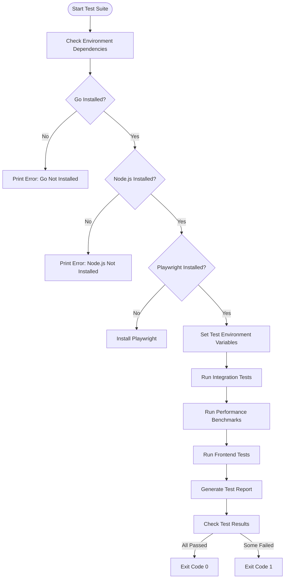
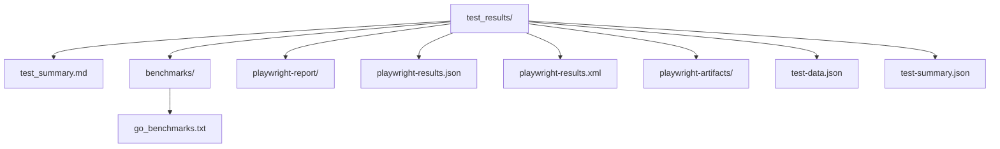

# Test Execution and CI


## Table of Contents
1. [Introduction](#introduction)
2. [Test Execution Workflow](#test-execution-workflow)
3. [Environment Setup and Dependencies](#environment-setup-and-dependencies)
4. [Test Orchestration and Execution Flow](#test-orchestration-and-execution-flow)
5. [Playwright Configuration and Frontend Testing](#playwright-configuration-and-frontend-testing)
6. [Test Reporting and Results Generation](#test-reporting-and-results-generation)
7. [CI/CD Pipeline Integration](#cicd-pipeline-integration)
8. [Troubleshooting Common Issues](#troubleshooting-common-issues)
9. [Best Practices for Test Execution](#best-practices-for-test-execution)

## Introduction
The Exim Control Panel test suite is orchestrated through the `run_tests.sh` script, which coordinates the execution of integration, performance, and frontend tests. This comprehensive test framework ensures the reliability and performance of both backend API services and frontend user interfaces. The test suite leverages Go's built-in testing framework for backend integration and performance tests, while utilizing Playwright for comprehensive frontend end-to-end testing. The orchestration script manages dependencies, environment setup, test execution sequencing, and result reporting, providing a complete solution for both development testing and CI/CD pipeline integration.

## Test Execution Workflow

The test execution workflow follows a structured sequence that ensures comprehensive coverage of the application's functionality. The `run_tests.sh` script serves as the central orchestrator, coordinating the execution of different test categories in a specific order.





**Diagram sources**
- [run_tests.sh](file://tests/run_tests.sh#L1-L254)

**Section sources**
- [run_tests.sh](file://tests/run_tests.sh#L1-L254)

## Environment Setup and Dependencies

The test suite requires specific environment dependencies to execute successfully. The `run_tests.sh` script performs comprehensive environment validation before proceeding with test execution.

### Required Dependencies
The test suite has the following dependencies:
- **Go**: Required for running backend integration and performance tests
- **Node.js**: Required for frontend testing and Playwright execution
- **Playwright**: End-to-end testing framework for the frontend

The script automatically checks for these dependencies and provides appropriate error messages when they are missing:


```bash
# Check if Go is installed
if ! command -v go &> /dev/null; then
    print_error "Go is not installed. Please install Go to run backend tests."
    exit 1
fi

# Check if Node.js is installed
if ! command -v node &> /dev/null; then
    print_error "Node.js is not installed. Please install Node.js to run frontend tests."
    exit 1
fi

# Check if Playwright is installed
if ! command -v npx playwright --version &> /dev/null; then
    print_warning "Playwright is not installed. Installing Playwright..."
    cd web && npm install @playwright/test && npx playwright install
    cd ..
fi
```


### Test Environment Configuration
The script sets up the test environment with specific configuration variables:


```bash
# Set test environment variables
export TEST_ENV=true
export DATABASE_PATH=":memory:"
export LOG_LEVEL=error
```


These environment variables configure the application to run in test mode, use an in-memory database for isolation, and set the log level to minimize output during testing.

**Section sources**
- [run_tests.sh](file://tests/run_tests.sh#L48-L53)

## Test Orchestration and Execution Flow

The test orchestration is managed through a series of functions that handle different test categories. The main execution flow is controlled by the `main()` function, which coordinates the execution of integration, performance, and frontend tests.

### Integration and Performance Tests
The `run_go_tests()` function executes Go-based integration and performance tests:


```bash
run_go_tests() {
    print_status "Running Go integration tests..."
    
    if go test -v ./tests/integration/... -timeout 30s; then
        print_success "Integration tests passed"
    else
        print_error "Integration tests failed"
        return 1
    fi
    
    print_status "Running Go performance tests..."
    
    if go test -v ./tests/performance/... -timeout 60s -bench=. -benchmem; then
        print_success "Performance tests completed"
    else
        print_error "Performance tests failed"
        return 1
    fi
}
```


This function runs all integration tests in the `tests/integration/` directory with a 30-second timeout, followed by performance tests with a 60-second timeout. The `-bench=.` and `-benchmem` flags enable benchmark execution and memory profiling.

### Frontend Tests
The `run_frontend_tests()` function manages the execution of Playwright frontend tests:


```bash
run_frontend_tests() {
    print_status "Running frontend tests with Playwright..."
    
    cd web
    
    # Install dependencies if needed
    if [ ! -d "node_modules" ]; then
        print_status "Installing frontend dependencies..."
        npm install
    fi
    
    # Build frontend for testing
    print_status "Building frontend for testing..."
    npm run build
    
    # Start development server in background
    print_status "Starting development server..."
    npm run dev &
    DEV_SERVER_PID=$!
    
    # Wait for server to start
    sleep 5
    
    # Run Playwright tests
    if npx playwright test ../tests/frontend/ --reporter=html; then
        print_success "Frontend tests passed"
        TEST_RESULT=0
    else
        print_error "Frontend tests failed"
        TEST_RESULT=1
    fi
    
    # Stop development server
    kill $DEV_SERVER_PID 2>/dev/null || true
    
    cd ..
    return $TEST_RESULT
}
```


This function handles the complete frontend testing workflow:
1. Changes to the web directory
2. Installs npm dependencies if missing
3. Builds the frontend application
4. Starts the development server in the background
5. Waits for the server to become available
6. Executes Playwright tests with HTML reporting
7. Stops the development server
8. Returns the test result

### Performance Benchmarks
The `run_performance_benchmarks()` function executes detailed performance benchmarks:


```bash
run_performance_benchmarks() {
    print_status "Running performance benchmarks..."
    
    # Create benchmark results directory
    mkdir -p test_results/benchmarks
    
    # Run Go benchmarks with output
    go test -v ./tests/performance/... -bench=. -benchmem -benchtime=10s > test_results/benchmarks/go_benchmarks.txt 2>&1
    
    print_success "Performance benchmarks completed. Results saved to test_results/benchmarks/"
}
```


This function runs Go benchmarks with extended duration (10 seconds) and captures the output in a dedicated results file.

**Section sources**
- [run_tests.sh](file://tests/run_tests.sh#L79-L130)

## Playwright Configuration and Frontend Testing

The frontend testing is configured through the `playwright.config.ts` file, which defines the test environment, browser configurations, and reporting options.

### Playwright Configuration
The configuration file sets up multiple testing environments:


```typescript
export default defineConfig({
  testDir: './frontend',
  fullyParallel: true,
  forbidOnly: !!process.env.CI,
  retries: process.env.CI ? 2 : 0,
  workers: process.env.CI ? 1 : undefined,
  reporter: [
    ['html', { outputFolder: '../test_results/playwright-report' }],
    ['json', { outputFile: '../test_results/playwright-results.json' }],
    ['junit', { outputFile: '../test_results/playwright-results.xml' }],
  ],
  use: {
    baseURL: process.env.BASE_URL || 'http://localhost:3000',
    trace: 'on-first-retry',
    screenshot: 'only-on-failure',
    video: 'retain-on-failure',
    actionTimeout: 10000,
    navigationTimeout: 30000,
  },
  projects: [
    { name: 'chromium', use: { ...devices['Desktop Chrome'] } },
    { name: 'firefox', use: { ...devices['Desktop Firefox'] } },
    { name: 'webkit', use: { ...devices['Desktop Safari'] } },
    { name: 'Mobile Chrome', use: { ...devices['Pixel 5'] } },
    { name: 'Mobile Safari', use: { ...devices['iPhone 12'] } },
    { name: 'Microsoft Edge', use: { ...devices['Desktop Edge'], channel: 'msedge' } },
    { name: 'Google Chrome', use: { ...devices['Desktop Chrome'], channel: 'chrome' } },
  ],
  webServer: process.env.CI ? undefined : {
    command: 'cd ../web && npm run dev',
    url: 'http://localhost:3000',
    reuseExistingServer: !process.env.CI,
    timeout: 120000,
  },
  globalSetup: require.resolve('./setup/global-setup.ts'),
  globalTeardown: require.resolve('./setup/global-teardown.ts'),
  timeout: 60000,
  expect: { timeout: 10000 },
  outputDir: '../test_results/playwright-artifacts',
});
```


Key configuration aspects:
- **Test Directory**: Specifies `./frontend` as the location of test files
- **Parallel Execution**: Enables full parallelization of tests
- **CI-Specific Settings**: Adjusts retry behavior and worker count for CI environments
- **Multiple Reporters**: Generates HTML, JSON, and JUnit reports for different use cases
- **Browser Coverage**: Tests across multiple browsers and devices
- **Global Setup/Teardown**: Executes setup and teardown scripts before and after tests
- **Artifact Collection**: Captures traces, screenshots, and videos for failed tests

### Global Setup and Teardown
The global setup and teardown scripts handle test environment initialization and cleanup.

#### Global Setup
The `global-setup.ts` file prepares the test environment:


```typescript
async function globalSetup(config: FullConfig) {
  console.log('🚀 Starting global test setup...');

  const browser = await chromium.launch();
  const context = await browser.newContext();
  const page = await context.newPage();

  try {
    // Health check - verify services are running
    const baseURL = process.env.BASE_URL || 'http://localhost:3000';
    const apiURL = process.env.API_URL || 'http://localhost:8080';

    try {
      await page.goto(baseURL, { timeout: 10000 });
      console.log('✅ Frontend server is accessible');
    } catch (error) {
      console.warn('⚠️  Frontend server not accessible, tests will use mocked responses');
    }

    try {
      const response = await page.request.get(`${apiURL}/api/v1/health`);
      if (response.ok()) {
        console.log('✅ Backend API is accessible');
      } else {
        console.warn('⚠️  Backend API not accessible, tests will use mocked responses');
      }
    } catch (error) {
      console.warn('⚠️  Backend API not accessible, tests will use mocked responses');
    }

    // Set up test data storage
    const testDataPath = './test_results/test-data.json';
    const testData = {
      setupTime: new Date().toISOString(),
      testUsers: [
        {
          username: 'testuser',
          email: 'test@example.com',
          password: 'testpass123',
        },
      ],
      mockData: {
        queueMessages: 150,
        logEntries: 10000,
        users: 5,
      },
    };

    // Save test data for use in tests
    const fs = require('fs');
    const path = require('path');
    
    // Ensure directory exists
    const dir = path.dirname(testDataPath);
    if (!fs.existsSync(dir)) {
      fs.mkdirSync(dir, { recursive: true });
    }
    
    fs.writeFileSync(testDataPath, JSON.stringify(testData, null, 2));
    console.log('✅ Test data configuration saved');

  } catch (error) {
    console.error('❌ Global setup failed:', error);
    throw error;
  } finally {
    await context.close();
    await browser.close();
  }

  console.log('✅ Global test setup completed');
}
```


#### Global Teardown
The `global-teardown.ts` file cleans up after tests:


```typescript
async function globalTeardown(config: FullConfig) {
  console.log('🧹 Starting global test teardown...');

  try {
    // Clean up test data
    console.log('Cleaning up test data...');

    // Remove temporary test files
    const fs = require('fs');
    const path = require('path');
    
    const testDataPath = './test_results/test-data.json';
    if (fs.existsSync(testDataPath)) {
      fs.unlinkSync(testDataPath);
      console.log('✅ Test data file cleaned up');
    }

    // Clean up any temporary databases or files created during tests
    const tempFiles = [
      './test_results/temp_*.db',
      './test_results/temp_*.log',
    ];

    for (const pattern of tempFiles) {
      const glob = require('glob');
      const files = glob.sync(pattern);
      for (const file of files) {
        try {
          fs.unlinkSync(file);
          console.log(`✅ Cleaned up temporary file: ${file}`);
        } catch (error) {
          console.warn(`⚠️  Could not clean up file ${file}:`, error.message);
        }
      }
    }

    // Generate test summary
    const summaryPath = './test_results/test-summary.json';
    const summary = {
      teardownTime: new Date().toISOString(),
      testRun: {
        completed: true,
        duration: Date.now() - (global.testStartTime || Date.now()),
      },
      cleanup: {
        tempFilesRemoved: true,
        testDataCleaned: true,
      },
    };

    fs.writeFileSync(summaryPath, JSON.stringify(summary, null, 2));
    console.log('✅ Test summary saved');

  } catch (error) {
    console.error('❌ Global teardown failed:', error);
    // Don't throw error in teardown to avoid masking test failures
  }

  console.log('✅ Global test teardown completed');
}
```


**Section sources**
- [playwright.config.ts](file://tests/playwright.config.ts#L1-L103)
- [global-setup.ts](file://tests/setup/global-setup.ts#L1-L91)
- [global-teardown.ts](file://tests/setup/global-teardown.ts#L1-L70)

## Test Reporting and Results Generation

The test suite generates comprehensive reports that document test execution results, performance metrics, and recommendations.

### Test Report Generation
The `generate_test_report()` function creates a detailed markdown report:


```bash
generate_test_report() {
    print_status "Generating test report..."
    
    mkdir -p test_results
    
    cat > test_results/test_summary.md << EOF
# Exim Control Panel Test Results

## Test Execution Summary

**Date:** $(date)
**Environment:** Test
**Go Version:** $(go version)
**Node Version:** $(node --version)

## Test Categories

### ✅ Integration Tests
- API endpoint testing
- Authentication flow testing
- Database operations testing
- Error handling testing

### ⚡ Performance Tests
- Database operation benchmarks
- Log processing benchmarks
- Streaming processor benchmarks
- Large dataset performance tests
- Concurrent operation tests

### 🎭 Frontend Tests (Playwright)
- Queue management interface testing
- Log viewer interface testing
- Virtual scrolling performance testing
- Real-time update testing
- Error state handling testing

## Performance Benchmarks

See detailed benchmark results in \`benchmarks/go_benchmarks.txt\`

## Frontend Test Results

Playwright test results are available in the HTML report.

## Recommendations

1. **Database Optimization**: Ensure proper indexing for large datasets
2. **Frontend Performance**: Use virtual scrolling for large lists
3. **Real-time Updates**: Implement efficient WebSocket handling
4. **Error Handling**: Comprehensive error state management
5. **Caching**: Implement appropriate caching strategies

EOF

    print_success "Test report generated at test_results/test_summary.md"
}
```


### Results Directory Structure
The test results are organized in a structured directory:





**Diagram sources**
- [run_tests.sh](file://tests/run_tests.sh#L132-L186)
- [global-teardown.ts](file://tests/setup/global-teardown.ts#L41-L69)

**Section sources**
- [run_tests.sh](file://tests/run_tests.sh#L132-L186)
- [global-teardown.ts](file://tests/setup/global-teardown.ts#L41-L69)

## CI/CD Pipeline Integration

The test suite is designed for seamless integration with CI/CD pipelines, providing reliable exit codes and comprehensive reporting.

### Exit Code Handling
The script implements robust exit code handling to indicate test success or failure:


```bash
main() {
    local exit_code=0
    
    # Create test results directory
    mkdir -p test_results
    
    # Run Go tests
    if ! run_go_tests; then
        exit_code=1
    fi
    
    # Run performance benchmarks
    run_performance_benchmarks
    
    # Run frontend tests
    if ! run_frontend_tests; then
        exit_code=1
    fi
    
    # Generate test report
    generate_test_report
    
    if [ $exit_code -eq 0 ]; then
        print_success "All tests completed successfully! 🎉"
        echo ""
        echo "📊 Test Results:"
        echo "  - Integration Tests: ✅ Passed"
        echo "  - Performance Tests: ✅ Completed"
        echo "  - Frontend Tests: ✅ Passed"
        echo ""
        echo "📁 Results saved to: test_results/"
    else
        print_error "Some tests failed. Please check the output above."
        echo ""
        echo "📊 Test Results:"
        echo "  - Some tests failed ❌"
        echo ""
        echo "📁 Results saved to: test_results/"
    fi
    
    exit $exit_code
}
```


The script uses a single exit code variable that is set to 1 if any test category fails. This ensures that CI/CD systems can reliably determine the overall test result.

### CI-Specific Configuration
The Playwright configuration includes CI-specific settings:


```typescript
retries: process.env.CI ? 2 : 0,
workers: process.env.CI ? 1 : undefined,
```


These settings increase test reliability in CI environments by enabling retries and limiting parallel workers, which helps avoid resource contention.

### Test Execution Modes
The script supports multiple execution modes through command-line arguments:


```bash
case "${1:-all}" in
    "integration")
        print_status "Running integration tests only..."
        run_go_tests
        ;;
    "performance")
        print_status "Running performance tests only..."
        run_performance_benchmarks
        ;;
    "frontend")
        print_status "Running frontend tests only..."
        run_frontend_tests
        ;;
    "all"|*)
        print_status "Running all tests..."
        main
        ;;
esac
```


This allows for targeted test execution in different CI/CD stages, such as running only integration tests during pull request validation and the full suite in production deployment.

**Section sources**
- [run_tests.sh](file://tests/run_tests.sh#L186-L254)

## Troubleshooting Common Issues

### Missing Dependencies
**Issue**: Go, Node.js, or Playwright not installed
**Solution**: Install the required dependencies:
- Install Go from https://golang.org/dl/
- Install Node.js from https://nodejs.org/
- Playwright will be installed automatically by the script

### Port Conflicts
**Issue**: Development server fails to start due to port conflicts
**Solution**: 
- Ensure port 3000 is available
- Check for other processes using the port: `lsof -i :3000` (macOS/Linux) or `netstat -ano | findstr :3000` (Windows)
- Terminate conflicting processes or modify the baseURL in `playwright.config.ts`

### Timeout Issues
**Issue**: Tests failing due to timeouts
**Solution**:
- Increase timeout values in `playwright.config.ts`
- Optimize application performance
- Ensure adequate system resources are available

### Database Connection Issues
**Issue**: Integration tests failing due to database issues
**Solution**:
- Verify the in-memory database is properly configured
- Check for proper database schema initialization
- Ensure test database cleanup between runs

### Playwright Browser Issues
**Issue**: Playwright unable to launch browsers
**Solution**:
- Install Playwright browsers: `npx playwright install`
- Ensure proper system dependencies are installed
- Run with elevated privileges if necessary

## Best Practices for Test Execution

### Development Testing
During development, use targeted test execution:

```bash
# Run only integration tests
./tests/run_tests.sh integration

# Run only frontend tests
./tests/run_tests.sh frontend

# Run only performance tests
./tests/run_tests.sh performance
```


This approach provides faster feedback cycles and focuses on the relevant test category.

### Production CI Testing
In production CI/CD pipelines, execute the full test suite:

```bash
# Run all tests
./tests/run_tests.sh all
```


Ensure the following practices:
- Run tests in isolated environments
- Use consistent dependency versions
- Capture comprehensive test artifacts
- Monitor test execution time for performance regressions

### Performance Monitoring
Regularly monitor performance benchmarks:
- Track benchmark results over time
- Set performance thresholds
- Investigate performance regressions promptly
- Optimize database queries and frontend rendering

### Test Data Management
Maintain clean test data:
- Use in-memory databases for isolation
- Implement proper test data cleanup
- Avoid test data pollution between runs
- Use realistic but controlled test datasets

### Reporting and Documentation
Leverage the comprehensive reporting:
- Review the generated test summary
- Analyze Playwright HTML reports for frontend issues
- Monitor performance benchmark trends
- Document test results and findings

**Referenced Files in This Document**   
- [run_tests.sh](file://tests/run_tests.sh)
- [playwright.config.ts](file://tests/playwright.config.ts)
- [global-setup.ts](file://tests/setup/global-setup.ts)
- [global-teardown.ts](file://tests/setup/global-teardown.ts)
- [api_test.go](file://tests/integration/api_test.go)
- [performance_test.go](file://tests/performance/performance_test.go)
- [logs.spec.ts](file://tests/frontend/logs.spec.ts)
- [queue.spec.ts](file://tests/frontend/queue.spec.ts)