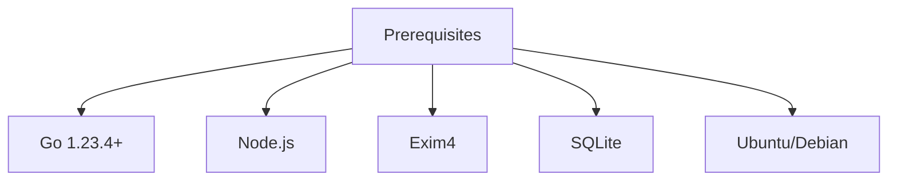
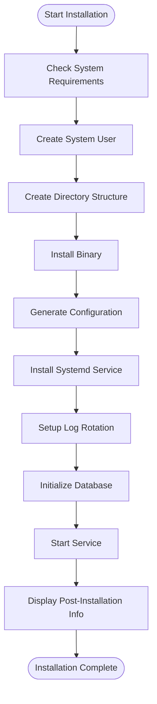
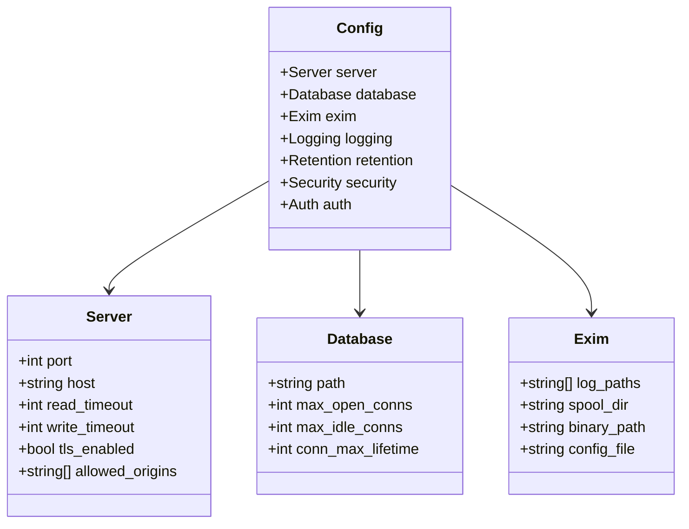
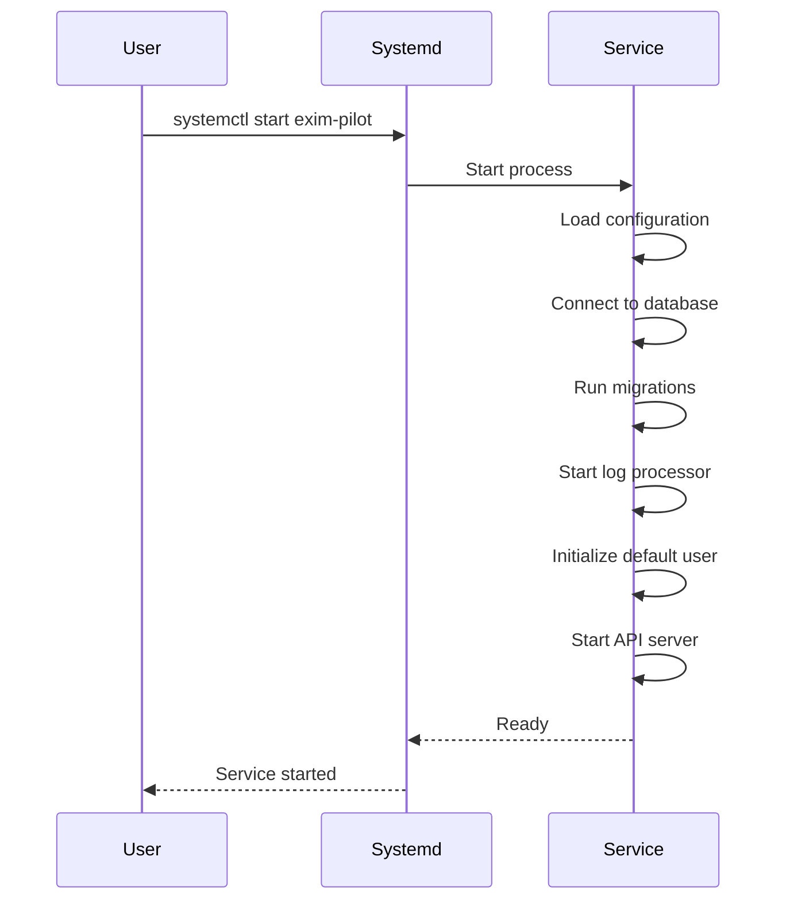
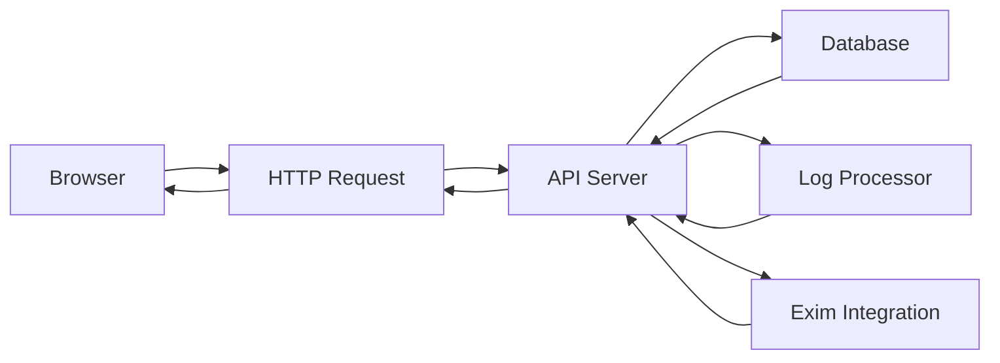
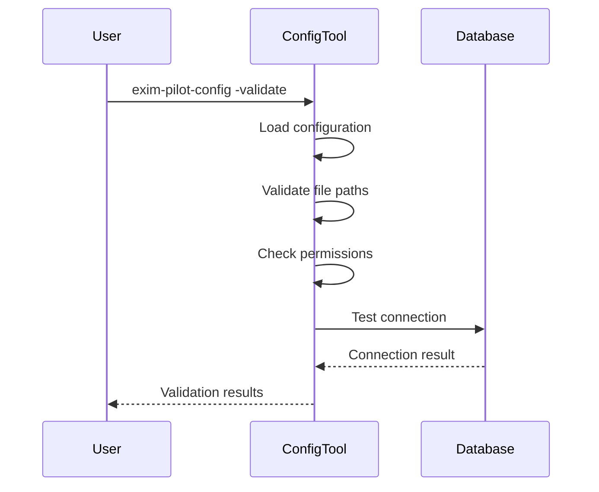
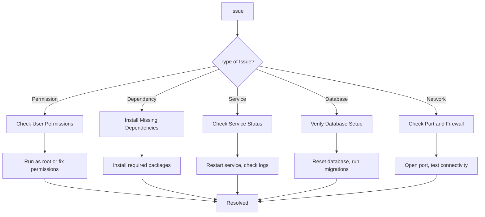

# Getting Started


## Table of Contents
1. [Prerequisites](#prerequisites)
2. [Installation Using Deployment Script](#installation-using-deployment-script)
3. [Configuration File Setup](#configuration-file-setup)
4. [Service Initialization](#service-initialization)
5. [Accessing the Web Interface](#accessing-the-web-interface)
6. [Basic Interactions](#basic-interactions)
7. [Troubleshooting Common Issues](#troubleshooting-common-issues)

## Prerequisites

Before installing exim-pilot, ensure your system meets the following requirements:

- **Go version**: 1.23.4 or higher
- **Node.js**: Required for frontend development and building the web interface
- **SQLite**: Used as the primary database backend
- **Exim4**: Mail transfer agent that exim-pilot monitors and manages
- **Operating System**: Ubuntu/Debian systems are officially supported

The application uses Go for the backend and React with TypeScript for the frontend. The `go.mod` file specifies Go module dependencies, while `web/package.json` defines frontend dependencies including React 19.1.1, Vite 7.1.2, Tailwind CSS, and ECharts for data visualization.





**Section sources**
- [README.md](file://README.md#L21)
- [package.json](file://web/package.json#L1-L46)
- [connection.go](file://internal/database/connection.go#L1-L10)

## Installation Using Deployment Script

The installation process is automated through a deployment script located in the `deployments` directory. This script handles user creation, directory setup, configuration generation, and service registration.

To install exim-pilot:

1. Navigate to the project root directory:

```bash
cd /path/to/exim-pilot
```


2. Make the installation script executable:

```bash
chmod +x deployments/install.sh
```


3. Run the installation script as root:

```bash
sudo ./deployments/install.sh
```


The installation script performs the following steps:
- Verifies system requirements (Ubuntu/Debian, Exim4 installation, systemd availability)
- Creates a dedicated system user and group (`exim-pilot`)
- Sets up the directory structure under `/opt/exim-pilot`
- Installs the compiled binary
- Generates a default configuration file with secure defaults
- Configures systemd service management
- Sets up log rotation
- Initializes the database with migrations
- Starts and enables the service





**Section sources**
- [install.sh](file://deployments/install.sh#L1-L439)

## Configuration File Setup

The configuration file is written in YAML format and controls all aspects of the application's behavior. A sample configuration file is provided as `config.example.yaml`.

To set up the configuration:

1. Copy the example configuration:

```bash
cp config/config.example.yaml /opt/exim-pilot/config/config.yaml
```


2. Review and customize the configuration parameters:

**Server Configuration**

```yaml
server:
  port: 8080
  host: "0.0.0.0"
  tls_enabled: false
  allowed_origins: ["*"]
```


**Database Configuration**

```yaml
database:
  path: "/opt/exim-pilot/data/exim-pilot.db"
  max_open_conns: 25
  max_idle_conns: 5
```


**Exim Integration**

```yaml
exim:
  log_paths:
    - "/var/log/exim4/mainlog"
    - "/var/log/exim4/rejectlog"
    - "/var/log/exim4/paniclog"
  spool_dir: "/var/spool/exim4"
  binary_path: "/usr/sbin/exim4"
```


**Security Settings**

```yaml
security:
  session_timeout: 60
  max_login_attempts: 5
  login_lockout_time: 15
  csrf_protection: true
```


**Authentication**

```yaml
auth:
  default_username: "admin"
  default_password: "admin123"  # CHANGE THIS AFTER INSTALLATION
```


The configuration can also be overridden using environment variables such as `EXIM_PILOT_PORT`, `EXIM_PILOT_DB_PATH`, and `EXIM_PILOT_ADMIN_PASSWORD`.





**Section sources**
- [config.example.yaml](file://config/config.example.yaml#L1-L77)
- [main.go](file://cmd/exim-pilot/main.go#L1-L233)

## Service Initialization

After installation, you can manage the exim-pilot service using systemd commands:

**Start the service:**

```bash
sudo systemctl start exim-pilot
```


**Stop the service:**

```bash
sudo systemctl stop exim-pilot
```


**Restart the service:**

```bash
sudo systemctl restart exim-pilot
```


**Check service status:**

```bash
sudo systemctl status exim-pilot
```


**Enable auto-start on boot:**

```bash
sudo systemctl enable exim-pilot
```


For development purposes, you can also run the application directly:


```bash
# Build the binary
go build -o exim-pilot cmd/exim-pilot/main.go

# Run with default configuration
./exim-pilot

# Run with custom configuration
./exim-pilot -config /path/to/config.yaml

# Show help
./exim-pilot -help
```


The application also provides utility commands for database management:


```bash
# Run database migrations
./exim-pilot --migrate-up

# Rollback database migration
./exim-pilot --migrate-down

# Show version information
./exim-pilot --version
```





**Section sources**
- [install.sh](file://deployments/install.sh#L1-L439)
- [main.go](file://cmd/exim-pilot/main.go#L1-L233)

## Accessing the Web Interface

Once the service is running, you can access the web interface through a web browser.

1. Open your browser and navigate to:

```
http://localhost:8080
```


2. Log in with the default credentials:
- **Username**: admin
- **Password**: admin123

3. After first login, immediately change the password through the user settings menu.

The web interface is built with React and TypeScript, using Vite as the build tool. It features a responsive design with components for dashboard, logs, queue management, message tracing, performance monitoring, and reporting.

Key features of the web interface:
- Real-time mail queue monitoring
- Comprehensive log analysis and search
- Message tracing and delivery history
- Deliverability reporting and analytics
- Security and audit logging





**Section sources**
- [main.go](file://cmd/exim-pilot/main.go#L1-L233)
- [package.json](file://web/package.json#L1-L46)

## Basic Interactions

After logging in, you can perform basic interactions with the system:

**Viewing the Dashboard**
- The dashboard displays key metrics including:
  - Total messages in queue
  - Deferred and frozen messages
  - Message throughput over time
  - System health status

**Checking Service Status**
- Use the systemd command to check service status:

```bash
systemctl status exim-pilot
```


- View application logs:

```bash
journalctl -u exim-pilot -f
```


**Using the Configuration Tool**
The `exim-pilot-config` utility provides several functions:


```bash
# Validate configuration file
exim-pilot-config -validate -config /opt/exim-pilot/config/config.yaml

# Generate default configuration
exim-pilot-config -generate -config /opt/exim-pilot/config/config.yaml

# Check database migration status
exim-pilot-config -migrate status -config /opt/exim-pilot/config/config.yaml

# Run database migrations
exim-pilot-config -migrate up -config /opt/exim-pilot/config/config.yaml
```


**Resetting the Database**
To reset the database to initial state:

```bash
go run cmd/reset-db/main.go
```


This will:
- Remove existing database files
- Create a new database
- Run migrations
- Create the default admin user





**Section sources**
- [main.go](file://cmd/exim-pilot/main.go#L1-L233)
- [reset-db/main.go](file://cmd/reset-db/main.go#L1-L80)
- [exim-pilot-config/main.go](file://cmd/exim-pilot-config/main.go#L1-L344)

## Troubleshooting Common Issues

This section addresses common setup issues and their solutions.

**Permission Errors**
If you encounter permission errors during installation:

1. Ensure you're running the installation script as root:

```bash
sudo ./deployments/install.sh
```


2. Verify the exim-pilot user has proper permissions:

```bash
sudo usermod -a -G adm exim-pilot
```


3. Check directory permissions:

```bash
sudo chown -R exim-pilot:exim-pilot /opt/exim-pilot
sudo chmod 750 /opt/exim-pilot/data /opt/exim-pilot/logs
```


**Missing Dependencies**
If required dependencies are missing:

1. Install Go 1.23.4+:

```bash
# Follow official Go installation instructions
```


2. Install Node.js and npm:

```bash
sudo apt update
sudo apt install nodejs npm
```


3. Install Exim4:

```bash
sudo apt install exim4-daemon-heavy
```


**Service Fails to Start**
If the service fails to start:

1. Check service status:

```bash
systemctl status exim-pilot
```


2. View detailed logs:

```bash
journalctl -u exim-pilot -f
```


3. Verify configuration file:

```bash
exim-pilot-config -validate -config /opt/exim-pilot/config/config.yaml
```


4. Check database directory permissions:

```bash
sudo mkdir -p /opt/exim-pilot/data
sudo chown exim-pilot:exim-pilot /opt/exim-pilot/data
```


**Database Initialization Issues**
If database initialization fails:

1. Reset the database:

```bash
go run cmd/reset-db/main.go
```


2. Manually run migrations:

```bash
exim-pilot-config -migrate up -config /opt/exim-pilot/config/config.yaml
```


3. Verify SQLite installation:

```bash
sqlite3 --version
```


**Web Interface Not Accessible**
If the web interface is not accessible:

1. Check if the service is running:

```bash
systemctl status exim-pilot
```


2. Verify the port is listening:

```bash
netstat -tlnp | grep :8080
```


3. Check firewall settings:

```bash
sudo ufw allow 8080
```


4. Test locally:

```bash
curl http://localhost:8080/health
```





**Section sources**
- [install.sh](file://deployments/install.sh#L1-L439)
- [main.go](file://cmd/exim-pilot/main.go#L1-L233)
- [reset-db/main.go](file://cmd/reset-db/main.go#L1-L80)
- [exim-pilot-config/main.go](file://cmd/exim-pilot-config/main.go#L1-L344)

**Referenced Files in This Document**   
- [install.sh](file://deployments/install.sh)
- [config.example.yaml](file://config/config.example.yaml)
- [main.go](file://cmd/exim-pilot/main.go)
- [reset-db/main.go](file://cmd/reset-db/main.go)
- [exim-pilot-config/main.go](file://cmd/exim-pilot-config/main.go)
- [connection.go](file://internal/database/connection.go)
- [README.md](file://README.md)
- [package.json](file://web/package.json)