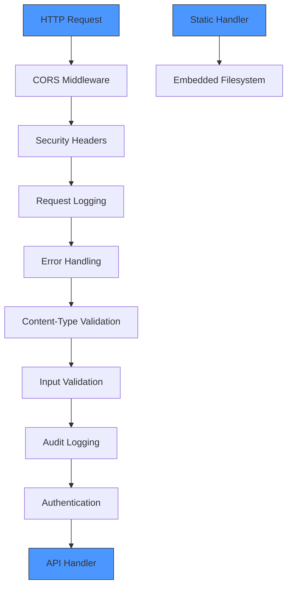
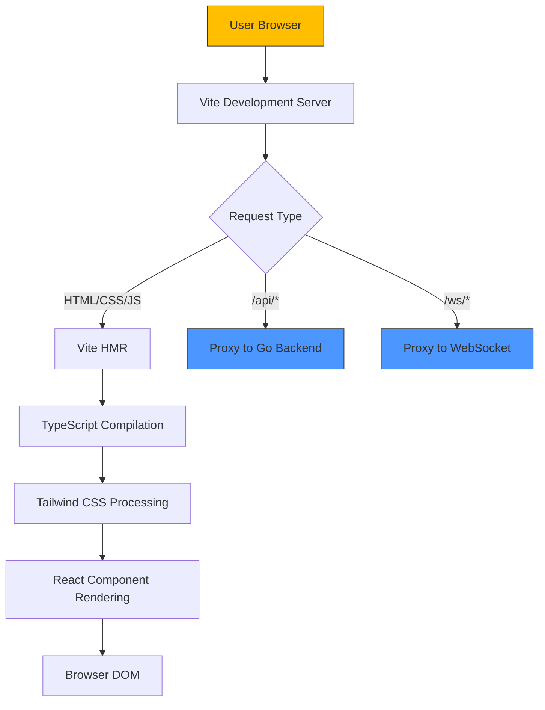
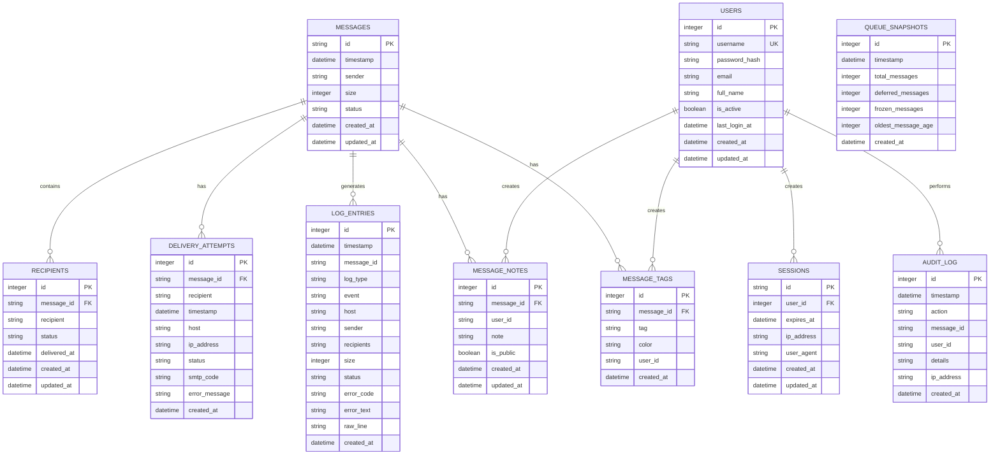
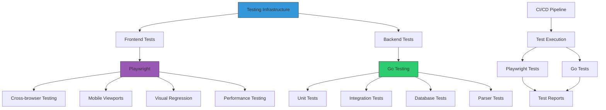
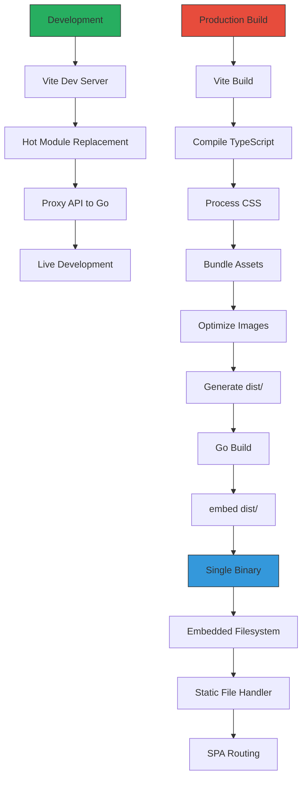
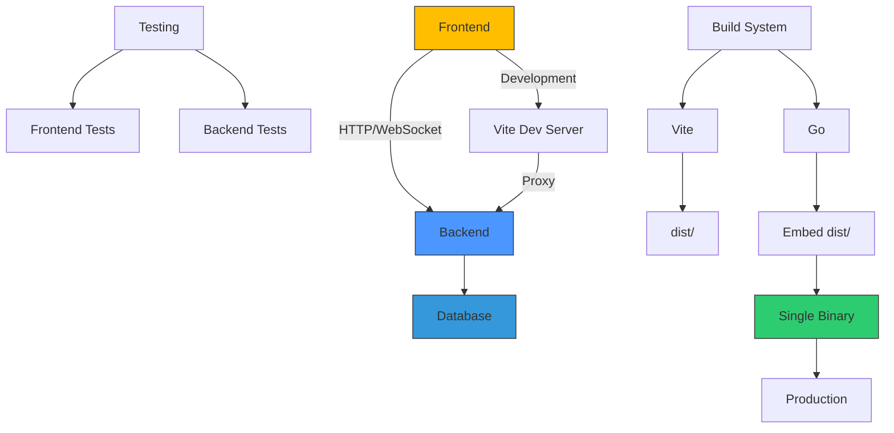

# Technology Stack

## Table of Contents
1. [Backend Stack](#backend-stack)
2. [Frontend Stack](#frontend-stack)
3. [Database Layer](#database-layer)
4. [Testing Infrastructure](#testing-infrastructure)
5. [Build and Bundling System](#build-and-bundling-system)
6. [Technology Integration Overview](#technology-integration-overview)

## Backend Stack

The backend of exim-pilot is built using Go (Golang), leveraging its performance, concurrency model, and strong standard library. The primary web framework used is **gorilla/mux**, a powerful URL router and dispatcher that provides flexible request routing capabilities.

The `go.mod` file specifies Go version 1.23.4 as the language version, indicating the project uses modern Go features and tooling. Key backend dependencies include:

- **github.com/gorilla/mux v1.8.1**: HTTP router for handling API routes with pattern matching, middleware support, and subrouters
- **github.com/gorilla/handlers v1.5.2**: Provides common HTTP middleware including CORS, logging, and compression
- **golang.org/x/crypto v0.41.0**: Cryptographic functions for secure authentication and data protection
- **gopkg.in/yaml.v3 v3.0.1**: YAML parsing for configuration file handling
- **github.com/fsnotify/fsnotify v1.9.0**: File system monitoring for configuration and log file changes

The application entry point is located in `cmd/exim-pilot/main.go`, which initializes the server, loads configuration, connects to the database, and starts the API service. The server implementation in `internal/api/server.go` uses gorilla/mux to define a comprehensive API structure with versioned endpoints (`/api/v1`) and proper middleware chaining.

Key architectural decisions in the backend include:
- Use of subrouters to organize API endpoints by functionality
- Implementation of middleware for CORS, security headers, authentication, and error handling
- Structured routing with clear separation between public and protected routes
- Graceful shutdown handling with context-based timeout

**Diagram sources**
- [server.go](file://internal/api/server.go#L120-L150)

**Section sources**
- [go.mod](file://go.mod#L1-L17)
- [main.go](file://cmd/exim-pilot/main.go#L1-L232)
- [server.go](file://internal/api/server.go#L1-L274)

## Frontend Stack

The frontend of exim-pilot is built with a modern JavaScript stack centered around React, TypeScript, Vite, and Tailwind CSS. This combination provides a fast, type-safe, and visually consistent user interface.

The `web/package.json` file reveals the following key frontend technologies:

- **React 19.1.1**: Component-based UI library providing a declarative approach to building interfaces
- **TypeScript 5.8.3**: Typed superset of JavaScript that enhances code quality and developer experience
- **Vite 7.1.2**: Next-generation frontend build tool that provides extremely fast development server startup and HMR
- **Tailwind CSS 3.4.17**: Utility-first CSS framework for rapid UI development with consistent design tokens
- **React Router 7.8.2**: Client-side routing for the single-page application
- **ECharts 5.6.0**: Data visualization library for creating interactive charts and graphs

The Vite configuration in `vite.config.ts` is optimized for production embedding, with several key features:
- Manual chunk splitting to optimize caching (vendor, charts, router, utils)
- Asset inlining for small files (<4KB) to reduce HTTP requests
- Hashed filenames for cache busting
- Terser for JavaScript minification
- Development server proxy to forward API requests to the Go backend on port 8080

Tailwind CSS is configured in `tailwind.config.js` with content scanning across all source files to purge unused CSS in production, ensuring minimal bundle size.

**Diagram sources**
- [vite.config.ts](file://web/vite.config.ts#L1-L61)
- [package.json](file://web/package.json#L1-L45)

**Section sources**
- [package.json](file://web/package.json#L1-L45)
- [vite.config.ts](file://web/vite.config.ts#L1-L61)
- [tailwind.config.js](file://web/tailwind.config.js#L1-L10)

## Database Layer

exim-pilot uses SQLite as its database engine, providing a lightweight, serverless, and zero-configuration data storage solution that is ideal for single-server applications.

The database implementation is located in `internal/database/` with the following key components:

- **connection.go**: Manages database connections with connection pooling configuration
- **schema.go**: Defines the complete database schema with tables and indexes
- **migrations.go**: Handles database schema migrations
- **repository.go**: Provides data access methods

The `go.mod` file specifies **github.com/mattn/go-sqlite3 v1.14.22** as the SQLite driver, which is a widely-used, pure Go SQLite driver.

Key database design features include:
- Use of WAL (Write-Ahead Logging) mode for improved concurrency
- Foreign key constraints enforcement
- Comprehensive indexing strategy optimized for common query patterns
- Support for JSON data types in certain columns for flexible data storage

The schema includes tables for:
- **messages**: Core message tracking with status and metadata
- **recipients**: Message recipients with individual delivery status
- **delivery_attempts**: Historical record of delivery attempts
- **log_entries**: Searchable log history with full-text search support
- **audit_log**: Administrative action tracking
- **queue_snapshots**: Historical queue metrics
- **message_notes** and **message_tags**: Operator annotations and categorization
- **users** and **sessions**: Authentication and session management

**Diagram sources**
- [schema.go](file://internal/database/schema.go#L1-L195)
- [connection.go](file://internal/database/connection.go#L1-L90)

**Section sources**
- [connection.go](file://internal/database/connection.go#L1-L90)
- [schema.go](file://internal/database/schema.go#L1-L195)

## Testing Infrastructure

exim-pilot employs a comprehensive testing strategy with both frontend and backend testing tools.

For frontend testing, the project uses **Playwright**, a modern end-to-end testing framework that supports multiple browsers. The configuration in `tests/playwright.config.ts` shows:
- Testing across Chromium, Firefox, and WebKit
- Mobile viewport testing (Pixel 5, iPhone 12)
- Branded browser testing (Microsoft Edge, Google Chrome)
- HTML, JSON, and JUnit reporting formats
- Automatic trace and screenshot capture on failures
- Local development server startup before tests

The frontend tests in `tests/frontend/` include comprehensive coverage of key features:
- Log viewer functionality with search, filtering, and export
- Queue management operations
- Real-time log tailing
- Error handling and recovery
- Virtual scrolling performance with large datasets

For backend testing, the project uses Go's built-in testing framework with test files following the conventional `_test.go` naming pattern. Test categories include:
- **integration/api_test.go**: API integration tests
- **database/connection_test.go**: Database connection tests
- **database/migrations_test.go**: Database migration tests
- **logprocessor/service_test.go**: Log processing service tests
- **parser/exim_parser_test.go**: Exim log parsing tests

The testing infrastructure supports both development and CI/CD workflows, with configuration options for retry behavior and worker parallelization.

**Diagram sources**
- [playwright.config.ts](file://tests/playwright.config.ts#L1-L102)
- [api_test.go](file://tests/integration/api_test.go)

**Section sources**
- [playwright.config.ts](file://tests/playwright.config.ts#L1-L102)
- [logs.spec.ts](file://tests/frontend/logs.spec.ts#L1-L531)

## Build and Bundling System

The build system in exim-pilot is designed to create a self-contained binary that embeds all frontend assets, enabling simple deployment and distribution.

The process involves two main stages:

1. **Frontend build**: Uses Vite to compile, bundle, and optimize the React application
2. **Backend build**: Uses Go's `embed` feature to package the built frontend assets into the binary

The Vite configuration in `vite.config.ts` is optimized for this workflow:
- Output directory set to `dist`
- Asset directory set to `assets`
- Manual chunk splitting for optimal caching
- Hashed filenames for cache busting
- Terser minification for production

The static asset embedding is handled by the code in `internal/static/`:
- **assets.go**: Defines the embedded filesystem interface
- **embed.go**: Implements the handler for embedded assets with build tag `//go:build embed`
- **dev.go**: Implements the development mode file server with build tag `//go:build !embed`

The `main.go` file initializes the embedded assets with `web.InitEmbeddedAssets()` and the server routes non-API requests to the static handler, which serves the embedded files or falls back to `index.html` for SPA routing.

This approach provides several advantages:
- Single binary deployment
- No dependency on external web servers
- Consistent environment between development and production
- Improved security through reduced attack surface
- Simplified distribution and updates

**Diagram sources**
- [vite.config.ts](file://web/vite.config.ts#L1-L61)
- [embed.go](file://internal/static/embed.go#L1-L145)
- [assets.go](file://internal/static/assets.go#L1-L20)

**Section sources**
- [vite.config.ts](file://web/vite.config.ts#L1-L61)
- [embed.go](file://internal/static/embed.go#L1-L145)
- [assets.go](file://internal/static/assets.go#L1-L20)
- [main.go](file://cmd/exim-pilot/main.go#L1-L232)

## Technology Integration Overview

The technology stack in exim-pilot is carefully integrated to provide a cohesive, high-performance, and maintainable application.

The backend Go application serves as the central hub, providing:
- REST API endpoints for data access
- WebSocket support for real-time updates
- Static file serving for the frontend
- Database connectivity and management
- Configuration and logging infrastructure

The frontend React application consumes the backend API through the `services/api.ts` module, using modern JavaScript features and type safety provided by TypeScript. The Vite development server proxies API requests to the Go backend during development, creating a seamless developer experience.

The SQLite database provides persistent storage with a schema designed for the specific needs of email queue monitoring and log analysis. The Go SQL driver enables efficient database operations with connection pooling and prepared statements.

Testing is integrated at multiple levels:
- Unit and integration tests for Go backend components
- End-to-end tests for React frontend components using Playwright
- Performance tests to ensure responsiveness with large datasets

The build system unifies the frontend and backend through asset embedding, resulting in a single binary that contains both the server and client applications. This eliminates deployment complexity and ensures consistency across environments.

This technology combination delivers several key benefits:
- **Performance**: Go's efficiency and Vite's optimized builds ensure fast response times
- **Maintainability**: TypeScript's type safety and React's component model improve code quality
- **Deployability**: Single binary with embedded assets simplifies deployment
- **Scalability**: SQLite with proper indexing handles typical email server monitoring loads
- **Developer Experience**: Modern tooling with hot reloading and comprehensive testing

**Diagram sources**
- [main.go](file://cmd/exim-pilot/main.go#L1-L232)
- [server.go](file://internal/api/server.go#L1-L274)
- [vite.config.ts](file://web/vite.config.ts#L1-L61)

**Section sources**
- [main.go](file://cmd/exim-pilot/main.go#L1-L232)
- [server.go](file://internal/api/server.go#L1-L274)
- [vite.config.ts](file://web/vite.config.ts#L1-L61)
- [go.mod](file://go.mod#L1-L17)
- [package.json](file://web/package.json#L1-L45)

**Referenced Files in This Document**   
- [go.mod](file://go.mod)
- [package.json](file://web/package.json)
- [vite.config.ts](file://web/vite.config.ts)
- [tailwind.config.js](file://web/tailwind.config.js)
- [embed.go](file://internal/static/embed.go)
- [assets.go](file://internal/static/assets.go)
- [main.go](file://cmd/exim-pilot/main.go)
- [server.go](file://internal/api/server.go)
- [connection.go](file://internal/database/connection.go)
- [schema.go](file://internal/database/schema.go)
- [playwright.config.ts](file://tests/playwright.config.ts)