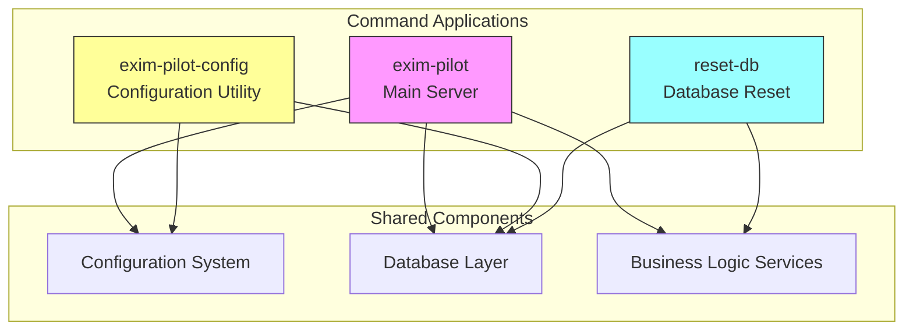
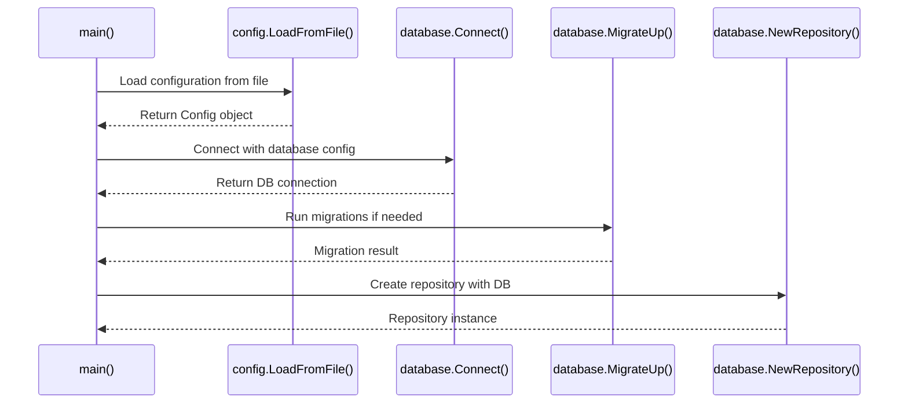
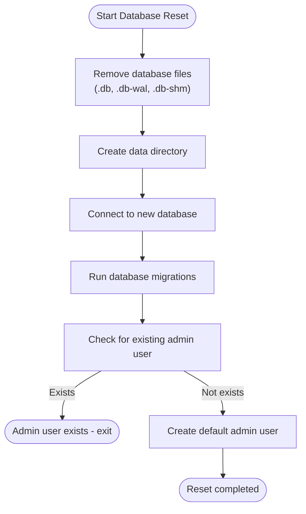
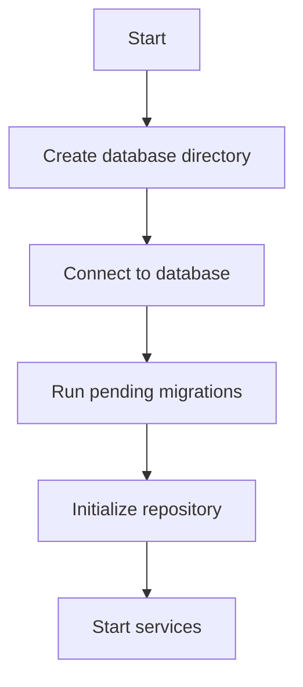
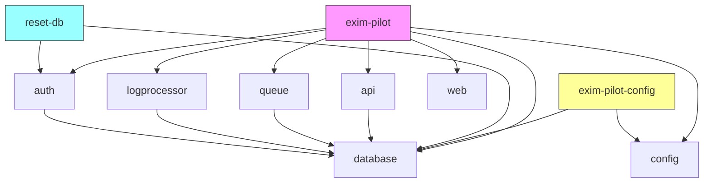

# Command Applications


## Table of Contents
1. [Introduction](#introduction)
2. [Command Applications Overview](#command-applications-overview)
3. [exim-pilot: Main Server Application](#exim-pilot-main-server-application)
4. [exim-pilot-config: Configuration Utility](#exim-pilot-config-configuration-utility)
5. [reset-db: Database Reset Tool](#reset-db-database-reset-tool)
6. [Configuration System](#configuration-system)
7. [Database Initialization and Management](#database-initialization-and-management)
8. [Service Architecture and Dependencies](#service-architecture-and-dependencies)
9. [Development and Maintenance Workflows](#development-and-maintenance-workflows)
10. [Troubleshooting Guide](#troubleshooting-guide)

## Introduction
This document provides a comprehensive overview of the command-line applications in the Exim-Pilot repository. The system consists of three primary executables located in the `cmd/` directory, each serving a distinct purpose in the application lifecycle. These commands work together to provide a complete solution for managing an Exim mail server, with clear separation of concerns between server operations, configuration management, and database maintenance. The applications share a common configuration and database system, enabling consistent behavior across different operational contexts.

## Command Applications Overview

The Exim-Pilot system comprises three command-line applications, each designed for specific operational roles:

- **exim-pilot**: The main server application that provides the web interface and API services
- **exim-pilot-config**: A utility for configuration management and database migration operations
- **reset-db**: A tool for resetting and reinitializing the application database

These applications follow a modular design pattern, sharing internal packages for configuration, database operations, and business logic while maintaining distinct entry points and command-line interfaces. This separation allows for specialized operations without duplicating core functionality.





**Diagram sources**
- [main.go](file://cmd/exim-pilot/main.go)
- [main.go](file://cmd/exim-pilot-config/main.go)
- [main.go](file://cmd/reset-db/main.go)

## exim-pilot: Main Server Application

The `exim-pilot` command serves as the primary server application, responsible for running the web interface and API services that monitor and manage the Exim mail server. This application bootstraps the complete system by initializing configuration, database connections, and various background services.

### Entry Point and Initialization Logic

The main server application begins execution in `cmd/exim-pilot/main.go` with a comprehensive initialization sequence that sets up all required components:


```go
func main() {
	var (
		configPath  = flag.String("config", getDefaultConfigPath(), "Path to configuration file")
		migrateUp   = flag.Bool("migrate-up", false, "Run database migrations up")
		migrateDown = flag.Bool("migrate-down", false, "Run database migrations down")
		versionFlag = flag.Bool("version", false, "Show version information")
		helpFlag    = flag.Bool("help", false, "Show help message")
	)

	flag.Parse()

	if *helpFlag {
		showHelp()
		return
	}

	if *versionFlag {
		showVersion()
		return
	}
```


The application accepts several command-line flags that control its behavior:
- `-config`: Specifies the path to the configuration file (defaults to `/opt/exim-pilot/config/config.yaml`)
- `-migrate-up`: Runs database migrations and exits
- `-migrate-down`: Rolls back the last database migration and exits
- `-version`: Displays version information
- `-help`: Shows help information

### Configuration and Database Initialization

After parsing command-line arguments, the application loads configuration and initializes the database:





**Diagram sources**
- [main.go](file://cmd/exim-pilot/main.go#L50-L100)

The initialization process follows these steps:
1. Load configuration from the specified file path, with environment variable overrides
2. Initialize embedded web assets for the frontend interface
3. Create database configuration from the main configuration
4. Ensure the database directory exists
5. Connect to the SQLite database using the configured parameters
6. Handle any migration commands if specified
7. Run database migrations automatically during normal startup

### Service Initialization and Startup

Once the database is ready, the application initializes various services that handle different aspects of the system:


```go
// Initialize repository
repository := database.NewRepository(db)

// Initialize queue service
queueService := queue.NewService(cfg.Exim.BinaryPath, db)

// Initialize log processing service
logConfig := logprocessor.DefaultServiceConfig()
logService := logprocessor.NewService(repository, logConfig)

// Start log service
if err := logService.Start(); err != nil {
	log.Fatalf("Failed to start log service: %v", err)
}
defer logService.Stop()
```


The key services initialized include:
- **Repository**: Provides data access patterns for database operations
- **Queue Service**: Manages interactions with the Exim mail queue
- **Log Processing Service**: Handles parsing and analysis of Exim log files
- **Authentication Service**: Manages user authentication and session management

### API Server Configuration

The application creates and configures the API server using the initialized services:


```go
// Create API config from main config
apiConfig := &api.Config{
	Port:           cfg.Server.Port,
	Host:           cfg.Server.Host,
	ReadTimeout:    cfg.Server.ReadTimeout,
	WriteTimeout:   cfg.Server.WriteTimeout,
	IdleTimeout:    cfg.Server.IdleTimeout,
	AllowedOrigins: cfg.Server.AllowedOrigins,
	LogRequests:    cfg.Server.LogRequests,
}

// Initialize API server
server := api.NewServer(apiConfig, queueService, logService, repository, db)
```


The API server is configured with middleware for CORS, security headers, request logging, error handling, and authentication. It exposes endpoints for:
- Health checks
- Authentication (login, logout, session management)
- Queue management (listing, searching, message operations)
- Log monitoring and search
- Reporting and analytics
- Message tracing and delivery analysis

### Graceful Shutdown

The application implements graceful shutdown to ensure proper cleanup of resources:


```go
// Wait for interrupt signal to gracefully shutdown
quit := make(chan os.Signal, 1)
signal.Notify(quit, syscall.SIGINT, syscall.SIGTERM)
<-quit

log.Println("Shutting down server...")

// Create a context with timeout for graceful shutdown
ctx, cancel := context.WithTimeout(context.Background(), 30*time.Second)
defer cancel()

if err := server.Stop(ctx); err != nil {
	log.Fatalf("Server forced to shutdown: %v", err)
}
```


When the application receives a SIGINT or SIGTERM signal, it initiates a graceful shutdown sequence that stops the server within a 30-second timeout period, allowing in-progress requests to complete.

### Running the Main Server

To run the main server application:


```bash
# Run with default configuration
go run cmd/exim-pilot/main.go

# Specify custom configuration file
go run cmd/exim-pilot/main.go -config /path/to/config.yaml

# Run database migrations and exit
go run cmd/exim-pilot/main.go -migrate-up

# Show help information
go run cmd/exim-pilot/main.go -help

# Show version information
go run cmd/exim-pilot/main.go -version
```


In production environments, the application is typically run as a systemd service with configuration loaded from `/opt/exim-pilot/config/config.yaml`.

**Section sources**
- [main.go](file://cmd/exim-pilot/main.go#L1-L233)

## exim-pilot-config: Configuration Utility

The `exim-pilot-config` command serves as a dedicated configuration utility for managing the application's configuration and database schema. This tool provides specialized functionality for configuration validation, generation, and database migration operations.

### Entry Point and Command Structure

The configuration utility follows a command-driven pattern with distinct operations for different administrative tasks:


```go
func main() {
	var (
		configPath = flag.String("config", defaultConfigPath, "Path to configuration file")
		validate   = flag.Bool("validate", false, "Validate configuration file")
		generate   = flag.Bool("generate", false, "Generate default configuration file")
		migrate    = flag.String("migrate", "", "Run database migrations (up|down|status)")
		version    = flag.Int("version", 0, "Target migration version (use with migrate)")
		helpFlag   = flag.Bool("help", false, "Show help message")
	)

	flag.Parse()

	if *helpFlag {
		showHelp()
		return
	}

	// Handle generate command
	if *generate {
		if err := generateConfig(*configPath); err != nil {
			log.Fatalf("Failed to generate configuration: %v", err)
		}
		return
	}

	// Handle validate command
	if *validate {
		if err := validateConfig(*configPath); err != nil {
			log.Fatalf("Configuration validation failed: %v", err)
		}
		fmt.Println("Configuration is valid")
		return
	}

	// Handle migrate command
	if *migrate != "" {
		if err := handleMigration(*configPath, *migrate, *version); err != nil {
			log.Fatalf("Migration failed: %v", err)
		}
		return
	}

	// If no specific command, show help
	showHelp()
}
```


The utility supports four primary commands:
- **generate**: Creates a default configuration file
- **validate**: Validates an existing configuration file
- **migrate**: Performs database migration operations
- **help**: Displays help information

### Configuration Generation

The `generate` command creates a default configuration file with sensible defaults for all settings:


```go
func generateConfig(configPath string) error {
	// Check if file already exists
	if _, err := os.Stat(configPath); err == nil {
		fmt.Printf("Configuration file already exists: %s\n", configPath)
		fmt.Print("Overwrite? [y/N]: ")
		var response string
		fmt.Scanln(&response)
		if response != "y" && response != "Y" {
			fmt.Println("Configuration generation cancelled")
			return nil
		}
	}

	// Generate default configuration
	cfg := config.DefaultConfig()

	// Save to file
	if err := cfg.SaveToFile(configPath); err != nil {
		return fmt.Errorf("failed to save configuration: %w", err)
	}

	fmt.Printf("Default configuration generated: %s\n", configPath)
	fmt.Println()
	fmt.Println("IMPORTANT:")
	fmt.Println("- Review and customize the configuration for your environment")
	fmt.Println("- Change the default admin password")
	fmt.Println("- Configure TLS certificates for production use")
	fmt.Println("- Adjust file paths and permissions as needed")

	return nil
}
```


When generating a configuration file, the utility:
1. Checks if a configuration file already exists at the target path
2. Prompts for confirmation before overwriting existing files
3. Creates a default configuration using `config.DefaultConfig()`
4. Saves the configuration to the specified path
5. Provides important post-generation instructions

### Configuration Validation

The `validate` command performs comprehensive validation of the configuration file, checking both structural validity and system requirements:


```go
func validateConfig(configPath string) error {
	// Load configuration
	cfg, err := config.LoadFromFile(configPath)
	if err != nil {
		return fmt.Errorf("failed to load configuration: %w", err)
	}

	// Validate configuration
	if err := cfg.Validate(); err != nil {
		return fmt.Errorf("validation failed: %w", err)
	}

	// Additional checks
	fmt.Println("Configuration validation results:")
	fmt.Println()

	// Check file permissions
	if info, err := os.Stat(configPath); err == nil {
		mode := info.Mode()
		fmt.Printf("✓ Configuration file permissions: %o\n", mode.Perm())
		if mode.Perm() > 0644 {
			fmt.Printf("  WARNING: Configuration file is more permissive than recommended (644)\n")
		}
	}

	// Check database directory
	dbDir := filepath.Dir(cfg.Database.Path)
	if info, err := os.Stat(dbDir); err == nil {
		fmt.Printf("✓ Database directory exists: %s\n", dbDir)
		if !info.IsDir() {
			return fmt.Errorf("database path parent is not a directory: %s", dbDir)
		}
	} else {
		fmt.Printf("! Database directory does not exist: %s (will be created)\n", dbDir)
	}

	// Check Exim binary
	if info, err := os.Stat(cfg.Exim.BinaryPath); err == nil {
		fmt.Printf("✓ Exim binary found: %s\n", cfg.Exim.BinaryPath)
		if mode := info.Mode(); mode&0111 == 0 {
			fmt.Printf("  WARNING: Exim binary is not executable\n")
		}
	} else {
		fmt.Printf("! Exim binary not found: %s\n", cfg.Exim.BinaryPath)
	}

	return nil
}
```


The validation process includes:
- Loading and parsing the configuration file
- Validating the configuration structure and values
- Checking file permissions for security
- Verifying the existence of required directories
- Confirming the presence and executability of the Exim binary
- Testing accessibility of Exim log files

### Database Migration Management

The `migrate` command provides comprehensive database schema management capabilities:


```go
func handleMigration(configPath string, command string, targetVersion int) error {
	// Load configuration
	cfg, err := config.LoadFromFile(configPath)
	if err != nil {
		return fmt.Errorf("failed to load configuration: %w", err)
	}

	// Create database config from main config
	dbConfig := &database.Config{
		Path:            cfg.Database.Path,
		MaxOpenConns:    cfg.Database.MaxOpenConns,
		MaxIdleConns:    cfg.Database.MaxIdleConns,
		ConnMaxLifetime: cfg.GetDatabaseConnMaxLifetime(),
	}

	// Ensure database directory exists
	dbDir := filepath.Dir(cfg.Database.Path)
	if err := os.MkdirAll(dbDir, 0755); err != nil {
		return fmt.Errorf("failed to create database directory: %w", err)
	}

	// Connect to database
	db, err := database.Connect(dbConfig)
	if err != nil {
		return fmt.Errorf("failed to connect to database: %w", err)
	}
	defer db.Close()

	switch command {
	case "up":
		if targetVersion > 0 {
			fmt.Printf("Migrating to version %d...\n", targetVersion)
			return database.MigrateToVersion(db, targetVersion)
		} else {
			fmt.Println("Running all pending migrations...")
			return database.MigrateUp(db)
		}

	case "down":
		if targetVersion > 0 {
			fmt.Printf("Rolling back to version %d...\n", targetVersion)
			return database.MigrateToVersion(db, targetVersion)
		} else {
			fmt.Println("Rolling back last migration...")
			return database.MigrateDown(db)
		}

	case "status":
		return showMigrationStatus(db)

	default:
		return fmt.Errorf("unknown migration command: %s (use: up, down, status)", command)
	}
}
```


The migration system supports three operations:
- **up**: Apply pending migrations to update the database schema
- **down**: Roll back the last migration or roll back to a specific version
- **status**: Display the current migration status and pending migrations

### Running the Configuration Utility

To use the configuration utility:


```bash
# Generate default configuration
exim-pilot-config -generate -config /opt/exim-pilot/config/config.yaml

# Validate configuration
exim-pilot-config -validate -config /opt/exim-pilot/config/config.yaml

# Run database migrations
exim-pilot-config -migrate up -config /opt/exim-pilot/config/config.yaml

# Check migration status
exim-pilot-config -migrate status -config /opt/exim-pilot/config/config.yaml

# Migrate to specific version
exim-pilot-config -migrate up -version 2 -config /opt/exim-pilot/config/config.yaml
```


The utility is particularly useful in deployment and troubleshooting scenarios, allowing administrators to validate configuration before starting the main server and manage database schema changes independently of the server process.

**Section sources**
- [main.go](file://cmd/exim-pilot-config/main.go#L1-L344)

## reset-db: Database Reset Tool

The `reset-db` command serves as a specialized tool for resetting and reinitializing the application database. This utility is designed for development, testing, and recovery scenarios where a clean database state is required.

### Entry Point and Reset Process

The database reset tool follows a straightforward process to completely reset the database to its initial state:


```go
func main() {
	fmt.Println("Resetting Exim Control Panel database...")

	// Remove existing database files
	dbFiles := []string{
		"data/exim-pilot.db",
		"data/exim-pilot.db-wal",
		"data/exim-pilot.db-shm",
	}

	for _, file := range dbFiles {
		if err := os.Remove(file); err != nil && !os.IsNotExist(err) {
			log.Printf("Warning: Could not remove %s: %v", file, err)
		} else {
			fmt.Printf("Removed %s\n", file)
		}
	}

	// Create data directory if it doesn't exist
	if err := os.MkdirAll("data", 0755); err != nil {
		log.Fatalf("Failed to create data directory: %v", err)
	}

	// Initialize new database
	dbConfig := database.DefaultConfig()
	dbConfig.Path = "data/exim-pilot.db"

	db, err := database.Connect(dbConfig)
	if err != nil {
		log.Fatalf("Failed to connect to database: %v", err)
	}
	defer db.Close()

	// Run database migrations
	if err := database.MigrateUp(db); err != nil {
		log.Fatalf("Failed to run database migrations: %v", err)
	}

	fmt.Println("✅ Database migrations completed")

	// Create default admin user
	authService := auth.NewService(db)
	userRepo := database.NewUserRepository(db)

	// Check if admin user already exists
	_, err = userRepo.GetByUsername("admin")
	if err == nil {
		fmt.Println("Admin user already exists")
		return
	}

	// Create default admin user
	defaultPassword := os.Getenv("ADMIN_PASSWORD")
	if defaultPassword == "" {
		defaultPassword = "admin123"
		fmt.Println("Using default password 'admin123' for admin user")
	}

	user, err := authService.CreateUser("admin", defaultPassword, "admin@localhost", "Administrator")
	if err != nil {
		log.Fatalf("Failed to create default admin user: %v", err)
	}

	fmt.Printf("✅ Created default admin user (ID: %d)\n", user.ID)
	fmt.Println("✅ Database reset completed successfully")
	fmt.Println("")
	fmt.Println("You can now start the server with: go run cmd/exim-pilot/main.go")
}
```


### Database File Cleanup

The reset process begins by removing existing database files:





**Diagram sources**
- [main.go](file://cmd/reset-db/main.go#L1-L80)

The tool removes the primary database file and its associated WAL (Write-Ahead Logging) and SHM (Shared Memory) files, which are created by SQLite when using WAL mode. This ensures a complete cleanup of the database state.

### Database Reinitialization

After cleaning up existing files, the tool creates a fresh database instance:

1. Creates the data directory if it doesn't exist
2. Initializes a new database connection using default configuration
3. Applies all database migrations to create the schema
4. Creates a default admin user account

### Default User Creation

The tool ensures that a default admin user is available after the reset:


```go
// Create default admin user
defaultPassword := os.Getenv("ADMIN_PASSWORD")
if defaultPassword == "" {
	defaultPassword = "admin123"
	fmt.Println("Using default password 'admin123' for admin user")
}

user, err := authService.CreateUser("admin", defaultPassword, "admin@localhost", "Administrator")
if err != nil {
	log.Fatalf("Failed to create default admin user: %v", err)
}
```


The password for the admin user can be specified via the `ADMIN_PASSWORD` environment variable. If not set, the default password "admin123" is used, with a warning message to encourage changing it in production environments.

### Running the Database Reset Tool

To use the database reset tool:


```bash
# Run the reset process
go run cmd/reset-db/main.go

# Run with custom admin password
ADMIN_PASSWORD="mysecurepassword" go run cmd/reset-db/main.go
```


The tool is particularly useful in development environments for resetting the application state, or in recovery scenarios where database corruption has occurred. After running the reset tool, the main server can be started with a clean database state.

**Section sources**
- [main.go](file://cmd/reset-db/main.go#L1-L80)

## Configuration System

The configuration system provides a consistent way to manage application settings across all three command-line applications. The system is centered around the `internal/config/config.go` file, which defines the configuration structure and loading mechanisms.

### Configuration Structure

The configuration is organized into several logical sections, each corresponding to a different aspect of the application:


```go
// Config represents the complete application configuration
type Config struct {
	Server    ServerConfig    `yaml:"server" json:"server"`
	Database  DatabaseConfig  `yaml:"database" json:"database"`
	Exim      EximConfig      `yaml:"exim" json:"exim"`
	Logging   LoggingConfig   `yaml:"logging" json:"logging"`
	Retention RetentionConfig `yaml:"retention" json:"retention"`
	Security  SecurityConfig  `yaml:"security" json:"security"`
	Auth      AuthConfig      `yaml:"auth" json:"auth"`
}
```


Each section contains settings specific to its domain:
- **Server**: HTTP server settings (port, host, timeouts, CORS)
- **Database**: Database connection and backup settings
- **Exim**: Exim mail server integration (binary path, log files, spool directory)
- **Logging**: Application logging configuration
- **Retention**: Data retention policies for logs and audit trails
- **Security**: Security-related settings (session timeout, CSRF protection)
- **Auth**: Authentication configuration (default credentials, password policies)

### Default Configuration

The system provides sensible defaults through the `DefaultConfig()` function:


```go
func DefaultConfig() *Config {
	return &Config{
		Server: ServerConfig{
			Port:           8080,
			Host:           "0.0.0.0",
			ReadTimeout:    15,
			WriteTimeout:   15,
			IdleTimeout:    60,
			AllowedOrigins: []string{"*"},
			LogRequests:    true,
			TLSEnabled:     false,
		},
		Database: DatabaseConfig{
			Path:            "/opt/exim-pilot/data/exim-pilot.db",
			MaxOpenConns:    25,
			MaxIdleConns:    5,
			ConnMaxLifetime: 5, // minutes
			BackupEnabled:   true,
			BackupInterval:  24, // hours
			BackupPath:      "/opt/exim-pilot/backups",
		},
		// ... other defaults
	}
}
```


These defaults are designed to work in typical deployment scenarios while allowing for easy customization.

### Configuration Loading and Validation

The configuration system supports loading from YAML files with environment variable overrides:


```go
// LoadFromFile loads configuration from a YAML file
func LoadFromFile(path string) (*Config, error) {
	config := DefaultConfig()

	// Check if file exists
	if _, err := os.Stat(path); os.IsNotExist(err) {
		return config, fmt.Errorf("configuration file not found: %s", path)
	}

	// Read file
	data, err := os.ReadFile(path)
	if err != nil {
		return config, fmt.Errorf("failed to read configuration file: %w", err)
	}

	// Parse YAML
	if err := yaml.Unmarshal(data, config); err != nil {
		return config, fmt.Errorf("failed to parse configuration file: %w", err)
	}

	// Load environment overrides
	config.LoadFromEnv()

	// Validate configuration
	if err := config.Validate(); err != nil {
		return config, fmt.Errorf("configuration validation failed: %w", err)
	}

	return config, nil
}
```


The loading process follows these steps:
1. Start with default configuration values
2. Load configuration from the specified YAML file
3. Apply environment variable overrides
4. Validate the final configuration

### Environment Variable Overrides

The system supports environment variable overrides for all configuration settings, following a consistent naming pattern:


```go
// LoadFromEnv loads configuration overrides from environment variables
func (c *Config) LoadFromEnv() {
	// Server configuration
	if port := os.Getenv("EXIM_PILOT_PORT"); port != "" {
		if p, err := strconv.Atoi(port); err == nil {
			c.Server.Port = p
		}
	}

	if host := os.Getenv("EXIM_PILOT_HOST"); host != "" {
		c.Server.Host = host
	}

	// Database configuration
	if dbPath := os.Getenv("EXIM_PILOT_DB_PATH"); dbPath != "" {
		c.Database.Path = dbPath
	}

	// Auth configuration
	if adminUser := os.Getenv("EXIM_PILOT_ADMIN_USER"); adminUser != "" {
		c.Auth.DefaultUsername = adminUser
	}

	if adminPass := os.Getenv("EXIM_PILOT_ADMIN_PASSWORD"); adminPass != "" {
		c.Auth.DefaultPassword = adminPass
	}
}
```


Common environment variables include:
- `EXIM_PILOT_PORT`: HTTP server port
- `EXIM_PILOT_HOST`: HTTP server host
- `EXIM_PILOT_DB_PATH`: Database file path
- `EXIM_PILOT_ADMIN_USER`: Default admin username
- `EXIM_PILOT_ADMIN_PASSWORD`: Default admin password
- `EXIM_PILOT_LOG_LEVEL`: Logging level

This configuration system enables flexible deployment across different environments, from development to production, without requiring changes to configuration files.

**Section sources**
- [config.go](file://internal/config/config.go#L1-L480)

## Database Initialization and Management

The database system provides a robust foundation for data persistence across all command-line applications. Built on SQLite, the system includes comprehensive initialization, connection management, and schema migration capabilities.

### Database Connection Management

The database connection system is implemented in `internal/database/connection.go` and provides a wrapper around the standard `sql.DB` interface:


```go
// DB wraps the sql.DB connection with additional functionality
type DB struct {
	*sql.DB
	path string
}

// Config holds database configuration
type Config struct {
	Path            string
	MaxOpenConns    int
	MaxIdleConns    int
	ConnMaxLifetime time.Duration
}
```


The connection system handles:
- Database connection pooling configuration
- Connection string parameters (WAL mode, foreign key enforcement)
- Connection health checking
- Proper resource cleanup

### Connection Configuration

The system uses a configurable connection setup with sensible defaults:


```go
// DefaultConfig returns a default database configuration
func DefaultConfig() *Config {
	return &Config{
		Path:            "exim-pilot.db",
		MaxOpenConns:    25,
		MaxIdleConns:    5,
		ConnMaxLifetime: 5 * time.Minute,
	}
}
```


Key connection parameters:
- **MaxOpenConns**: Maximum number of open connections to the database (default: 25)
- **MaxIdleConns**: Maximum number of idle connections in the pool (default: 5)
- **ConnMaxLifetime**: Maximum amount of time a connection may be reused (default: 5 minutes)

The connection string includes important SQLite pragmas:
- `_journal_mode=WAL`: Enables Write-Ahead Logging for better concurrency
- `_foreign_keys=on`: Enables foreign key constraints

### Schema Migrations

The system implements a robust migration system in `internal/database/migrations.go` that manages database schema changes:


```go
// Migration represents a database migration
type Migration struct {
	Version     int
	Description string
	Up          string
	Down        string
}
```


The migration system includes:
- Versioned migrations with up/down SQL scripts
- Automatic tracking of applied migrations
- Support for forward and backward migrations
- Validation of migration integrity

Current migrations include:
1. **Initial schema creation**: Creates all core tables (messages, recipients, delivery attempts, log entries, etc.)
2. **Add indexes for performance**: Adds database indexes to improve query performance

### Migration Operations

The system provides several functions for managing migrations:


```go
// MigrateUp runs all pending migrations
func MigrateUp(db *DB) error { ... }

// MigrateDown rolls back the last migration
func MigrateDown(db *DB) error { ... }

// MigrateToVersion migrates to a specific version
func MigrateToVersion(db *DB, version int) error { ... }

// GetMigrationStatus returns the current migration status
func GetMigrationStatus(db *DB) (*MigrationStatus, error) { ... }
```


These functions are used by both the main server and configuration utility to ensure the database schema is always up-to-date.

### Database Initialization Flow

The database initialization process follows a consistent pattern across all applications:





**Diagram sources**
- [connection.go](file://internal/database/connection.go#L1-L91)
- [migrations.go](file://internal/database/migrations.go#L1-L733)

This initialization flow ensures that the database is always in a consistent state before the application proceeds with its primary operations.

**Section sources**
- [connection.go](file://internal/database/connection.go#L1-L91)
- [migrations.go](file://internal/database/migrations.go#L1-L733)

## Service Architecture and Dependencies

The Exim-Pilot system follows a modular architecture with clear separation of concerns between different components. The three command-line applications share a common set of internal packages that provide core functionality.

### Component Dependencies

The dependency relationships between components form a layered architecture:





**Diagram sources**
- [main.go](file://cmd/exim-pilot/main.go)
- [main.go](file://cmd/exim-pilot-config/main.go)
- [main.go](file://cmd/reset-db/main.go)

### Core Services

The system includes several core services that encapsulate specific business capabilities:

#### API Server
The API server in `internal/api/server.go` provides HTTP endpoints for all application functionality:


```go
// Server represents the API server
type Server struct {
	router       *mux.Router
	httpServer   *http.Server
	config       *Config
	queueService *queue.Service
	logService   *logprocessor.Service
	repository   *database.Repository
	authService  *auth.Service
}
```


The server implements middleware for:
- CORS
- Security headers
- Request logging
- Error handling
- Authentication
- Audit logging

#### Queue Service
The queue service in `internal/queue/service.go` manages interactions with the Exim mail queue:


```go
// Service provides queue management functionality
type Service struct {
	manager *Manager
	db      *database.DB
}
```


Key capabilities include:
- Retrieving queue status
- Inspecting message details
- Creating queue snapshots
- Searching queue messages
- Performing queue operations (deliver, freeze, thaw, delete)

#### Log Processing Service
The log processing service in `internal/logprocessor/service.go` handles parsing and analysis of Exim log files:


```go
// Service provides comprehensive log processing functionality
type Service struct {
	repository        *database.Repository
	aggregator        *LogAggregator
	backgroundService *BackgroundService
	searchService     *SearchService
	config            ServiceConfig
	mu                sync.RWMutex
}
```


The service supports:
- Processing individual log entries
- Batch processing of log entries
- Advanced log search
- Message correlation
- Background processing tasks

#### Authentication Service
The authentication service in `internal/auth/service.go` manages user authentication and session management:


```go
// Service handles authentication operations
type Service struct {
	userRepo    *database.UserRepository
	sessionRepo *database.SessionRepository
	auditRepo   *database.AuditLogRepository
}
```


Key functions include:
- User login and session creation
- Session validation
- User logout
- User creation
- Session cleanup

### Dependency Injection

The system uses dependency injection to wire components together, promoting loose coupling and testability:


```go
// NewServer creates a new API server instance
func NewServer(config *Config, queueService *queue.Service, logService *logprocessor.Service, repository *database.Repository, db *database.DB) *Server {
	s := &Server{
		router:       mux.NewRouter(),
		config:       config,
		queueService: queueService,
		logService:   logService,
		repository:   repository,
		authService:  auth.NewService(db),
	}
	
	s.setupMiddleware()
	s.setupRoutes()
	
	return s
}
```


This pattern allows for easy testing and configuration of components in different contexts.

**Section sources**
- [server.go](file://internal/api/server.go#L1-L275)
- [service.go](file://internal/queue/service.go#L1-L312)
- [service.go](file://internal/logprocessor/service.go#L1-L344)
- [service.go](file://internal/auth/service.go#L1-L198)

## Development and Maintenance Workflows

The three command-line applications support various development, deployment, and maintenance workflows that enable efficient operation of the Exim-Pilot system.

### Development Workflow

During development, the applications support a rapid iteration cycle:


```bash
# Generate default configuration
exim-pilot-config -generate -config config.yaml

# Validate configuration
exim-pilot-config -validate -config config.yaml

# Reset database for clean state
go run cmd/reset-db/main.go

# Run main server
go run cmd/exim-pilot/main.go -config config.yaml
```


Developers can use environment variables to override configuration settings without modifying files:


```bash
EXIM_PILOT_PORT=9090 \
EXIM_PILOT_LOG_LEVEL=debug \
EXIM_PILOT_ADMIN_PASSWORD=devpassword \
go run cmd/exim-pilot/main.go
```


### Deployment Workflow

In production environments, the applications follow a structured deployment process:


```bash
# 1. Generate configuration (first time only)
exim-pilot-config -generate -config /opt/exim-pilot/config/config.yaml

# 2. Customize configuration for production
#    - Set secure admin password
#    - Configure TLS
#    - Adjust file paths and permissions

# 3. Validate configuration
exim-pilot-config -validate -config /opt/exim-pilot/config/config.yaml

# 4. Apply database migrations
exim-pilot-config -migrate up -config /opt/exim-pilot/config/config.yaml

# 5. Start the service
sudo systemctl start exim-pilot
```


The systemd service configuration ensures the application starts automatically on boot and restarts on failure.

### Maintenance Workflows

The applications provide specialized tools for ongoing maintenance:

#### Configuration Management

```bash
# Validate configuration after changes
exim-pilot-config -validate -config /opt/exim-pilot/config/config.yaml

# Check database migration status
exim-pilot-config -migrate status -config /opt/exim-pilot/config/config.yaml

# Apply pending migrations
exim-pilot-config -migrate up -config /opt/exim-pilot/config/config.yaml
```


#### Database Maintenance

```bash
# Reset database (development only)
go run cmd/reset-db/main.go

# Backup database (manual)
cp /opt/exim-pilot/data/exim-pilot.db /backup/location/
```


The system also includes automated database backup functionality configured in the configuration file.

#### Monitoring and Troubleshooting

```bash
# Check service status
sudo systemctl status exim-pilot

# View service logs
sudo journalctl -u exim-pilot -f

# Test configuration
exim-pilot-config -validate -config /opt/exim-pilot/config/config.yaml
```


### Integration with System Services

The applications are designed to integrate with system-level services:

- **Systemd**: For service management and automatic startup
- **Logrotate**: For log file rotation and management
- **Cron**: For periodic maintenance tasks
- **Firewall**: For network access control

The deployment documentation provides detailed instructions for setting up these integrations in production environments.

**Section sources**
- [main.go](file://cmd/exim-pilot/main.go)
- [main.go](file://cmd/exim-pilot-config/main.go)
- [main.go](file://cmd/reset-db/main.go)

## Troubleshooting Guide

This section provides guidance for diagnosing and resolving common issues with the Exim-Pilot command-line applications.

### Common Issues and Solutions

#### Service Won't Start

```bash
# Check service status
sudo systemctl status exim-pilot

# View detailed logs
sudo journalctl -u exim-pilot -n 50

# Test configuration
exim-pilot-config -validate -config /opt/exim-pilot/config/config.yaml
```


Common causes:
- Invalid configuration file
- Database connection issues
- Port already in use
- Missing dependencies

#### Configuration Errors

```bash
# Validate configuration
exim-pilot-config -validate -config /opt/exim-pilot/config/config.yaml

# Check file permissions
ls -la /opt/exim-pilot/config/config.yaml

# Verify environment variables
printenv | grep EXIM_PILOT
```


Ensure configuration file permissions are set to 640 and owned by the exim-pilot user.

#### Database Issues

```bash
# Check migration status
exim-pilot-config -migrate status -config /opt/exim-pilot/config/config.yaml

# Run pending migrations
exim-pilot-config -migrate up -config /opt/exim-pilot/config/config.yaml

# Check database file permissions
ls -la /opt/exim-pilot/data/exim-pilot.db
```


Ensure the database directory is writable by the exim-pilot user.

#### Permission Problems

```bash
# Fix configuration file permissions
sudo chown exim-pilot:exim-pilot /opt/exim-pilot/config/config.yaml
sudo chmod 640 /opt/exim-pilot/config/config.yaml

# Fix database directory permissions
sudo chown -R exim-pilot:exim-pilot /opt/exim-pilot/data/
sudo chmod 750 /opt/exim-pilot/data/
```


#### Debug Mode
Enable debug logging for detailed troubleshooting:


```bash
# Set environment variable
export EXIM_PILOT_LOG_LEVEL=debug

# Or update configuration file
logging:
  level: "debug"
```


Debug mode provides detailed logs of application operations, which can help identify the root cause of issues.

**Section sources**
- [main.go](file://cmd/exim-pilot/main.go)
- [main.go](file://cmd/exim-pilot-config/main.go)
- [main.go](file://cmd/reset-db/main.go)

**Referenced Files in This Document**   
- [main.go](file://cmd/exim-pilot/main.go)
- [main.go](file://cmd/exim-pilot-config/main.go)
- [main.go](file://cmd/reset-db/main.go)
- [config.go](file://internal/config/config.go)
- [connection.go](file://internal/database/connection.go)
- [migrations.go](file://internal/database/migrations.go)
- [server.go](file://internal/api/server.go)
- [service.go](file://internal/logprocessor/service.go)
- [service.go](file://internal/queue/service.go)
- [service.go](file://internal/auth/service.go)