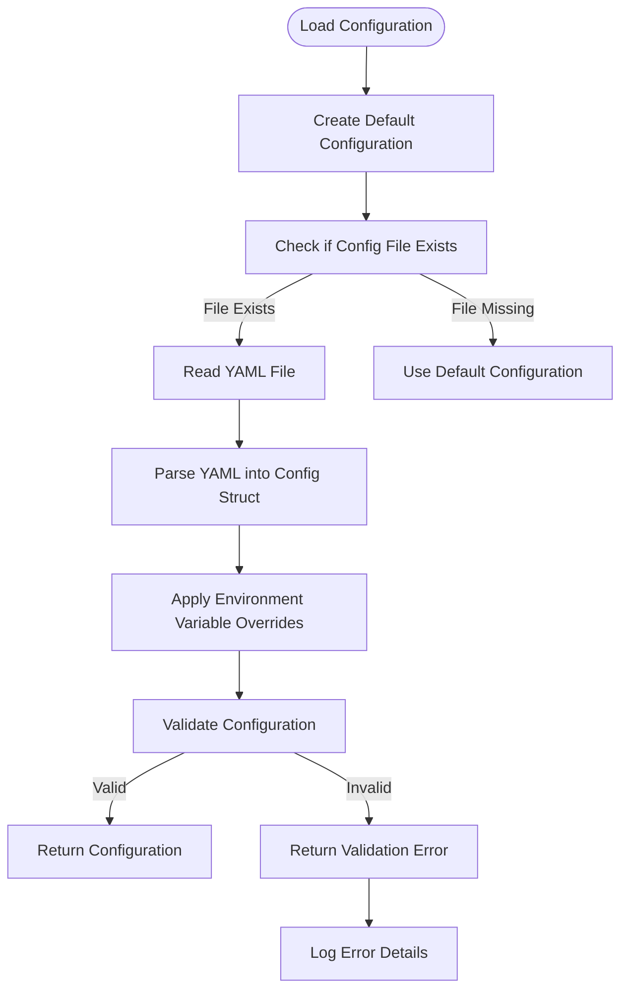
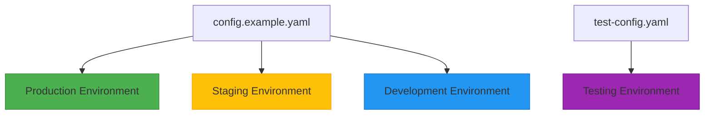
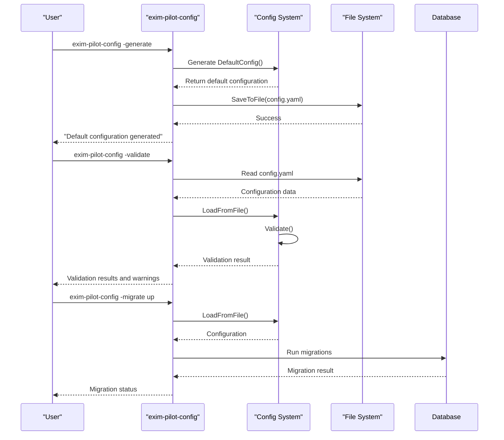

# Configuration Files


## Table of Contents
1. [Configuration Overview](#configuration-overview)
2. [Configuration File Structure](#configuration-file-structure)
3. [Configuration Loading and Validation](#configuration-loading-and-validation)
4. [Environment-Specific Configuration](#environment-specific-configuration)
5. [Security Considerations](#security-considerations)
6. [Configuration Management Tool](#configuration-management-tool)
7. [Common Configuration Scenarios](#common-configuration-scenarios)

## Configuration Overview

The Exim-Pilot application uses a hierarchical configuration system based on YAML files with environment variable overrides. The configuration system provides sensible defaults while allowing extensive customization for different deployment environments. The configuration is structured into logical sections that control various aspects of the application including server settings, database connections, Exim integration, logging, data retention, security, and authentication.

The configuration system follows a three-tier approach:
1. **Default values** - Built into the application code
2. **File-based configuration** - YAML configuration files
3. **Environment variable overrides** - Runtime configuration overrides

This layered approach allows for flexible deployment across different environments while maintaining security and consistency.

**Section sources**
- [config.go](file://internal/config/config.go#L0-L37)
- [config.example.yaml](file://config/config.example.yaml#L0-L76)

## Configuration File Structure

### Configuration Sections

The configuration file is organized into several logical sections, each controlling a specific aspect of the application:


```yaml
server:                    # HTTP server configuration
  port: 8080               # Port to listen on
  host: "0.0.0.0"          # Host to bind to
  read_timeout: 15         # Request read timeout (seconds)
  write_timeout: 15        # Response write timeout (seconds)
  idle_timeout: 60         # Connection idle timeout (seconds)
  allowed_origins: ["*"]   # CORS allowed origins
  log_requests: true       # Log HTTP requests
  tls_enabled: false       # Enable HTTPS
  tls_cert_file: ""        # Path to TLS certificate
  tls_key_file: ""         # Path to TLS private key

database:                  # Database configuration
  path: "data/exim-pilot.db"   # SQLite database file path
  max_open_conns: 25       # Maximum open database connections
  max_idle_conns: 5        # Maximum idle database connections
  conn_max_lifetime: 5     # Connection lifetime (minutes)
  backup_enabled: true     # Enable automatic database backups
  backup_interval: 24      # Backup interval (hours)
  backup_path: "backups"   # Backup directory path

exim:                      # Exim-specific configuration
  log_paths:               # Exim log file paths to monitor
    - "/var/log/exim4/mainlog"
    - "/var/log/exim4/rejectlog"
    - "/var/log/exim4/paniclog"
  spool_dir: "/var/spool/exim4"     # Exim spool directory
  binary_path: "/usr/sbin/exim4"    # Path to Exim binary
  config_file: "/etc/exim4/exim4.conf"  # Exim configuration file
  queue_run_user: "Debian-exim"     # User that runs Exim queue operations
  log_rotation_dir: "/var/log/exim4"    # Directory for rotated logs

logging:                   # Application logging configuration
  level: "info"            # Log level (debug, info, warn, error, fatal)
  file: "logs/exim-pilot.log"  # Log file path (empty for stdout only)
  max_size: 100            # Maximum log file size (MB)
  max_backups: 5           # Number of log backup files to keep
  max_age: 30              # Maximum age of log files (days)
  compress: true           # Compress rotated log files

retention:                 # Data retention policies
  log_entries_days: 90     # Keep log entries for this many days
  audit_log_days: 365      # Keep audit log entries for this many days
  queue_snapshots_days: 30 # Keep queue snapshots for this many days
  delivery_attempt_days: 180 # Keep delivery attempts for this many days
  cleanup_interval: 24     # Run cleanup every N hours

security:                  # Security-related configuration
  session_timeout: 60      # Session timeout (minutes)
  max_login_attempts: 5    # Maximum failed login attempts per IP
  login_lockout_time: 15   # Lockout duration after max attempts (minutes)
  csrf_protection: true    # Enable CSRF protection
  secure_cookies: true     # Use secure cookies (requires HTTPS)
  content_redaction: true  # Redact sensitive content in logs/UI
  audit_all_actions: true  # Audit all administrative actions
  trusted_proxies: []      # List of trusted proxy IP addresses/ranges

auth:                      # Authentication configuration
  default_username: "admin"    # Default admin username
  default_password: "admin123" # Default admin password (CHANGE THIS!)
  password_min_length: 8   # Minimum password length
  require_strong_password: true # Require strong passwords
  session_secret: ""       # Session secret (auto-generated if empty)
```


### Configuration Parameters

**Server Configuration**
- **port**: HTTP port to listen on (1-65535)
- **host**: Host to bind to (0.0.0.0 for all interfaces)
- **read_timeout**: Request read timeout in seconds
- **write_timeout**: Response write timeout in seconds
- **idle_timeout**: Connection idle timeout in seconds
- **allowed_origins**: CORS allowed origins (use specific domains in production)
- **log_requests**: Whether to log HTTP requests
- **tls_enabled**: Enable HTTPS
- **tls_cert_file**: Path to TLS certificate file
- **tls_key_file**: Path to TLS private key file

**Database Configuration**
- **path**: SQLite database file path
- **max_open_conns**: Maximum open database connections
- **max_idle_conns**: Maximum idle database connections
- **conn_max_lifetime**: Connection lifetime in minutes
- **backup_enabled**: Enable automatic database backups
- **backup_interval**: Backup interval in hours
- **backup_path**: Backup directory path

**Exim Configuration**
- **log_paths**: Exim log file paths to monitor
- **spool_dir**: Exim spool directory
- **binary_path**: Path to Exim binary
- **config_file**: Exim configuration file
- **queue_run_user**: User that runs Exim queue operations
- **log_rotation_dir**: Directory for rotated logs

**Logging Configuration**
- **level**: Log level (debug, info, warn, error, fatal)
- **file**: Log file path (empty for stdout only)
- **max_size**: Maximum log file size in MB
- **max_backups**: Number of log backup files to keep
- **max_age**: Maximum age of log files in days
- **compress**: Compress rotated log files

**Retention Configuration**
- **log_entries_days**: Days to keep log entries
- **audit_log_days**: Days to keep audit log entries
- **queue_snapshots_days**: Days to keep queue snapshots
- **delivery_attempt_days**: Days to keep delivery attempts
- **cleanup_interval**: Hours between cleanup operations

**Security Configuration**
- **session_timeout**: Session timeout in minutes
- **max_login_attempts**: Maximum failed login attempts per IP
- **login_lockout_time**: Lockout duration after max attempts in minutes
- **csrf_protection**: Enable CSRF protection
- **secure_cookies**: Use secure cookies (requires HTTPS)
- **content_redaction**: Redact sensitive content in logs/UI
- **audit_all_actions**: Audit all administrative actions
- **trusted_proxies**: List of trusted proxy IP addresses/ranges

**Authentication Configuration**
- **default_username**: Default admin username
- **default_password**: Default admin password (must be changed)
- **password_min_length**: Minimum password length
- **require_strong_password**: Require strong passwords
- **session_secret**: Session secret (auto-generated if empty)

**Section sources**
- [config.go](file://internal/config/config.go#L14-L157)
- [config.example.yaml](file://config/config.example.yaml#L0-L76)

## Configuration Loading and Validation

### Configuration Loading Process

The configuration loading process follows a specific sequence to ensure proper initialization and validation:





**Diagram sources**
- [config.go](file://internal/config/config.go#L158-L255)
- [config.go](file://internal/config/config.go#L294-L338)

### Configuration Validation

The configuration system includes comprehensive validation to ensure all settings are correct before the application starts:


```go
// Validate validates the configuration
func (c *Config) Validate() error {
	// Validate server configuration
	if c.Server.Port < 1 || c.Server.Port > 65535 {
		return fmt.Errorf("invalid server port: %d", c.Server.Port)
	}

	if c.Server.Host == "" {
		return fmt.Errorf("server host cannot be empty")
	}

	if c.Server.TLSEnabled {
		if c.Server.TLSCertFile == "" || c.Server.TLSKeyFile == "" {
			return fmt.Errorf("TLS enabled but cert or key file not specified")
		}

		if _, err := os.Stat(c.Server.TLSCertFile); os.IsNotExist(err) {
			return fmt.Errorf("TLS cert file not found: %s", c.Server.TLSCertFile)
		}

		if _, err := os.Stat(c.Server.TLSKeyFile); os.IsNotExist(err) {
			return fmt.Errorf("TLS key file not found: %s", c.Server.TLSKeyFile)
		}
	}

	// Validate database configuration
	if c.Database.Path == "" {
		return fmt.Errorf("database path cannot be empty")
	}

	// Ensure database directory exists or can be created
	dbDir := filepath.Dir(c.Database.Path)
	if err := os.MkdirAll(dbDir, 0755); err != nil {
		return fmt.Errorf("cannot create database directory %s: %w", dbDir, err)
	}

	if c.Database.MaxOpenConns < 1 {
		return fmt.Errorf("database max_open_conns must be at least 1")
	}

	if c.Database.MaxIdleConns < 0 {
		return fmt.Errorf("database max_idle_conns cannot be negative")
	}
	// ... additional validation rules
}
```


The validation process checks for:
- Valid port ranges (1-65535)
- Non-empty server host
- TLS certificate and key file existence when TLS is enabled
- Non-empty database path
- Valid database connection pool settings
- Directory creation permissions

**Section sources**
- [config.go](file://internal/config/config.go#L294-L338)

## Environment-Specific Configuration

### Configuration Files

The repository includes two primary configuration files for different environments:

**config.example.yaml**
- Purpose: Template for deployment configuration
- Location: config/config.example.yaml
- Usage: Copy to config.yaml and customize for production
- Features:
  - Comprehensive comments explaining each setting
  - Default values suitable for most deployments
  - Security warnings for sensitive settings
  - Environment variable override documentation

**test-config.yaml**
- Purpose: Configuration for testing environments
- Location: config/test-config.yaml
- Usage: Automated testing and development
- Features:
  - Test-specific file paths (data/test-exim-pilot.db)
  - Test log paths (data/test-mainlog)
  - Isolated test environment
  - No sensitive credentials





**Diagram sources**
- [config.example.yaml](file://config/config.example.yaml)
- [test-config.yaml](file://config/test-config.yaml)

### Environment Variable Overrides

The configuration system supports environment variable overrides for flexible deployment:

| Environment Variable | Configuration Setting | Example Value |
|----------------------|----------------------|---------------|
| EXIM_PILOT_PORT | server.port | 8080 |
| EXIM_PILOT_HOST | server.host | 0.0.0.0 |
| EXIM_PILOT_DB_PATH | database.path | /opt/exim-pilot/data/exim-pilot.db |
| EXIM_PILOT_LOG_LEVEL | logging.level | info |
| EXIM_PILOT_ADMIN_PASSWORD | auth.default_password | mysecurepassword |
| EXIM_PILOT_SESSION_SECRET | auth.session_secret | random123string |
| EXIM_PILOT_TLS_ENABLED | server.tls_enabled | true |
| EXIM_PILOT_TLS_CERT | server.tls_cert_file | /etc/ssl/certs/exim-pilot.crt |
| EXIM_PILOT_TLS_KEY | server.tls_key_file | /etc/ssl/private/exim-pilot.key |

Environment variables provide a secure way to override configuration settings without modifying configuration files, making them ideal for containerized deployments and secret management.

**Section sources**
- [config.go](file://internal/config/config.go#L203-L255)
- [config.example.yaml](file://config/config.example.yaml#L70-L76)

## Security Considerations

### Sensitive Configuration Values

The configuration system handles sensitive values with appropriate security measures:

**Default Credentials**
- Default username: admin
- Default password: admin123
- **Critical**: Must be changed before production deployment

**Session Security**
- Session secret is auto-generated if empty
- Secure cookies enabled by default (requires HTTPS)
- Session timeout of 60 minutes
- CSRF protection enabled

**Access Control**
- File permission checks during validation
- Security warnings for overly permissive file permissions
- Trusted proxies configuration for reverse proxy scenarios

### Configuration File Security

Best practices for securing configuration files:

1. **File Permissions**: Configuration files should have permissions of 644 or more restrictive
2. **Location**: Store configuration files outside web root directories
3. **Backup Security**: Ensure backup files are encrypted and access-controlled
4. **Environment Variables**: Use environment variables for secrets in production
5. **Regular Audits**: Periodically review configuration files for security issues

The configuration validation tool includes built-in security checks:


```go
// Check file permissions
if info, err := os.Stat(configPath); err == nil {
    mode := info.Mode()
    fmt.Printf("✓ Configuration file permissions: %o\n", mode.Perm())
    if mode.Perm() > 0644 {
        fmt.Printf("  WARNING: Configuration file is more permissive than recommended (644)\n")
    }
}
```


**Section sources**
- [main.go](file://cmd/exim-pilot-config/main.go#L122-L164)
- [config.go](file://internal/config/config.go#L294-L338)

## Configuration Management Tool

### exim-pilot-config Command

The `exim-pilot-config` tool provides command-line management of configuration:





**Diagram sources**
- [main.go](file://cmd/exim-pilot-config/main.go#L0-L200)

### Tool Commands

**Generate Configuration**

```bash
exim-pilot-config -generate -config /opt/exim-pilot/config/config.yaml
```

Creates a default configuration file with sensible defaults.

**Validate Configuration**

```bash
exim-pilot-config -validate -config /opt/exim-pilot/config/config.yaml
```

Validates the configuration file and checks for common issues.

**Run Database Migrations**

```bash
exim-pilot-config -migrate up -config /opt/exim-pilot/config/config.yaml
```

Applies database migrations to update the schema.

**Check Migration Status**

```bash
exim-pilot-config -migrate status -config /opt/exim-pilot/config/config.yaml
```

Displays the current migration status.

The tool provides comprehensive help documentation:

```bash
exim-pilot-config -help
```


**Section sources**
- [main.go](file://cmd/exim-pilot-config/main.go#L0-L200)

## Common Configuration Scenarios

### Adjusting Log Retention

To modify log retention policies, update the retention section:


```yaml
retention:
  log_entries_days: 180      # Keep logs for 6 months instead of 90 days
  audit_log_days: 730         # Keep audit logs for 2 years
  queue_snapshots_days: 60    # Keep queue snapshots for 2 months
  delivery_attempt_days: 365  # Keep delivery attempts for 1 year
  cleanup_interval: 12        # Run cleanup every 12 hours instead of 24
```


This configuration increases retention periods for all log types and doubles the frequency of cleanup operations.

### Changing Database Paths

To relocate the database to a different storage location:


```yaml
database:
  path: "/mnt/data/exim-pilot/exim-pilot.db"  # Move to dedicated storage
  max_open_conns: 50          # Increase connection pool for better performance
  max_idle_conns: 10          # Increase idle connections
  conn_max_lifetime: 10       # Extend connection lifetime
  backup_enabled: true
  backup_interval: 12         # More frequent backups
  backup_path: "/mnt/backups/exim-pilot"
```


This configuration moves the database to a dedicated storage volume with increased connection pool size and more frequent backups.

### Configuring TLS

To enable HTTPS with TLS:


```yaml
server:
  port: 443                   # Standard HTTPS port
  host: "0.0.0.0"
  tls_enabled: true
  tls_cert_file: "/etc/ssl/certs/exim-pilot.crt"
  tls_key_file: "/etc/ssl/private/exim-pilot.key"
  allowed_origins:           # Restrict CORS to specific domains
    - "https://mail.example.com"
    - "https://admin.example.com"
  secure_cookies: true        # Essential for HTTPS
```


Environment variables can override these settings:

```bash
EXIM_PILOT_TLS_ENABLED=true \
EXIM_PILOT_TLS_CERT=/run/secrets/tls.crt \
EXIM_PILOT_TLS_KEY=/run/secrets/tls.key \
exim-pilot
```


### Development vs Production Configuration

**Development Configuration**

```yaml
server:
  port: 8080
  host: "localhost"
  allowed_origins: ["*"]      # Open CORS for development
  tls_enabled: false          # No TLS in development

database:
  path: "data/dev-exim-pilot.db"  # Local development database

logging:
  level: "debug"              # Verbose logging for debugging
  file: "logs/exim-pilot.log"

security:
  secure_cookies: false       # Not required without HTTPS
```


**Production Configuration**

```yaml
server:
  port: 443
  host: "0.0.0.0"
  allowed_origins: ["https://mail.example.com"]
  tls_enabled: true
  tls_cert_file: "/etc/ssl/certs/exim-pilot.crt"
  tls_key_file: "/etc/ssl/private/exim-pilot.key"

database:
  path: "/opt/exim-pilot/data/exim-pilot.db"
  backup_enabled: true
  backup_interval: 24

logging:
  level: "info"               # Less verbose in production
  max_size: 500               # Larger log files
  max_backups: 10             # More backups

security:
  session_timeout: 30         # Shorter sessions for security
  max_login_attempts: 3       # Stricter login limits
  secure_cookies: true
```


**Section sources**
- [config.example.yaml](file://config/config.example.yaml)
- [test-config.yaml](file://config/test-config.yaml)
- [config.go](file://internal/config/config.go)

**Referenced Files in This Document**   
- [config.example.yaml](file://config/config.example.yaml)
- [test-config.yaml](file://config/test-config.yaml)
- [config.go](file://internal/config/config.go)
- [main.go](file://cmd/exim-pilot-config/main.go)
- [main.go](file://cmd/exim-pilot/main.go)