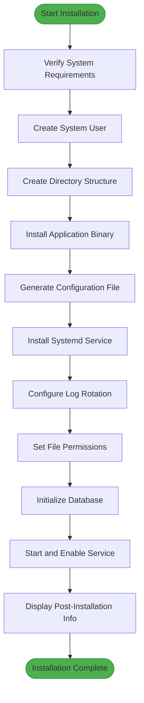
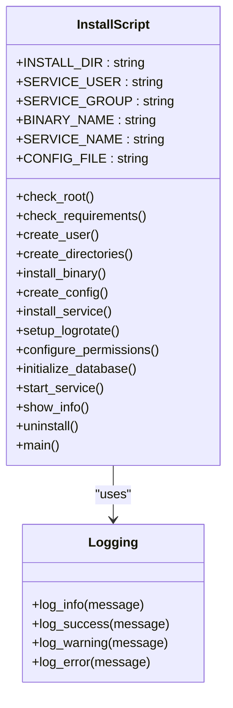
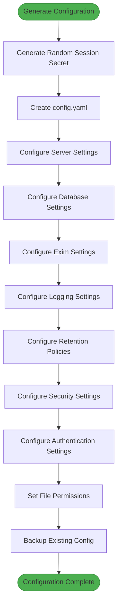
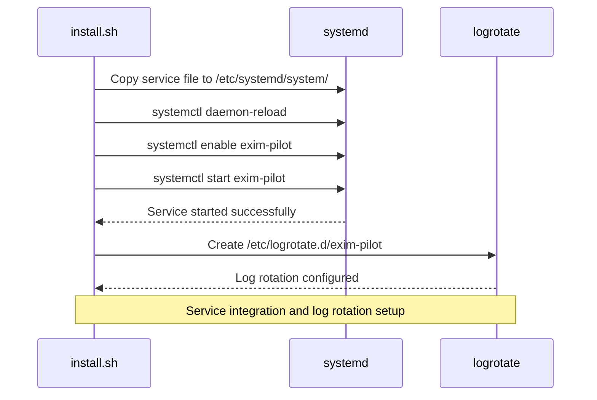
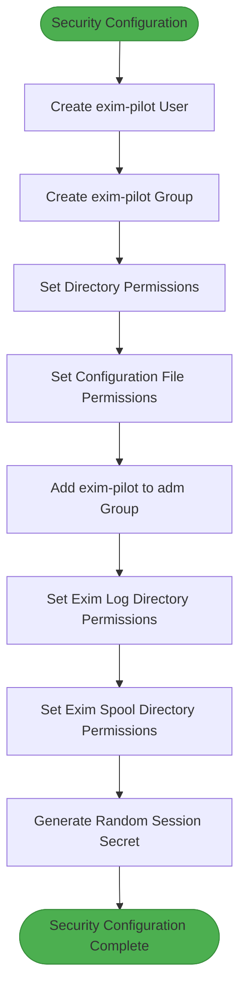
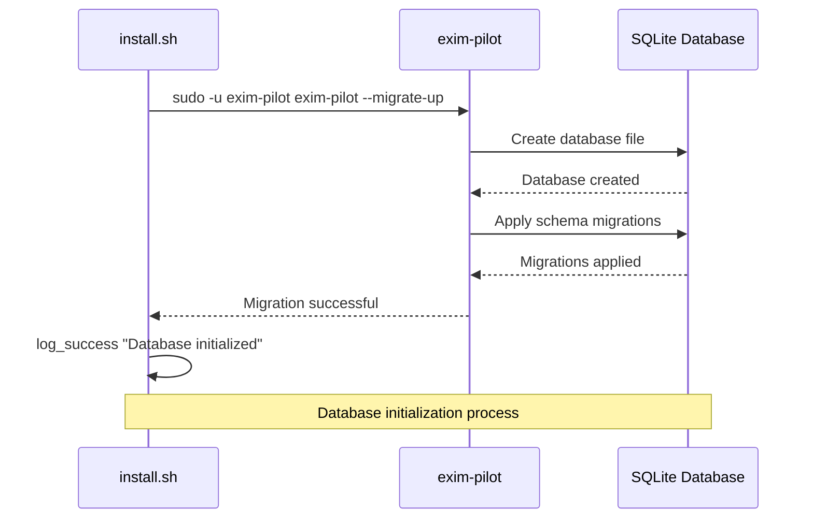
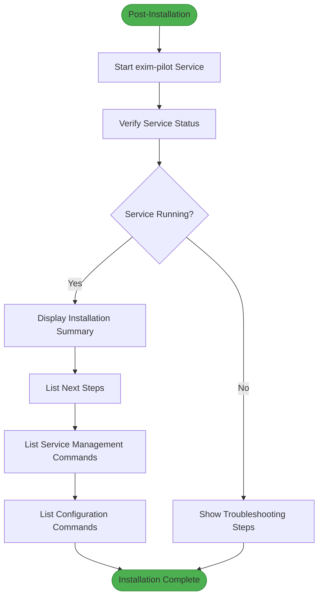

# Deployment Scripts


## Table of Contents
1. [Introduction](#introduction)
2. [Deployment Workflow](#deployment-workflow)
3. [Installation Script Analysis](#installation-script-analysis)
4. [Configuration Management](#configuration-management)
5. [Service Integration](#service-integration)
6. [Permission and Security Configuration](#permission-and-security-configuration)
7. [Database Initialization](#database-initialization)
8. [Post-Installation Verification](#post-installation-verification)
9. [Troubleshooting Guide](#troubleshooting-guide)
10. [Customization Options](#customization-options)

## Introduction
The Exim Control Panel (Exim-Pilot) provides a comprehensive web interface for managing Exim mail servers. This document details the deployment automation scripts located in the deployments/ directory, focusing on the install.sh script that handles the complete installation and configuration process. The deployment system is designed to automate the setup of the application on target systems, including dependency verification, user and directory creation, service registration, and post-installation verification.

The deployment process follows a structured workflow that ensures consistent installation across different environments. The scripts are specifically designed for Ubuntu/Debian systems and leverage systemd for service management. The installation process creates a dedicated system user, sets appropriate file permissions, configures log rotation, and initializes the application database.

**Section sources**
- [install.sh](file://deployments/install.sh#L1-L439)
- [README.md](file://deployments/README.md#L1-L351)

## Deployment Workflow
The deployment workflow for Exim-Pilot follows a systematic approach to ensure reliable and consistent installation across target systems. The process begins with prerequisite verification, ensuring that the target system meets the necessary requirements before proceeding with the installation.

The workflow consists of the following sequential steps:
1. System requirements verification
2. Creation of dedicated system user and group
3. Establishment of directory structure
4. Binary installation
5. Configuration file generation
6. Systemd service installation
7. Log rotation setup
8. Permission configuration
9. Database initialization
10. Service startup and verification

Each step in the workflow is designed to be idempotent, allowing the installation script to be safely re-run if needed. The script provides detailed logging for each step, making it easy to identify and troubleshoot any issues that may arise during the installation process.

The deployment workflow is implemented in the install.sh script, which serves as the primary automation tool for setting up the application on target systems. The script includes comprehensive error handling and validation at each step, ensuring that the installation process fails gracefully if any requirements are not met.





**Diagram sources**
- [install.sh](file://deployments/install.sh#L109-L355)

**Section sources**
- [install.sh](file://deployments/install.sh#L109-L355)
- [README.md](file://deployments/README.md#L1-L62)

## Installation Script Analysis
The install.sh script is a comprehensive bash script that automates the entire installation process for the Exim Control Panel. The script is designed to be executed with root privileges and follows a modular structure with dedicated functions for each installation step.

The script begins with configuration variables that define key installation parameters such as the installation directory, service user and group names, binary name, and service name. These variables make the script easily customizable for different deployment scenarios.

The script implements several key functions:
- check_root: Verifies that the script is being run with root privileges
- check_requirements: Validates system requirements including OS type, Exim installation, and systemd availability
- create_user: Creates the dedicated system user and group for the application
- create_directories: Establishes the directory structure with appropriate permissions
- install_binary: Copies the application binary to the installation directory
- create_config: Generates the default configuration file with secure settings
- install_service: Installs the systemd service configuration
- setup_logrotate: Configures log rotation for application logs
- configure_permissions: Sets appropriate file permissions for Exim log access
- initialize_database: Runs database migrations to initialize the application database
- start_service: Starts and enables the systemd service
- show_info: Displays post-installation information and next steps

The script also includes an uninstall function that removes the application and its components, providing a complete lifecycle management solution.





**Diagram sources**
- [install.sh](file://deployments/install.sh#L20-L439)

**Section sources**
- [install.sh](file://deployments/install.sh#L20-L439)

## Configuration Management
The deployment system includes comprehensive configuration management capabilities that ensure the application is properly configured for the target environment. The configuration process is handled by the create_config function in the install.sh script, which generates a YAML configuration file with default settings.

The configuration file includes several key sections:
- **Server**: HTTP server settings including port, host, timeouts, and TLS configuration
- **Database**: SQLite database settings including path, connection limits, and backup configuration
- **Exim**: Exim-specific configuration including log file paths, spool directory, and binary location
- **Logging**: Application logging configuration including log level, file location, and rotation settings
- **Retention**: Data retention policies for logs, audit trails, and queue snapshots
- **Security**: Security policies including session timeout, login attempt limits, and CSRF protection
- **Auth**: Authentication settings including default credentials and password requirements

The configuration file is generated with secure defaults, including a randomly generated session secret and appropriate file permissions (640). The script also creates a backup of any existing configuration file before overwriting it, preserving the previous configuration for reference.

The configuration management system also supports environment variable overrides, allowing specific settings to be modified without changing the configuration file. This is particularly useful for sensitive information like passwords and secrets that should not be stored in configuration files.





**Diagram sources**
- [install.sh](file://deployments/install.sh#L148-L218)
- [config.example.yaml](file://config/config.example.yaml#L1-L100)

**Section sources**
- [install.sh](file://deployments/install.sh#L148-L218)
- [config.example.yaml](file://config/config.example.yaml#L1-L100)
- [config.go](file://internal/config/config.go#L1-L208)

## Service Integration
The deployment script integrates the Exim Control Panel with the systemd service manager, ensuring that the application starts automatically on system boot and can be managed using standard service management commands. The service integration is handled by the install_service function in the install.sh script.

The script copies a systemd service file from the deployments/systemd/ directory to /etc/systemd/system/ and reloads the systemd configuration to make the new service available. The service file defines the service behavior, including the user and group under which the service runs, the working directory, the command to start the service, and restart policies.

The systemd service configuration includes several important features:
- Automatic restart on failure with a 5-second delay
- Journal logging for both standard output and error
- Environment variable support for configuration overrides
- Dependency management to ensure the service starts after the network is available

After installing the service file, the script enables the service to start automatically on boot and starts the service immediately. The script then verifies that the service is running correctly and provides appropriate feedback if the service fails to start.

The service integration also includes a post-installation step that configures log rotation for the application logs. This is handled by the setup_logrotate function, which creates a configuration file in /etc/logrotate.d/ that rotates the application logs daily, keeps 30 days of logs, and compresses old log files.





**Diagram sources**
- [install.sh](file://deployments/install.sh#L220-L235)
- [install.sh](file://deployments/install.sh#L278-L284)

**Section sources**
- [install.sh](file://deployments/install.sh#L220-L235)
- [install.sh](file://deployments/install.sh#L278-L284)

## Permission and Security Configuration
The deployment script implements a comprehensive permission and security configuration system to ensure the application runs securely on the target system. This is handled by several functions in the install.sh script, including create_directories, create_config, and configure_permissions.

The script creates a dedicated system user and group (exim-pilot) for running the application, following the principle of least privilege. The application runs under this user account rather than as root, minimizing the potential impact of security vulnerabilities.

The directory structure is created with appropriate permissions:
- Installation directory: 755 (readable and executable by all, writable by owner)
- bin and config directories: 755 (readable and executable by all, writable by owner)
- data, logs, and backups directories: 750 (readable and executable by owner and group, not accessible by others)

The configuration file is created with permissions 640, making it readable by the exim-pilot user and group but not by others. This protects sensitive information such as the session secret and database path.

The script also configures permissions for accessing Exim log files by adding the exim-pilot user to the adm group, which has read access to system logs. It ensures that the Exim log and spool directories are readable by setting their permissions to 755.

Additionally, the script generates a cryptographically secure random session secret using OpenSSL, which is used for session management in the application. This helps prevent session fixation and other authentication-related attacks.





**Diagram sources**
- [install.sh](file://deployments/install.sh#L74-L108)
- [install.sh](file://deployments/install.sh#L137-L146)
- [install.sh](file://deployments/install.sh#L260-L277)

**Section sources**
- [install.sh](file://deployments/install.sh#L74-L108)
- [install.sh](file://deployments/install.sh#L137-L146)
- [install.sh](file://deployments/install.sh#L260-L277)

## Database Initialization
The deployment script includes a database initialization process that sets up the application database and applies any necessary migrations. This is handled by the initialize_database function in the install.sh script.

The database initialization process runs the application's database migration tool as the exim-pilot user, ensuring that the database is created with the correct ownership and permissions. The migration tool creates the SQLite database file at the specified path and applies all database schema migrations to set up the required tables and indexes.

The database configuration includes several important settings:
- Database path: /opt/exim-pilot/data/exim-pilot.db
- Maximum open connections: 25
- Maximum idle connections: 5
- Connection maximum lifetime: 5 minutes
- Backup enabled: true
- Backup interval: 24 hours
- Backup path: /opt/exim-pilot/backups

The script verifies that the database initialization completes successfully and exits with an error if the migration fails. This ensures that the application will not start with an incomplete or corrupted database.

The database initialization process is idempotent, meaning it can be safely re-run if needed. If the database already exists, the migration tool will apply any new migrations that have not yet been applied, bringing the database schema up to date.





**Diagram sources**
- [install.sh](file://deployments/install.sh#L286-L297)
- [exim-pilot-config/main.go](file://cmd/exim-pilot-config/main.go#L49-L89)

**Section sources**
- [install.sh](file://deployments/install.sh#L286-L297)
- [exim-pilot-config/main.go](file://cmd/exim-pilot-config/main.go#L49-L89)

## Post-Installation Verification
The deployment script includes comprehensive post-installation verification steps to ensure that the application has been installed and configured correctly. This is handled by the start_service and show_info functions in the install.sh script.

After starting the service, the script verifies that it is running by checking its status with systemctl is-active. If the service fails to start, the script provides detailed error messages and suggests troubleshooting steps, including checking the service status and viewing the logs.

The show_info function displays a comprehensive summary of the installation, including:
- Installation directory
- Configuration file location
- Service name
- Service user
- Next steps for securing the installation
- Service management commands
- Configuration editing instructions

The script also provides specific guidance for post-installation tasks, including:
- Changing the default admin password
- Configuring TLS for production use
- Adjusting firewall settings
- Managing the service using systemctl commands
- Viewing logs using journalctl

This comprehensive post-installation verification ensures that users have all the information they need to verify the installation and begin using the application securely.





**Diagram sources**
- [install.sh](file://deployments/install.sh#L300-L355)

**Section sources**
- [install.sh](file://deployments/install.sh#L300-L355)
- [README.md](file://deployments/README.md#L1-L62)

## Troubleshooting Guide
This section provides guidance for troubleshooting common issues that may occur during or after the installation process. The deployment script includes built-in error handling and validation, but certain issues may still arise depending on the target system configuration.

### Common Installation Issues

**Service Fails to Start**
If the service fails to start, check the following:

```bash
# Check service status
sudo systemctl status exim-pilot

# View service logs
sudo journalctl -u exim-pilot -f

# Verify configuration file
sudo /opt/exim-pilot/bin/exim-pilot-config -validate -config /opt/exim-pilot/config/config.yaml

# Check file permissions
ls -la /opt/exim-pilot/
```


**Configuration Validation Errors**
If the configuration validation fails, ensure that:
- The configuration file is properly formatted YAML
- All required fields are present
- File paths exist and are accessible
- Port numbers are available

**Database Initialization Failures**
If database initialization fails, verify that:
- The data directory exists and has correct permissions
- The exim-pilot user has write access to the data directory
- There is sufficient disk space available
- No other process is using the database file

**Permission Issues**
If you encounter permission issues, ensure that:
- The exim-pilot user is in the adm group for log access
- The Exim log and spool directories are readable
- The configuration file has permissions 640
- The data, logs, and backups directories have permissions 750

**Exim Log Access Issues**
If the application cannot access Exim logs, verify that:

```bash
# Check if exim-pilot user is in adm group
groups exim-pilot

# Test log file access
sudo -u exim-pilot cat /var/log/exim4/mainlog | head -5

# Check log directory permissions
ls -la /var/log/exim4/
```


### Debugging Tips
For additional debugging, you can:
- Enable debug logging by setting EXIM_PILOT_LOG_LEVEL=debug
- Check the application logs in /opt/exim-pilot/logs/exim-pilot.log
- Use the health check endpoint: curl http://localhost:8080/api/v1/health
- Verify database connectivity: sudo -u exim-pilot sqlite3 /opt/exim-pilot/data/exim-pilot.db ".tables"

**Section sources**
- [install.sh](file://deployments/install.sh#L300-L355)
- [README.md](file://deployments/README.md#L183-L231)
- [INSTALLATION.md](file://docs/INSTALLATION.md#L1-L751)

## Customization Options
The deployment system provides several customization options to adapt the installation to different environments and requirements. These options allow administrators to modify various aspects of the installation process and application configuration.

### Installation Directory
The installation directory can be customized by modifying the INSTALL_DIR variable in the install.sh script. The default directory is /opt/exim-pilot, but this can be changed to any location with appropriate permissions.

### Service User and Group
The service user and group names can be customized by modifying the SERVICE_USER and SERVICE_GROUP variables in the install.sh script. This allows the application to run under a different user account if required by organizational policies.

### Port Configuration
The application port can be customized in the configuration file or through environment variables. The default port is 8080, but this can be changed to any available port by modifying the server.port setting in the configuration file or setting the EXIM_PILOT_PORT environment variable.

### TLS Configuration
For production environments, TLS can be enabled by:
1. Obtaining SSL certificates (Let's Encrypt or custom)
2. Updating the configuration file with certificate paths
3. Setting tls_enabled: true
4. Restarting the service

### Database Configuration
The database configuration can be customized to:
- Change the database path
- Adjust connection limits
- Modify backup settings
- Change the backup interval and retention period

### Logging Configuration
The logging configuration can be customized to:
- Change the log level (debug, info, warn, error)
- Modify log file rotation settings
- Adjust log retention period
- Change the maximum log file size

### Security Configuration
The security configuration can be hardened by:
- Reducing the session timeout
- Limiting the number of login attempts
- Increasing the login lockout time
- Configuring trusted proxies
- Enabling additional security headers

These customization options provide flexibility for deploying the application in various environments, from development to production, while maintaining security and performance requirements.

**Section sources**
- [install.sh](file://deployments/install.sh#L20-L40)
- [config.example.yaml](file://config/config.example.yaml#L1-L100)
- [DEPLOYMENT.md](file://docs/DEPLOYMENT.md#L1-L1066)

**Referenced Files in This Document**   
- [install.sh](file://deployments/install.sh)
- [README.md](file://deployments/README.md)
- [config.example.yaml](file://config/config.example.yaml)
- [exim-pilot-config/main.go](file://cmd/exim-pilot-config/main.go)
- [config.go](file://internal/config/config.go)
- [DEPLOYMENT.md](file://docs/DEPLOYMENT.md)
- [INSTALLATION.md](file://docs/INSTALLATION.md)