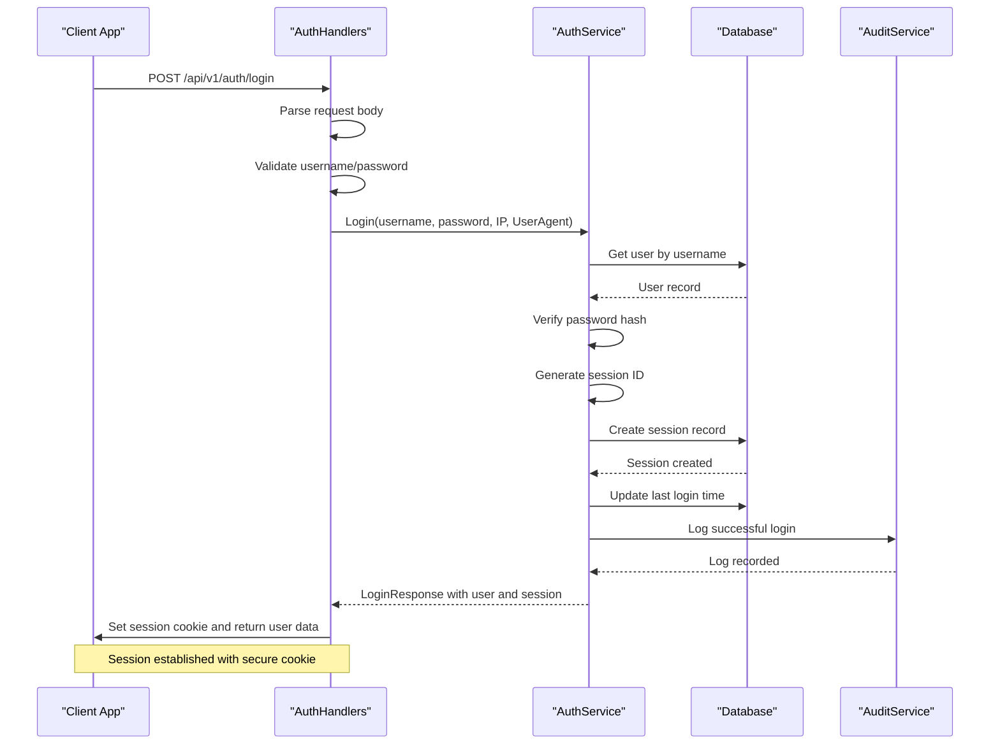
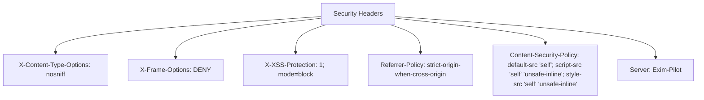
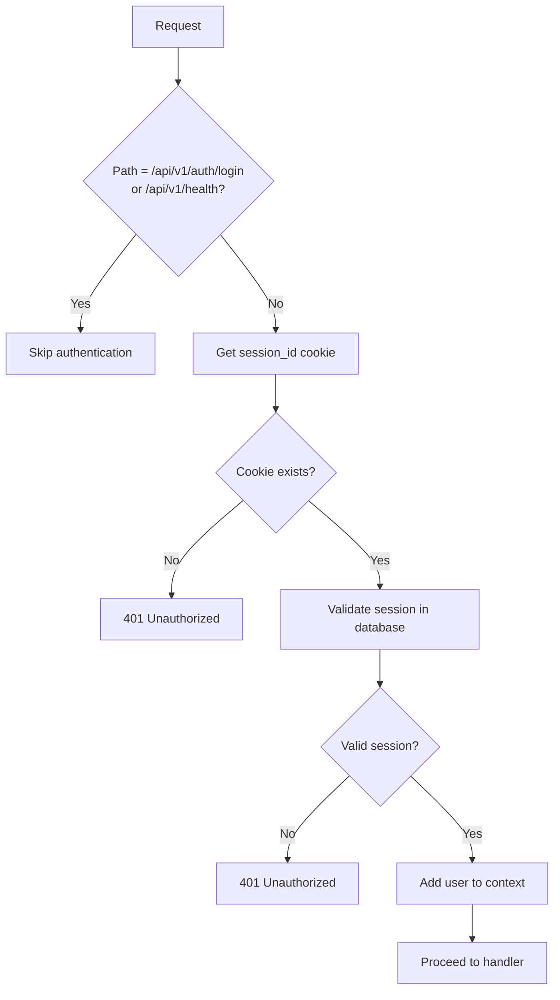

# Authentication API


## Table of Contents
1. [Authentication Endpoints](#authentication-endpoints)
2. [JWT-Based Authentication Flow](#jwt-based-authentication-flow)
3. [Request Validation and Error Handling](#request-validation-and-error-handling)
4. [Security Model and Compliance](#security-model-and-compliance)
5. [Example API Interactions](#example-api-interactions)

## Authentication Endpoints

The authentication system provides three primary endpoints for user management: login, logout, and current user retrieval. These endpoints are implemented using session-based authentication with secure cookies.

### Login Endpoint
- **HTTP Method**: POST
- **Path**: `/api/v1/auth/login`
- **Authentication Required**: No
- **Description**: Authenticates a user with username and password credentials and establishes a session.

**Request Format**

```json
{
  "username": "string",
  "password": "string"
}
```


**Response Format (Success - 200 OK)**

```json
{
  "success": true,
  "data": {
    "user": {
      "id": 1,
      "username": "admin",
      "email": "admin@example.com",
      "full_name": "Administrator",
      "is_active": true,
      "last_login_at": "2025-08-23T10:00:00Z",
      "created_at": "2025-08-23T09:00:00Z",
      "updated_at": "2025-08-23T09:00:00Z"
    },
    "expires_at": "2025-08-24T10:00:00Z"
  }
}
```


**Response Format (Failure - 401 Unauthorized)**

```json
{
  "success": false,
  "error": "Invalid credentials"
}
```


**Status Codes**
- `200 OK`: Authentication successful, session established
- `400 Bad Request`: Invalid request body or missing required fields
- `401 Unauthorized`: Invalid credentials
- `500 Internal Server Error`: Server error during authentication process

**Section sources**
- [auth_handlers.go](file://internal/api/auth_handlers.go#L48-L100)
- [models.go](file://internal/database/models.go#L320-L340)

### Logout Endpoint
- **HTTP Method**: POST
- **Path**: `/api/v1/auth/logout`
- **Authentication Required**: Yes (valid session)
- **Description**: Terminates the current user session and clears the session cookie.

**Request Format**: Empty body

**Response Format (Success - 200 OK)**

```json
{
  "success": true,
  "data": {
    "message": "Logged out successfully"
  }
}
```


**Response Format (Failure - 400 Bad Request)**

```json
{
  "success": false,
  "error": "No active session"
}
```


**Status Codes**
- `200 OK`: Logout successful, session terminated
- `400 Bad Request`: No active session found
- `500 Internal Server Error`: Server error during logout process

**Section sources**
- [auth_handlers.go](file://internal/api/auth_handlers.go#L96-L161)
- [service.go](file://internal/auth/service.go#L107-L133)

### Current User Endpoint
- **HTTP Method**: GET
- **Path**: `/api/v1/auth/me`
- **Authentication Required**: Yes (valid session)
- **Description**: Retrieves information about the currently authenticated user.

**Request Format**: None (uses session cookie)

**Response Format (Success - 200 OK)**

```json
{
  "success": true,
  "data": {
    "id": 1,
    "username": "admin",
    "email": "admin@example.com",
    "full_name": "Administrator",
    "is_active": true,
    "last_login_at": "2025-08-23T10:00:00Z",
    "created_at": "2025-08-23T09:00:00Z",
    "updated_at": "2025-08-23T09:00:00Z"
  }
}
```


**Status Codes**
- `200 OK`: User information retrieved successfully
- `500 Internal Server Error`: User not found in context

**Section sources**
- [auth_handlers.go](file://internal/api/auth_handlers.go#L147-L161)
- [middleware.go](file://internal/api/middleware.go#L126-L136)

## JWT-Based Authentication Flow

The authentication system implements a session-based security model using secure cookies rather than JWT tokens in the traditional sense. However, it follows similar principles of stateful session management with token-like session identifiers.

### Authentication Flow Sequence





**Diagram sources**
- [auth_handlers.go](file://internal/api/auth_handlers.go#L48-L100)
- [service.go](file://internal/auth/service.go#L48-L106)

### Session Management

The system uses cryptographically secure session IDs stored in HTTP-only cookies with the following security attributes:
- **HttpOnly**: Prevents client-side script access
- **Secure**: Only transmitted over HTTPS connections
- **SameSite**: Strict mode to prevent CSRF attacks
- **Path**: Root path ("/") for application-wide access

Session expiration is set to 24 hours from creation time. The session ID is stored server-side in the database with the user ID, expiration time, IP address, and user agent for validation and security auditing.

**Section sources**
- [auth_handlers.go](file://internal/api/auth_handlers.go#L76-L85)
- [service.go](file://internal/auth/service.go#L79-L85)

## Request Validation and Error Handling

The authentication system implements comprehensive request validation and error handling to ensure data integrity and provide meaningful feedback to clients.

### Request Validation

All authentication requests undergo validation at multiple levels:

1. **Body Parsing Validation**: Ensures the request body is valid JSON
2. **Field Validation**: Verifies that username and password fields are present and non-empty
3. **Authentication Validation**: Validates credentials against the stored password hash using bcrypt


```go
// Validate required fields
if loginReq.Username == "" || loginReq.Password == "" {
    response := APIResponse{
        Success: false,
        Error:   "Username and password are required",
    }
    WriteJSONResponse(w, http.StatusBadRequest, response)
    return
}
```


**Section sources**
- [auth_handlers.go](file://internal/api/auth_handlers.go#L51-L57)
- [response.go](file://internal/api/response.go#L30-L45)

### Error Response Structure

All error responses follow the standard API response format defined in `APIResponse`:


```go
type APIResponse struct {
    Success bool        `json:"success"`
    Data    interface{} `json:"data,omitempty"`
    Error   string      `json:"error,omitempty"`
    Meta    *Meta       `json:"meta,omitempty"`
}
```


**Authentication-Specific Error Responses**
- `400 Bad Request`: "Invalid request body" or "Username and password are required"
- `401 Unauthorized`: "Invalid credentials"
- `400 Bad Request`: "No active session" (logout without session)
- `500 Internal Server Error`: "Failed to logout" or "User not found in context"

The system distinguishes between client errors (4xx) and server errors (5xx) to help clients understand the nature of failures.

**Section sources**
- [response.go](file://internal/api/response.go#L10-L25)
- [auth_handlers.go](file://internal/api/auth_handlers.go#L58-L65)

## Security Model and Compliance

The authentication system implements a comprehensive security model with multiple layers of protection and compliance features.

### Security Headers

All responses include security headers to protect against common web vulnerabilities:





**Diagram sources**
- [middleware.go](file://internal/api/middleware.go#L239-L250)

### Authentication Middleware

The auth middleware protects all endpoints except login and health check:





**Diagram sources**
- [middleware.go](file://internal/api/middleware.go#L99-L125)

### Audit Logging

All authentication events are logged for security and compliance purposes:

- **Successful Login**: Action "login_success" with session ID in details
- **Failed Login**: Action "login_failed" with reason (user_not_found or invalid_password)
- **Logout**: Action "logout" with session ID
- **Session Validation**: Logged as part of protected route access

Audit logs include the user ID, IP address, timestamp, and action details for forensic analysis and compliance reporting.

**Section sources**
- [service.go](file://internal/auth/service.go#L61-L77)
- [service.go](file://internal/auth/service.go#L118-L128)
- [audit/service.go](file://internal/audit/service.go#L200-L206)

### Rate Limiting Considerations

While the current implementation does not include explicit rate limiting for login attempts, the audit logging system provides the foundation for implementing rate limiting:

- All failed login attempts are logged with the username and IP address
- Failed login reasons are recorded (user_not_found, invalid_password)
- IP address is captured from X-Forwarded-For, X-Real-IP, or RemoteAddr

This audit trail enables post-facto analysis of brute force attempts and could be extended to implement rate limiting by counting failed attempts by IP address or username within a time window.

**Section sources**
- [service.go](file://internal/auth/service.go#L58-L65)
- [service.go](file://internal/auth/service.go#L87-L95)

## Example API Interactions

### Successful Authentication Flow

**Request: Login**

```http
POST /api/v1/auth/login HTTP/1.1
Content-Type: application/json
Content-Length: 47

{
  "username": "admin",
  "password": "securepassword123"
}
```


**Response: Success**

```http
HTTP/1.1 200 OK
Content-Type: application/json
Set-Cookie: session_id=abc123def456...; Expires=Wed, 24 Aug 2025 10:00:00 GMT; HttpOnly; Secure; SameSite=Strict; Path=/

{
  "success": true,
  "data": {
    "user": {
      "id": 1,
      "username": "admin",
      "email": "admin@example.com",
      "full_name": "System Administrator",
      "is_active": true,
      "last_login_at": "2025-08-23T10:00:00Z",
      "created_at": "2025-08-23T09:00:00Z",
      "updated_at": "2025-08-23T09:00:00Z"
    },
    "expires_at": "2025-08-24T10:00:00Z"
  }
}
```


**Request: Access Protected Route**

```http
GET /api/v1/auth/me HTTP/1.1
Cookie: session_id=abc123def456...
```


**Response: Current User**

```http
HTTP/1.1 200 OK
Content-Type: application/json

{
  "success": true,
  "data": {
    "id": 1,
    "username": "admin",
    "email": "admin@example.com",
    "full_name": "System Administrator",
    "is_active": true,
    "last_login_at": "2025-08-23T10:00:00Z",
    "created_at": "2025-08-23T09:00:00Z",
    "updated_at": "2025-08-23T09:00:00Z"
  }
}
```


**Request: Logout**

```http
POST /api/v1/auth/logout HTTP/1.1
Cookie: session_id=abc123def456...
```


**Response: Logout Success**

```http
HTTP/1.1 200 OK
Content-Type: application/json
Set-Cookie: session_id=; Expires=Thu, 01 Jan 1970 00:00:00 GMT; HttpOnly; Secure; SameSite=Strict; Path=/

{
  "success": true,
  "data": {
    "message": "Logged out successfully"
  }
}
```


### Failed Authentication Attempts

**Invalid Credentials**

```http
POST /api/v1/auth/login HTTP/1.1
Content-Type: application/json

{
  "username": "admin",
  "password": "wrongpassword"
}

HTTP/1.1 401 Unauthorized
Content-Type: application/json

{
  "success": false,
  "error": "Invalid credentials"
}
```


**Missing Credentials**

```http
POST /api/v1/auth/login HTTP/1.1
Content-Type: application/json

{
  "username": "",
  "password": ""
}

HTTP/1.1 400 Bad Request
Content-Type: application/json

{
  "success": false,
  "error": "Username and password are required"
}
```


**Logout Without Active Session**

```http
POST /api/v1/auth/logout HTTP/1.1

HTTP/1.1 400 Bad Request
Content-Type: application/json

{
  "success": false,
  "error": "No active session"
}
```


**Section sources**
- [auth_handlers.go](file://internal/api/auth_handlers.go#L58-L65)
- [auth_handlers.go](file://internal/api/auth_handlers.go#L110-L115)
- [auth_handlers.go](file://internal/api/auth_handlers.go#L138-L145)

**Referenced Files in This Document**   
- [auth_handlers.go](file://internal/api/auth_handlers.go)
- [service.go](file://internal/auth/service.go)
- [models.go](file://internal/database/models.go)
- [middleware.go](file://internal/api/middleware.go)
- [response.go](file://internal/api/response.go)
- [server.go](file://internal/api/server.go)