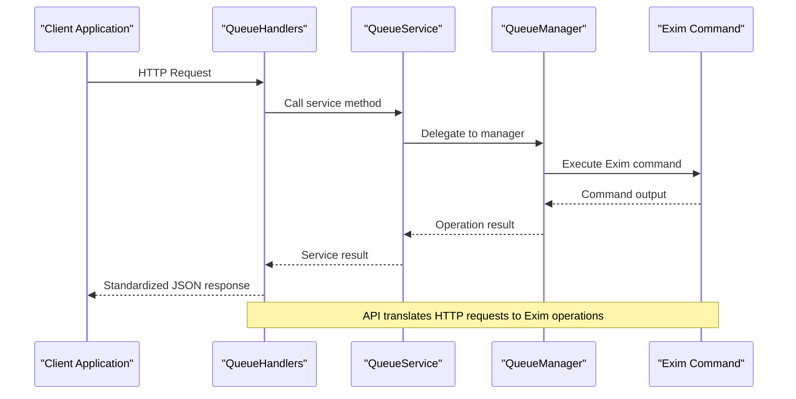
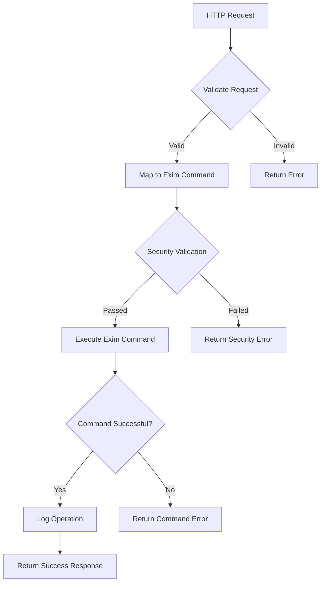

# Queue Management API


## Table of Contents
1. [Introduction](#introduction)
2. [API Overview](#api-overview)
3. [Queue Listing and Filtering](#queue-listing-and-filtering)
4. [Message Details Retrieval](#message-details-retrieval)
5. [Queue Operations](#queue-operations)
6. [Bulk Operations](#bulk-operations)
7. [Error Handling](#error-handling)
8. [API to Exim Translation](#api-to-exim-translation)
9. [Response Schema](#response-schema)

## Introduction
The Queue Management API provides a RESTful interface for managing the Exim mail server queue. It enables users to view queue status, inspect message details, and perform various queue operations such as delivering, freezing, thawing, and deleting messages. The API serves as a secure intermediary between the web interface and the Exim command-line tools, translating HTTP requests into appropriate Exim commands while providing additional features like audit logging, security validation, and response standardization.

The API follows REST principles with clear resource naming and appropriate HTTP methods. All responses follow a standardized format with success status, data payload, error messages, and metadata for pagination. The system is designed to handle both individual message operations and bulk operations on multiple messages, with comprehensive error handling and partial success reporting.

**Section sources**
- [queue_handlers.go](file://internal/api/queue_handlers.go#L1-L50)
- [response.go](file://internal/api/response.go#L1-L20)

## API Overview
The Queue Management API exposes endpoints for comprehensive queue management functionality. The API is protected by authentication and authorization mechanisms, ensuring that only authorized users can perform queue operations. All endpoints are prefixed with `/api/v1/queue` and use standard HTTP methods to indicate the operation type.

The API architecture follows a layered pattern with handlers receiving HTTP requests, services coordinating business logic, and managers executing the actual Exim commands. This separation of concerns allows for better maintainability and testability. The response structure is consistent across all endpoints, making it easier for clients to handle responses uniformly.





**Diagram sources**
- [queue_handlers.go](file://internal/api/queue_handlers.go#L1-L50)
- [service.go](file://internal/queue/service.go#L1-L30)
- [operations.go](file://internal/queue/operations.go#L1-L50)

**Section sources**
- [queue_handlers.go](file://internal/api/queue_handlers.go#L1-L50)
- [service.go](file://internal/queue/service.go#L1-L30)

## Queue Listing and Filtering
The API provides endpoints for listing queue messages with filtering and pagination capabilities. The primary endpoint for retrieving queue messages is `GET /api/v1/queue`, which returns a paginated list of messages in the queue along with queue statistics.

### List Queue Messages
Retrieves a paginated list of messages currently in the Exim queue.

**HTTP Method**: `GET`  
**URL Pattern**: `/api/v1/queue`  
**Authentication**: Required

**Query Parameters**:
- `page` (integer, default: 1): Page number for pagination
- `per_page` (integer, default: 25): Number of items per page (maximum: 100)
- `sort_field` (string): Field to sort by (options: id, sender, recipients, size, age, status, retry_count)
- `sort_direction` (string, default: desc): Sort direction (asc or desc)
- `sender` (string): Filter by sender email address
- `recipient` (string): Filter by recipient email address
- `status` (string): Filter by message status (queued, deferred, frozen)
- `min_size` (integer): Filter by minimum message size in bytes
- `max_size` (integer): Filter by maximum message size in bytes
- `min_age` (string): Filter by minimum age (format: 1h, 30m, 2d)
- `max_age` (string): Filter by maximum age (format: 1h, 30m, 2d)
- `retry_count_min` (integer): Filter by minimum retry count
- `retry_count_max` (integer): Filter by maximum retry count

**Response Schema**:

```json
{
  "success": true,
  "data": {
    "messages": [
      {
        "id": "1ABCD-123456-EF",
        "size": 2048,
        "age": "2h 30m",
        "sender": "user@example.com",
        "recipients": ["recipient1@domain.com", "recipient2@domain.com"],
        "status": "queued",
        "retry_count": 0,
        "last_attempt": "2024-01-15T10:30:00Z",
        "next_retry": "2024-01-15T11:00:00Z"
      }
    ],
    "total_messages": 150,
    "deferred_messages": 25,
    "frozen_messages": 5,
    "oldest_message_age": "4h 15m"
  },
  "meta": {
    "page": 1,
    "per_page": 25,
    "total": 150,
    "total_pages": 6
  }
}
```


**Example Request**:

```
GET /api/v1/queue?page=1&per_page=10&status=deferred&min_size=1024
```


**Example Response**:

```json
{
  "success": true,
  "data": {
    "messages": [
      {
        "id": "2BCDE-234567-FG",
        "size": 4096,
        "age": "1h 15m",
        "sender": "sender@company.com",
        "recipients": ["user@example.org"],
        "status": "deferred",
        "retry_count": 2,
        "last_attempt": "2024-01-15T09:45:00Z",
        "next_retry": "2024-01-15T12:00:00Z"
      }
    ],
    "total_messages": 25,
    "deferred_messages": 25,
    "frozen_messages": 0,
    "oldest_message_age": "3h 45m"
  },
  "meta": {
    "page": 1,
    "per_page": 10,
    "total": 25,
    "total_pages": 3
  }
}
```


### Search Queue Messages
Performs advanced search on queue messages using specific criteria.

**HTTP Method**: `POST`  
**URL Pattern**: `/api/v1/queue/search`  
**Authentication**: Required

**Request Body**:

```json
{
  "criteria": {
    "sender": "user@example.com",
    "recipient": "recipient@domain.com",
    "message_id": "1ABCD",
    "status": "deferred",
    "min_age": "1h",
    "max_age": "24h",
    "min_size": 1024,
    "max_size": 1048576,
    "min_retries": 1,
    "max_retries": 5
  },
  "page": 1,
  "per_page": 50
}
```


**Response**: Same structure as list endpoint with search results.

**Section sources**
- [queue_handlers.go](file://internal/api/queue_handlers.go#L52-L100)
- [service.go](file://internal/queue/service.go#L150-L200)
- [queue.go](file://internal/queue/queue.go#L1-L50)

## Message Details Retrieval
The API provides endpoints for retrieving detailed information about specific messages in the queue, including headers, body content, and delivery logs.

### Get Message Details
Retrieves comprehensive details about a specific message in the queue.

**HTTP Method**: `GET`  
**URL Pattern**: `/api/v1/queue/{id}`  
**Authentication**: Required

**Path Parameters**:
- `id` (string, required): The Exim message ID to retrieve details for

**Response Schema**:

```json
{
  "success": true,
  "data": {
    "id": "1ABCD-123456-EF",
    "size": 2048,
    "age": "2h 30m",
    "sender": "user@example.com",
    "recipients": ["recipient1@domain.com", "recipient2@domain.com"],
    "status": "queued",
    "retry_count": 0,
    "last_attempt": "2024-01-15T10:30:00Z",
    "next_retry": "2024-01-15T11:00:00Z",
    "headers": {
      "From": "user@example.com",
      "To": "recipient1@domain.com, recipient2@domain.com",
      "Subject": "Test Email",
      "Date": "Mon, 15 Jan 2024 10:30:00 +0000",
      "Message-ID": "<1234567890@example.com>"
    },
    "body": "This is the message body content...",
    "smtp_log": [
      "2024-01-15 10:30:00 <= user@example.com U=mail P=local S=2048",
      "2024-01-15 10:30:01 1ABCD-123456-EF <= user@example.com H=localhost (localhost) [127.0.0.1] P=esmtp S=2048"
    ],
    "delivery_log": [
      "2024-01-15 10:30:01 1ABCD-123456-EF => recipient1@domain.com R=dnslookup T=remote_smtp H=mx.domain.com [192.0.2.1]",
      "2024-01-15 10:30:02 1ABCD-123456-EF => recipient2@domain.com R=dnslookup T=remote_smtp H=mx.domain.com [192.0.2.1]"
    ]
  }
}
```


**Example Request**:

```
GET /api/v1/queue/1ABCD-123456-EF
```


**Example Response**:

```json
{
  "success": true,
  "data": {
    "id": "1ABCD-123456-EF",
    "size": 2048,
    "age": "2h 30m",
    "sender": "user@example.com",
    "recipients": ["recipient1@domain.com", "recipient2@domain.com"],
    "status": "queued",
    "retry_count": 0,
    "last_attempt": "2024-01-15T10:30:00Z",
    "next_retry": "2024-01-15T11:00:00Z",
    "headers": {
      "From": "user@example.com",
      "To": "recipient1@domain.com, recipient2@domain.com",
      "Subject": "Test Email",
      "Date": "Mon, 15 Jan 2024 10:30:00 +0000",
      "Message-ID": "<1234567890@example.com>",
      "Content-Type": "text/plain; charset=UTF-8"
    },
    "body": "Hello,\n\nThis is a test email message.\n\nBest regards,\nUser",
    "smtp_log": [
      "2024-01-15 10:30:00 <= user@example.com U=mail P=local S=2048",
      "2024-01-15 10:30:01 1ABCD-123456-EF <= user@example.com H=localhost (localhost) [127.0.0.1] P=esmtp S=2048",
      "2024-01-15 10:30:01 1ABCD-123456-EF => recipient1@domain.com R=dnslookup T=remote_smtp H=mx.domain.com [192.0.2.1]",
      "2024-01-15 10:30:02 1ABCD-123456-EF => recipient2@domain.com R=dnslookup T=remote_smtp H=mx.domain.com [192.0.2.1]"
    ],
    "delivery_log": [
      "2024-01-15 10:30:01 DNS lookup succeeded: mx.domain.com -> 192.0.2.1",
      "2024-01-15 10:30:02 Connection established to 192.0.2.1:25",
      "2024-01-15 10:30:03 SMTP handshake completed successfully"
    ]
  }
}
```


### Get Message Operation History
Retrieves the audit history of operations performed on a specific message.

**HTTP Method**: `GET`  
**URL Pattern**: `/api/v1/queue/{id}/history`  
**Authentication**: Required

**Path Parameters**:
- `id` (string, required): The Exim message ID to retrieve history for

**Query Parameters**:
- `limit` (integer, default: 50): Maximum number of history entries to return (maximum: 1000)

**Response Schema**:

```json
{
  "success": true,
  "data": {
    "message_id": "1ABCD-123456-EF",
    "history": [
      {
        "id": 123,
        "action": "queue_freeze",
        "user_id": "456",
        "ip_address": "192.0.2.100",
        "timestamp": "2024-01-15T10:30:00Z",
        "details": {
          "operation": "freeze",
          "message_id": "1ABCD-123456-EF",
          "success": true,
          "message": "Message frozen successfully"
        }
      }
    ]
  }
}
```


**Error Conditions**:
- `404 Not Found`: Message not found in the queue
- `400 Bad Request`: Invalid message ID format

**Section sources**
- [queue_handlers.go](file://internal/api/queue_handlers.go#L177-L200)
- [service.go](file://internal/queue/service.go#L250-L270)
- [queue.go](file://internal/queue/queue.go#L250-L300)

## Queue Operations
The API provides endpoints for performing various operations on messages in the Exim queue. These operations allow administrators to manage the delivery process, handle problematic messages, and maintain queue health.

### Deliver Message Now
Forces immediate delivery attempt for a specific message.

**HTTP Method**: `POST`  
**URL Pattern**: `/api/v1/queue/{id}/deliver`  
**Authentication**: Required

**Path Parameters**:
- `id` (string, required): The Exim message ID to deliver

**Response Schema**:

```json
{
  "success": true,
  "data": {
    "success": true,
    "message_id": "1ABCD-123456-EF",
    "operation": "deliver_now",
    "message": "Delivery attempt initiated"
  }
}
```


**Example Request**:

```
POST /api/v1/queue/1ABCD-123456-EF/deliver
```


**Example Response**:

```json
{
  "success": true,
  "data": {
    "success": true,
    "message_id": "1ABCD-123456-EF",
    "operation": "deliver_now",
    "message": "Delivery attempt initiated"
  }
}
```


### Freeze Message
Prevents a message from being delivered by freezing it in the queue.

**HTTP Method**: `POST`  
**URL Pattern**: `/api/v1/queue/{id}/freeze`  
**Authentication**: Required

**Path Parameters**:
- `id` (string, required): The Exim message ID to freeze

**Response Schema**:

```json
{
  "success": true,
  "data": {
    "success": true,
    "message_id": "1ABCD-123456-EF",
    "operation": "freeze",
    "message": "Message frozen successfully"
  }
}
```


**Example Request**:

```
POST /api/v1/queue/1ABCD-123456-EF/freeze
```


**Example Response**:

```json
{
  "success": true,
  "data": {
    "success": true,
    "message_id": "1ABCD-123456-EF",
    "operation": "freeze",
    "message": "Message frozen successfully"
  }
}
```


### Thaw Message
Releases a frozen message, allowing it to be processed for delivery again.

**HTTP Method**: `POST`  
**URL Pattern**: `/api/v1/queue/{id}/thaw`  
**Authentication**: Required

**Path Parameters**:
- `id` (string, required): The Exim message ID to thaw

**Response Schema**:

```json
{
  "success": true,
  "data": {
    "success": true,
    "message_id": "1ABCD-123456-EF",
    "operation": "thaw",
    "message": "Message thawed successfully"
  }
}
```


**Example Request**:

```
POST /api/v1/queue/1ABCD-123456-EF/thaw
```


**Example Response**:

```json
{
  "success": true,
  "data": {
    "success": true,
    "message_id": "1ABCD-123456-EF",
    "operation": "thaw",
    "message": "Message thawed successfully"
  }
}
```


### Delete Message
Removes a message from the queue entirely.

**HTTP Method**: `DELETE`  
**URL Pattern**: `/api/v1/queue/{id}`  
**Authentication**: Required

**Path Parameters**:
- `id` (string, required): The Exim message ID to delete

**Response Schema**:

```json
{
  "success": true,
  "data": {
    "success": true,
    "message_id": "1ABCD-123456-EF",
    "operation": "delete",
    "message": "Message deleted successfully"
  }
}
```


**Example Request**:

```
DELETE /api/v1/queue/1ABCD-123456-EF
```


**Example Response**:

```json
{
  "success": true,
  "data": {
    "success": true,
    "message_id": "1ABCD-123456-EF",
    "operation": "delete",
    "message": "Message deleted successfully"
  }
}
```


**Error Conditions**:
- `404 Not Found`: Message not found in the queue
- `400 Bad Request`: Invalid message ID format
- `409 Conflict`: Operation conflicts with message state (e.g., thawing a non-frozen message)
- `500 Internal Server Error`: Failed to execute the operation

**Section sources**
- [queue_handlers.go](file://internal/api/queue_handlers.go#L177-L267)
- [operations.go](file://internal/queue/operations.go#L50-L245)
- [service.go](file://internal/queue/service.go#L272-L310)

## Bulk Operations
The API provides a bulk operations endpoint that allows multiple messages to be processed with a single request. This is particularly useful for managing large numbers of messages efficiently.

### Bulk Operations Endpoint
Performs the same operations as individual endpoints but on multiple messages simultaneously.

**HTTP Method**: `POST`  
**URL Pattern**: `/api/v1/queue/bulk`  
**Authentication**: Required

**Request Body**:

```json
{
  "operation": "deliver",
  "message_ids": ["1ABCD-123456-EF", "2BCDE-234567-FG", "3CDEF-345678-GH"]
}
```


**Operation Types**:
- `deliver`: Force delivery of messages
- `freeze`: Freeze messages
- `thaw`: Thaw frozen messages
- `delete`: Delete messages

**Response Schema**:
The bulk operations endpoint returns a response that indicates partial success, showing which operations succeeded and which failed.


```json
{
  "success": true,
  "data": {
    "operation": "deliver",
    "total_messages": 3,
    "successful_count": 2,
    "failed_count": 1,
    "results": [
      {
        "success": true,
        "message_id": "1ABCD-123456-EF",
        "operation": "deliver_now",
        "message": "Delivery attempt initiated"
      },
      {
        "success": true,
        "message_id": "2BCDE-234567-FG",
        "operation": "deliver_now",
        "message": "Delivery attempt initiated"
      },
      {
        "success": false,
        "message_id": "3CDEF-345678-GH",
        "operation": "deliver_now",
        "error": "Message not found in queue"
      }
    ]
  }
}
```


**Example Request**:

```json
{
  "operation": "freeze",
  "message_ids": ["1ABCD-123456-EF", "2BCDE-234567-FG", "3CDEF-345678-GH"]
}
```


**Example Response**:

```json
{
  "success": true,
  "data": {
    "operation": "freeze",
    "total_messages": 3,
    "successful_count": 3,
    "failed_count": 0,
    "results": [
      {
        "success": true,
        "message_id": "1ABCD-123456-EF",
        "operation": "freeze",
        "message": "Message frozen successfully"
      },
      {
        "success": true,
        "message_id": "2BCDE-234567-FG",
        "operation": "freeze",
        "message": "Message frozen successfully"
      },
      {
        "success": true,
        "message_id": "3CDEF-345678-GH",
        "operation": "freeze",
        "message": "Message frozen successfully"
      }
    ]
  }
}
```


**Error Conditions**:
- `400 Bad Request`: Invalid operation type or empty message IDs array
- `400 Validation failed`: Validation errors for individual messages
- `500 Internal Server Error`: Failed to process the bulk operation

The bulk operations endpoint processes each message individually and continues with remaining messages even if some operations fail. This allows for partial success scenarios where some messages are successfully processed while others fail due to specific conditions (e.g., message not found).

**Section sources**
- [queue_handlers.go](file://internal/api/queue_handlers.go#L268-L320)
- [operations.go](file://internal/queue/operations.go#L246-L432)
- [service.go](file://internal/queue/service.go#L272-L310)

## Error Handling
The API implements comprehensive error handling to provide meaningful feedback to clients when operations fail. Errors are categorized and returned with appropriate HTTP status codes and descriptive messages.

### Error Response Format
All error responses follow the standard API response format with the `success` field set to `false` and an `error` message describing the issue.


```json
{
  "success": false,
  "error": "Descriptive error message"
}
```


### Common Error Conditions
The API handles various error conditions with specific responses:

**Message Not Found**:
- **HTTP Status**: `404 Not Found`
- **Error Message**: "Message not found"
- **Cause**: The specified message ID does not exist in the current queue

**Invalid Message ID**:
- **HTTP Status**: `400 Bad Request`
- **Error Message**: "Invalid message ID: [details]"
- **Cause**: The message ID format is invalid or malformed

**Operation Conflict**:
- **HTTP Status**: `400 Bad Request`
- **Error Message**: Describes the conflict (e.g., "Cannot thaw a non-frozen message")
- **Cause**: The requested operation conflicts with the current message state

**Security Validation Failed**:
- **HTTP Status**: `400 Bad Request`
- **Error Message**: "Security validation failed: [details]"
- **Cause**: The operation failed security validation checks

**Internal Server Error**:
- **HTTP Status**: `500 Internal Server Error`
- **Error Message**: "Failed to [operation]: [details]"
- **Cause**: An unexpected error occurred during operation execution

### Validation
The API performs validation on incoming requests to ensure data integrity and security:

- **Message ID Validation**: Checks that message IDs follow the expected format (typically XXXXXX-XXXXXX-XX)
- **Operation Validation**: Ensures that only supported operations are requested
- **Bulk Request Validation**: Validates that message IDs are provided and the operation is valid

Validation errors are returned with detailed information about which fields failed validation.

**Section sources**
- [queue_handlers.go](file://internal/api/queue_handlers.go#L150-L175)
- [response.go](file://internal/api/response.go#L50-L90)
- [operations.go](file://internal/queue/operations.go#L400-L432)

## API to Exim Translation
The Queue Management API acts as a secure intermediary between the web interface and the Exim mail server command-line tools. It translates HTTP requests into appropriate Exim commands while adding security validation, audit logging, and response standardization.

### Command Mapping
The API maps HTTP operations to specific Exim command-line operations:

| HTTP Operation | Exim Command | Description |
|----------------|--------------|-------------|
| POST /deliver | `exim -M <message_id>` | Forces immediate delivery attempt |
| POST /freeze | `exim -Mf <message_id>` | Freezes a message, preventing delivery |
| POST /thaw | `exim -Mt <message_id>` | Thaws a frozen message, allowing delivery |
| DELETE | `exim -Mrm <message_id>` | Removes a message from the queue |
| GET /details | `exim -Mvh <message_id>` | Retrieves message headers |
| GET /details | `exim -Mvb <message_id>` | Retrieves message body |
| GET /details | `exim -Mvl <message_id>` | Retrieves message delivery log |
| GET /list | `exim -bp` | Lists all messages in the queue |

### Security and Validation
Before executing any Exim command, the API performs security validation to prevent command injection and unauthorized operations:

1. **Command Validation**: The security service validates that the command and arguments are allowed
2. **Input Sanitization**: Message IDs are validated for proper format before use
3. **Audit Logging**: All operations are logged with user ID, IP address, and operation details
4. **Security Events**: Security-relevant operations are logged as security events

### Asynchronous Operations
Most Exim queue operations are effectively synchronous from the API's perspective, as the Exim commands return immediately after initiating the requested action. However, the actual delivery process may take time and involve multiple delivery attempts.

The API handles this by:
- Returning success immediately when the Exim command executes successfully
- Providing message status updates through subsequent queue listing requests
- Using WebSocket connections for real-time updates in the web interface





**Diagram sources**
- [operations.go](file://internal/queue/operations.go#L50-L245)
- [queue.go](file://internal/queue/queue.go#L150-L250)

**Section sources**
- [operations.go](file://internal/queue/operations.go#L50-L245)
- [queue.go](file://internal/queue/queue.go#L150-L250)

## Response Schema
The API uses a consistent response schema across all endpoints to ensure predictable client behavior. All responses are JSON objects with a standardized structure.

### Standard Response Structure

```json
{
  "success": true,
  "data": { /* operation-specific data */ },
  "error": "error message",
  "meta": { /* pagination and metadata */ }
}
```


**Fields**:
- `success` (boolean): Indicates whether the operation was successful
- `data` (object, optional): Contains the operation result or requested data
- `error` (string, optional): Error message if the operation failed
- `meta` (object, optional): Additional metadata such as pagination information

### Meta Object
The meta object provides pagination and additional metadata for list operations:


```json
{
  "page": 1,
  "per_page": 25,
  "total": 150,
  "total_pages": 6
}
```


### Queue Message Structure
The structure of a queue message in API responses:


```json
{
  "id": "1ABCD-123456-EF",
  "size": 2048,
  "age": "2h 30m",
  "sender": "user@example.com",
  "recipients": ["recipient1@domain.com", "recipient2@domain.com"],
  "status": "queued",
  "retry_count": 0,
  "last_attempt": "2024-01-15T10:30:00Z",
  "next_retry": "2024-01-15T11:00:00Z"
}
```


### Message Details Structure
The structure of detailed message information:


```json
{
  "id": "1ABCD-123456-EF",
  "size": 2048,
  "age": "2h 30m",
  "sender": "user@example.com",
  "recipients": ["recipient1@domain.com", "recipient2@domain.com"],
  "status": "queued",
  "retry_count": 0,
  "last_attempt": "2024-01-15T10:30:00Z",
  "next_retry": "2024-01-15T11:00:00Z",
  "headers": {
    "From": "user@example.com",
    "To": "recipient1@domain.com, recipient2@domain.com",
    "Subject": "Test Email"
  },
  "body": "Message body content",
  "smtp_log": ["log entry 1", "log entry 2"],
  "delivery_log": ["log entry 1", "log entry 2"]
}
```


### Operation Result Structure
The structure of operation results for individual operations:


```json
{
  "success": true,
  "message_id": "1ABCD-123456-EF",
  "operation": "deliver_now",
  "message": "Delivery attempt initiated",
  "error": "error message if applicable"
}
```


### Bulk Operation Result Structure
The structure of results for bulk operations:


```json
{
  "operation": "deliver",
  "total_messages": 3,
  "successful_count": 2,
  "failed_count": 1,
  "results": [
    {
      "success": true,
      "message_id": "1ABCD-123456-EF",
      "operation": "deliver_now",
      "message": "Delivery attempt initiated"
    },
    {
      "success": false,
      "message_id": "2BCDE-234567-FG",
      "operation": "deliver_now",
      "error": "Message not found in queue"
    }
  ]
}
```


**Section sources**
- [response.go](file://internal/api/response.go#L1-L50)
- [queue.ts](file://web/src/types/queue.ts#L1-L50)
- [api.go](file://web/src/services/api.ts#L1-L50)

**Referenced Files in This Document**   
- [queue.go](file://internal/queue/queue.go)
- [operations.go](file://internal/queue/operations.go)
- [service.go](file://internal/queue/service.go)
- [queue_handlers.go](file://internal/api/queue_handlers.go)
- [response.go](file://internal/api/response.go)
- [api.go](file://web/src/services/api.ts)
- [queue.ts](file://web/src/types/queue.ts)