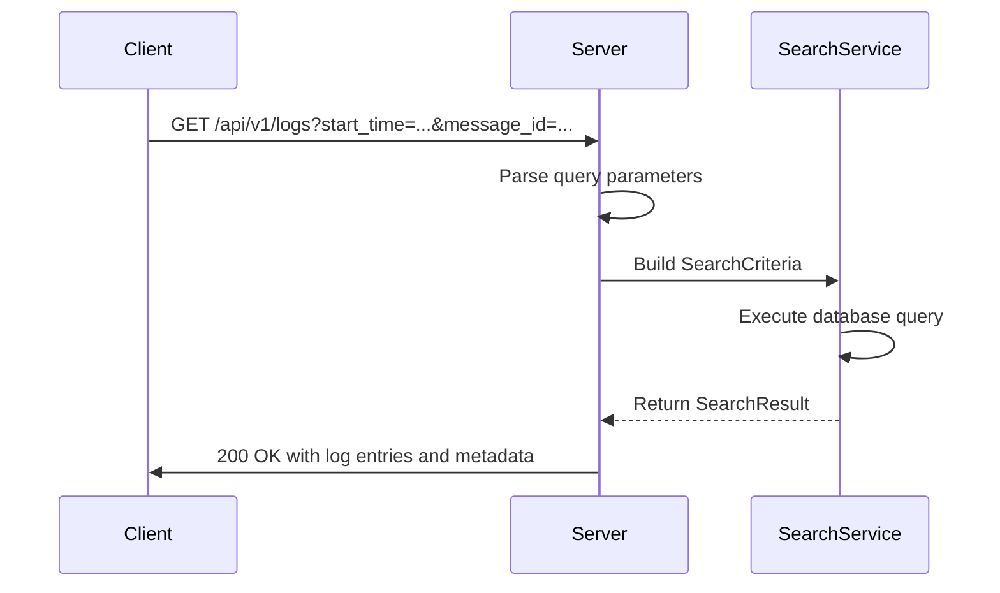
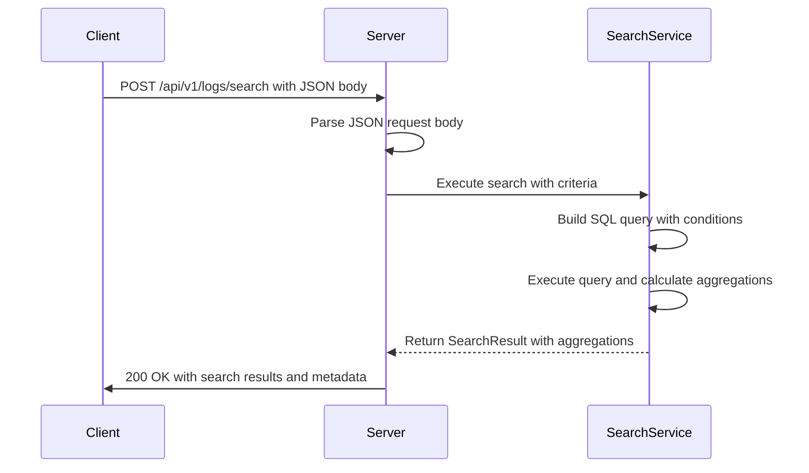
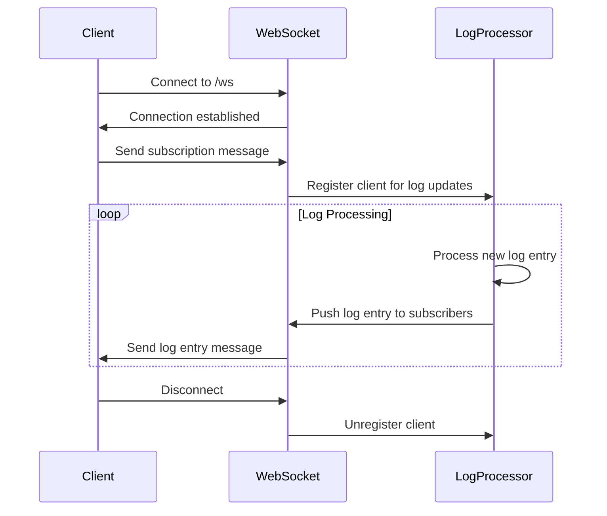
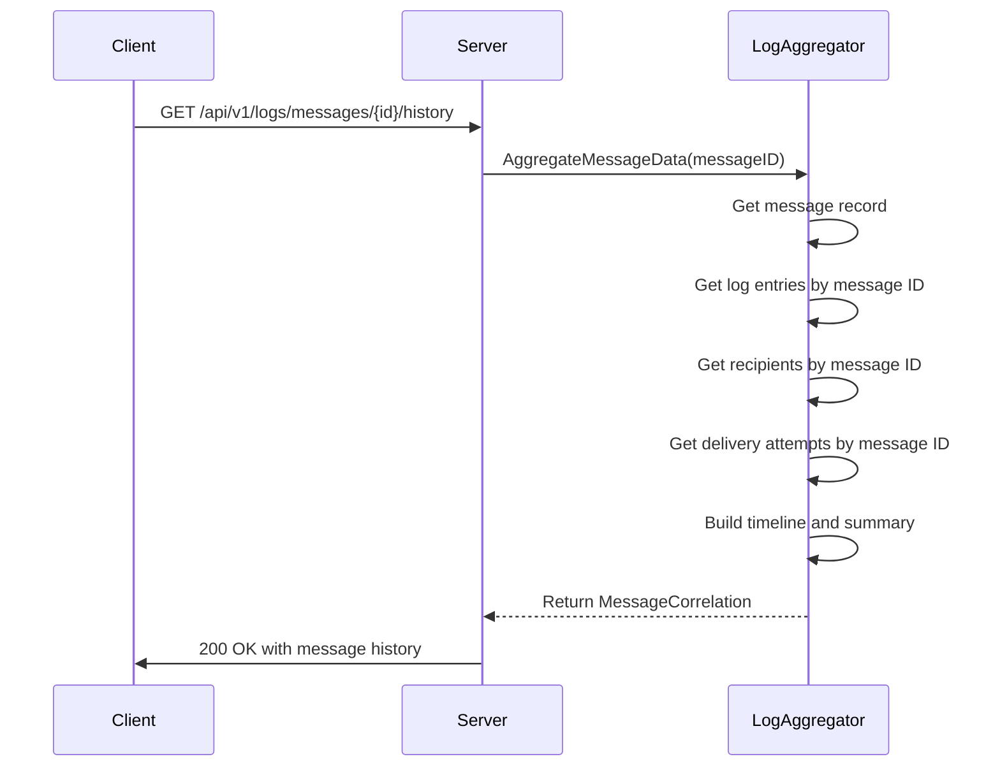
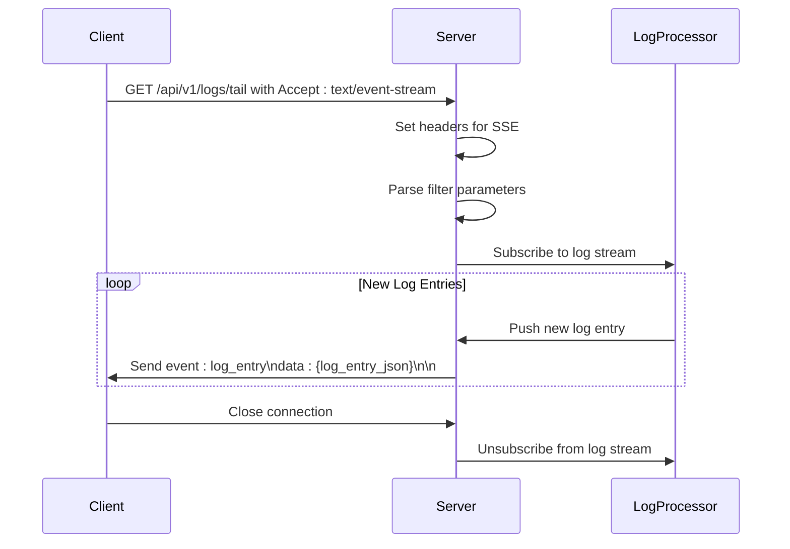
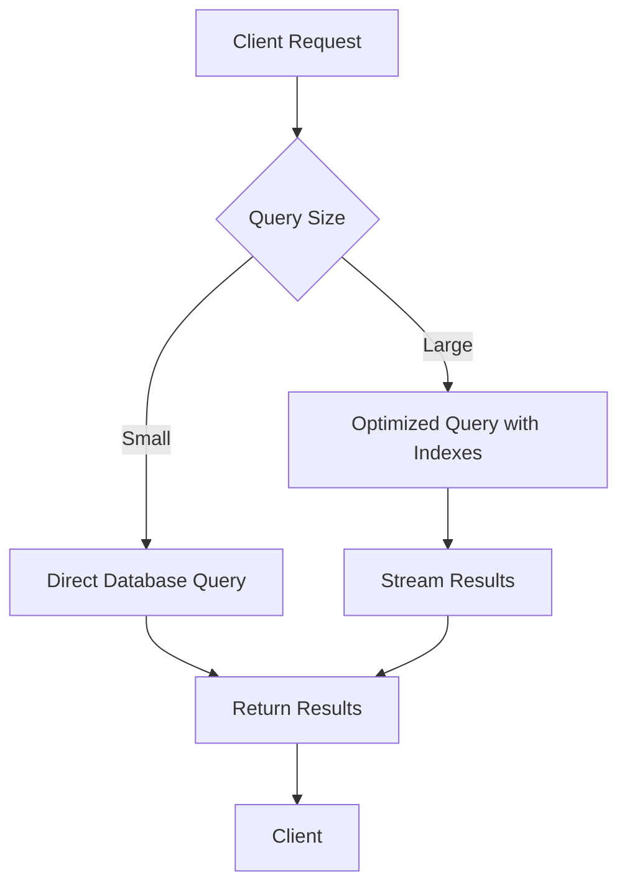

# Log Monitoring API


## Table of Contents
1. [Log Search Endpoints](#log-search-endpoints)
2. [Real-Time Log Tailing](#real-time-log-tailing)
3. [Message Correlation Endpoints](#message-correlation-endpoints)
4. [Request Parameters](#request-parameters)
5. [Response Format](#response-format)
6. [Server-Sent Events Implementation](#server-sent-events-implementation)
7. [Performance Considerations](#performance-considerations)
8. [Retention Policies](#retention-policies)

## Log Search Endpoints

The Log Monitoring API provides multiple endpoints for searching log entries with various filtering and pagination options. The API supports both simple query parameter-based searches and advanced JSON-based search requests.

### GET /api/v1/logs - Basic Log Search

This endpoint allows searching log entries using query parameters for filtering, sorting, and pagination.





**Section sources**
- [log_handlers.go](file://internal/api/log_handlers.go#L1-L128)

### POST /api/v1/logs/search - Advanced Log Search

This endpoint supports complex search criteria through a JSON request body, enabling more sophisticated filtering and search operations.





**Section sources**
- [log_handlers.go](file://internal/api/log_handlers.go#L129-L167)

### Search Criteria Structure

The search functionality is built around the `SearchCriteria` struct which defines all possible filtering options:


```go
type SearchCriteria struct {
    StartTime    *time.Time     `json:"start_time"`
    EndTime      *time.Time     `json:"end_time"`
    MessageID    string         `json:"message_id"`
    LogTypes     []string       `json:"log_types"`
    Events       []string       `json:"events"`
    Status       string         `json:"status"`
    Keywords     []string       `json:"keywords"`
    ErrorCode    string         `json:"error_code"`
    Host         string         `json:"host"`
    Sender       string         `json:"sender"`
    MinSize      *int64         `json:"min_size"`
    MaxSize      *int64         `json:"max_size"`
    SortBy       string         `json:"sort_by"`
    SortOrder    string         `json:"sort_order"`
    Limit        int            `json:"limit"`
    Offset       int            `json:"offset"`
}
```


**Section sources**
- [search.go](file://internal/logprocessor/search.go#L1-L50)

## Real-Time Log Tailing

The API supports real-time monitoring of log entries through WebSocket connections, allowing clients to receive log entries as they are processed.

### WebSocket Endpoint

The real-time log tailing is implemented as a WebSocket endpoint that clients can connect to for streaming log data.





**Section sources**
- [log_handlers.go](file://internal/api/log_handlers.go#L168-L180)
- [websocket.ts](file://web/src/services/websocket.ts#L1-L164)

## Message Correlation Endpoints

The API provides endpoints for retrieving message history and correlation data, which aggregates log entries, delivery attempts, and recipient information for a specific message.

### GET /api/v1/logs/messages/{id}/history - Message History

This endpoint returns all log entries associated with a specific message ID.





**Section sources**
- [log_handlers.go](file://internal/api/log_handlers.go#L242-L260)
- [aggregator.go](file://internal/logprocessor/aggregator.go#L1-L100)

### GET /api/v1/logs/messages/{id}/correlation - Message Correlation

This endpoint returns comprehensive correlation data for a message, including the message details, recipients, log entries, delivery attempts, timeline, and summary.


```go
type MessageCorrelation struct {
    MessageID  string                     `json:"message_id"`
    Message    *database.Message          `json:"message,omitempty"`
    Recipients []database.Recipient       `json:"recipients,omitempty"`
    LogEntries []database.LogEntry        `json:"log_entries"`
    Attempts   []database.DeliveryAttempt `json:"attempts,omitempty"`
    Timeline   []TimelineEvent            `json:"timeline"`
    Summary    MessageSummary             `json:"summary"`
}
```


**Section sources**
- [log_handlers.go](file://internal/api/log_handlers.go#L261-L287)
- [aggregator.go](file://internal/logprocessor/aggregator.go#L1-L537)

## Request Parameters

### Log Filtering Parameters

The API supports various parameters for filtering log entries:

**Time Range**
- **start_time**: RFC3339 formatted timestamp to filter logs from this time onward
- **end_time**: RFC3339 formatted timestamp to filter logs up to this time

**Search Terms**
- **message_id**: Filter logs by specific message ID
- **sender**: Filter logs by sender email address
- **keywords**: Array of keywords to search in raw_line or error_text fields
- **error_code**: Filter logs by error code pattern

**Categorization**
- **log_types**: Array of log types to include (main, reject, panic)
- **events**: Array of events to include (arrival, delivery, defer, bounce, reject, panic)
- **status**: Filter by message status
- **host**: Filter by host name pattern

**Size Filtering**
- **min_size**: Minimum message size in bytes
- **max_size**: Maximum message size in bytes

**Sorting**
- **sort_by**: Field to sort by (timestamp, message_id, size, etc.)
- **sort_order**: Sort order (asc or desc)

**Pagination**
- **page**: Page number (1-based)
- **per_page**: Number of items per page (default: 100, maximum: 1000)

**Section sources**
- [log_handlers.go](file://internal/api/log_handlers.go#L1-L128)
- [search.go](file://internal/logprocessor/search.go#L1-L50)

## Response Format

### Log Entry Structure

Each log entry in the response follows this structure:


```json
{
  "id": 12345,
  "timestamp": "2024-01-01T12:00:00Z",
  "message_id": "abc123-def456-ghi789",
  "log_type": "main",
  "event": "arrival",
  "host": "mail.example.com",
  "sender": "sender@example.com",
  "recipients": ["recipient@example.com"],
  "size": 12345,
  "status": "received",
  "error_code": "450",
  "error_text": "Temporary failure in mail delivery",
  "raw_line": "2024-01-01 12:00:00 ABC123 <= sender@example.com U=sender P=local S=12345"
}
```


**Section sources**
- [models.go](file://internal/database/models.go#L1-L340)
- [logs.ts](file://web/src/types/logs.ts#L1-L33)

### Search Response Structure

The search response includes log entries, search metadata, and aggregation data:


```json
{
  "entries": [...],
  "search_time": "123.45ms",
  "aggregations": {
    "event_counts": {
      "arrival": 150,
      "delivery": 75,
      "defer": 25
    },
    "log_type_counts": {
      "main": 200,
      "reject": 25
    },
    "status_counts": {
      "received": 150,
      "delivered": 75,
      "deferred": 25
    },
    "hourly_distribution": {
      "2024-01-01 12:00": 50,
      "2024-01-01 13:00": 75
    },
    "top_senders": [
      {
        "sender": "sender1@example.com",
        "count": 75
      }
    ],
    "top_hosts": [
      {
        "host": "mail.example.com",
        "count": 100
      }
    ]
  },
  "criteria": {
    "start_time": "2024-01-01T00:00:00Z",
    "end_time": "2024-01-01T23:59:59Z"
  }
}
```


**Section sources**
- [search.go](file://internal/logprocessor/search.go#L1-L541)
- [log_handlers.go](file://internal/api/log_handlers.go#L1-L431)

## Server-Sent Events Implementation

Although the current implementation uses WebSockets for real-time log streaming, the architecture supports a Server-Sent Events (SSE) approach for clients that prefer HTTP-based streaming.

### SSE Endpoint Design





### Message Format

SSE messages would follow this format:


```
event: log_entry
data: {"id":123,"timestamp":"2024-01-01T12:00:00Z","message_id":"abc123","event":"arrival",...}

event: heartbeat
data: {"timestamp":"2024-01-01T12:01:00Z"}

event: error
data: {"code":"CONNECTION_LIMIT","message":"Too many connections"}
```


**Section sources**
- [websocket.ts](file://web/src/services/websocket.ts#L1-L164)
- [RealTimeTail.tsx](file://web/src/components/Logs/RealTimeTail.tsx#L1-L306)

## Performance Considerations

### Large Log Queries

For queries that may return large result sets, the API implements several performance optimizations:

1. **Database Indexing**: The log_entries table has indexes on frequently queried fields:
   - timestamp (for time range queries)
   - message_id (for message-specific queries)
   - event (for event type filtering)
   - log_type (for log type filtering)

2. **Query Optimization**: The search service builds efficient SQL queries with proper WHERE clauses and pagination.

3. **Result Aggregation**: Aggregation calculations are performed on the server to reduce client-side processing.

4. **Caching**: Frequently accessed data may be cached to improve response times.





**Section sources**
- [search.go](file://internal/logprocessor/search.go#L1-L541)
- [streaming.go](file://internal/logprocessor/streaming.go#L1-L415)

## Retention Policies

The log monitoring system implements retention policies to manage storage and ensure optimal performance.

### Data Retention Rules

The retention policy is configurable and typically follows these guidelines:

- **Standard Retention**: Logs are retained for 30 days by default
- **Extended Retention**: Critical logs (panic, security events) may be retained for 90 days
- **Archival**: After the retention period, logs are moved to archival storage

### API Impact on Search Results

The retention policy affects search results in the following ways:

1. **Time Range Limitations**: Searches are automatically limited to the retention period
2. **Historical Data**: Requests for data beyond the retention period return empty results
3. **Performance**: The retention policy helps maintain query performance by limiting the searchable dataset


```go
// GetRetentionInfo returns information about log retention policies
func (s *Service) GetRetentionInfo(ctx context.Context) (*RetentionInfo, error) {
    return &RetentionInfo{
        StandardRetentionDays: 30,
        ExtendedRetentionDays: 90,
        TotalLogEntries:       s.repository.GetLogCount(),
        EarliestLogTime:       s.repository.GetEarliestLogTime(),
        LatestLogTime:         s.repository.GetLatestLogTime(),
    }, nil
}
```


**Section sources**
- [log_handlers.go](file://internal/api/log_handlers.go#L200-L241)
- [models.go](file://internal/database/models.go#L1-L340)

**Referenced Files in This Document**   
- [log_handlers.go](file://internal/api/log_handlers.go#L1-L431)
- [search.go](file://internal/logprocessor/search.go#L1-L541)
- [aggregator.go](file://internal/logprocessor/aggregator.go#L1-L537)
- [streaming.go](file://internal/logprocessor/streaming.go#L1-L415)
- [models.go](file://internal/database/models.go#L1-L340)
- [websocket.ts](file://web/src/services/websocket.ts#L1-L164)
- [RealTimeTail.tsx](file://web/src/components/Logs/RealTimeTail.tsx#L1-L306)
- [logs.ts](file://web/src/types/logs.ts#L1-L33)