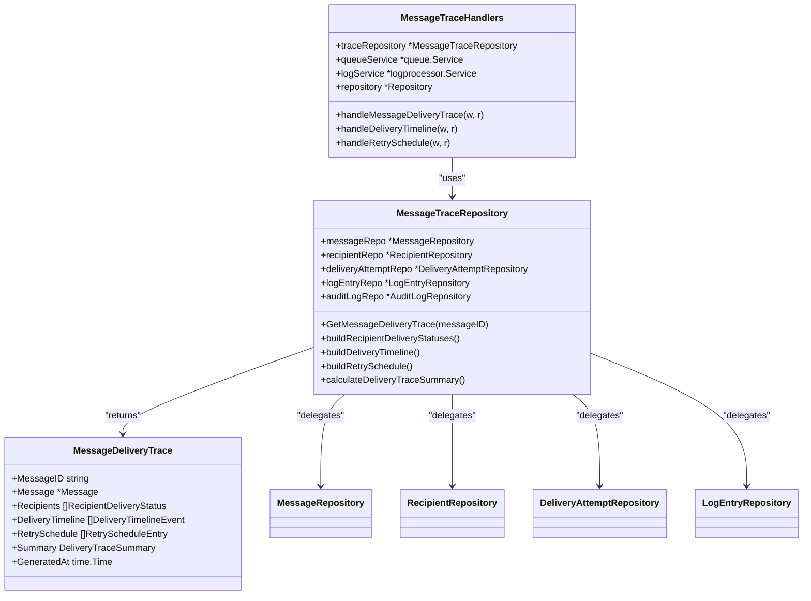
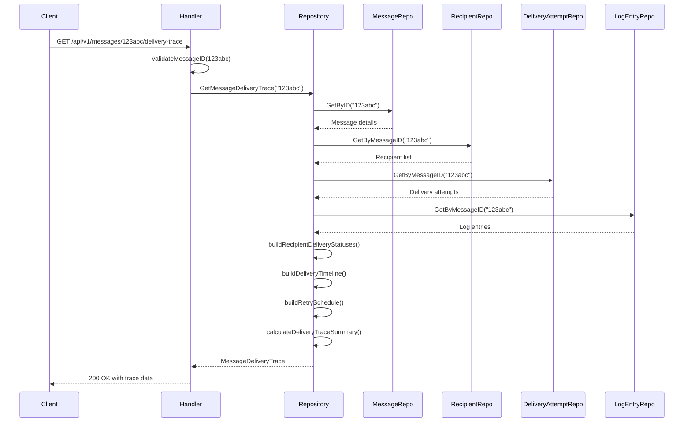
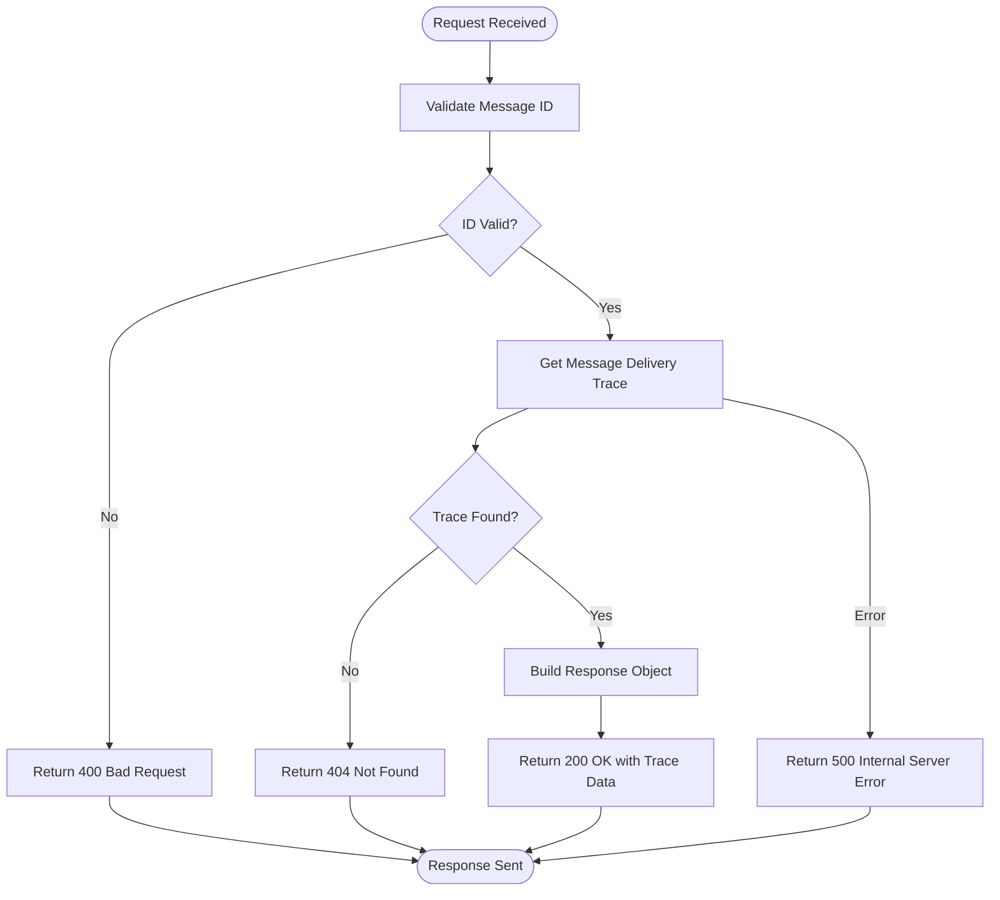
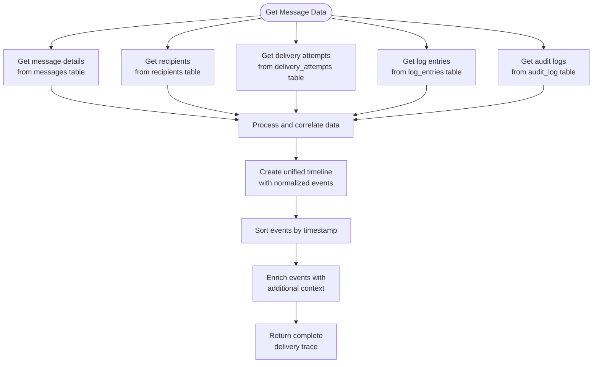

# Message Trace API


## Table of Contents
1. [Introduction](#introduction)
2. [Core Components](#core-components)
3. [Message Delivery Trace Endpoint](#message-delivery-trace-endpoint)
4. [Response Schema](#response-schema)
5. [Error Conditions](#error-conditions)
6. [Example Responses](#example-responses)
7. [Data Correlation and Timeline Construction](#data-correlation-and-timeline-construction)
8. [Data Enrichment Process](#data-enrichment-process)
9. [Caching Considerations](#caching-considerations)

## Introduction
The Message Trace API provides comprehensive visibility into the delivery history of email messages within the Exim Pilot system. This API enables administrators and operators to track message delivery attempts, recipient status, and the complete timeline of events from message arrival to final delivery or bounce. The system correlates data from multiple sources including message metadata, delivery attempts, log entries, and audit logs to construct a unified view of message delivery. This documentation details the primary endpoint for retrieving message delivery traces, including request parameters, response structure, error conditions, and implementation details.

## Core Components

The Message Trace API is built on several core components that work together to provide delivery tracing functionality. The main components include the message trace handlers, repository layer, and data models.





**Diagram sources**
- [message_trace_handlers.go](file://internal/api/message_trace_handlers.go#L15-L25)
- [repository.go](file://internal/database/repository.go#L665-L685)
- [models.go](file://internal/database/models.go#L180-L186)

**Section sources**
- [message_trace_handlers.go](file://internal/api/message_trace_handlers.go#L15-L25)
- [repository.go](file://internal/database/repository.go#L665-L741)
- [models.go](file://internal/database/models.go#L180-L210)

## Message Delivery Trace Endpoint

The primary endpoint for retrieving message delivery history is `GET /api/v1/messages/{id}/delivery-trace`. This endpoint provides a comprehensive view of a message's delivery journey, including recipient status, delivery attempts, and timeline data.

### Request Parameters
The endpoint accepts the following parameters:

**Path Parameters**
- `id` (string, required): The message ID to retrieve delivery trace information for. This corresponds to the Exim message ID.

**Query Parameters**
- None required for the basic delivery trace endpoint.

### Request Validation
The handler validates the message ID format before processing the request. The validation checks that:
- The message ID is not empty
- The message ID length is between 6 and 50 characters
- The message ID follows the expected format (alphanumeric with hyphens, typical of Exim message IDs)





**Diagram sources**
- [message_trace_handlers.go](file://internal/api/message_trace_handlers.go#L35-L55)
- [repository.go](file://internal/database/repository.go#L687-L741)

**Section sources**
- [message_trace_handlers.go](file://internal/api/message_trace_handlers.go#L35-L55)
- [repository.go](file://internal/database/repository.go#L687-L741)

## Response Schema

The response from the message delivery trace endpoint follows a structured schema that provides comprehensive information about the message's delivery history.

### Root Response Structure
The root response object contains the following fields:

**Response Fields**
- `message_id` (string): The unique identifier of the message
- `message` (object, optional): Basic message metadata including sender, timestamp, and size
- `recipients` (array): Array of recipient delivery status objects
- `delivery_timeline` (array): Chronological timeline of all delivery events
- `retry_schedule` (array): Scheduled retry attempts for deferred messages
- `summary` (object): Summary statistics of the delivery process
- `generated_at` (string, ISO 8601): Timestamp when the trace was generated

### Recipient Delivery Status
Each recipient in the `recipients` array contains detailed delivery information:

**Recipient Fields**
- `recipient` (string): Email address of the recipient
- `status` (string): Current delivery status (delivered, deferred, bounced, pending)
- `delivered_at` (string, ISO 8601, optional): Timestamp when the message was successfully delivered
- `last_attempt_at` (string, ISO 8601, optional): Timestamp of the most recent delivery attempt
- `next_retry_at` (string, ISO 8601, optional): Estimated time of the next retry attempt
- `attempt_count` (integer): Total number of delivery attempts made
- `last_smtp_code` (string, optional): SMTP response code from the last delivery attempt
- `last_error_text` (string, optional): Error message from the last failed delivery attempt
- `delivery_history` (array): Complete history of all delivery attempts for this recipient

### Delivery Timeline Event
Each event in the `delivery_timeline` array represents a significant event in the message's delivery journey:

**Timeline Event Fields**
- `timestamp` (string, ISO 8601): When the event occurred
- `event_type` (string): Type of event (arrival, attempt, delivery, defer, bounce, freeze, thaw, delete)
- `recipient` (string, optional): Affected recipient email address
- `host` (string, optional): Mail server host involved in the event
- `ip_address` (string, optional): IP address of the mail server
- `smtp_code` (string, optional): SMTP response code
- `error_text` (string, optional): Error description
- `description` (string): Human-readable description of the event
- `source` (string): Source of the event data (log, queue, audit)
- `source_id` (integer, optional): ID of the source record

### Retry Schedule Entry
Each entry in the `retry_schedule` array represents a scheduled retry attempt:

**Retry Schedule Fields**
- `recipient` (string): Email address of the recipient
- `scheduled_at` (string, ISO 8601): When the retry is scheduled to occur
- `attempt_number` (integer): Sequence number of this retry attempt
- `reason` (string): Reason for the retry (e.g., "connection timeout", "mailbox full")
- `is_estimated` (boolean): Whether the schedule is estimated (true) or from actual queue data (false)

### Delivery Trace Summary
The `summary` object provides aggregate statistics about the message delivery:

**Summary Fields**
- `total_recipients` (integer): Total number of recipients
- `delivered_count` (integer): Number of recipients successfully delivered to
- `deferred_count` (integer): Number of recipients with deferred delivery
- `bounced_count` (integer): Number of recipients that bounced
- `pending_count` (integer): Number of recipients with pending delivery status
- `total_attempts` (integer): Total number of delivery attempts across all recipients
- `first_attempt_at` (string, ISO 8601, optional): Timestamp of the first delivery attempt
- `last_attempt_at` (string, ISO 8601, optional): Timestamp of the most recent delivery attempt
- `average_delivery_time_seconds` (number, optional): Average time to deliver to successful recipients

**Section sources**
- [models.go](file://internal/database/models.go#L180-L210)

## Error Conditions

The message delivery trace endpoint can return several error conditions with appropriate HTTP status codes and error messages.

### Error Response Structure
All error responses follow the standard API response format with `success: false` and an error message:


```json
{
  "success": false,
  "error": "Descriptive error message"
}
```


### Specific Error Conditions

**400 Bad Request**
- Triggered when: Message ID is missing or invalid
- Error message: "Message ID is required" or "Invalid message ID format: [details]"
- Cause: Client did not provide a message ID or provided an ID that fails validation

**404 Not Found**
- Triggered when: Message with the specified ID does not exist
- Error message: "Message not found"
- Cause: The message ID does not correspond to any message in the system

**500 Internal Server Error**
- Triggered when: Database query fails or other internal error occurs
- Error message: "Failed to generate delivery trace: [specific error]"
- Cause: Database connectivity issues, query execution failures, or other server-side problems





**Diagram sources**
- [message_trace_handlers.go](file://internal/api/message_trace_handlers.go#L35-L55)

**Section sources**
- [message_trace_handlers.go](file://internal/api/message_trace_handlers.go#L35-L55)

## Example Responses

### Successful Delivery Trace Response

```json
{
  "success": true,
  "data": {
    "message_id": "123abc-def456-78",
    "message": {
      "id": "123abc-def456-78",
      "timestamp": "2023-12-01T10:30:00Z",
      "sender": "sender@example.com",
      "size": 15320,
      "status": "delivered"
    },
    "recipients": [
      {
        "recipient": "user1@domain.com",
        "status": "delivered",
        "delivered_at": "2023-12-01T10:32:15Z",
        "last_attempt_at": "2023-12-01T10:32:15Z",
        "attempt_count": 1,
        "last_smtp_code": "250",
        "last_error_text": null,
        "delivery_history": [
          {
            "id": 1,
            "message_id": "123abc-def456-78",
            "recipient": "user1@domain.com",
            "timestamp": "2023-12-01T10:32:15Z",
            "host": "mail.domain.com",
            "ip_address": "192.168.1.100",
            "status": "success",
            "smtp_code": "250",
            "error_message": null,
            "created_at": "2023-12-01T10:32:16Z"
          }
        ]
      },
      {
        "recipient": "user2@anotherdomain.com",
        "status": "deferred",
        "delivered_at": null,
        "last_attempt_at": "2023-12-01T10:35:20Z",
        "next_retry_at": "2023-12-01T11:05:20Z",
        "attempt_count": 2,
        "last_smtp_code": "451",
        "last_error_text": "Temporary local problem - please try later",
        "delivery_history": [
          {
            "id": 2,
            "message_id": "123abc-def456-78",
            "recipient": "user2@anotherdomain.com",
            "timestamp": "2023-12-01T10:31:10Z",
            "host": "mail.anotherdomain.com",
            "ip_address": "203.0.113.50",
            "status": "defer",
            "smtp_code": "451",
            "error_message": "Temporary local problem - please try later",
            "created_at": "2023-12-01T10:31:11Z"
          },
          {
            "id": 3,
            "message_id": "123abc-def456-78",
            "recipient": "user2@anotherdomain.com",
            "timestamp": "2023-12-01T10:35:20Z",
            "host": "mail.anotherdomain.com",
            "ip_address": "203.0.113.50",
            "status": "defer",
            "smtp_code": "451",
            "error_message": "Temporary local problem - please try later",
            "created_at": "2023-12-01T10:35:21Z"
          }
        ]
      }
    ],
    "delivery_timeline": [
      {
        "timestamp": "2023-12-01T10:30:00Z",
        "event_type": "arrival",
        "recipient": null,
        "host": null,
        "ip_address": null,
        "smtp_code": null,
        "error_text": null,
        "description": "Message received from sender@example.com",
        "source": "log",
        "source_id": 1001
      },
      {
        "timestamp": "2023-12-01T10:31:10Z",
        "event_type": "attempt",
        "recipient": "user2@anotherdomain.com",
        "host": "mail.anotherdomain.com",
        "ip_address": "203.0.113.50",
        "smtp_code": "451",
        "error_text": "Temporary local problem - please try later",
        "description": "Delivery attempt to user2@anotherdomain.com failed with temporary error",
        "source": "log",
        "source_id": 1002
      },
      {
        "timestamp": "2023-12-01T10:32:15Z",
        "event_type": "delivery",
        "recipient": "user1@domain.com",
        "host": "mail.domain.com",
        "ip_address": "192.168.1.100",
        "smtp_code": "250",
        "error_text": null,
        "description": "Message successfully delivered to user1@domain.com",
        "source": "log",
        "source_id": 1003
      },
      {
        "timestamp": "2023-12-01T10:35:20Z",
        "event_type": "attempt",
        "recipient": "user2@anotherdomain.com",
        "host": "mail.anotherdomain.com",
        "ip_address": "203.0.113.50",
        "smtp_code": "451",
        "error_text": "Temporary local problem - please try later",
        "description": "Second delivery attempt to user2@anotherdomain.com failed with temporary error",
        "source": "log",
        "source_id": 1004
      }
    ],
    "retry_schedule": [
      {
        "recipient": "user2@anotherdomain.com",
        "scheduled_at": "2023-12-01T11:05:20Z",
        "attempt_number": 3,
        "reason": "Temporary delivery failure",
        "is_estimated": true
      },
      {
        "recipient": "user2@anotherdomain.com",
        "scheduled_at": "2023-12-01T12:05:20Z",
        "attempt_number": 4,
        "reason": "Temporary delivery failure",
        "is_estimated": true
      }
    ],
    "summary": {
      "total_recipients": 2,
      "delivered_count": 1,
      "deferred_count": 1,
      "bounced_count": 0,
      "pending_count": 0,
      "total_attempts": 3,
      "first_attempt_at": "2023-12-01T10:31:10Z",
      "last_attempt_at": "2023-12-01T10:35:20Z",
      "average_delivery_time_seconds": 135.0
    },
    "generated_at": "2023-12-01T10:40:00Z"
  }
}
```


### Failed Delivery Trace Response

```json
{
  "success": false,
  "error": "Message not found"
}
```


**Section sources**
- [message_trace_handlers.go](file://internal/api/message_trace_handlers.go#L50-L55)
- [models.go](file://internal/database/models.go#L180-L210)

## Data Correlation and Timeline Construction

The Message Trace API constructs the delivery timeline by correlating log data with message metadata from multiple sources. This process creates a comprehensive view of the message's journey through the system.

### Data Sources Correlation
The API combines data from four primary sources to build the complete delivery trace:

**Data Sources**
- **Message Metadata**: Basic information about the message (ID, sender, timestamp, size) stored in the messages table
- **Recipients**: List of all recipients and their current delivery status from the recipients table
- **Delivery Attempts**: Detailed records of each delivery attempt including timestamps, hosts, and SMTP responses from the delivery_attempts table
- **Log Entries**: Parsed Exim log entries that provide context and additional details about message processing events
- **Audit Logs**: Administrative actions taken on the message (freeze, thaw, delete) from the audit_log table

### Timeline Construction Process
The timeline is constructed through a multi-step process that normalizes and sequences events from different sources:





The `buildDeliveryTimeline` method in the `MessageTraceRepository` combines events from all sources, normalizes them to a common structure, and sorts them chronologically. Each event is tagged with its source (log, queue, audit) to maintain provenance.

**Diagram sources**
- [repository.go](file://internal/database/repository.go#L743-L770)

**Section sources**
- [repository.go](file://internal/database/repository.go#L743-L770)

## Data Enrichment Process

The message trace data undergoes several enrichment processes to provide a more comprehensive and user-friendly view of the delivery history.

### Recipient Status Enrichment
The system enhances basic recipient data with additional delivery context:

**Enrichment Steps**
1. Initialize recipient status from the recipients table
2. Process all delivery attempts to update status based on the latest attempt
3. Calculate next retry time based on exponential backoff algorithm
4. Aggregate delivery history for complete attempt records
5. Set last attempt timestamp and error details

The `buildRecipientDeliveryStatuses` method implements this enrichment, updating recipient status based on delivery attempt outcomes:
- Success attempts set status to "delivered" and record delivery timestamp
- Bounce attempts set status to "bounced"
- Defer attempts set status to "deferred" and calculate next retry time

### Timeline Event Enrichment
Log entries are enriched with additional context to create meaningful timeline events:

**Enrichment Logic**
- Parse raw log lines to extract structured data
- Map log events to standardized event types (arrival, delivery, defer, bounce)
- Add descriptive text for human readability
- Correlate related events across different log entries
- Include source identifiers for traceability

### Summary Statistics Calculation
The system calculates aggregate statistics to provide quick insights into delivery performance:

**Summary Calculation**
- Count recipients by status (delivered, deferred, bounced, pending)
- Calculate total delivery attempts
- Determine first and last attempt timestamps
- Compute average delivery time for successfully delivered messages
- Identify delivery patterns and trends

The `calculateDeliveryTraceSummary` method performs these calculations, providing a high-level overview of the message's delivery journey.

**Section sources**
- [repository.go](file://internal/database/repository.go#L772-L810)

## Caching Considerations

The Message Trace API implements caching strategies to improve performance for frequently accessed message traces.

### Cache Implementation
While the current implementation does not show explicit caching code, several design patterns suggest caching opportunities:

**Caching Opportunities**
- Frequently accessed message traces (e.g., messages with delivery issues being actively monitored)
- Recent message traces that are likely to be accessed multiple times
- Message traces accessed by multiple users for collaboration

### Cache Key Strategy
A potential cache key could combine:
- Message ID
- Last modification timestamp of the message
- Hash of related delivery attempts and log entries

This ensures the cache is invalidated when new delivery attempts occur or message status changes.

### Cache Expiration
Cache entries should have appropriate expiration policies:
- Shorter expiration (5-15 minutes) for messages with deferred recipients that may have new delivery attempts
- Longer expiration (30-60 minutes) for messages with final status (delivered or bounced)
- Immediate invalidation when administrative actions are taken (freeze, thaw, delete)

### Performance Optimization
The API could implement several performance optimizations:

**Optimization Strategies**
- Database query optimization with proper indexing on message_id fields
- Batch retrieval of related data to minimize database round trips
- Connection pooling for database access
- Asynchronous processing for complex trace generation
- Pagination for messages with extensive delivery histories

The current implementation retrieves all related data in a single request, which is efficient for most messages but could be optimized for messages with very large delivery histories by implementing pagination or lazy loading for delivery history details.

**Section sources**
- [repository.go](file://internal/database/repository.go#L687-L741)
- [message_trace_handlers.go](file://internal/api/message_trace_handlers.go#L35-L55)

**Referenced Files in This Document**   
- [message_trace_handlers.go](file://internal/api/message_trace_handlers.go)
- [repository.go](file://internal/database/repository.go)
- [models.go](file://internal/database/models.go)
- [server.go](file://internal/api/server.go)