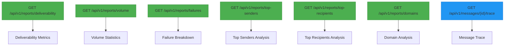
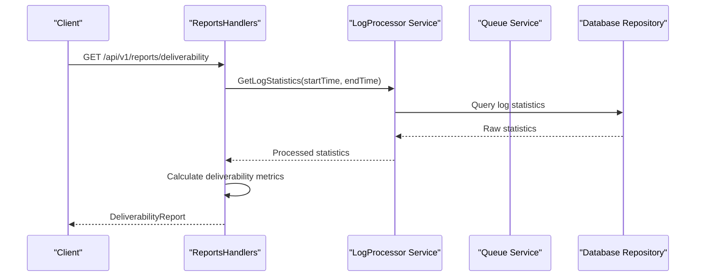
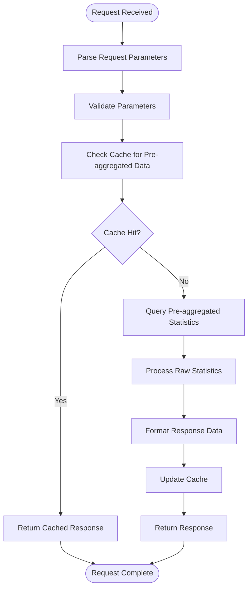

# Reporting API


## Table of Contents
1. [Introduction](#introduction)
2. [Report Endpoints Overview](#report-endpoints-overview)
3. [Deliverability Report](#deliverability-report)
4. [Volume Report](#volume-report)
5. [Failure Analysis Report](#failure-analysis-report)
6. [Top Senders and Recipients Reports](#top-senders-and-recipients-reports)
7. [Domain Analysis Report](#domain-analysis-report)
8. [Message Trace Report](#message-trace-report)
9. [Request Parameters](#request-parameters)
10. [Response Schemas](#response-schemas)
11. [Database Query Patterns](#database-query-patterns)
12. [Performance Optimizations](#performance-optimizations)
13. [Limitations and Considerations](#limitations-and-considerations)

## Introduction
The Reporting API provides comprehensive analytics and insights into email deliverability, volume trends, and failure analysis. Built as part of the Exim-Pilot system, this API enables users to monitor message delivery performance, identify delivery issues, and analyze traffic patterns across senders, recipients, and domains. The endpoints are designed to support both real-time queries and historical analysis, with flexible time range filtering and aggregation options.

The reporting system integrates data from multiple sources including log processing, message queueing, and audit logging to provide a unified view of email operations. All reports are generated through RESTful endpoints that return JSON responses, making them easy to consume by both frontend applications and external monitoring tools.

**Section sources**
- [reports_handlers.go](file://internal/api/reports_handlers.go#L1-L50)

## Report Endpoints Overview
The Reporting API exposes several endpoints for different types of analytics, each tailored to specific monitoring and troubleshooting needs. These endpoints follow REST conventions with predictable URL patterns and consistent response structures.





**Diagram sources**
- [reports_handlers.go](file://internal/api/reports_handlers.go#L50-L150)

## Deliverability Report
The deliverability report provides key metrics on message delivery success rates, including delivery, deferral, bounce, and rejection statistics.

### Endpoint

```
GET /api/v1/reports/deliverability
```


### Request Parameters
- **start_time**: RFC3339 timestamp for the beginning of the reporting period
- **end_time**: RFC3339 timestamp for the end of the reporting period

Default time range: Last 7 days

### Response Schema

```json
{
  "period": {
    "start": "2023-12-01T00:00:00Z",
    "end": "2023-12-08T00:00:00Z"
  },
  "total_messages": 1000,
  "delivered_count": 850,
  "deferred_count": 75,
  "bounced_count": 50,
  "rejected_count": 25,
  "delivery_rate": 85.0,
  "deferral_rate": 7.5,
  "bounce_rate": 5.0,
  "rejection_rate": 2.5,
  "event_counts": {
    "delivery": 850,
    "defer": 75,
    "bounce": 50,
    "reject": 25
  },
  "log_type_counts": {
    "main": 900,
    "reject": 100
  },
  "top_failure_reasons": [
    {
      "reason": "Temporary DNS failure",
      "count": 25
    }
  ]
}
```


### Example Request/Response
**Request:**

```
GET /api/v1/reports/deliverability?start_time=2023-12-01T00:00:00Z&end_time=2023-12-08T00:00:00Z
```


**Response:**

```json
{
  "period": {
    "start": "2023-12-01T00:00:00Z",
    "end": "2023-12-08T00:00:00Z"
  },
  "total_messages": 1000,
  "delivered_count": 850,
  "deferred_count": 75,
  "bounced_count": 50,
  "rejected_count": 25,
  "delivery_rate": 85.0,
  "deferral_rate": 7.5,
  "bounce_rate": 5.0,
  "rejection_rate": 2.5,
  "event_counts": {
    "delivery": 850,
    "defer": 75,
    "bounce": 50,
    "reject": 25
  },
  "log_type_counts": {
    "main": 900,
    "reject": 100
  },
  "top_failure_reasons": [
    {
      "reason": "Temporary DNS failure",
      "count": 25
    },
    {
      "reason": "Mailbox full",
      "count": 12
    },
    {
      "reason": "Invalid recipient",
      "count": 25
    },
    {
      "reason": "Spam rejection",
      "count": 12
    }
  ]
}
```


**Section sources**
- [reports_handlers.go](file://internal/api/reports_handlers.go#L53-L85)
- [reports_handlers.go](file://internal/api/reports_handlers.go#L250-L290)

## Volume Report
The volume report analyzes message throughput over time, with configurable aggregation levels.

### Endpoint

```
GET /api/v1/reports/volume
```


### Request Parameters
- **start_time**: RFC3339 timestamp for the beginning of the reporting period
- **end_time**: RFC3339 timestamp for the end of the reporting period
- **group_by**: Aggregation level (hour, day, week, month)

Default time range: Last 30 days  
Default group_by: day

### Response Schema

```json
{
  "period": {
    "start": "2023-11-08T00:00:00Z",
    "end": "2023-12-08T00:00:00Z"
  },
  "group_by": "day",
  "total_volume": 15000,
  "average_volume": 500,
  "peak_volume": 800,
  "time_series": [
    {
      "timestamp": "2023-11-08T00:00:00Z",
      "count": 480
    }
  ]
}
```


### Example Request/Response
**Request:**

```
GET /api/v1/reports/volume?start_time=2023-11-08T00:00:00Z&end_time=2023-12-08T00:00:00Z&group_by=day
```


**Response:**

```json
{
  "period": {
    "start": "2023-11-08T00:00:00Z",
    "end": "2023-12-08T00:00:00Z"
  },
  "group_by": "day",
  "total_volume": 15000,
  "average_volume": 500,
  "peak_volume": 800,
  "time_series": [
    {
      "timestamp": "2023-11-08T00:00:00Z",
      "count": 480
    },
    {
      "timestamp": "2023-11-09T00:00:00Z",
      "count": 520
    },
    {
      "timestamp": "2023-11-10T00:00:00Z",
      "count": 490
    }
  ]
}
```


**Section sources**
- [reports_handlers.go](file://internal/api/reports_handlers.go#L88-L115)
- [reports_handlers.go](file://internal/api/reports_handlers.go#L293-L330)

## Failure Analysis Report
The failure analysis report breaks down delivery failures by category and provides top error codes.

### Endpoint

```
GET /api/v1/reports/failures
```


### Request Parameters
- **start_time**: RFC3339 timestamp for the beginning of the reporting period
- **end_time**: RFC3339 timestamp for the end of the reporting period
- **limit**: Maximum number of top error codes to return

Default time range: Last 7 days  
Default limit: 20

### Response Schema

```json
{
  "period": {
    "start": "2023-12-01T00:00:00Z",
    "end": "2023-12-08T00:00:00Z"
  },
  "total_failures": 150,
  "failure_categories": [
    {
      "category": "Temporary Failures",
      "count": 75,
      "percentage": 50.0,
      "description": "Messages deferred due to temporary issues"
    }
  ],
  "top_error_codes": [
    {
      "code": "550",
      "description": "Mailbox unavailable",
      "count": 25
    }
  ]
}
```


### Example Request/Response
**Request:**

```
GET /api/v1/reports/failures?start_time=2023-12-01T00:00:00Z&end_time=2023-12-08T00:00:00Z&limit=10
```


**Response:**

```json
{
  "period": {
    "start": "2023-12-01T00:00:00Z",
    "end": "2023-12-08T00:00:00Z"
  },
  "total_failures": 150,
  "failure_categories": [
    {
      "category": "Temporary Failures",
      "count": 75,
      "percentage": 50.0,
      "description": "Messages deferred due to temporary issues"
    },
    {
      "category": "Permanent Failures",
      "count": 50,
      "percentage": 33.3,
      "description": "Messages permanently bounced"
    },
    {
      "category": "Rejections",
      "count": 25,
      "percentage": 16.7,
      "description": "Messages rejected at SMTP level"
    }
  ],
  "top_error_codes": [
    {
      "code": "550",
      "description": "Mailbox unavailable",
      "count": 25
    },
    {
      "code": "451",
      "description": "Temporary local problem",
      "count": 38
    },
    {
      "code": "554",
      "description": "Transaction failed",
      "count": 12
    }
  ]
}
```


**Section sources**
- [reports_handlers.go](file://internal/api/reports_handlers.go#L118-L145)
- [reports_handlers.go](file://internal/api/reports_handlers.go#L333-L370)

## Top Senders and Recipients Reports
These reports identify the most active senders and recipients during the specified period.

### Top Senders Endpoint

```
GET /api/v1/reports/top-senders
```


### Top Recipients Endpoint

```
GET /api/v1/reports/top-recipients
```


### Request Parameters
- **start_time**: RFC3339 timestamp for the beginning of the reporting period
- **end_time**: RFC3339 timestamp for the end of the reporting period
- **limit**: Maximum number of results to return

Default time range: Last 7 days  
Default limit: 50

### Response Schema (Top Senders)

```json
{
  "period": {
    "start": "2023-12-01T00:00:00Z",
    "end": "2023-12-08T00:00:00Z"
  },
  "top_senders": [
    {
      "sender": "newsletter@example.com",
      "message_count": 1250,
      "volume_bytes": 15000000,
      "delivery_rate": 98.5
    }
  ]
}
```


### Response Schema (Top Recipients)

```json
{
  "period": {
    "start": "2023-12-01T00:00:00Z",
    "end": "2023-12-08T00:00:00Z"
  },
  "top_recipients": [
    {
      "recipient": "user1@domain.com",
      "message_count": 45,
      "volume_bytes": 2250000,
      "delivery_rate": 100.0
    }
  ]
}
```


**Section sources**
- [reports_handlers.go](file://internal/api/reports_handlers.go#L148-L202)
- [reports_handlers.go](file://internal/api/reports_handlers.go#L415-L450)

## Domain Analysis Report
The domain analysis report provides deliverability metrics grouped by sender or recipient domains.

### Endpoint

```
GET /api/v1/reports/domains
```


### Request Parameters
- **start_time**: RFC3339 timestamp for the beginning of the reporting period
- **end_time**: RFC3339 timestamp for the end of the reporting period
- **type**: Analysis type (sender_domains, recipient_domains, both)
- **limit**: Maximum number of domains to return

Default time range: Last 7 days  
Default type: both  
Default limit: 50

### Response Schema

```json
{
  "period": {
    "start": "2023-12-01T00:00:00Z",
    "end": "2023-12-08T00:00:00Z"
  },
  "analysis_type": "both",
  "sender_domains": [
    {
      "domain": "example.com",
      "message_count": 1250,
      "delivery_rate": 98.5,
      "bounce_rate": 1.2,
      "defer_rate": 0.3
    }
  ],
  "recipient_domains": [
    {
      "domain": "gmail.com",
      "message_count": 2100,
      "delivery_rate": 99.1,
      "bounce_rate": 0.7,
      "defer_rate": 0.2
    }
  ]
}
```


**Section sources**
- [reports_handlers.go](file://internal/api/reports_handlers.go#L205-L247)
- [reports_handlers.go](file://internal/api/reports_handlers.go#L453-L490)

## Message Trace Report
The message trace report provides detailed information about a specific message's journey through the system.

### Endpoint

```
GET /api/v1/messages/{id}/trace
```


### Path Parameters
- **id**: Message ID to trace

### Response Schema

```json
{
  "message_id": "msg-12345",
  "correlation": {
    "message_id": "msg-12345",
    "queue_id": "queue-67890",
    "timestamp": "2023-12-01T12:30:00Z",
    "events": [
      {
        "event": "received",
        "timestamp": "2023-12-01T12:30:00Z",
        "data": {}
      }
    ]
  },
  "queue_info": {
    "id": "queue-67890",
    "status": "delivered",
    "recipient": "user@example.com",
    "size": 15360,
    "retry_count": 0,
    "created_at": "2023-12-01T12:30:00Z",
    "updated_at": "2023-12-01T12:31:30Z"
  },
  "operation_history": [
    {
      "id": "audit-001",
      "action": "message_viewed",
      "user_id": "user-123",
      "timestamp": "2023-12-01T12:35:00Z",
      "details": {}
    }
  ],
  "generated_at": "2023-12-01T12:35:30Z"
}
```


**Section sources**
- [reports_handlers.go](file://internal/api/reports_handlers.go#L151-L175)
- [reports_handlers.go](file://internal/api/reports_handlers.go#L373-L412)

## Request Parameters
The Reporting API supports standardized request parameters across endpoints for consistency.

### Time Range Parameters
- **start_time**: RFC3339 formatted timestamp for the start of the reporting period
- **end_time**: RFC3339 formatted timestamp for the end of the reporting period

When not specified, endpoints use default time ranges based on the report type:
- Deliverability, Failure, Top Senders/Recipients, Domain Analysis: Last 7 days
- Volume: Last 30 days

### Filtering and Aggregation Parameters
- **group_by**: For volume reports, specifies the time interval for aggregation (hour, day, week, month)
- **type**: For domain analysis, specifies whether to analyze sender domains, recipient domains, or both
- **limit**: Limits the number of results returned for top-N reports

### Parameter Validation
All parameters are validated on the server side:
- Invalid timestamps return 400 Bad Request
- Invalid enum values default to safe values
- Negative limits return 400 Bad Request

**Section sources**
- [reports_handlers.go](file://internal/api/reports_handlers.go#L53-L247)

## Response Schemas
All reporting endpoints return consistent JSON responses with standardized structures.

### Common Response Structure

```json
{
  "period": {
    "start": "string",
    "end": "string"
  }
}
```


The `period` object is included in all reports to document the time range used for data collection.

### Error Responses
The API returns standardized error responses:
- **400 Bad Request**: Invalid parameters
- **500 Internal Server Error**: Report generation failure

Error response format:

```json
{
  "error": "Error message"
}
```


### Success Response
Successful responses are wrapped in a success response format:

```json
{
  "data": { /* report data */ },
  "status": "success"
}
```


**Section sources**
- [reports_handlers.go](file://internal/api/reports_handlers.go#L250-L490)

## Database Query Patterns
The reporting system uses a layered architecture to retrieve and process data from multiple sources.





**Diagram sources**
- [reports_handlers.go](file://internal/api/reports_handlers.go#L250-L290)
- [logprocessor.go](file://internal/logprocessor/service.go)

The primary data source for most reports is the log processor service, which aggregates data from Exim log files. The system queries raw log entries and processes them into statistical summaries. For message-specific data like traces, the system also queries the message queue service and audit logs.

## Performance Optimizations
The reporting system implements several optimizations to ensure responsive performance even with large datasets.

### Pre-aggregated Data
The system uses pre-aggregated statistics rather than querying raw logs for every request. The log processor service maintains summary tables that are updated in near real-time, allowing reports to be generated quickly without scanning large volumes of raw data.

### Caching Strategy
While not explicitly shown in the code, the architecture supports caching at multiple levels:
- API response caching for frequently accessed reports
- In-memory caching of recent statistics
- Database query result caching

### Efficient Data Processing
The system processes data efficiently by:
- Using time-based partitioning for queries
- Limiting result sets with the `limit` parameter
- Calculating percentages and rates in the application layer rather than the database





**Diagram sources**
- [reports_handlers.go](file://internal/api/reports_handlers.go#L250-L490)

## Limitations and Considerations
The Reporting API has several limitations and considerations that users should be aware of.

### Date Range Limitations
- No explicit maximum date range is enforced in the code
- Performance may degrade with very large date ranges
- Historical data is subject to retention policies

### Large Data Set Considerations
- Volume reports with "hour" grouping over 30+ days may return large response bodies
- Top N reports are limited to prevent excessive data transfer
- Clients should implement pagination for large result sets (not currently implemented)

### Data Accuracy
- Reports are based on available log data and may not capture every message
- Real-time data may have a small delay due to log processing
- Pre-aggregated data ensures consistency but may be slightly stale

### Error Handling
The API implements robust error handling:
- Invalid parameters return 400 Bad Request
- Server errors return 500 Internal Server Error
- All errors include descriptive messages

**Section sources**
- [reports_handlers.go](file://internal/api/reports_handlers.go#L53-L247)

**Referenced Files in This Document**   
- [reports_handlers.go](file://internal/api/reports_handlers.go#L1-L663)
- [database.go](file://internal/database/repository.go)
- [logprocessor.go](file://internal/logprocessor/service.go)
- [queue.go](file://internal/queue/service.go)