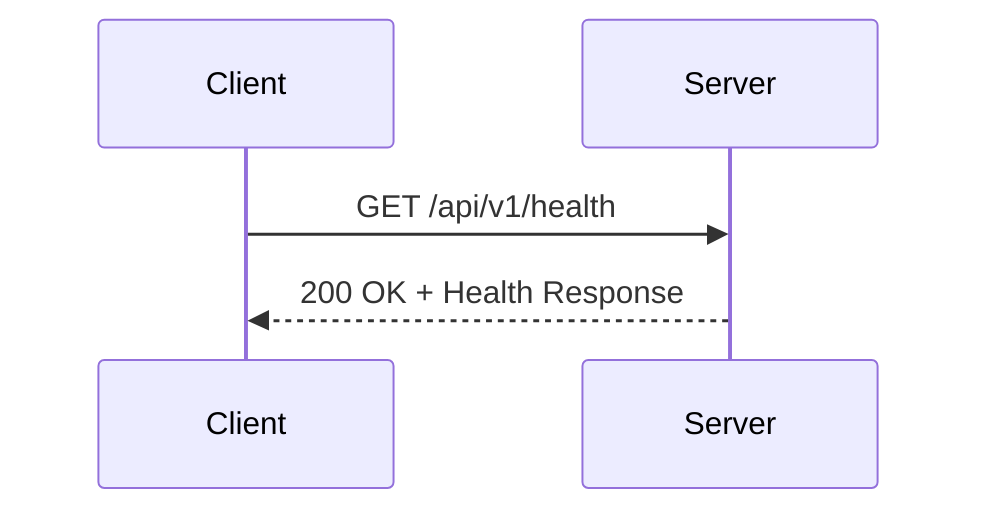
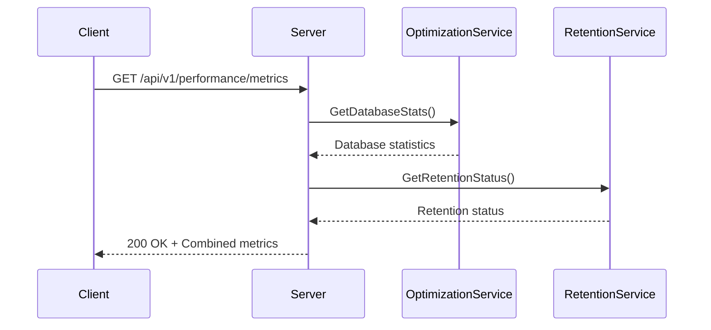

# Performance Monitoring API


## Table of Contents
1. [Introduction](#introduction)
2. [Health Check Endpoint](#health-check-endpoint)
3. [System Metrics Endpoint](#system-metrics-endpoint)
4. [Response Format](#response-format)
5. [Usage Scenarios](#usage-scenarios)

## Introduction
The Performance Monitoring API provides essential endpoints for monitoring the health and performance of the Exim-Pilot system. This documentation details the health check and system metrics endpoints, which are critical for ensuring system reliability and performance. These endpoints are designed to be consumed by external monitoring systems, load balancers, and administrative interfaces to assess system status and performance characteristics.

## Health Check Endpoint

The health check endpoint provides a simple way to verify the basic operational status of the API server. It is designed to be lightweight and fast, making it suitable for frequent polling by load balancers and monitoring systems.

### Endpoint Details
- **URL**: `/api/v1/health`
- **HTTP Method**: `GET`
- **Authentication**: Not required
- **Purpose**: To verify that the API server is running and responsive

The health check endpoint does not perform deep system checks such as database connectivity or storage availability. It simply confirms that the HTTP server is running and able to process requests. This makes it ideal for load balancer health checks that need to quickly determine if an instance should receive traffic.





**Diagram sources**
- [server.go](file://internal/api/server.go#L256-L273)

**Section sources**
- [server.go](file://internal/api/server.go#L256-L273)

## System Metrics Endpoint

The system metrics endpoint provides comprehensive performance data about the application, including database statistics and data retention status. This endpoint offers a more detailed view of system health compared to the basic health check.

### Endpoint Details
- **URL**: `/api/v1/performance/metrics`
- **HTTP Method**: `GET`
- **Authentication**: Required (valid session)
- **Purpose**: To retrieve detailed performance metrics for monitoring and analysis

### Dependencies and System Checks
Unlike the basic health check, the system metrics endpoint performs actual system checks that reveal the health of critical components:

**Database Connectivity**: The endpoint verifies database connectivity by retrieving database statistics through the optimization service. If the database is unreachable or unresponsive, the endpoint will return a 500 Internal Server Error.

**Storage Availability**: While not directly checking filesystem storage, the endpoint monitors database storage usage by collecting database size metrics. This provides insight into the storage consumption of the primary data store.

### Collected Metrics
The system metrics endpoint collects and returns the following performance data:

- **Database Statistics**: Size of the database, row counts for all tables, and index information
- **Retention Status**: Configuration and status of data retention policies across different data types
- **System Timestamp**: The timestamp from when the metrics were collected





**Diagram sources**
- [performance_handlers.go](file://internal/api/performance_handlers.go#L83-L107)
- [server.go](file://internal/api/server.go#L217-L219)

**Section sources**
- [performance_handlers.go](file://internal/api/performance_handlers.go#L83-L107)

## Response Format

Both the health check and system metrics endpoints use a standardized response format defined by the `APIResponse` structure. This consistent format makes it easier for clients to parse and handle responses.

### Standard Response Structure
All API responses follow this structure:

```json
{
  "success": boolean,
  "data": object,
  "error": string,
  "meta": object
}
```


Where:
- **success**: Indicates whether the request was successful
- **data**: Contains the response payload (when successful)
- **error**: Contains error message (when unsuccessful)
- **meta**: Contains additional metadata such as pagination information

### Health Check Response Examples

**Healthy State Response**

```json
{
  "success": true,
  "data": {
    "status": "healthy",
    "timestamp": "2025-08-24T10:00:00Z",
    "version": "1.0.0"
  }
}
```


**Degraded State Simulation**
While the current implementation does not return degraded states, a potential degraded response could look like:

```json
{
  "success": false,
  "error": "Database connection timeout",
  "data": {
    "status": "degraded",
    "component": "database",
    "timestamp": "2025-08-24T10:00:00Z"
  }
}
```


### System Metrics Response Example

```json
{
  "success": true,
  "data": {
    "database": {
      "timestamp": "2025-08-24T10:00:00Z",
      "database_size": 104857600,
      "table_stats": {
        "log_entries": {
          "row_count": 15000
        },
        "queue_messages": {
          "row_count": 250
        }
      },
      "index_stats": {
        "idx_log_timestamp": {
          "table_name": "log_entries"
        }
      }
    },
    "retention": {
      "config": {
        "log_entries_retention_days": 30,
        "audit_log_retention_days": 90,
        "enable_auto_cleanup": true
      },
      "table_stats": {
        "log_entries": {
          "table_name": "log_entries",
          "retention_days": 30,
          "total_rows": 15000,
          "expired_rows": 1200,
          "oldest_record": "2025-07-01T08:30:00Z"
        }
      }
    },
    "system": {
      "timestamp": "2025-08-24T10:00:00Z"
    }
  }
}
```


**Section sources**
- [response.go](file://internal/api/response.go#L8-L13)
- [performance_handlers.go](file://internal/api/performance_handlers.go#L83-L107)
- [server.go](file://internal/api/server.go#L264-L273)

## Usage Scenarios

### External Monitoring Systems
External monitoring systems should use both endpoints in a complementary fashion:

1. **Frequent Health Checks**: Use the `/api/v1/health` endpoint with high frequency (e.g., every 5-10 seconds) to quickly detect if the service is completely down.

2. **Detailed Performance Monitoring**: Use the `/api/v1/performance/metrics` endpoint at a lower frequency (e.g., every 30-60 seconds) to collect detailed performance data for alerting and trend analysis.

Monitoring systems can trigger alerts based on:
- Failure to reach the health endpoint (service down)
- Database size approaching capacity limits
- High numbers of expired rows indicating retention issues
- Errors when accessing the metrics endpoint (database connectivity problems)

### Load Balancer Health Checks
Load balancers should use the `/api/v1/health` endpoint for health checks because:

- It does not require authentication, simplifying configuration
- It is lightweight and fast to respond
- It only checks the HTTP server status, not dependent systems
- A failure indicates the instance cannot handle any requests

When a load balancer receives a non-200 response from the health endpoint, it should remove the instance from the pool until it starts responding successfully again.

### Administrative and Operational Use
System administrators can use the `/api/v1/performance/metrics` endpoint to:

- Monitor database growth trends
- Verify that data retention policies are working correctly
- Identify tables with high row counts that may need optimization
- Track the effectiveness of database cleanup operations

The frontend component `PerformanceMonitor.tsx` demonstrates how these metrics can be visualized in a user interface, showing database size, table statistics, and retention status in an easily digestible format.


```mermaid
flowchart TD
A[Monitoring System] --> B{Check Type}
B --> |Fast Availability| C[/api/v1/health\\nGET Request]
B --> |Detailed Metrics| D[/api/v1/performance/metrics\\nGET Request]
C --> E[200 OK?]
D --> F[Parse Metrics]
E --> |Yes| G[Instance Healthy]
E --> |No| H[Alert: Service Down]
F --> I[Analyze Trends]
I --> J[Alert if Thresholds Exceeded]
```


**Diagram sources**
- [server.go](file://internal/api/server.go#L202-L224)
- [PerformanceMonitor.tsx](file://web/src/components/Performance/PerformanceMonitor.tsx)

**Section sources**
- [PerformanceMonitor.tsx](file://web/src/components/Performance/PerformanceMonitor.tsx)
- [performance_handlers.go](file://internal/api/performance_handlers.go)
- [server.go](file://internal/api/server.go)

**Referenced Files in This Document**   
- [performance_handlers.go](file://internal/api/performance_handlers.go)
- [server.go](file://internal/api/server.go)
- [response.go](file://internal/api/response.go)
- [PerformanceMonitor.tsx](file://web/src/components/Performance/PerformanceMonitor.tsx)