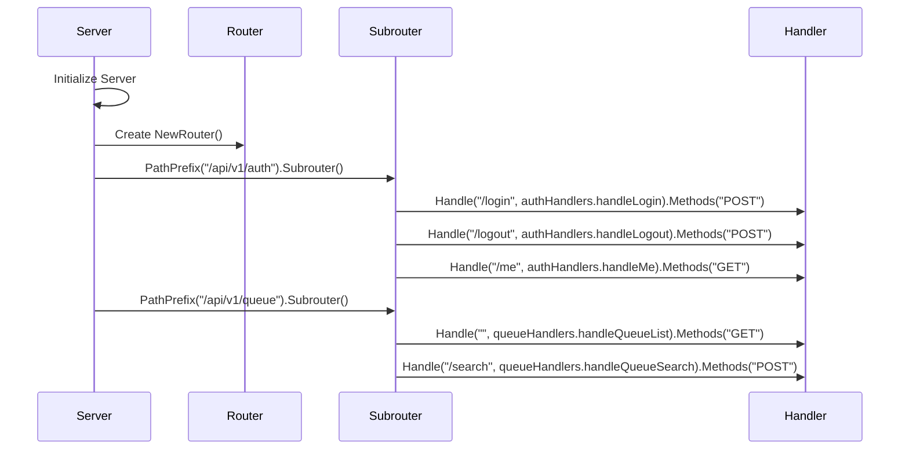
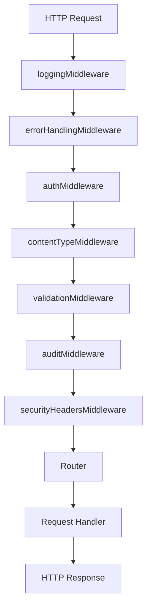
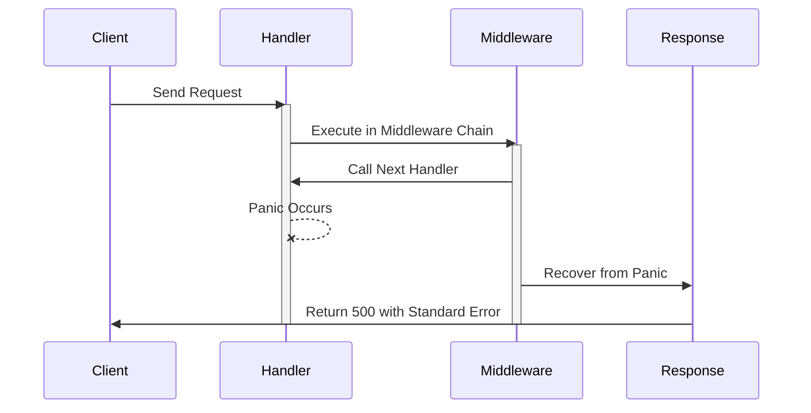
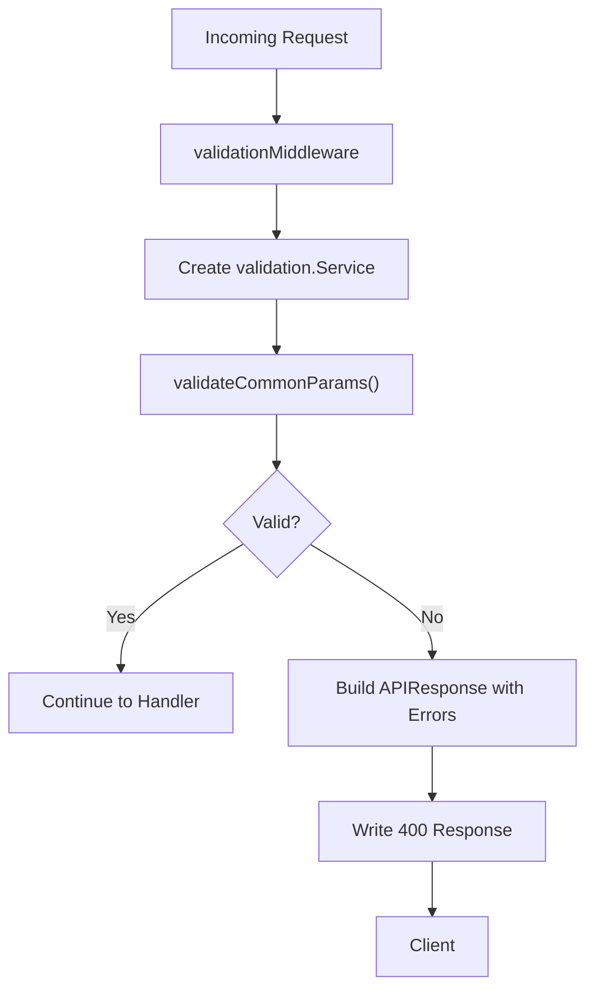
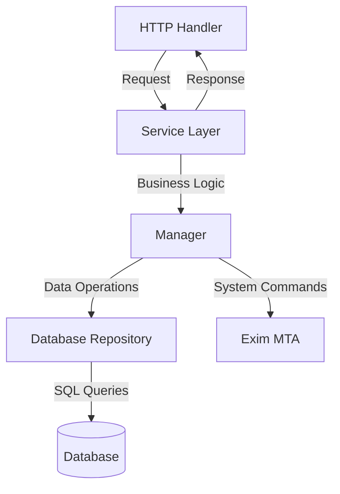

# API Architecture


## Table of Contents
1. [Gorilla/Mux Router Configuration](#gorillamux-router-configuration)
2. [Route Registration Pattern](#route-registration-pattern)
3. [API Versioning Strategy](#api-versioning-strategy)
4. [Middleware Chain](#middleware-chain)
5. [Response Envelope Structure](#response-envelope-structure)
6. [Centralized Error Handling](#centralized-error-handling)
7. [Request Validation Process](#request-validation-process)
8. [Security Headers Enforcement](#security-headers-enforcement)
9. [Separation of Concerns](#separation-of-concerns)
10. [API Extensibility and Endpoint Addition Patterns](#api-extensibility-and-endpoint-addition-patterns)

## Gorilla/Mux Router Configuration

The API layer utilizes the gorilla/mux router to manage HTTP request routing with support for URL parameters, method-based routing, and subrouters. The router is configured within the `Server` struct in `server.go`, where it is initialized and assigned to the server's `router` field. This configuration enables advanced routing features such as path variables, strict slash handling, and query parameter matching.

The router is instantiated during server initialization and is used to register all API endpoints through structured route registration methods. It supports both static and dynamic routes, with dynamic segments captured using curly brace syntax (e.g., `/api/v1/messages/{id}`).


```mermaid
graph TD
Server[Server] --> Router[gorilla/mux Router]
Router --> AuthSubrouter[Auth Subrouter]
Router --> QueueSubrouter[Queue Subrouter]
Router --> LogSubrouter[Log Subrouter]
Router --> MessageTraceSubrouter[Message Trace Subrouter]
AuthSubrouter --> LoginRoute[/api/v1/auth/login]
AuthSubrouter --> LogoutRoute[/api/v1/auth/logout]
AuthSubrouter --> MeRoute[/api/v1/auth/me]
```


**Diagram sources**
- [server.go](file://internal/api/server.go#L1-L50)

**Section sources**
- [server.go](file://internal/api/server.go#L1-L100)

## Route Registration Pattern

Routes are registered using a modular and organized pattern that groups endpoints by functional domain. Each handler group (e.g., authentication, queue management, message tracing) defines its own set of routes, which are then mounted onto the main router via subrouters. This approach promotes separation of concerns and simplifies route management.

Route registration occurs in the `setupRoutes` method of the `Server` struct. Subrouters are created for major API sections (e.g., `/api/v1/auth`, `/api/v1/queue`), and individual handlers are attached to specific HTTP methods and paths. For example:

- `POST /api/v1/auth/login` → `authHandlers.handleLogin`
- `GET /api/v1/queue` → `queueHandlers.handleQueueList`
- `GET /api/v1/messages/{id}/delivery-trace` → `messageTraceHandlers.handleMessageDeliveryTrace`

This pattern ensures consistent URL structure and makes it easy to apply middleware selectively at the subrouter level.





**Diagram sources**
- [server.go](file://internal/api/server.go#L200-L300)

**Section sources**
- [server.go](file://internal/api/server.go#L200-L300)

## API Versioning Strategy

The application implements URL-based API versioning through the `/api/v1/` prefix applied to all endpoints. This versioning strategy is consistently used across all routes, as evidenced by endpoint definitions in various handler files (e.g., `auth_handlers.go`, `queue_handlers.go`, `log_handlers.go`).

Versioning is enforced at the routing level by defining subrouters under the `/api/v1` path. For example:
- `POST /api/v1/auth/login`
- `GET /api/v1/queue`
- `GET /api/v1/logs`

The current API version is also exposed through the health check endpoint (`GET /api/v1/health`), which returns version information in its response payload:

```json
{
  "success": true,
  "data": {
    "status": "healthy",
    "timestamp": "2023-01-01T00:00:00Z",
    "version": "1.0.0"
  }
}
```


This indicates a semantic versioning scheme where the URL path reflects the major version (`v1`), while the detailed version string in responses includes minor and patch levels.

**Section sources**
- [server.go](file://internal/api/server.go#L256-L273)
- [log_handlers.go](file://internal/api/log_handlers.go#L22-L379)

## Middleware Chain

The API employs a layered middleware chain to handle cross-cutting concerns such as authentication, logging, error recovery, and security. These middleware functions are applied in a specific order during server initialization to ensure proper execution flow.

The middleware chain includes:

1. **Logging Middleware**: Captures request details including method, path, status code, duration, IP address, and user agent.
2. **Error Handling Middleware**: Recovers from panics and returns standardized error responses.
3. **Authentication Middleware**: Validates session cookies for protected routes, skipping public endpoints like login and health checks.
4. **Content Type Middleware**: Ensures API responses have the correct `application/json` content type.
5. **Validation Middleware**: Applies input validation using the validation service.
6. **Audit Middleware**: Logs administrative actions for audit trail purposes.
7. **Security Headers Middleware**: Enforces security-related HTTP headers.

These middleware components are registered in the `setupMiddleware` method and wrapped around the main router using the `Use()` function.





**Diagram sources**
- [middleware.go](file://internal/api/middleware.go#L1-L200)

**Section sources**
- [middleware.go](file://internal/api/middleware.go#L1-L200)

## Response Envelope Structure

All API endpoints use a standardized response envelope structure defined by the `APIResponse` struct in `response.go`. This consistent format ensures predictable payloads across all endpoints and simplifies client-side handling.

The `APIResponse` structure includes the following fields:
- `Success` (boolean): Indicates whether the request was successful
- `Data` (object, optional): Contains the primary response data
- `Error` (string, optional): Contains error message if request failed
- `Meta` (object, optional): Contains pagination and metadata

Example successful response:

```json
{
  "success": true,
  "data": {
    "user": { "id": 1, "username": "admin" },
    "expires_at": "2023-01-01T00:00:00Z"
  }
}
```


Example error response:

```json
{
  "success": false,
  "error": "Invalid credentials"
}
```


For paginated responses, the `Meta` field includes pagination details:

```json
{
  "success": true,
  "data": { "messages": [...] },
  "meta": {
    "page": 1,
    "per_page": 50,
    "total": 127,
    "total_pages": 3
  }
}
```


Helper functions like `WriteSuccessResponse`, `WriteErrorResponse`, and `WriteBadRequestResponse` abstract the construction of these standardized responses.

**Section sources**
- [response.go](file://internal/api/response.go#L0-L92)

## Centralized Error Handling

The API implements centralized error handling through a combination of middleware and utility functions. The `errorHandlingMiddleware` provides panic recovery by wrapping handler execution in a `defer` block that catches any runtime panics and returns a standardized 500 Internal Server Error response.

Additionally, the system uses dedicated response writer functions for common HTTP error cases:
- `WriteBadRequestResponse`: 400 Bad Request
- `WriteNotFoundResponse`: 404 Not Found
- `WriteUnauthorizedResponse`: 401 Unauthorized
- `WriteForbiddenResponse`: 403 Forbidden
- `WriteInternalErrorResponse`: 500 Internal Server Error

These functions ensure consistent error formatting across all endpoints. When an error occurs, the handler constructs an `APIResponse` with `success: false` and an appropriate error message, then uses the corresponding writer function to send the response with the correct status code.

The centralized approach prevents information leakage by sanitizing internal error details before sending them to clients.





**Diagram sources**
- [middleware.go](file://internal/api/middleware.go#L30-L60)
- [response.go](file://internal/api/response.go#L70-L90)

**Section sources**
- [middleware.go](file://internal/api/middleware.go#L30-L60)
- [response.go](file://internal/api/response.go#L70-L90)

## Request Validation Process

Request validation is handled by the `validation.Service` component, which provides a comprehensive set of validation methods for different data types and business rules. The validation process is triggered through the `validationMiddleware`, which instantiates a validation service and applies common parameter checks.

Key validation capabilities include:
- **Message ID format**: Validates Exim message ID pattern (e.g., `1ABC23-DEF456-GH`)
- **Email addresses**: Uses `net/mail` package to validate format and enforces length limits
- **IP addresses**: Validates IPv4/IPv6 format using `net.ParseIP`
- **Operations**: Validates against allowed operations (deliver, freeze, thaw, delete)
- **Status values**: Validates message status against allowed values
- **Pagination**: Validates page and per_page parameters
- **Time ranges**: Ensures start time precedes end time and range is reasonable

The validation service returns structured error responses that include the invalid field, error message, and submitted value. For bulk operations, it aggregates multiple validation errors into a `ValidationErrors` collection.





**Section sources**
- [validation/service.go](file://internal/validation/service.go#L0-L200)
- [middleware.go](file://internal/api/middleware.go#L150-L180)

## Security Headers Enforcement

Security headers are enforced through the `securityHeadersMiddleware` function, which sets critical HTTP security headers on all responses. This middleware ensures that all API responses include protections against common web vulnerabilities.

The implemented security headers include:
- `X-Content-Type-Options: nosniff` – Prevents MIME type sniffing
- `X-Frame-Options: DENY` – Prevents clickjacking attacks
- `X-XSS-Protection: 1; mode=block` – Enables XSS filtering in browsers
- `Strict-Transport-Security` – Enforces HTTPS (when available)
- `Content-Security-Policy` – Restricts resource loading (basic implementation)

These headers are applied globally to all responses, ensuring consistent security posture across the API surface. The middleware is applied early in the chain to guarantee header presence even if subsequent handlers fail.

**Section sources**
- [middleware.go](file://internal/api/middleware.go#L250-L300)

## Separation of Concerns

The architecture follows a clear separation of concerns between handlers, services, and data access layers:

1. **Handlers (Presentation Layer)**: Located in `internal/api/*_handlers.go`, these components handle HTTP-specific concerns like request parsing, response formatting, and status code management. They delegate business logic to service layers.

2. **Services (Business Logic Layer)**: Found in `internal/*/service.go` (e.g., `queue/service.go`, `auth/service.go`), these components contain core business logic and coordinate operations between different system components.

3. **Data Access Layer**: Implemented in `internal/database/repository.go`, this layer provides database operations through repository patterns, abstracting SQL queries and connection management.

For example, when processing a queue list request:
1. `queueHandlers.handleQueueList` parses pagination parameters
2. Calls `queueService.GetQueueStatus()` for business logic
3. Service uses `Manager.ListQueue()` to retrieve data
4. Manager interacts with Exim system and database
5. Handler formats response using `WriteSuccessResponseWithMeta`

This clean separation enables independent testing, maintenance, and evolution of each layer.





**Diagram sources**
- [queue_handlers.go](file://internal/api/queue_handlers.go#L1-L50)
- [service.go](file://internal/queue/service.go#L1-L50)
- [repository.go](file://internal/database/repository.go#L1-L50)

**Section sources**
- [queue_handlers.go](file://internal/api/queue_handlers.go#L1-L200)
- [service.go](file://internal/queue/service.go#L1-L200)
- [repository.go](file://internal/database/repository.go#L1-L200)

## API Extensibility and Endpoint Addition Patterns

The API is designed for extensibility through a consistent pattern for adding new endpoints:

1. **Create Handler Struct**: Define a new handler struct in `internal/api/` that encapsulates related endpoints (e.g., `ReportsHandlers`).

2. **Implement Handler Methods**: Add methods for each endpoint, following the pattern of request parsing, service invocation, and response formatting.

3. **Register Routes**: In `server.go`, extend `setupRoutes` to mount the new handler's routes under an appropriate subrouter.

4. **Apply Middleware**: Ensure appropriate middleware (auth, validation) is applied to new endpoints.

5. **Use Standard Responses**: Utilize the response helper functions to maintain consistency.

Example pattern for adding a new reports endpoint:

```go
// 1. Add method to ReportsHandlers
func (h *ReportsHandlers) handleVolumeReport(w http.ResponseWriter, r *http.Request) {
    // Parse parameters
    // Call service.ReportsService.GenerateVolumeReport()
    // Format response with WriteSuccessResponseWithMeta()
}

// 2. Register in setupRoutes
reportsSubrouter.HandleFunc("/reports/volume", reportsHandlers.handleVolumeReport).Methods("GET")
```


This modular approach allows new features to be added without disrupting existing functionality, while maintaining architectural consistency.

**Section sources**
- [server.go](file://internal/api/server.go#L200-L300)
- [queue_handlers.go](file://internal/api/queue_handlers.go#L1-L50)

**Referenced Files in This Document**   
- [auth_handlers.go](file://internal/api/auth_handlers.go)
- [middleware.go](file://internal/api/middleware.go)
- [response.go](file://internal/api/response.go)
- [server.go](file://internal/api/server.go)
- [queue_handlers.go](file://internal/api/queue_handlers.go)
- [validation/service.go](file://internal/validation/service.go)