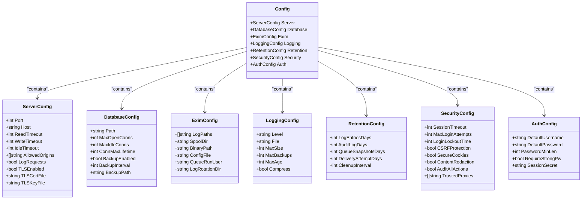
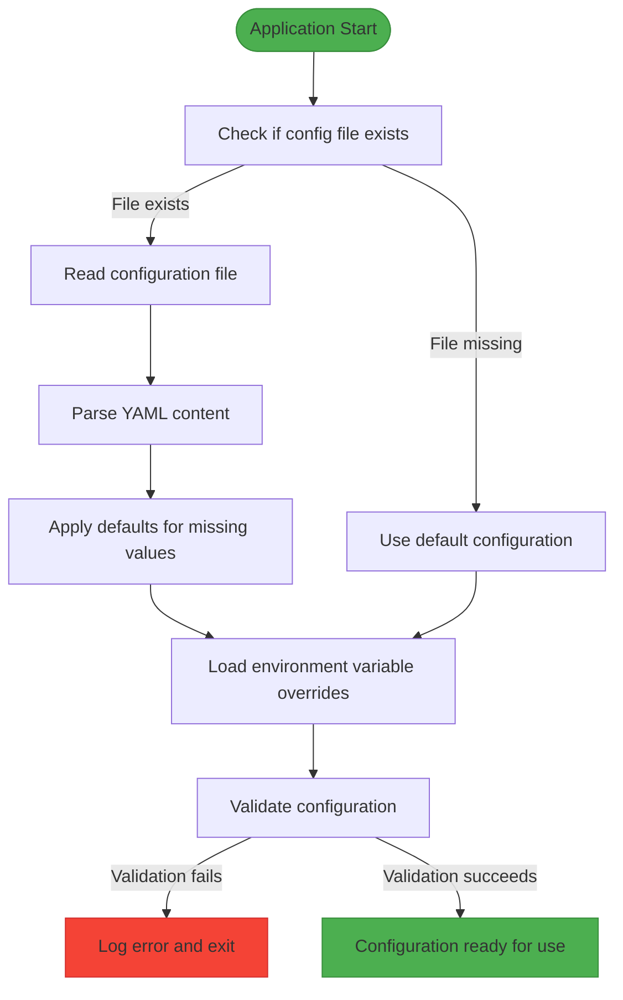
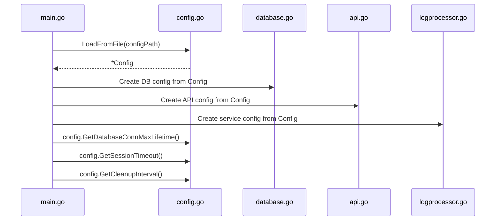
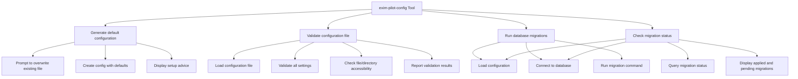

# Configuration Service


## Table of Contents
1. [Introduction](#introduction)
2. [Configuration Structure](#configuration-structure)
3. [Configuration Loading Process](#configuration-loading-process)
4. [YAML Parsing and Environment Overrides](#yaml-parsing-and-environment-overrides)
5. [Configuration Validation](#configuration-validation)
6. [Runtime Configuration Access](#runtime-configuration-access)
7. [Configuration Management Tool](#configuration-management-tool)
8. [Example Configuration Analysis](#example-configuration-analysis)

## Introduction
The Configuration Service in the Exim-Pilot application provides a comprehensive system for managing application settings through YAML configuration files with environment variable overrides. This service handles the loading, parsing, validation, and runtime access of configuration values that control various aspects of the application including server settings, database connections, Exim integration, logging, data retention, security policies, and authentication parameters. The configuration system is designed to be flexible, secure, and easy to manage in different deployment environments.

## Configuration Structure
The configuration structure is organized into several logical sections, each responsible for a specific aspect of the application's behavior. The main Config struct serves as a container for these specialized configuration components.





**Diagram sources**
- [config.go](file://internal/config/config.go#L14-L91)

**Section sources**
- [config.go](file://internal/config/config.go#L14-L91)

### Server Configuration
The ServerConfig struct manages HTTP server settings:

- **Port**: The TCP port number (1-65535) on which the server listens
- **Host**: The network interface to bind to (e.g., "0.0.0.0" for all interfaces)
- **ReadTimeout**: Maximum duration for reading the entire request (in seconds)
- **WriteTimeout**: Maximum duration for writing the response (in seconds)
- **IdleTimeout**: Maximum time to wait for the next request (in seconds)
- **AllowedOrigins**: CORS policy specifying which domains can access the API
- **LogRequests**: Flag to enable or disable HTTP request logging
- **TLSEnabled**: Flag to enable HTTPS/TLS encryption
- **TLSCertFile**: Path to the TLS certificate file when TLS is enabled
- **TLSKeyFile**: Path to the TLS private key file when TLS is enabled

### Database Configuration
The DatabaseConfig struct controls SQLite database settings:

- **Path**: File system path to the SQLite database file
- **MaxOpenConns**: Maximum number of open database connections
- **MaxIdleConns**: Maximum number of idle database connections
- **ConnMaxLifetime**: Maximum lifetime of a connection before reuse (in minutes)
- **BackupEnabled**: Flag to enable automatic database backups
- **BackupInterval**: Frequency of automatic backups (in hours)
- **BackupPath**: Directory where database backups are stored

### Exim Configuration
The EximConfig struct contains settings for Exim mail server integration:

- **LogPaths**: Array of file paths to Exim log files that should be monitored
- **SpoolDir**: Path to the Exim spool directory for message storage
- **BinaryPath**: Path to the Exim binary executable
- **ConfigFile**: Path to the main Exim configuration file
- **QueueRunUser**: System user account that runs Exim queue operations
- **LogRotationDir**: Directory where rotated Exim logs are stored

### Logging Configuration
The LoggingConfig struct manages application logging behavior:

- **Level**: Minimum log level to record (debug, info, warn, error, fatal)
- **File**: Path to the log file (empty for stdout only)
- **MaxSize**: Maximum size of a log file before rotation (in MB)
- **MaxBackups**: Number of rotated log files to retain
- **MaxAge**: Maximum age of log files to retain (in days)
- **Compress**: Flag to enable compression of rotated log files

### Retention Configuration
The RetentionConfig struct defines data retention policies:

- **LogEntriesDays**: Number of days to retain message log entries
- **AuditLogDays**: Number of days to retain audit log entries
- **QueueSnapshotsDays**: Number of days to retain queue snapshots
- **DeliveryAttemptDays**: Number of days to retain delivery attempt records
- **CleanupInterval**: Frequency of automated cleanup operations (in hours)

### Security Configuration
The SecurityConfig struct controls security-related settings:

- **SessionTimeout**: Duration of user session inactivity before timeout (in minutes)
- **MaxLoginAttempts**: Maximum failed login attempts before lockout
- **LoginLockoutTime**: Duration of login lockout after maximum attempts (in minutes)
- **CSRFProtection**: Flag to enable CSRF protection for web forms
- **SecureCookies**: Flag to require HTTPS for cookie transmission
- **ContentRedaction**: Flag to enable redaction of sensitive content in logs/UI
- **AuditAllActions**: Flag to enable auditing of all administrative actions
- **TrustedProxies**: List of trusted proxy IP addresses/ranges for forwarded requests

### Authentication Configuration
The AuthConfig struct manages authentication settings:

- **DefaultUsername**: Username for the default admin account
- **DefaultPassword**: Password for the default admin account
- **PasswordMinLen**: Minimum required password length
- **RequireStrongPw**: Flag to require strong password complexity
- **SessionSecret**: Secret key for session encryption (auto-generated if empty)

## Configuration Loading Process
The configuration loading process follows a well-defined sequence to ensure reliable application startup with appropriate settings.





**Diagram sources**
- [config.go](file://internal/config/config.go#L158-L208)

**Section sources**
- [config.go](file://internal/config/config.go#L158-L208)

The loading process begins when the application calls the `LoadFromFile` function with a specified configuration file path. If the file does not exist, the system proceeds with default configuration values rather than failing immediately. This allows the application to start with sensible defaults and potentially generate a configuration file during first run.

When the configuration file is present, it is read into memory and parsed as YAML. The system then applies any environment variable overrides, which take precedence over values in the configuration file. Finally, the complete configuration is validated to ensure all settings are appropriate and required resources are accessible.

## YAML Parsing and Environment Overrides
The configuration system uses YAML as its primary format for configuration files, providing a human-readable and structured way to define application settings. The parsing process leverages the `gopkg.in/yaml.v3` library to convert YAML content into Go structs.

### Environment Variable Overrides
The system supports environment variable overrides for key configuration settings, allowing deployment-specific values to be injected without modifying configuration files. This is particularly useful for containerized deployments and sensitive values like passwords.

The following environment variables can override configuration settings:

- **EXIM_PILOT_PORT**: Overrides server port
- **EXIM_PILOT_HOST**: Overrides server host binding
- **EXIM_PILOT_READ_TIMEOUT**: Overrides request read timeout
- **EXIM_PILOT_WRITE_TIMEOUT**: Overrides response write timeout
- **EXIM_PILOT_ALLOWED_ORIGINS**: Overrides CORS allowed origins
- **EXIM_PILOT_TLS_ENABLED**: Enables or disables TLS
- **EXIM_PILOT_TLS_CERT**: Path to TLS certificate file
- **EXIM_PILOT_TLS_KEY**: Path to TLS key file
- **EXIM_PILOT_DB_PATH**: Overrides database file path
- **EXIM_PILOT_DB_MAX_CONNS**: Overrides maximum database connections
- **EXIM_PILOT_LOG_PATHS**: Overrides Exim log file paths (comma-separated)
- **EXIM_PILOT_SPOOL_DIR**: Overrides Exim spool directory
- **EXIM_PILOT_BINARY_PATH**: Overrides path to Exim binary
- **EXIM_PILOT_LOG_LEVEL**: Overrides application log level
- **EXIM_PILOT_LOG_FILE**: Overrides application log file path
- **EXIM_PILOT_ADMIN_USER**: Overrides default admin username
- **EXIM_PILOT_ADMIN_PASSWORD**: Overrides default admin password
- **EXIM_PILOT_SESSION_SECRET**: Overrides session secret key
- **EXIM_PILOT_SESSION_TIMEOUT**: Overrides session timeout duration
- **EXIM_PILOT_SECURE_COOKIES**: Enables or disables secure cookies


```go
// Example of environment variable override processing
if port := os.Getenv("EXIM_PILOT_PORT"); port != "" {
    if p, err := strconv.Atoi(port); err == nil {
        c.Server.Port = p
    }
}

if logLevel := os.Getenv("EXIM_PILOT_LOG_LEVEL"); logLevel != "" {
    c.Logging.Level = logLevel
}
```


**Section sources**
- [config.go](file://internal/config/config.go#L203-L298)

The environment variable processing occurs in the `LoadFromEnv` method, which checks for the presence of each supported environment variable and applies the override if found. String values are applied directly, while numeric values are converted from strings. Boolean values are typically set to true if the environment variable exists and contains "true" (case-insensitive).

## Configuration Validation
Configuration validation ensures that all settings are appropriate and required system resources are accessible before the application proceeds with startup.

```mermaid
flowchart TD
ValidateConfig["Validate Configuration"] --> ValidateServer["Validate Server Settings"]
ValidateServer --> CheckPort["Port in valid range (1-65535)"]
ValidateServer --> CheckHost["Host not empty"]
ValidateServer --> CheckTLS["TLS files exist if TLS enabled"]
ValidateConfig --> ValidateDatabase["Validate Database Settings"]
ValidateDatabase --> CheckPath["Database path not empty"]
ValidateDatabase --> CheckDir["Database directory accessible"]
ValidateDatabase --> CheckConns["Valid connection limits"]
ValidateConfig --> ValidateExim["Validate Exim Settings"]
ValidateExim --> CheckLogs["Log paths specified and accessible"]
ValidateExim --> CheckSpool["Spool directory not empty"]
ValidateExim --> CheckBinary["Exim binary exists"]
ValidateConfig --> ValidateLogging["Validate Logging Settings"]
ValidateLogging --> CheckLevel["Valid log level"]
ValidateLogging --> CheckLogDir["Log directory accessible"]
ValidateConfig --> ValidateAuth["Validate Authentication Settings"]
ValidateAuth --> CheckCredentials["Username and password not empty"]
ValidateAuth --> CheckMinLength["Password minimum length ≥ 4"]
ValidateAuth --> GenerateSecret["Generate session secret if empty"]
ValidateConfig --> ValidateSecurity["Validate Security Settings"]
ValidateSecurity --> CheckTimeout["Session timeout ≥ 1 minute"]
ValidateSecurity --> CheckAttempts["Max login attempts ≥ 1"]
style ValidateConfig fill:#2196F3,stroke:#1976D2
style CheckPort fill:#4CAF50,stroke:#388E3C
style CheckHost fill:#4CAF50,stroke:#388E3C
style CheckTLS fill:#4CAF50,stroke:#388E3C
style CheckPath fill:#4CAF50,stroke:#388E3C
style CheckDir fill:#4CAF50,stroke:#388E3C
style CheckConns fill:#4CAF50,stroke:#388E3C
style CheckLogs fill:#4CAF50,stroke:#388E3C
style CheckSpool fill:#4CAF50,stroke:#388E3C
style CheckBinary fill:#4CAF50,stroke:#388E3C
style CheckLevel fill:#4CAF50,stroke:#388E3C
style CheckLogDir fill:#4CAF50,stroke:#388E3C
style CheckCredentials fill:#4CAF50,stroke:#388E3C
style CheckMinLength fill:#4CAF50,stroke:#388E3C
style GenerateSecret fill:#4CAF50,stroke:#388E3C
style CheckTimeout fill:#4CAF50,stroke:#388E3C
style CheckAttempts fill:#4CAF50,stroke:#388E3C
```





**Diagram sources**
- [config.go](file://internal/config/config.go#L294-L428)

**Section sources**
- [config.go](file://internal/config/config.go#L294-L428)

The validation process checks several critical aspects:

### Server Validation
- Port number is within the valid range (1-65535)
- Host is not empty
- If TLS is enabled, both certificate and key files are specified
- TLS certificate and key files exist and are accessible

### Database Validation
- Database path is not empty
- Database directory can be created if it doesn't exist
- Maximum open connections is at least 1
- Maximum idle connections is not negative

### Exim Validation
- At least one log path is specified
- No log path is empty
- Spool directory is not empty
- Binary path is not empty
- Exim binary exists and is accessible

### Logging Validation
- Log level is one of the allowed values (debug, info, warn, error, fatal)
- Log directory can be created if it doesn't exist

### Retention Validation
- Log entries retention is at least 1 day
- Audit log retention is at least 1 day

### Authentication Validation
- Default username is not empty
- Default password is not empty
- Password minimum length is at least 4 characters
- Session secret is generated if not provided

### Security Validation
- Session timeout is at least 1 minute
- Maximum login attempts is at least 1

If any validation check fails, the system returns an appropriate error message and prevents the application from starting with invalid configuration.

## Runtime Configuration Access
Once loaded and validated, configuration values are made available to other services through the Config struct and its accessor methods.





**Diagram sources**
- [main.go](file://cmd/exim-pilot/main.go#L47-L55)
- [config.go](file://internal/config/config.go#L425-L467)

**Section sources**
- [main.go](file://cmd/exim-pilot/main.go#L47-L55)
- [config.go](file://internal/config/config.go#L425-L467)

The main application in `cmd/exim-pilot/main.go` loads the configuration and then extracts relevant portions to pass to various services:


```go
// Load configuration
cfg, err := config.LoadFromFile(*configPath)
if err != nil {
    log.Fatalf("Failed to load configuration: %v", err)
}

// Create database config from main config
dbConfig := &database.Config{
    Path:            cfg.Database.Path,
    MaxOpenConns:    cfg.Database.MaxOpenConns,
    MaxIdleConns:    cfg.Database.MaxIdleConns,
    ConnMaxLifetime: cfg.GetDatabaseConnMaxLifetime(),
}

// Create API config from main config
apiConfig := &api.Config{
    Port:           cfg.Server.Port,
    Host:           cfg.Server.Host,
    ReadTimeout:    cfg.Server.ReadTimeout,
    WriteTimeout:   cfg.Server.WriteTimeout,
    IdleTimeout:    cfg.Server.IdleTimeout,
    AllowedOrigins: cfg.Server.AllowedOrigins,
    LogRequests:    cfg.Server.LogRequests,
}
```


The configuration struct also provides convenience methods that convert numeric configuration values into time.Duration values for easier use:

- **GetServerAddress()**: Returns the full server address as "host:port"
- **GetDatabaseConnMaxLifetime()**: Returns connection lifetime as time.Duration
- **GetSessionTimeout()**: Returns session timeout as time.Duration
- **GetLoginLockoutTime()**: Returns login lockout time as time.Duration
- **GetCleanupInterval()**: Returns cleanup interval as time.Duration
- **GetBackupInterval()**: Returns backup interval as time.Duration

These methods eliminate the need for repeated conversion logic throughout the application and ensure consistent handling of time-based configuration values.

## Configuration Management Tool
The application includes a dedicated configuration management tool (`exim-pilot-config`) that provides utilities for generating, validating, and managing configuration files.





**Diagram sources**
- [main.go](file://cmd/exim-pilot-config/main.go#L1-L344)

**Section sources**
- [main.go](file://cmd/exim-pilot-config/main.go#L1-L344)

The configuration management tool supports the following commands:

- **-generate**: Creates a default configuration file with example values
- **-validate**: Validates an existing configuration file and checks resource accessibility
- **-migrate**: Runs database migrations (up, down, or status)
- **-version**: Specifies target migration version
- **-help**: Displays help information

When generating a configuration file, the tool uses the `DefaultConfig()` function to create a configuration with sensible defaults and then saves it to the specified path using the `SaveToFile()` method. The validation command performs both structural validation through the `Validate()` method and additional checks on file permissions and resource accessibility.

## Example Configuration Analysis
The `config.example.yaml` file provides a comprehensive example of the configuration structure with detailed comments explaining each setting.


```yaml
# Exim Control Panel Configuration Example
# Copy this file to config.yaml and customize for your environment

server:
  port: 8080                    # HTTP port to listen on
  host: "0.0.0.0"              # Host to bind to (0.0.0.0 for all interfaces)
  read_timeout: 15             # Request read timeout (seconds)
  write_timeout: 15            # Response write timeout (seconds)
  idle_timeout: 60             # Connection idle timeout (seconds)
  allowed_origins: ["*"]       # CORS allowed origins (use specific domains in production)
  log_requests: true           # Log HTTP requests
  tls_enabled: false           # Enable HTTPS
  tls_cert_file: ""           # Path to TLS certificate file
  tls_key_file: ""            # Path to TLS private key file

database:
  path: "data/exim-pilot.db"   # SQLite database file path
  max_open_conns: 25           # Maximum open database connections
  max_idle_conns: 5            # Maximum idle database connections
  conn_max_lifetime: 5         # Connection lifetime (minutes)
  backup_enabled: true         # Enable automatic database backups
  backup_interval: 24          # Backup interval (hours)
  backup_path: "backups"       # Backup directory path

exim:
  log_paths:                   # Exim log file paths to monitor
    - "/var/log/exim4/mainlog"
    - "/var/log/exim4/rejectlog"
    - "/var/log/exim4/paniclog"
  spool_dir: "/var/spool/exim4" # Exim spool directory
  binary_path: "/usr/sbin/exim4" # Path to Exim binary
  config_file: "/etc/exim4/exim4.conf" # Exim configuration file
  queue_run_user: "Debian-exim" # User that runs Exim queue operations
  log_rotation_dir: "/var/log/exim4" # Directory for rotated logs

logging:
  level: "info"                # Log level (debug, info, warn, error, fatal)
  file: "logs/exim-pilot.log"  # Log file path (empty for stdout only)
  max_size: 100                # Maximum log file size (MB)
  max_backups: 5               # Number of log backup files to keep
  max_age: 30                  # Maximum age of log files (days)
  compress: true               # Compress rotated log files

retention:
  log_entries_days: 90         # Keep log entries for this many days
  audit_log_days: 365          # Keep audit log entries for this many days
  queue_snapshots_days: 30     # Keep queue snapshots for this many days
  delivery_attempt_days: 180   # Keep delivery attempts for this many days
  cleanup_interval: 24         # Run cleanup every N hours

security:
  session_timeout: 60          # Session timeout (minutes)
  max_login_attempts: 5        # Maximum failed login attempts per IP
  login_lockout_time: 15       # Lockout duration after max attempts (minutes)
  csrf_protection: true        # Enable CSRF protection
  secure_cookies: true         # Use secure cookies (requires HTTPS)
  content_redaction: true      # Redact sensitive content in logs/UI
  audit_all_actions: true      # Audit all administrative actions
  trusted_proxies: []          # List of trusted proxy IP addresses/ranges

auth:
  default_username: "admin"    # Default admin username
  default_password: "admin123" # Default admin password (CHANGE THIS!)
  password_min_length: 8       # Minimum password length
  require_strong_password: true # Require strong passwords
  session_secret: ""           # Session secret (auto-generated if empty)
```


**Section sources**
- [config.example.yaml](file://config/config.example.yaml#L1-L77)

The example configuration demonstrates the hierarchical structure of the YAML file, with top-level sections corresponding to the configuration structs. Each setting includes a comment explaining its purpose and appropriate values. The file also documents the available environment variable overrides in a dedicated section at the end.

Key points from the example configuration:

- Paths are relative to the application directory by default
- Security-sensitive values like the admin password are clearly marked for change
- Production recommendations are noted (e.g., using specific domains instead of "*" for CORS)
- TLS is disabled by default but can be enabled with certificate paths
- The session secret is auto-generated if left empty, enhancing security

This example serves as both a template for creating new configuration files and documentation for understanding the available configuration options.

**Referenced Files in This Document**   
- [config.go](file://internal/config/config.go)
- [config.example.yaml](file://config/config.example.yaml)
- [main.go](file://cmd/exim-pilot/main.go)
- [main.go](file://cmd/exim-pilot-config/main.go)