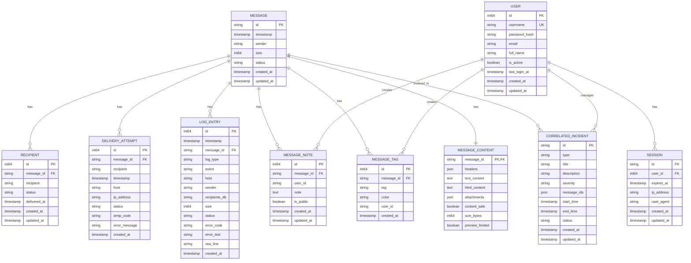
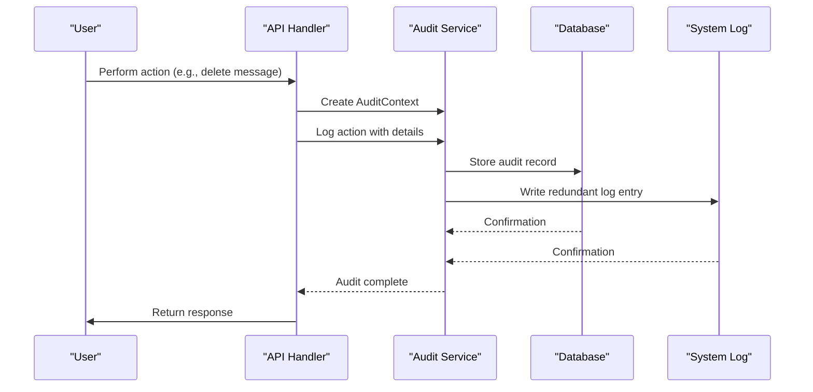
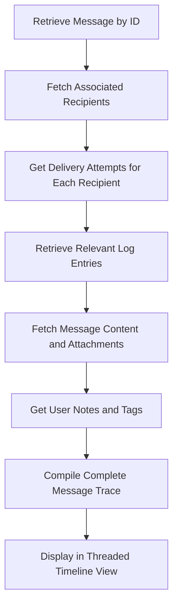

# Database Schema


## Table of Contents
1. [Introduction](#introduction)
2. [Core Data Models](#core-data-models)
3. [Entity Relationships](#entity-relationships)
4. [Normalization and Schema Design](#normalization-and-schema-design)
5. [Indexes and Performance Optimization](#indexes-and-performance-optimization)
6. [Audit Logging System](#audit-logging-system)
7. [Schema Evolution and Backward Compatibility](#schema-evolution-and-backward-compatibility)
8. [Sample Data and Message Tracing](#sample-data-and-message-tracing)

## Introduction
This document provides comprehensive documentation for the database schema used in exim-pilot, an email message monitoring and delivery tracking system. The schema is designed to capture the complete lifecycle of email messages from submission through delivery attempts, with detailed logging, recipient tracking, and audit capabilities. The data model supports message tracing, delivery analytics, and system auditing, enabling administrators to monitor, troubleshoot, and report on email delivery performance.

**Section sources**
- [models.go](file://internal/database/models.go#L8-L336)

## Core Data Models

### Message Entity
The Message entity represents an individual email message processed by the system.

**Fields:**
- `id`: string (Primary Key) - Unique identifier for the message
- `timestamp`: time.Time - When the message was first processed
- `sender`: string - Email address of the sender
- `size`: *int64 - Size of the message in bytes (nullable)
- `status`: string - Current status of the message (e.g., "pending", "delivered", "failed")
- `created_at`: time.Time - Record creation timestamp
- `updated_at`: time.Time - Record last modification timestamp


```go
type Message struct {
	ID        string    `json:"id" db:"id"`
	Timestamp time.Time `json:"timestamp" db:"timestamp"`
	Sender    string    `json:"sender" db:"sender"`
	Size      *int64    `json:"size" db:"size"`
	Status    string    `json:"status" db:"status"`
	CreatedAt time.Time `json:"created_at" db:"created_at"`
	UpdatedAt time.Time `json:"updated_at" db:"updated_at"`
}
```


### Recipient Entity
The Recipient entity tracks individual recipients of a message.

**Fields:**
- `id`: int64 (Primary Key) - Auto-incrementing identifier
- `message_id`: string (Foreign Key) - References Message.id
- `recipient`: string - Email address of the recipient
- `status`: string - Delivery status for this recipient
- `delivered_at`: *time.Time - Timestamp when delivered (nullable)
- `created_at`: time.Time - Record creation timestamp
- `updated_at`: time.Time - Record last modification timestamp

**Valid Status Values:** "delivered", "deferred", "bounced", "pending"


```go
type Recipient struct {
	ID          int64      `json:"id" db:"id"`
	MessageID   string     `json:"message_id" db:"message_id"`
	Recipient   string     `json:"recipient" db:"recipient"`
	Status      string     `json:"status" db:"status"`
	DeliveredAt *time.Time `json:"delivered_at" db:"delivered_at"`
	CreatedAt   time.Time  `json:"created_at" db:"created_at"`
	UpdatedAt   time.Time  `json:"updated_at" db:"updated_at"`
}
```


### DeliveryAttempt Entity
The DeliveryAttempt entity records each attempt to deliver a message to a recipient.

**Fields:**
- `id`: int64 (Primary Key) - Auto-incrementing identifier
- `message_id`: string (Foreign Key) - References Message.id
- `recipient`: string - Email address of the recipient
- `timestamp`: time.Time - When the delivery attempt was made
- `host`: *string - Target mail server hostname (nullable)
- `ip_address`: *string - Target server IP address (nullable)
- `status`: string - Result of the attempt
- `smtp_code`: *string - SMTP response code (nullable)
- `error_message`: *string - Error description if attempt failed (nullable)
- `created_at`: time.Time - Record creation timestamp

**Valid Status Values:** "success", "defer", "bounce", "timeout"


```go
type DeliveryAttempt struct {
	ID           int64     `json:"id" db:"id"`
	MessageID    string    `json:"message_id" db:"message_id"`
	Recipient    string    `json:"recipient" db:"recipient"`
	Timestamp    time.Time `json:"timestamp" db:"timestamp"`
	Host         *string   `json:"host" db:"host"`
	IPAddress    *string   `json:"ip_address" db:"ip_address"`
	Status       string    `json:"status" db:"status"`
	SMTPCode     *string   `json:"smtp_code" db:"smtp_code"`
	ErrorMessage *string   `json:"error_message" db:"error_message"`
	CreatedAt    time.Time `json:"created_at" db:"created_at"`
}
```


### LogEntry Entity
The LogEntry entity stores raw log data from the mail server.

**Fields:**
- `id`: int64 (Primary Key) - Auto-incrementing identifier
- `timestamp`: time.Time - When the log event occurred
- `message_id`: *string - Associated message ID (nullable)
- `log_type`: string - Type of log ("main", "reject", "panic")
- `event`: string - Description of the event
- `host`: *string - Server hostname (nullable)
- `sender`: *string - Message sender (nullable)
- `recipients`: []string - List of recipients (virtual field)
- `recipients_db`: *string - JSON string of recipients for database storage
- `size`: *int64 - Message size (nullable)
- `status`: *string - Delivery status (nullable)
- `error_code`: *string - Error code if applicable (nullable)
- `error_text`: *string - Error description (nullable)
- `raw_line`: string - Complete raw log line
- `created_at`: time.Time - Record creation timestamp


```go
type LogEntry struct {
	ID           int64     `json:"id" db:"id"`
	Timestamp    time.Time `json:"timestamp" db:"timestamp"`
	MessageID    *string   `json:"message_id" db:"message_id"`
	LogType      string    `json:"log_type" db:"log_type"`
	Event        string    `json:"event" db:"event"`
	Host         *string   `json:"host" db:"host"`
	Sender       *string   `json:"sender" db:"sender"`
	Recipients   []string  `json:"recipients" db:"-"`
	RecipientsDB *string   `json:"-" db:"recipients"` // JSON string for database
	Size         *int64    `json:"size" db:"size"`
	Status       *string   `json:"status" db:"status"`
	ErrorCode    *string   `json:"error_code" db:"error_code"`
	ErrorText    *string   `json:"error_text" db:"error_text"`
	RawLine      string    `json:"raw_line" db:"raw_line"`
	CreatedAt    time.Time `json:"created_at" db:"created_at"`
}
```


### MessageContent Entity
The MessageContent entity stores the content of the email message.

**Fields:**
- `message_id`: string (Primary Key, Foreign Key) - References Message.id
- `headers`: map[string]string - Email headers as key-value pairs
- `text_content`: *string - Plain text body (nullable)
- `html_content`: *string - HTML body (nullable)
- `attachments`: []MessageAttachment - List of attachments
- `content_safe`: bool - Whether content is safe (e.g., not spam)
- `size_bytes`: int64 - Total size in bytes
- `preview_limited`: bool - Whether preview is limited


```go
type MessageContent struct {
	MessageID      string              `json:"message_id"`
	Headers        map[string]string   `json:"headers"`
	TextContent    *string             `json:"text_content,omitempty"`
	HTMLContent    *string             `json:"html_content,omitempty"`
	Attachments    []MessageAttachment `json:"attachments"`
	ContentSafe    bool                `json:"content_safe"`
	SizeBytes      int64               `json:"size_bytes"`
	PreviewLimited bool                `json:"preview_limited"`
}
```


### MessageAttachment Entity
The MessageAttachment entity describes individual attachments.

**Fields:**
- `filename`: string - Name of the attached file
- `content_type`: string - MIME type of the attachment
- `size`: int64 - Size in bytes
- `is_safe`: bool - Whether attachment is safe
- `preview`: *string - Safe preview text (nullable)


```go
type MessageAttachment struct {
	Filename    string  `json:"filename"`
	ContentType string  `json:"content_type"`
	Size        int64   `json:"size"`
	IsSafe      bool    `json:"is_safe"`
	Preview     *string `json:"preview,omitempty"`
}
```


### MessageNote and MessageTag Entities
These entities support user annotations on messages.

**MessageNote Fields:**
- `id`: int64 (Primary Key) - Auto-incrementing identifier
- `message_id`: string (Foreign Key) - References Message.id
- `user_id`: string - ID of the user who created the note
- `note`: string - Content of the note
- `is_public`: bool - Whether note is visible to all users
- `created_at`: time.Time - Creation timestamp
- `updated_at`: time.Time - Last modification timestamp

**MessageTag Fields:**
- `id`: int64 (Primary Key) - Auto-incrementing identifier
- `message_id`: string (Foreign Key) - References Message.id
- `tag`: string - Tag name
- `color`: *string - Hex color code for visualization (nullable)
- `user_id`: string - ID of the user who created the tag
- `created_at`: time.Time - Creation timestamp


```go
type MessageNote struct {
	ID        int64     `json:"id" db:"id"`
	MessageID string    `json:"message_id" db:"message_id"`
	UserID    string    `json:"user_id" db:"user_id"`
	Note      string    `json:"note" db:"note"`
	IsPublic  bool      `json:"is_public" db:"is_public"`
	CreatedAt time.Time `json:"created_at" db:"created_at"`
	UpdatedAt time.Time `json:"updated_at" db:"updated_at"`
}

type MessageTag struct {
	ID        int64     `json:"id" db:"id"`
	MessageID string    `json:"message_id" db:"message_id"`
	Tag       string    `json:"tag" db:"tag"`
	Color     *string   `json:"color" db:"color"`
	UserID    string    `json:"user_id" db:"user_id"`
	CreatedAt time.Time `json:"created_at" db:"created_at"`
}
```


### User and Session Entities
These entities manage system users and authentication.

**User Fields:**
- `id`: int64 (Primary Key) - Auto-incrementing identifier
- `username`: string - Unique username
- `password_hash`: string - Hashed password (never exposed in JSON)
- `email`: *string - Email address (nullable)
- `full_name`: *string - Full name (nullable)
- `is_active`: bool - Whether account is active
- `last_login_at`: *time.Time - Timestamp of last login (nullable)
- `created_at`: time.Time - Account creation timestamp
- `updated_at`: time.Time - Last modification timestamp

**Session Fields:**
- `id`: string (Primary Key) - Session identifier
- `user_id`: int64 (Foreign Key) - References User.id
- `expires_at`: time.Time - When session expires
- `ip_address`: *string - Client IP address (nullable)
- `user_agent`: *string - Client user agent string (nullable)
- `created_at`: time.Time - Session creation timestamp
- `updated_at`: time.Time - Last modification timestamp


```go
type User struct {
	ID           int64      `json:"id" db:"id"`
	Username     string     `json:"username" db:"username"`
	PasswordHash string     `json:"-" db:"password_hash"`
	Email        *string    `json:"email" db:"email"`
	FullName     *string    `json:"full_name" db:"full_name"`
	IsActive     bool       `json:"is_active" db:"active"`
	LastLoginAt  *time.Time `json:"last_login_at" db:"last_login"`
	CreatedAt    time.Time  `json:"created_at" db:"created_at"`
	UpdatedAt    time.Time  `json:"updated_at" db:"updated_at"`
}

type Session struct {
	ID        string    `json:"id" db:"id"`
	UserID    int64     `json:"user_id" db:"user_id"`
	ExpiresAt time.Time `json:"expires_at" db:"expires_at"`
	IPAddress *string   `json:"ip_address" db:"ip_address"`
	UserAgent *string   `json:"user_agent" db:"user_agent"`
	CreatedAt time.Time `json:"created_at" db:"created_at"`
	UpdatedAt time.Time `json:"updated_at" db:"updated_at"`
}
```


**Section sources**
- [models.go](file://internal/database/models.go#L8-L326)

## Entity Relationships





**Diagram sources**
- [models.go](file://internal/database/models.go#L8-L336)

## Normalization and Schema Design

The schema follows third normal form (3NF) principles with appropriate normalization to eliminate redundancy while maintaining query performance.

### Normalization Decisions:
- **Message and Recipient Separation**: Messages and recipients are in separate tables to handle one-to-many relationships efficiently. A single message can have multiple recipients without duplicating message data.
- **Delivery Attempts as Separate Entity**: Each delivery attempt is stored separately to allow detailed analysis of delivery patterns and failures over time.
- **Log Entries as Atomic Records**: Raw log entries are stored as individual records to preserve the complete audit trail from the mail server.
- **Message Content Separation**: Message content (headers, body, attachments) is stored in a separate table to avoid bloating the main message table and to support optional content retrieval.
- **User Annotations**: Notes and tags are stored separately to allow flexible user collaboration without modifying core message data.

### Denormalization Considerations:
- The `Recipients` field in `LogEntry` is a virtual field derived from `RecipientsDB`, which stores recipient lists as JSON strings. This denormalization allows efficient storage of variable-length recipient lists while maintaining relational integrity through application logic.
- The `MessageID` field is included in multiple related tables (Recipient, DeliveryAttempt, LogEntry) to enable efficient querying without requiring joins for common operations.

**Section sources**
- [models.go](file://internal/database/models.go#L8-L336)

## Indexes and Performance Optimization

The schema includes strategic indexes to optimize common query patterns:

### Primary Indexes:
- `Message.id`: Primary key index for message lookups
- `Recipient.id`: Primary key index
- `DeliveryAttempt.id`: Primary key index
- `LogEntry.id`: Primary key index
- `MessageNote.id`: Primary key index
- `MessageTag.id`: Primary key index
- `User.id`: Primary key index
- `Session.id`: Primary key index

### Foreign Key Indexes:
- `Recipient.message_id`: Index to support message-to-recipients queries
- `DeliveryAttempt.message_id`: Index for message delivery history
- `LogEntry.message_id`: Index for message-related log retrieval
- `MessageNote.message_id`: Index for message annotations
- `MessageTag.message_id`: Index for message tagging
- `MessageContent.message_id`: Index for message content retrieval
- `Session.user_id`: Index for user session management

### Query Optimization Indexes:
- `Message.timestamp`: Index for time-based message retrieval
- `Message.sender`: Index for sender-based searches
- `Message.status`: Index for status filtering
- `Recipient.recipient`: Index for recipient email searches
- `Recipient.status`: Index for delivery status filtering
- `DeliveryAttempt.timestamp`: Index for delivery timeline analysis
- `DeliveryAttempt.status`: Index for delivery outcome analysis
- `LogEntry.timestamp`: Index for log timeline queries
- `LogEntry.log_type`: Index for log type filtering
- `User.username`: Unique index for user authentication

These indexes support the application's core functionality, including message tracing, delivery analytics, log searching, and user management, while balancing read performance with write overhead.

**Section sources**
- [models.go](file://internal/database/models.go#L8-L336)

## Audit Logging System

The audit logging system tracks security-relevant events and user actions within the application.

### Audit Context and Details
While the physical `AuditLog` table structure is not fully visible in the provided code, the audit service implementation reveals the logical structure through its interfaces:

**AuditContext Fields:**
- `UserID`: string - Identifier of the user performing the action
- `IPAddress`: string - Client IP address
- `UserAgent`: string - Client user agent string
- `RequestID`: string - Unique identifier for the request

**AuditDetails Fields:**
- `MessageIDs`: []string - Affected message IDs
- `Operation`: string - Type of operation performed
- `Parameters`: map[string]interface{} - Operation parameters
- `Result`: string - Outcome of the operation
- `Duration`: time.Duration - Time taken to complete
- `ResourcePath`: string - API endpoint accessed

### Audit Filters
The system supports filtered retrieval of audit logs:

**AuditFilters Fields:**
- `StartTime`: *time.Time - Start of time range
- `EndTime`: *time.Time - End of time range
- `UserID`: *string - Filter by user
- `Action`: *string - Filter by action type
- `MessageID`: *string - Filter by message
- `IPAddress`: *string - Filter by client IP
- `Limit`: int - Maximum number of results
- `Offset`: int - Pagination offset

The audit service writes events to both the database and system logs for redundancy, ensuring audit trail integrity even in the event of database issues.





**Diagram sources**
- [service.go](file://internal/audit/service.go#L244-L285)

**Section sources**
- [service.go](file://internal/audit/service.go#L244-L285)

## Schema Evolution and Backward Compatibility

The schema design incorporates several strategies for backward compatibility and future evolution:

### Versioning and Extensibility:
- **Nullable Fields**: Many fields are implemented as pointers (e.g., `*int64`, `*string`) to support nullable values, allowing new optional fields to be added without breaking existing data.
- **JSON Fields**: The use of JSON fields (e.g., `RecipientsDB`, `Headers`, `Parameters`) allows flexible data storage that can evolve without schema changes.
- **Enum Pattern**: Status fields use string values rather than database enums, enabling new status values to be added through application code without database migrations.
- **Timestamp Tracking**: All entities include `created_at` and `updated_at` fields to support temporal queries and data lifecycle management.

### Migration Strategies:
- **Additive Changes**: New tables and columns can be added without affecting existing functionality.
- **View Layer**: The application uses Go structs that can map to database tables, allowing the logical model to evolve independently of the physical schema.
- **Data Migration Tools**: The presence of a `migrations.go` file in the database package suggests a structured migration system is in place for schema changes.

### Future Extension Points:
- **MessageContent**: The JSON-based `attachments` field can accommodate new attachment metadata without schema changes.
- **Audit System**: The flexible `Parameters` field in audit details can capture new operational data.
- **User System**: The `User` entity can be extended with additional profile information as needed.
- **CorrelatedIncident**: The `message_ids` field as a string array supports grouping multiple messages into incidents.

These design choices ensure the schema can adapt to new requirements while maintaining compatibility with existing data and applications.

**Section sources**
- [models.go](file://internal/database/models.go#L8-L336)
- [migrations.go](file://internal/database/migrations.go)

## Sample Data and Message Tracing

### Sample Message Record

```json
{
  "id": "1ABC23-DEF456-GH",
  "timestamp": "2023-08-15T14:30:00Z",
  "sender": "sender@example.com",
  "size": 15240,
  "status": "delivered",
  "created_at": "2023-08-15T14:30:00Z",
  "updated_at": "2023-08-15T14:35:22Z"
}
```


### Sample Recipient Records

```json
[
  {
    "id": 1001,
    "message_id": "1ABC23-DEF456-GH",
    "recipient": "alice@example.com",
    "status": "delivered",
    "delivered_at": "2023-08-15T14:32:15Z",
    "created_at": "2023-08-15T14:30:00Z",
    "updated_at": "2023-08-15T14:32:15Z"
  },
  {
    "id": 1002,
    "message_id": "1ABC23-DEF456-GH",
    "recipient": "bob@example.com",
    "status": "deferred",
    "delivered_at": null,
    "created_at": "2023-08-15T14:30:00Z",
    "updated_at": "2023-08-15T14:34:10Z"
  }
]
```


### Sample Delivery Attempt Records

```json
[
  {
    "id": 5001,
    "message_id": "1ABC23-DEF456-GH",
    "recipient": "alice@example.com",
    "timestamp": "2023-08-15T14:31:05Z",
    "host": "mx.example.com",
    "ip_address": "192.0.2.1",
    "status": "success",
    "smtp_code": "250",
    "error_message": null,
    "created_at": "2023-08-15T14:31:05Z"
  },
  {
    "id": 5002,
    "message_id": "1ABC23-DEF456-GH",
    "recipient": "bob@example.com",
    "timestamp": "2023-08-15T14:33:20Z",
    "host": "mail.example.org",
    "ip_address": "198.51.100.1",
    "status": "defer",
    "smtp_code": "451",
    "error_message": "Temporary local problem",
    "created_at": "2023-08-15T14:33:20Z"
  }
]
```


### Message Tracing Workflow




This comprehensive data model enables detailed message tracing, allowing administrators to follow the complete delivery journey of any message, analyze delivery patterns, troubleshoot failures, and generate detailed reports on email delivery performance.

**Section sources**
- [models.go](file://internal/database/models.go#L8-L336)

**Referenced Files in This Document**   
- [models.go](file://internal/database/models.go)
- [service.go](file://internal/audit/service.go)