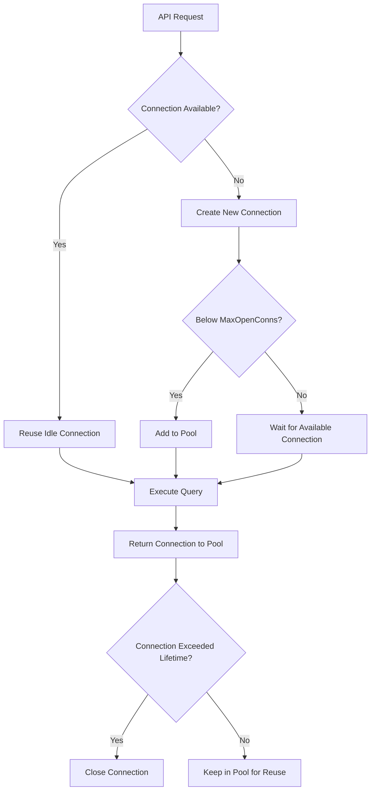
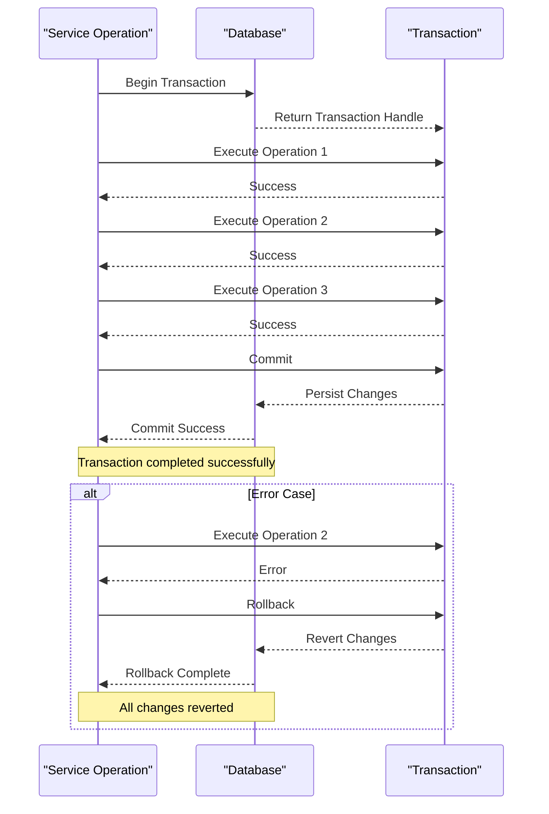
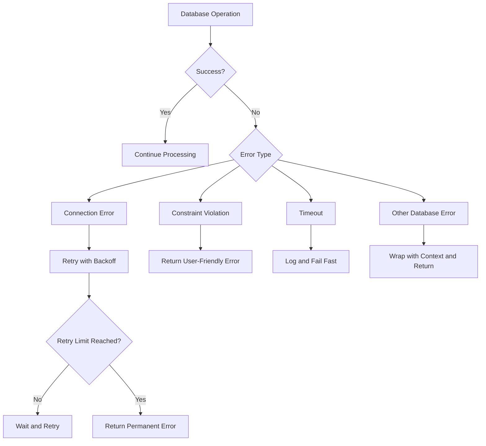

# Connection Management


## Table of Contents
1. [Introduction](#introduction)
2. [Database Connection Initialization](#database-connection-initialization)
3. [Connection Pooling and Reuse](#connection-pooling-and-reuse)
4. [Transaction Lifecycle Management](#transaction-lifecycle-management)
5. [Error Handling and Connection Failures](#error-handling-and-connection-failures)
6. [Concurrency and Timeout Configuration](#concurrency-and-timeout-configuration)
7. [Usage Examples in Queue and Log Operations](#usage-examples-in-queue-and-log-operations)
8. [Conclusion](#conclusion)

## Introduction
The exim-pilot system implements a robust database connection and transaction management layer using SQLite as the primary data store. This document details how database connections are initialized, pooled, and reused across API requests, with a focus on transaction handling patterns, error resilience, and concurrency safety. The architecture ensures data integrity during message queue operations, log processing, and audit logging through well-defined transaction boundaries and recovery mechanisms.

## Database Connection Initialization
Database connections in exim-pilot are initialized through a centralized connection management system that handles the creation and configuration of SQLite database instances. The initialization process begins with loading configuration parameters from the application's configuration system and proceeds to establish a connection with appropriate settings for performance and reliability.

The `Connect` function in `connection.go` serves as the primary entry point for database initialization. It accepts a `Config` struct containing database path, connection limits, and timeout values. When no configuration is provided, the system defaults to predefined values that balance resource usage and performance.


```go
// Config represents database configuration
type Config struct {
    Path            string
    MaxOpenConns    int
    MaxIdleConns    int
    ConnMaxLifetime time.Duration
}

// DefaultConfig returns default database configuration
func DefaultConfig() *Config {
    return &Config{
        Path:            "exim-pilot.db",
        MaxOpenConns:    10,
        MaxIdleConns:    5,
        ConnMaxLifetime: 30 * time.Minute,
    }
}
```


During initialization, the system creates a `*sql.DB` instance and applies the configuration settings using the standard Go database/sql package methods. The connection string includes parameters that optimize SQLite for concurrent access and durability, such as enabling foreign key constraints and setting an appropriate busy timeout.

**Section sources**
- [connection.go](file://internal/database/connection.go#L1-L50)
- [config.go](file://internal/config/config.go#L10-L25)

## Connection Pooling and Reuse
exim-pilot implements connection pooling to efficiently manage database resources and handle concurrent API requests. The connection pool is managed by the underlying `database/sql` package, with configuration parameters tuned for the application's workload characteristics.

The system configures the connection pool with three key parameters:
- **MaxOpenConns**: Maximum number of open connections to the database (default: 10)
- **MaxIdleConns**: Maximum number of idle connections in the pool (default: 5)
- **ConnMaxLifetime**: Maximum amount of time a connection may be reused (default: 30 minutes)





**Diagram sources**
- [connection.go](file://internal/database/connection.go#L50-L100)

The connection pool is implemented as a singleton pattern through the `DB` struct, which wraps the underlying `*sql.DB` instance and provides additional functionality such as path tracking and health checking. This singleton instance is shared across all repository components, ensuring that connections are properly reused rather than creating new ones for each operation.

Repository components receive the database connection through dependency injection, typically during their creation via constructor functions like `NewMessageRepository(db *DB)`. This pattern ensures that all data access components use the same connection pool, preventing resource duplication and ensuring consistent transaction behavior.

**Section sources**
- [connection.go](file://internal/database/connection.go#L100-L150)
- [repository.go](file://internal/database/repository.go#L1-L20)

## Transaction Lifecycle Management
Transaction handling in exim-pilot follows a structured lifecycle pattern that ensures data consistency across related operations. The system implements transactions at both the repository and service levels, with clear begin, commit, and rollback semantics.

The transaction lifecycle begins with the creation of a transaction context using the `Begin()` method on the database connection. This returns a `*sql.Tx` object that provides transactional versions of database operations. The system encapsulates transaction management in the `transaction.go` file, which provides helper functions for common transaction patterns.


```go
// InTransaction executes a function within a database transaction
func (db *DB) InTransaction(ctx context.Context, fn func(*sql.Tx) error) error {
    tx, err := db.BeginTx(ctx, nil)
    if err != nil {
        return fmt.Errorf("failed to begin transaction: %w", err)
    }

    defer func() {
        if p := recover(); p != nil {
            tx.Rollback()
            panic(p)
        }
    }()

    if err := fn(tx); err != nil {
        if rollbackErr := tx.Rollback(); rollbackErr != nil {
            return fmt.Errorf("failed to rollback: %v, original error: %w", rollbackErr, err)
        }
        return err
    }

    if err := tx.Commit(); err != nil {
        return fmt.Errorf("failed to commit: %w", err)
    }

    return nil
}
```


Service operations that require atomicity across multiple database operations use the `InTransaction` helper to ensure that either all operations succeed or all are rolled back. For example, when processing a message delivery attempt, the system must update the message status, create a delivery attempt record, and potentially update recipient status—all within a single transaction.

The transaction lifecycle follows these steps:
1. **Begin**: Start a new transaction with appropriate isolation level
2. **Execute**: Perform all database operations using the transaction context
3. **Commit**: Persist all changes if all operations succeed
4. **Rollback**: Revert all changes if any operation fails





**Diagram sources**
- [transaction.go](file://internal/database/transaction.go#L1-L40)
- [repository.go](file://internal/database/repository.go#L50-L80)

Nested transactions are not supported in SQLite, so the system ensures that transaction boundaries are clearly defined at the service level. Repository methods are designed to work both within and outside of transactions by accepting a generic `*sql.DB` or `*sql.Tx` interface (both implement the same query methods).

**Section sources**
- [transaction.go](file://internal/database/transaction.go#L1-L100)
- [repository.go](file://internal/database/repository.go#L50-L100)

## Error Handling and Connection Failures
The exim-pilot system implements comprehensive error handling for database connection failures and transaction errors. The error handling strategy focuses on graceful degradation, meaningful error reporting, and automatic recovery where possible.

Connection failures are handled at multiple levels:
- **Initialization failures**: When the database cannot be opened, the system returns a descriptive error that includes the underlying SQLite error message
- **Connection pool exhaustion**: When all connections are in use and the maximum is reached, the system waits for a connection to become available, with a configurable timeout
- **Query execution failures**: Individual query failures are wrapped with context about the operation that failed


```go
// Connect attempts to establish a database connection with the given configuration
func Connect(config *Config) (*DB, error) {
    if config == nil {
        config = DefaultConfig()
    }

    // Open database connection
    sqlDB, err := sql.Open("sqlite3", config.Path+"?_foreign_keys=on&_busy_timeout=5000")
    if err != nil {
        return nil, fmt.Errorf("failed to open database: %w", err)
    }

    // Apply connection pool settings
    sqlDB.SetMaxOpenConns(config.MaxOpenConns)
    sqlDB.SetMaxIdleConns(config.MaxIdleConns)
    sqlDB.SetConnMaxLifetime(config.ConnMaxLifetime)

    // Test the connection
    if err := sqlDB.Ping(); err != nil {
        sqlDB.Close()
        return nil, fmt.Errorf("failed to ping database: %w", err)
    }

    db := &DB{
        DB:   sqlDB,
        path: config.Path,
    }

    return db, nil
}
```


Transaction errors are handled with a defer-recover pattern that ensures rollback occurs even in the event of a panic. The system distinguishes between different types of errors:
- **Constraint violations**: Such as unique constraint violations when creating duplicate records
- **Foreign key violations**: When referencing non-existent parent records
- **Timeout errors**: When a query exceeds the configured timeout
- **Connection errors**: When the database connection is lost

The error handling system wraps lower-level database errors with higher-level context, making it easier to diagnose issues. For example, a foreign key violation during message creation would be wrapped with information about the specific message ID and operation.





**Diagram sources**
- [connection.go](file://internal/database/connection.go#L50-L100)
- [transaction.go](file://internal/database/transaction.go#L40-L80)

The system also implements connection health checking through periodic ping operations in long-running services. If a connection is found to be unhealthy, it is closed and re-established according to the retry policy.

**Section sources**
- [connection.go](file://internal/database/connection.go#L50-L150)
- [transaction.go](file://internal/database/transaction.go#L40-L100)

## Concurrency and Timeout Configuration
exim-pilot is designed to handle concurrent access to the database with appropriate configuration for connection limits and timeouts. The system balances performance requirements with resource constraints through careful tuning of database parameters.

SQLite's default behavior is to serialize write operations, meaning only one write can occur at a time. The connection pool configuration allows multiple read operations to proceed concurrently while managing write contention through the connection pool.

Key concurrency settings include:
- **MaxOpenConns**: Limits the total number of connections to prevent resource exhaustion
- **BusyTimeout**: Configured at 5 seconds (5000ms) in the connection string to control how long queries wait for a locked database
- **ConnMaxLifetime**: Prevents connection staleness by recycling connections after 30 minutes

For operations that require higher concurrency, the system implements application-level queuing and batching. For example, log entries are processed in batches rather than individual transactions, reducing the number of write operations and contention.

Read-heavy operations such as message trace retrieval use read-only transactions where appropriate, allowing SQLite to optimize for concurrent reads. The system also implements caching at the service layer to reduce database load for frequently accessed data.


```go
// Example of a read-only operation
func (r *MessageRepository) GetMessageStats() (*MessageStats, error) {
    // This query can run concurrently with other reads
    query := `SELECT status, COUNT(*) FROM messages GROUP BY status`
    // ... execution code
}
```


Write operations that affect multiple tables use transactions to ensure atomicity and consistency. The system avoids long-running transactions that could block other operations by keeping transaction scopes as narrow as possible.

**Section sources**
- [connection.go](file://internal/database/connection.go#L20-L50)
- [repository.go](file://internal/database/repository.go#L100-L150)

## Usage Examples in Queue and Log Operations
The database connection and transaction system is extensively used in queue management and log processing operations. These examples demonstrate proper usage patterns for transactions in critical system components.

### Queue Operations with Transactions
When processing message queue operations such as delivery attempts, the system uses transactions to ensure data consistency across multiple related records:


```go
// ProcessDeliveryAttempt handles a delivery attempt within a transaction
func (s *QueueService) ProcessDeliveryAttempt(attempt *DeliveryAttempt) error {
    return s.db.InTransaction(context.Background(), func(tx *sql.Tx) error {
        // Update message status if this is a successful delivery
        if attempt.Status == AttemptStatusSuccess {
            msg, err := s.messageRepo.GetByID(attempt.MessageID)
            if err != nil {
                return fmt.Errorf("failed to get message: %w", err)
            }
            
            msg.Status = StatusDelivered
            if err := s.messageRepo.Update(msg); err != nil {
                return fmt.Errorf("failed to update message status: %w", err)
            }
        }
        
        // Create delivery attempt record
        if err := s.deliveryAttemptRepo.Create(attempt); err != nil {
            return fmt.Errorf("failed to create delivery attempt: %w", err)
        }
        
        // Update recipient status
        recipients, err := s.recipientRepo.GetByMessageID(attempt.MessageID)
        if err != nil {
            return fmt.Errorf("failed to get recipients: %w", err)
        }
        
        for i := range recipients {
            if recipients[i].Recipient == attempt.Recipient {
                recipients[i].Status = getRecipientStatus(attempt.Status)
                if attempt.Status == AttemptStatusSuccess {
                    now := time.Now()
                    recipients[i].DeliveredAt = &now
                }
                if err := s.recipientRepo.Update(&recipients[i]); err != nil {
                    return fmt.Errorf("failed to update recipient: %w", err)
                }
                break
            }
        }
        
        return nil
    })
}
```


This transaction ensures that either all related updates (message status, delivery attempt, recipient status) are committed together, or none are applied if any step fails.

### Log Processing with Connection Reuse
Log processing operations demonstrate connection pooling and reuse patterns. The log processor service maintains a reference to the database connection and uses it across multiple log entry processing operations:


```go
// ProcessLogEntry processes a single log entry
func (s *LogProcessorService) ProcessLogEntry(entry *LogEntry) error {
    // The repository uses the shared connection pool
    return s.repository.CreateLogEntry(context.Background(), entry)
}
```


For batch operations, the system may use a single transaction to improve performance:


```go
// ProcessLogBatch processes multiple log entries in a single transaction
func (s *LogProcessorService) ProcessLogBatch(entries []*LogEntry) error {
    return s.db.InTransaction(context.Background(), func(tx *sql.Tx) error {
        for _, entry := range entries {
            if err := s.repository.CreateLogEntry(context.Background(), entry); err != nil {
                return fmt.Errorf("failed to process log entry %s: %w", entry.ID, err)
            }
        }
        return nil
    })
}
```


The audit logging system also uses transactions to ensure that audit records are created atomically with the operations they describe:


```go
// LogAction creates an audit log entry for a user action
func (s *AuditService) LogAction(userID, action, messageID string, details map[string]interface{}) error {
    // Convert details to JSON
    detailsJSON, err := json.Marshal(details)
    if err != nil {
        return fmt.Errorf("failed to marshal audit details: %w", err)
    }
    
    entry := &database.AuditLog{
        Timestamp:   time.Now(),
        Action:      action,
        MessageID:   &messageID,
        UserID:      &userID,
        Details:     (*string)(&detailsJSON),
        IPAddress:   s.ipAddress,
        CreatedAt:   time.Now(),
    }
    
    return s.repository.CreateAuditLog(entry)
}
```


These examples demonstrate the consistent application of connection pooling, transaction management, and error handling patterns throughout the system.

**Section sources**
- [repository.go](file://internal/database/repository.go#L200-L400)
- [queue_handlers.go](file://internal/api/queue_handlers.go#L50-L100)
- [log_handlers.go](file://internal/api/log_handlers.go#L50-L100)

## Conclusion
The exim-pilot system implements a comprehensive database connection and transaction management system that ensures data integrity, handles errors gracefully, and performs efficiently under concurrent load. By leveraging Go's database/sql package with careful configuration of connection pooling parameters, the system efficiently manages database resources across API requests.

Transaction handling follows a consistent pattern using the `InTransaction` helper function, which ensures proper begin-commit-rollback semantics with automatic rollback on error or panic. This pattern is applied consistently across service operations, particularly in queue management and log processing where data consistency is critical.

The error handling system provides meaningful error messages with appropriate context, making it easier to diagnose and resolve database issues. Connection failures are handled with retry logic where appropriate, and the system includes health checking to maintain connection reliability.

Overall, the database connection and transaction system in exim-pilot demonstrates sound architectural principles with clear separation of concerns, proper resource management, and robust error handling—providing a reliable foundation for the application's data operations.

**Referenced Files in This Document**   
- [connection.go](file://internal/database/connection.go)
- [transaction.go](file://internal/database/transaction.go)
- [repository.go](file://internal/database/repository.go)
- [models.go](file://internal/database/models.go)
- [config.go](file://internal/config/config.go)