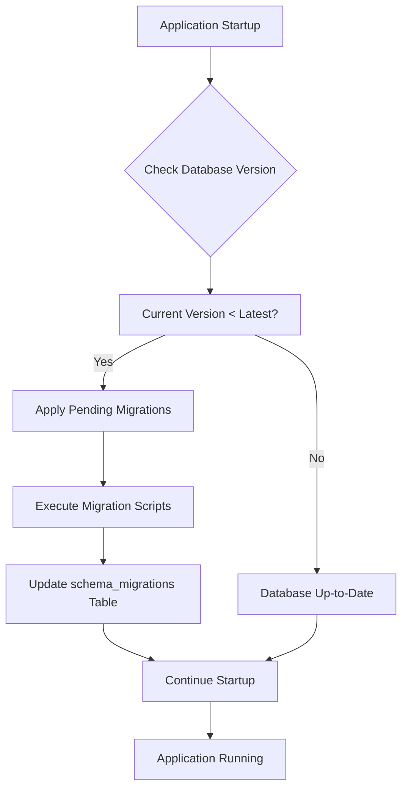
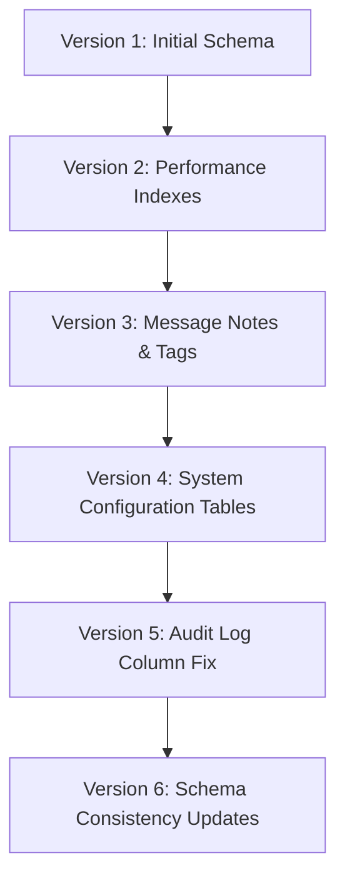
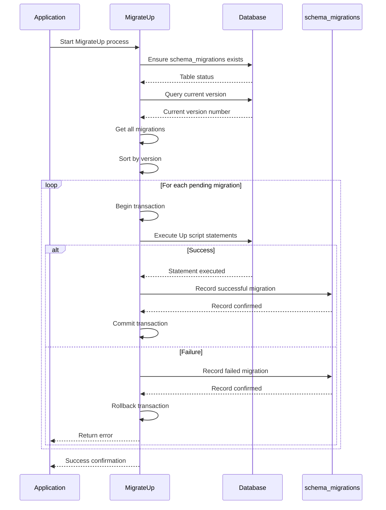
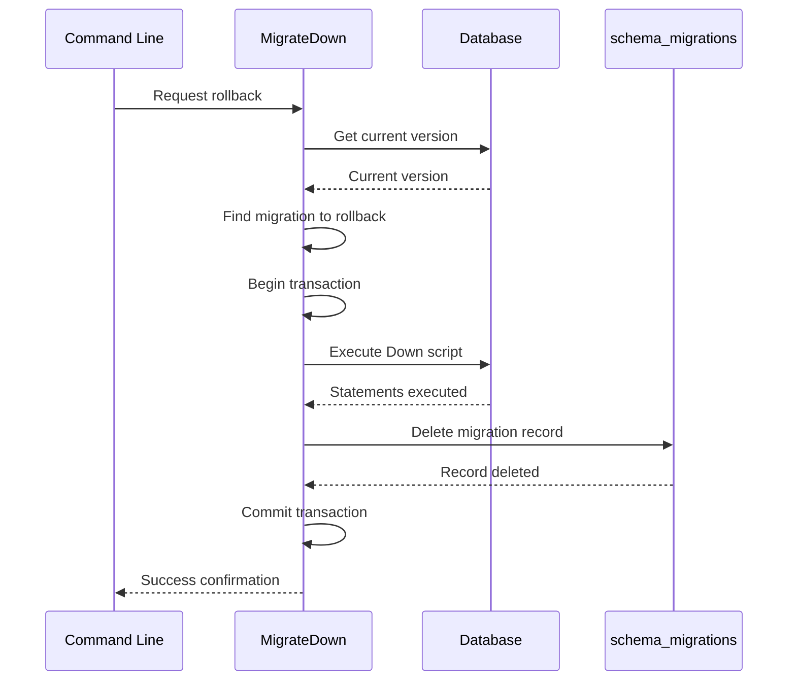
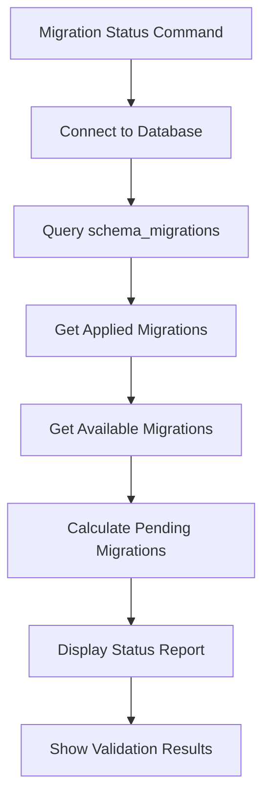
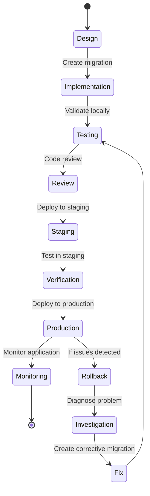

# Schema Migrations


## Table of Contents
1. [Introduction](#introduction)
2. [Migration System Overview](#migration-system-overview)
3. [Migration File Format](#migration-file-format)
4. [Migration Execution Process](#migration-execution-process)
5. [Rollback Procedures](#rollback-procedures)
6. [Migration Tracking and Status](#migration-tracking-and-status)
7. [Idempotency and Error Handling](#idempotency-and-error-handling)
8. [Testing Strategies](#testing-strategies)
9. [Best Practices for New Migrations](#best-practices-for-new-migrations)
10. [Migration Lifecycle Diagram](#migration-lifecycle-diagram)

## Introduction
The exim-pilot application implements a robust database migration system to manage schema changes across different versions. This system ensures that database schema evolution is controlled, trackable, and reversible. The migration framework is designed to automatically apply necessary schema changes during application startup, ensuring that the database structure is always compatible with the application code. This documentation provides a comprehensive overview of the migration system, including its architecture, execution process, rollback capabilities, and best practices for adding new migrations.

## Migration System Overview

The database migration system in exim-pilot is implemented as a versioned, incremental schema change management framework. It uses a dedicated `schema_migrations` table to track which migrations have been applied to the database, allowing the system to determine the current schema version and identify pending migrations. The migration system is integrated into the application's startup process, ensuring that the database is always migrated to the required version before the application begins normal operations.

The core components of the migration system include:
- **Migration definition**: Structured representation of schema changes
- **Migration execution**: Process for applying and rolling back migrations
- **Version tracking**: Mechanism to record applied migrations
- **Status monitoring**: Tools to inspect migration state





**Diagram sources**
- [migrations.go](file://internal/database/migrations.go#L370-L415)
- [main.go](file://cmd/exim-pilot/main.go#L93-L96)

**Section sources**
- [migrations.go](file://internal/database/migrations.go#L11-L23)
- [main.go](file://cmd/exim-pilot/main.go#L93-L96)

## Migration File Format

### Migration Structure
Each migration in the exim-pilot system is defined as a Go struct with specific fields that describe the schema changes. The `Migration` struct contains the following key components:


```go
type Migration struct {
    Version     int
    Description string
    Up          string
    Down        string
}
```


- **Version**: Sequential integer identifier that determines the order of migration application
- **Description**: Human-readable explanation of the migration purpose
- **Up**: SQL script containing commands to apply the schema change
- **Down**: SQL script containing commands to reverse the schema change

### Migration Examples
The system currently includes six migrations that demonstrate various schema evolution patterns:





**Diagram sources**
- [migrations.go](file://internal/database/migrations.go#L26-L367)

**Section sources**
- [migrations.go](file://internal/database/migrations.go#L11-L16)

## Migration Execution Process

### Startup Migration Flow
During application startup, the migration system follows a specific sequence to ensure the database schema is up-to-date:





**Diagram sources**
- [migrations.go](file://internal/database/migrations.go#L370-L415)
- [migrations.go](file://internal/database/migrations.go#L611-L654)

**Section sources**
- [migrations.go](file://internal/database/migrations.go#L370-L415)

### Migration Application Logic
The `applyMigration` function handles the core logic for applying a single migration:


```go
func applyMigration(db *DB, migration Migration) error {
    // Start transaction
    tx, err := db.BeginTx()
    if err != nil {
        return fmt.Errorf("failed to start transaction: %w", err)
    }
    defer tx.Rollback()

    // Execute migration statements
    statements := strings.Split(migration.Up, ";")
    for _, stmt := range statements {
        stmt = strings.TrimSpace(stmt)
        if stmt == "" {
            continue
        }

        if _, err := tx.Exec(stmt); err != nil {
            // Record failed migration
            tx.Exec("INSERT INTO schema_migrations (version, success) VALUES (?, FALSE)", migration.Version)
            return fmt.Errorf("failed to execute migration statement: %w", err)
        }
    }

    // Record successful migration
    _, err = tx.Exec("INSERT INTO schema_migrations (version, success) VALUES (?, TRUE)", migration.Version)
    if err != nil {
        return fmt.Errorf("failed to record migration: %w", err)
    }

    // Commit transaction
    if err := tx.Commit(); err != nil {
        return fmt.Errorf("failed to commit migration: %w", err)
    }

    return nil
}
```


This function ensures atomicity by wrapping the migration in a database transaction. If any statement fails, the entire migration is rolled back, and the failure is recorded in the `schema_migrations` table.

**Section sources**
- [migrations.go](file://internal/database/migrations.go#L611-L654)

## Rollback Procedures

### Down Migration Implementation
The system supports rolling back migrations through the `MigrateDown` function, which reverses the most recently applied migration:





**Diagram sources**
- [migrations.go](file://internal/database/migrations.go#L418-L484)

**Section sources**
- [migrations.go](file://internal/database/migrations.go#L418-L484)

### Rollback Limitations
The rollback system has specific limitations, particularly when dealing with SQLite's constraints:

- **Column removal**: SQLite does not support `DROP COLUMN`, so columns cannot be truly removed during rollback
- **Data loss**: The `Down` scripts may result in data loss when dropping tables
- **Complex changes**: Schema changes that involve data transformation cannot be perfectly reversed

For migrations that cannot be safely rolled back (like Version 5 and 6), the `Down` script contains comments explaining the limitations rather than attempting potentially destructive operations.

## Migration Tracking and Status

### Schema Migrations Table
The system uses a dedicated `schema_migrations` table to track the state of applied migrations:


```sql
CREATE TABLE IF NOT EXISTS schema_migrations (
    version INTEGER PRIMARY KEY,
    applied_at DATETIME DEFAULT CURRENT_TIMESTAMP,
    success BOOLEAN DEFAULT TRUE
)
```


This table records:
- **version**: The migration version number
- **applied_at**: Timestamp when the migration was applied
- **success**: Boolean indicating whether the migration succeeded

### Status Monitoring
The system provides comprehensive tools for monitoring migration status through the `exim-pilot-config` utility:





The status report includes:
- List of successfully applied migrations with timestamps
- List of pending migrations with descriptions
- Total count of available migrations
- Validation results for migration consistency

**Section sources**
- [migrations.go](file://internal/database/migrations.go#L523-L571)
- [main.go](file://cmd/exim-pilot-config/main.go#L301-L343)

## Idempotency and Error Handling

### Idempotent Design
The migration system incorporates several idempotency features to ensure safe repeated execution:

- **CREATE TABLE IF NOT EXISTS**: Prevents errors when tables already exist
- **CREATE INDEX IF NOT EXISTS**: Prevents errors when indexes already exist
- **Version checking**: Skips migrations that have already been applied
- **Transaction safety**: Ensures partial failures do not leave the database in an inconsistent state

### Error Recovery
The system implements robust error handling to maintain database integrity:

- **Transaction rollback**: Failed migrations are automatically rolled back
- **Failure recording**: Failed migration attempts are recorded in the `schema_migrations` table
- **Startup protection**: The application will not start if migrations fail
- **Detailed logging**: Comprehensive logs help diagnose migration issues

When a migration fails, the system:
1. Rolls back the transaction to maintain consistency
2. Records the failure in the `schema_migrations` table
3. Returns an error that prevents application startup
4. Provides detailed error information for troubleshooting

**Section sources**
- [migrations.go](file://internal/database/migrations.go#L611-L654)
- [migrations.go](file://internal/database/migrations.go#L370-L415)

## Testing Strategies

### Unit Testing Approach
The migration system includes comprehensive tests to ensure reliability:


```go
func TestApplyMigration(t *testing.T) {
    // Setup test database
    dbPath := "test_apply_migration.db"
    defer os.Remove(dbPath)
    
    config := &Config{Path: dbPath}
    db, err := Connect(config)
    if err != nil {
        t.Fatalf("Failed to connect to database: %v", err)
    }
    defer db.Close()

    // Initialize migration system
    manager := NewMigrationManager(db)
    if err := manager.InitMigrationTable(); err != nil {
        t.Fatalf("Failed to initialize migration table: %v", err)
    }

    // Define test migration
    migration := Migration{
        Version:     1,
        Description: "Test migration",
        Up:          "CREATE TABLE test_table (id INTEGER PRIMARY KEY);",
        Down:        "DROP TABLE test_table;",
    }

    // Apply migration
    if err := manager.ApplyMigration(migration); err != nil {
        t.Fatalf("Failed to apply migration: %v", err)
    }

    // Verify results
    var count int
    err = db.QueryRow("SELECT COUNT(*) FROM sqlite_master WHERE type='table' AND name='test_table'").Scan(&count)
    if err != nil {
        t.Fatalf("Failed to query for test table: %v", err)
    }
    if count != 1 {
        t.Errorf("Expected 1 test table, got %d", count)
    }
}
```


### Test Coverage
The testing strategy includes:
- **Migration table initialization**: Verifies the tracking table is created correctly
- **Single migration application**: Tests that individual migrations apply correctly
- **Multiple migration sequences**: Ensures migrations can be applied in sequence
- **Database initialization**: Validates that the complete schema can be created
- **Index creation**: Confirms performance indexes are properly created

**Section sources**
- [migrations_test.go](file://internal/database/migrations_test.go#L42-L190)

## Best Practices for New Migrations

### Creating New Migrations
To add a new migration, follow these steps:

1. Use the `CreateMigration` helper function to generate a template:

```go
func CreateMigration(description string) Migration {
    // Get the next version number
    migrations := GetMigrations()
    nextVersion := 1
    for _, migration := range migrations {
        if migration.Version >= nextVersion {
            nextVersion = migration.Version + 1
        }
    }

    return Migration{
        Version:     nextVersion,
        Description: description,
        Up:          "-- Add your up migration here\n",
        Down:        "-- Add your down migration here\n",
    }
}
```


2. Implement the `Up` script with forward schema changes
3. Implement the `Down` script to reverse the changes
4. Add comprehensive comments explaining the changes
5. Test the migration thoroughly in a development environment

### Migration Guidelines
Follow these best practices when creating migrations:

- **Small, focused changes**: Each migration should address a single concern
- **Descriptive names**: Use clear, meaningful descriptions
- **Reversible operations**: Design migrations to be safely reversible when possible
- **Data preservation**: Avoid destructive operations that could result in data loss
- **Performance considerations**: Include appropriate indexes for new tables
- **Validation**: Test migrations on both empty and populated databases

### Versioning Strategy
The system follows a strict sequential versioning approach:
- Versions are sequential integers starting from 1
- No version gaps are allowed
- Each version must be unique
- Migrations are applied in ascending version order

This ensures predictable and reliable schema evolution across all deployment environments.

**Section sources**
- [migrations.go](file://internal/database/migrations.go#L699-L732)

## Migration Lifecycle Diagram





**Diagram sources**
- [migrations.go](file://internal/database/migrations.go)
- [main.go](file://cmd/exim-pilot/main.go)

**Referenced Files in This Document**   
- [migrations.go](file://internal/database/migrations.go)
- [connection.go](file://internal/database/connection.go)
- [main.go](file://cmd/exim-pilot/main.go)
- [main.go](file://cmd/exim-pilot-config/main.go)
- [migrations_test.go](file://internal/database/migrations_test.go)
- [schema.go](file://internal/database/schema.go)