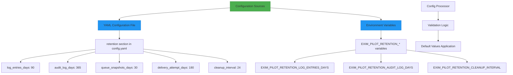
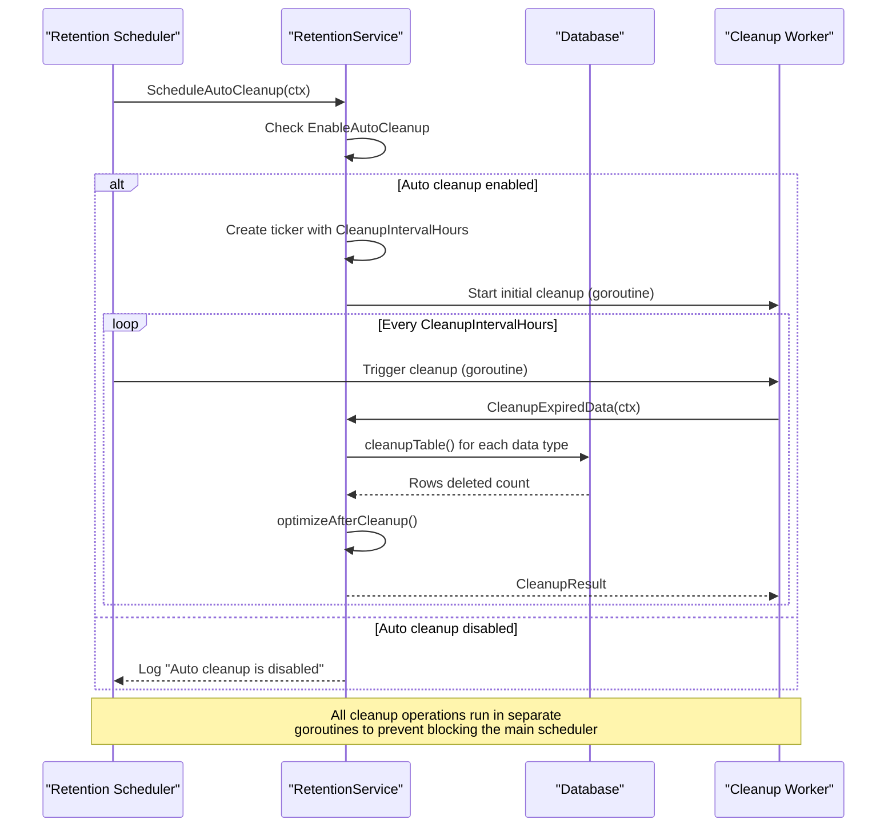
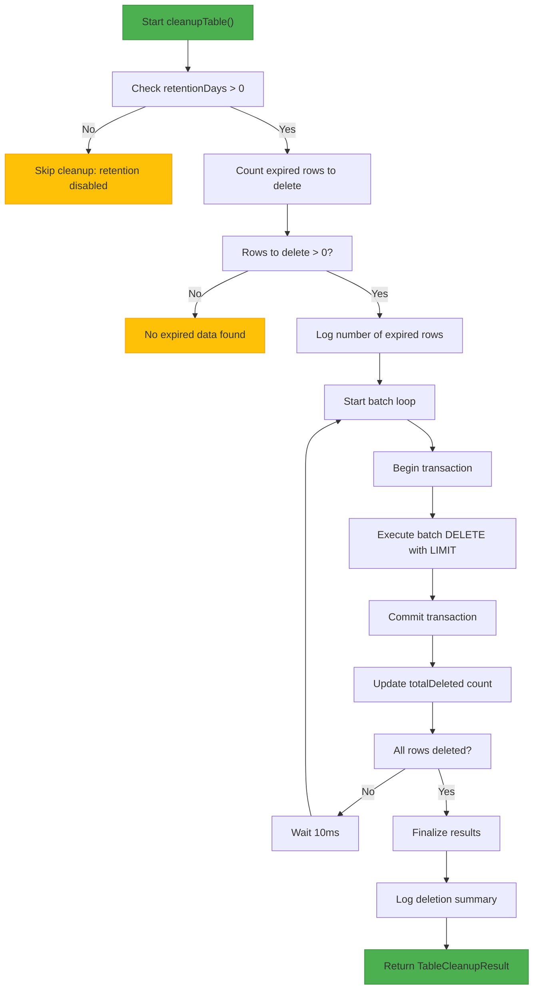
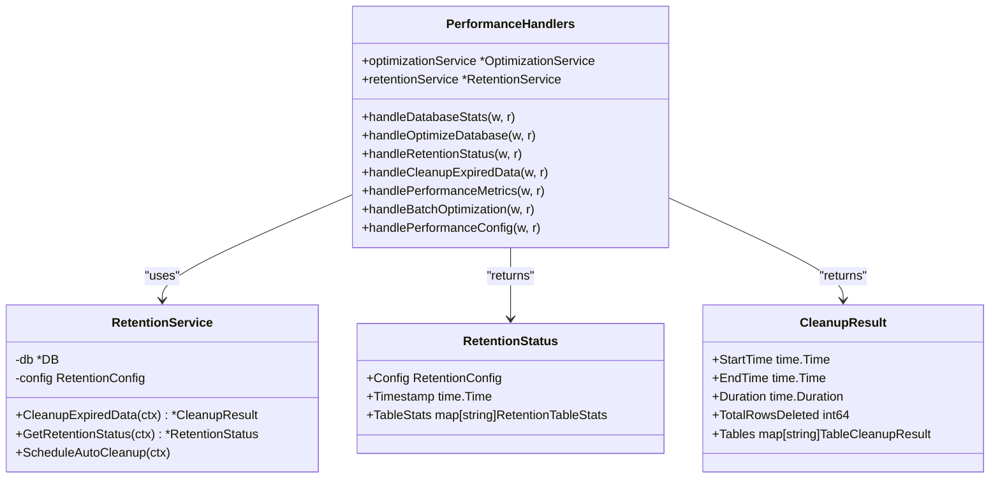

# Data Retention


## Table of Contents
1. [Introduction](#introduction)
2. [Configuration Options](#configuration-options)
3. [Retention Job Scheduling](#retention-job-scheduling)
4. [Batch Deletion Strategy](#batch-deletion-strategy)
5. [Performance Considerations](#performance-considerations)
6. [Data Types and Retention Policies](#data-types-and-retention-policies)
7. [API Endpoints for Retention Management](#api-endpoints-for-retention-management)

## Introduction
The exim-pilot system implements a comprehensive data retention framework that automatically purges old message records, delivery attempts, and log entries based on configurable time-to-live settings. This document details the implementation of the retention system, including configuration options, scheduling mechanisms, batch deletion strategies, and performance optimizations. The retention system ensures that storage requirements are managed efficiently while maintaining access to historical data for the configured retention periods.

## Configuration Options
The data retention policies in exim-pilot are highly configurable through both YAML configuration files and environment variables. The system provides granular control over retention periods for different data types, allowing administrators to customize the data lifecycle according to their specific requirements.





**Diagram sources**
- [config.go](file://internal/config/config.go#L70-L76)
- [config.example.yaml](file://config/config.example.yaml#L68-L72)

The retention configuration is defined in the `RetentionConfig` struct, which includes the following configurable parameters:

**RetentionConfig**
- **LogEntriesDays**: Number of days to retain log entries (default: 90 days)
- **AuditLogDays**: Number of days to retain audit log entries (default: 365 days)
- **QueueSnapshotsDays**: Number of days to retain queue snapshots (default: 30 days)
- **DeliveryAttemptDays**: Number of days to retain delivery attempt records (default: 180 days)
- **CleanupInterval**: Interval in hours between automatic cleanup operations (default: 24 hours)

These configuration values can be set in the `config.yaml` file under the `retention` section or overridden using environment variables. The system validates these configuration values to ensure they meet minimum requirements (e.g., retention periods must be at least 1 day).

**Section sources**
- [config.go](file://internal/config/config.go#L70-L76)
- [config.example.yaml](file://config/config.example.yaml#L68-L72)

## Retention Job Scheduling
The exim-pilot system implements an automated scheduling mechanism for retention jobs that ensures expired data is regularly purged according to the configured policies. The scheduling system uses Go's `time.Ticker` to trigger cleanup operations at the specified interval.





**Diagram sources**
- [retention.go](file://internal/database/retention.go#L290-L322)

The scheduling mechanism is implemented in the `ScheduleAutoCleanup` method of the `RetentionService` struct. When this method is called, it first checks if auto-cleanup is enabled in the configuration. If enabled, it creates a ticker that fires at the interval specified by `CleanupIntervalHours`. The scheduler runs the initial cleanup immediately in a goroutine and then schedules periodic cleanups at the specified interval.

The scheduling system is designed to be resilient and non-blocking. Each cleanup operation runs in its own goroutine, preventing a single failed cleanup from affecting the scheduling of future operations. The system also handles graceful shutdown through the context parameter, allowing the scheduler to stop cleanly when the application is shutting down.

**Section sources**
- [retention.go](file://internal/database/retention.go#L290-L322)

## Batch Deletion Strategy
To handle large-scale cleanup operations efficiently and avoid database performance issues, exim-pilot implements a sophisticated batch deletion strategy. This approach prevents long-running transactions and excessive memory usage by processing deletions in manageable chunks.





**Diagram sources**
- [retention.go](file://internal/database/retention.go#L104-L185)

The batch deletion process follows these steps:

1. **Pre-cleanup assessment**: The system first counts the number of expired rows that need to be deleted using a SELECT COUNT query with the retention cutoff date.

2. **Batch processing**: If expired rows are found, the system processes them in batches defined by the `CleanupBatchSize` configuration parameter (default: 1000 rows). Each batch is processed in its own transaction to prevent long-running transactions that could lock the database.

3. **Optimized DELETE statement**: The system uses a subquery with rowid to efficiently identify and delete expired rows. The SQL pattern used is:
   
```sql
   DELETE FROM table_name 
   WHERE timestamp < ? 
   AND rowid IN (
       SELECT rowid FROM table_name 
       WHERE timestamp < ? 
       LIMIT batch_size
   )
   ```


4. **Transaction management**: Each batch deletion occurs within a separate transaction. This approach minimizes lock contention and allows the database to commit changes incrementally.

5. **Rate limiting**: A 10-millisecond delay is introduced between batches to prevent overwhelming the database with rapid successive operations.

6. **Post-cleanup optimization**: After all expired data has been removed, the system runs database optimization routines to reclaim storage space and update query statistics.

This batch strategy ensures that even very large datasets can be cleaned up efficiently without causing database performance degradation or timeouts.

**Section sources**
- [retention.go](file://internal/database/retention.go#L104-L185)

## Performance Considerations
The data retention system in exim-pilot incorporates several performance optimizations to ensure that cleanup operations have minimal impact on system performance, especially during large-scale cleanup operations.

The primary performance considerations include:

**Batch Size Optimization**: The `CleanupBatchSize` parameter (default: 1000) balances between efficiency and resource usage. Larger batches reduce the number of round trips to the database but increase memory usage and lock duration. Smaller batches are more resource-efficient but require more operations to complete the cleanup.

**Incremental Vacuum**: After cleanup operations, the system runs `PRAGMA incremental_vacuum` to reclaim unused database pages. This prevents database file bloat and maintains optimal storage efficiency.

**Query Analysis**: The system executes `ANALYZE` after cleanup to update SQLite's internal statistics, ensuring that the query planner has up-to-date information for optimal query execution plans.

**Context-Aware Processing**: All operations respect the context parameter, allowing cleanup to be canceled gracefully when the application is shutting down or when a timeout occurs.

**Concurrent Processing**: The scheduling system uses goroutines for cleanup operations, preventing the main application from being blocked by lengthy cleanup tasks.

**Section sources**
- [retention.go](file://internal/database/retention.go#L210-L225)

## Data Types and Retention Policies
exim-pilot manages retention for several distinct data types, each with its own retention policy and cleanup characteristics. The system handles the following data types:

**Data Retention by Type**
- **Log Entries**: System and message logs retained for 90 days by default
- **Audit Log**: Security and administrative actions retained for 365 days by default
- **Queue Snapshots**: Historical queue states retained for 30 days by default
- **Delivery Attempts**: Message delivery attempt records retained for 180 days by default
- **User Sessions**: Authentication sessions retained for 7 days by default

Each data type has specific retention characteristics and cleanup requirements. For example, log entries and audit logs use a "timestamp" column for retention calculations, while user sessions use a "created_at" column. The system also includes special handling for user sessions, with an additional cleanup operation that removes sessions based on their "expires_at" timestamp.

The retention policies are designed to balance storage requirements with operational needs. Log entries have a shorter retention period as they are primarily used for troubleshooting recent issues. Audit logs have the longest retention period to support security investigations and compliance requirements. Delivery attempt records are retained for an intermediate period to allow analysis of delivery patterns and issues.

**Section sources**
- [retention.go](file://internal/database/retention.go#L51-L65)

## API Endpoints for Retention Management
The exim-pilot system exposes several API endpoints that allow administrators to monitor and manage data retention policies programmatically.





**Diagram sources**
- [performance_handlers.go](file://internal/api/performance_handlers.go#L15-L25)

The following API endpoints are available for retention management:

**GET /api/v1/performance/retention/status**: Returns the current retention status, including configuration, statistics for each table, and the number of expired rows.

**POST /api/v1/performance/retention/cleanup**: Triggers an immediate cleanup of expired data and returns detailed results including the number of rows deleted and processing time.

**GET /api/v1/performance/metrics**: Returns comprehensive performance metrics including retention status and database statistics.

**POST /api/v1/performance/batch/optimize**: Allows batch operations including data cleanup as part of a broader optimization process.

These endpoints enable both manual and automated management of the retention system, allowing integration with monitoring tools and automated maintenance scripts.

**Section sources**
- [performance_handlers.go](file://internal/api/performance_handlers.go#L120-L140)

**Referenced Files in This Document**   
- [retention.go](file://internal/database/retention.go)
- [config.go](file://internal/config/config.go)
- [config.example.yaml](file://config/config.example.yaml)
- [performance_handlers.go](file://internal/api/performance_handlers.go)