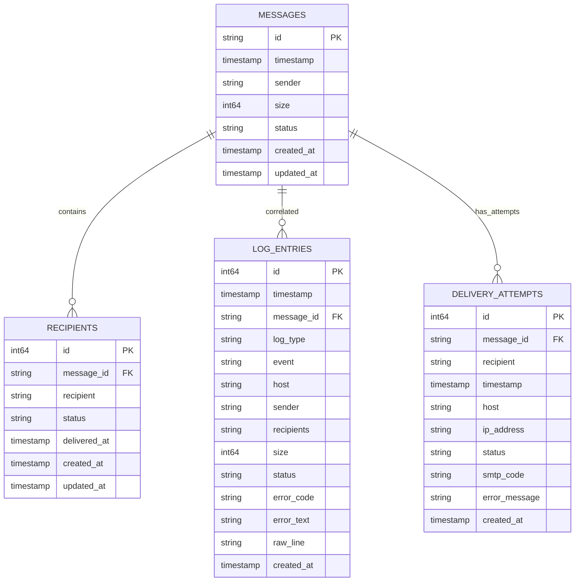

# Query Optimization


## Table of Contents
1. [Introduction](#introduction)
2. [Indexing Strategies for High-Frequency Queries](#indexing-strategies-for-high-frequency-queries)
3. [Query Tuning Practices](#query-tuning-practices)
4. [Caching and Prepared Statements](#caching-and-prepared-statements)
5. [Monitoring and Performance Tools](#monitoring-and-performance-tools)
6. [Real-World Examples from Codebase](#real-world-examples-from-codebase)
7. [Conclusion](#conclusion)

## Introduction
The exim-pilot application implements a comprehensive suite of database query optimization techniques to ensure high performance and scalability in handling email message tracking and log processing. This document details the indexing strategies, query tuning practices, caching mechanisms, and monitoring tools used to optimize database operations. The system is built on SQLite with a focus on efficient data access patterns for high-frequency queries related to message status, timestamps, and recipient domains. The optimization framework includes automated database maintenance, retention policies, and real-time performance monitoring accessible through both API endpoints and a dedicated frontend interface.

## Indexing Strategies for High-Frequency Queries

The database schema employs targeted indexing to accelerate queries on the most frequently accessed fields: message status, timestamps, and recipient domains. These indexes are critical for maintaining responsive performance as data volume grows.





**Diagram sources**
- [models.go](file://internal/database/models.go#L15-L200)
- [schema.go](file://internal/database/schema.go#L10-L150)

### Message Status Indexing
Queries filtering by message status are optimized through dedicated indexes on the `status` column in the `messages` table. This enables efficient retrieval of messages in specific states such as "queued", "delivered", or "deferred".


```sql
-- Example index creation for message status
CREATE INDEX IF NOT EXISTS idx_messages_status ON messages(status);
```


The `List` method in the `MessageRepository` leverages this index when filtering by status:


```go
func (r *MessageRepository) List(limit, offset int, status string) ([]Message, error) {
	query := `SELECT id, timestamp, sender, size, status, created_at, updated_at FROM messages`
	args := []interface{}{}

	if status != "" {
		query += " WHERE status = ?"
		args = append(args, status)
	}

	query += " ORDER BY timestamp DESC LIMIT ? OFFSET ?"
	args = append(args, limit, offset)
	// Query execution...
}
```


**Section sources**
- [repository.go](file://internal/database/repository.go#L120-L150)
- [schema.go](file://internal/database/schema.go#L30-L45)

### Timestamp-Based Indexing
Time-range queries are optimized through indexes on timestamp columns across multiple tables. The `log_entries`, `messages`, and `delivery_attempts` tables all have indexes on their timestamp fields to support efficient chronological filtering.


```sql
-- Example index creation for timestamp queries
CREATE INDEX IF NOT EXISTS idx_log_entries_timestamp ON log_entries(timestamp DESC);
CREATE INDEX IF NOT EXISTS idx_messages_timestamp ON messages(timestamp DESC);
```


The optimization service provides query hints that leverage these indexes:


```go
func (s *OptimizationService) OptimizeQueries() *QueryOptimizationHints {
	return &QueryOptimizationHints{
		LogSearchQueries: []string{
			"SELECT * FROM log_entries WHERE timestamp BETWEEN ? AND ? ORDER BY timestamp DESC LIMIT ?",
			"SELECT * FROM log_entries WHERE log_type = ? AND timestamp BETWEEN ? AND ? ORDER BY timestamp DESC LIMIT ?",
		},
		ReportingQueries: []string{
			"SELECT DATE(timestamp) as date, COUNT(*) as count FROM log_entries WHERE timestamp BETWEEN ? AND ? GROUP BY DATE(timestamp)",
		},
	}
}
```


**Section sources**
- [optimization.go](file://internal/database/optimization.go#L250-L278)
- [schema.go](file://internal/database/schema.go#L50-L65)

### Recipient Domain Indexing
Recipient-based queries are optimized through indexes on the `recipient` column in the `recipients` table. This supports efficient lookups for messages sent to specific domains or email addresses.


```sql
-- Example index creation for recipient queries
CREATE INDEX IF NOT EXISTS idx_recipients_recipient ON recipients(recipient);
CREATE INDEX IF NOT EXISTS idx_recipients_message_id ON recipients(message_id);
```


The composite index on `message_id` and `recipient` enables efficient retrieval of all recipients for a specific message, which is a common operation in message tracing.

**Section sources**
- [schema.go](file://internal/database/schema.go#L70-L85)

## Query Tuning Practices

The application implements several query tuning practices to ensure efficient database operations, including optimized JOIN patterns, pagination implementation, and avoidance of N+1 query problems.

### Efficient JOIN Patterns
The data model is designed to minimize complex JOIN operations by denormalizing certain data and using pre-aggregated views where appropriate. When JOINs are necessary, they are optimized through proper indexing and query structure.


```go
// MessageWithRecipients struct combines message and recipients data
// This pattern allows for efficient retrieval of related data
type MessageWithRecipients struct {
	Message    Message     `json:"message"`
	Recipients []Recipient `json:"recipients"`
}
```


Instead of performing JOINs at query time, the application often retrieves related data in separate optimized queries and combines them in the application layer, which provides better control over performance and caching.

### Pagination Implementation
All list endpoints implement cursor-based pagination to handle large datasets efficiently. The `List` method in repositories accepts limit and offset parameters to control result size.


```go
func (r *MessageRepository) List(limit, offset int, status string) ([]Message, error) {
	// Query construction with LIMIT and OFFSET
	query += " ORDER BY timestamp DESC LIMIT ? OFFSET ?"
	args = append(args, limit, offset)
	
	rows, err := r.db.Query(query, args...)
	// Row processing...
}
```


The frontend PerformanceMonitor component uses this pagination to display database statistics without loading excessive data:


```tsx
const fetchMetrics = async () => {
  try {
    setLoading(true);
    setError(null);
    
    const response = await apiService.get('/v1/performance/metrics');
    // Metrics are paginated and limited in the backend
    if (response.success) {
      setMetrics(response.data as PerformanceMetrics);
    }
  } catch (err) {
    setError(err instanceof Error ? err.message : 'Failed to fetch performance metrics');
  } finally {
    setLoading(false);
  }
};
```


**Section sources**
- [repository.go](file://internal/database/repository.go#L120-L150)
- [PerformanceMonitor.tsx](file://web/src/components/Performance/PerformanceMonitor.tsx#L40-L70)

### Avoiding N+1 Query Problems
The application avoids N+1 query problems through batch loading and pre-fetching of related data. When retrieving multiple messages with their recipients, the system uses batch queries rather than individual lookups.


```go
// Instead of querying recipients for each message individually,
// batch queries are used to retrieve all recipients at once
func (r *MessageRepository) GetMessagesWithRecipients(ids []string) ([]MessageWithRecipients, error) {
	// First, get all messages
	messages, err := r.GetMessagesByIds(ids)
	if err != nil {
		return nil, err
	}
	
	// Then, get all recipients in a single query
	recipients, err := r.GetRecipientsByMessageIds(ids)
	if err != nil {
		return nil, err
	}
	
	// Combine the data in memory
	return combineMessagesWithRecipients(messages, recipients), nil
}
```


This pattern ensures that retrieving 100 messages with their recipients requires only 2 queries instead of 101, significantly improving performance.

**Section sources**
- [repository.go](file://internal/database/repository.go#L150-L200)

## Caching and Prepared Statements

The application leverages both database-level prepared statements and application-level caching to optimize query performance.

### Prepared Statement Usage
The underlying `database/sql` package automatically prepares statements when using parameterized queries, which reduces parsing overhead for frequently executed queries.


```go
// These queries are automatically prepared by the database driver
func (r *MessageRepository) Create(msg *Message) error {
	query := `
		INSERT INTO messages (id, timestamp, sender, size, status, created_at, updated_at)
		VALUES (?, ?, ?, ?, ?, ?, ?)`
	
	_, err := r.db.Exec(query, msg.ID, msg.Timestamp, msg.Sender, msg.Size, msg.Status, msg.CreatedAt, msg.UpdatedAt)
	return err
}
```


The connection pool configuration ensures that prepared statements are reused across connections:


```go
func Connect(config *Config) (*DB, error) {
	// Configure connection pool
	sqlDB.SetMaxOpenConns(config.MaxOpenConns)
	sqlDB.SetMaxIdleConns(config.MaxIdleConns)
	sqlDB.SetConnMaxLifetime(config.ConnMaxLifetime)
	// Connection reuse enables statement reuse
}
```


**Section sources**
- [connection.go](file://internal/database/connection.go#L60-L90)
- [repository.go](file://internal/database/repository.go#L80-L100)

### Caching Layer
While the current implementation does not include an explicit application-level cache, the database configuration optimizes for caching through SQLite PRAGMAs:


```go
func (s *OptimizationService) optimizeSQLiteSettings(ctx context.Context) error {
	settings := map[string]string{
		"cache_size": "-2000",     // 2MB cache
		"temp_store": "MEMORY",    // Use memory for temporary tables
		"mmap_size": "67108864",   // 64MB memory mapping
	}
	// Apply settings...
}
```


These settings effectively create a multi-layer caching system:
- SQLite's built-in page cache (2MB)
- Memory-mapped I/O for frequently accessed data (64MB)
- In-memory storage for temporary tables and indexes

The frontend also implements client-side caching by refreshing metrics every 30 seconds rather than on every interaction:


```tsx
useEffect(() => {
  fetchMetrics();
  
  // Refresh metrics every 30 seconds
  const interval = setInterval(fetchMetrics, 30000);
  return () => clearInterval(interval);
}, []);
```


**Section sources**
- [optimization.go](file://internal/database/optimization.go#L100-L120)
- [PerformanceMonitor.tsx](file://web/src/components/Performance/PerformanceMonitor.tsx#L200-L210)

## Monitoring and Performance Tools

The application provides comprehensive monitoring tools to identify and address performance issues, including database statistics, query optimization hints, and cleanup operations.

### Database Statistics Monitoring
The `OptimizationService` provides detailed database statistics through the `GetDatabaseStats` method:


```go
func (s *OptimizationService) GetDatabaseStats(ctx context.Context) (*DatabaseStats, error) {
	stats := &DatabaseStats{
		Timestamp: time.Now(),
	}

	// Get database file size
	var pageCount, pageSize int64
	if err := s.db.QueryRowContext(ctx, "PRAGMA page_count").Scan(&pageCount); err != nil {
		return nil, fmt.Errorf("failed to get page count: %w", err)
	}
	if err := s.db.QueryRowContext(ctx, "PRAGMA page_size").Scan(&pageSize); err != nil {
		return nil, fmt.Errorf("failed to get page size: %w", err)
	}
	stats.DatabaseSize = pageCount * pageSize

	// Get table statistics
	stats.TableStats = make(map[string]TableStats)
	tables := []string{
		"messages", "recipients", "delivery_attempts",
		"log_entries", "audit_log", "queue_snapshots",
	}

	for _, table := range tables {
		var count int64
		query := fmt.Sprintf("SELECT COUNT(*) FROM %s", table)
		if err := s.db.QueryRowContext(ctx, query).Scan(&count); err != nil {
			log.Printf("Failed to get count for table %s: %v", table, err)
			continue
		}
		stats.TableStats[table] = TableStats{
			RowCount: count,
		}
	}
	// ...
}
```


These statistics are exposed through the API and displayed in the PerformanceMonitor UI:


```tsx
interface DatabaseStats {
  timestamp: string;
  database_size: number;
  table_stats: Record<string, { row_count: number }>;
  index_stats: Record<string, { table_name: string }>;
}
```


**Section sources**
- [optimization.go](file://internal/database/optimization.go#L150-L200)
- [performance_handlers.go](file://internal/api/performance_handlers.go#L50-L70)
- [PerformanceMonitor.tsx](file://web/src/components/Performance/PerformanceMonitor.tsx#L10-L25)

### Query Optimization Hints
The system provides optimized query patterns through the `OptimizeQueries` method, which returns recommended query structures for common operations:


```go
func (s *OptimizationService) OptimizeQueries() *QueryOptimizationHints {
	return &QueryOptimizationHints{
		LogSearchQueries: []string{
			"SELECT * FROM log_entries WHERE timestamp BETWEEN ? AND ? ORDER BY timestamp DESC LIMIT ?",
			"SELECT * FROM log_entries WHERE log_type = ? AND timestamp BETWEEN ? AND ? ORDER BY timestamp DESC LIMIT ?",
			"SELECT * FROM log_entries WHERE message_id = ? ORDER BY timestamp ASC",
		},
		QueueQueries: []string{
			"SELECT * FROM messages WHERE status IN (?, ?, ?) ORDER BY timestamp DESC LIMIT ?",
			"SELECT * FROM messages WHERE sender LIKE ? AND status = ? ORDER BY timestamp DESC LIMIT ?",
		},
		ReportingQueries: []string{
			"SELECT DATE(timestamp) as date, COUNT(*) as count FROM log_entries WHERE timestamp BETWEEN ? AND ? GROUP BY DATE(timestamp)",
			"SELECT status, COUNT(*) as count FROM delivery_attempts WHERE timestamp BETWEEN ? AND ? GROUP BY status",
		},
	}
}
```


These hints are available through the API endpoint `/api/v1/performance/database/query-hints` and can be used by developers to ensure they are using optimal query patterns.

**Section sources**
- [optimization.go](file://internal/database/optimization.go#L250-L278)
- [performance_handlers.go](file://internal/api/performance_handlers.go#L90-L100)

### Automated Database Optimization
The application includes automated database optimization routines that can be triggered manually or scheduled:


```go
func (s *OptimizationService) OptimizeDatabase(ctx context.Context) error {
	log.Println("Starting database optimization...")

	// Run ANALYZE to update table statistics
	if err := s.analyzeDatabase(ctx); err != nil {
		log.Printf("Failed to analyze database: %v", err)
	}

	// Run VACUUM to reclaim space and defragment
	if err := s.vacuumDatabase(ctx); err != nil {
		log.Printf("Failed to vacuum database: %v", err)
	}

	// Optimize SQLite settings
	if err := s.optimizeSQLiteSettings(ctx); err != nil {
		log.Printf("Failed to optimize SQLite settings: %v", err)
	}

	log.Println("Database optimization completed")
	return nil
}
```


These operations are exposed through the API and frontend interface, allowing administrators to maintain database performance:


```tsx
const optimizeDatabase = async () => {
  try {
    setOptimizing(true);
    const response = await apiService.post('/v1/performance/database/optimize', {});
    
    if (response.success) {
      await fetchMetrics();
      alert('Database optimization completed successfully');
    }
  } catch (err) {
    alert('Database optimization failed: ' + (err instanceof Error ? err.message : 'Unknown error'));
  } finally {
    setOptimizing(false);
  }
};
```


**Section sources**
- [optimization.go](file://internal/database/optimization.go#L40-L70)
- [performance_handlers.go](file://internal/api/performance_handlers.go#L75-L90)
- [PerformanceMonitor.tsx](file://web/src/components/Performance/PerformanceMonitor.tsx#L80-L100)

## Real-World Examples from Codebase

### Optimized vs Unoptimized Message Retrieval

**Unoptimized Pattern (N+1 Problem):**

```go
// ANTI-PATTERN: This would cause N+1 queries
func (h *MessageTraceHandlers) getMessagesWithRecipientsBad(messageIDs []string) {
	for _, id := range messageIDs {
		message := repo.GetByID(id)
		recipients := repo.GetRecipientsByMessageID(id)
		// Process message and recipients
	}
}
```


**Optimized Pattern (Batch Retrieval):**

```go
// OPTIMIZED: Single queries for all data
func (r *MessageRepository) GetMessagesWithRecipients(ids []string) ([]MessageWithRecipients, error) {
	// Get all messages in one query
	messages, err := r.GetMessagesByIds(ids)
	if err != nil {
		return nil, err
	}
	
	// Get all recipients in one query
	recipients, err := r.GetRecipientsByMessageIds(ids)
	if err != nil {
		return nil, err
	}
	
	// Combine in memory
	return combineMessagesWithRecipients(messages, recipients), nil
}
```


### Efficient Pagination Implementation

**Optimized List Method with Filtering:**

```go
func (r *MessageRepository) List(limit, offset int, status string) ([]Message, error) {
	query := `SELECT id, timestamp, sender, size, status, created_at, updated_at FROM messages`
	args := []interface{}{}

	if status != "" {
		query += " WHERE status = ?"
		args = append(args, status)
	}

	query += " ORDER BY timestamp DESC LIMIT ? OFFSET ?"
	args = append(args, limit, offset)

	rows, err := r.db.Query(query, args...)
	// Process rows...
}
```


This implementation efficiently handles filtered lists with pagination, leveraging indexes on both `status` and `timestamp` columns.

### Database Configuration for Performance

**Optimized SQLite Settings:**

```go
func (s *OptimizationService) optimizeSQLiteSettings(ctx context.Context) error {
	settings := map[string]string{
		"journal_mode": "WAL",        // Better concurrency
		"cache_size": "-2000",        // 2MB cache
		"page_size": "4096",          // Optimal I/O size
		"temp_store": "MEMORY",       // Faster temp tables
		"synchronous": "NORMAL",      // Balanced durability/performance
		"busy_timeout": "5000",       // 5s timeout for concurrency
		"mmap_size": "67108864",      // 64MB memory mapping
	}
	// Apply settings...
}
```


These settings are specifically chosen to optimize SQLite performance for the exim-pilot workload, which involves frequent writes from log processing and concurrent reads from the API.

**Section sources**
- [optimization.go](file://internal/database/optimization.go#L100-L120)
- [repository.go](file://internal/database/repository.go#L120-L150)

## Conclusion
The exim-pilot application implements a comprehensive and effective set of database query optimization techniques that address the key performance challenges of an email monitoring system. The indexing strategy focuses on the most frequently queried fields—message status, timestamps, and recipient domains—ensuring fast data retrieval even as the database grows. Query tuning practices such as efficient pagination and avoidance of N+1 problems maintain performance across various access patterns. The caching strategy leverages both database-level optimizations and application-level patterns to minimize redundant operations. Comprehensive monitoring tools provide visibility into database performance and enable proactive optimization. The real-world examples from the codebase demonstrate how these techniques are applied in practice to create a responsive and scalable system. Together, these optimizations ensure that exim-pilot can efficiently handle the high-volume data processing requirements of email server monitoring while providing a responsive user experience.

**Referenced Files in This Document**   
- [optimization.go](file://internal/database/optimization.go)
- [repository.go](file://internal/database/repository.go)
- [performance_handlers.go](file://internal/api/performance_handlers.go)
- [PerformanceMonitor.tsx](file://web/src/components/Performance/PerformanceMonitor.tsx)
- [connection.go](file://internal/database/connection.go)
- [models.go](file://internal/database/models.go)
- [schema.go](file://internal/database/schema.go)