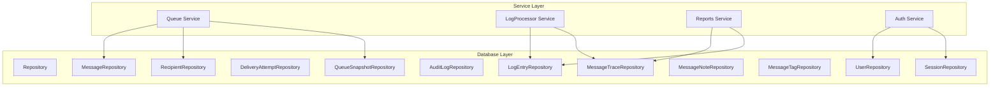
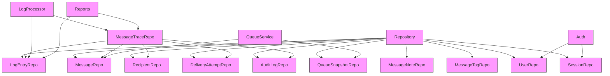
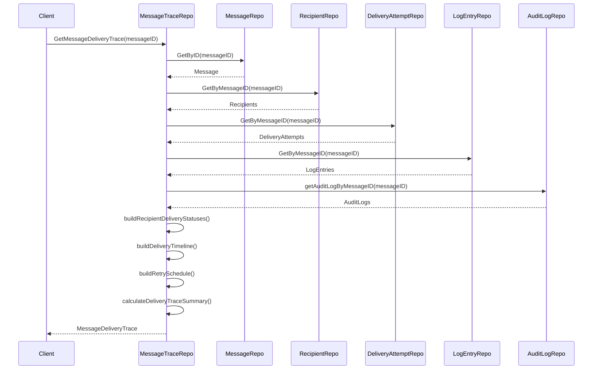
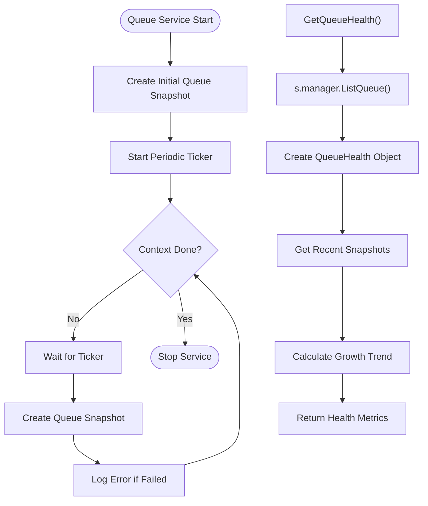
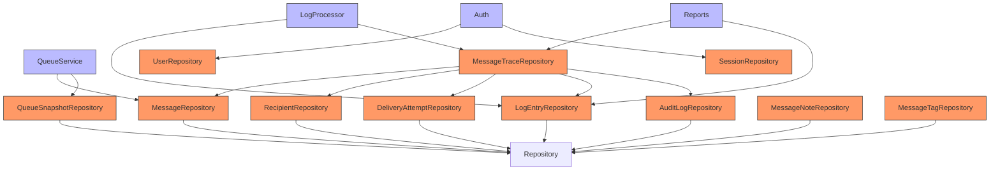

# Repository Pattern Implementation


## Table of Contents
1. [Introduction](#introduction)
2. [Project Structure](#project-structure)
3. [Core Components](#core-components)
4. [Architecture Overview](#architecture-overview)
5. [Detailed Component Analysis](#detailed-component-analysis)
6. [Dependency Analysis](#dependency-analysis)
7. [Performance Considerations](#performance-considerations)
8. [Troubleshooting Guide](#troubleshooting-guide)
9. [Conclusion](#conclusion)

## Introduction

The exim-pilot application implements a robust repository pattern within its `internal/database` package to abstract database operations and decouple business logic from storage details. This documentation provides a comprehensive analysis of the repository implementation, focusing on how it enables clean separation of concerns, supports CRUD operations, search, filtering, and aggregation across core entities such as messages, recipients, delivery attempts, and audit logs. The design emphasizes interface segregation, error wrapping, and testability, allowing services like queue management, log processing, and reporting to interact with data through well-defined interfaces without direct database knowledge.

## Project Structure

The repository pattern is implemented within the `internal/database` directory, which contains the core data access logic for the application. This implementation follows a layered architecture where specific repository types are created for different domain entities, all building upon a common base repository structure.





**Diagram sources**
- [repository.go](file://internal/database/repository.go#L1-L1603)
- [service.go](file://internal/queue/service.go#L1-L200)

**Section sources**
- [repository.go](file://internal/database/repository.go#L1-L50)
- [models.go](file://internal/database/models.go#L1-L340)

## Core Components

The repository pattern implementation centers around several key components that provide structured access to database entities. The base `Repository` struct serves as a foundation, while specialized repositories like `MessageRepository`, `RecipientRepository`, and `MessageTraceRepository` handle entity-specific operations. Each repository exposes methods for CRUD operations, searching, filtering, and aggregation, enabling services to interact with data through clean interfaces.

The implementation uses Go's struct embedding to promote code reuse and maintain a consistent API across repositories. Error handling is standardized through error wrapping with the `%w` verb, providing clear context for debugging. The pattern also supports complex operations like message delivery tracing by coordinating multiple repositories to build comprehensive views from disparate data sources.

**Section sources**
- [repository.go](file://internal/database/repository.go#L1-L100)
- [models.go](file://internal/database/models.go#L1-L50)

## Architecture Overview

The repository pattern in exim-pilot follows a composition-based design where specialized repositories are composed of the base repository and coordinate with each other to fulfill complex business requirements. This architecture enables the separation of concerns while maintaining data consistency and transactional integrity.





**Diagram sources**
- [repository.go](file://internal/database/repository.go#L1-L1603)
- [service.go](file://internal/queue/service.go#L1-L100)

## Detailed Component Analysis

### Message Repository Analysis
The `MessageRepository` provides CRUD operations for message entities, serving as the primary interface for message data access. It implements standard operations including creation, retrieval by ID, updating, deletion, listing with pagination, and counting with optional status filtering.


```mermaid
classDiagram
class MessageRepository {
+Create(msg *Message) error
+GetByID(id string) (*Message, error)
+Update(msg *Message) error
+Delete(id string) error
+List(limit, offset int, status string) ([]Message, error)
+Count(status string) (int, error)
}
class Repository {
-db *DB
-logEntryRepo *LogEntryRepository
+GetDB() *DB
+CreateLogEntry(ctx context.Context, entry *LogEntry) error
+CreateQueueSnapshot(snapshot *QueueSnapshot) error
+CreateAuditLog(entry *AuditLog) error
+GetAuditLogs(filters interface{}) ([]*AuditLog, error)
}
class Message {
+ID string
+Timestamp time.Time
+Sender string
+Size *int64
+Status string
+CreatedAt time.Time
+UpdatedAt time.Time
}
MessageRepository --> Repository : "embeds"
MessageRepository --> Message : "manages"
```


**Diagram sources**
- [repository.go](file://internal/database/repository.go#L100-L250)
- [models.go](file://internal/database/models.go#L10-L25)

**Section sources**
- [repository.go](file://internal/database/repository.go#L100-L250)
- [models.go](file://internal/database/models.go#L10-L30)

### Message Trace Repository Analysis
The `MessageTraceRepository` demonstrates a sophisticated use of the repository pattern by aggregating data from multiple sources to create comprehensive delivery traces. This repository coordinates with message, recipient, delivery attempt, log entry, and audit log repositories to build a complete picture of a message's lifecycle.





**Diagram sources**
- [repository.go](file://internal/database/repository.go#L665-L741)
- [repository.go](file://internal/database/repository.go#L743-L850)

**Section sources**
- [repository.go](file://internal/database/repository.go#L665-L850)

### Queue Service Interaction
The queue service interacts with the repository pattern to manage message queue operations, create periodic snapshots, and provide health metrics. It uses the repository interfaces to persist data without direct knowledge of the underlying database implementation.





**Diagram sources**
- [service.go](file://internal/queue/service.go#L46-L93)
- [repository.go](file://internal/database/repository.go#L576-L625)

**Section sources**
- [service.go](file://internal/queue/service.go#L46-L93)
- [repository.go](file://internal/database/repository.go#L576-L625)

## Dependency Analysis

The repository pattern implementation reveals a clear dependency hierarchy where higher-level services depend on repository interfaces rather than direct database access. This design enables loose coupling and enhances testability by allowing mock repositories to be injected during testing.





**Diagram sources**
- [repository.go](file://internal/database/repository.go#L1-L1603)
- [service.go](file://internal/queue/service.go#L1-L100)
- [logprocessor/service.go](file://internal/logprocessor/service.go#L1-L50)

**Section sources**
- [repository.go](file://internal/database/repository.go#L1-L1603)
- [service.go](file://internal/queue/service.go#L1-L100)

## Performance Considerations

The repository implementation includes several performance considerations. Pagination is built into list operations to prevent memory issues with large datasets. The `MessageTraceRepository` efficiently aggregates data by making parallel queries to different repositories rather than nested queries. Index usage is implied through query patterns that filter by message ID, timestamp, and status fields.

For high-frequency operations like log entry creation, the repository uses prepared statement patterns through the underlying database driver. The queue snapshot functionality includes retention management through the `DeleteOlderThan` method, preventing unbounded growth of historical data.

The implementation could benefit from additional optimizations such as query result caching, connection pooling configuration, and more sophisticated indexing strategies based on access patterns. Batch operations for creating multiple entities could also improve performance in high-throughput scenarios.

## Troubleshooting Guide

Common issues with the repository pattern implementation typically involve database connectivity, query errors, or data consistency problems. The error wrapping strategy using `fmt.Errorf` with the `%w` verb provides clear error context that can be unwrapped using `errors.Is` and `errors.As` for targeted error handling.

When debugging repository issues, check the following:
- Database connection health and configuration
- SQL query syntax and parameter binding
- Transaction isolation levels and potential deadlocks
- Index availability for frequently queried fields
- Data type compatibility between Go structs and database columns

The audit logging functionality can help trace data modifications, while the queue snapshot history provides insight into system behavior over time. Unit tests for repository methods should validate both success and error paths, including edge cases like empty result sets and constraint violations.

**Section sources**
- [repository.go](file://internal/database/repository.go#L1-L1603)
- [models.go](file://internal/database/models.go#L1-L340)

## Conclusion

The repository pattern implementation in exim-pilot's internal/database package provides a robust and maintainable approach to data access. By abstracting database operations behind clean interfaces, it successfully decouples business logic from storage details, enabling services like queue management, log processing, and reporting to interact with data through well-defined contracts. The design demonstrates effective use of Go's struct embedding for code reuse, comprehensive error handling through error wrapping, and thoughtful coordination between specialized repositories for complex operations like message delivery tracing. This architecture supports the application's scalability and maintainability while providing a solid foundation for future enhancements.

**Referenced Files in This Document**   
- [repository.go](file://internal/database/repository.go)
- [models.go](file://internal/database/models.go)
- [service.go](file://internal/queue/service.go)
- [queue_handlers.go](file://internal/api/queue_handlers.go)
- [logprocessor/service.go](file://internal/logprocessor/service.go)
- [reports_handlers.go](file://internal/api/reports_handlers.go)