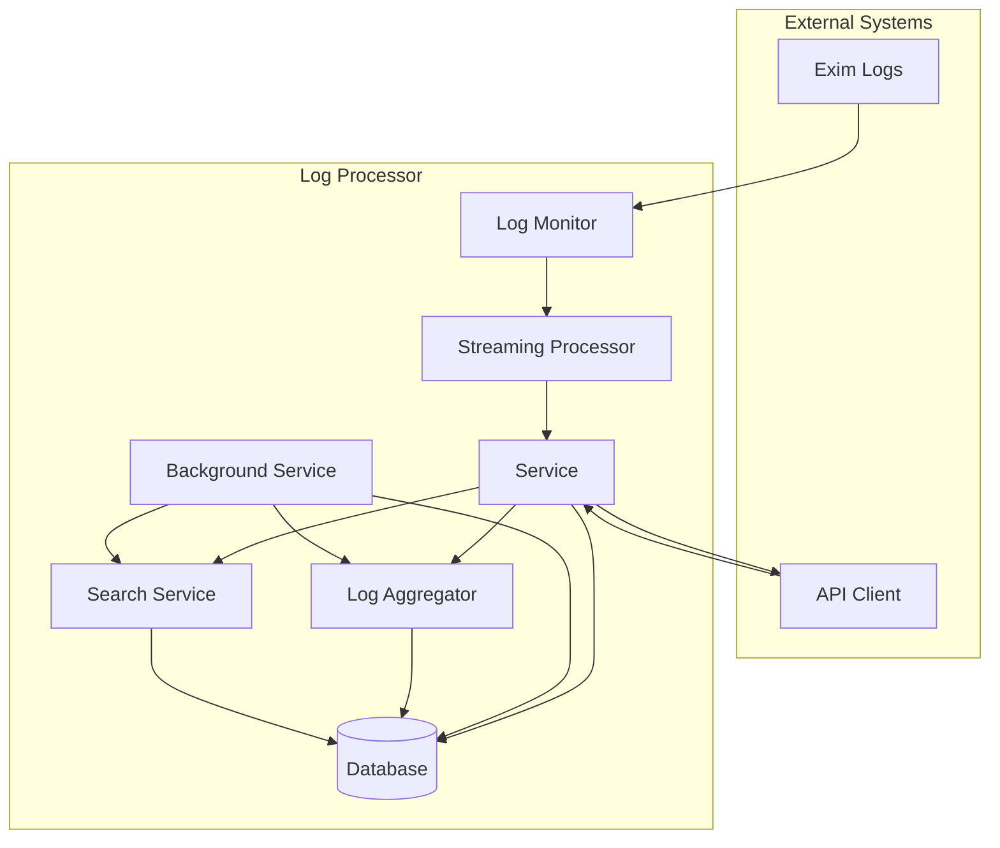
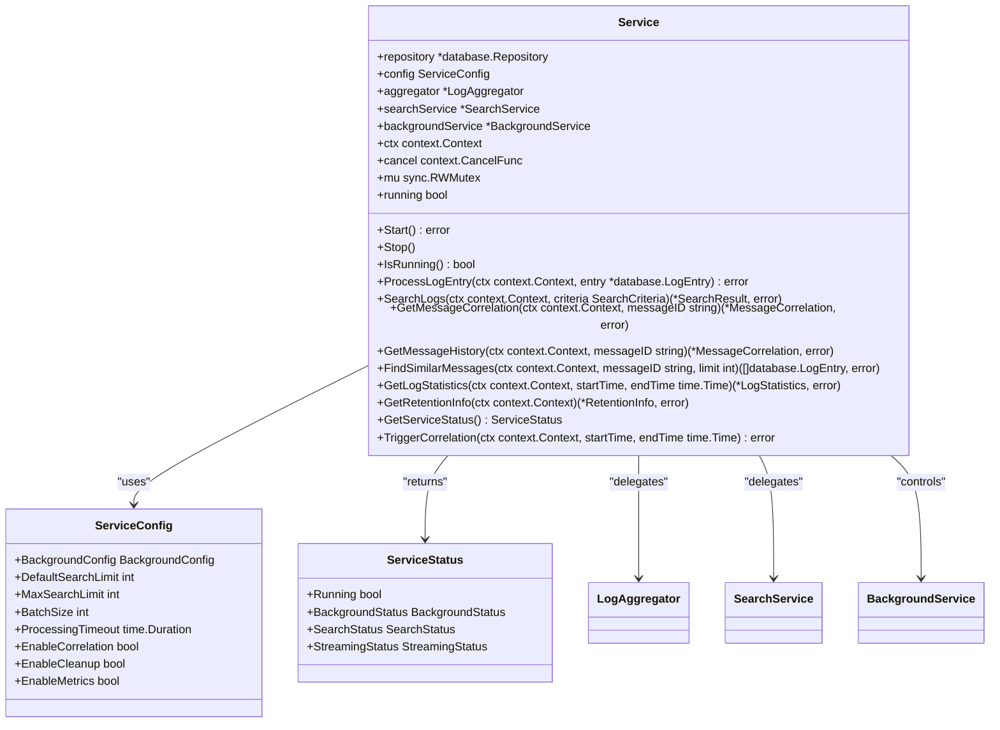
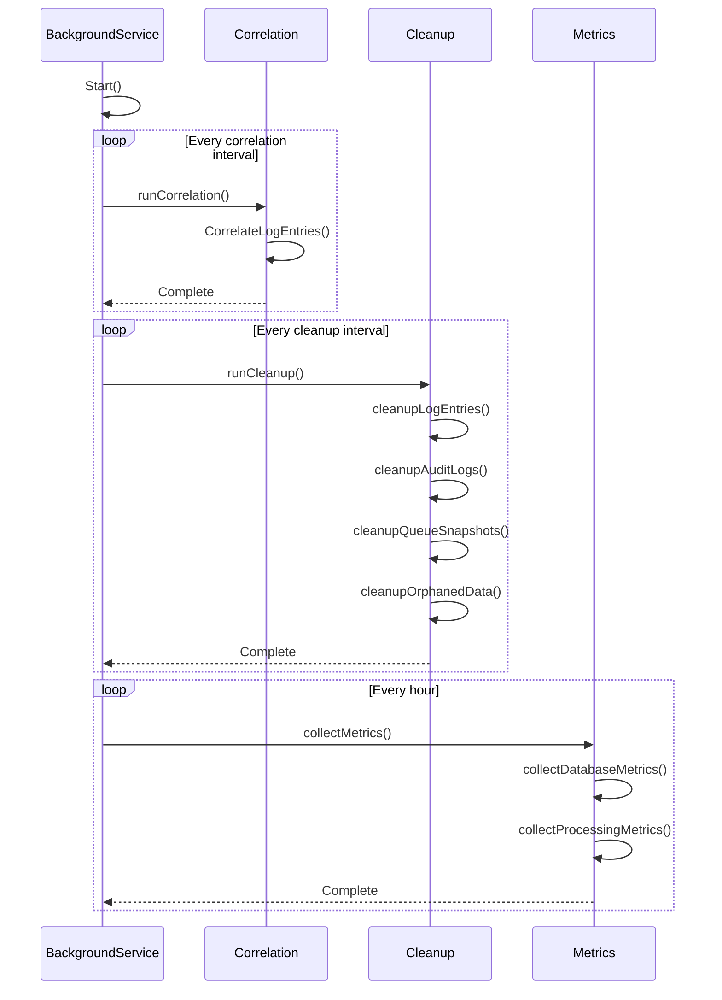
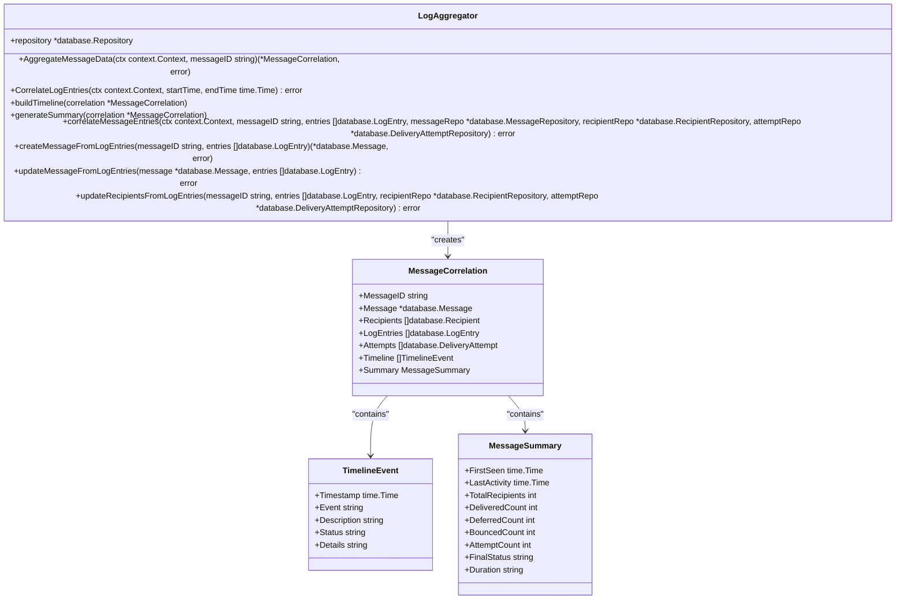
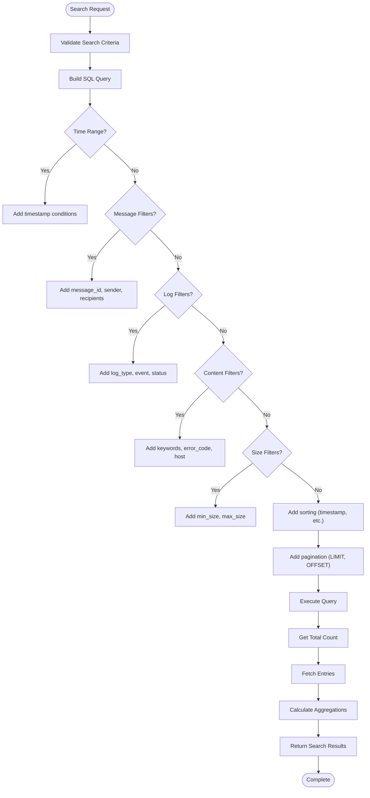
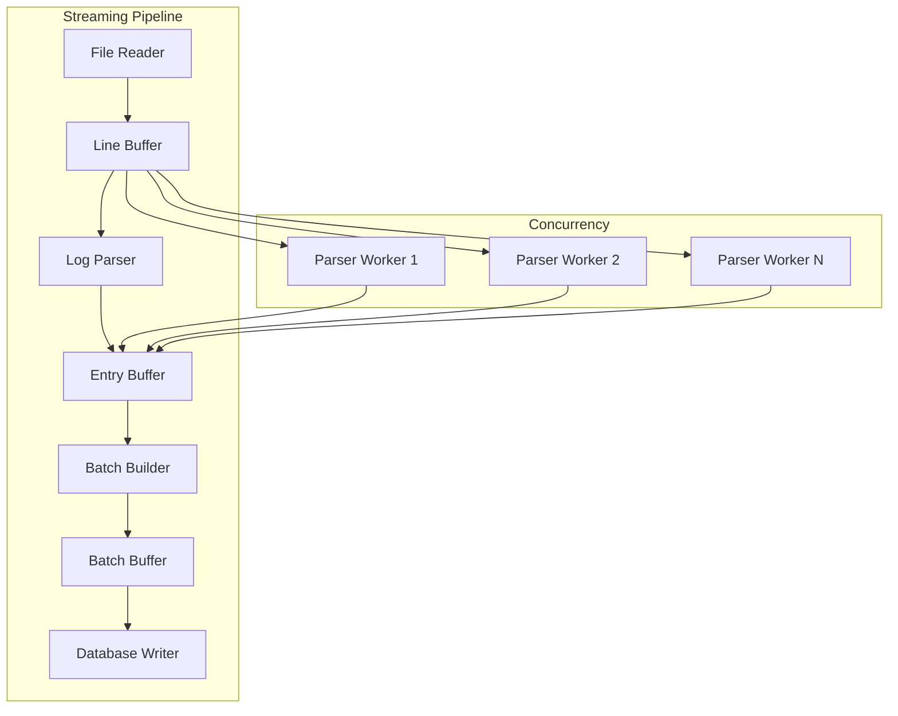
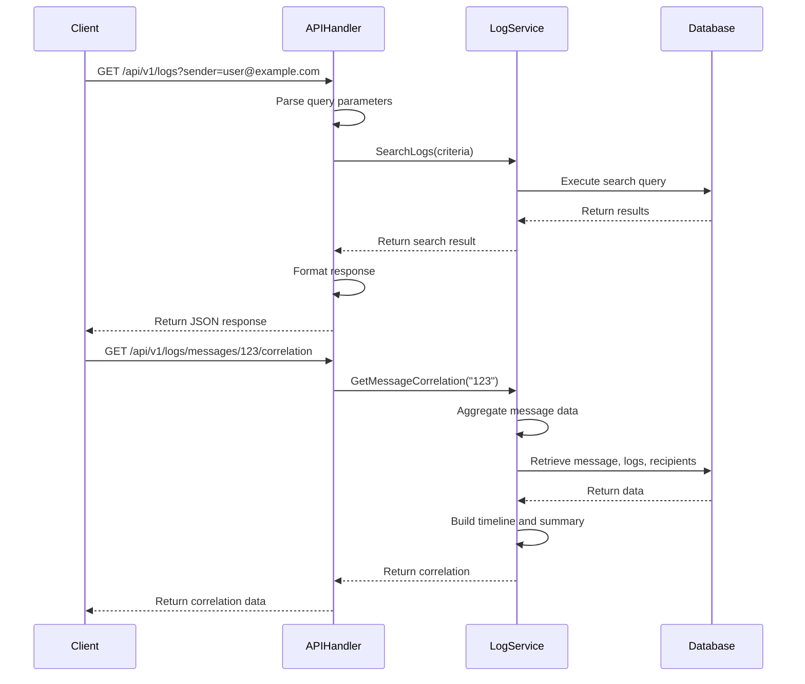
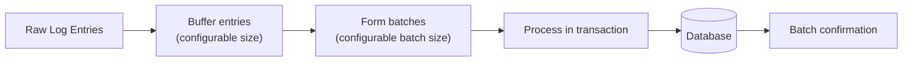
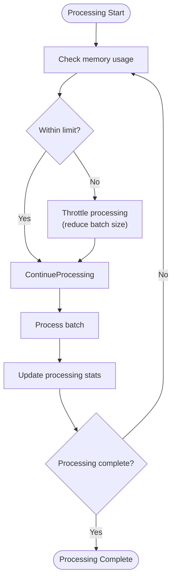
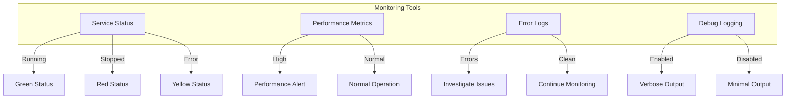

# Log Processor Service


## Table of Contents
1. [Introduction](#introduction)
2. [Project Structure](#project-structure)
3. [Core Components](#core-components)
4. [Architecture Overview](#architecture-overview)
5. [Detailed Component Analysis](#detailed-component-analysis)
6. [Dependency Analysis](#dependency-analysis)
7. [Performance Considerations](#performance-considerations)
8. [Troubleshooting Guide](#troubleshooting-guide)
9. [Conclusion](#conclusion)

## Introduction
The Log Processor Service is a critical component of the Exim Pilot system responsible for processing, correlating, and analyzing Exim mail server log data. This service transforms raw log entries into structured, searchable, and correlated message delivery histories. It provides background processing for data correlation, retention management, and metrics collection, enabling efficient log analysis and message tracking. The service supports real-time log processing, advanced search capabilities, and message correlation to provide comprehensive visibility into email delivery operations.

## Project Structure
The logprocessor package is organized into several key components that work together to provide comprehensive log processing functionality. The package follows a modular design with clear separation of concerns between different processing aspects.


```mermaid
graph TD
subgraph "Log Processor Package"
Service[Service]
Aggregator[Log Aggregator]
Background[Background Service]
Search[Search Service]
Streaming[Streaming Processor]
end
Service --> Aggregator
Service --> Background
Service --> Search
Service < --> Streaming
Background --> Aggregator
Background --> Search
Search --> Aggregator
```


**Diagram sources**
- [internal/logprocessor/README.md](file://internal/logprocessor/README.md)

**Section sources**
- [internal/logprocessor/README.md](file://internal/logprocessor/README.md)

## Core Components
The logprocessor package consists of several core components that work together to provide comprehensive log processing capabilities. The main Service component orchestrates operations, coordinating between the Aggregator for message correlation, the Background Service for scheduled tasks, the Search Service for querying capabilities, and the Streaming Processor for efficient log ingestion.

**Section sources**
- [internal/logprocessor/service.go](file://internal/logprocessor/service.go)
- [internal/logprocessor/README.md](file://internal/logprocessor/README.md)

## Architecture Overview
The Log Processor Service follows a layered architecture with clear separation between data ingestion, processing, storage, and retrieval. The architecture is designed for scalability and performance when handling large volumes of log data.





**Diagram sources**
- [internal/logprocessor/service.go](file://internal/logprocessor/service.go)
- [internal/logprocessor/background_service.go](file://internal/logprocessor/background_service.go)
- [internal/logprocessor/aggregator.go](file://internal/logprocessor/aggregator.go)
- [internal/logprocessor/search.go](file://internal/logprocessor/search.go)

## Detailed Component Analysis

### Service Component Analysis
The Service component is the main entry point for the log processor, providing a unified interface for log processing operations. It coordinates between various sub-components and manages the overall processing workflow.





**Diagram sources**
- [internal/logprocessor/service.go](file://internal/logprocessor/service.go)

**Section sources**
- [internal/logprocessor/service.go](file://internal/logprocessor/service.go)

### Background Service Analysis
The Background Service handles scheduled maintenance tasks including message correlation, data cleanup, and metrics collection. It runs as a background worker that periodically executes these operations to maintain data integrity and system performance.





**Diagram sources**
- [internal/logprocessor/background_service.go](file://internal/logprocessor/background_service.go)

**Section sources**
- [internal/logprocessor/background_service.go](file://internal/logprocessor/background_service.go)

### Aggregator Component Analysis
The Log Aggregator is responsible for correlating log entries into meaningful message delivery histories. It creates comprehensive views of message delivery attempts by combining log entries, recipient information, and delivery attempts into a unified timeline.





**Diagram sources**
- [internal/logprocessor/aggregator.go](file://internal/logprocessor/aggregator.go)

**Section sources**
- [internal/logprocessor/aggregator.go](file://internal/logprocessor/aggregator.go)

### Search Service Analysis
The Search Service provides advanced querying capabilities for log data, supporting complex filtering, sorting, pagination, and result aggregation. It enables users to efficiently find specific log entries and analyze log patterns.





**Diagram sources**
- [internal/logprocessor/search.go](file://internal/logprocessor/search.go)

**Section sources**
- [internal/logprocessor/search.go](file://internal/logprocessor/search.go)

### Streaming Processor Analysis
The Streaming Processor handles efficient log file processing using a pipeline approach with concurrent workers. It is designed to handle large log files with minimal memory usage and maximum processing speed.





**Diagram sources**
- [internal/logprocessor/streaming.go](file://internal/logprocessor/streaming.go)

**Section sources**
- [internal/logprocessor/streaming.go](file://internal/logprocessor/streaming.go)

### API Integration Analysis
The Log Processor Service is integrated with the API layer through handler functions that expose its functionality to external clients. This integration enables web-based access to log data and processing capabilities.





**Diagram sources**
- [internal/api/log_handlers.go](file://internal/api/log_handlers.go)

**Section sources**
- [internal/api/log_handlers.go](file://internal/api/log_handlers.go)

## Dependency Analysis
The Log Processor Service has a well-defined dependency structure with clear relationships between components. The service depends on the database layer for data storage and retrieval, while other components depend on the service for coordination.


```mermaid
graph TD
internal/logprocessor@Service[Service] --> internal/logprocessor@LogAggregator[LogAggregator]
internal/logprocessor@Service[Service] --> internal/logprocessor@SearchService[SearchService]
internal/logprocessor@Service[Service] --> internal/logprocessor@BackgroundService[BackgroundService]
internal/logprocessor@Service[Service] --> internal/database@Repository[Repository]
internal/logprocessor@BackgroundService[BackgroundService] --> internal/logprocessor@LogAggregator[LogAggregator]
internal/logprocessor@BackgroundService[BackgroundService] --> internal/logprocessor@SearchService[SearchService]
internal/logprocessor@BackgroundService[BackgroundService] --> internal/database@Repository[Repository]
internal/logprocessor@SearchService[SearchService] --> internal/database@Repository[Repository]
internal/logprocessor@LogAggregator[LogAggregator] --> internal/database@Repository[Repository]
internal/logprocessor@StreamingProcessor[StreamingProcessor] --> internal/database@Repository[Repository]
internal/logprocessor@StreamingProcessor[StreamingProcessor] --> internal/parser@EximParser[EximParser]
internal/api@LogHandlers[LogHandlers] --> internal/logprocessor@Service[Service]
```


**Diagram sources**
- [internal/logprocessor/service.go](file://internal/logprocessor/service.go)
- [internal/logprocessor/background_service.go](file://internal/logprocessor/background_service.go)
- [internal/logprocessor/search.go](file://internal/logprocessor/search.go)
- [internal/logprocessor/aggregator.go](file://internal/logprocessor/aggregator.go)
- [internal/logprocessor/streaming.go](file://internal/logprocessor/streaming.go)
- [internal/api/log_handlers.go](file://internal/api/log_handlers.go)

**Section sources**
- [internal/logprocessor/service.go](file://internal/logprocessor/service.go)
- [internal/logprocessor/background_service.go](file://internal/logprocessor/background_service.go)
- [internal/logprocessor/search.go](file://internal/logprocessor/search.go)
- [internal/logprocessor/aggregator.go](file://internal/logprocessor/aggregator.go)
- [internal/logprocessor/streaming.go](file://internal/logprocessor/streaming.go)
- [internal/api/log_handlers.go](file://internal/api/log_handlers.go)

## Performance Considerations
The Log Processor Service is designed with performance optimizations to handle large volumes of log data efficiently. Key performance considerations include batching, indexing, and resource management.

### Batching Strategy
The service uses batching to optimize database operations and reduce transaction overhead. Log entries are processed in batches, with configurable batch sizes to balance memory usage and processing efficiency.





**Diagram sources**
- [internal/logprocessor/streaming.go](file://internal/logprocessor/streaming.go)

### Indexing Strategy
Proper database indexing is critical for query performance. The service relies on several key indexes to optimize common query patterns.


```mermaid
erDiagram
LOG_ENTRIES {
string id PK
datetime timestamp
string message_id
string log_type
string event
string sender
text raw_line
}
LOG_ENTRIES ||--o{ INDEX_TIMESTAMP : "idx_log_entries_timestamp"
LOG_ENTRIES ||--o{ INDEX_MESSAGE_ID : "idx_log_entries_message_id"
LOG_ENTRIES ||--o{ INDEX_EVENT : "idx_log_entries_event"
LOG_ENTRIES ||--o{ INDEX_SENDER : "idx_log_entries_sender"
class INDEX_TIMESTAMP {
timestamp
}
class INDEX_MESSAGE_ID {
message_id
}
class INDEX_EVENT {
event
}
class INDEX_SENDER {
sender
}
```


**Diagram sources**
- [internal/logprocessor/README.md](file://internal/logprocessor/README.md)

### Memory Management
The service implements several memory management techniques to prevent excessive resource consumption during processing.





**Diagram sources**
- [internal/logprocessor/streaming.go](file://internal/logprocessor/streaming.go)

**Section sources**
- [internal/logprocessor/streaming.go](file://internal/logprocessor/streaming.go)

## Troubleshooting Guide
This section provides guidance for diagnosing and resolving common issues with the Log Processor Service.

### Common Issues and Solutions
The following table outlines common issues and their potential solutions:

| Issue | Symptoms | Possible Causes | Solutions |
|------|---------|----------------|-----------|
| High Memory Usage | Service consumes excessive memory, potential crashes | Large batch sizes, high volume of log entries, memory leaks | Reduce batch sizes, monitor memory usage, restart service |
| Slow Search Performance | Search queries take longer than expected | Missing database indexes, complex queries, large result sets | Verify indexes exist, optimize query parameters, use pagination |
| Background Tasks Failing | Correlation and cleanup tasks not completing | Database connectivity issues, permission problems, long-running transactions | Check database connectivity, verify permissions, adjust batch sizes |
| Storage Growth | Database size growing unexpectedly | Cleanup disabled, long retention periods, high log volume | Enable cleanup, adjust retention periods, monitor storage usage |
| Message Correlation Issues | Incomplete message timelines, missing delivery attempts | Parsing errors, timing issues, database constraints | Check log parsing, verify correlation intervals, examine database constraints |

**Section sources**
- [internal/logprocessor/README.md](file://internal/logprocessor/README.md)

### Monitoring and Diagnostics
The service provides several mechanisms for monitoring its health and performance:





**Diagram sources**
- [internal/logprocessor/background_service.go](file://internal/logprocessor/background_service.go)

**Section sources**
- [internal/logprocessor/background_service.go](file://internal/logprocessor/background_service.go)

## Conclusion
The Log Processor Service is a comprehensive solution for processing and analyzing Exim mail server logs. It provides essential functionality for message correlation, log search, and system monitoring. The service is designed with performance and reliability in mind, featuring background processing, efficient batching, and proper resource management. Through its well-defined API and integration with the web interface, it enables users to gain valuable insights into email delivery operations. The modular architecture allows for easy maintenance and future enhancements, making it a critical component of the Exim Pilot system.

**Referenced Files in This Document**   
- [internal/logprocessor/service.go](file://internal/logprocessor/service.go)
- [internal/logprocessor/background_service.go](file://internal/logprocessor/background_service.go)
- [internal/logprocessor/search.go](file://internal/logprocessor/search.go)
- [internal/logprocessor/aggregator.go](file://internal/logprocessor/aggregator.go)
- [internal/logprocessor/streaming.go](file://internal/logprocessor/streaming.go)
- [internal/api/log_handlers.go](file://internal/api/log_handlers.go)
- [internal/logprocessor/README.md](file://internal/logprocessor/README.md)