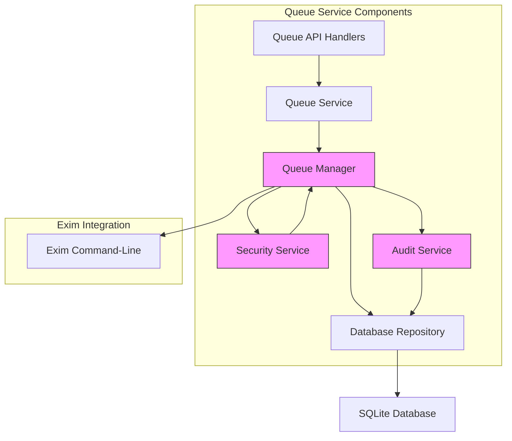
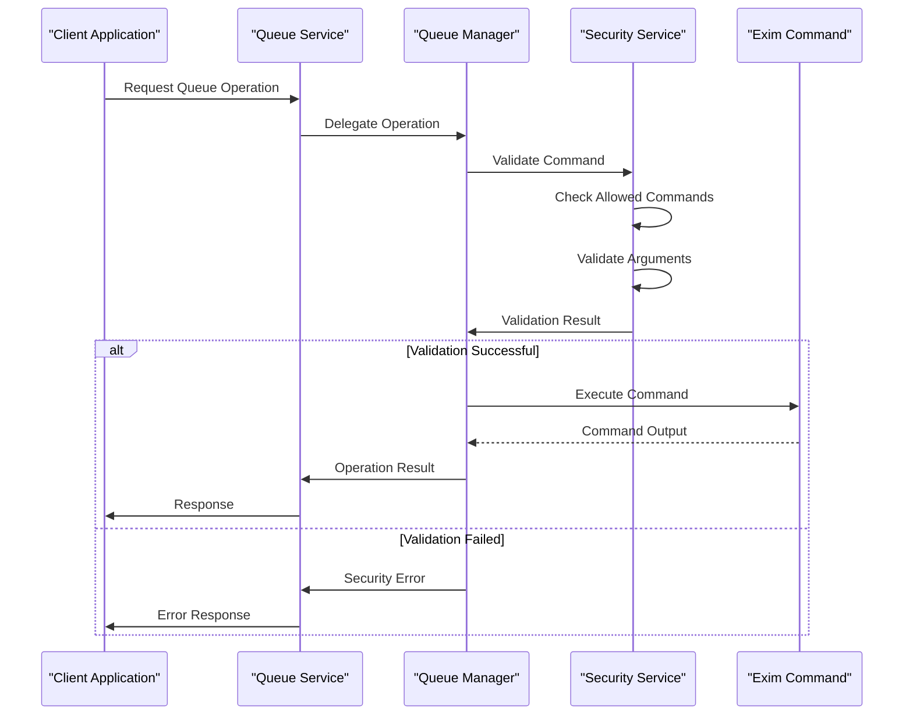
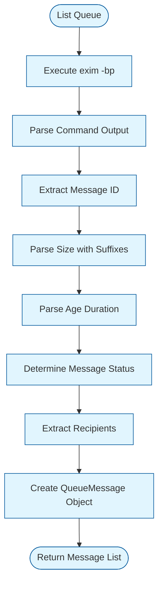
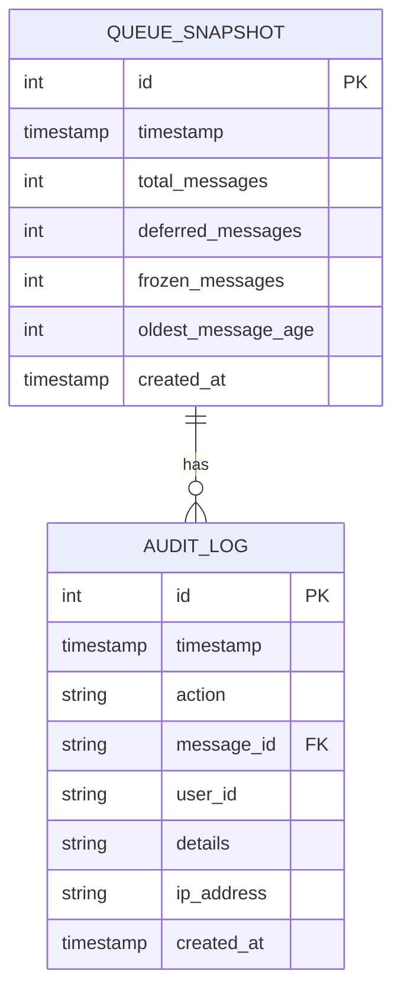
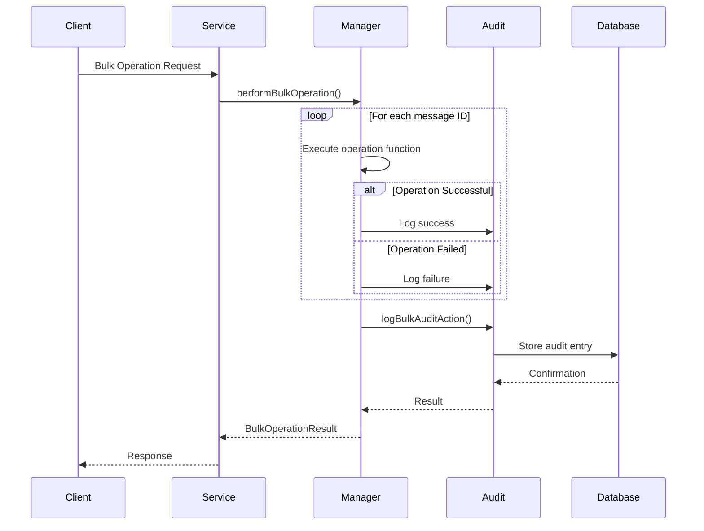
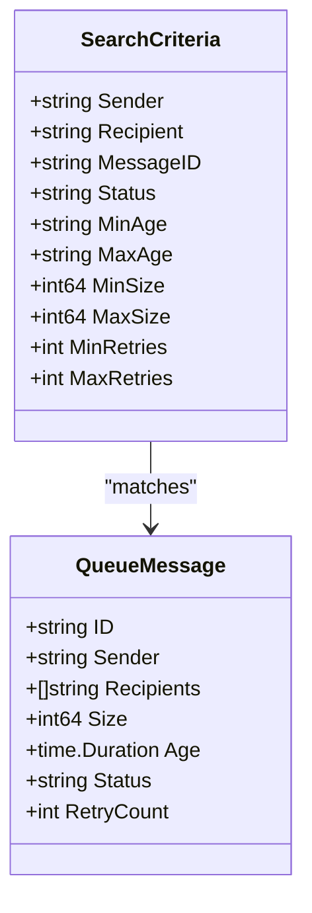
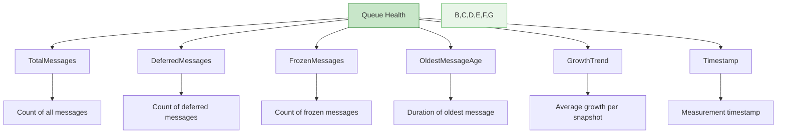
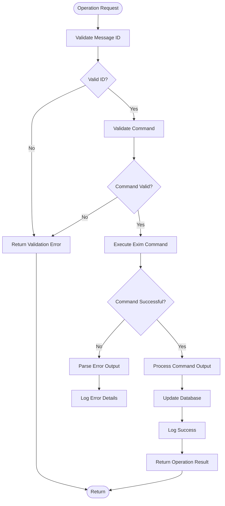

# Queue Service


## Table of Contents
1. [Introduction](#introduction)
2. [Queue Service Architecture](#queue-service-architecture)
3. [Command Execution and Security](#command-execution-and-security)
4. [Queue Inspection and Message Status Detection](#queue-inspection-and-message-status-detection)
5. [Database Integration and Persistent Tracking](#database-integration-and-persistent-tracking)
6. [Bulk Operations and Audit Logging](#bulk-operations-and-audit-logging)
7. [Search and Filtering Mechanism](#search-and-filtering-mechanism)
8. [Health Monitoring and Statistics](#health-monitoring-and-statistics)
9. [Error Handling and Validation](#error-handling-and-validation)
10. [Usage Examples](#usage-examples)

## Introduction
The Queue Service provides a secure and reliable interface for managing the Exim mail queue. It abstracts low-level Exim command execution, provides comprehensive audit logging, and maintains persistent tracking of queue state through database integration. The service enables safe execution of critical operations such as message delivery, freezing, thawing, and deletion while ensuring proper security validation and error handling.

## Queue Service Architecture





**Diagram sources**
- [service.go](file://internal/queue/service.go#L1-L312)
- [queue.go](file://internal/queue/queue.go#L1-L398)
- [security.go](file://internal/security/service.go#L1-L425)

**Section sources**
- [service.go](file://internal/queue/service.go#L1-L312)
- [queue.go](file://internal/queue/queue.go#L1-L398)

## Command Execution and Security

The Queue Service implements a robust security framework to ensure safe execution of Exim commands. All command execution is mediated through the Manager component, which performs comprehensive validation before executing any system commands.





The security validation process includes:

- **Command Whitelisting**: Only specific Exim commands are allowed (`exim`, `exim4`, `/usr/sbin/exim`, `/usr/sbin/exim4`)
- **Argument Validation**: Each command argument is validated to prevent injection attacks
- **Privilege Checking**: The process must not run with root privileges
- **Path Validation**: File access is restricted to allowed Exim directories

**Section sources**
- [security.go](file://internal/security/service.go#L321-L362)
- [queue.go](file://internal/queue/queue.go#L200-L397)

## Queue Inspection and Message Status Detection

The Queue Service provides comprehensive inspection capabilities for messages in the Exim queue. It parses command output to extract detailed message information and determine message status.

### Message Parsing Process





The service parses various Exim command outputs:

- **`exim -bp`**: Lists queue contents and extracts message IDs, sizes, ages, senders, and recipients
- **`exim -Mvh`**: Retrieves message headers for detailed inspection
- **`exim -Mvb`**: Retrieves message body content
- **`exim -Mvl`**: Retrieves message-specific log entries

Message size parsing supports common suffixes:
- **K**: Kilobytes (×1024)
- **M**: Megabytes (×1024²)
- **G**: Gigabytes (×1024³)
- **T**: Terabytes (×1024⁴)

**Section sources**
- [queue.go](file://internal/queue/queue.go#L200-L397)
- [example_test.go](file://internal/queue/example_test.go#L46-L68)

## Database Integration and Persistent Tracking

The Queue Service integrates with the database to provide persistent tracking of queue state and operations. This enables historical analysis, audit logging, and health monitoring.

### Queue Snapshot Model





The service creates periodic snapshots of the queue state, storing key metrics:

- **TotalMessages**: Total number of messages in the queue
- **DeferredMessages**: Messages that have been deferred
- **FrozenMessages**: Messages that have been frozen
- **OldestMessageAge**: Age of the oldest message in seconds


```go
// Example of queue snapshot creation
func (m *Manager) CreateSnapshot() (*database.QueueSnapshot, error) {
	status, err := m.ListQueue()
	if err != nil {
		return nil, fmt.Errorf("failed to get queue status: %w", err)
	}

	snapshot := &database.QueueSnapshot{
		Timestamp:        time.Now(),
		TotalMessages:    status.TotalMessages,
		DeferredMessages: status.DeferredMessages,
		FrozenMessages:   status.FrozenMessages,
		CreatedAt:        time.Now(),
	}

	// Convert oldest message age to seconds
	if status.OldestMessageAge > 0 {
		ageSeconds := int(status.OldestMessageAge.Seconds())
		snapshot.OldestMessageAge = &ageSeconds
	}

	// Save snapshot to database
	repo := database.NewRepository(m.db)
	err = repo.CreateQueueSnapshot(snapshot)
	if err != nil {
		return nil, fmt.Errorf("failed to save queue snapshot: %w", err)
	}

	return snapshot, nil
}
```


**Diagram sources**
- [models.go](file://internal/database/models.go#L1-L341)
- [repository.go](file://internal/database/repository.go#L490-L689)

**Section sources**
- [queue.go](file://internal/queue/queue.go#L200-L397)
- [models.go](file://internal/database/models.go#L1-L341)

## Bulk Operations and Audit Logging

The Queue Service provides bulk operation capabilities for managing multiple messages efficiently. All operations are logged in the audit trail for security and compliance.

### Bulk Operation Flow





The bulk operation system uses a flexible pattern:


```go
// performBulkOperation is a helper function for bulk operations
func (m *Manager) performBulkOperation(
	messageIDs []string,
	operation string,
	userID string,
	ipAddress string,
	operationFunc func(string, string, string) (*OperationResult, error),
) (*BulkOperationResult, error) {

	bulkResult := &BulkOperationResult{
		TotalMessages: len(messageIDs),
		Operation:     operation,
		Results:       make([]OperationResult, 0, len(messageIDs)),
	}

	// Perform operation on each message
	for _, messageID := range messageIDs {
		result, err := operationFunc(messageID, userID, ipAddress)
		if err != nil {
			result = &OperationResult{
				Success:   false,
				MessageID: messageID,
				Operation: operation,
				Error:     err.Error(),
			}
		}

		bulkResult.Results = append(bulkResult.Results, *result)

		if result.Success {
			bulkResult.SuccessfulCount++
		} else {
			bulkResult.FailedCount++
		}
	}

	// Log bulk operation in audit trail
	if err := m.logBulkAuditAction(operation, messageIDs, userID, ipAddress, bulkResult); err != nil {
		fmt.Printf("Failed to log bulk audit action: %v\n", err)
	}

	return bulkResult, nil
}
```


Audit logs include detailed information about operations:

- **Single operations**: Logged with action type, message ID, success status, and error details
- **Bulk operations**: Logged with message ID lists, success/failure counts, and error summaries

**Section sources**
- [operations.go](file://internal/queue/operations.go#L200-L433)
- [service.go](file://internal/queue/service.go#L1-L312)

## Search and Filtering Mechanism

The Queue Service provides flexible search capabilities to help users find specific messages in the queue based on various criteria.

### Search Criteria Structure





The search functionality supports filtering by:

- **Sender**: Case-insensitive partial match on sender address
- **Recipient**: Case-insensitive partial match on any recipient address
- **Message ID**: Case-insensitive partial match on message ID
- **Status**: Exact match on message status
- **Size**: Range filtering (minimum and maximum size in bytes)
- **Retries**: Range filtering on retry count
- **Age**: Range filtering (requires parsing age strings to durations)


```go
// matchesCriteria checks if a message matches the search criteria
func (s *Service) matchesCriteria(msg *QueueMessage, criteria *SearchCriteria) bool {
	if criteria.Sender != "" && !contains(msg.Sender, criteria.Sender) {
		return false
	}

	if criteria.Recipient != "" {
		found := false
		for _, recipient := range msg.Recipients {
			if contains(recipient, criteria.Recipient) {
				found = true
				break
			}
		}
		if !found {
			return false
		}
	}

	if criteria.MessageID != "" && !contains(msg.ID, criteria.MessageID) {
		return false
	}

	if criteria.Status != "" && msg.Status != criteria.Status {
		return false
	}

	if criteria.MinSize > 0 && msg.Size < criteria.MinSize {
		return false
	}

	if criteria.MaxSize > 0 && msg.Size > criteria.MaxSize {
		return false
	}

	if criteria.MinRetries > 0 && msg.RetryCount < criteria.MinRetries {
		return false
	}

	if criteria.MaxRetries > 0 && msg.RetryCount > criteria.MaxRetries {
		return false
	}

	return true
}
```


**Section sources**
- [service.go](file://internal/queue/service.go#L93-L292)
- [queue.go](file://internal/queue/queue.go#L200-L397)

## Health Monitoring and Statistics

The Queue Service provides comprehensive health monitoring and statistical analysis of the mail queue.

### Queue Health Metrics





The service calculates key health indicators:

- **Growth Trend**: Average change in queue size over recent snapshots
- **Message Distribution**: Breakdown by status and size categories
- **Age Analysis**: Identification of stale messages


```go
// GetQueueHealth returns queue health metrics
func (s *Service) GetQueueHealth() (*QueueHealth, error) {
	status, err := s.manager.ListQueue()
	if err != nil {
		return nil, fmt.Errorf("failed to get queue status: %w", err)
	}

	health := &QueueHealth{
		TotalMessages:    status.TotalMessages,
		DeferredMessages: status.DeferredMessages,
		FrozenMessages:   status.FrozenMessages,
		OldestMessageAge: status.OldestMessageAge,
		Timestamp:        time.Now(),
	}

	// Calculate growth trend by comparing with recent snapshots
	repo := database.NewQueueSnapshotRepository(s.db)
	recent, err := repo.List(5, 0, nil, nil) // Get last 5 snapshots
	if err == nil && len(recent) > 1 {
		// Calculate average growth over recent snapshots
		var totalGrowth int
		for i := 0; i < len(recent)-1; i++ {
			growth := recent[i].TotalMessages - recent[i+1].TotalMessages
			totalGrowth += growth
		}
		health.GrowthTrend = totalGrowth / (len(recent) - 1)
	}

	return health, nil
}
```


**Section sources**
- [service.go](file://internal/queue/service.go#L46-L93)
- [models.go](file://internal/database/models.go#L1-L341)

## Error Handling and Validation

The Queue Service implements comprehensive error handling and validation to ensure reliability and security.

### Validation and Error Handling Flow





Key validation and error handling features:

- **Message ID Validation**: Ensures message IDs are not empty and meet basic format requirements
- **Command Validation**: Uses security service to validate commands and arguments
- **Error Parsing**: Captures and returns detailed error information
- **Graceful Degradation**: Continues operation when non-critical errors occur (e.g., missing log files)


```go
// ValidateMessageID checks if a message ID is valid format
func (m *Manager) ValidateMessageID(messageID string) error {
	if messageID == "" {
		return fmt.Errorf("message ID cannot be empty")
	}

	// Basic validation for Exim message ID format
	// Exim message IDs are typically in format: XXXXXX-XXXXXX-XX
	if len(messageID) < 10 {
		return fmt.Errorf("message ID too short: %s", messageID)
	}

	// Additional validation could be added here
	return nil
}
```


**Section sources**
- [operations.go](file://internal/queue/operations.go#L400-L433)
- [security.go](file://internal/security/service.go#L1-L425)

## Usage Examples

The Queue Service provides a clean API for common operations, as demonstrated in the example test file.

### Size Parsing Example


```go
func ExampleSizeParsing() {
	manager := &Manager{}

	testSizes := map[string]int64{
		"123":  123,
		"456K": 456 * 1024,
		"2M":   2 * 1024 * 1024,
		"1G":   1024 * 1024 * 1024,
	}

	for sizeStr, expected := range testSizes {
		parsed, err := manager.parseSize(sizeStr)
		if err != nil {
			panic("Failed to parse size: " + sizeStr)
		}
		if parsed != expected {
			panic("Size mismatch")
		}
	}
}
```


### Common Operations


```go
// Deliver a message immediately
result, err := queueService.DeliverNow("1a2b3c-4d5e6f-7g", "admin", "192.168.1.100")

// Freeze a message
result, err := queueService.FreezeMessage("1a2b3c-4d5e6f-7g", "admin", "192.168.1.100")

// Thaw a frozen message
result, err := queueService.ThawMessage("1a2b3c-4d5e6f-7g", "admin", "192.168.1.100")

// Delete a message
result, err := queueService.DeleteMessage("1a2b3c-4d5e6f-7g", "admin", "192.168.1.100")

// Bulk operations
messageIDs := []string{"1a2b3c-4d5e6f-7g", "8h9i10-11j12k-13l"}
bulkResult, err := queueService.BulkFreeze(messageIDs, "admin", "192.168.1.100")

// Search messages
criteria := &SearchCriteria{
    Sender:    "user@example.com",
    MinSize:   1024 * 1024, // 1MB
    Status:    "frozen",
}
messages, err := queueService.SearchQueueMessages(criteria)
```


**Section sources**
- [example_test.go](file://internal/queue/example_test.go#L46-L68)
- [operations.go](file://internal/queue/operations.go#L200-L433)

**Referenced Files in This Document**   
- [queue.go](file://internal/queue/queue.go#L1-L398)
- [operations.go](file://internal/queue/operations.go#L1-L433)
- [service.go](file://internal/queue/service.go#L1-L312)
- [models.go](file://internal/database/models.go#L1-L341)
- [repository.go](file://internal/database/repository.go#L490-L689)
- [security.go](file://internal/security/service.go#L1-L425)
- [example_test.go](file://internal/queue/example_test.go#L1-L68)