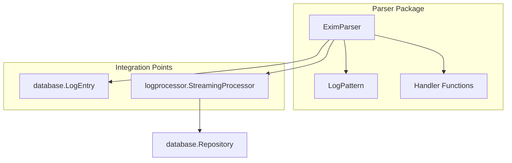
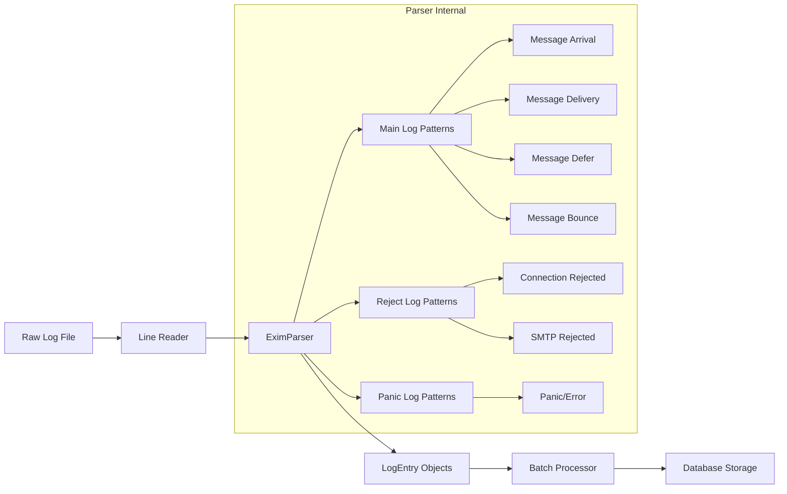
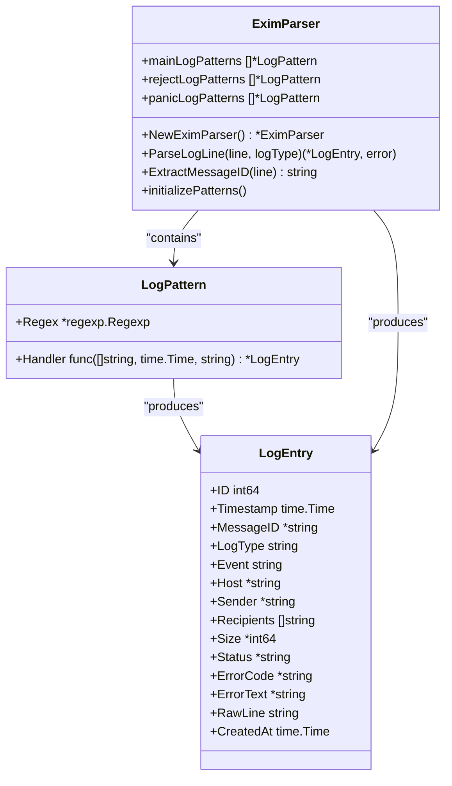
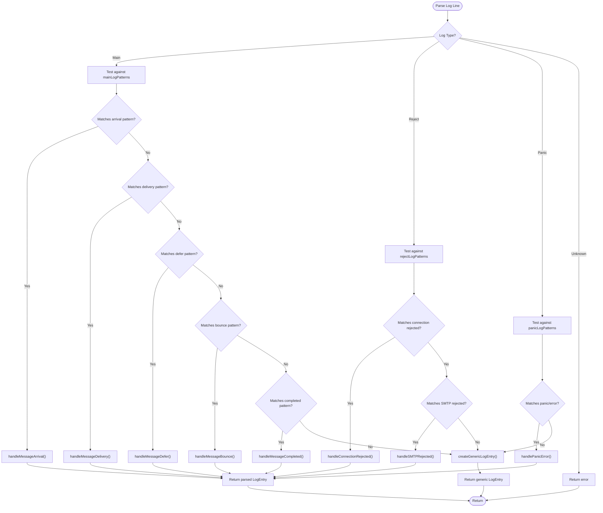
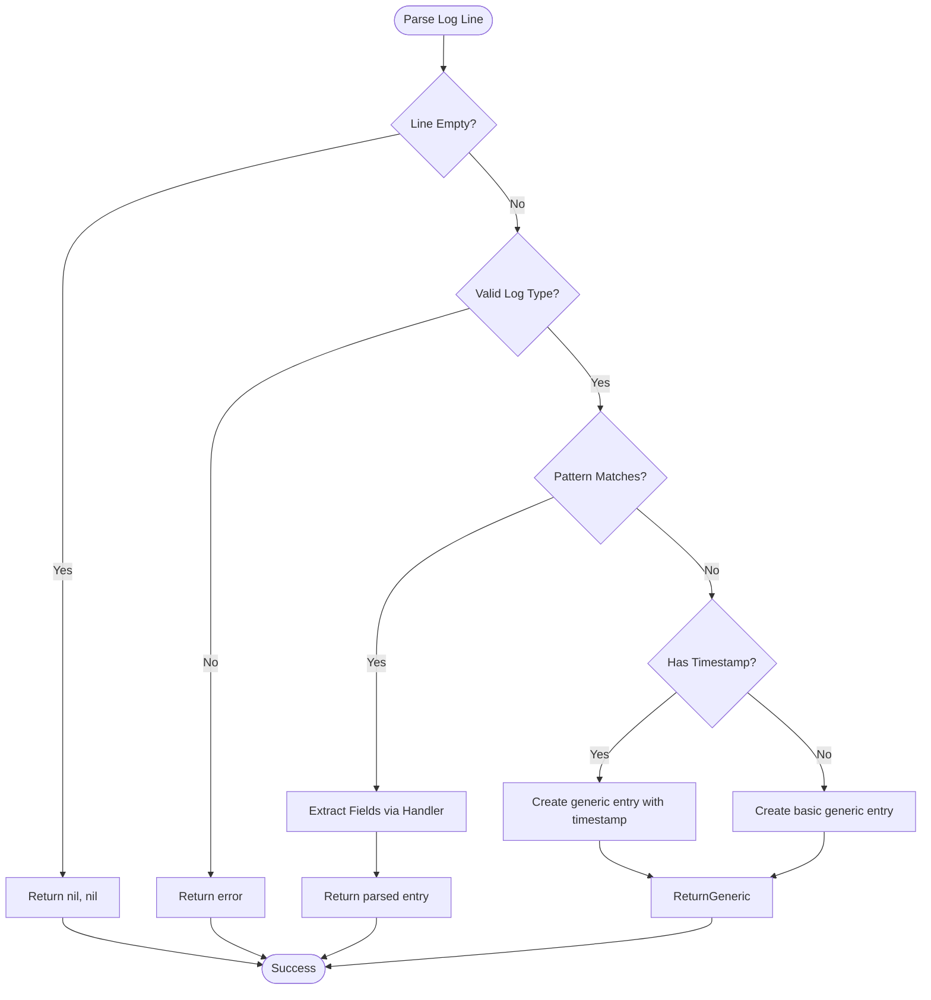
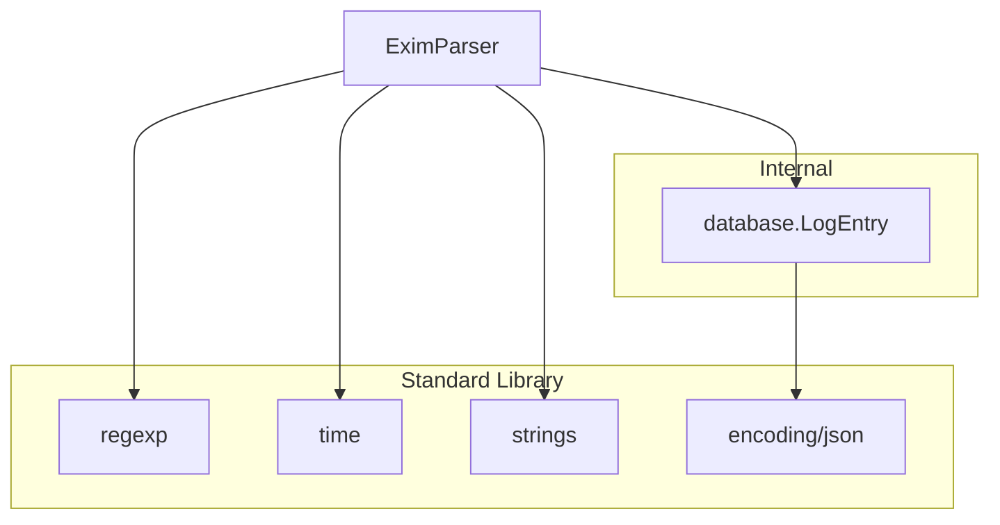

# Log Parser Service


## Table of Contents
1. [Introduction](#introduction)
2. [Project Structure](#project-structure)
3. [Core Components](#core-components)
4. [Architecture Overview](#architecture-overview)
5. [Detailed Component Analysis](#detailed-component-analysis)
6. [Dependency Analysis](#dependency-analysis)
7. [Performance Considerations](#performance-considerations)
8. [Troubleshooting Guide](#troubleshooting-guide)
9. [Conclusion](#conclusion)

## Introduction
The Log Parser Service is responsible for processing raw Exim mail server log entries and transforming them into structured data for analysis, monitoring, and reporting. This service parses various log formats including delivery, rejection, and defer events, extracting key information such as message ID, sender, recipient, timestamp, and error details. The parsed data is then passed to downstream components for correlation and storage. The parser handles malformed entries gracefully and supports multiple log types with specialized regular expression patterns.

## Project Structure
The parser component is located within the internal/parser package and consists of two primary files: exim_parser.go containing the main parsing logic, and exim_parser_test.go providing comprehensive test coverage. The parser integrates with the database package for data modeling and the logprocessor package for batch processing and correlation.





**Diagram sources**
- [exim_parser.go](file://internal/parser/exim_parser.go#L1-L300)
- [models.go](file://internal/database/models.go#L70-L86)
- [streaming.go](file://internal/logprocessor/streaming.go#L1-L416)

**Section sources**
- [exim_parser.go](file://internal/parser/exim_parser.go#L1-L50)
- [models.go](file://internal/database/models.go#L1-L50)

## Core Components
The core component of the log parsing system is the EximParser struct, which maintains compiled regular expression patterns for different log types and dispatches parsing to specialized handler functions. The parser extracts structured data from raw log lines and populates LogEntry objects that conform to the database schema. Each log entry contains metadata about the parsing process and the original raw line for reference.

**Section sources**
- [exim_parser.go](file://internal/parser/exim_parser.go#L13-L18)
- [models.go](file://internal/database/models.go#L70-L86)

## Architecture Overview
The log parsing architecture follows a pipeline pattern where raw log lines are processed through multiple stages: reading, parsing, batching, and storage. The EximParser operates as a stateless service that can be integrated into various processing workflows. It supports three main log types (main, reject, panic) with dedicated pattern sets for each type, enabling accurate parsing of different log formats.





**Diagram sources**
- [exim_parser.go](file://internal/parser/exim_parser.go#L25-L150)
- [streaming.go](file://internal/logprocessor/streaming.go#L1-L100)

## Detailed Component Analysis

### EximParser Analysis
The EximParser struct is the central component responsible for parsing Exim log entries. It maintains separate collections of LogPattern objects for different log types (main, reject, panic). Each LogPattern contains a compiled regular expression and a handler function that processes matched log lines. The parser follows a strategy pattern where different log formats are handled by specialized functions based on pattern matching.

#### Class Diagram




**Diagram sources**
- [exim_parser.go](file://internal/parser/exim_parser.go#L13-L300)
- [models.go](file://internal/database/models.go#L70-L86)

### Parsing Logic Analysis
The parsing logic is implemented through a series of regular expression patterns that match different Exim log formats. When a log line is processed, the parser attempts to match it against patterns in the appropriate log type category. Upon successful match, the corresponding handler function extracts specific fields and creates a structured LogEntry object.

#### Sequence Diagram

```mermaid
sequenceDiagram
participant Client as "Log Processing System"
participant Parser as "EximParser"
participant Pattern as "LogPattern"
participant Handler as "Handler Function"
participant Entry as "LogEntry"
Client->>Parser : ParseLogLine(line, logType)
Parser->>Parser : Select pattern set by logType
loop All Patterns
Parser->>Pattern : Try Regex.Match(line)
alt Pattern Matches
Pattern-->>Parser : Return matches
Parser->>Parser : Parse timestamp from matches[1]
Parser->>Handler : Call Handler(matches, timestamp, line)
Handler->>Entry : Create LogEntry with extracted data
Handler-->>Parser : Return LogEntry
Parser-->>Client : Return LogEntry, nil
break
end
end
alt No Pattern Matches
Parser->>Parser : Create generic LogEntry
Parser-->>Client : Return generic entry, nil
end
```


**Diagram sources**
- [exim_parser.go](file://internal/parser/exim_parser.go#L100-L150)
- [exim_parser.go](file://internal/parser/exim_parser.go#L163-L280)

### Log Pattern Types
The parser supports multiple log pattern types, each designed to handle specific Exim log formats. The main log patterns capture message arrival, delivery, deferral, bounce, and completion events. Reject log patterns handle connection and SMTP rejections, while panic log patterns capture system errors and panic messages.

#### Flowchart




**Diagram sources**
- [exim_parser.go](file://internal/parser/exim_parser.go#L25-L150)
- [exim_parser.go](file://internal/parser/exim_parser.go#L163-L280)

### Message Field Extraction
The parser extracts key fields from log entries using regular expression capture groups. For delivery events, it captures the message ID, recipient address, router, transport, host, and IP address. For rejection events, it captures the IP address and rejection reason. The parser also extracts message size and error codes where available.

**Section sources**
- [exim_parser.go](file://internal/parser/exim_parser.go#L40-L150)
- [exim_parser_test.go](file://internal/parser/exim_parser_test.go#L20-L80)

### Complex Log Line Examples
The parser handles complex log lines with various formats and edge cases. Below are examples of real log entries and how they are transformed:

**Message Arrival Example:**
- Raw: `2024-01-15 10:30:45 1rABCD-123456-78 <= sender@example.com H=mail.example.com [192.168.1.1] P=esmtp S=1234`
- Parsed: 

```json
{
  "message_id": "1rABCD-123456-78",
  "event": "arrival",
  "sender": "sender@example.com",
  "host": "mail.example.com",
  "size": 1234,
  "status": "received"
}
```


**Message Deferral Example:**
- Raw: `2024-01-15 10:31:00 1rABCD-123456-78 == recipient@example.com R=dnslookup T=remote_smtp defer (-1): Connection refused`
- Parsed:

```json
{
  "message_id": "1rABCD-123456-78",
  "event": "defer",
  "recipients": ["recipient@example.com"],
  "status": "deferred",
  "error_code": "-1",
  "error_text": "Connection refused"
}
```


**Connection Rejection Example:**
- Raw: `2024-01-15 10:30:45 rejected connection from [192.168.1.100]: (tcp wrappers)`
- Parsed:

```json
{
  "event": "reject",
  "host": "192.168.1.100",
  "status": "rejected",
  "error_text": "(tcp wrappers)"
}
```


**Section sources**
- [exim_parser.go](file://internal/parser/exim_parser.go#L40-L150)
- [exim_parser_test.go](file://internal/parser/exim_parser_test.go#L20-L80)

### Error Handling and Malformed Entries
The parser includes robust error handling for malformed log entries. Empty lines are gracefully handled and return nil results. Unknown log types produce an error. When no pattern matches a log line, the parser creates a generic LogEntry with only the timestamp (if extractable) and raw line preserved. This ensures that no log data is lost, even if it cannot be fully parsed.





**Diagram sources**
- [exim_parser.go](file://internal/parser/exim_parser.go#L100-L150)
- [exim_parser.go](file://internal/parser/exim_parser.go#L280-L300)

**Section sources**
- [exim_parser.go](file://internal/parser/exim_parser.go#L100-L150)
- [exim_parser.go](file://internal/parser/exim_parser.go#L280-L300)

## Dependency Analysis
The parser component has minimal dependencies, primarily relying on the standard library's regexp and time packages. It depends on the database package for the LogEntry data structure but maintains loose coupling through pointer fields and optional values. The parser is designed to be stateless and reusable across different processing contexts.





**Diagram sources**
- [exim_parser.go](file://internal/parser/exim_parser.go#L1-L20)
- [models.go](file://internal/database/models.go#L1-L20)

**Section sources**
- [exim_parser.go](file://internal/parser/exim_parser.go#L1-L50)
- [models.go](file://internal/database/models.go#L1-L50)

## Performance Considerations
The parser is optimized for performance through the use of pre-compiled regular expressions and efficient string processing. The initializePatterns method compiles all regex patterns at initialization time, avoiding compilation overhead during parsing. The parser processes log lines sequentially and can be integrated into concurrent processing pipelines through the StreamingProcessor. Memory usage is minimized by reusing string references and avoiding unnecessary allocations.

**Section sources**
- [exim_parser.go](file://internal/parser/exim_parser.go#L25-L50)
- [streaming.go](file://internal/logprocessor/streaming.go#L1-L100)

## Troubleshooting Guide
When troubleshooting parsing issues, consider the following:

1. **Pattern Mismatch**: Verify that the log line format matches one of the defined patterns. The parser uses strict regex matching and may not handle variations in log formatting.

2. **Timestamp Parsing**: Ensure timestamps are in the expected format (YYYY-MM-DD HH:MM:SS). The parser uses Go's time.Parse with "2006-01-02 15:04:05" layout.

3. **Log Type Configuration**: Confirm the correct logType parameter is passed to ParseLogLine (main, reject, or panic).

4. **Message ID Format**: Exim message IDs follow the pattern XXXXXX-XXXXXX-XX (6-6-2 alphanumeric characters). The ExtractMessageID method can be used to verify ID extraction.

5. **Empty Results**: Empty lines return nil results, which is expected behavior. Check for leading/trailing whitespace.

**Section sources**
- [exim_parser.go](file://internal/parser/exim_parser.go#L100-L150)
- [exim_parser.go](file://internal/parser/exim_parser.go#L280-L300)
- [exim_parser_test.go](file://internal/parser/exim_parser_test.go#L1-L191)

## Conclusion
The Log Parser Service provides a robust and extensible solution for parsing Exim mail server logs. Its modular design with separate pattern sets for different log types enables accurate extraction of message metadata, delivery events, and error conditions. The parser handles edge cases gracefully and integrates seamlessly with the broader log processing pipeline. By transforming unstructured log data into structured LogEntry objects, it enables advanced analysis, correlation, and reporting capabilities within the Exim-Pilot system.

**Referenced Files in This Document**   
- [exim_parser.go](file://internal/parser/exim_parser.go#L1-L300)
- [exim_parser_test.go](file://internal/parser/exim_parser_test.go#L1-L191)
- [models.go](file://internal/database/models.go#L70-L86)
- [streaming.go](file://internal/logprocessor/streaming.go#L1-L416)