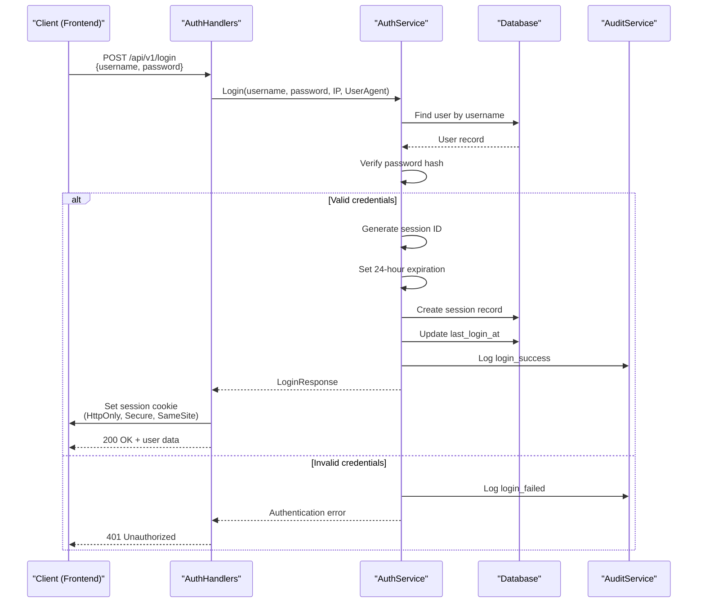
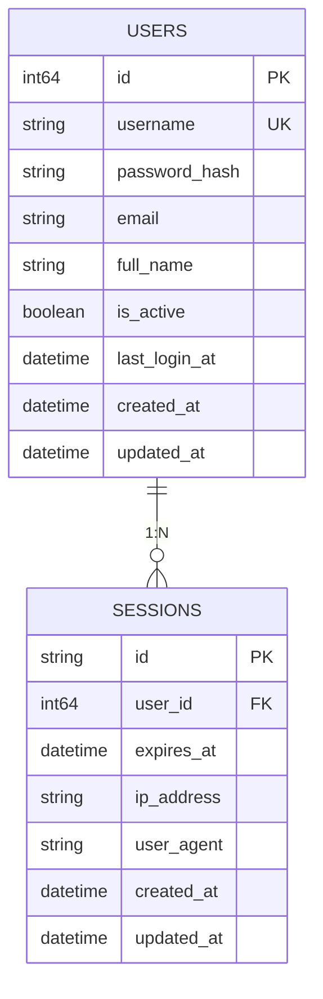

# Authentication Service


## Table of Contents
1. [Authentication Flow](#authentication-flow)
2. [Credential Verification Mechanism](#credential-verification-mechanism)
3. [Session Management and Token Generation](#session-management-and-token-generation)
4. [API Middleware Integration](#api-middleware-integration)
5. [Security Practices](#security-practices)
6. [Audit Logging Integration](#audit-logging-integration)
7. [Data Models](#data-models)

## Authentication Flow

The authentication flow in the Exim-Pilot system follows a standard web-based session authentication pattern. When a user attempts to log in, the frontend sends a POST request to the `/api/v1/login` endpoint with username and password credentials. The backend processes this request through a series of validation, verification, and session creation steps.





**Diagram sources**
- [internal/api/auth_handlers.go](file://internal/api/auth_handlers.go#L48-L100)
- [internal/auth/service.go](file://internal/auth/service.go#L44-L86)

**Section sources**
- [internal/api/auth_handlers.go](file://internal/api/auth_handlers.go#L48-L100)
- [internal/auth/service.go](file://internal/auth/service.go#L44-L86)

## Credential Verification Mechanism

The system uses bcrypt for secure password hashing and verification. When a user attempts to log in, the provided password is compared against the stored hash using Go's `bcrypt.CompareHashAndPassword` function.

The `Login` method in the authentication service retrieves the user record from the database by username and then performs the password verification:


```go
if err := bcrypt.CompareHashAndPassword([]byte(user.PasswordHash), []byte(password)); err != nil {
    // Log failed login attempt
    return nil, fmt.Errorf("invalid credentials")
}
```


This approach ensures that plaintext passwords are never stored in the system. The bcrypt algorithm provides built-in salting and is designed to be computationally expensive, protecting against brute force attacks.

**Section sources**
- [internal/auth/service.go](file://internal/auth/service.go#L44-L86)

## Session Management and Token Generation

Upon successful authentication, the system creates a server-side session and returns a session identifier to the client via an HTTP cookie. The session management system uses a dedicated `sessions` table in the database to store session state.

### Session Creation
- A cryptographically secure session ID is generated
- Session has a 24-hour expiration period
- Session record includes user ID, expiration time, IP address, and user agent
- Session is stored in the database with a foreign key reference to the user

### Session Cookie
The session ID is sent to the client as an HTTP cookie with the following security attributes:
- **HttpOnly**: Prevents access via JavaScript (mitigates XSS)
- **Secure**: Only sent over HTTPS connections
- **SameSite**: Set to Strict mode to prevent CSRF attacks
- **Path**: Root path ("/") for application-wide availability


```go
cookie := &http.Cookie{
    Name:     "session_id",
    Value:    loginResp.SessionID,
    Expires:  loginResp.ExpiresAt,
    HttpOnly: true,
    Secure:   r.TLS != nil,
    SameSite: http.SameSiteStrictMode,
    Path:     "/",
}
```


**Section sources**
- [internal/auth/service.go](file://internal/auth/service.go#L44-L86)
- [internal/api/auth_handlers.go](file://internal/api/auth_handlers.go#L48-L100)

## API Middleware Integration

The authentication system integrates with API middleware to protect endpoints and manage session state throughout the request lifecycle.

### Authentication Middleware
The system uses context-based authentication where the authenticated user is stored in the request context after successful session validation. The middleware chain processes requests in the following order:

1. CORS handling
2. Security headers
3. Request logging (if enabled)
4. Error handling
5. Content-type setting
6. Input validation
7. Audit logging
8. Authentication

The `GetUserFromContext` and `SetUserInContext` functions manage the user object in the request context:


```go
func GetUserFromContext(ctx context.Context) (*database.User, bool) {
    user, ok := ctx.Value(userContextKey).(*database.User)
    return user, ok
}
```


Protected endpoints can retrieve the authenticated user from the context, enabling personalized responses and authorization checks.

**Section sources**
- [internal/api/middleware.go](file://internal/api/middleware.go#L99-L142)
- [internal/api/server.go](file://internal/api/server.go#L50-L92)

## Security Practices

The authentication system implements multiple security measures to protect against common vulnerabilities.

### Password Security
- Passwords are hashed using bcrypt with appropriate computational cost
- Password hashes are stored in the database, never plaintext passwords
- The `PasswordHash` field is excluded from JSON serialization

### Session Security
- Session IDs are cryptographically secure
- Sessions expire after 24 hours of inactivity
- Session data is stored server-side, not in client cookies
- Session cookies use HttpOnly, Secure, and SameSite attributes

### Web Vulnerability Protection
The system implements security headers middleware that applies the following protections:

- **X-Content-Type-Options**: Prevents MIME type sniffing
- **X-Frame-Options**: Protects against clickjacking
- **X-XSS-Protection**: Enables browser XSS protection
- **Strict-Transport-Security**: Enforces HTTPS (when TLS is enabled)

Additionally, the system uses:
- Input validation middleware to prevent injection attacks
- CSRF protection via SameSite cookie attribute
- Rate limiting considerations through audit logging

**Section sources**
- [internal/api/server.go](file://internal/api/server.go#L50-L92)
- [internal/api/auth_handlers.go](file://internal/api/auth_handlers.go#L48-L100)
- [internal/auth/service.go](file://internal/auth/service.go#L44-L86)

## Audit Logging Integration

The authentication service is tightly integrated with the audit logging system to track all authentication events for security monitoring and compliance.

### Logged Events
The system logs both successful and failed authentication attempts:

- **login_success**: Logged when authentication succeeds
- **login_failed**: Logged when authentication fails

### Audit Data
For each authentication event, the system logs:
- **Action type**: Success or failure
- **Username**: The attempted username
- **User ID**: For successful logins
- **IP address**: Client IP address
- **User agent**: Client browser/device information
- **Session ID**: For successful logins
- **Failure reason**: For failed attempts (e.g., "invalid_password")

The audit service provides a dedicated method for logging authentication events:


```go
func (s *Service) LogAuthentication(ctx context.Context, action ActionType, username string, auditCtx *AuditContext, success bool, errorMsg string) error {
    details := &AuditDetails{
        Parameters: map[string]interface{}{
            "username": username,
        },
        Result: "success",
    }

    if !success {
        details.Result = "failure"
        details.ErrorMessage = errorMsg
    }

    return s.LogAction(ctx, action, nil, auditCtx, details)
}
```


This integration enables security teams to monitor for suspicious activity such as brute force attacks or unauthorized access attempts.

**Section sources**
- [internal/audit/service.go](file://internal/audit/service.go#L156-L206)
- [internal/auth/service.go](file://internal/auth/service.go#L44-L86)

## Data Models

The authentication system relies on several key data models defined in the database layer.

### User Model
The `User` struct represents a system user with authentication credentials:


```go
type User struct {
    ID           int64      `json:"id" db:"id"`
    Username     string     `json:"username" db:"username"`
    PasswordHash string     `json:"-" db:"password_hash"`
    Email        *string    `json:"email" db:"email"`
    FullName     *string    `json:"full_name" db:"full_name"`
    IsActive     bool       `json:"is_active" db:"active"`
    LastLoginAt  *time.Time `json:"last_login_at" db:"last_login"`
    CreatedAt    time.Time  `json:"created_at" db:"created_at"`
    UpdatedAt    time.Time  `json:"updated_at" db:"updated_at"`
}
```


### Session Model
The `Session` struct manages active user sessions:


```go
type Session struct {
    ID        string    `json:"id" db:"id"`
    UserID    int64     `json:"user_id" db:"user_id"`
    ExpiresAt time.Time `json:"expires_at" db:"expires_at"`
    IPAddress *string   `json:"ip_address" db:"ip_address"`
    UserAgent *string   `json:"user_agent" db:"user_agent"`
    CreatedAt time.Time `json:"created_at" db:"created_at"`
    UpdatedAt time.Time `json:"updated_at" db:"updated_at"`
}
```


### Request/Response Models
The system uses dedicated models for authentication requests and responses:


```go
type LoginRequest struct {
    Username string `json:"username" validate:"required"`
    Password string `json:"password" validate:"required"`
}

type LoginResponse struct {
    User      User      `json:"user"`
    SessionID string    `json:"session_id"`
    ExpiresAt time.Time `json:"expires_at"`
}
```


These models ensure type safety and proper data validation throughout the authentication process.





**Diagram sources**
- [internal/database/schema.go](file://internal/database/schema.go#L150-L195)
- [internal/database/models.go](file://internal/database/models.go#L305-L326)

**Section sources**
- [internal/database/models.go](file://internal/database/models.go#L305-L332)
- [internal/database/schema.go](file://internal/database/schema.go#L150-L195)

**Referenced Files in This Document**   
- [internal/auth/service.go](file://internal/auth/service.go)
- [internal/database/schema.go](file://internal/database/schema.go)
- [internal/database/models.go](file://internal/database/models.go)
- [internal/api/auth_handlers.go](file://internal/api/auth_handlers.go)
- [internal/api/middleware.go](file://internal/api/middleware.go)
- [internal/api/server.go](file://internal/api/server.go)
- [internal/audit/service.go](file://internal/audit/service.go)