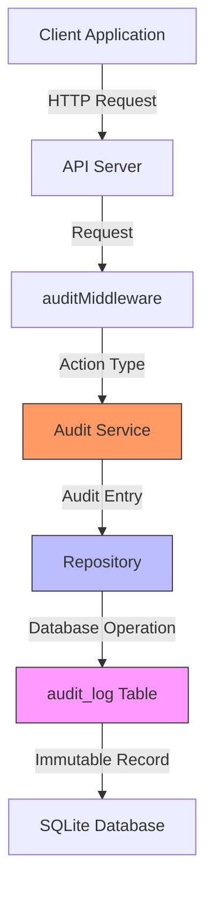
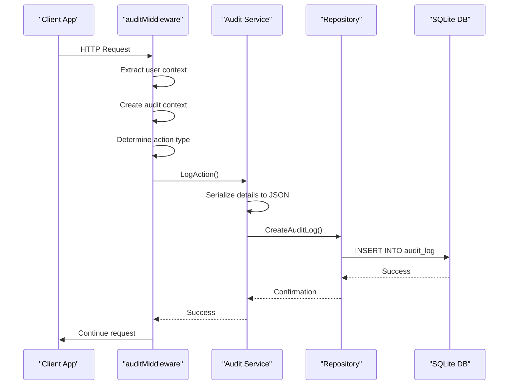
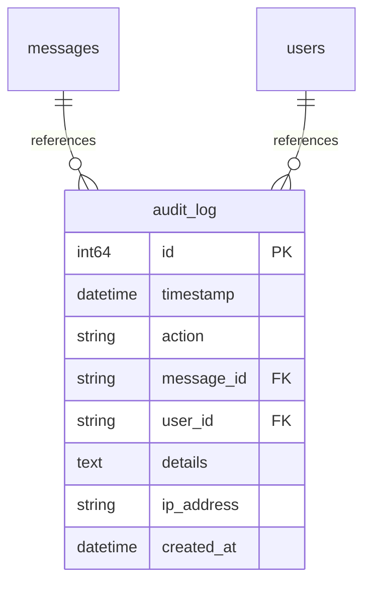
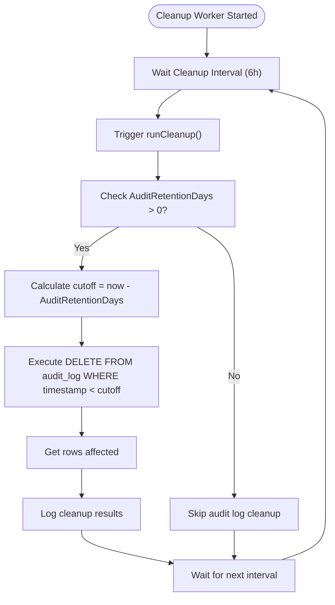
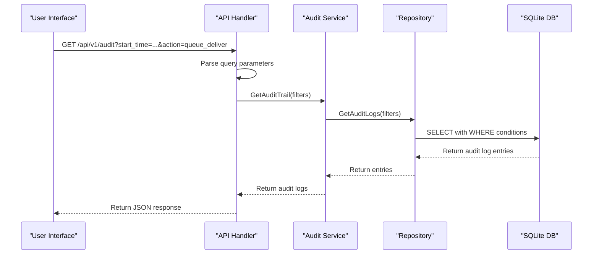

# Audit Service


## Table of Contents
1. [Introduction](#introduction)
2. [Audit Trail Design](#audit-trail-design)
3. [Event Types Captured](#event-types-captured)
4. [Audit Entry Generation](#audit-entry-generation)
5. [Data Storage and Protection](#data-storage-and-protection)
6. [Data Retention Approach](#data-retention-approach)
7. [Querying Capabilities](#querying-capabilities)
8. [Audit Log Examples](#audit-log-examples)
9. [Integrity and Security](#integrity-and-security)

## Introduction
The Audit Service in Exim-Pilot provides a comprehensive system for recording administrative actions and system events. This documentation details the audit trail design, event types captured, data retention policies, and querying capabilities. The system ensures complete traceability of all administrative operations, providing critical functionality for compliance, security monitoring, and troubleshooting.

## Audit Trail Design

The audit trail system is designed to provide immutable records of all administrative actions within the Exim-Pilot system. The design follows a layered architecture with clear separation of concerns between service logic, data access, and event generation.





**Diagram sources**
- [service.go](file://internal/audit/service.go#L1-L300)
- [repository.go](file://internal/database/repository.go#L1-L600)
- [middleware.go](file://internal/api/middleware.go#L1-L400)

**Section sources**
- [service.go](file://internal/audit/service.go#L1-L300)
- [repository.go](file://internal/database/repository.go#L1-L600)

## Event Types Captured

The audit system captures a comprehensive range of administrative actions and system events, categorized into several key types:

### Queue Operations
The system logs all queue management operations, providing complete traceability of message handling:

- **Individual message operations**:
  - `queue_deliver`: Message delivery initiated
  - `queue_freeze`: Message frozen in queue
  - `queue_thaw`: Message thawed from frozen state
  - `queue_delete`: Message removed from queue

- **Bulk operations**:
  - `bulk_deliver`: Bulk delivery of multiple messages
  - `bulk_freeze`: Bulk freezing of messages
  - `bulk_thaw`: Bulk thawing of messages
  - `bulk_delete`: Bulk deletion of messages

### Configuration Changes
All system configuration modifications are recorded:

- `config_change`: System configuration updates
- `system_access`: Access to system-level resources
- `note_create`: Creation of message notes
- `note_update`: Modification of existing notes
- `note_delete`: Removal of message notes
- `tag_create`: Addition of tags to messages
- `tag_delete`: Removal of tags from messages

### Authentication Events
User authentication activities are fully audited:

- `login`: Successful or failed login attempts
- `logout`: User logout actions
- `session_timeout`: Automatic session expiration

### Log Access and Message Operations
Access to sensitive information is monitored:

- `message_view`: Viewing message details
- `message_content`: Accessing message content
- `system_access`: Access to system resources and endpoints


```mermaid
classDiagram
class ActionType {
<<enumeration>>
queue_deliver
queue_freeze
queue_thaw
queue_delete
bulk_deliver
bulk_freeze
bulk_thaw
bulk_delete
login
logout
message_view
message_content
note_create
note_update
note_delete
tag_create
tag_delete
config_change
system_access
}
class AuditContext {
+UserID string
+IPAddress string
+UserAgent string
+RequestID string
}
class AuditDetails {
+MessageIDs[] string
+Recipients[] string
+Operation string
+Parameters map[string]interface{}
+Result string
+ErrorMessage string
+Duration time.Duration
+ResourcePath string
+PreviousValue interface{}
+NewValue interface{}
}
class AuditLog {
+ID int64
+Timestamp time.Time
+Action string
+MessageID *string
+UserID *string
+Details *string
+IPAddress *string
+CreatedAt time.Time
}
AuditContext --> AuditLog : "included in"
AuditDetails --> AuditLog : "serialized to"
ActionType --> AuditLog : "determines"
```


**Diagram sources**
- [service.go](file://internal/audit/service.go#L25-L150)
- [models.go](file://internal/database/models.go#L200-L250)

**Section sources**
- [service.go](file://internal/audit/service.go#L25-L150)

## Audit Entry Generation

Audit entries are automatically generated through service calls triggered by the API middleware layer. The system uses a proactive approach to capture events at the point of request processing.

### Middleware Integration
The audit system is integrated into the API request flow through the `auditMiddleware`, which intercepts requests and generates audit entries:





**Diagram sources**
- [middleware.go](file://internal/api/middleware.go#L250-L350)
- [service.go](file://internal/audit/service.go#L150-L200)

**Section sources**
- [middleware.go](file://internal/api/middleware.go#L250-L350)

### Action Determination Logic
The system uses a comprehensive set of rules to determine the appropriate audit action based on the request path and method:

- **Queue operations**: POST requests to `/api/v1/queue/{id}/deliver`, `/api/v1/queue/{id}/freeze`, etc.
- **Authentication**: POST requests to `/api/v1/auth/login` and `/api/v1/auth/logout`
- **Message operations**: GET requests to `/api/v1/messages/{id}/content`, POST/PUT/DELETE requests to `/api/v1/messages/{id}/notes` and `/api/v1/messages/{id}/tags`
- **System access**: Any access to protected endpoints

The middleware extracts relevant context information including user ID, IP address, user agent, and request ID to provide comprehensive audit trail information.

## Data Storage and Protection

Audit entries are stored in a dedicated database table with specific design considerations for integrity and performance.

### Database Schema
The audit log data is stored in the `audit_log` table with the following structure:


```sql
CREATE TABLE IF NOT EXISTS audit_log (
    id INTEGER PRIMARY KEY AUTOINCREMENT,
    timestamp DATETIME DEFAULT CURRENT_TIMESTAMP,
    action TEXT NOT NULL,
    message_id TEXT,
    user_id TEXT,
    details TEXT, -- JSON
    ip_address TEXT,
    created_at DATETIME DEFAULT CURRENT_TIMESTAMP
);
```


The schema includes indexes to optimize query performance:


```sql
CREATE INDEX IF NOT EXISTS idx_audit_log_timestamp ON audit_log(timestamp);
CREATE INDEX IF NOT EXISTS idx_audit_log_action ON audit_log(action);
CREATE INDEX IF NOT EXISTS idx_audit_log_message_id ON audit_log(message_id);
CREATE INDEX IF NOT EXISTS idx_audit_log_user_id ON audit_log(user_id);
CREATE INDEX IF NOT EXISTS idx_audit_log_timestamp_action ON audit_log(timestamp, action);
```





**Diagram sources**
- [schema.go](file://internal/database/schema.go#L100-L120)
- [models.go](file://internal/database/models.go#L200-L220)

**Section sources**
- [schema.go](file://internal/database/schema.go#L100-L120)

### Data Protection Measures
The system implements several measures to protect audit data from tampering:

1. **Immutable design**: Audit entries are only created, never updated or deleted through normal application operations
2. **Database constraints**: The table structure prevents modification of existing entries
3. **Separate repository methods**: The `CreateAuditLog` method in the repository layer only provides creation functionality
4. **System logging**: Critical audit events are also written to the system log for redundancy

The `LogAction` method in the audit service ensures that entries are written to both the database and system logs:


```go
func (s *Service) LogAction(ctx context.Context, action ActionType, messageID *string, auditCtx *AuditContext, details *AuditDetails) error {
    // Serialize details to JSON
    var detailsJSON *string
    if details != nil {
        detailsBytes, err := json.Marshal(details)
        if err != nil {
            log.Printf("Failed to marshal audit details: %v", err)
        } else {
            detailsStr := string(detailsBytes)
            detailsJSON = &detailsStr
        }
    }

    // Create audit log entry
    auditEntry := &database.AuditLog{
        Timestamp: time.Now().UTC(),
        Action:    string(action),
        MessageID: messageID,
        UserID:    &auditCtx.UserID,
        Details:   detailsJSON,
        IPAddress: &auditCtx.IPAddress,
        CreatedAt: time.Now().UTC(),
    }

    // Store in database (immutable - no updates allowed)
    err := s.repository.CreateAuditLog(auditEntry)
    if err != nil {
        log.Printf("Failed to create audit log entry: %v", err)
        return fmt.Errorf("failed to create audit log entry: %w", err)
    }

    // Log to system log as well for redundancy
    s.logToSystemLog(action, messageID, auditCtx, details)

    return nil
}
```


**Section sources**
- [service.go](file://internal/audit/service.go#L150-L200)
- [repository.go](file://internal/database/repository.go#L100-L150)

## Data Retention Approach

The system implements a configurable data retention policy for audit logs, balancing compliance requirements with storage efficiency.

### Retention Configuration
Retention policies are configured in the application configuration file with default values optimized for compliance:


```yaml
retention:
  log_entries_days: 90
  audit_log_days: 365
  queue_snapshots_days: 30
  delivery_attempt_days: 180
  cleanup_interval: 24
```


The default audit log retention period is 365 days, providing a full year of historical data for compliance and investigation purposes.

### Automated Cleanup Process
The system uses a background service to perform periodic cleanup of expired audit logs:





**Diagram sources**
- [background_service.go](file://internal/logprocessor/background_service.go#L150-L250)
- [config.go](file://internal/config/config.go#L150-L200)

**Section sources**
- [background_service.go](file://internal/logprocessor/background_service.go#L150-L250)

The cleanup process runs periodically (default every 6 hours) and removes audit logs older than the configured retention period. The process is designed to be efficient and non-disruptive to normal system operations.

## Querying Capabilities

The audit system provides robust querying capabilities for compliance reporting and troubleshooting.

### Filter Options
The `GetAuditTrail` method supports multiple filtering options to facilitate targeted searches:

- **Time range filtering**: Start and end timestamps to narrow results to specific periods
- **User filtering**: Filter by specific user ID to track individual user activities
- **Action type filtering**: Filter by specific action types (e.g., all queue operations)
- **Message ID filtering**: Filter by specific message ID to track actions on particular messages
- **IP address filtering**: Filter by IP address to investigate activities from specific sources
- **Pagination**: Limit and offset parameters for handling large result sets


```go
type AuditFilters struct {
    StartTime *time.Time
    EndTime   *time.Time
    UserID    *string
    Action    *string
    MessageID *string
    IPAddress *string
    Limit     int
    Offset    int
}
```


### Query Implementation
The querying functionality is implemented through the audit service and repository layers:





**Diagram sources**
- [service.go](file://internal/audit/service.go#L250-L280)
- [repository.go](file://internal/database/repository.go#L150-L200)

**Section sources**
- [service.go](file://internal/audit/service.go#L250-L280)

The repository implementation constructs SQL queries based on the provided filters, applying appropriate WHERE conditions and pagination to efficiently retrieve the requested data.

## Audit Log Examples

The following examples illustrate typical audit log entries for various administrative actions.

### Queue Operation Example
When a user delivers a message from the queue:


```json
{
  "id": 12345,
  "timestamp": "2023-12-01T10:30:45Z",
  "action": "queue_deliver",
  "message_id": "msg-abc123",
  "user_id": "5",
  "details": {
    "message_ids": ["msg-abc123"],
    "operation": "deliver",
    "result": "success",
    "parameters": {
      "total_messages": 1,
      "success_count": 1,
      "failure_count": 0,
      "success_rate": 1.0
    }
  },
  "ip_address": "192.168.1.100",
  "created_at": "2023-12-01T10:30:45Z"
}
```


### Bulk Operation Example
When a user performs a bulk operation on multiple messages:


```json
{
  "id": 12346,
  "timestamp": "2023-12-01T11:15:22Z",
  "action": "bulk_freeze",
  "user_id": "5",
  "details": {
    "message_ids": ["msg-abc123", "msg-def456", "msg-ghi789"],
    "operation": "freeze",
    "result": "partial_success",
    "parameters": {
      "total_messages": 3,
      "success_count": 2,
      "failure_count": 1,
      "success_rate": 0.6666666666666666,
      "errors": ["Failed to freeze message msg-ghi789: message not found"]
    },
    "error_message": "Bulk operation completed with 1 failures"
  },
  "ip_address": "192.168.1.100",
  "created_at": "2023-12-01T11:15:22Z"
}
```


### Authentication Example
When a user attempts to log in:


```json
{
  "id": 12347,
  "timestamp": "2023-12-01T09:15:33Z",
  "action": "login",
  "user_id": "anonymous",
  "details": {
    "parameters": {
      "username": "admin"
    },
    "result": "failure",
    "error_message": "Invalid credentials"
  },
  "ip_address": "203.0.113.45",
  "created_at": "2023-12-01T09:15:33Z"
}
```


### Configuration Change Example
When a system configuration is accessed:


```json
{
  "id": 12348,
  "timestamp": "2023-12-01T14:22:18Z",
  "action": "system_access",
  "user_id": "3",
  "details": {
    "resource_path": "/api/v1/config",
    "result": "success",
    "parameters": {
      "method": "GET",
      "query": ""
    }
  },
  "ip_address": "192.168.1.50",
  "created_at": "2023-12-01T14:22:18Z"
}
```


## Integrity and Security

The audit system implements multiple layers of protection to ensure the integrity and security of audit data.

### Tamper Protection
The system employs several mechanisms to prevent tampering with audit records:

1. **Immutable design**: The application code only provides methods to create audit entries, not to modify or delete them
2. **Database constraints**: The database schema prevents direct modification of audit log entries
3. **Separation of concerns**: Audit functionality is isolated in a dedicated service with limited interfaces
4. **Redundant logging**: Critical audit events are also written to system logs, providing a secondary record

### Integrity Verification
The system includes functionality for basic integrity checks:


```go
// ValidateAuditIntegrity performs basic integrity checks on audit logs
func (s *Service) ValidateAuditIntegrity(ctx context.Context) error {
    // Check for gaps in audit log sequence
    // Check for suspicious patterns
    // This is a placeholder for more sophisticated integrity checks
    return nil
}
```


This method provides a foundation for more advanced integrity verification that could include cryptographic hashing of log entries or blockchain-style chaining of records.

### Access Controls
Access to audit data is protected by the same authentication and authorization mechanisms as other system resources:

- Only authenticated users can query audit logs
- The audit middleware itself is protected by the authentication middleware
- System logs containing audit information are only accessible to system administrators
- The database file is protected by file system permissions

The combination of these measures ensures that audit data remains trustworthy and reliable for compliance and security investigations.

**Referenced Files in This Document**   
- [service.go](file://internal/audit/service.go)
- [repository.go](file://internal/database/repository.go)
- [middleware.go](file://internal/api/middleware.go)
- [config.go](file://internal/config/config.go)
- [background_service.go](file://internal/logprocessor/background_service.go)
- [schema.go](file://internal/database/schema.go)
- [models.go](file://internal/database/models.go)