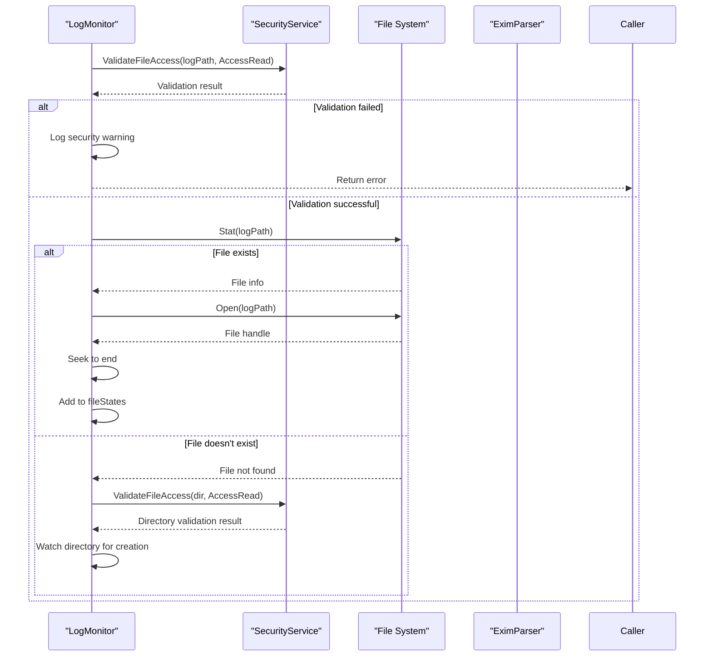

# Security Service


## Table of Contents
1. [Introduction](#introduction)
2. [Project Structure](#project-structure)
3. [Core Components](#core-components)
4. [Architecture Overview](#architecture-overview)
5. [Detailed Component Analysis](#detailed-component-analysis)
6. [Dependency Analysis](#dependency-analysis)
7. [Performance Considerations](#performance-considerations)
8. [Troubleshooting Guide](#troubleshooting-guide)
9. [Conclusion](#conclusion)

## Introduction
The Security Service in the Exim-Pilot application provides comprehensive application-level security controls to protect against common web vulnerabilities and ensure secure system operations. This document details the implementation of input validation, output encoding, file access controls, command execution validation, and integration with the API layer to enforce security policies. The service implements defense-in-depth strategies through multiple layers of protection, including secure configuration management, header hardening, and privilege management. The security architecture is designed to prevent common attack vectors such as XSS, CSRF, command injection, path traversal, and unauthorized file access while maintaining the functionality required for email queue management and log monitoring.

## Project Structure
The security implementation is organized within the internal/security package, with supporting validation services in internal/validation and security-related middleware in internal/api. The project follows a layered architecture with clear separation of concerns between security controls, business logic, and API interfaces.


**Diagram sources**
- [internal/security/service.go](file://internal/security/service.go#L1-L50)
- [internal/validation/service.go](file://internal/validation/service.go#L1-L50)
- [internal/api/middleware.go](file://internal/api/middleware.go#L1-L50)
- [internal/logmonitor/monitor.go](file://internal/logmonitor/monitor.go#L1-L50)

**Section sources**
- [internal/security/service.go](file://internal/security/service.go#L1-L50)
- [internal/validation/service.go](file://internal/validation/service.go#L1-L50)

## Core Components
The security architecture consists of two primary components: the Security Service (internal/security/service.go) and the Validation Service (internal/validation/service.go). The Security Service handles file access validation, system command validation, privilege management, and secure environment setup, while the Validation Service provides input validation for API requests, including message IDs, email addresses, IP addresses, and user input. These services are integrated throughout the application via dependency injection, with the API middleware layer applying validation rules to incoming requests and specific components like the log monitor using security checks for file operations.

**Section sources**
- [internal/security/service.go](file://internal/security/service.go#L1-L100)
- [internal/validation/service.go](file://internal/validation/service.go#L1-L100)

## Architecture Overview
The security architecture implements a defense-in-depth strategy with multiple layers of protection. At the foundation, the Security Service provides low-level protection for file system access and system command execution. Above this, the Validation Service handles application-level input validation for data processing. The API middleware layer integrates these services to protect HTTP endpoints with authentication, input validation, audit logging, and security headers. Application components like the log monitor and queue manager use the security services directly when performing sensitive operations. This layered approach ensures that security controls are applied consistently across the application, from the API interface down to system-level operations.


**Diagram sources**
- [internal/security/service.go](file://internal/security/service.go#L1-L50)
- [internal/validation/service.go](file://internal/validation/service.go#L1-L50)
- [internal/api/middleware.go](file://internal/api/middleware.go#L1-L50)

## Detailed Component Analysis

### Security Service Analysis
The Security Service (internal/security/service.go) implements comprehensive controls for file access and system command execution. It maintains allowlists and blocklists for file paths, validates file permissions, and prevents directory traversal attacks. The service also validates system commands to prevent injection attacks and provides utilities for privilege management.

#### Class Diagram for Security Service


**Diagram sources**
- [internal/security/service.go](file://internal/security/service.go#L15-L100)

**Section sources**
- [internal/security/service.go](file://internal/security/service.go#L1-L425)

### Validation Service Analysis
The Validation Service (internal/validation/service.go) provides input validation for various data types including message IDs, email addresses, IP addresses, and user input. It implements a comprehensive validation framework with specific rules for different data types and returns structured validation errors.

#### Class Diagram for Validation Service

```mermaid
classDiagram
class Service {
+int maxStringLength
+int maxArrayLength
+map[string]bool allowedOperations
+map[string]bool allowedLogTypes
+map[string]bool allowedStatuses
+ValidateMessageID(messageID string) error
+ValidateEmailAddress(email string) error
+ValidateIPAddress(ip string) error
+ValidateOperation(operation string) error
+ValidateLogType(logType string) error
+ValidateStatus(status string) error
+ValidateString(field, value string, required bool, maxLength int) error
+ValidateStringArray(field string, values []string, required bool, maxItems int) error
+ValidateInteger(field string, value int, required bool, min, max int) error
+ValidateTimeRange(startTime, endTime *time.Time) error
+ValidatePagination(page, perPage int) error
+ValidateSearchCriteria(criteria map[string]interface{}) error
+ValidateBulkRequest(operation string, messageIDs []string) error
+ValidateUserInput(input map[string]interface{}) error
+SanitizeString(input string) string
+ValidateFilePath(path string) error
}
class ValidationError {
+string Field
+string Message
+string Value
+Error() string
}
class ValidationErrors {
+[]ValidationError Errors
+Error() string
+Add(field, message, value string)
+HasErrors() bool
}
Service --> ValidationError : "returns"
Service --> ValidationErrors : "returns"
```


**Diagram sources**
- [internal/validation/service.go](file://internal/validation/service.go#L15-L100)

**Section sources**
- [internal/validation/service.go](file://internal/validation/service.go#L1-L521)

### API Security Middleware Analysis
The API security middleware (internal/api/middleware.go) implements a chain of responsibility pattern to apply security controls to HTTP requests. The middleware stack includes authentication, input validation, audit logging, and security headers, providing comprehensive protection for API endpoints.

#### Sequence Diagram for API Request Processing


**Diagram sources**
- [internal/api/middleware.go](file://internal/api/middleware.go#L1-L100)

**Section sources**
- [internal/api/middleware.go](file://internal/api/middleware.go#L1-L426)

### Log Monitor Security Integration
The Log Monitor component integrates with the Security Service to validate file access when monitoring log files. This ensures that only authorized log files can be monitored, preventing unauthorized access to system files.

#### Sequence Diagram for Log File Monitoring




**Diagram sources**
- [internal/logmonitor/monitor.go](file://internal/logmonitor/monitor.go#L1-L100)
- [internal/security/service.go](file://internal/security/service.go#L1-L50)

**Section sources**
- [internal/logmonitor/monitor.go](file://internal/logmonitor/monitor.go#L1-L200)

## Dependency Analysis
The security services are integrated throughout the application with a clear dependency hierarchy. The core Security Service has no external dependencies beyond standard libraries, making it a foundational component. The Validation Service depends only on standard Go libraries for regular expressions, networking, and email parsing. The API middleware depends on both security services as well as the audit service for logging. Application components like the log monitor depend directly on the Security Service for file access validation, while queue operations use the Validation Service for input validation. This dependency structure ensures that security controls are applied consistently while maintaining loose coupling between components.


**Diagram sources**
- [internal/security/service.go](file://internal/security/service.go#L1-L50)
- [internal/validation/service.go](file://internal/validation/service.go#L1-L50)
- [internal/api/middleware.go](file://internal/api/middleware.go#L1-L50)
- [internal/logmonitor/monitor.go](file://internal/logmonitor/monitor.go#L1-L50)

**Section sources**
- [internal/security/service.go](file://internal/security/service.go#L1-L50)
- [internal/validation/service.go](file://internal/validation/service.go#L1-L50)
- [internal/api/middleware.go](file://internal/api/middleware.go#L1-L50)

## Performance Considerations
The security implementation is designed to minimize performance overhead while maintaining robust protection. File path validation uses prefix matching against allowlists and blocklists, which is efficient even with multiple entries. Input validation is performed only once per request in the middleware layer, avoiding redundant checks. The Security Service caches path validation results implicitly through the use of cleaned and resolved paths. For high-frequency operations like log monitoring, file access validation occurs only when adding new files to monitoring, not during the continuous monitoring process. The validation service uses compiled regular expressions for pattern matching, ensuring consistent performance. Overall, the security controls add minimal overhead to request processing while providing comprehensive protection against common vulnerabilities.

## Troubleshooting Guide
When troubleshooting security-related issues, check the application logs for messages prefixed with "SECURITY" which indicate security events and validation failures. Common issues include:

1. **File access denied**: Verify that the file path is in the allowed paths list in the Security Service configuration and does not match any restricted paths.

2. **Invalid command execution**: Ensure that system commands are in the allowed commands list and that arguments do not contain dangerous characters.

3. **Input validation failures**: Check that API request parameters meet validation requirements for format, length, and allowed values.

4. **Authentication failures**: Verify that session cookies are present and valid, and that the authentication service is functioning correctly.

5. **Audit logging issues**: Confirm that the database connection is available for audit log storage.

6. **Security header missing**: Ensure that the security headers middleware is properly registered in the middleware chain.

The Security Service logs detailed information about validation failures and security events, which can be used to diagnose and resolve issues.

**Section sources**
- [internal/security/service.go](file://internal/security/service.go#L1-L50)
- [internal/validation/service.go](file://internal/validation/service.go#L1-L50)
- [internal/api/middleware.go](file://internal/api/middleware.go#L1-L50)

## Conclusion
The Security Service in Exim-Pilot provides a comprehensive, multi-layered approach to application security. By implementing strict input validation, file access controls, command execution validation, and security headers, the system protects against common web vulnerabilities while maintaining the functionality required for email queue management. The service-oriented architecture allows for consistent application of security policies across different components, from API endpoints to system-level operations. The defense-in-depth strategy ensures that even if one layer of protection is bypassed, additional controls remain in place to prevent exploitation. This security implementation provides a solid foundation for a production-ready email management system.

**Referenced Files in This Document**   
- [internal/security/service.go](file://internal/security/service.go)
- [internal/security/service_test.go](file://internal/security/service_test.go)
- [internal/validation/service.go](file://internal/validation/service.go)
- [internal/api/middleware.go](file://internal/api/middleware.go)
- [internal/logmonitor/monitor.go](file://internal/logmonitor/monitor.go)