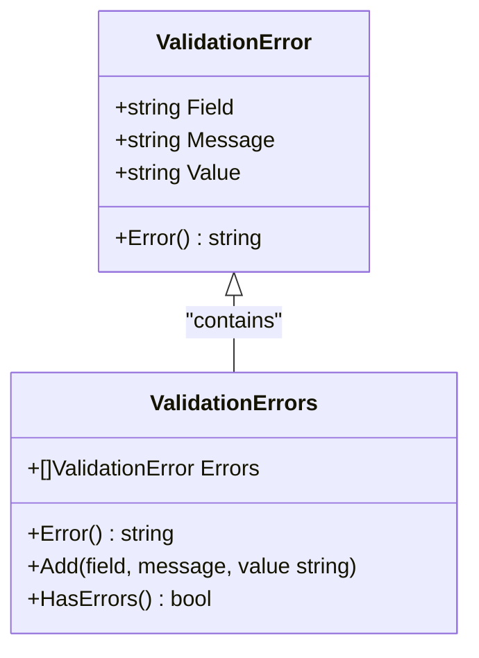
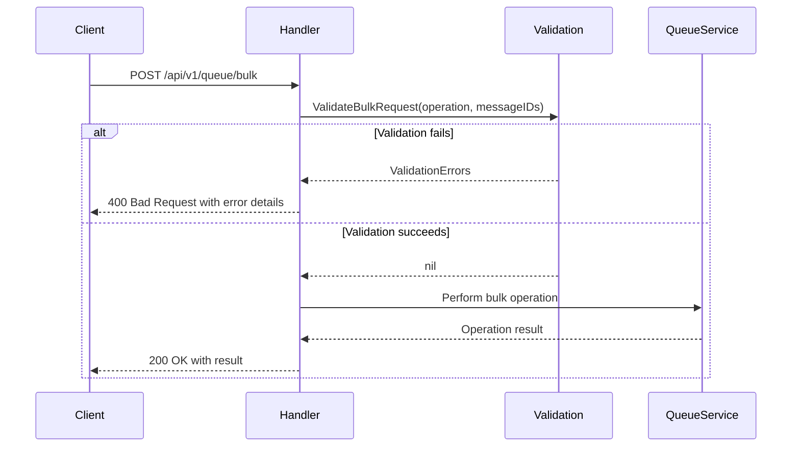

# Validation Service


## Table of Contents
1. [Introduction](#introduction)
2. [Validation Service Overview](#validation-service-overview)
3. [Core Validation Rules](#core-validation-rules)
4. [Validation Pipeline and Error Accumulation](#validation-pipeline-and-error-accumulation)
5. [Integration with API Request Processing](#integration-with-api-request-processing)
6. [Error Response Format](#error-response-format)
7. [Validation Scenarios and Examples](#validation-scenarios-and-examples)
8. [Security Considerations](#security-considerations)

## Introduction
The Validation Service in the Exim-Pilot application provides a centralized mechanism for validating input data across various components of the system. It ensures data integrity, prevents injection attacks, and enforces business rules for message queue operations, user inputs, and API requests. This document details the validation rules, pipeline architecture, error handling strategy, and integration points with the API layer.

## Validation Service Overview

The validation service is implemented as a Go struct that encapsulates various validation methods and configuration parameters. It provides a comprehensive set of validation functions for different data types and use cases within the application.


```mermaid
classDiagram
class Service {
+int maxStringLength
+int maxArrayLength
+map[string]bool allowedOperations
+map[string]bool allowedLogTypes
+map[string]bool allowedStatuses
+ValidateMessageID(messageID string) error
+ValidateEmailAddress(email string) error
+ValidateIPAddress(ip string) error
+ValidateOperation(operation string) error
+ValidateLogType(logType string) error
+ValidateStatus(status string) error
+ValidateString(field, value string, required bool, maxLength int) error
+ValidateStringArray(field string, values []string, required bool, maxItems int) error
+ValidateInteger(field string, value int, required bool, min, max int) error
+ValidateTimeRange(startTime, endTime *time.Time) error
+ValidatePagination(page, perPage int) error
+ValidateSearchCriteria(criteria map[string]interface{}) error
+ValidateBulkRequest(operation string, messageIDs []string) error
+ValidateUserInput(input map[string]interface{}) error
+ValidateFilePath(path string) error
+SanitizeString(input string) string
+containsSuspiciousContent(content string) bool
}
class ValidationError {
+string Field
+string Message
+string Value
+Error() string
}
class ValidationErrors {
+[]ValidationError Errors
+Error() string
+Add(field, message, value string)
+HasErrors() bool
}
Service --> ValidationError : "returns"
Service --> ValidationErrors : "returns"
```


**Diagram sources**
- [service.go](file://internal/validation/service.go#L23-L47)

**Section sources**
- [service.go](file://internal/validation/service.go#L1-L521)

## Core Validation Rules

### Message ID Validation
The service validates Exim message IDs according to the standard format used by the Exim mail transfer agent.

**Validation Rules:**
- Message ID is required (cannot be empty)
- Must match the pattern: `XXXXXX-YYYYYY-ZZ`
- Each segment consists of base-62 characters (0-9, A-Z, a-z)
- Total length is exactly 15 characters with two hyphens


```go
// Exim message ID format: XXXXXX-YYYYYY-ZZ
// Where X, Y are base-62 characters and Z is base-62
messageIDPattern := regexp.MustCompile(`^[0-9A-Za-z]{6}-[0-9A-Za-z]{6}-[0-9A-Za-z]{2}$`)
```


**Section sources**
- [service.go](file://internal/validation/service.go#L88-L105)

### Email Address Validation
Email validation follows RFC 5321 standards and includes both format and length checks.

**Validation Rules:**
- Email address is required (cannot be empty)
- Maximum length of 320 characters (RFC 5321 limit)
- Must be a valid email format according to `net/mail.ParseAddress`


```go
_, err := mail.ParseAddress(email)
if err != nil {
    return &ValidationError{
        Field:   "email",
        Message: "invalid email address format",
        Value:   email,
    }
}
```


**Section sources**
- [service.go](file://internal/validation/service.go#L108-L131)

### Search Query Validation
The service provides comprehensive validation for queue search criteria, ensuring that all search parameters are properly formatted and within acceptable ranges.

**Validation Rules:**
- **Sender/Recipient**: Valid email format if provided
- **Message ID**: Valid Exim message ID format if provided
- **Status**: One of the allowed status values if provided
- **Age Range**: Integer values between 0 and 31,536,000 seconds (1 year)
- **Size Range**: Integer values between 0 and 104,857,600 bytes (100MB)


```go
// Validate sender if provided
if sender, ok := criteria["sender"].(string); ok && sender != "" {
    if err := s.ValidateEmailAddress(sender); err != nil {
        errors.Add("sender", err.(*ValidationError).Message, sender)
    }
}
```


**Section sources**
- [service.go](file://internal/validation/service.go#L316-L378)

### API Input Validation
The service includes specialized validation methods for common API input patterns.

#### Pagination Validation
Ensures pagination parameters are within reasonable limits:
- Page number between 1 and 10,000
- Items per page between 1 and 1,000


```go
if err := s.ValidateInteger("page", page, false, 1, 10000); err != nil {
    errors.Add(err.(*ValidationError).Field, err.(*ValidationError).Message, err.(*ValidationError).Value)
}
```


#### Time Range Validation
Prevents excessively large time ranges and ensures logical ordering:
- Start time must be before end time
- Maximum range of 1 year (365 days)


```go
if startTime.After(*endTime) {
    return &ValidationError{
        Field:   "time_range",
        Message: "start time must be before end time",
    }
}
```


**Section sources**
- [service.go](file://internal/validation/service.go#L297-L313)
- [service.go](file://internal/validation/service.go#L275-L294)

## Validation Pipeline and Error Accumulation

The validation service implements a robust error accumulation strategy that collects multiple validation failures before returning them to the client.

### Error Type Hierarchy
The service defines two error types to handle different validation scenarios:





**Diagram sources**
- [service.go](file://internal/validation/service.go#L50-L63)

### Error Accumulation Strategy
When validating complex inputs with multiple fields, the service collects all validation errors rather than failing on the first one:


```go
func (s *Service) ValidateSearchCriteria(criteria map[string]interface{}) error {
    errors := &ValidationErrors{}
    
    // Validate multiple fields and accumulate errors
    if sender, ok := criteria["sender"].(string); ok && sender != "" {
        if err := s.ValidateEmailAddress(sender); err != nil {
            errors.Add("sender", err.(*ValidationError).Message, sender)
        }
    }
    
    // Continue validating other fields even if previous ones failed
    if recipient, ok := criteria["recipient"].(string); ok && recipient != "" {
        if err := s.ValidateEmailAddress(recipient); err != nil {
            errors.Add("recipient", err.(*ValidationError).Message, recipient)
        }
    }
    
    // Return all accumulated errors
    if errors.HasErrors() {
        return errors
    }
    
    return nil
}
```


This approach provides clients with comprehensive feedback about all validation issues in a single response, improving the user experience by eliminating the need for multiple round-trips to fix validation errors.

**Section sources**
- [service.go](file://internal/validation/service.go#L316-L378)

## Integration with API Request Processing

The validation service is integrated into the API layer through both direct method calls and middleware components.

### Direct Integration in Handlers
Specific API endpoints directly invoke validation methods when processing requests:





**Diagram sources**
- [queue_handlers.go](file://internal/api/queue_handlers.go#L260-L261)

### Middleware Integration
The service is also used in middleware to validate common parameters across multiple endpoints:


```go
func (s *Server) validationMiddleware(next http.Handler) http.Handler {
    validator := validation.NewService()
    
    return http.HandlerFunc(func(w http.ResponseWriter, r *http.Request) {
        // Validate common request parameters
        if err := s.validateCommonParams(r, validator); err != nil {
            if validationErrors, ok := err.(*validation.ValidationErrors); ok {
                response := APIResponse{
                    Success: false,
                    Error:   "Validation failed",
                    Data:    validationErrors.Errors,
                }
                WriteJSONResponse(w, http.StatusBadRequest, response)
                return
            }
            // Handle other error types
        }
        next.ServeHTTP(w, r)
    })
}
```


The middleware automatically validates:
- Pagination parameters (page, per_page)
- Message IDs in URL paths
- Other common request parameters

**Section sources**
- [middleware.go](file://internal/api/middleware.go#L158-L280)

## Error Response Format

Validation failures are communicated to clients through standardized error responses that follow the application's API response structure.

### Single Validation Error
When a single validation rule fails, the response includes specific details about the error:


```json
{
  "success": false,
  "error": "validation error for field 'message_id': invalid message ID format (expected: XXXXXX-YYYYYY-ZZ)",
  "data": null
}
```


### Multiple Validation Errors
When multiple validation rules fail, the service returns all errors in a structured format:


```json
{
  "success": false,
  "error": "Validation failed",
  "data": [
    {
      "field": "message_ids[1]",
      "message": "invalid message ID format (expected: XXXXXX-YYYYYY-ZZ)",
      "value": "invalid-id"
    },
    {
      "field": "operation",
      "message": "invalid operation (allowed: deliver, freeze, thaw, delete)",
      "value": "invalid"
    }
  ]
}
```


The response structure uses the `APIResponse` type defined in the response package:


```mermaid
classDiagram
class APIResponse {
+bool Success
+interface{} Data
+string Error
+*Meta Meta
}
class ValidationError {
+string Field
+string Message
+string Value
}
APIResponse --> ValidationError : "Data contains"
```


**Diagram sources**
- [response.go](file://internal/api/response.go#L3-L11)

**Section sources**
- [response.go](file://internal/api/response.go#L35-L65)

## Validation Scenarios and Examples

### Bulk Operation Validation
When processing bulk operations on queue messages, the service validates both the operation type and all message IDs:


```go
// Test valid bulk request
validMessageIDs := []string{"1ABC23-DEF456-GH", "123456-789ABC-DE"}
err := service.ValidateBulkRequest("deliver", validMessageIDs)
// Expected: nil (no error)

// Test invalid operation
err = service.ValidateBulkRequest("invalid", validMessageIDs)
// Expected: validation error for operation field

// Test invalid message ID in array
invalidMessageIDs := []string{"1ABC23-DEF456-GH", "invalid-id"}
err = service.ValidateBulkRequest("deliver", invalidMessageIDs)
// Expected: validation error for message_ids[1]
```


**Section sources**
- [service_test.go](file://internal/validation/service_test.go#L108-L135)

### User Input Validation
The service validates user-generated content such as notes and tags, including security checks for malicious content:


```go
input := map[string]interface{}{
    "note": "This is a normal message",
    "tag": "important",
    "color": "#FF0000",
}

err := service.ValidateUserInput(input)
// Expected: nil (no error)

// Test malicious content
maliciousInput := map[string]interface{}{
    "note": "<script>alert('xss')</script>",
}
err := service.ValidateUserInput(maliciousInput)
// Expected: validation error for note field
```


The service checks for common XSS patterns and restricts tags to alphanumeric characters, hyphens, and underscores.

**Section sources**
- [service.go](file://internal/validation/service.go#L411-L452)

## Security Considerations

The validation service includes several security-focused validation rules to prevent common web vulnerabilities.

### Input Sanitization
The service provides a sanitization method to remove potentially dangerous characters from strings:


```go
func (s *Service) SanitizeString(input string) string {
    // Remove null bytes and control characters
    sanitized := strings.ReplaceAll(input, "\x00", "")
    
    // Remove other control characters except newlines and tabs
    var result strings.Builder
    for _, r := range sanitized {
        if r >= 32 || r == '\n' || r == '\t' {
            result.WriteRune(r)
        }
    }
    
    return result.String()
}
```


### Malicious Content Detection
The service actively checks for potentially malicious content in user inputs:


```go
func (s *Service) containsSuspiciousContent(content string) bool {
    suspiciousPatterns := []string{
        "<script",
        "javascript:",
        "onload=",
        "onerror=",
        "onclick=",
        "eval(",
        "document.cookie",
        "window.location",
    }
    
    lowerContent := strings.ToLower(content)
    for _, pattern := range suspiciousPatterns {
        if strings.Contains(lowerContent, pattern) {
            return true
        }
    }
    
    return false
}
```


### File Path Validation
To prevent directory traversal attacks, the service validates file paths:


```go
func (s *Service) ValidateFilePath(path string) error {
    // Check for directory traversal attempts
    if strings.Contains(path, "..") {
        return &ValidationError{
            Field:   "file_path",
            Message: "file path contains invalid characters (..)",
            Value:   path,
        }
    }
    
    // Check for absolute paths (should be relative)
    if strings.HasPrefix(path, "/") || strings.Contains(path, ":") {
        return &ValidationError{
            Field:   "file_path",
            Message: "absolute file paths are not allowed",
            Value:   path,
        }
    }
    
    return nil
}
```


**Section sources**
- [service.go](file://internal/validation/service.go#L454-L492)

**Referenced Files in This Document**   
- [service.go](file://internal/validation/service.go)
- [service_test.go](file://internal/validation/service_test.go)
- [queue_handlers.go](file://internal/api/queue_handlers.go)
- [middleware.go](file://internal/api/middleware.go)
- [response.go](file://internal/api/response.go)