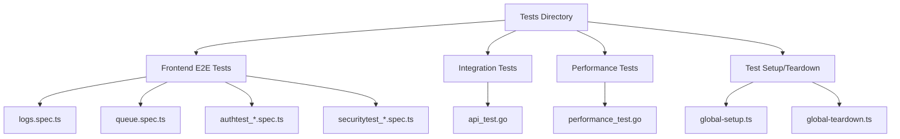
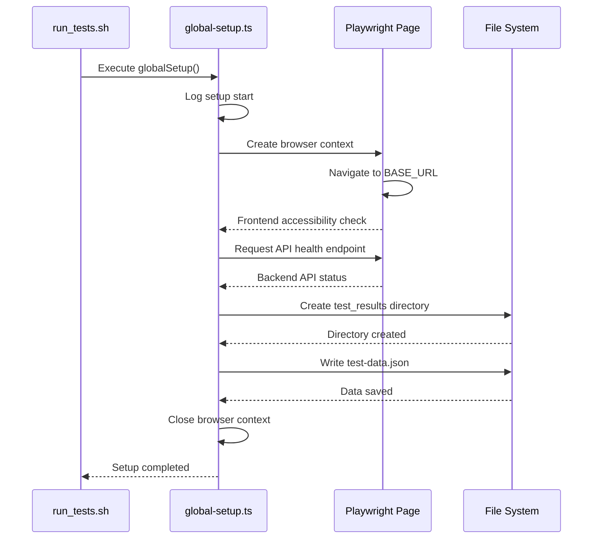
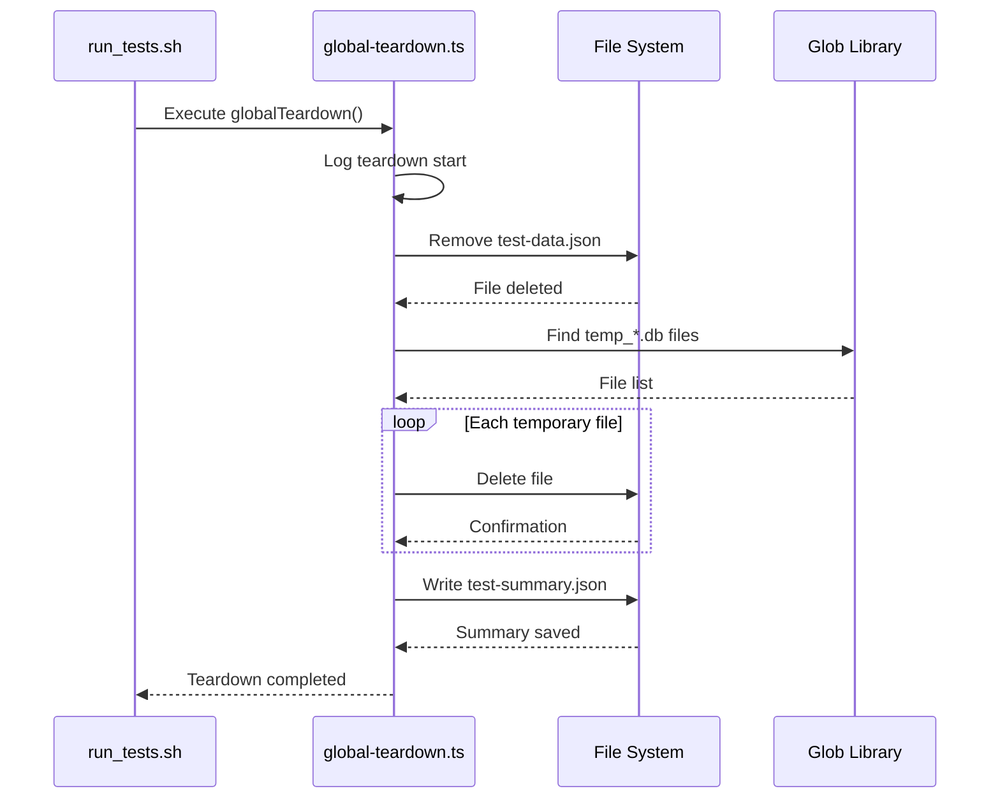
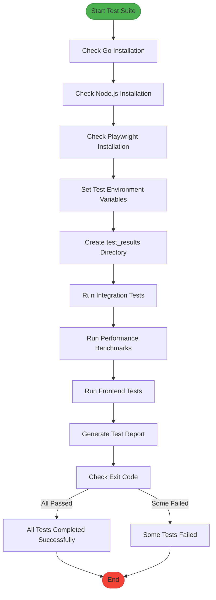

# Test Suite


## Table of Contents
1. [Test Suite Overview](#test-suite-overview)
2. [Test Categories and Organization](#test-categories-and-organization)
3. [Test Environment Lifecycle Management](#test-environment-lifecycle-management)
4. [Test Execution Orchestration](#test-execution-orchestration)
5. [Writing New Tests](#writing-new-tests)
6. [Test Data and Mocking Strategies](#test-data-and-mocking-strategies)
7. [Debugging Failed Tests](#debugging-failed-tests)
8. [Test Coverage and CI Considerations](#test-coverage-and-ci-considerations)

## Test Suite Overview

The Exim Pilot test suite is a comprehensive testing framework designed to validate the functionality, performance, and reliability of both frontend and backend components. The test infrastructure supports multiple testing categories including end-to-end (E2E) frontend tests using Playwright, integration tests for Go API endpoints, and performance benchmarks. The suite is orchestrated through a centralized shell script that ensures consistent execution across different environments.

The testing strategy emphasizes automated validation of critical user workflows, API contract compliance, and system performance under various conditions. Tests are organized into distinct directories based on their purpose and technology stack, enabling clear separation of concerns and easier maintenance.

**Section sources**
- [run_tests.sh](file://tests/run_tests.sh#L1-L254)

## Test Categories and Organization

The test suite is organized into three primary categories, each serving a specific purpose in the quality assurance process:





**Diagram sources**
- [tests/frontend/logs.spec.ts](file://tests/frontend/logs.spec.ts)
- [tests/frontend/queue.spec.ts](file://tests/frontend/queue.spec.ts)
- [tests/integration/api_test.go](file://tests/integration/api_test.go)
- [tests/performance/performance_test.go](file://tests/performance/performance_test.go)
- [tests/setup/global-setup.ts](file://tests/setup/global-setup.ts)
- [tests/setup/global-teardown.ts](file://tests/setup/global-teardown.ts)

### Frontend E2E Tests (Playwright)

The frontend tests located in `tests/frontend/` use Playwright to simulate real user interactions with the web application. These tests validate critical user journeys such as:

- Log viewer functionality and search capabilities
- Queue management operations and bulk actions
- Authentication flows and session management
- Security features and access controls

Each test file (e.g., `logs.spec.ts`, `queue.spec.ts`) contains multiple test cases that verify specific aspects of the user interface. The dynamic test files (e.g., `authtest_*.spec.ts`) suggest a pattern of generating test cases for specific authentication scenarios.

### Integration Tests (Go API)

The integration tests in `tests/integration/` validate the backend API endpoints and their interactions with the database and other services. The `api_test.go` file contains tests that verify:

- API endpoint responses and status codes
- Request validation and error handling
- Database operations and transaction integrity
- Authentication and authorization mechanisms

These tests run against a real (or mocked) backend server and ensure that the API contracts are maintained.

### Performance Tests

The performance tests in `tests/performance/` focus on measuring the system's behavior under load. The `performance_test.go` file contains benchmark tests that evaluate:

- Database query performance
- API response times under various loads
- Memory usage patterns
- Concurrent operation handling

These tests use Go's built-in benchmarking capabilities to provide quantitative performance metrics.

**Section sources**
- [tests/frontend/logs.spec.ts](file://tests/frontend/logs.spec.ts)
- [tests/frontend/queue.spec.ts](file://tests/frontend/queue.spec.ts)
- [tests/integration/api_test.go](file://tests/integration/api_test.go)
- [tests/performance/performance_test.go](file://tests/performance/performance_test.go)

## Test Environment Lifecycle Management

The test environment lifecycle is managed through dedicated setup and teardown scripts that ensure a consistent and isolated testing environment for each test run.

### Global Setup Process

The `global-setup.ts` script initializes the test environment before any tests are executed:





**Diagram sources**
- [tests/setup/global-setup.ts](file://tests/setup/global-setup.ts#L1-L91)

Key responsibilities of the global setup include:

- Verifying the accessibility of both frontend and backend services
- Creating a standardized test data configuration file (`test-data.json`)
- Setting up the necessary directory structure for test results
- Initializing any required browser contexts for Playwright tests

The setup process is designed to be resilient, with warning messages instead of failures when services are not accessible, allowing tests to proceed with mocked responses if needed.

### Global Teardown Process

The `global-teardown.ts` script cleans up the test environment after all tests have completed:





**Diagram sources**
- [tests/setup/global-teardown.ts](file://tests/setup/global-teardown.ts#L1-L70)

Key responsibilities of the global teardown include:

- Removing the test data configuration file
- Cleaning up temporary database and log files using glob patterns
- Generating a test summary with execution metadata
- Ensuring no test artifacts remain in the filesystem

The teardown process is designed to be fault-tolerant, with error handling that prevents teardown failures from masking actual test failures.

**Section sources**
- [tests/setup/global-setup.ts](file://tests/setup/global-setup.ts#L1-L91)
- [tests/setup/global-teardown.ts](file://tests/setup/global-teardown.ts#L1-L70)

## Test Execution Orchestration

The `run_tests.sh` script serves as the central orchestrator for the entire test suite, providing a unified interface for executing different categories of tests.





**Diagram sources**
- [tests/run_tests.sh](file://tests/run_tests.sh#L1-L254)

The orchestration process includes several key features:

### Environment Validation

Before executing any tests, the script validates that all required dependencies are installed:

- **Go**: Required for running integration and performance tests
- **Node.js**: Required for running frontend tests and Playwright
- **Playwright**: Installed automatically if missing

This ensures that test execution will not fail due to missing dependencies.

### Test Environment Configuration

The script sets critical environment variables for testing:

- `TEST_ENV=true`: Indicates the application is running in test mode
- `DATABASE_PATH=:memory:`: Uses an in-memory SQLite database for isolation
- `LOG_LEVEL=error`: Reduces log output during testing

### Modular Execution

The script supports running specific test categories through command-line arguments:

- `./tests/run_tests.sh integration`: Runs only integration tests
- `./tests/run_tests.sh performance`: Runs only performance benchmarks
- `./tests/run_tests.sh frontend`: Runs only frontend tests
- `./tests/run_tests.sh all`: Runs all test categories (default)

### Comprehensive Reporting

After test execution, the script generates a detailed test report in `test_results/test_summary.md` that includes:

- Execution date and environment information
- Version details for Go and Node.js
- Summary of test categories and their purpose
- Performance benchmark results
- Frontend test results
- Recommendations for optimization

The script also provides colored output for different log levels and emoji indicators for test status, making it easy to interpret results.

**Section sources**
- [tests/run_tests.sh](file://tests/run_tests.sh#L1-L254)

## Writing New Tests

### Frontend Tests (Playwright)

To create a new Playwright test, follow these steps:

1. Create a new `.spec.ts` file in the `tests/frontend/` directory
2. Import required Playwright modules
3. Define test suite using `test.describe()`
4. Implement individual test cases using `test()`

Example template:

```typescript
import { test, expect } from '@playwright/test';

test.describe('New Feature Tests', () => {
  test.beforeEach(async ({ page }) => {
    // Setup code that runs before each test
    await page.goto('/new-feature');
  });

  test('should display feature correctly', async ({ page }) => {
    // Test implementation
    await expect(page.locator('h1')).toHaveText('New Feature');
  });

  test('should handle user interaction', async ({ page }) => {
    // Test user interaction
    await page.click('#action-button');
    await expect(page.locator('.success-message')).toBeVisible();
  });
});
```


Best practices:
- Use descriptive test names
- Isolate test state
- Use appropriate Playwright locators
- Include meaningful assertions
- Handle asynchronous operations properly

### Backend Tests (Go)

To create a new Go integration test:

1. Create a new `_test.go` file in the `tests/integration/` directory
2. Import required testing packages
3. Write test functions with names starting with `Test`
4. Use Go's testing package for assertions

Example template:

```go
package integration

import (
    "net/http"
    "net/http/httptest"
    "testing"
)

func TestNewEndpoint(t *testing.T) {
    // Setup test server
    server := httptest.NewServer(yourHandler)
    defer server.Close()

    // Make test request
    resp, err := http.Get(server.URL + "/new-endpoint")
    if err != nil {
        t.Fatal("Request failed:", err)
    }
    defer resp.Body.Close()

    // Verify response
    if resp.StatusCode != http.StatusOK {
        t.Errorf("Expected status 200, got %d", resp.StatusCode)
    }
}
```


Best practices:
- Use table-driven tests for multiple scenarios
- Clean up resources in `defer` statements
- Test both success and error cases
- Use appropriate test data
- Follow Go testing conventions

**Section sources**
- [tests/frontend/logs.spec.ts](file://tests/frontend/logs.spec.ts)
- [tests/integration/api_test.go](file://tests/integration/api_test.go)

## Test Data and Mocking Strategies

### Test Data Management

The test suite employs several strategies for managing test data:

1. **Configuration Files**: The `global-setup.ts` script creates a `test-data.json` file containing standardized test data such as:
   - Test user credentials
   - Expected data volumes (e.g., queueMessages: 150)
   - User counts for scalability testing

2. **In-Memory Database**: The `DATABASE_PATH=:memory:` environment variable ensures tests use an in-memory SQLite database, providing:
   - Complete isolation between test runs
   - Fast database operations
   - Automatic cleanup after tests complete

3. **Temporary Files**: Tests that require file I/O use the `test_results/` directory with temporary file patterns (`temp_*.db`, `temp_*.log`) that are cleaned up during teardown.

### Mocking Strategies

The test suite implements flexible mocking based on service availability:

1. **Conditional Mocking**: The `global-setup.ts` script checks service accessibility and automatically switches to mocked responses when services are not available:
   
```typescript
   try {
     await page.goto(baseURL);
     console.log('✅ Frontend server is accessible');
   } catch (error) {
     console.warn('⚠️  Frontend server not accessible, tests will use mocked responses');
   }
   ```


2. **API Mocking**: When the backend API is not accessible, tests can use Playwright's request interception to mock API responses:
   
```typescript
   await page.route('**/api/v1/data', route => {
     route.fulfill({
       status: 200,
       body: JSON.stringify(mockData),
     });
   });
   ```


3. **Environment-Based Configuration**: The test environment can be configured through environment variables to control mocking behavior:
   - `START_BACKEND=true`: Start the backend server during setup
   - `BASE_URL`: Override the frontend URL for testing
   - `API_URL`: Override the API endpoint for integration tests

These strategies ensure that tests can run in various environments, from local development to CI/CD pipelines, with appropriate levels of isolation and reliability.

**Section sources**
- [tests/setup/global-setup.ts](file://tests/setup/global-setup.ts#L1-L91)
- [tests/setup/global-teardown.ts](file://tests/setup/global-teardown.ts#L1-L70)
- [tests/run_tests.sh](file://tests/run_tests.sh#L1-L254)

## Debugging Failed Tests

### Frontend Test Debugging

When Playwright tests fail, use the following debugging approaches:

1. **HTML Reporter**: The `run_tests.sh` script uses the HTML reporter (`--reporter=html`), which generates an interactive report at `playwright-report/` containing:
   - Screenshots for each test step
   - Video recordings of test execution
   - Console logs and network requests
   - Detailed error messages

2. **Debug Mode**: Run tests in debug mode:
   
```bash
   npx playwright test --debug
   ```

   This opens the Playwright Inspector for step-by-step debugging.

3. **Trace Viewer**: Generate and analyze trace files:
   
```typescript
   // In playwright.config.ts
   use: {
     trace: 'retain-on-failure',
   }
   ```

   Then view traces with:
   
```bash
   npx playwright show-trace
   ```


### Backend Test Debugging

For Go test failures:

1. **Verbose Output**: The `run_tests.sh` script uses `-v` flag for verbose output, showing detailed test execution:
   
```bash
   go test -v ./tests/integration/... 
   ```


2. **Benchmark Analysis**: Performance test results are saved to `test_results/benchmarks/go_benchmarks.txt` with detailed memory and timing information.

3. **Logging**: Increase log level by modifying `LOG_LEVEL` environment variable in `run_tests.sh`.

### General Debugging Tips

1. **Isolate the Problem**: Run specific test files or test cases:
   
```bash
   ./tests/run_tests.sh frontend  # Run only frontend tests
   npx playwright test logs.spec.ts  # Run specific test file
   ```


2. **Check Dependencies**: Verify all required tools are installed:
   
```bash
   go version
   node --version
   npx playwright --version
   ```


3. **Review Test Data**: Examine the generated test data in `test_results/test-data.json` and `test_results/test-summary.json`.

4. **Clean Environment**: Ensure a clean test environment by removing temporary files:
   
```bash
   rm -rf test_results/
   ```


5. **Check Service Status**: Verify that required services are running on expected ports.

**Section sources**
- [tests/run_tests.sh](file://tests/run_tests.sh#L1-L254)
- [tests/setup/global-setup.ts](file://tests/setup/global-setup.ts#L1-L91)
- [tests/setup/global-teardown.ts](file://tests/setup/global-teardown.ts#L1-L70)

## Test Coverage and CI Considerations

### Coverage Goals

The test suite aims to achieve comprehensive coverage across multiple dimensions:

1. **Functional Coverage**: Ensure all user-facing features are tested:
   - Queue management operations
   - Log viewing and search functionality
   - Authentication and security features
   - Reporting capabilities

2. **API Contract Coverage**: Validate all API endpoints and their expected behaviors:
   - Request/response schemas
   - Error handling for invalid inputs
   - Authentication requirements
   - Rate limiting (if applicable)

3. **Performance Coverage**: Measure system performance under various conditions:
   - Response times for critical operations
   - Memory usage patterns
   - Database query efficiency
   - Scalability with increasing data volumes

4. **Edge Case Coverage**: Test boundary conditions and error scenarios:
   - Empty states
   - Large datasets
   - Network failures
   - Invalid inputs

### Continuous Integration Considerations

The test suite is designed to integrate seamlessly with CI/CD pipelines:

1. **Deterministic Execution**: Tests use in-memory databases and isolated environments to ensure consistent results across runs.

2. **Parallel Execution**: Playwright tests can be configured to run in parallel for faster execution in CI environments.

3. **Artifact Generation**: The test suite produces multiple artifacts for CI analysis:
   - HTML test reports
   - Performance benchmark results
   - Test summaries in JSON format
   - Screenshots and videos for failed tests

4. **Exit Codes**: The `run_tests.sh` script uses proper exit codes (0 for success, non-zero for failure) to integrate with CI systems.

5. **Modular Execution**: Support for running specific test categories allows for targeted testing in CI workflows:
   
```yaml
   # Example GitHub Actions workflow
   jobs:
     integration-tests:
       run: ./tests/run_tests.sh integration
     frontend-tests:
       run: ./tests/run_tests.sh frontend
   ```


6. **Resource Efficiency**: The test suite minimizes resource usage by:
   - Using lightweight in-memory databases
   - Cleaning up temporary files
   - Optimizing test execution order

7. **Environment Flexibility**: Tests can adapt to different environments through configuration variables, making them suitable for both local development and CI/CD pipelines.

**Section sources**
- [tests/run_tests.sh](file://tests/run_tests.sh#L1-L254)
- [tests/setup/global-setup.ts](file://tests/setup/global-setup.ts#L1-L91)
- [tests/setup/global-teardown.ts](file://tests/setup/global-teardown.ts#L1-L70)

**Referenced Files in This Document**   
- [run_tests.sh](file://tests/run_tests.sh#L1-L254)
- [global-setup.ts](file://tests/setup/global-setup.ts#L1-L91)
- [global-teardown.ts](file://tests/setup/global-teardown.ts#L1-L70)
- [playwright.config.ts](file://tests/playwright.config.ts)
- [logs.spec.ts](file://tests/frontend/logs.spec.ts)
- [queue.spec.ts](file://tests/frontend/queue.spec.ts)
- [api_test.go](file://tests/integration/api_test.go)
- [performance_test.go](file://tests/performance/performance_test.go)