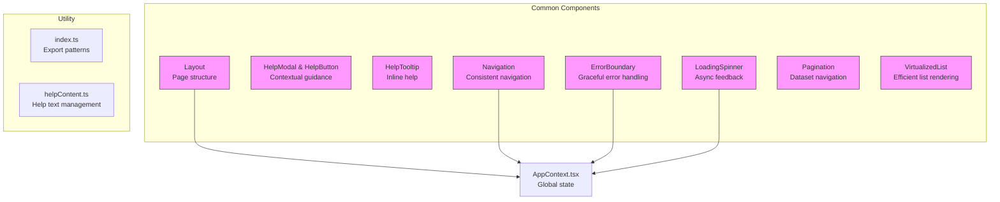
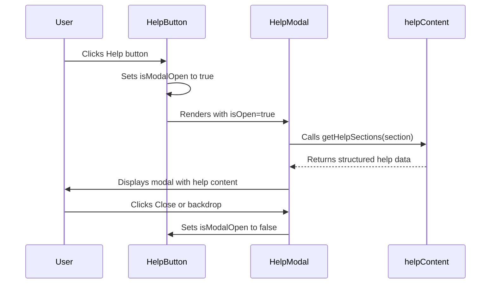
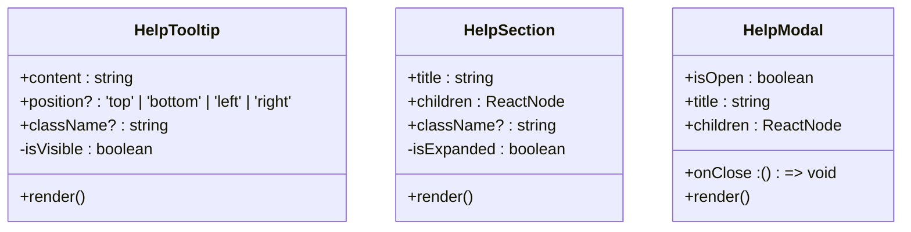
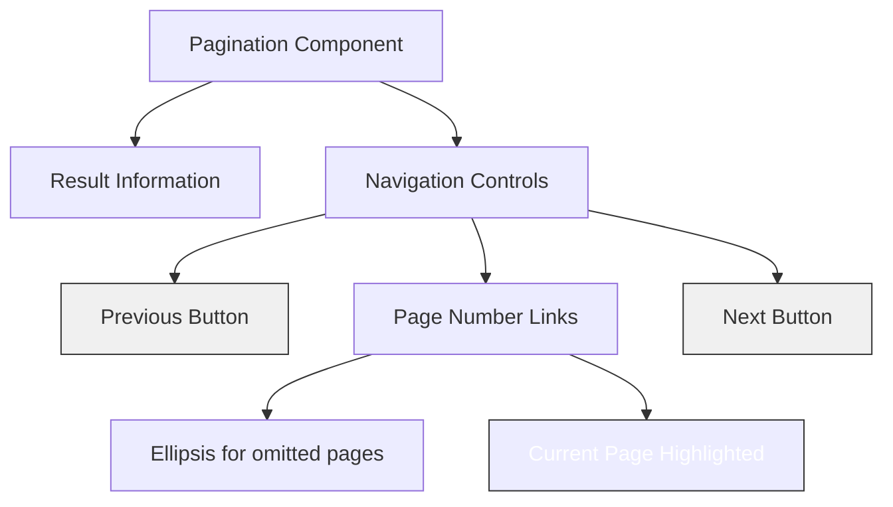

# Common Components


## Table of Contents
1. [Introduction](#introduction)
2. [Core Components Overview](#core-components-overview)
3. [ErrorBoundary Component](#errorboundary-component)
4. [HelpModal and HelpButton Components](#helpmodal-and-helpbutton-components)
5. [HelpTooltip Component](#helptooltip-component)
6. [Layout and Navigation Components](#layout-and-navigation-components)
7. [LoadingSpinner Component](#loadingspinner-component)
8. [Pagination Component](#pagination-component)
9. [VirtualizedList Component](#virtualizedlist-component)
10. [Export Patterns and Integration](#export-patterns-and-integration)
11. [Accessibility and Responsive Design](#accessibility-and-responsive-design)
12. [Performance Optimization](#performance-optimization)

## Introduction
This document provides comprehensive documentation for the shared UI components used across the Exim-Pilot application. These components form the foundation of the user interface, ensuring consistency, reusability, and maintainability throughout the application. The documentation covers the purpose, implementation details, props, state management, and integration patterns for each component, with a focus on accessibility, responsive behavior, and performance optimization.

## Core Components Overview
The Common components directory contains a collection of reusable UI elements that are shared across various feature modules in the application. These components are designed to provide consistent user experience, reduce code duplication, and simplify maintenance. The components include error handling, contextual help, layout structure, loading feedback, pagination, and efficient list rendering.





**Diagram sources**
- [ErrorBoundary.tsx](file://web/src/components/Common/ErrorBoundary.tsx)
- [HelpModal.tsx](file://web/src/components/Common/HelpModal.tsx)
- [HelpTooltip.tsx](file://web/src/components/Common/HelpTooltip.tsx)
- [Layout.tsx](file://web/src/components/Common/Layout.tsx)
- [Navigation.tsx](file://web/src/components/Common/Navigation.tsx)
- [LoadingSpinner.tsx](file://web/src/components/Common/LoadingSpinner.tsx)
- [Pagination.tsx](file://web/src/components/Common/Pagination.tsx)
- [VirtualizedList.tsx](file://web/src/components/Common/VirtualizedList.tsx)
- [index.ts](file://web/src/components/Common/index.ts)
- [helpContent.ts](file://web/src/utils/helpContent.ts)
- [AppContext.tsx](file://web/src/context/AppContext.tsx)

**Section sources**
- [ErrorBoundary.tsx](file://web/src/components/Common/ErrorBoundary.tsx)
- [HelpModal.tsx](file://web/src/components/Common/HelpModal.tsx)
- [HelpTooltip.tsx](file://web/src/components/Common/HelpTooltip.tsx)
- [Layout.tsx](file://web/src/components/Common/Layout.tsx)
- [Navigation.tsx](file://web/src/components/Common/Navigation.tsx)
- [LoadingSpinner.tsx](file://web/src/components/Common/LoadingSpinner.tsx)
- [Pagination.tsx](file://web/src/components/Common/Pagination.tsx)
- [VirtualizedList.tsx](file://web/src/components/Common/VirtualizedList.tsx)
- [index.ts](file://web/src/components/Common/index.ts)

## ErrorBoundary Component
The ErrorBoundary component provides graceful error handling for the application by catching JavaScript errors anywhere in the component tree, logging them, and displaying a fallback UI instead of crashing the entire application.

### Implementation Details
The component is implemented as a class component that uses React's error boundary lifecycle methods. It maintains state to track whether an error has occurred and stores the error object for display.


```mermaid
classDiagram
class ErrorBoundary {
+children : ReactNode
+fallback? : ReactNode
-hasError : boolean
-error? : Error
+constructor(props)
+static getDerivedStateFromError(error)
+componentDidCatch(error, errorInfo)
+render()
}
ErrorBoundary --> "1" "0..1" Error : contains
ErrorBoundary --> "1" "1" ReactNode : renders
```


**Diagram sources**
- [ErrorBoundary.tsx](file://web/src/components/Common/ErrorBoundary.tsx#L12-L83)

**Section sources**
- [ErrorBoundary.tsx](file://web/src/components/Common/ErrorBoundary.tsx#L1-L83)

### Props and State
**:Props**
- `children`: The child components to be rendered within the error boundary
- `fallback`: Optional custom fallback UI to display when an error occurs

**:State**
- `hasError`: Boolean flag indicating whether an error has been caught
- `error`: The error object that was caught

### Usage and Integration
The ErrorBoundary component is typically wrapped around major sections of the application or the entire app to prevent crashes from propagating. When an error occurs, it displays a user-friendly error message with an option to refresh the page.


```tsx
<ErrorBoundary fallback={<CustomErrorComponent />}>
  <MainContent />
</ErrorBoundary>
```


The default fallback UI includes:
- Error icon and message
- Error details in a collapsible section
- Refresh page button
- Responsive design for different screen sizes

## HelpModal and HelpButton Components
The HelpModal and HelpButton components work together to provide contextual guidance to users through modal dialogs that contain detailed information about specific application features.

### Implementation Details
The HelpModal component displays a modal dialog with structured help content based on the current section of the application. The HelpButton component serves as the trigger for opening the HelpModal.





**Diagram sources**
- [HelpModal.tsx](file://web/src/components/Common/HelpModal.tsx#L245-L270)
- [helpContent.ts](file://web/src/utils/helpContent.ts#L0-L198)

**Section sources**
- [HelpModal.tsx](file://web/src/components/Common/HelpModal.tsx#L0-L270)
- [helpContent.ts](file://web/src/utils/helpContent.ts#L0-L198)

### Props and State
**:HelpModalProps**
- `isOpen`: Boolean controlling modal visibility
- `onClose`: Callback function to close the modal
- `section`: String identifying the application section for context-specific help

**:HelpButtonProps**
- `section`: String identifying the application section
- `className`: Optional CSS classes for styling

**:State**
- `isModalOpen`: Local state in HelpButton to manage modal visibility

### Help Content Structure
The help content is organized by application section (dashboard, queue, logs, reports) with hierarchical organization:

**:helpContent Structure**

```json
{
  "dashboard": {
    "overview": "string",
    "queueMessages": "string",
    "deliveredToday": "string",
    "deferred": "string",
    "frozen": "string",
    "weeklyChart": "string"
  },
  "queue": {
    "overview": "string",
    "messageId": "string",
    "sender": "string",
    // ... other queue help content
  }
  // ... other sections
}
```


### Integration Pattern
The HelpButton is integrated into the Navigation component and automatically determines the current section based on the URL path:


```tsx
<HelpButton 
  section={
    location.pathname.startsWith('/queue') ? 'queue' :
    location.pathname.startsWith('/logs') ? 'logs' :
    location.pathname.startsWith('/reports') ? 'reports' :
    'dashboard'
  }
/>
```


## HelpTooltip Component
The HelpTooltip component provides inline contextual guidance through tooltips that appear on hover or focus, offering quick access to help information without navigating away from the current view.

### Implementation Details
The component uses state to manage tooltip visibility and supports positioning on all four sides (top, bottom, left, right). It implements proper accessibility features including keyboard navigation.





**Diagram sources**
- [HelpTooltip.tsx](file://web/src/components/Common/HelpTooltip.tsx#L0-L160)

**Section sources**
- [HelpTooltip.tsx](file://web/src/components/Common/HelpTooltip.tsx#L0-L160)

### Props and State
**:HelpTooltipProps**
- `content`: The help text to display in the tooltip
- `position`: Optional positioning (default: 'top')
- `className`: Optional CSS classes for styling

**:State**
- `isVisible`: Boolean controlling tooltip visibility

### Positioning System
The component implements a flexible positioning system using CSS classes:

**:positionClasses**

```typescript
{
  top: 'bottom-full left-1/2 transform -translate-x-1/2 mb-2',
  bottom: 'top-full left-1/2 transform -translate-x-1/2 mt-2',
  left: 'right-full top-1/2 transform -translate-y-1/2 mr-2',
  right: 'left-full top-1/2 transform -translate-y-1/2 ml-2'
}
```


### Accessibility Features
The component includes comprehensive accessibility support:
- Mouse events: `onMouseEnter`, `onMouseLeave`
- Keyboard events: `onFocus`, `onBlur`
- ARIA label: "Help information"
- Proper focus management

## Layout and Navigation Components
The Layout and Navigation components work together to provide a consistent page structure and navigation experience across the application.

### Layout Component
The Layout component serves as the outer container for all pages, providing a consistent structure with global elements.


```mermaid
flowchart TD
Layout["Layout Component"] --> Navigation["Navigation Bar"]
Layout --> ConnectionStatus["Connection Status Indicator"]
Layout --> ErrorBanner["Error Banner"]
Layout --> MainContent["Main Content Area"]
Layout --> Notifications["Floating Notifications"]
AppContext --> Layout : Provides state
Navigation --> AppContext : Reads connectionStatus
Layout --> AppContext : Reads error, notifications
```


**Diagram sources**
- [Layout.tsx](file://web/src/components/Common/Layout.tsx#L8-L58)
- [AppContext.tsx](file://web/src/context/AppContext.tsx#L0-L146)

**Section sources**
- [Layout.tsx](file://web/src/components/Common/Layout.tsx#L1-L58)
- [AppContext.tsx](file://web/src/context/AppContext.tsx#L0-L146)

#### Implementation Details
The Layout component uses the `useApp` hook to access global application state and render conditional UI elements:

**:Global State Integration**
- `connectionStatus`: Displays connection status banner when not connected
- `error`: Shows error banner when an error is present
- `notifications`: Renders floating notification messages

#### Props
**:LayoutProps**
- `children`: The main content to be displayed within the layout

### Navigation Component
The Navigation component provides consistent navigation across the application with responsive design for different screen sizes.

#### Implementation Details
The component uses React Router for navigation and displays different layouts for desktop and mobile views.


```mermaid
classDiagram
class Navigation {
+navItems : Array<{id, label, path}>
+location : Location
+user : User
+connectionStatus : string
+isActive(path)
+handleLogout()
+render()
}
Navigation --> "1" "1" AppContext : uses
Navigation --> "1" "1" AuthContext : uses
Navigation --> "1" "1" HelpButton : uses
AppContext --> Navigation : Provides connectionStatus
AuthContext --> Navigation : Provides user, logout
```


**Diagram sources**
- [Navigation.tsx](file://web/src/components/Common/Navigation.tsx#L6-L133)
- [AppContext.tsx](file://web/src/context/AppContext.tsx#L139-L145)

**Section sources**
- [Navigation.tsx](file://web/src/components/Common/Navigation.tsx#L1-L133)
- [AppContext.tsx](file://web/src/context/AppContext.tsx#L139-L145)

#### Props and State
The Navigation component has no props but uses multiple context hooks:
- `useApp()`: For connection status
- `useAuth()`: For user information and logout functionality
- `useLocation()`: For determining active navigation item

#### Navigation Items
**:navItems Structure**

```typescript
[
  { id: 'dashboard', label: 'Dashboard', path: '/' },
  { id: 'queue', label: 'Queue Management', path: '/queue' },
  { id: 'logs', label: 'Log Monitoring', path: '/logs' },
  { id: 'reports', label: 'Reports', path: '/reports' },
]
```


## LoadingSpinner Component
The LoadingSpinner component provides visual feedback during asynchronous operations, indicating that content is being loaded.

### Implementation Details
The component implements a simple spinner animation using CSS and provides both inline and full-page variants.


```mermaid
classDiagram
class LoadingSpinner {
+size? : 'sm' | 'md' | 'lg'
+className? : string
+render()
}
class FullPageSpinner {
+render()
}
LoadingSpinner --> "1" "1" sizeClasses : uses
FullPageSpinner --> "1" "1" LoadingSpinner : composes
```


**Diagram sources**
- [LoadingSpinner.tsx](file://web/src/components/Common/LoadingSpinner.tsx#L8-L33)

**Section sources**
- [LoadingSpinner.tsx](file://web/src/components/Common/LoadingSpinner.tsx#L1-L33)

### Props and State
**:LoadingSpinnerProps**
- `size`: Optional size parameter ('sm', 'md', 'lg') - default: 'md'
- `className`: Optional CSS classes for additional styling

**:sizeClasses**

```typescript
{
  sm: 'w-4 h-4',
  md: 'w-8 h-8',
  lg: 'w-12 h-12',
}
```


### Animation Implementation
The spinner uses CSS animation with a rotating border:
- Border with two colors (gray and blue)
- `animate-spin` class for continuous rotation
- Circular shape with `rounded-full`

### Usage Patterns
The component is used in two main patterns:

**:Inline Usage**

```tsx
<LoadingSpinner size="sm" className="ml-2" />
```


**:Full Page Usage**

```tsx
<FullPageSpinner />
```


The FullPageSpinner variant covers the entire screen with a semi-transparent overlay and centers the spinner with a "Loading..." message.

## Pagination Component
The Pagination component enables navigation through large datasets by dividing content into discrete pages with intuitive controls.

### Implementation Details
The component implements a comprehensive pagination interface with page number display, previous/next buttons, and result information.





**Diagram sources**
- [Pagination.tsx](file://web/src/components/Common/Pagination.tsx#L8-L151)

**Section sources**
- [Pagination.tsx](file://web/src/components/Common/Pagination.tsx#L1-L151)

### Props and State
**:PaginationProps**
- `currentPage`: Current page number (1-indexed)
- `totalPages`: Total number of pages
- `onPageChange`: Callback function when page changes
- `showInfo`: Boolean to show result information (default: true)
- `totalItems`: Total number of items across all pages
- `itemsPerPage`: Number of items per page

### Page Display Logic
The component implements intelligent page number display that shows:
- Always shows first and last pages
- Shows current page and delta pages around it
- Uses ellipsis for omitted page ranges
- Handles edge cases for small page counts

**:getVisiblePages Logic**

```typescript
const delta = 2;
// Show current page ± delta pages
// Add ellipsis when pages are omitted
// Always include first and last pages
```


### Responsive Design
The component adapts to different screen sizes:
- Compact layout on small screens
- Expanded layout on larger screens
- Hides/shows information based on screen size

## VirtualizedList Component
The VirtualizedList component enables efficient rendering of large lists by only rendering visible items, significantly improving performance for datasets with thousands of items.

### Implementation Details
The component is built on react-window and react-window-infinite-loader, implementing virtualization and infinite scrolling patterns.


```mermaid
classDiagram
class VirtualizedList {
+items : T[]
+height : number
+itemHeight : number
+renderItem : function
+hasNextPage? : boolean
+isNextPageLoading? : boolean
+loadNextPage? : () => Promise<void>
+className? : string
+overscanCount? : number
-itemCount : number
-isItemLoaded : function
-ItemRenderer : function
-listComponent : memoized
+render()
}
class VirtualizedQueueList {
+messages : any[]
+height : number
+onMessageSelect? : function
+selectedMessages? : string[]
+onSelectionChange? : function
+hasNextPage? : boolean
+isNextPageLoading? : boolean
+loadNextPage? : () => Promise<void>
+renderQueueItem : function
+render()
}
class VirtualizedLogList {
+logs : any[]
+height : number
+selectedLogs? : Set<number>
+onSelectLog? : function
+hasNextPage? : boolean
+isNextPageLoading? : boolean
+loadNextPage? : () => Promise<void>
+renderLogItem : function
+render()
}
VirtualizedList <|-- VirtualizedQueueList
VirtualizedList <|-- VirtualizedLogList
VirtualizedQueueList --> "1" "1" VirtualizedList : uses
VirtualizedLogList --> "1" "1" VirtualizedList : uses
```


**Diagram sources**
- [VirtualizedList.tsx](file://web/src/components/Common/VirtualizedList.tsx#L17-L113)

**Section sources**
- [VirtualizedList.tsx](file://web/src/components/Common/VirtualizedList.tsx#L1-L460)

### Props and State
**:VirtualizedListProps**
- `items`: Array of data items to render
- `height`: Fixed height of the list container
- `itemHeight`: Fixed height of each item
- `renderItem`: Function to render each item
- `hasNextPage`: Boolean indicating if more pages are available
- `isNextPageLoading`: Boolean indicating if next page is loading
- `loadNextPage`: Function to load the next page
- `className`: Optional CSS classes
- `overscanCount`: Number of items to render beyond visible area

### Performance Optimization Techniques
The component implements several performance optimizations:

**:Memoization**
- `useCallback` for `isItemLoaded` and `ItemRenderer`
- `useMemo` for the entire list component
- Prevents unnecessary re-renders

**:Virtualization**
- Only renders visible items plus overscan items
- Uses `FixedSizeList` from react-window
- Reduces DOM nodes significantly

**:Infinite Loading**
- Integrates with `InfiniteLoader` for seamless pagination
- Loads next page when user scrolls near the end
- Shows loading placeholder for unloaded items

### Specialized Implementations
The component includes two specialized implementations:

**:VirtualizedQueueList**
- Optimized for queue messages
- Includes selection functionality
- Displays message metadata (ID, sender, recipients, size, age, status, retries)
- Supports bulk operations

**:VirtualizedLogList**
- Optimized for log entries
- Displays timestamp, message ID, type, event, sender, recipients, status
- Supports log selection
- Handles different log types with appropriate styling

## Export Patterns and Integration
The common components are made available throughout the application through a clean export pattern implemented in the index.ts file.

### Export Pattern
The index.ts file uses named exports with default aliases to provide a clean import interface:


```typescript
export { default as Layout } from './Layout';
export { default as Navigation } from './Navigation';
export { default as LoadingSpinner, FullPageSpinner } from './LoadingSpinner';
export { default as Pagination } from './Pagination';
export { default as ErrorBoundary } from './ErrorBoundary';
```


This pattern enables clean imports in other modules:


```tsx
import { Layout, Navigation, LoadingSpinner, FullPageSpinner, Pagination, ErrorBoundary } from '@/components/Common';
```


### Integration with Feature Modules
The components are reused across various feature-specific modules:

**:Dashboard Integration**
- Uses Layout, Navigation, LoadingSpinner, ErrorBoundary
- May use HelpModal for dashboard-specific help

**:Queue Integration**
- Uses VirtualizedQueueList for message display
- Uses Pagination for dataset navigation
- Uses HelpModal for queue-specific help

**:Logs Integration**
- Uses VirtualizedLogList for log entry display
- Uses LoadingSpinner during search operations
- Uses HelpModal for logs-specific help

**:Reports Integration**
- Uses Pagination for report data navigation
- Uses HelpModal for reports-specific help
- Uses LoadingSpinner during report generation

## Accessibility and Responsive Design
All common components implement comprehensive accessibility features and responsive design principles to ensure usability across different devices and assistive technologies.

### Accessibility Features
**:Keyboard Navigation**
- All interactive elements are focusable
- Logical tab order maintained
- Keyboard event handlers implemented

**:Screen Reader Support**
- ARIA labels and roles used appropriately
- Semantic HTML elements
- Proper heading hierarchy

**:Focus Management**
- Visual focus indicators
- Focus trapping in modals
- Focus restoration after modal close

### Responsive Design
**:Mobile-First Approach**
- Components designed for mobile screens first
- Responsive breakpoints for larger screens
- Touch-friendly tap targets

**:Adaptive Layouts**
- Navigation switches between horizontal and vertical layouts
- Content reflows based on available space
- Font sizes and spacing adjust for readability

**:Performance on Mobile**
- Optimized rendering for lower-powered devices
- Reduced motion options where applicable
- Efficient touch event handling

## Performance Optimization
The common components implement various performance optimization techniques to ensure smooth user experience, especially when handling large datasets.

### Rendering Optimization
**:Virtualization**
- VirtualizedList renders only visible items
- Reduces DOM complexity significantly
- Improves scroll performance

**:Memoization**
- `useMemo` and `useCallback` hooks prevent unnecessary re-renders
- Expensive calculations are memoized
- Component instances are preserved

**:Lazy Loading**
- Help content loaded only when needed
- Images and heavy assets loaded on demand
- Code splitting where applicable

### Bundle Optimization
**:Tree Shaking**
- Clean export patterns enable tree shaking
- Unused components are eliminated from bundles
- Smaller bundle sizes

**:Code Splitting**
- Components can be dynamically imported
- Route-based code splitting possible
- Reduced initial load time

### Memory Management
**:Event Handler Cleanup**
- Proper cleanup of event listeners
- Subscription cleanup in useEffect
- Preventing memory leaks

**:State Management**
- Global state centralized in AppContext
- Local state minimized
- State updates batched where possible

**Referenced Files in This Document**   
- [ErrorBoundary.tsx](file://web/src/components/Common/ErrorBoundary.tsx)
- [HelpModal.tsx](file://web/src/components/Common/HelpModal.tsx)
- [HelpTooltip.tsx](file://web/src/components/Common/HelpTooltip.tsx)
- [Layout.tsx](file://web/src/components/Common/Layout.tsx)
- [LoadingSpinner.tsx](file://web/src/components/Common/LoadingSpinner.tsx)
- [Navigation.tsx](file://web/src/components/Common/Navigation.tsx)
- [Pagination.tsx](file://web/src/components/Common/Pagination.tsx)
- [VirtualizedList.tsx](file://web/src/components/Common/VirtualizedList.tsx)
- [index.ts](file://web/src/components/Common/index.ts)
- [helpContent.ts](file://web/src/utils/helpContent.ts)
- [AppContext.tsx](file://web/src/context/AppContext.tsx)
- [App.tsx](file://web/src/App.tsx)