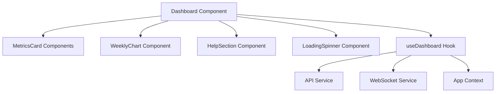
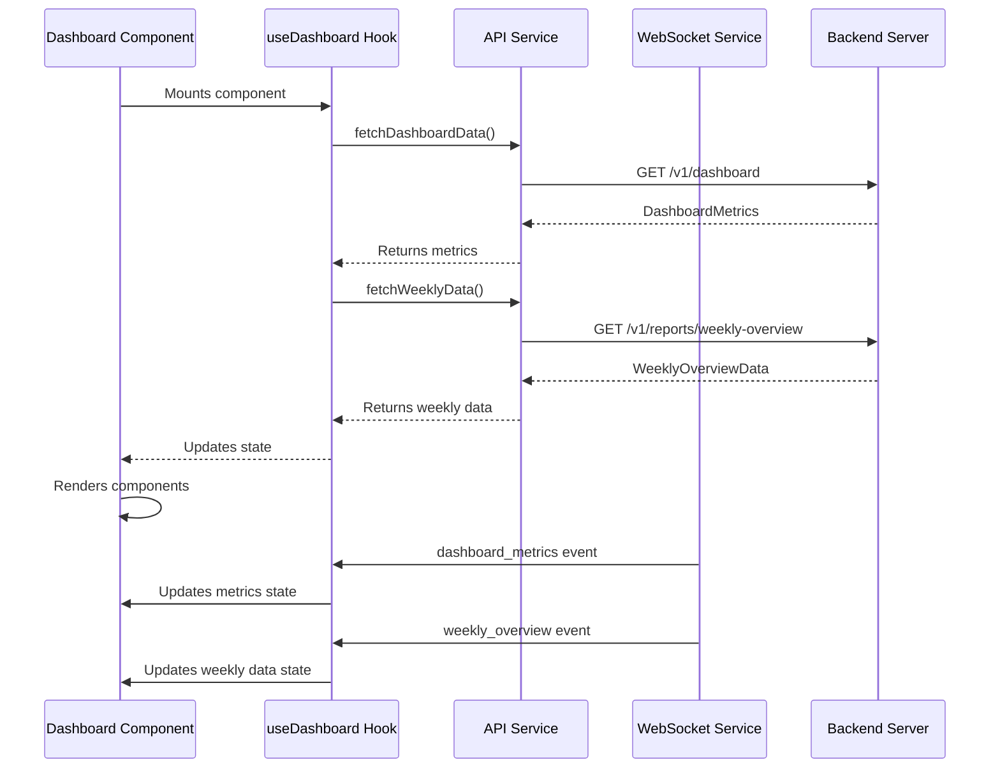
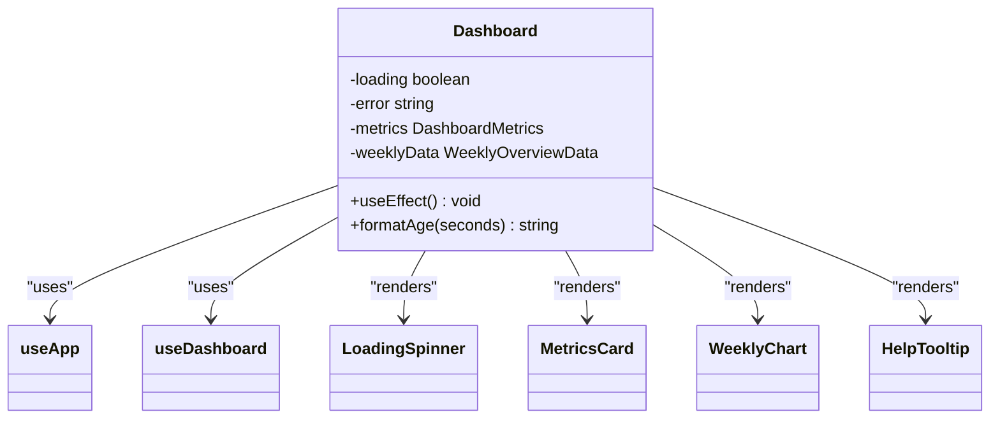
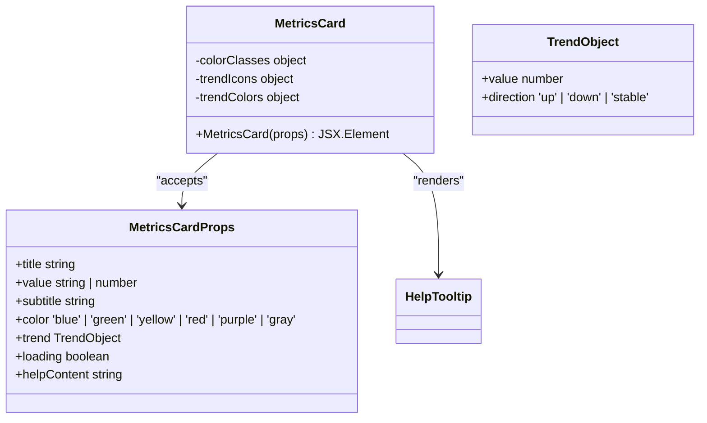
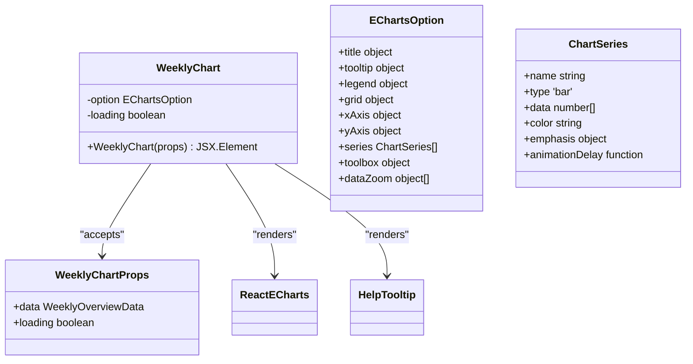
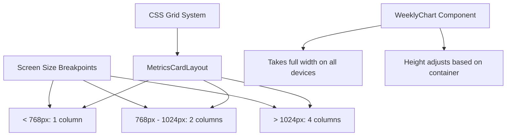
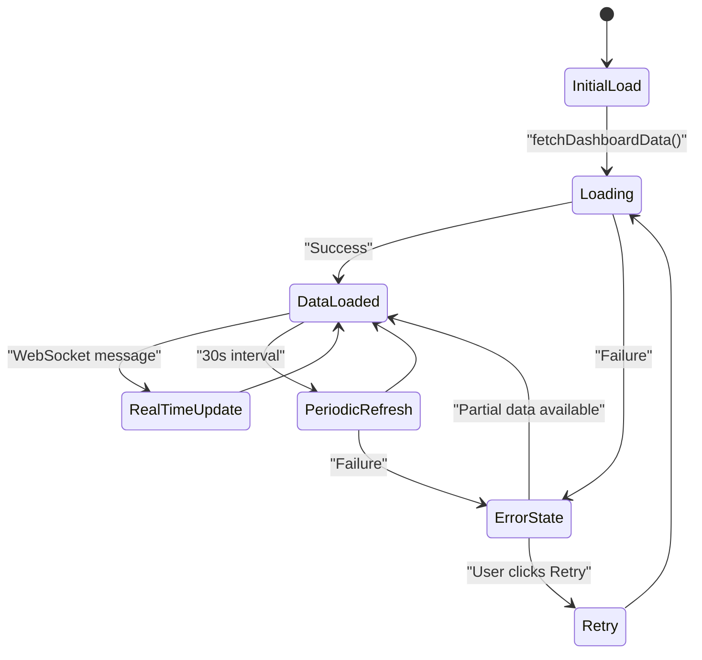
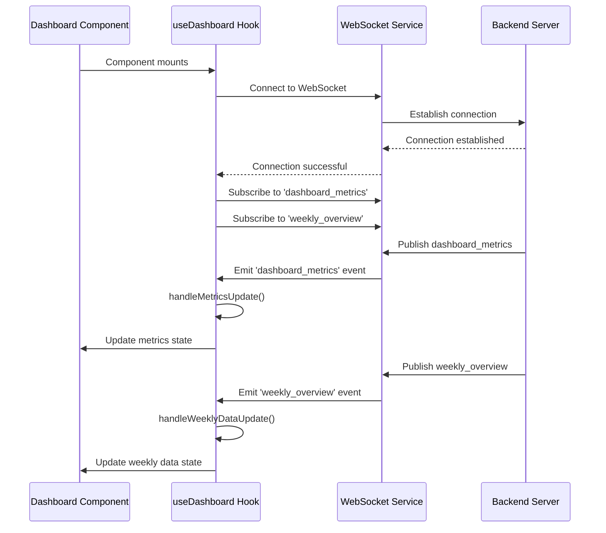
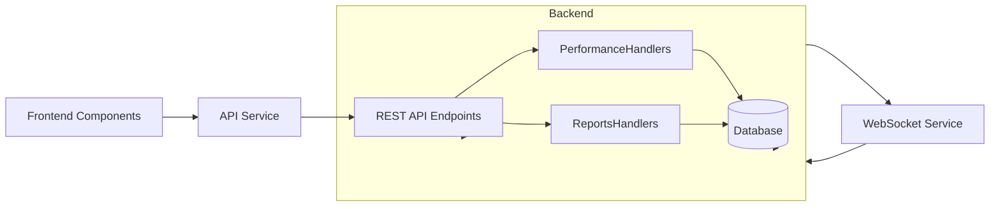

# Dashboard Components

## Table of Contents
1. [Introduction](#introduction)
2. [Core Components Overview](#core-components-overview)
3. [Data Flow and Integration](#data-flow-and-integration)
4. [Component Analysis](#component-analysis)
5. [Visual Design and Responsive Considerations](#visual-design-and-responsive-considerations)
6. [Error Handling and Loading States](#error-handling-and-loading-states)
7. [Real-Time Updates and WebSocket Integration](#real-time-updates-and-websocket-integration)
8. [Backend Integration and Performance Endpoints](#backend-integration-and-performance-endpoints)
9. [Conclusion](#conclusion)

## Introduction
The Dashboard Components in the Exim-Pilot system provide a comprehensive visual interface for monitoring mail server performance and health. This documentation details the implementation of the dashboard UI components that display system metrics and visualizations, focusing on the Dashboard as the root component, MetricsCard for displaying key performance indicators, and WeeklyChart for time-series data visualization. The components work together to provide real-time insights into mail queue status, delivery performance, and system health, enabling administrators to quickly identify and address issues.

## Core Components Overview
The dashboard system consists of three primary components that work together to present system metrics in a clear and actionable format. These components are designed with reusability, responsiveness, and accessibility in mind, following modern React patterns and best practices.

### Dashboard Component
The Dashboard component serves as the root container for all dashboard-related UI elements. It orchestrates data fetching, error handling, and the layout of child components.

**Diagram sources**
- [Dashboard.tsx](file://web/src/components/Dashboard/Dashboard.tsx#L1-L231)

### MetricsCard Component
The MetricsCard component displays key performance indicators (KPIs) in a consistent, visually distinct format. Each card presents a specific metric with supporting information and visual feedback.

### WeeklyChart Component
The WeeklyChart component visualizes time-series data using the ECharts library, providing a detailed overview of email delivery performance over a seven-day period.

## Data Flow and Integration
The dashboard components follow a unidirectional data flow pattern, with data originating from backend endpoints and flowing through hooks to presentation components.

### Data Flow Architecture

**Diagram sources**
- [useDashboard.ts](file://web/src/hooks/useDashboard.ts#L1-L80)
- [Dashboard.tsx](file://web/src/components/Dashboard/Dashboard.tsx#L1-L231)

## Component Analysis

### Dashboard Component Analysis
The Dashboard component is the root component that coordinates all dashboard functionality. It handles initial data loading, error states, and the overall layout of dashboard elements.

**Diagram sources**
- [Dashboard.tsx](file://web/src/components/Dashboard/Dashboard.tsx#L1-L231)

**Section sources**
- [Dashboard.tsx](file://web/src/components/Dashboard/Dashboard.tsx#L1-L231)

### MetricsCard Component Analysis
The MetricsCard component is a reusable UI element for displaying key performance indicators with visual feedback and contextual help.

**Diagram sources**
- [MetricsCard.tsx](file://web/src/components/Dashboard/MetricsCard.tsx#L1-L109)

**Section sources**
- [MetricsCard.tsx](file://web/src/components/Dashboard/MetricsCard.tsx#L1-L109)
- [dashboard.ts](file://web/src/types/dashboard.ts#L40-L47)

### WeeklyChart Component Analysis
The WeeklyChart component implements time-series data visualization using the ECharts library, providing detailed insights into weekly email performance trends.

**Diagram sources**
- [WeeklyChart.tsx](file://web/src/components/Dashboard/WeeklyChart.tsx#L1-L282)

**Section sources**
- [WeeklyChart.tsx](file://web/src/components/Dashboard/WeeklyChart.tsx#L1-L282)
- [dashboard.ts](file://web/src/types/dashboard.ts#L35-L39)

## Visual Design and Responsive Considerations
The dashboard components are designed with responsive layouts that adapt to different screen sizes, ensuring usability across desktop and mobile devices.

### Responsive Layout Strategy

**Diagram sources**
- [Dashboard.tsx](file://web/src/components/Dashboard/Dashboard.tsx#L1-L231)
- [WeeklyChart.tsx](file://web/src/components/Dashboard/WeeklyChart.tsx#L1-L282)

The dashboard uses Tailwind CSS's responsive design system with the following grid configuration:
- Mobile (1 column): `grid-cols-1`
- Tablet (2 columns): `md:grid-cols-2`
- Desktop (4 columns): `lg:grid-cols-4`

This responsive approach ensures that metrics are displayed optimally across different device sizes, with the WeeklyChart component always taking full width for maximum visibility of time-series data.

## Error Handling and Loading States
The dashboard components implement comprehensive error handling and loading state management to provide a smooth user experience even when data is unavailable or loading.

### Loading and Error State Management

**Diagram sources**
- [useDashboard.ts](file://web/src/hooks/useDashboard.ts#L1-L80)
- [Dashboard.tsx](file://web/src/components/Dashboard/Dashboard.tsx#L1-L231)

#### Loading States Implementation
The components display skeleton loading states when data is being fetched:

- **Dashboard**: Shows a loading spinner when initially loading with no data
- **MetricsCard**: Displays animated skeleton placeholders with `animate-pulse`
- **WeeklyChart**: Renders a loading state with placeholder bars

#### Error Handling Implementation
The dashboard implements robust error handling with user-friendly recovery options:

- **Error Display**: Shows a red alert box with error message and retry button
- **Notifications**: Adds error notifications to the application context
- **Fallback Behavior**: Displays previously loaded data when available
- **Retry Mechanism**: Allows users to manually retry failed data fetches

**Section sources**
- [Dashboard.tsx](file://web/src/components/Dashboard/Dashboard.tsx#L1-L231)
- [useDashboard.ts](file://web/src/hooks/useDashboard.ts#L1-L80)

## Real-Time Updates and WebSocket Integration
The dashboard components support real-time updates through WebSocket connections, providing immediate feedback on system changes without requiring manual refreshes.

### Real-Time Update Flow

**Diagram sources**
- [useDashboard.ts](file://web/src/hooks/useDashboard.ts#L1-L80)
- [Dashboard.tsx](file://web/src/components/Dashboard/Dashboard.tsx#L1-L231)

The real-time update system implements the following features:
- **Automatic Connection**: Establishes WebSocket connection on component mount
- **Event Subscription**: Listens for specific events ('dashboard_metrics', 'weekly_overview')
- **Fallback Mechanism**: Uses periodic polling (30-second interval) when WebSocket is unavailable
- **Connection Status**: Displays connection status in the UI (Live, Connecting, Offline)
- **Error Recovery**: Shows notifications when WebSocket connection fails

**Section sources**
- [useDashboard.ts](file://web/src/hooks/useDashboard.ts#L1-L80)
- [Dashboard.tsx](file://web/src/components/Dashboard/Dashboard.tsx#L1-L231)

## Backend Integration and Performance Endpoints
The dashboard components integrate with backend performance endpoints to retrieve system metrics and support real-time monitoring.

### Backend API Integration

**Diagram sources**
- [useDashboard.ts](file://web/src/hooks/useDashboard.ts#L1-L80)
- [performance_handlers.go](file://internal/api/performance_handlers.go#L1-L274)

#### API Endpoints Used
The dashboard components consume the following backend endpoints:

- **GET /v1/dashboard**: Retrieves current dashboard metrics (QueueMetrics, DeliveryMetrics, SystemMetrics)
- **GET /v1/reports/weekly-overview**: Retrieves weekly email performance data
- **WebSocket Events**: 
  - 'dashboard_metrics': Real-time updates for dashboard metrics
  - 'weekly_overview': Real-time updates for weekly data

#### Backend Implementation
Although the specific implementation of the `/v1/dashboard` endpoint could not be located in the provided codebase, the integration pattern is clear from the frontend code. The backend likely includes handlers that aggregate data from various system components:

- **Queue Metrics**: Retrieved from mail queue monitoring system
- **Delivery Metrics**: Calculated from delivery logs and status tracking
- **System Metrics**: Collected from system monitoring and log processing services
- **Weekly Data**: Aggregated from historical reports and analytics

The use of WebSocket for real-time updates suggests that the backend pushes metric updates when significant changes occur, reducing the need for frequent polling.

**Section sources**
- [useDashboard.ts](file://web/src/hooks/useDashboard.ts#L1-L80)
- [dashboard.ts](file://web/src/types/dashboard.ts#L1-L48)
- [performance_handlers.go](file://internal/api/performance_handlers.go#L1-L274)

## Conclusion
The Dashboard Components in Exim-Pilot provide a comprehensive, real-time monitoring solution for mail server performance. The system is built on a well-structured architecture with clear separation of concerns between data fetching, state management, and presentation components.

Key strengths of the implementation include:
- **Modular Design**: Reusable components (MetricsCard, WeeklyChart) that can be easily extended
- **Real-Time Updates**: WebSocket integration for immediate feedback on system changes
- **Responsive Layout**: Adapts to different screen sizes for optimal viewing
- **Robust Error Handling**: Graceful degradation and user-friendly error recovery
- **Comprehensive Visualization**: Effective presentation of both KPIs and time-series data

The components work together to provide administrators with immediate insights into system health, enabling quick identification of issues and informed decision-making. The integration with backend performance endpoints and real-time update capabilities make this dashboard a powerful tool for monitoring and managing Exim mail servers.

**Referenced Files in This Document**   
- [Dashboard.tsx](file://web/src/components/Dashboard/Dashboard.tsx)
- [MetricsCard.tsx](file://web/src/components/Dashboard/MetricsCard.tsx)
- [WeeklyChart.tsx](file://web/src/components/Dashboard/WeeklyChart.tsx)
- [useDashboard.ts](file://web/src/hooks/useDashboard.ts)
- [dashboard.ts](file://web/src/types/dashboard.ts)
- [performance_handlers.go](file://internal/api/performance_handlers.go)