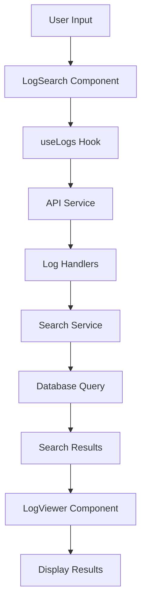
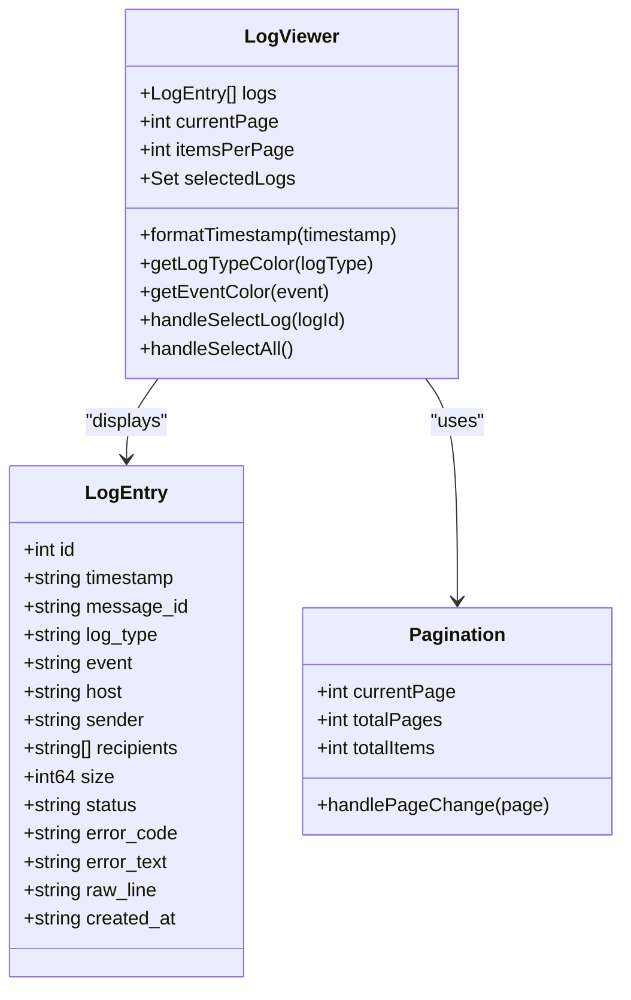
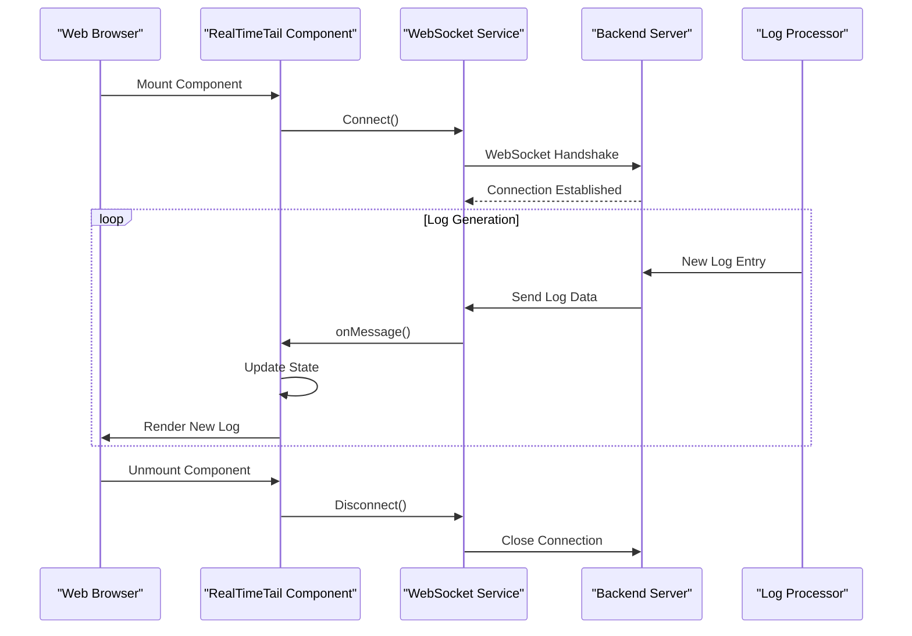
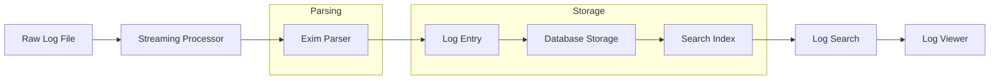
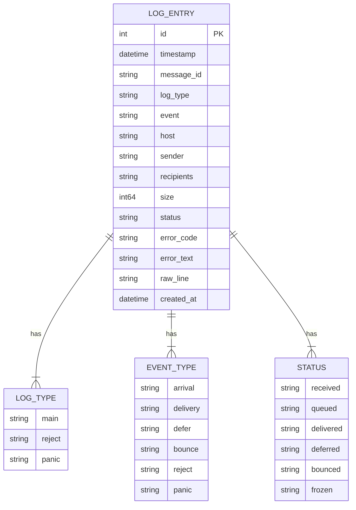
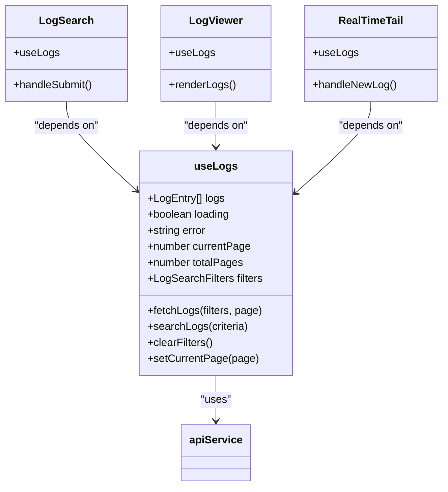
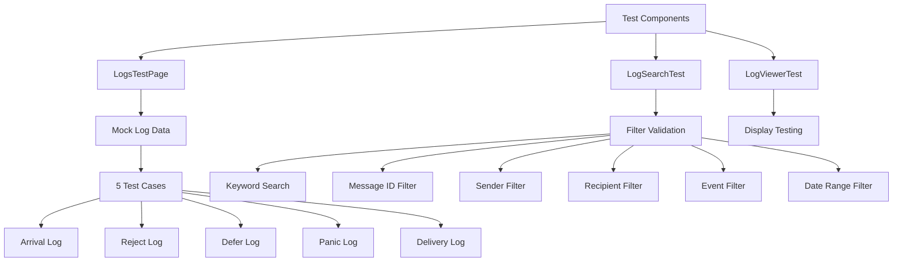

# Logs Components

## Table of Contents
1. [Introduction](#introduction)
2. [Core Components Overview](#core-components-overview)
3. [Log Search Functionality](#log-search-functionality)
4. [Log Viewing and Display](#log-viewing-and-display)
5. [Real-Time Log Streaming](#real-time-log-streaming)
6. [Log Processing Pipeline](#log-processing-pipeline)
7. [Data Structures and Models](#data-structures-and-models)
8. [Integration with useLogs Hook](#integration-with-uselogs-hook)
9. [WebSocket Communication](#websocket-communication)
10. [Testing and Validation](#testing-and-validation)
11. [Performance Considerations](#performance-considerations)
12. [Conclusion](#conclusion)

## Introduction
The Logs Components in the Exim-Pilot system provide comprehensive log management capabilities for monitoring and analyzing mail server operations. This documentation details the architecture and functionality of the log search, viewing, and real-time monitoring components. The system enables administrators to search through log entries, view formatted log data, and monitor logs in real time. The components work together to provide a complete solution for log analysis, with backend services handling log processing and search, while frontend components provide user interfaces for interaction. The system is designed to handle large volumes of log data efficiently, with optimized search capabilities and real-time streaming features.

## Core Components Overview
The log management system consists of several interconnected components that work together to provide comprehensive log monitoring capabilities. The main components include LogSearch for query input and filtering, LogViewer for formatted log display, Logs as the main container component, and RealTimeTail for live log streaming. These components are supported by backend services that handle log processing, storage, and retrieval. The system uses a hook-based architecture with useLogs providing state management and data fetching capabilities. WebSocket connections enable real-time log updates, while the log processor handles parsing and indexing of log entries. The components are designed to work together seamlessly, providing a unified interface for log analysis and monitoring.

**Section sources**
- [Logs.tsx](file://web/src/components/Logs/Logs.tsx)
- [LogSearch.tsx](file://web/src/components/Logs/LogSearch.tsx)
- [LogViewer.tsx](file://web/src/components/Logs/LogViewer.tsx)
- [RealTimeTail.tsx](file://web/src/components/Logs/RealTimeTail.tsx)

## Log Search Functionality
The LogSearch component provides advanced query input and filtering capabilities for mail server logs. It allows users to search through log entries using various criteria including message ID, sender, recipients, log types, events, and keywords. The search functionality is implemented through a combination of frontend and backend components that work together to provide efficient and responsive search results.

**Diagram sources**
- [LogSearch.tsx](file://web/src/components/Logs/LogSearch.tsx)
- [useLogs.ts](file://web/src/hooks/useLogs.ts)
- [api.ts](file://web/src/services/api.ts)
- [log_handlers.go](file://internal/api/log_handlers.go)
- [search.go](file://internal/logprocessor/search.go)

### Search Criteria and Filtering
The search functionality supports a comprehensive set of filtering options that allow users to narrow down log entries based on specific criteria. The SearchCriteria struct defines the parameters that can be used for filtering, including time range, message filtering, log filtering, content filtering, and size filtering.

**Search Parameters:**
- **Time Range**: StartTime and EndTime fields allow filtering by timestamp
- **Message Filtering**: MessageID, Sender, and Recipients fields
- **Log Filtering**: LogTypes, Events, and Status fields
- **Content Filtering**: Keywords, ErrorCode, and Host fields
- **Size Filtering**: MinSize and MaxSize fields
- **Pagination**: Limit and Offset fields
- **Sorting**: SortBy and SortOrder fields

The search implementation supports both simple and advanced search syntax. Users can perform keyword searches that match against the raw log content, or use specific filters to target particular fields. The system also supports partial matching for sender and recipient addresses, making it easier to find relevant log entries.

**Section sources**
- [search.go](file://internal/logprocessor/search.go#L25-L50)
- [log_handlers.go](file://internal/api/log_handlers.go#L50-L100)

### Search Syntax Examples
The system supports various search syntax patterns that enable users to perform targeted searches:

**Basic Search Examples:**
- `message_id:1a2b3c-4d5e6f-7g8h9i` - Find logs for a specific message
- `sender:user@example.com` - Find logs for messages from a specific sender
- `recipient:recipient@example.com` - Find logs for messages to a specific recipient
- `type:reject` - Find all reject log entries
- `event:defer` - Find all deferred message logs

**Advanced Search Examples:**
- `from:user@example.com to:recipient@example.com` - Find logs for messages between specific addresses
- `error:550` - Find logs with a specific SMTP error code
- `size:>1024` - Find logs for messages larger than 1KB
- `host:mail.example.com` - Find logs from a specific host
- `"connection refused"` - Find logs containing a specific phrase

The search system also supports time-based filtering through URL parameters or the advanced search interface:
- `start_time=2024-01-15T10:30:00Z&end_time=2024-01-15T11:30:00Z` - Time range filter
- `sort_by=timestamp&sort_order=desc` - Sorting options

## Log Viewing and Display
The LogViewer component provides formatted display of log entries, presenting the structured data in an easily readable format. It transforms the raw log data into a user-friendly interface that highlights important information and allows for efficient analysis.

**Diagram sources**
- [models.go](file://internal/database/models.go#L150-L200)
- [LogViewer.tsx](file://web/src/components/Logs/LogViewer.tsx)
- [Pagination.tsx](file://web/src/components/Common/Pagination.tsx)

### Log Entry Formatting
The LogViewer component formats log entries to enhance readability and provide visual cues for different log types and events. Each log entry is displayed in a table row with the following columns:

- **Timestamp**: Formatted date and time of the log entry
- **Message ID**: Unique identifier for the message (displayed in monospace font)
- **Type**: Log type (main, reject, panic) with color coding
- **Event**: Event type (arrival, delivery, defer, etc.) with color coding
- **Sender**: Email address of the sender
- **Recipients**: List of recipients (truncated if too long)
- **Status**: Delivery status with appropriate indicators

The component uses color coding to quickly identify different log types and events:
- **Main logs**: Blue badge
- **Reject logs**: Red badge
- **Panic logs**: Yellow badge
- **Arrival events**: Green badge
- **Delivery events**: Blue badge
- **Defer events**: Yellow badge
- **Bounce events**: Red badge

**Section sources**
- [LogViewer.tsx](file://web/src/components/Logs/LogViewer.tsx)
- [models.go](file://internal/database/models.go#L150-L200)

### Pagination and Selection
The LogViewer component includes pagination functionality to handle large datasets efficiently. It displays a configurable number of log entries per page and provides navigation controls to move between pages. The component also supports selection of multiple log entries for batch operations like exporting.

Key features of the pagination and selection system:
- Configurable items per page (default 50)
- Page navigation controls
- Total count display
- Select all functionality
- Individual row selection
- Export selected entries

The selection state is managed using a Set data structure to efficiently track which log entries are selected, providing O(1) lookup time for checking selection status.

## Real-Time Log Streaming
The RealTimeTail component enables live monitoring of log entries as they are generated by the mail server. It uses WebSocket connections to receive log updates in real time, providing immediate visibility into server operations.

**Diagram sources**
- [RealTimeTail.tsx](file://web/src/components/Logs/RealTimeTail.tsx)
- [websocket.ts](file://web/src/services/websocket.ts)
- [log_handlers.go](file://internal/api/log_handlers.go#L150-L200)

### WebSocket Implementation
The real-time log streaming functionality is implemented using WebSocket connections, which provide a persistent, bidirectional communication channel between the client and server. The websocket.ts service handles the WebSocket connection lifecycle, including connection establishment, message handling, and error recovery.

Key aspects of the WebSocket implementation:
- **Connection Management**: Automatic connection and reconnection logic
- **Message Handling**: Parsing and dispatching of incoming log messages
- **Error Handling**: Graceful handling of connection errors and timeouts
- **Filtering**: Support for server-side filtering of log streams
- **Heartbeat**: Periodic ping/pong messages to maintain connection

The RealTimeTail component subscribes to the WebSocket service and updates its state when new log entries are received. It uses React's useEffect hook to manage the connection lifecycle, ensuring that connections are properly cleaned up when the component is unmounted.

**Section sources**
- [RealTimeTail.tsx](file://web/src/components/Logs/RealTimeTail.tsx)
- [websocket.ts](file://web/src/services/websocket.ts)
- [log_handlers.go](file://internal/api/log_handlers.go#L150-L200)

## Log Processing Pipeline
The log processing pipeline handles the ingestion, parsing, and storage of log entries from the mail server. It transforms raw log data into structured entries that can be efficiently searched and analyzed.

**Diagram sources**
- [streaming.go](file://internal/logprocessor/streaming.go)
- [exim_parser.go](file://internal/parser/exim_parser.go)
- [models.go](file://internal/database/models.go)
- [search.go](file://internal/logprocessor/search.go)

### Log Parsing and Transformation
The EximParser component is responsible for parsing raw Exim log entries and transforming them into structured data. It uses regular expressions to match different log patterns and extract relevant information.

The parser handles multiple log types:
- **Main logs**: Message arrival, delivery, deferral, and completion
- **Reject logs**: Connection and SMTP rejections
- **Panic logs**: System panic and error messages

For each log pattern, the parser extracts specific fields and creates a structured LogEntry object. If a log line doesn't match any known pattern, it creates a generic log entry with the raw line content.

**Section sources**
- [exim_parser.go](file://internal/parser/exim_parser.go)
- [models.go](file://internal/database/models.go#L150-L200)

### Streaming Processing
The StreamingProcessor handles efficient log processing with streaming capabilities. It uses a pipeline architecture with multiple stages to process log entries in batches:

1. **Line Reading**: Reads log lines from a file or stream
2. **Parsing**: Parses each line into structured data
3. **Batching**: Groups entries into batches for efficient storage
4. **Storage**: Saves batches to the database

The processor includes configuration options for:
- Batch size
- Flush interval
- Buffer size
- Concurrent workers
- Processing timeout

This streaming approach allows for efficient processing of large log files without excessive memory usage.

**Section sources**
- [streaming.go](file://internal/logprocessor/streaming.go)
- [exim_parser.go](file://internal/parser/exim_parser.go)

## Data Structures and Models
The system uses well-defined data structures to represent log entries and related information. The LogEntry model in the database package defines the structure of stored log data.

**Diagram sources**
- [models.go](file://internal/database/models.go#L150-L200)

### LogEntry Structure
The LogEntry struct contains the following fields:

**Core Fields:**
- **ID**: Unique identifier (database primary key)
- **Timestamp**: When the log entry was created
- **MessageID**: Unique identifier for the message
- **LogType**: Type of log (main, reject, panic)
- **Event**: Type of event (arrival, delivery, defer, etc.)

**Message Information:**
- **Host**: Hostname associated with the event
- **Sender**: Email address of the sender
- **Recipients**: Array of recipient email addresses
- **Size**: Size of the message in bytes

**Status Information:**
- **Status**: Current status of the message
- **ErrorCode**: SMTP error code (if applicable)
- **ErrorText**: Error message text (if applicable)

**System Fields:**
- **RawLine**: Original log line text
- **CreatedAt**: When the entry was stored in the database

The Recipients field is stored as a JSON string in the database but is exposed as an array in the application, with MarshalRecipients and UnmarshalRecipients methods handling the conversion.

**Section sources**
- [models.go](file://internal/database/models.go#L150-L200)

## Integration with useLogs Hook
The useLogs hook provides a centralized way to manage log data and operations in the frontend components. It handles data fetching, state management, and interaction with the backend API.

**Diagram sources**
- [useLogs.ts](file://web/src/hooks/useLogs.ts)
- [LogSearch.tsx](file://web/src/components/Logs/LogSearch.tsx)
- [LogViewer.tsx](file://web/src/components/Logs/LogViewer.tsx)
- [RealTimeTail.tsx](file://web/src/components/Logs/RealTimeTail.tsx)
- [api.ts](file://web/src/services/api.ts)

The useLogs hook encapsulates the logic for:
- Fetching log entries from the API
- Managing pagination state
- Applying search filters
- Handling loading and error states
- Providing utility functions for log operations

This hook-based approach promotes code reuse and ensures consistent behavior across different log-related components.

**Section sources**
- [useLogs.ts](file://web/src/hooks/useLogs.ts)
- [api.ts](file://web/src/services/api.ts)

## WebSocket Communication
The WebSocket communication system enables real-time updates for log monitoring. The websocket.ts service provides a clean interface for establishing and managing WebSocket connections.

Key features of the WebSocket implementation:
- **Connection Management**: Automatic connection and reconnection
- **Message Parsing**: Converting received data to structured objects
- **Error Handling**: Graceful recovery from connection issues
- **Event Emission**: Broadcasting messages to subscribers
- **Resource Cleanup**: Proper cleanup on component unmount

The service uses the WebSocket API to establish a connection to the backend server and listens for incoming log messages. When a message is received, it is parsed and dispatched to any registered listeners.

**Section sources**
- [websocket.ts](file://web/src/services/websocket.ts)
- [RealTimeTail.tsx](file://web/src/components/Logs/RealTimeTail.tsx)

## Testing and Validation
The system includes comprehensive testing components to validate functionality during development. The test components use mock data to simulate log entries and test various scenarios.

**Diagram sources**
- [LogsTestPage.tsx](file://web/src/components/Logs/LogsTestPage.tsx)
- [LogSearchTest.tsx](file://web/src/components/Logs/LogSearchTest.tsx)
- [LogViewerTest.tsx](file://web/src/components/Logs/LogViewerTest.tsx)

### Test Components
The testing system includes several components designed to validate different aspects of the log management functionality:

**LogsTestPage**: The main test page that integrates all test components and provides a comprehensive testing environment. It includes:
- Mock log data with various log types and events
- Search and filter functionality testing
- Results summary display
- Interactive testing interface

**LogSearchTest**: A component specifically designed to test the search functionality. It provides:
- Form inputs for all search criteria
- Expandable advanced filters
- Search and clear buttons
- Filter state management

**LogViewerTest**: A component for testing the log display functionality. It includes:
- Table display of log entries
- Pagination controls
- Row selection functionality
- Color-coded log types and events

The test components use realistic mock data that represents different types of log entries, allowing developers to verify that the components handle various scenarios correctly.

**Section sources**
- [LogsTestPage.tsx](file://web/src/components/Logs/LogsTestPage.tsx)
- [LogSearchTest.tsx](file://web/src/components/Logs/LogSearchTest.tsx)
- [LogViewerTest.tsx](file://web/src/components/Logs/LogViewerTest.tsx)

## Performance Considerations
The log management system is designed to handle large volumes of log data efficiently. Several performance optimizations are implemented at both the frontend and backend levels.

### Backend Optimizations
The search functionality includes several optimizations for handling large datasets:
- **Database Indexing**: Key fields are indexed for faster queries
- **Pagination**: Results are returned in pages to avoid memory issues
- **Query Optimization**: SQL queries are optimized for performance
- **Caching**: Search results and aggregations are cached when possible
- **Limit Enforcement**: Maximum search limits prevent excessive resource usage

The SearchService enforces limits on search results to prevent performance degradation:
- Default search limit: 100 entries
- Maximum search limit: 1000 entries
- Configurable through service configuration

### Frontend Optimizations
The frontend components include several optimizations for handling large datasets:
- **Virtualized Lists**: Long lists are virtualized to improve rendering performance
- **Debounced Searches**: Search requests are debounced to prevent excessive API calls
- **Efficient State Updates**: State updates are optimized to minimize re-renders
- **Lazy Loading**: Data is loaded on demand rather than all at once
- **Memory Management**: Resources are properly cleaned up to prevent memory leaks

The system is designed to provide a responsive user experience even when dealing with large volumes of log data, with careful attention to both frontend and backend performance characteristics.

## Conclusion
The Logs Components in the Exim-Pilot system provide a comprehensive solution for monitoring and analyzing mail server logs. The system combines powerful search capabilities, formatted log display, and real-time monitoring in a cohesive interface. The architecture is designed to handle large volumes of log data efficiently, with optimizations at both the frontend and backend levels. The integration of the useLogs hook provides a consistent interface for log operations across components, while the WebSocket-based real-time streaming enables immediate visibility into server operations. The testing components ensure that the functionality works correctly during development, and the well-defined data structures provide a solid foundation for log analysis. Overall, the system provides administrators with the tools they need to effectively monitor and troubleshoot mail server operations.

**Referenced Files in This Document**   
- [search.go](file://internal/logprocessor/search.go)
- [log_handlers.go](file://internal/api/log_handlers.go)
- [service.go](file://internal/logprocessor/service.go)
- [streaming.go](file://internal/logprocessor/streaming.go)
- [exim_parser.go](file://internal/parser/exim_parser.go)
- [models.go](file://internal/database/models.go)
- [api.ts](file://web/src/services/api.ts)
- [LogsTestPage.tsx](file://web/src/components/Logs/LogsTestPage.tsx)
- [LogSearchTest.tsx](file://web/src/components/Logs/LogSearchTest.tsx)
- [LogViewerTest.tsx](file://web/src/components/Logs/LogViewerTest.tsx)
- [LogSearch.tsx](file://web/src/components/Logs/LogSearch.tsx)
- [LogViewer.tsx](file://web/src/components/Logs/LogViewer.tsx)
- [RealTimeTail.tsx](file://web/src/components/Logs/RealTimeTail.tsx)
- [useLogs.ts](file://web/src/hooks/useLogs.ts)
- [websocket.ts](file://web/src/services/websocket.ts)