# Queue Components

## Table of Contents
1. [Introduction](#introduction)
2. [Core Components Overview](#core-components-overview)
3. [Queue Component](#queue-component)
4. [QueueList Component](#queuelist-component)
5. [QueueSearch Component](#queuesearch-component)
6. [MessageDetails Component](#messagedetails-component)
7. [BulkActions Component](#bulkactions-component)
8. [State Management with useQueue Hook](#state-management-with-usequeue-hook)
9. [API Service Integration](#api-service-integration)
10. [Backend Implementation](#backend-implementation)
11. [Performance Optimization](#performance-optimization)
12. [Error Handling](#error-handling)
13. [Testing Guidance](#testing-guidance)

## Introduction
The Queue Components provide a comprehensive interface for managing Exim mail queues, enabling administrators to view, search, filter, and perform operations on queued messages. This documentation details the architecture, functionality, and integration of the queue management system, covering both frontend components and backend services. The system supports individual message inspection and bulk operations with confirmation workflows, while implementing performance optimizations for handling large queues.

## Core Components Overview
The queue management system consists of several interconnected React components that work together to provide a complete user interface for Exim queue operations. The main components include:

- **Queue**: The primary container component that orchestrates all queue management functionality
- **QueueList**: Displays messages with virtualized rendering for performance
- **QueueSearch**: Provides filtering capabilities for finding specific messages
- **MessageDetails**: Enables inspection of individual message details
- **BulkActions**: Facilitates batch operations on selected messages

These components are integrated through the `useQueue` custom hook, which manages state and provides access to queue operations, while communicating with the backend API service.

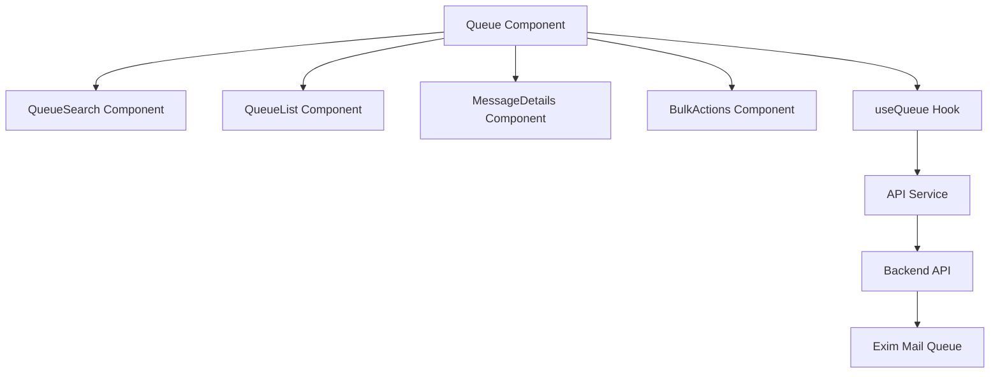

**Diagram sources**
- [Queue.tsx](file://web/src/components/Queue/Queue.tsx)
- [useQueue.ts](file://web/src/hooks/useQueue.ts)
- [api.ts](file://web/src/services/api.ts)

## Queue Component
The Queue component serves as the main interface for mail queue management, integrating all other components and managing the overall state flow. It handles message selection, operation completion, and coordination between search, list, details, and bulk action components.

### Key Features
- Central state management for selected messages and search filters
- Coordination between child components through callback functions
- Integration with help content for user guidance
- Real-time updates through WebSocket connections

### State Management
The component maintains several state variables:
- **searchFilters**: Current search criteria applied to the queue
- **selectedMessages**: Array of message IDs currently selected
- **selectedMessage**: Currently inspected message details
- **refreshTrigger**: Counter to trigger list refresh after operations

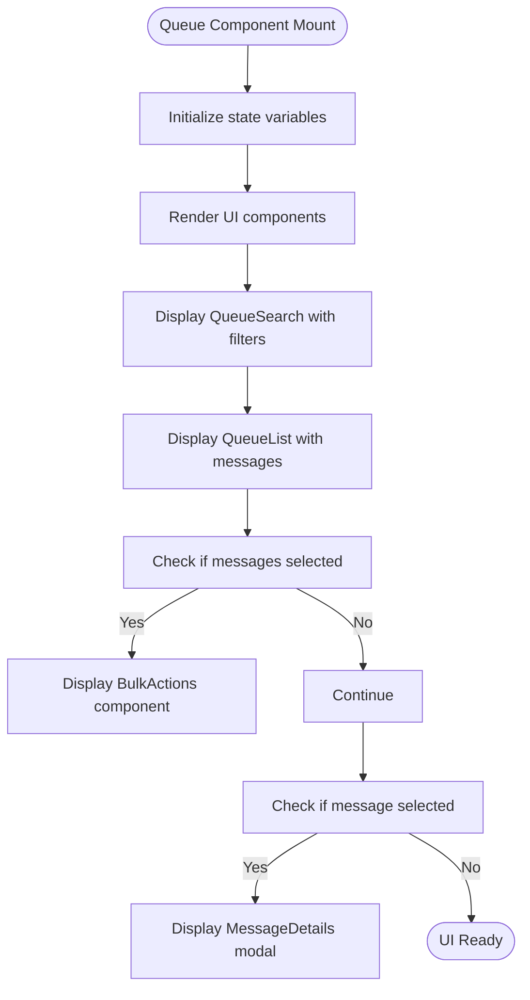

**Section sources**
- [Queue.tsx](file://web/src/components/Queue/Queue.tsx#L1-L133)

## QueueList Component
The QueueList component displays messages from the Exim queue with support for virtualized rendering, sorting, and selection. It handles pagination and real-time updates through WebSocket connections.

### Virtualized Rendering
For performance optimization with large queues, the component supports virtualization through integration with the VirtualizedList component. When `useVirtualization` is enabled, it implements lazy loading to fetch data as the user scrolls.

### Key Functionality
- **Sorting**: Messages can be sorted by ID, sender, recipients, size, age, status, or retry count
- **Selection**: Supports individual message selection and "select all" functionality
- **Pagination**: Implements server-side pagination with configurable page size
- **Real-time Updates**: List refreshes automatically when queue updates are received via WebSocket

### Data Fetching
The component uses an optimized data fetching strategy:
- For virtualized lists: Implements lazy loading with threshold-based loading
- For paginated lists: Fetches specific pages with sorting and filtering parameters

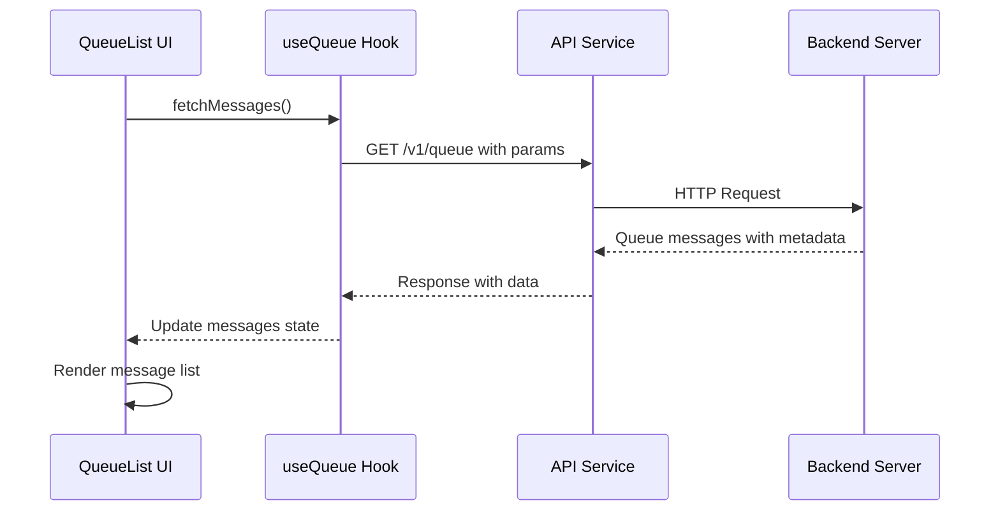

**Section sources**
- [QueueList.tsx](file://web/src/components/Queue/QueueList.tsx#L1-L199)

## QueueSearch Component
The QueueSearch component provides filtering capabilities for the mail queue, allowing users to find specific messages based on various criteria.

### Search Criteria
Users can filter messages by:
- **Sender**: Email address of the message sender
- **Recipient**: Email address of any recipient
- **Message ID**: Exim message identifier
- **Subject**: Message subject line
- **Status**: Message status (queued, deferred, frozen)
- **Age**: Message age in hours (minimum and maximum)
- **Retry Count**: Number of delivery attempts (minimum and maximum)

### User Interface
The component features a responsive design with:
- **Basic Filters**: Always visible sender, recipient, and message ID fields
- **Advanced Filters**: Expandable section for additional criteria
- **Form Submission**: Search triggers on form submission
- **Clear Functionality**: Button to reset all filters

### State Management
The component manages its own state for filter values and expansion state:
- **filters**: Object containing current filter values
- **isExpanded**: Boolean indicating whether advanced filters are visible

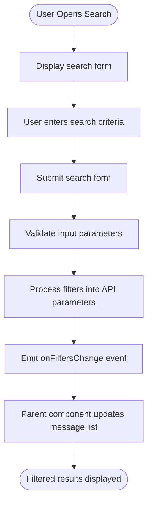

**Section sources**
- [QueueSearch.tsx](file://web/src/components/Queue/QueueSearch.tsx#L1-L199)

## MessageDetails Component
The MessageDetails component enables inspection of individual message details and provides interfaces for performing operations on specific messages.

### Message Inspection
When a message is selected, this component displays detailed information including:
- **Envelope Information**: Sender, recipients, size, and timestamps
- **Headers**: Complete email headers
- **Content Preview**: Message body preview
- **Delivery Attempts**: History of delivery attempts with status
- **SMTP Logs**: Transaction logs from delivery attempts

### Operation Workflow
The component implements a confirmation workflow for all operations:
1. User selects an operation (deliver, freeze, thaw, delete)
2. Confirmation dialog appears with operation details
3. User confirms or cancels the operation
4. Operation is executed with appropriate feedback

### Confirmation Dialog
The confirmation dialog provides:
- **Operation-Specific Text**: Descriptive text explaining the operation
- **Visual Indicators**: Color-coded warnings for destructive operations
- **Message ID**: Display of the message ID being operated on
- **Confirmation and Cancel Buttons**: Clear action choices

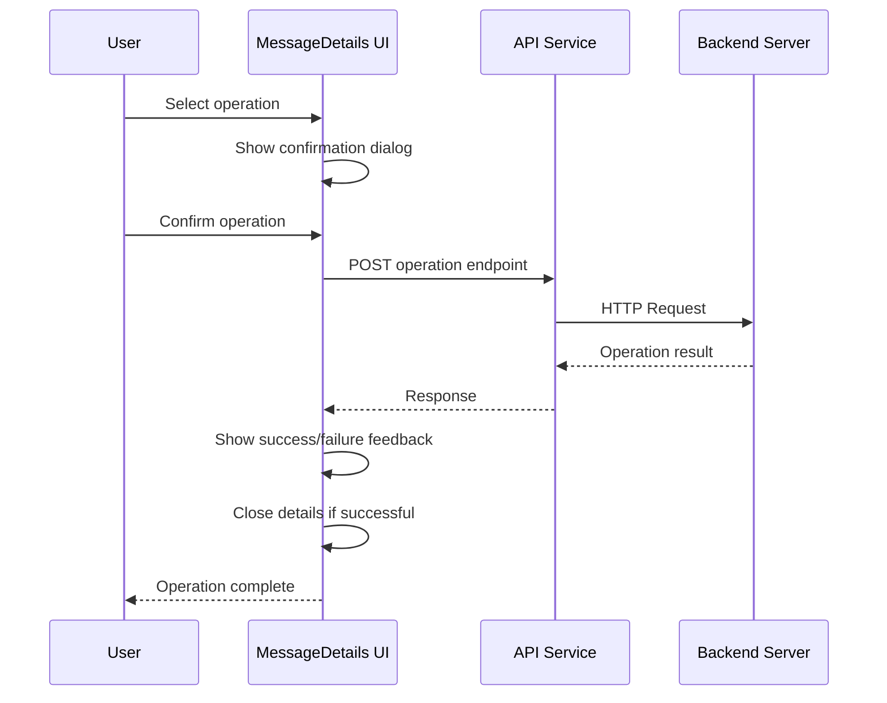

**Section sources**
- [MessageDetails.tsx](file://web/src/components/Queue/MessageDetails.tsx#L1-L199)

## BulkActions Component
The BulkActions component facilitates batch operations on multiple selected messages, providing progress tracking and result feedback.

### Key Features
- **Operation Selection**: Users can choose from deliver, freeze, thaw, or delete operations
- **Confirmation Workflow**: Prevents accidental bulk operations with confirmation dialogs
- **Progress Indication**: Shows real-time progress during long-running operations
- **Result Feedback**: Provides detailed feedback on operation success and failures

### State Management
The component manages several states:
- **Confirmation Dialog**: Controls visibility and operation type
- **Progress Indicator**: Shows operation progress for long-running operations
- **Result Feedback**: Displays final operation results with success/failure counts

### User Experience
The component enhances user experience by:
- **Preventing Accidental Operations**: Requiring explicit confirmation
- **Providing Clear Feedback**: Showing operation results with visual indicators
- **Supporting Operation Recovery**: Allowing users to continue working after operations

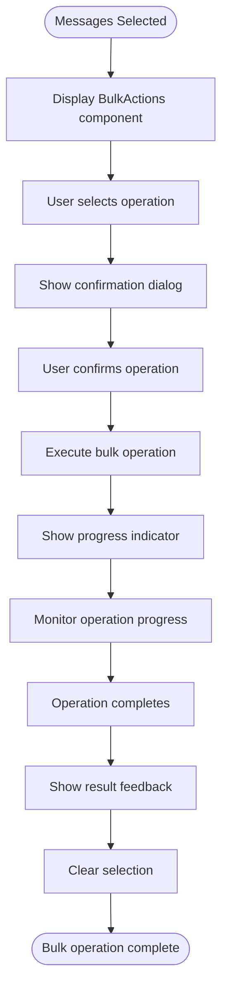

**Section sources**
- [BulkActions.tsx](file://web/src/components/Queue/BulkActions.tsx#L1-L199)

## State Management with useQueue Hook
The `useQueue` custom hook provides centralized state management and API integration for queue operations, serving as the bridge between UI components and backend services.

### State Variables
The hook manages the following state:
- **messages**: Array of current queue messages
- **metrics**: Queue metrics (total, deferred, frozen counts)
- **loading**: Loading state for data fetching
- **error**: Error state for failed operations

### Key Functions
The hook exposes several functions for queue operations:
- **fetchMessages**: Retrieves messages with filtering and pagination
- **fetchMetrics**: Gets current queue metrics
- **deliverMessage**: Forces immediate delivery of a message
- **freezeMessage**: Pauses a message to prevent delivery attempts
- **thawMessage**: Resumes a frozen message
- **deleteMessage**: Removes a message from the queue
- **bulkOperation**: Performs operations on multiple messages

### Auto-Refresh Mechanism
The hook implements automatic refreshing through two mechanisms:
- **WebSocket Integration**: Listens for queue update events and refreshes data
- **Interval-Based Refreshing**: Periodically fetches updated data at configurable intervals

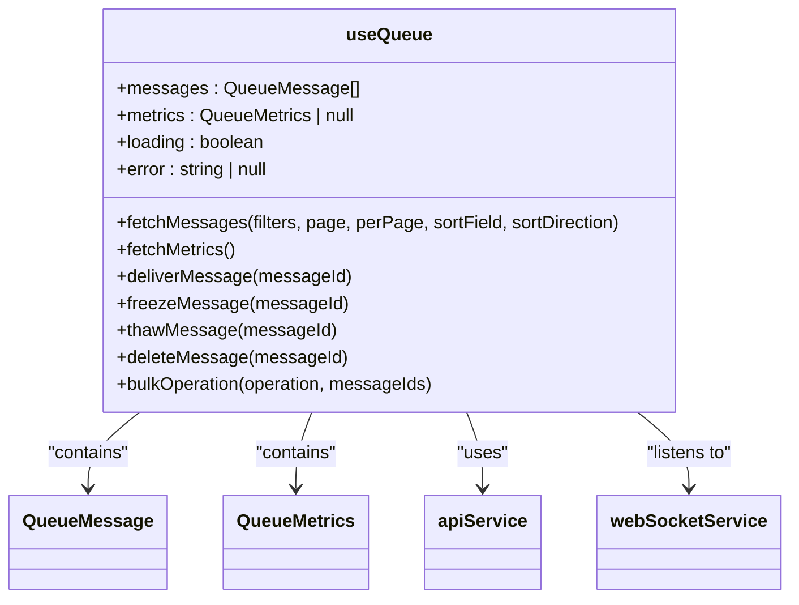

**Section sources**
- [useQueue.ts](file://web/src/hooks/useQueue.ts#L1-L180)

## API Service Integration
The API service provides a unified interface for HTTP communication with the backend, handling request formatting, error handling, and response parsing.

### Request Methods
The service implements standard HTTP methods:
- **GET**: Retrieves data from the server
- **POST**: Creates resources or performs operations
- **PUT**: Updates existing resources
- **DELETE**: Removes resources

### Error Handling
The service includes comprehensive error handling:
- **Network Errors**: Catches and reports network-level issues
- **HTTP Errors**: Handles non-2xx responses with appropriate error messages
- **JSON Parsing**: Validates and parses JSON responses safely
- **Authentication**: Includes credentials in requests for authenticated endpoints

### Queue Endpoints
Key endpoints for queue operations:
- **GET /v1/queue**: Retrieves paginated list of queue messages
- **GET /v1/queue/{id}**: Gets details of a specific message
- **POST /v1/queue/{id}/deliver**: Forces immediate delivery
- **POST /v1/queue/{id}/freeze**: Freezes a message
- **POST /v1/queue/{id}/thaw**: Thaws a frozen message
- **DELETE /v1/queue/{id}**: Deletes a message
- **POST /v1/queue/bulk**: Performs bulk operations

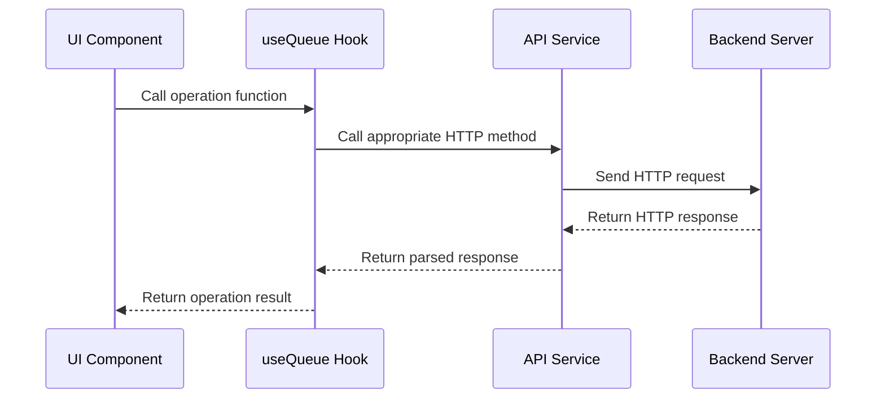

**Section sources**
- [api.ts](file://web/src/services/api.ts#L1-L118)

## Backend Implementation
The backend implementation handles queue operations through a layered architecture with API handlers, service layer, and queue manager.

### API Handlers
The `queue_handlers.go` file contains HTTP handlers for queue operations:
- **handleQueueDetails**: GET /v1/queue/{id} - Retrieves message details
- **handleQueueDeliver**: POST /v1/queue/{id}/deliver - Forces delivery
- **handleQueueFreeze**: POST /v1/queue/{id}/freeze - Freezes a message
- **handleQueueThaw**: POST /v1/queue/{id}/thaw - Thaws a message
- **handleQueueDelete**: DELETE /v1/queue/{id} - Deletes a message
- **handleQueueBulk**: POST /v1/queue/bulk - Performs bulk operations

### Service Layer
The `service.go` file implements business logic:
- **Service Struct**: Coordinates between manager and database
- **Operation Methods**: Delegates operations to the manager
- **Search Functionality**: Implements message filtering based on criteria
- **Validation**: Integrates with validation service

### Queue Manager
The `queue.go` file contains the core functionality:
- **ListQueue**: Executes `exim -bp` and parses output
- **InspectMessage**: Retrieves detailed message information
- **Operation Methods**: Executes Exim commands for deliver, freeze, thaw, delete
- **Parsing Utilities**: Parses queue output, message IDs, sizes, and ages

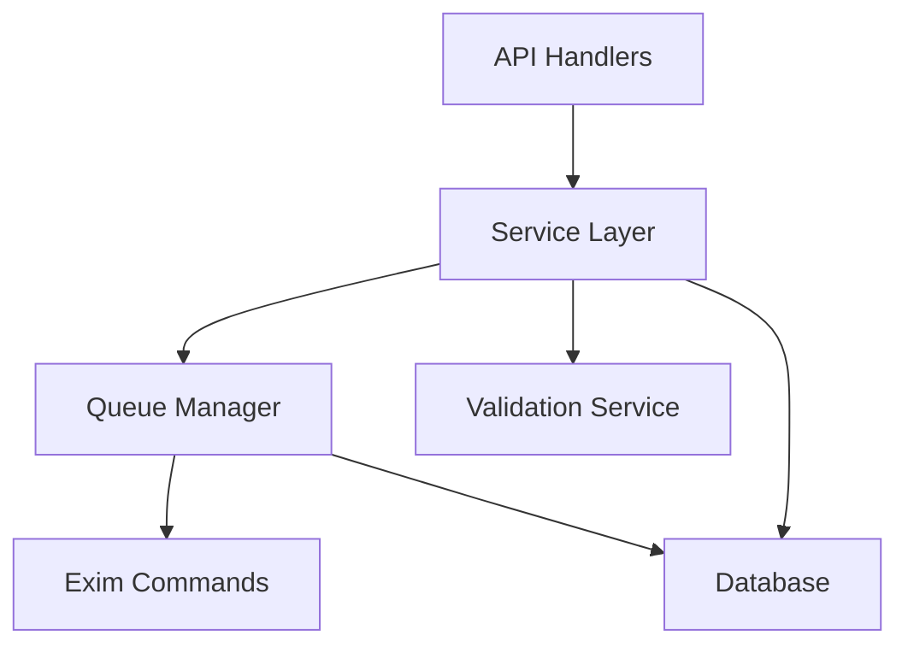

**Section sources**
- [queue_handlers.go](file://internal/api/queue_handlers.go#L100-L300)
- [service.go](file://internal/queue/service.go#L1-L199)
- [queue.go](file://internal/queue/queue.go#L1-L199)

## Performance Optimization
The queue management system implements several performance optimizations to handle large queues efficiently.

### Virtualized Rendering
The QueueList component supports virtualization through integration with `react-window`:
- **FixedSizeList**: Renders only visible items in the viewport
- **InfiniteLoader**: Loads additional pages as the user scrolls
- **Overscan**: Pre-renders a few items beyond the viewport for smooth scrolling

### Data Fetching Strategies
The system implements optimized data fetching:
- **Lazy Loading**: For virtualized lists, data is fetched as needed
- **Server-Side Pagination**: Reduces payload size for large queues
- **Caching**: API responses may be cached to reduce server load
- **WebSocket Updates**: Real-time updates without full list refreshes

### Frontend Optimizations
Additional frontend optimizations include:
- **Memoization**: Using `useMemo` and `useCallback` to prevent unnecessary re-renders
- **Component Splitting**: Breaking down large components for better re-render performance
- **Event Delegation**: Minimizing event listeners for better performance

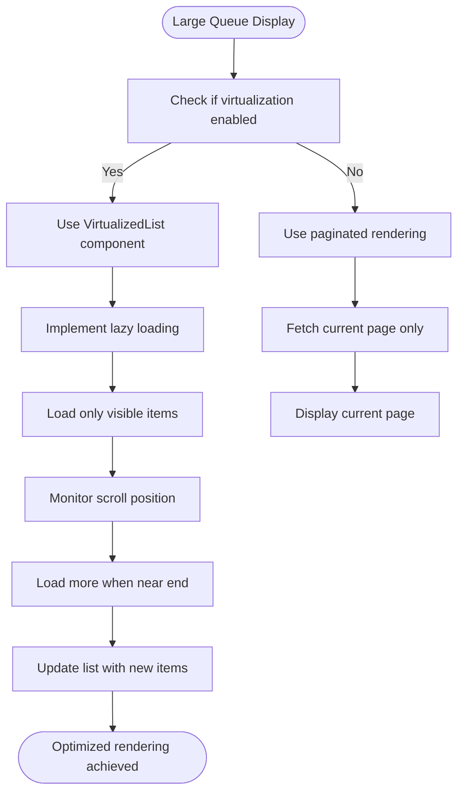

**Section sources**
- [VirtualizedList.tsx](file://web/src/components/Common/VirtualizedList.tsx#L1-L199)
- [QueueList.tsx](file://web/src/components/Queue/QueueList.tsx#L50-L100)

## Error Handling
The system implements comprehensive error handling across all layers to provide a robust user experience.

### Frontend Error Handling
The UI components handle errors through:
- **Loading States**: Clear indication when data is being fetched
- **Error Boundaries**: Prevents application crashes from component errors
- **User-Friendly Messages**: Translates technical errors into understandable messages
- **Retry Mechanisms**: Allows users to retry failed operations

### API Service Error Handling
The API service implements:
- **Try-Catch Blocks**: Wraps all HTTP requests in error handling
- **Response Validation**: Checks response status and content type
- **Error Propagation**: Preserves error information while adding context
- **Console Logging**: Logs errors for debugging purposes

### Backend Error Handling
The Go backend handles errors by:
- **Validation**: Checking input parameters before processing
- **Error Wrapping**: Adding context to errors while preserving original information
- **HTTP Status Codes**: Using appropriate status codes for different error types
- **Audit Logging**: Recording operations and errors for security and debugging

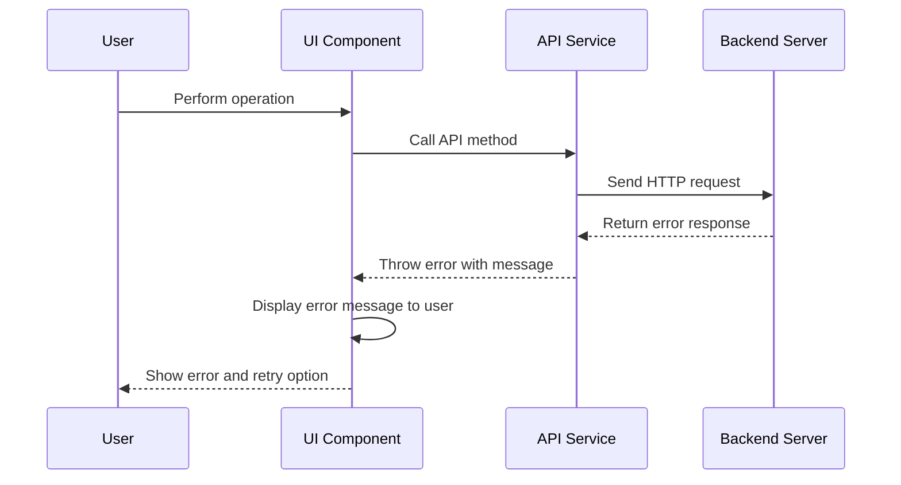

**Section sources**
- [api.ts](file://web/src/services/api.ts#L50-L100)
- [MessageDetails.tsx](file://web/src/components/Queue/MessageDetails.tsx#L150-L200)
- [useQueue.ts](file://web/src/hooks/useQueue.ts#L50-L100)

## Testing Guidance
The system includes frontend tests that provide guidance for development and ensure functionality correctness.

### Test Coverage
The `queue.spec.ts` file contains tests for:
- **Component Rendering**: Verifies that components render correctly
- **User Interactions**: Tests user actions like searching and selecting
- **Operation Workflows**: Validates the complete flow of queue operations
- **Error Scenarios**: Tests behavior when operations fail

### Development Guidance
The tests serve as documentation for expected behavior:
- **Usage Patterns**: Demonstrates how components should be used
- **Edge Cases**: Highlights handling of boundary conditions
- **Integration Points**: Shows how components interact with each other
- **API Contracts**: Documents expected API responses and error conditions

### Best Practices
Based on the test structure, recommended practices include:
- **Comprehensive Testing**: Cover all user workflows and edge cases
- **Realistic Data**: Use test data that reflects production scenarios
- **Integration Testing**: Test component interactions, not just isolated units
- **Performance Testing**: Include tests for large data sets and slow networks

**Section sources**
- [queue.spec.ts](file://tests/frontend/queue.spec.ts)

**Referenced Files in This Document**   
- [Queue.tsx](file://web/src/components/Queue/Queue.tsx)
- [QueueList.tsx](file://web/src/components/Queue/QueueList.tsx)
- [QueueSearch.tsx](file://web/src/components/Queue/QueueSearch.tsx)
- [MessageDetails.tsx](file://web/src/components/Queue/MessageDetails.tsx)
- [BulkActions.tsx](file://web/src/components/Queue/BulkActions.tsx)
- [useQueue.ts](file://web/src/hooks/useQueue.ts)
- [api.ts](file://web/src/services/api.ts)
- [queue_handlers.go](file://internal/api/queue_handlers.go)
- [service.go](file://internal/queue/service.go)
- [queue.go](file://internal/queue/queue.go)
- [queue.ts](file://web/src/types/queue.ts)
- [VirtualizedList.tsx](file://web/src/components/Common/VirtualizedList.tsx)
- [queue.spec.ts](file://tests/frontend/queue.spec.ts)