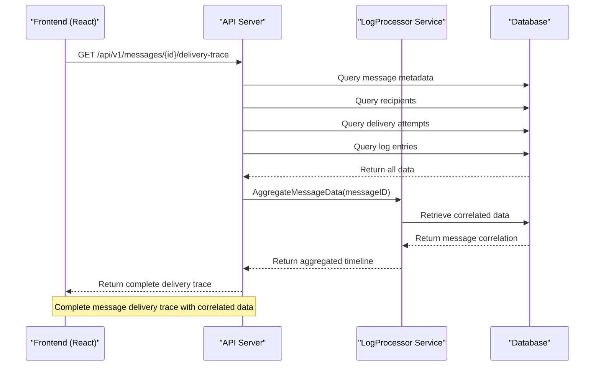
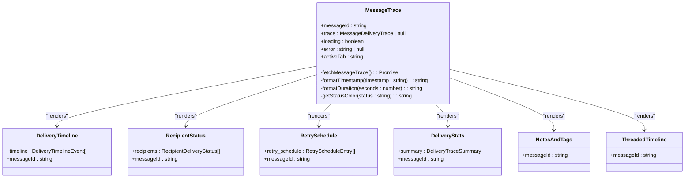
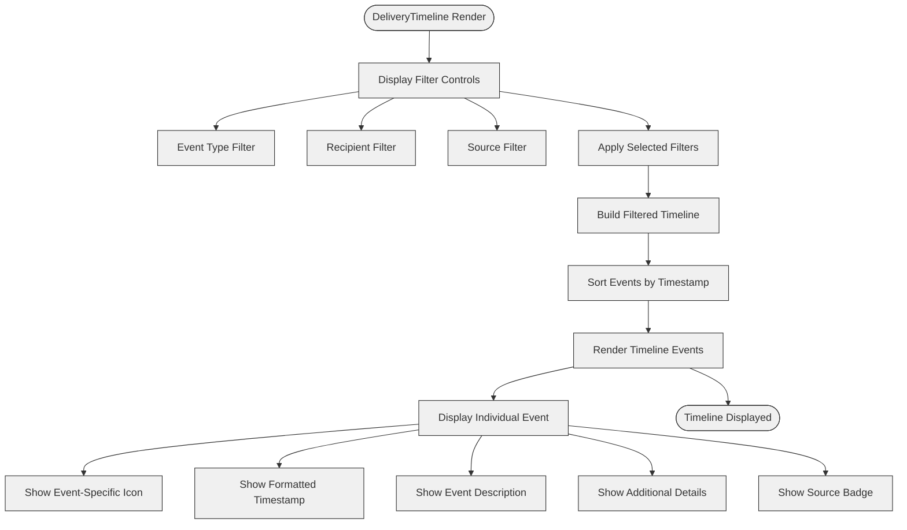
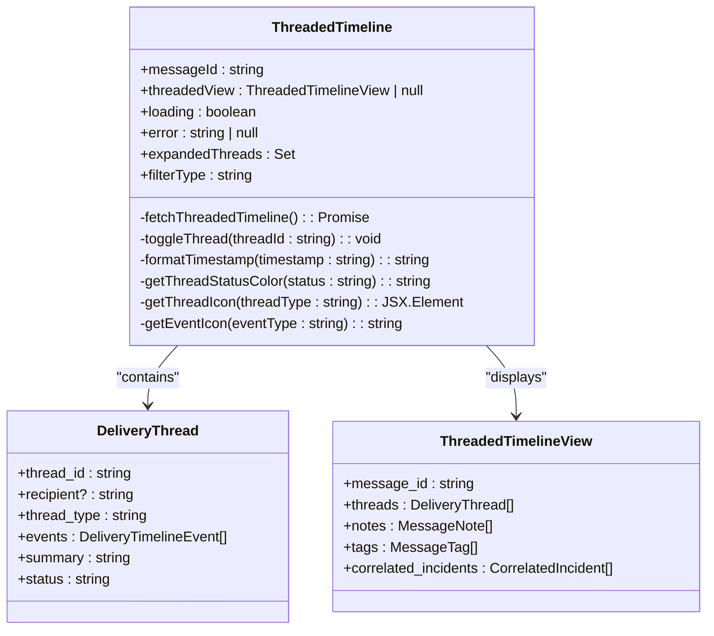
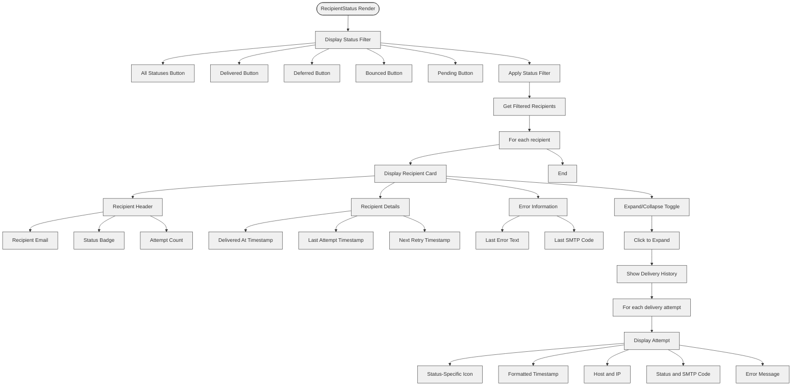
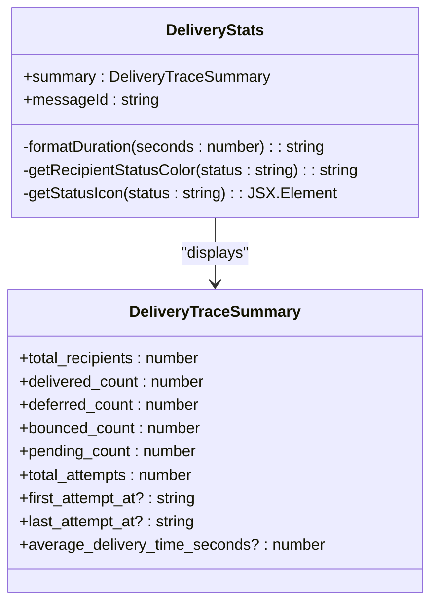
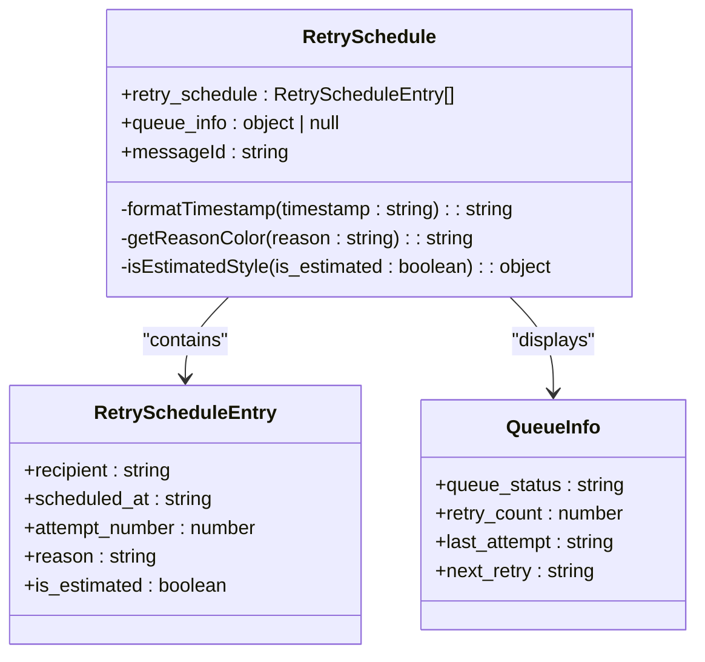
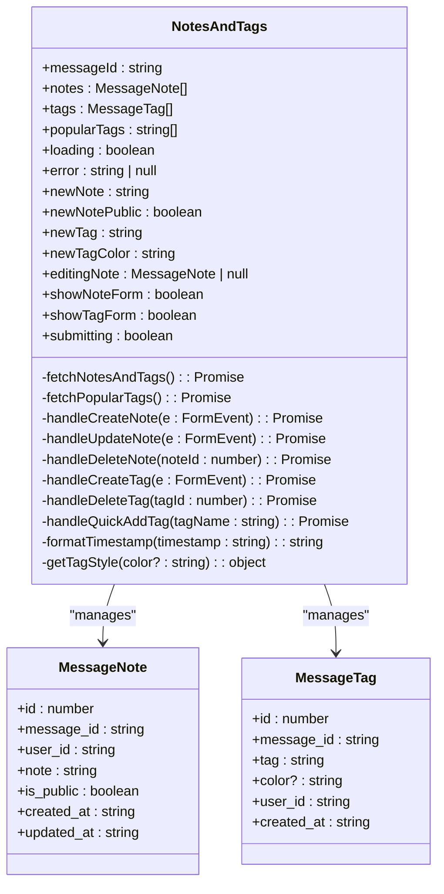

# Message Trace Components

## Table of Contents
1. [Introduction](#introduction)
2. [Core Components Overview](#core-components-overview)
3. [Data Correlation and Backend Integration](#data-correlation-and-backend-integration)
4. [MessageTrace: Main Container](#messagetrace-main-container)
5. [DeliveryTimeline: Chronological View](#deliverytimeline-chronological-view)
6. [ThreadedTimeline: Threaded View](#threadedtimeline-threaded-view)
7. [RecipientStatus: Per-Recipient Delivery Results](#recipientstatus-per-recipient-delivery-results)
8. [DeliveryStats: Summary Metrics](#deliverystats-summary-metrics)
9. [RetrySchedule: Retry Planning](#retryschedule-retry-planning)
10. [NotesAndTags: Annotation System](#notesandtags-annotation-system)
11. [Interactive Elements and User Experience](#interactive-elements-and-user-experience)
12. [Performance Considerations](#performance-considerations)

## Introduction
The Message Trace Components provide a comprehensive visualization system for email message delivery history and status within the Exim-Pilot application. This documentation details the architecture, functionality, and integration of components that enable administrators to trace message delivery, analyze delivery timelines, view recipient statuses, and annotate messages for troubleshooting purposes. The system correlates data from multiple sources including log entries, delivery attempts, and message metadata to provide a complete picture of message delivery history.

## Core Components Overview
The message tracing system consists of several React components that work together to visualize delivery history and status. These components are integrated through a main container and communicate with backend services via API endpoints. The core components include:

- **MessageTrace**: Main container component that orchestrates all tracing components
- **DeliveryTimeline**: Displays chronological delivery events with filtering capabilities
- **ThreadedTimeline**: Organizes delivery events by recipient threads for better visualization
- **RecipientStatus**: Shows per-recipient delivery results with detailed attempt history
- **DeliveryStats**: Displays summary metrics for message delivery performance
- **RetrySchedule**: Visualizes retry planning and scheduling information
- **NotesAndTags**: Provides annotation capabilities for user notes and message tagging

These components work together to provide a comprehensive view of message delivery history, enabling effective troubleshooting and analysis.

## Data Correlation and Backend Integration

**Diagram sources**
- [message_trace_handlers.go](file://internal/api/message_trace_handlers.go#L40-L100)
- [aggregator.go](file://internal/logprocessor/aggregator.go#L40-L150)
- [repository.go](file://internal/database/repository.go#L200-L300)

**Section sources**
- [message_trace_handlers.go](file://internal/api/message_trace_handlers.go#L40-L150)
- [aggregator.go](file://internal/logprocessor/aggregator.go#L40-L200)

The message tracing system integrates data from multiple sources to create a comprehensive delivery history. The backend correlates message metadata with log entries through the LogProcessor service, which aggregates data from the database to create a unified delivery trace. The MessageTraceRepository retrieves message data, recipients, delivery attempts, and log entries, then the LogAggregator builds a chronological timeline of events. This correlated data is exposed through REST API endpoints that the frontend components consume to render the delivery history.

## MessageTrace: Main Container

**Diagram sources**
- [MessageTrace.tsx](file://web/src/components/MessageTrace/MessageTrace.tsx#L20-L200)
- [DeliveryTimeline.tsx](file://web/src/components/MessageTrace/DeliveryTimeline.tsx#L10-L20)
- [RecipientStatus.tsx](file://web/src/components/MessageTrace/RecipientStatus.tsx#L10-L20)

**Section sources**
- [MessageTrace.tsx](file://web/src/components/MessageTrace/MessageTrace.tsx#L20-L300)

The MessageTrace component serves as the main container for all message tracing functionality. It fetches the complete delivery trace for a message from the backend API and renders various subcomponents based on the active tab. The component manages state for loading, error conditions, and user interactions. It provides shared utility functions for formatting timestamps and durations, and determining status colors. The MessageTrace component orchestrates the display of different views including timeline, recipients, retry schedule, statistics, notes, and threaded timeline, allowing users to switch between different perspectives of the message delivery history.

## DeliveryTimeline: Chronological View

**Diagram sources**
- [DeliveryTimeline.tsx](file://web/src/components/MessageTrace/DeliveryTimeline.tsx#L20-L200)

**Section sources**
- [DeliveryTimeline.tsx](file://web/src/components/MessageTrace/DeliveryTimeline.tsx#L20-L250)

The DeliveryTimeline component renders a chronological view of all delivery events for a message. It displays events in a vertical timeline format with appropriate icons based on event type (arrival, delivery, defer, bounce, etc.). The component includes filtering capabilities that allow users to filter events by event type, recipient, and source. Each event in the timeline shows the timestamp, description, and relevant details such as host, IP address, SMTP code, and error text when available. Source badges indicate whether an event originated from logs, the queue, or audit records. The timeline is interactive, allowing users to focus on specific aspects of the delivery history by applying filters and clearing them as needed.

## ThreadedTimeline: Threaded View

**Diagram sources**
- [ThreadedTimeline.tsx](file://web/src/components/MessageTrace/ThreadedTimeline.tsx#L20-L200)

**Section sources**
- [ThreadedTimeline.tsx](file://web/src/components/MessageTrace/ThreadedTimeline.tsx#L20-L300)

The ThreadedTimeline component organizes delivery events by recipient threads, providing a more focused view of delivery attempts for each recipient. Each thread represents a specific recipient or delivery context and contains a sequence of related events. Users can expand or collapse individual threads to focus on specific recipients. The component includes filtering by thread type (recipient, host, system) to help users navigate complex delivery histories. Each event in a thread is displayed with an emoji icon representing the event type, making it easy to quickly identify the nature of each delivery attempt. The threaded view is particularly useful for analyzing delivery patterns and identifying issues specific to certain recipients or delivery paths.

## RecipientStatus: Per-Recipient Delivery Results

**Diagram sources**
- [RecipientStatus.tsx](file://web/src/components/MessageTrace/RecipientStatus.tsx#L20-L200)

**Section sources**
- [RecipientStatus.tsx](file://web/src/components/MessageTrace/RecipientStatus.tsx#L20-L250)

The RecipientStatus component displays delivery results for each recipient of a message. It provides a filterable list of recipients grouped by their delivery status (delivered, deferred, bounced, pending). Each recipient is displayed in a card format showing their email address, current status, number of delivery attempts, and key timestamps (delivered at, last attempt, next retry). If a delivery error occurred, the last error text and SMTP code are prominently displayed. Users can expand each recipient card to view the complete delivery history with detailed information about each delivery attempt, including timestamps, hosts, IP addresses, status codes, and error messages. This component is essential for identifying delivery issues affecting specific recipients.

## DeliveryStats: Summary Metrics

**Diagram sources**
- [DeliveryStats.tsx](file://web/src/components/MessageTrace/DeliveryStats.tsx#L10-L50)
- [models.go](file://internal/database/models.go#L200-L220)

**Section sources**
- [DeliveryStats.tsx](file://web/src/components/MessageTrace/DeliveryStats.tsx#L10-L100)

The DeliveryStats component displays summary metrics for message delivery performance. It presents key statistics including the total number of recipients and the count of recipients in each status category (delivered, deferred, bounced, pending). The component also shows the total number of delivery attempts, the time range of delivery attempts (first and last), and the average delivery time. Status badges with appropriate colors and icons provide a quick visual indication of delivery success rates. These summary metrics give users an immediate overview of the message's delivery performance, helping them quickly assess whether the message was successfully delivered or if there are significant delivery issues that require attention.

## RetrySchedule: Retry Planning

**Diagram sources**
- [RetrySchedule.tsx](file://web/src/components/MessageTrace/RetrySchedule.tsx#L10-L50)
- [message_trace_handlers.go](file://internal/api/message_trace_handlers.go#L150-L200)

**Section sources**
- [RetrySchedule.tsx](file://web/src/components/MessageTrace/RetrySchedule.tsx#L10-L150)

The RetrySchedule component visualizes the retry planning for deferred message deliveries. It displays a list of scheduled retry attempts for each recipient, showing the scheduled time, attempt number, and reason for the retry. Entries marked as "estimated" are visually distinguished from actual scheduled retries. The component also displays queue information when available, including the current queue status, retry count, last attempt time, and next scheduled retry. This information helps administrators understand the retry strategy for deferred messages and anticipate when delivery attempts will be made. The retry schedule is crucial for troubleshooting delivery issues and understanding the system's recovery mechanisms for temporary delivery failures.

## NotesAndTags: Annotation System

**Diagram sources**
- [NotesAndTags.tsx](file://web/src/components/MessageTrace/NotesAndTags.tsx#L20-L200)
- [schema.go](file://internal/database/schema.go#L150-L170)

**Section sources**
- [NotesAndTags.tsx](file://web/src/components/MessageTrace/NotesAndTags.tsx#L20-L400)

The NotesAndTags component provides an annotation system that allows users to add notes and tags to messages for documentation and categorization purposes. Users can create, edit, and delete notes, with the option to mark notes as public or private. The component also supports tagging messages with custom tags, either by creating new tags or selecting from popular tags used across the system. Tags can be color-coded for visual distinction. The annotation system facilitates collaboration by allowing team members to document their findings, share troubleshooting insights, and categorize messages for easier filtering and reporting. These annotations persist with the message and are available to all users with appropriate permissions.

## Interactive Elements and User Experience
The message tracing components incorporate several interactive elements to enhance user experience and facilitate troubleshooting:

- **Tabbed Interface**: The main MessageTrace component uses tabs to organize different views (timeline, recipients, retry, stats, notes, threaded), allowing users to switch between perspectives without losing context.
- **Filtering Controls**: Multiple components provide filtering capabilities, enabling users to focus on specific aspects of the delivery history by event type, recipient, status, or source.
- **Expandable Sections**: Components like RecipientStatus and ThreadedTimeline use expandable sections to show detailed information on demand, preventing information overload while maintaining access to complete data.
- **Form Interactions**: The NotesAndTags component includes forms for creating and editing notes and tags, with appropriate validation and error handling.
- **Visual Indicators**: Color-coded status badges, event-specific icons, and emoji indicators provide immediate visual feedback about delivery status and event types.
- **Loading States**: Components display loading spinners during data retrieval and error messages when requests fail, providing clear feedback about the application state.

These interactive elements work together to create an intuitive user experience that enables efficient analysis of message delivery history, even for complex cases with multiple recipients and numerous delivery attempts.

## Performance Considerations
The message tracing system is designed with performance in mind, particularly when handling complex delivery histories with numerous events:

- **Data Fetching**: The main MessageTrace component fetches all necessary data in a single API call to minimize network requests and reduce latency.
- **Client-Side Filtering**: Filtering operations are performed on the client side after data retrieval, allowing for responsive interactions without additional server requests.
- **Conditional Rendering**: Components use conditional rendering to only display relevant information, reducing the DOM size and improving rendering performance.
- **Efficient Data Structures**: The backend uses optimized database queries and indexes to quickly retrieve and correlate message data from multiple tables.
- **Pagination and Limits**: While not explicitly shown in the provided components, the system likely implements pagination or limits for very large datasets to prevent performance degradation.
- **Caching**: The API layer may implement caching for frequently accessed message traces to reduce database load and improve response times.

For extremely complex delivery histories, the system could be enhanced with virtualized lists to render only visible items, further improving performance when dealing with hundreds or thousands of delivery events.

**Referenced Files in This Document**   
- [MessageTrace.tsx](file://web/src/components/MessageTrace/MessageTrace.tsx)
- [DeliveryTimeline.tsx](file://web/src/components/MessageTrace/DeliveryTimeline.tsx)
- [ThreadedTimeline.tsx](file://web/src/components/MessageTrace/ThreadedTimeline.tsx)
- [RecipientStatus.tsx](file://web/src/components/MessageTrace/RecipientStatus.tsx)
- [DeliveryStats.tsx](file://web/src/components/MessageTrace/DeliveryStats.tsx)
- [RetrySchedule.tsx](file://web/src/components/MessageTrace/RetrySchedule.tsx)
- [NotesAndTags.tsx](file://web/src/components/MessageTrace/NotesAndTags.tsx)
- [message_trace_handlers.go](file://internal/api/message_trace_handlers.go)
- [models.go](file://internal/database/models.go)
- [repository.go](file://internal/database/repository.go)
- [schema.go](file://internal/database/schema.go)
- [service.go](file://internal/logprocessor/service.go)
- [aggregator.go](file://internal/logprocessor/aggregator.go)