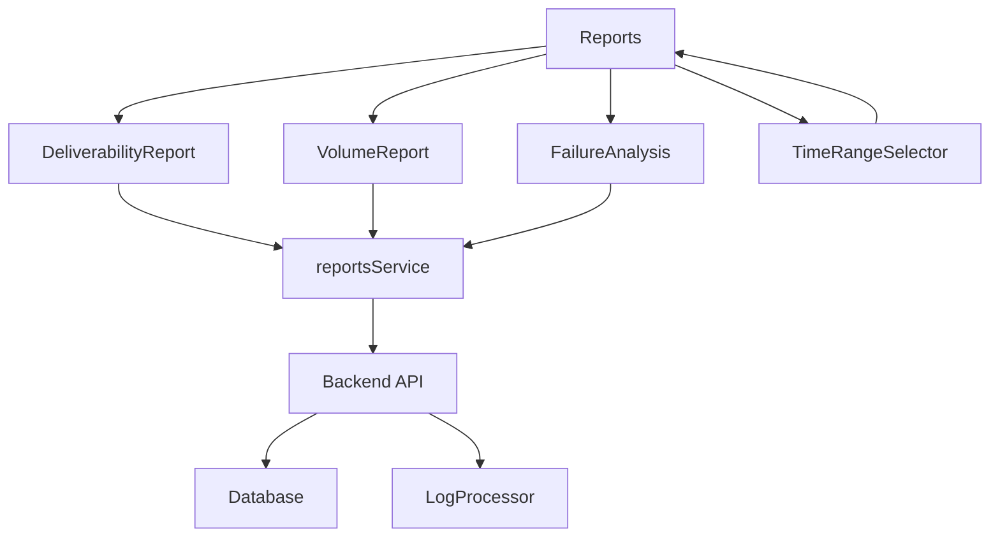
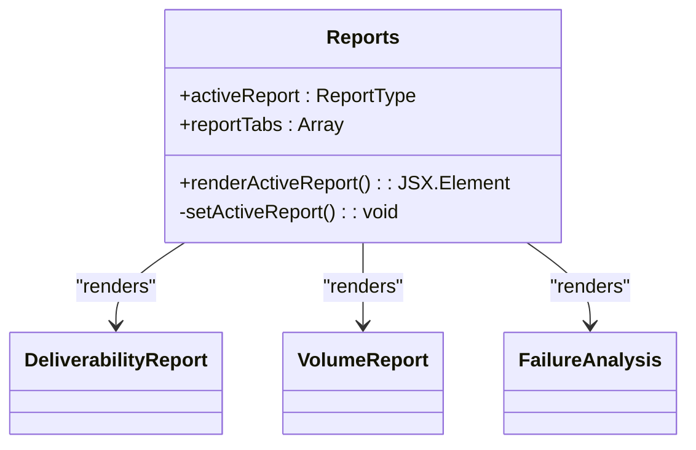
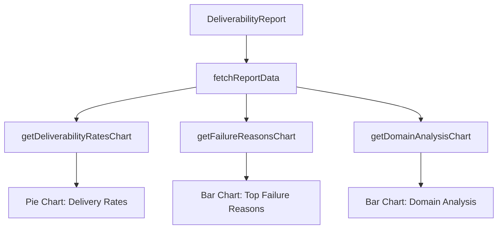
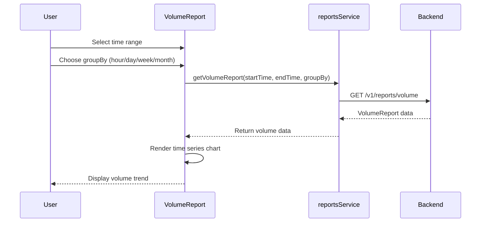
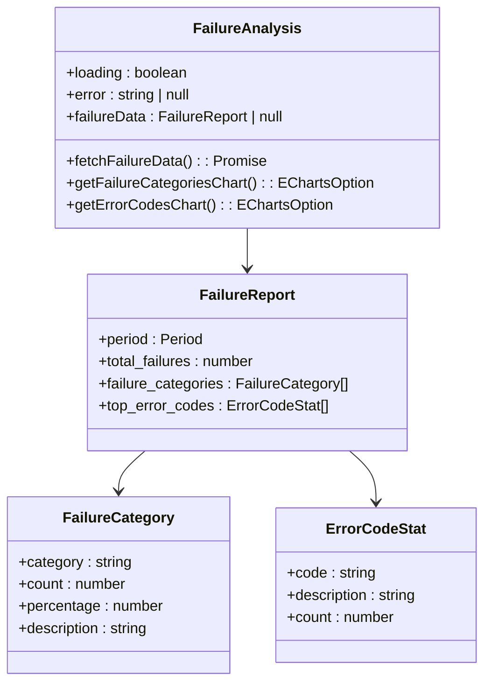
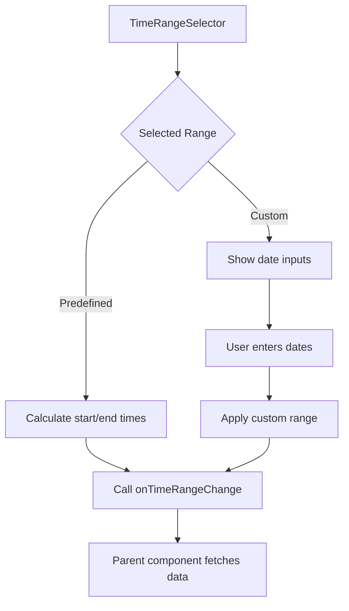
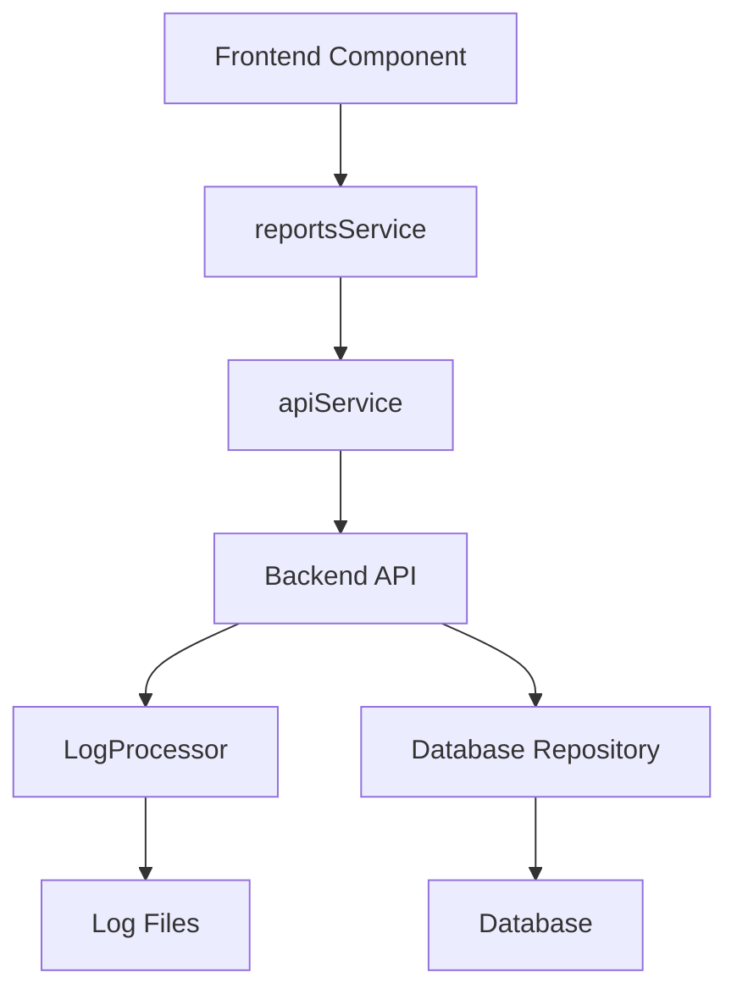
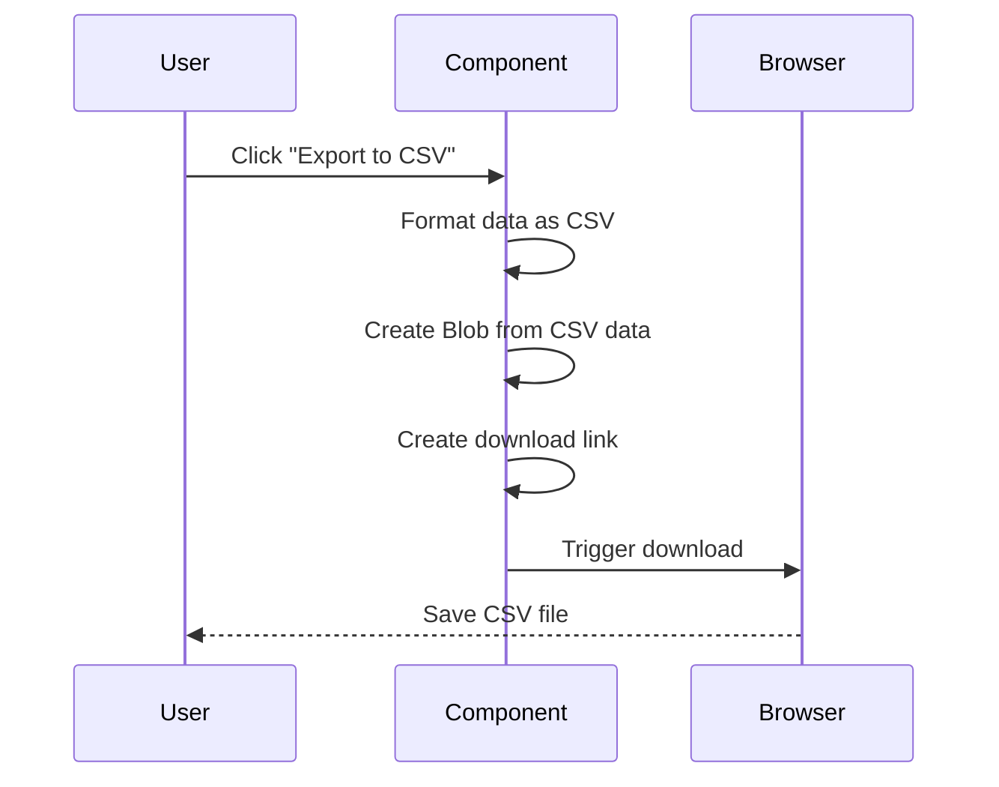

# Reports Components


## Table of Contents
1. [Introduction](#introduction)
2. [Core Components Overview](#core-components-overview)
3. [Main Reports Interface](#main-reports-interface)
4. [Deliverability Report](#deliverability-report)
5. [Volume Report](#volume-report)
6. [Failure Analysis Report](#failure-analysis-report)
7. [Time Range Filtering](#time-range-filtering)
8. [Data Aggregation and Backend Services](#data-aggregation-and-backend-services)
9. [Charting Implementation](#charting-implementation)
10. [Export Functionality](#export-functionality)
11. [Performance Considerations](#performance-considerations)

## Introduction
The Reports Components in the Exim-Pilot system provide comprehensive analytics for email deliverability, volume trends, and failure analysis. These components enable administrators to monitor and analyze email delivery performance through interactive visualizations and detailed metrics. The reporting system is designed with a modular architecture that separates concerns between data retrieval, visualization, and user interaction. This documentation provides a detailed analysis of the reporting components, their implementation, and integration with backend services.

## Core Components Overview
The reporting system consists of several key components that work together to provide insights into email delivery performance. The main components include the Reports container, DeliverabilityReport, VolumeReport, FailureAnalysis, and TimeRangeSelector. These components are supported by service layers that handle API communication and type definitions that ensure data consistency across the application.





**Diagram sources**
- [Reports.tsx](file://web/src/components/Reports/Reports.tsx)
- [reports.ts](file://web/src/services/reports.ts)
- [reports_handlers.go](file://internal/api/reports_handlers.go)

**Section sources**
- [Reports.tsx](file://web/src/components/Reports/Reports.tsx)
- [DeliverabilityReport.tsx](file://web/src/components/Reports/DeliverabilityReport.tsx)
- [VolumeReport.tsx](file://web/src/components/Reports/VolumeReport.tsx)
- [FailureAnalysis.tsx](file://web/src/components/Reports/FailureAnalysis.tsx)

## Main Reports Interface
The Reports component serves as the primary interface for accessing different types of analytics. It implements a tab-based navigation system that allows users to switch between deliverability, volume, and failure analysis reports. The component manages the active report state and renders the appropriate report component based on user selection.





**Diagram sources**
- [Reports.tsx](file://web/src/components/Reports/Reports.tsx#L1-L60)

**Section sources**
- [Reports.tsx](file://web/src/components/Reports/Reports.tsx#L1-L60)

## Deliverability Report
The DeliverabilityReport component provides insights into email delivery success rates, including delivery, deferral, bounce, and rejection metrics. It displays key deliverability indicators through pie charts and bar graphs, enabling users to quickly assess email delivery performance.

### Key Metrics Visualization
The component visualizes deliverability metrics using ECharts, with different chart types for various data representations:





**Diagram sources**
- [DeliverabilityReport.tsx](file://web/src/components/Reports/DeliverabilityReport.tsx#L50-L150)

**Section sources**
- [DeliverabilityReport.tsx](file://web/src/components/Reports/DeliverabilityReport.tsx#L1-L200)

### Data Structure
The deliverability report uses a structured data format that includes overall metrics, failure reasons, and domain analysis:


```typescript
interface DeliverabilityReport {
  period: Period;
  total_messages: number;
  delivered_count: number;
  deferred_count: number;
  bounced_count: number;
  rejected_count: number;
  delivery_rate: number;
  deferral_rate: number;
  bounce_rate: number;
  rejection_rate: number;
  top_failure_reasons: FailureReason[];
}
```


## Volume Report
The VolumeReport component analyzes email volume trends over time, providing insights into message throughput patterns. It supports different time grouping options (hour, day, week, month) to enable detailed analysis of volume patterns.

### Time Series Analysis
The component implements time series analysis with flexible grouping options:





**Diagram sources**
- [VolumeReport.tsx](file://web/src/components/Reports/VolumeReport.tsx#L1-L200)
- [reports.ts](file://web/src/services/reports.ts#L20-L30)
- [reports_handlers.go](file://internal/api/reports_handlers.go#L100-L150)

**Section sources**
- [VolumeReport.tsx](file://web/src/components/Reports/VolumeReport.tsx#L1-L200)

### Visualization Components
The VolumeReport includes two primary visualizations:
1. **Volume Trend Line Chart**: Shows message volume over time with smooth line interpolation
2. **Volume Distribution Bar Chart**: Displays message volume by hour of day to identify peak sending periods

## Failure Analysis Report
The FailureAnalysis component provides detailed categorization of email delivery failures, helping administrators identify and address delivery issues. It breaks down failures into categories and identifies the most common error codes.

### Failure Categorization
The component implements a comprehensive failure categorization system:





**Diagram sources**
- [FailureAnalysis.tsx](file://web/src/components/Reports/FailureAnalysis.tsx#L1-L50)
- [reports.ts](file://web/src/types/reports.ts#L50-L80)

**Section sources**
- [FailureAnalysis.tsx](file://web/src/components/Reports/FailureAnalysis.tsx#L1-L200)

## Time Range Filtering
The TimeRangeSelector component provides a consistent interface for time-based filtering across all reports. It supports predefined time ranges and custom date selection, ensuring users can analyze data for specific periods.

### Time Range Options
The component implements a configurable set of time range options:


```typescript
export const TIME_RANGE_OPTIONS: TimeRangeOption[] = [
  { label: 'Last 24 hours', value: '1d', days: 1 },
  { label: 'Last 3 days', value: '3d', days: 3 },
  { label: 'Last 7 days', value: '7d', days: 7 },
  { label: 'Last 30 days', value: '30d', days: 30 },
  { label: 'Last 90 days', value: '90d', days: 90 },
  { label: 'Custom', value: 'custom', days: 0 },
];
```


### Filtering Workflow
The time range selection process follows a standardized workflow:





**Diagram sources**
- [TimeRangeSelector.tsx](file://web/src/components/Reports/TimeRangeSelector.tsx#L1-L100)

**Section sources**
- [TimeRangeSelector.tsx](file://web/src/components/Reports/TimeRangeSelector.tsx#L1-L120)

## Data Aggregation and Backend Services
The reporting system relies on backend services to aggregate data from logs and database records. The reports_service module handles API communication, while backend handlers process requests and generate reports.

### Service Layer Architecture
The service layer implements a clean separation between frontend components and backend APIs:





**Diagram sources**
- [reports.ts](file://web/src/services/reports.ts)
- [reports_handlers.go](file://internal/api/reports_handlers.go)

**Section sources**
- [reports.ts](file://web/src/services/reports.ts#L1-L50)
- [reports_handlers.go](file://internal/api/reports_handlers.go#L1-L100)

### Backend Report Generation
The backend implements report generation methods that aggregate data from log statistics:


```go
func (h *ReportsHandlers) generateDeliverabilityReport(ctx context.Context, startTime, endTime time.Time) (*DeliverabilityReport, error) {
    logStats, err := h.logService.GetLogStatistics(ctx, startTime, endTime)
    if err != nil {
        return nil, err
    }
    
    report := &DeliverabilityReport{
        Period: Period{Start: startTime, End: endTime},
        TotalMessages: logStats.TotalEntries,
        // ... calculate rates
    }
    
    return report, nil
}
```


## Charting Implementation
The reporting components use ECharts for data visualization, providing interactive and responsive charts. Each report implements specific chart configurations tailored to the data being presented.

### Chart Configuration Pattern
The components follow a consistent pattern for chart configuration:


```typescript
const getDeliverabilityRatesChart = (): EChartsOption => {
    if (!deliverabilityData) return {};
    
    return {
        title: { text: 'Deliverability Rates', left: 'center' },
        tooltip: { trigger: 'item', formatter: '{a} <br/>{b}: {c}% ({d}%)' },
        legend: { orient: 'vertical', left: 'left' },
        series: [{
            name: 'Deliverability',
            type: 'pie',
            radius: '50%',
            data: [
                { value: deliverabilityData.delivery_rate, name: 'Delivered', itemStyle: { color: '#10b981' } },
                // ... other data points
            ]
        }]
    };
};
```


**Section sources**
- [DeliverabilityReport.tsx](file://web/src/components/Reports/DeliverabilityReport.tsx#L50-L100)
- [VolumeReport.tsx](file://web/src/components/Reports/VolumeReport.tsx#L50-L100)
- [FailureAnalysis.tsx](file://web/src/components/Reports/FailureAnalysis.tsx#L50-L100)

## Export Functionality
All reporting components include CSV export functionality, allowing users to download report data for offline analysis. The export feature formats data in a structured CSV format with appropriate headers and formatting.

### Export Implementation
The export functionality follows a consistent implementation pattern across components:





**Diagram sources**
- [DeliverabilityReport.tsx](file://web/src/components/Reports/DeliverabilityReport.tsx#L180-L250)
- [VolumeReport.tsx](file://web/src/components/Reports/VolumeReport.tsx#L150-L200)
- [FailureAnalysis.tsx](file://web/src/components/Reports/FailureAnalysis.tsx#L120-L180)

**Section sources**
- [DeliverabilityReport.tsx](file://web/src/components/Reports/DeliverabilityReport.tsx#L180-L250)

## Performance Considerations
The reporting system implements several performance optimizations to handle large datasets efficiently:

### Data Fetching Strategy
The components use concurrent data fetching to minimize load times:


```typescript
const fetchReportData = async (startTime: string, endTime: string) => {
    setLoading(true);
    setError(null);
    
    try {
        const [deliverabilityResponse, topSendersResponse, topRecipientsResponse, domainAnalysisResponse] = 
            await Promise.all([
                reportsService.getDeliverabilityReport(startTime, endTime),
                reportsService.getTopSendersReport(startTime, endTime, 10),
                reportsService.getTopRecipientsReport(startTime, endTime, 10),
                reportsService.getDomainAnalysis(startTime, endTime, 'both', 10),
            ]);
        
        // Process responses
    } catch (err) {
        setError(err instanceof Error ? err.message : 'Failed to fetch report data');
    } finally {
        setLoading(false);
    }
};
```


### Backend Validation
The backend includes validation to prevent excessive resource usage:


```go
// ValidateTimeRange validates time range parameters
func (s *Service) ValidateTimeRange(startTime, endTime *time.Time) error {
    if startTime != nil && endTime != nil {
        if startTime.After(*endTime) {
            return &ValidationError{
                Field:   "time_range",
                Message: "start time must be before end time",
            }
        }
        
        // Prevent excessively large time ranges (more than 1 year)
        if endTime.Sub(*startTime) > 365*24*time.Hour {
            return &ValidationError{
                Field:   "time_range",
                Message: "time range too large (max 1 year)",
            }
        }
    }
    
    return nil
}
```


**Section sources**
- [DeliverabilityReport.tsx](file://web/src/components/Reports/DeliverabilityReport.tsx#L30-L50)
- [reports_handlers.go](file://internal/api/reports_handlers.go#L250-L299)

**Referenced Files in This Document**   
- [Reports.tsx](file://web/src/components/Reports/Reports.tsx)
- [DeliverabilityReport.tsx](file://web/src/components/Reports/DeliverabilityReport.tsx)
- [VolumeReport.tsx](file://web/src/components/Reports/VolumeReport.tsx)
- [FailureAnalysis.tsx](file://web/src/components/Reports/FailureAnalysis.tsx)
- [TimeRangeSelector.tsx](file://web/src/components/Reports/TimeRangeSelector.tsx)
- [reports.ts](file://web/src/services/reports.ts)
- [reports_handlers.go](file://internal/api/reports_handlers.go)
- [reports.ts](file://web/src/types/reports.ts)