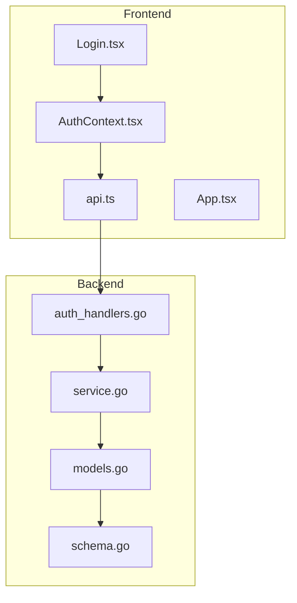
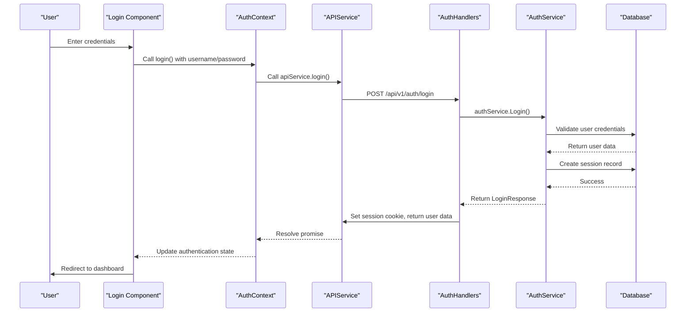
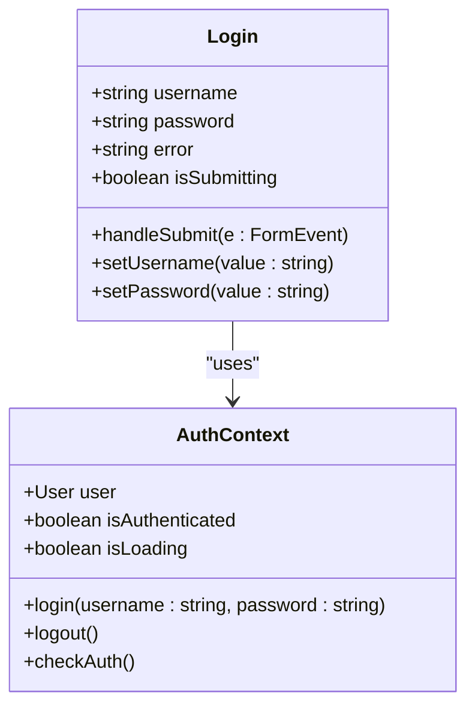
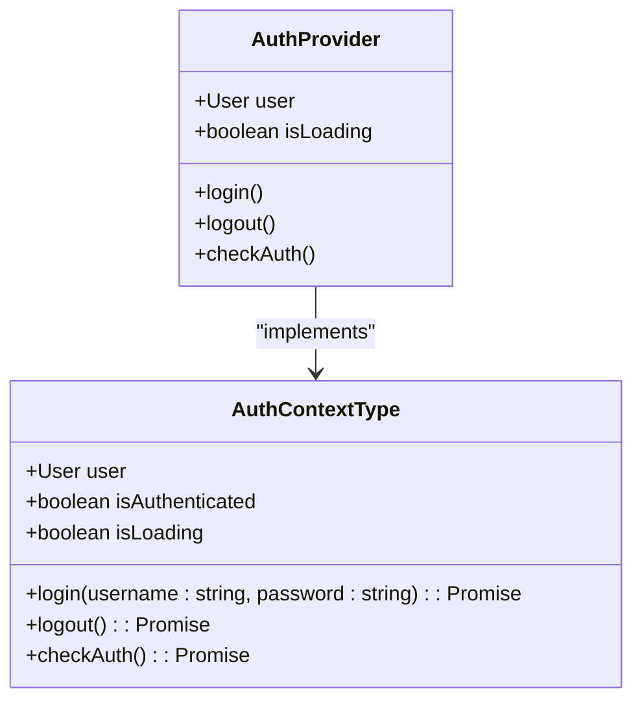
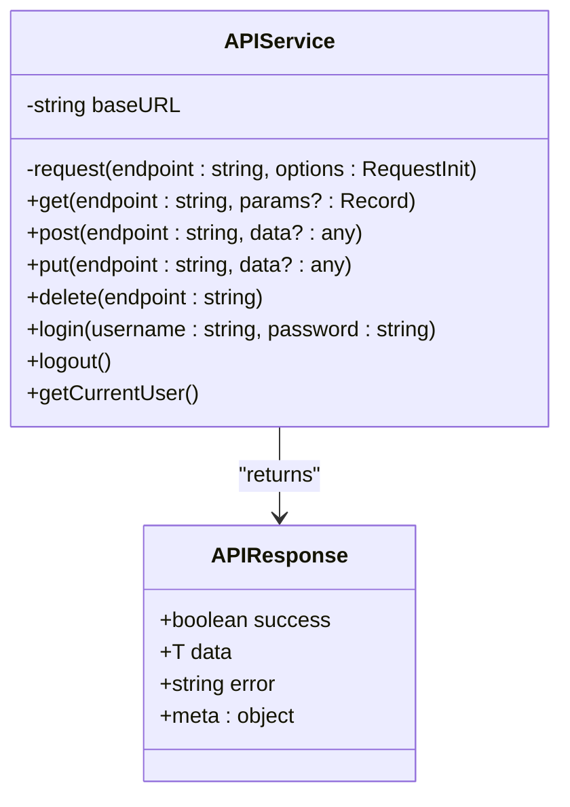
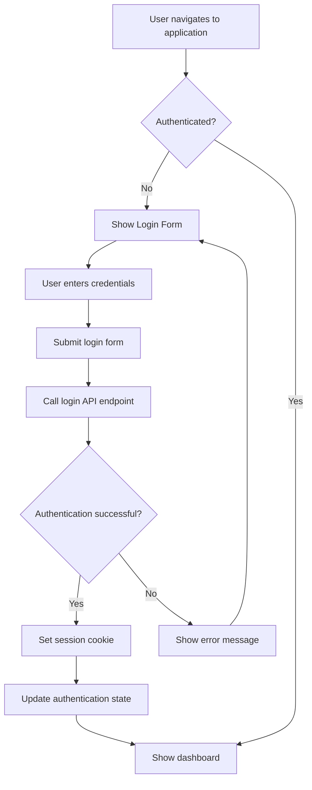

# Authentication Components


## Table of Contents
1. [Introduction](#introduction)
2. [Project Structure](#project-structure)
3. [Core Components](#core-components)
4. [Architecture Overview](#architecture-overview)
5. [Detailed Component Analysis](#detailed-component-analysis)
6. [Authentication Flow](#authentication-flow)
7. [Security Considerations](#security-considerations)
8. [Session Handling](#session-handling)
9. [Error Handling](#error-handling)
10. [Component Export and Accessibility](#component-export-and-accessibility)

## Introduction
This document provides a comprehensive analysis of the authentication UI components in the Exim Pilot application, with a primary focus on the login functionality. The system implements a secure, stateful authentication workflow using React for the frontend, Go for the backend API, and SQLite for data persistence. The documentation covers the complete authentication lifecycle including credential input, form validation, API integration, session management, and security protections.

## Project Structure
The authentication components are organized in a feature-based structure within the frontend codebase, with corresponding backend services and models. The frontend components are located in the `web/src/components/Auth` directory, while the backend authentication logic resides in the `internal/auth` package.





**Diagram sources**
- [Login.tsx](file://web/src/components/Auth/Login.tsx)
- [AuthContext.tsx](file://web/src/context/AuthContext.tsx)
- [api.ts](file://web/src/services/api.ts)
- [auth_handlers.go](file://internal/api/auth_handlers.go)
- [service.go](file://internal/auth/service.go)

**Section sources**
- [Login.tsx](file://web/src/components/Auth/Login.tsx)
- [AuthContext.tsx](file://web/src/context/AuthContext.tsx)
- [api.ts](file://web/src/services/api.ts)
- [auth_handlers.go](file://internal/api/auth_handlers.go)
- [service.go](file://internal/auth/service.go)

## Core Components
The authentication system consists of several key components that work together to provide secure user authentication:

- **Login.tsx**: React component for credential input and form handling
- **AuthContext.tsx**: Context provider for authentication state management
- **api.ts**: Service layer for API requests
- **auth_handlers.go**: Backend HTTP handlers for authentication endpoints
- **service.go**: Business logic for authentication operations

These components follow a layered architecture with clear separation of concerns, where the UI layer handles user interaction, the context layer manages application state, the service layer handles API communication, and the backend implements business logic and data persistence.

**Section sources**
- [Login.tsx](file://web/src/components/Auth/Login.tsx)
- [AuthContext.tsx](file://web/src/context/AuthContext.tsx)
- [api.ts](file://web/src/services/api.ts)
- [service.go](file://internal/auth/service.go)

## Architecture Overview
The authentication system follows a client-server architecture with stateful session management. The frontend React application communicates with the backend Go API through RESTful endpoints, with authentication state maintained via HTTP cookies.





**Diagram sources**
- [Login.tsx](file://web/src/components/Auth/Login.tsx#L15-L50)
- [AuthContext.tsx](file://web/src/context/AuthContext.tsx#L35-L55)
- [api.ts](file://web/src/services/api.ts#L80-L95)
- [auth_handlers.go](file://internal/api/auth_handlers.go#L48-L100)
- [service.go](file://internal/auth/service.go#L50-L86)

## Detailed Component Analysis

### Login Component Analysis
The Login component is a React functional component that handles user credential input and form submission. It uses React hooks for state management and integrates with the AuthContext for authentication operations.





**Diagram sources**
- [Login.tsx](file://web/src/components/Auth/Login.tsx#L1-L92)
- [AuthContext.tsx](file://web/src/context/AuthContext.tsx#L1-L81)

**Section sources**
- [Login.tsx](file://web/src/components/Auth/Login.tsx#L1-L92)

#### Form Handling and Validation
The Login component implements form handling through React's controlled components pattern. The form fields are bound to component state variables (`username` and `password`) which are updated through onChange event handlers.

Key features of the form implementation:
- **Controlled inputs**: Username and password fields are controlled components with values bound to state
- **Client-side validation**: Required fields are enforced through HTML5 validation attributes
- **Error handling**: Error messages are displayed when authentication fails
- **Loading state**: Submit button shows loading state during authentication requests

The form submission is handled by the `handleSubmit` method, which prevents the default form submission behavior, clears any previous error messages, sets the submitting state, and calls the login function from AuthContext.


```typescript
const handleSubmit = async (e: React.FormEvent) => {
  e.preventDefault();
  setError('');
  setIsSubmitting(true);

  try {
    await login(username, password);
  } catch (err) {
    setError(err instanceof Error ? err.message : 'Login failed');
  } finally {
    setIsSubmitting(false);
  }
};
```


**Section sources**
- [Login.tsx](file://web/src/components/Auth/Login.tsx#L15-L50)

#### UI Structure and Styling
The Login component uses Tailwind CSS for styling, implementing a responsive design that works across different screen sizes. The UI includes:

- Application branding with "Exim Control Panel" title
- Clear sign-in instructions
- Username and password input fields with appropriate labels and placeholders
- Visual feedback for form submission state
- Error message display area
- Styled submit button with loading state indication

The component is designed to be minimal and focused, removing distractions to improve the user experience during authentication.

**Section sources**
- [Login.tsx](file://web/src/components/Auth/Login.tsx#L50-L92)

### AuthContext Analysis
The AuthContext provides a centralized state management solution for authentication state across the application. It uses React's Context API to make authentication data and functions available to any component in the component tree.





**Diagram sources**
- [AuthContext.tsx](file://web/src/context/AuthContext.tsx#L1-L81)
- [auth.ts](file://web/src/types/auth.ts#L1-L28)

**Section sources**
- [AuthContext.tsx](file://web/src/context/AuthContext.tsx#L1-L81)

#### State Management
The AuthContext maintains three key pieces of state:
- **user**: The authenticated user object, or null if not authenticated
- **isLoading**: A boolean indicating whether authentication checks are in progress
- **isAuthenticated**: A computed property that returns true if a user is logged in

The context is initialized with `user` set to null and `isLoading` set to true, ensuring that the application properly handles the initial authentication check.


```typescript
const [user, setUser] = useState<User | null>(null);
const [isLoading, setIsLoading] = useState(true);
```


**Section sources**
- [AuthContext.tsx](file://web/src/context/AuthContext.tsx#L15-L20)

#### Authentication Methods
The AuthContext exposes three primary methods for authentication operations:

1. **login(username, password)**: Authenticates a user with credentials
2. **logout()**: Logs out the current user
3. **checkAuth()**: Checks the current authentication status

The login method is particularly important as it orchestrates the authentication flow, setting the loading state, calling the API service, updating the user state on success, and throwing errors on failure.


```typescript
const login = async (username: string, password: string) => {
  setIsLoading(true);
  try {
    const response = await apiService.login(username, password);
    if (response.success && response.data) {
      setUser(response.data.user);
    } else {
      throw new Error(response.error || 'Login failed');
    }
  } catch (error) {
    console.error('Login failed:', error);
    throw error;
  } finally {
    setIsLoading(false);
  }
};
```


**Section sources**
- [AuthContext.tsx](file://web/src/context/AuthContext.tsx#L35-L55)

#### Initial Authentication Check
The AuthContext performs an initial authentication check when the application loads, using the `checkAuth` method which calls the `getCurrentUser` API endpoint. This allows the application to maintain authentication state across page refreshes.


```typescript
useEffect(() => {
  checkAuth();
}, []);
```


If the API returns user data, the context sets the user state accordingly. If not, it sets the user to null, indicating that the user is not authenticated.

**Section sources**
- [AuthContext.tsx](file://web/src/context/AuthContext.tsx#L22-L33)

### API Service Analysis
The APIService class provides a wrapper around the browser's fetch API, handling authentication requests and response processing.





**Diagram sources**
- [api.ts](file://web/src/services/api.ts#L1-L118)
- [api.ts](file://web/src/types/api.ts#L1-L18)

**Section sources**
- [api.ts](file://web/src/services/api.ts#L1-L118)

#### Request Configuration
The APIService configures requests with appropriate headers and credentials settings:

- **Content-Type**: Set to application/json for all requests
- **credentials**: Set to 'include' to send cookies with requests
- **Error handling**: Comprehensive error handling for network failures and HTTP errors

The request method includes robust error handling, parsing JSON responses safely and providing meaningful error messages.


```typescript
private async request<T>(
  endpoint: string,
  options: RequestInit = {}
): Promise<APIResponse<T>> {
  const url = `${this.baseURL}${endpoint}`;
  
  const config: RequestInit = {
    headers: {
      'Content-Type': 'application/json',
      ...options.headers,
    },
    credentials: 'include',
    ...options,
  };
  // ... request logic
}
```


**Section sources**
- [api.ts](file://web/src/services/api.ts#L10-L48)

#### Authentication Endpoints
The APIService implements three authentication-specific methods:

1. **login(username, password)**: POST request to /api/v1/auth/login
2. **logout()**: POST request to /api/v1/auth/logout
3. **getCurrentUser()**: GET request to /api/v1/auth/me

These methods use the base request method with appropriate configuration for authentication, including the credentials: 'include' setting to ensure cookies are sent with requests.

**Section sources**
- [api.ts](file://web/src/services/api.ts#L80-L118)

## Authentication Flow
The authentication flow follows a standard pattern for web applications with stateful session management.





**Diagram sources**
- [Login.tsx](file://web/src/components/Auth/Login.tsx)
- [AuthContext.tsx](file://web/src/context/AuthContext.tsx)
- [App.tsx](file://web/src/App.tsx)

**Section sources**
- [Login.tsx](file://web/src/components/Auth/Login.tsx)
- [AuthContext.tsx](file://web/src/context/AuthContext.tsx)
- [App.tsx](file://web/src/App.tsx)

### Redirect Behavior
The application implements redirect behavior through conditional rendering in the App component rather than explicit navigation. When the user is not authenticated, the AppContent component renders the Login component. When authenticated, it renders the main application layout with routing.


```typescript
function AppContent() {
  const { isAuthenticated, isLoading } = useAuth();

  if (isLoading) {
    return <LoadingSpinner />;
  }

  if (!isAuthenticated) {
    return <Login />;
  }

  return (
    <Layout>
      <Routes>
        <Route path="/" element={<Dashboard />} />
        <!-- Other routes -->
      </Routes>
    </Layout>
  );
}
```


This approach ensures that users cannot access protected routes without being authenticated, as the routing system is only rendered when the user is authenticated.

**Section sources**
- [App.tsx](file://web/src/App.tsx#L10-L76)

## Security Considerations
The authentication system implements multiple security measures to protect user credentials and prevent common web vulnerabilities.

### Password Masking
Password masking is implemented at the UI level through the HTML input element's type attribute:


```tsx
<input
  id="password"
  name="password"
  type="password"
  required
  placeholder="Password"
  value={password}
  onChange={(e) => setPassword(e.target.value)}
/>
```


This ensures that the password is visually obscured as the user types, preventing shoulder surfing attacks.

**Section sources**
- [Login.tsx](file://web/src/components/Auth/Login.tsx#L70-L78)

### CSRF Protection
The system implements CSRF protection through several mechanisms:

1. **SameSite cookies**: The session cookie is set with SameSite=Strict, preventing cross-site requests from including the cookie
2. **HttpOnly cookies**: The session cookie is marked as HttpOnly, preventing access via JavaScript
3. **Secure cookies**: The cookie is marked as Secure when served over HTTPS


```go
cookie := &http.Cookie{
    Name:     "session_id",
    Value:    loginResp.SessionID,
    Expires:  loginResp.ExpiresAt,
    HttpOnly: true,
    Secure:   r.TLS != nil,
    SameSite: http.SameSiteStrictMode,
    Path:     "/",
}
```


Additionally, the system uses a stateless approach for API requests, with authentication state maintained solely through the session cookie rather than tokens that could be vulnerable to XSS attacks.

**Section sources**
- [auth_handlers.go](file://internal/api/auth_handlers.go#L48-L100)

### Backend Security Measures
The backend implements additional security measures:

- **Password hashing**: Passwords are hashed using bcrypt with the default cost factor
- **Input validation**: All input is validated before processing
- **Audit logging**: All authentication attempts are logged for security monitoring
- **Session expiration**: Sessions expire after 24 hours of inactivity


```go
// Hash password
hashedPassword, err := bcrypt.GenerateFromPassword([]byte(password), bcrypt.DefaultCost)
```


Failed login attempts are also logged with details about the failure reason, helping to detect potential brute force attacks.

**Section sources**
- [service.go](file://internal/auth/service.go#L150-L198)
- [auth_handlers.go](file://internal/api/auth_handlers.go#L48-L100)

## Session Handling
The system implements server-side session management with sessions stored in the database.

### Session Creation
When a user successfully authenticates, the backend creates a session record in the database:


```go
// Create session
sessionID, err := generateSessionID()
if err != nil {
    return nil, fmt.Errorf("failed to generate session ID: %w", err)
}

expiresAt := time.Now().Add(24 * time.Hour)
session := &database.Session{
    ID:        sessionID,
    UserID:    user.ID,
    ExpiresAt: expiresAt,
    IPAddress: &ipAddress,
    UserAgent: &userAgent,
}

if err := s.sessionRepo.Create(session); err != nil {
    return nil, fmt.Errorf("failed to create session: %w", err)
}
```


The session ID is a cryptographically secure random string generated using Go's crypto/rand package.

**Section sources**
- [service.go](file://internal/auth/service.go#L60-L80)

### Session Storage
Sessions are stored in the database with the following schema:


```sql
CREATE TABLE IF NOT EXISTS sessions (
    id TEXT PRIMARY KEY,
    user_id INTEGER NOT NULL,
    expires_at DATETIME NOT NULL,
    ip_address TEXT,
    user_agent TEXT,
    created_at DATETIME DEFAULT CURRENT_TIMESTAMP,
    updated_at DATETIME DEFAULT CURRENT_TIMESTAMP,
    FOREIGN KEY (user_id) REFERENCES users(id) ON DELETE CASCADE
);
```


The table includes indexes on user_id and expires_at for efficient querying.

**Section sources**
- [schema.go](file://internal/database/schema.go#L170-L194)
- [models.go](file://internal/database/models.go#L320-L339)

### Session Validation
On each request to protected endpoints, the system validates the session by checking the session ID against the database:


```go
// ValidateSession validates a session and returns the user
func (s *Service) ValidateSession(sessionID string) (*database.User, error) {
    // Get session
    session, err := s.sessionRepo.GetByID(sessionID)
    if err != nil {
        return nil, fmt.Errorf("invalid session")
    }

    // Get user
    user, err := s.userRepo.GetByID(session.UserID)
    if err != nil {
        return nil, fmt.Errorf("user not found")
    }

    return user, nil
}
```


Sessions are automatically cleaned up when they expire through a periodic cleanup process.

**Section sources**
- [service.go](file://internal/auth/service.go#L135-L150)

## Error Handling
The authentication system implements comprehensive error handling at multiple levels.

### Client-Side Error Handling
The Login component displays user-friendly error messages when authentication fails:


```tsx
{error && (
  <div className="rounded-md bg-red-50 p-4">
    <div className="text-sm text-red-700">{error}</div>
  </div>
)}
```


Errors are caught in the handleSubmit method and displayed to the user, while also being logged to the console for debugging purposes.

**Section sources**
- [Login.tsx](file://web/src/components/Auth/Login.tsx#L45-L50)

### Server-Side Error Handling
The backend implements detailed error handling with appropriate HTTP status codes:

- **401 Unauthorized**: Invalid credentials
- **400 Bad Request**: Missing required fields
- **500 Internal Server Error**: Server-side failures

Failed login attempts are logged with details about the failure reason, while successful logins are also logged for audit purposes.

**Section sources**
- [auth_handlers.go](file://internal/api/auth_handlers.go#L48-L100)
- [service.go](file://internal/auth/service.go#L50-L86)

## Component Export and Accessibility
The Auth module uses a clean export pattern to make components accessible to other parts of the application.

### Export Pattern
The index.ts file in the Auth directory re-exports the Login component:


```typescript
export { default as Login } from './Login';
```


This barrel file pattern allows other components to import the Login component using a clean, module-based import path.

**Section sources**
- [index.ts](file://web/src/components/Auth/index.ts#L0-L0)

### Component Accessibility
The Login component is accessible through the component hierarchy and can be used anywhere in the application where authentication is needed. The AuthContext provider wraps the entire application, making authentication state and functions available globally.

The component is designed with accessibility in mind, using proper HTML semantics including labels, form controls, and ARIA attributes where appropriate.

**Section sources**
- [index.ts](file://web/src/components/Auth/index.ts#L0-L0)
- [App.tsx](file://web/src/App.tsx#L50-L76)

**Referenced Files in This Document**   
- [Login.tsx](file://web/src/components/Auth/Login.tsx)
- [AuthContext.tsx](file://web/src/context/AuthContext.tsx)
- [api.ts](file://web/src/services/api.ts)
- [index.ts](file://web/src/components/Auth/index.ts)
- [App.tsx](file://web/src/App.tsx)
- [auth.ts](file://web/src/types/auth.ts)
- [api.ts](file://web/src/types/api.ts)
- [service.go](file://internal/auth/service.go)
- [auth_handlers.go](file://internal/api/auth_handlers.go)
- [models.go](file://internal/database/models.go)
- [schema.go](file://internal/database/schema.go)