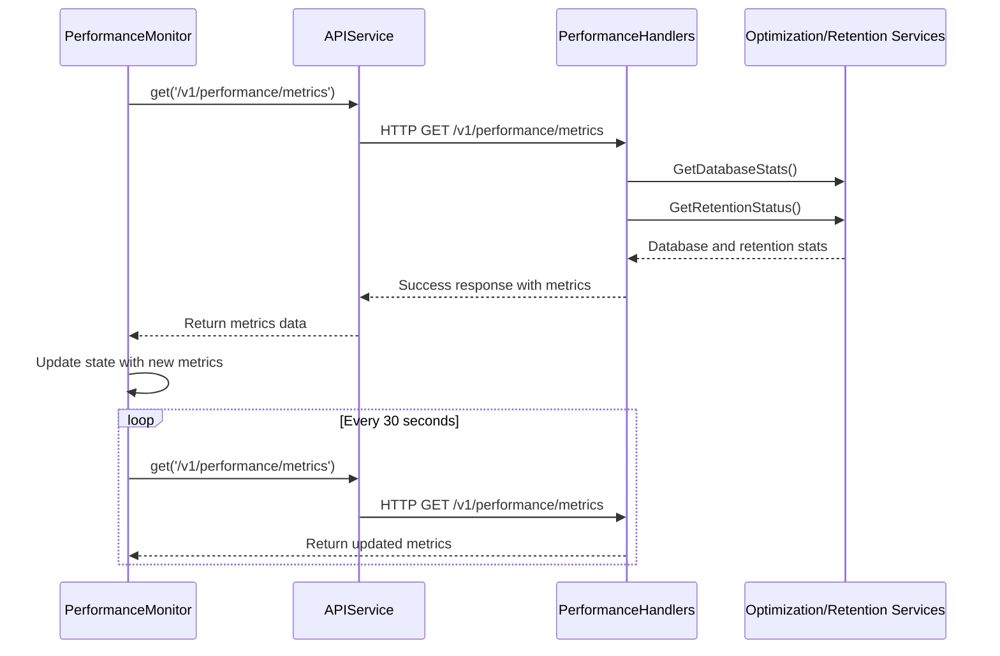
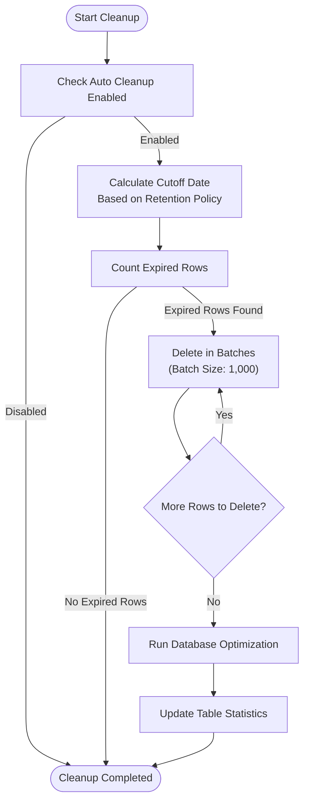
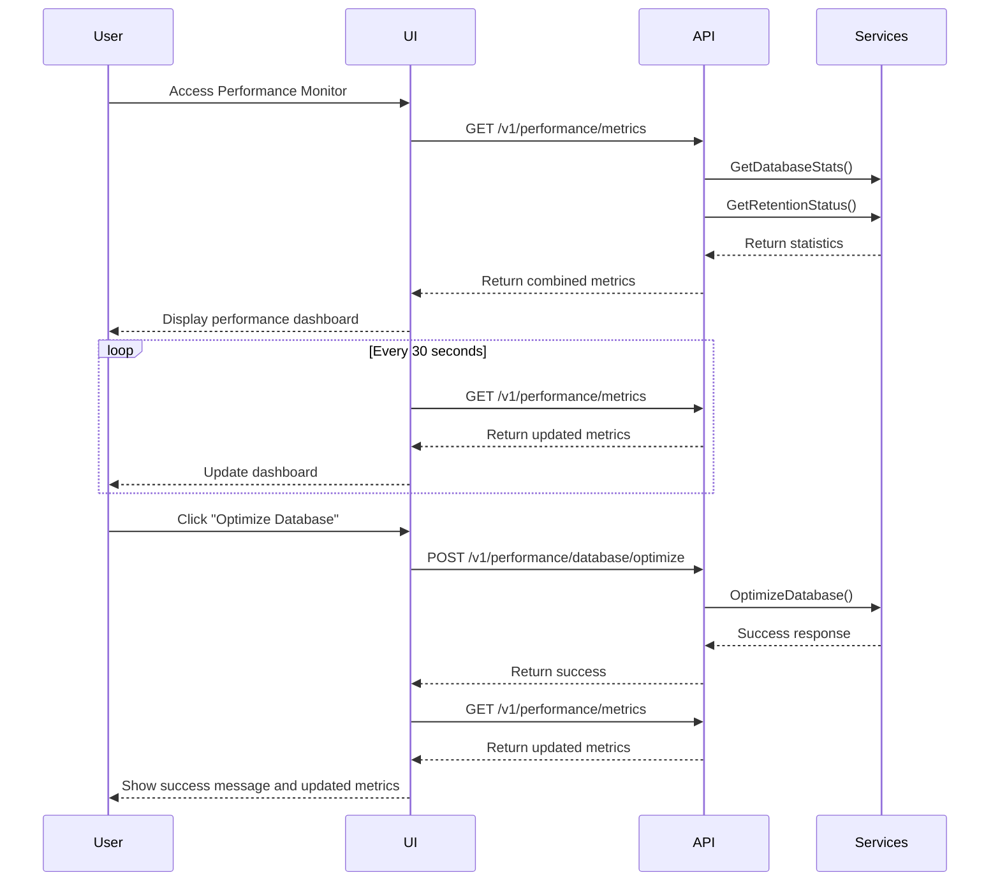
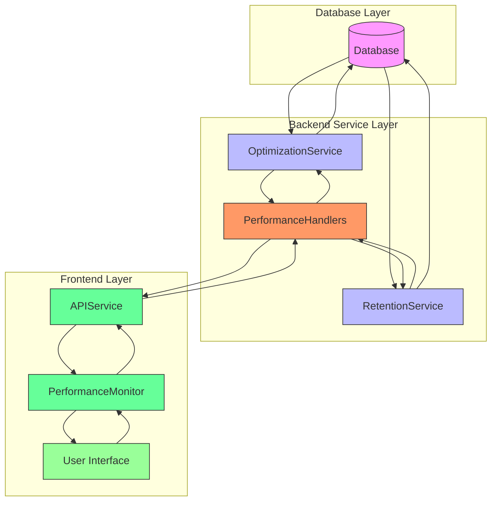

# Performance Components


## Table of Contents
1. [Introduction](#introduction)
2. [Performance Monitor Component Overview](#performance-monitor-component-overview)
3. [Frontend Implementation](#frontend-implementation)
4. [Backend API Integration](#backend-api-integration)
5. [Data Retention System](#data-retention-system)
6. [Database Optimization Service](#database-optimization-service)
7. [Performance Monitoring Workflow](#performance-monitoring-workflow)
8. [Data Flow Diagram](#data-flow-diagram)
9. [Usage and Interpretation](#usage-and-interpretation)
10. [Performance Considerations](#performance-considerations)

## Introduction
The Performance Monitor component provides comprehensive system monitoring capabilities for the Exim-Pilot application, focusing on database performance metrics and data retention management. This documentation details the implementation, integration, and functionality of the performance monitoring system, which enables administrators to track system responsiveness, resource usage, and data lifecycle management. The component collects and displays real-time metrics including database size, table statistics, and retention status, while also providing tools for database optimization and data cleanup operations.

## Performance Monitor Component Overview
The Performance Monitor is a React component that serves as the central interface for monitoring system performance and managing database optimization tasks. It provides real-time visibility into database statistics and data retention policies, allowing administrators to make informed decisions about system maintenance and optimization. The component integrates with backend services to collect performance metrics and execute optimization operations, presenting the information in an intuitive, user-friendly interface.

The monitor displays key performance indicators such as database size, table counts, total rows, and retention status for various data types. It also provides actionable controls for database optimization and data cleanup operations, enabling administrators to maintain optimal system performance. The component automatically refreshes metrics every 30 seconds to ensure up-to-date information is always available.

**Section sources**
- [PerformanceMonitor.tsx](file://web/src/components/Performance/PerformanceMonitor.tsx#L38-L356)

## Frontend Implementation
The PerformanceMonitor component is implemented as a React functional component using TypeScript, following modern React patterns and best practices. It manages its state using React hooks to track metrics, loading status, errors, and operation states for optimization and cleanup processes.


```mermaid
classDiagram
class PerformanceMonitor {
+metrics : PerformanceMetrics | null
+loading : boolean
+error : string | null
+optimizing : boolean
+cleaning : boolean
+fetchMetrics() : Promise~void~
+optimizeDatabase() : Promise~void~
+cleanupExpiredData() : Promise~void~
+formatBytes(bytes : number) : string
+formatNumber(num : number) : string
}
class PerformanceMetrics {
+database : DatabaseStats
+retention : RetentionStatus
+system : { timestamp : string }
}
class DatabaseStats {
+timestamp : string
+database_size : number
+table_stats : Record~string, { row_count : number }~
+index_stats : Record~string, { table_name : string }~
}
class RetentionStatus {
+config : RetentionConfig
+table_stats : Record~string, RetentionTableStats~
}
PerformanceMonitor --> PerformanceMetrics : "displays"
PerformanceMonitor --> apiService : "uses"
PerformanceMonitor --> LoadingSpinner : "uses"
```


**Diagram sources**
- [PerformanceMonitor.tsx](file://web/src/components/Performance/PerformanceMonitor.tsx#L0-L356)

**Section sources**
- [PerformanceMonitor.tsx](file://web/src/components/Performance/PerformanceMonitor.tsx#L0-L356)

## Backend API Integration
The Performance Monitor component communicates with backend services through a series of REST API endpoints managed by the PerformanceHandlers. These endpoints provide access to performance metrics, database optimization functions, and data retention management capabilities. The frontend uses the APIService class to make HTTP requests to these endpoints, handling responses and errors appropriately.

The integration follows a polling strategy, with the frontend automatically refreshing performance metrics every 30 seconds to ensure up-to-date information. This interval balances the need for current data with the performance impact of frequent API calls. The component also implements error handling and retry mechanisms to maintain usability even when temporary network issues occur.





**Diagram sources**
- [PerformanceMonitor.tsx](file://web/src/components/Performance/PerformanceMonitor.tsx#L70-L80)
- [performance_handlers.go](file://internal/api/performance_handlers.go#L120-L150)
- [api.ts](file://web/src/services/api.ts#L41-L60)

**Section sources**
- [PerformanceMonitor.tsx](file://web/src/components/Performance/PerformanceMonitor.tsx#L70-L80)
- [api.ts](file://web/src/services/api.ts#L41-L118)

## Data Retention System
The data retention system manages the lifecycle of various data types within the application, ensuring compliance with retention policies while optimizing database performance. Implemented through the RetentionService, this system automatically cleans up expired data based on configurable retention periods for different data types.

The retention configuration includes policies for log entries (90 days), audit logs (365 days), queue snapshots (30 days), delivery attempts (180 days), and user sessions (7 days). The system performs cleanup operations in batches to avoid long-running transactions and database locks, with a default batch size of 1,000 rows. After cleanup, the system runs database optimization routines to reclaim space and update statistics.





**Diagram sources**
- [retention.go](file://internal/database/retention.go#L100-L250)

**Section sources**
- [retention.go](file://internal/database/retention.go#L1-L359)

## Database Optimization Service
The database optimization service provides tools for maintaining optimal database performance through various maintenance operations. The OptimizationService implements methods for retrieving database statistics and performing optimization routines that improve query performance and reduce database size.

Key optimization features include:
- **Database Statistics Collection**: Gathers comprehensive information about database size, table counts, row counts, and index statistics
- **Database Optimization**: Executes PRAGMA commands to optimize database performance, including VACUUM and ANALYZE operations
- **Query Optimization Hints**: Provides recommendations for improving query performance based on database statistics

The service works in conjunction with the RetentionService to ensure that database performance is maintained as data grows and ages. After data cleanup operations, the optimization service automatically runs maintenance routines to reclaim space and update query planning statistics.

**Section sources**
- [optimization.go](file://internal/database/optimization.go#L1-L200)

## Performance Monitoring Workflow
The performance monitoring workflow follows a systematic process for collecting, displaying, and acting upon system performance data. The workflow begins with the frontend component requesting performance metrics from the backend API, which aggregates data from multiple services to provide a comprehensive view of system health.

When a user accesses the Performance Monitor, the following workflow occurs:
1. The component initializes and begins loading state
2. A request is sent to the `/v1/performance/metrics` endpoint
3. The backend aggregates database statistics and retention status
4. The response is processed and displayed in the UI
5. A timer is set to refresh metrics every 30 seconds

For optimization operations, the workflow includes:
1. User clicks "Optimize Database" or "Cleanup Data" button
2. Frontend sends request to corresponding API endpoint
3. Backend service performs the requested operation
4. Operation results are returned to the frontend
5. Metrics are refreshed to reflect changes
6. User is notified of operation success or failure

This workflow ensures that administrators have timely access to performance data and can take immediate action to optimize system performance when needed.





**Diagram sources**
- [PerformanceMonitor.tsx](file://web/src/components/Performance/PerformanceMonitor.tsx#L38-L356)
- [performance_handlers.go](file://internal/api/performance_handlers.go#L120-L150)

**Section sources**
- [PerformanceMonitor.tsx](file://web/src/components/Performance/PerformanceMonitor.tsx#L38-L356)
- [performance_handlers.go](file://internal/api/performance_handlers.go#L120-L150)

## Data Flow Diagram
The data flow for the performance monitoring system illustrates how information moves between components, from data collection to user interface presentation. The diagram shows the complete lifecycle of performance metrics, from database queries to visualization in the user interface.





**Diagram sources**
- [PerformanceMonitor.tsx](file://web/src/components/Performance/PerformanceMonitor.tsx#L0-L356)
- [performance_handlers.go](file://internal/api/performance_handlers.go#L1-L30)
- [retention.go](file://internal/database/retention.go#L1-L30)
- [optimization.go](file://internal/database/optimization.go#L1-L30)

## Usage and Interpretation
The Performance Monitor provides several key metrics that administrators can use to assess system health and identify potential issues. Understanding how to interpret these metrics is essential for effective system management.

**Database Size**: This metric shows the total size of the database file. A rapidly growing database size may indicate the need for more aggressive data retention policies or additional storage capacity planning.

**Table and Index Counts**: These metrics provide insight into the database structure. A high number of indexes can improve query performance but may slow down write operations and increase database size.

**Total Rows**: This metric represents the cumulative count of all rows across all tables. Monitoring trends in this metric helps predict storage requirements and identify potential data accumulation issues.

**Retention Status**: This section shows the number of expired rows for each data type. A high number of expired rows suggests that cleanup operations are overdue or that retention policies may need adjustment.

**Auto Cleanup Status**: This indicator shows whether automatic data cleanup is enabled. When disabled, expired data will accumulate until manually cleaned, potentially impacting performance.

The component also provides two primary actions:
- **Optimize Database**: This operation runs database maintenance routines to improve performance and reduce file size
- **Cleanup Data**: This operation removes expired data based on retention policies, freeing up storage space

Administrators should monitor these metrics regularly and perform optimization and cleanup operations as needed to maintain optimal system performance.

**Section sources**
- [PerformanceMonitor.tsx](file://web/src/components/Performance/PerformanceMonitor.tsx#L150-L350)

## Performance Considerations
The performance monitoring system is designed with several considerations to minimize its impact on overall system performance while providing timely and accurate metrics.

The frontend implements a 30-second polling interval for metric updates, striking a balance between data freshness and server load. More frequent polling could overwhelm the server with requests, while less frequent polling would reduce the timeliness of performance data.

On the backend, the performance handlers are optimized to efficiently gather metrics without causing significant database load. The database statistics collection is designed to be lightweight, using simple COUNT queries and PRAGMA commands that have minimal impact on database performance.

The data cleanup operations are implemented with batch processing to prevent long-running transactions that could lock the database. By processing deletions in batches of 1,000 rows with small delays between batches, the system maintains responsiveness even during extensive cleanup operations.

The component also includes error handling and loading states to maintain usability during network issues or server delays. When metrics cannot be retrieved, the component displays an error message with a retry option, ensuring that users are informed of issues and can attempt to refresh the data.

**Section sources**
- [PerformanceMonitor.tsx](file://web/src/components/Performance/PerformanceMonitor.tsx#L70-L80)
- [performance_handlers.go](file://internal/api/performance_handlers.go#L120-L150)
- [retention.go](file://internal/database/retention.go#L150-L200)

**Referenced Files in This Document**   
- [PerformanceMonitor.tsx](file://web/src/components/Performance/PerformanceMonitor.tsx)
- [performance_handlers.go](file://internal/api/performance_handlers.go)
- [retention.go](file://internal/database/retention.go)
- [optimization.go](file://internal/database/optimization.go)
- [api.ts](file://web/src/services/api.ts)