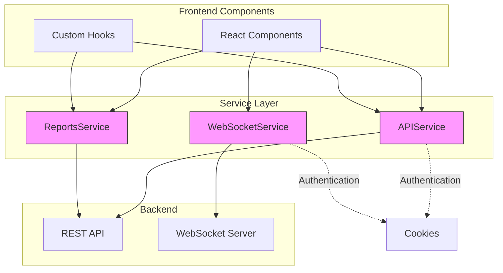
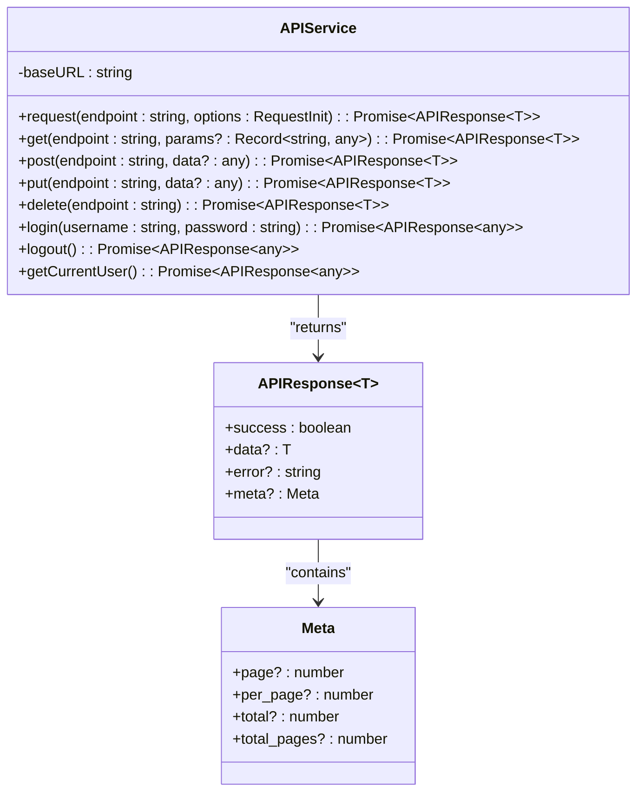
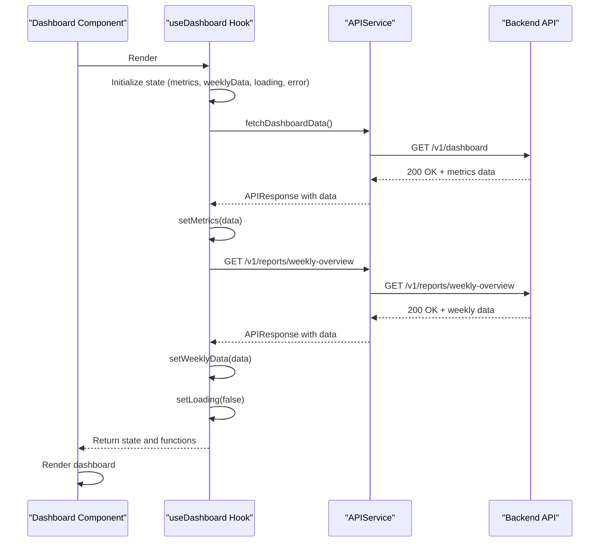
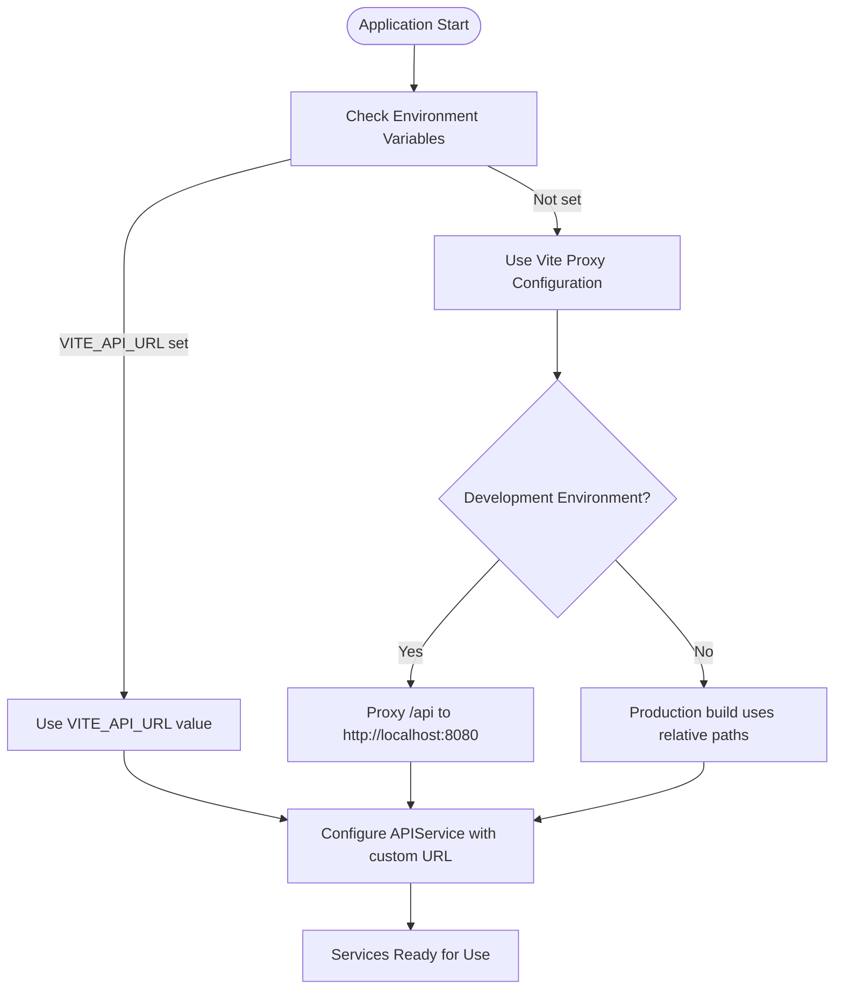
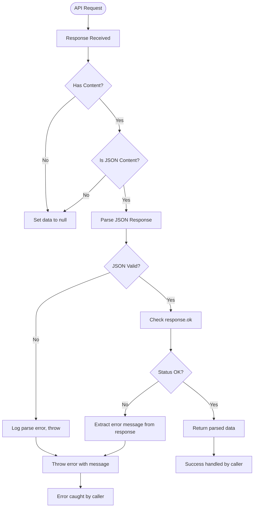
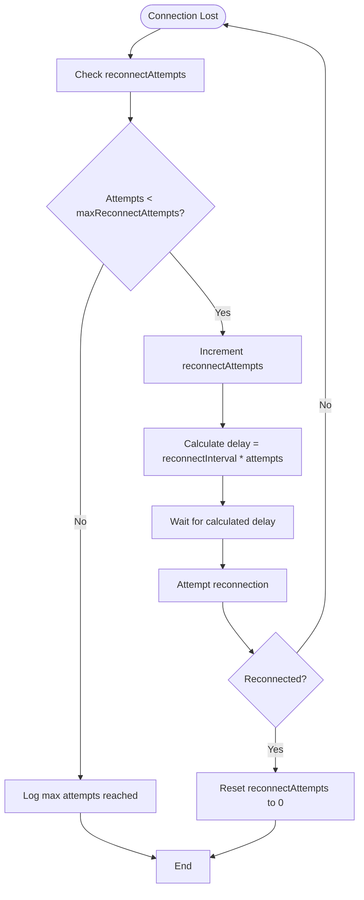

# API Services


## Table of Contents
1. [API Services](#api-services)
2. [Core Components](#core-components)
3. [Architecture Overview](#architecture-overview)
4. [Detailed Component Analysis](#detailed-component-analysis)
5. [Service Usage and Integration](#service-usage-and-integration)
6. [Configuration and Environment Management](#configuration-and-environment-management)
7. [Error Handling and Resilience](#error-handling-and-resilience)
8. [Extending and Testing Services](#extending-and-testing-services)

## Core Components

The frontend API service layer consists of three primary components: `api.ts`, `reports.ts`, and `websocket.ts`. These services handle communication with the backend, providing a structured interface for data retrieval, submission, and real-time updates.

The `APIService` class in `api.ts` serves as the foundation for all HTTP communications, implementing a wrapper around the Fetch API with standardized request/response handling. The `ReportsService` in `reports.ts` extends this functionality by providing specialized methods for reporting endpoints, while `websocket.ts` implements a persistent connection for real-time data streaming.

All services follow a consistent pattern of returning `APIResponse<T>` objects that include success status, data payload, and error information, enabling uniform error handling across the application.

**Section sources**
- [api.ts](file://web/src/services/api.ts#L0-L118)
- [reports.ts](file://web/src/services/reports.ts#L0-L88)
- [websocket.ts](file://web/src/services/websocket.ts#L0-L164)

## Architecture Overview

The API service architecture follows a layered approach with specialized services for different communication patterns. The HTTP client handles RESTful interactions while the WebSocket service manages real-time updates through a persistent connection.





**Diagram sources**
- [api.ts](file://web/src/services/api.ts#L0-L118)
- [reports.ts](file://web/src/services/reports.ts#L0-L88)
- [websocket.ts](file://web/src/services/websocket.ts#L0-L164)

## Detailed Component Analysis

### APIService Implementation

The `APIService` class provides a comprehensive HTTP client implementation with built-in configuration, request/response handling, and error management.





**Diagram sources**
- [api.ts](file://web/src/services/api.ts#L0-L118)
- [api.ts](file://web/src/types/api.ts#L0-L18)

**Section sources**
- [api.ts](file://web/src/services/api.ts#L0-L118)

#### HTTP Client Configuration

The `APIService` is configured with default settings that ensure consistent behavior across all HTTP requests:

- **Base URL**: Defaults to `/api` but can be customized during instantiation
- **Content-Type**: Automatically set to `application/json` for all requests
- **Credentials**: Configured with `credentials: 'include'` to automatically send cookies for authentication
- **Request Options**: Supports custom headers and options through the `RequestInit` interface

The service uses a private `request` method as the foundation for all HTTP operations, which handles the core fetch operation, response parsing, and error handling.

#### Request/Response Interceptors and Error Handling

The `request` method implements comprehensive request/response processing:

1. **Request Preparation**: Constructs the full URL and configures headers
2. **Response Processing**: Checks content type before parsing JSON, handles empty responses gracefully
3. **Error Detection**: Evaluates `response.ok` status and throws errors for non-200 responses
4. **JSON Parsing**: Safely parses JSON responses with error handling for malformed JSON
5. **Error Propagation**: Logs errors and rethrows them for component-level handling

The service includes specialized authentication methods (`login`, `logout`, `getCurrentUser`) that handle authentication-specific patterns, including treating 401/404 responses as "not authenticated" rather than errors.

#### Authentication Token Management

Authentication is managed through HTTP cookies rather than bearer tokens. The service uses `credentials: 'include'` in all requests, which automatically sends existing authentication cookies and allows the server to set new ones. This approach provides seamless session management without requiring explicit token handling in the frontend code.

The `getCurrentUser` method demonstrates a specialized error handling pattern where authentication failures are converted to a structured response with `success: false` and `error: 'Not authenticated'` rather than propagating the error, making it easier for components to handle authentication state.

### ReportsService Implementation

The `ReportsService` provides specialized methods for accessing reporting endpoints, building on the foundation of `APIService`.


```mermaid
classDiagram
class ReportsService {
+getDeliverabilityReport(startTime? : string, endTime? : string) : Promise~APIResponse~DeliverabilityReport~~
+getVolumeReport(startTime? : string, endTime? : string, groupBy : string) : Promise~APIResponse~VolumeReport~~
+getFailureReport(startTime? : string, endTime? : string, limit : number) : Promise~APIResponse~FailureReport~~
+getTopSendersReport(startTime? : string, endTime? : string, limit : number) : Promise~APIResponse~TopSendersReport~~
+getTopRecipientsReport(startTime? : string, endTime? : string, limit : number) : Promise~APIResponse~TopRecipientsReport~~
+getDomainAnalysis(startTime? : string, endTime? : string, analysisType : string, limit : number) : Promise~APIResponse~DomainAnalysis~~
}
ReportsService --> APIService : "uses"
ReportsService --> DeliverabilityReport : "returns"
ReportsService --> VolumeReport : "returns"
ReportsService --> FailureReport : "returns"
class DeliverabilityReport {
+delivery_rate : number
+success_count : number
+failure_count : number
+bounce_rate : number
+average_delivery_time : number
}
class VolumeReport {
+time_series : {timestamp : string, volume : number}[]
+total_volume : number
+peak_hour : string
+average_daily_volume : number
}
class FailureReport {
+failures : FailureItem[]
+total_failures : number
+failure_rate : number
}
```


**Diagram sources**
- [reports.ts](file://web/src/services/reports.ts#L0-L88)
- [api.ts](file://web/src/services/api.ts#L0-L118)

**Section sources**
- [reports.ts](file://web/src/services/reports.ts#L0-L88)

The `ReportsService` maps directly to backend REST endpoints in the `/v1/reports/` namespace. Each method accepts optional time range parameters (`startTime`, `endTime`) and additional filtering options as needed. Parameters are automatically converted to URL query strings using `URLSearchParams`.

The service uses type parameters to ensure type safety, returning `APIResponse<ReportType>` where `ReportType` corresponds to specific report data structures defined in the types system.

### WebSocketService Implementation

The `WebSocketService` manages real-time communication with the backend through WebSocket connections.


```mermaid
classDiagram
class WebSocketService {
-ws : WebSocket | null
-url : string
-reconnectAttempts : number
-maxReconnectAttempts : number
-reconnectInterval : number
-eventHandlers : Map~string, WebSocketEventHandler[]~
-subscriptions : Map~string, WebSocketEventHandler[]~
+connect() : Promise~void~
+on(eventType : string, handler : WebSocketEventHandler) : void
+off(eventType : string, handler : WebSocketEventHandler) : void
+send(message : any) : void
+disconnect() : void
+isConnected() : boolean
+subscribe(endpoint : string, handler : WebSocketEventHandler) : void
+unsubscribe(endpoint : string, handler? : WebSocketEventHandler) : void
-handleMessage(message : any) : void
-handleReconnect() : void
}
class WebSocketEventHandler {
<<type>>
(data : any) => void
}
WebSocketService --> WebSocket : "uses"
```


**Diagram sources**
- [websocket.ts](file://web/src/services/websocket.ts#L0-L164)

**Section sources**
- [websocket.ts](file://web/src/services/websocket.ts#L0-L164)

#### WebSocket Connection Management

The service automatically determines the WebSocket URL based on the current page location, converting HTTP/HTTPS to WS/WSS protocols and setting the path to `/ws`. This ensures the connection uses the same origin as the web application.

Connection state is managed through event handlers:
- **onopen**: Resets reconnect attempts and resolves the connection promise
- **onmessage**: Parses JSON messages and routes them to appropriate handlers
- **onclose**: Triggers automatic reconnection logic
- **onerror**: Logs errors and rejects the connection promise

#### Message Handling and Subscription Model

The service supports two messaging patterns:
1. **Event-based**: Messages with a `type` field are routed to event handlers
2. **Subscription-based**: Messages with an `endpoint` field are routed to subscription handlers

The subscription model allows components to subscribe to specific data streams (e.g., real-time log tailing) by registering handlers for specific endpoints. The service automatically sends subscription/unsubscription messages to the server to manage server-side resources.

#### Real-time Update Implementation

Components can receive real-time updates by subscribing to specific endpoints or listening for specific event types. When a message is received, it is parsed from JSON and delivered to all registered handlers for the corresponding event type or endpoint.

## Service Usage and Integration

### Component Integration Patterns

Components typically interact with services through custom hooks that manage state and provide a clean interface. For example, the `useDashboard` hook demonstrates common patterns for service integration:





**Diagram sources**
- [useDashboard.ts](file://web/src/hooks/useDashboard.ts#L0-L33)
- [api.ts](file://web/src/services/api.ts#L0-L118)

**Section sources**
- [useDashboard.ts](file://web/src/hooks/useDashboard.ts#L0-L33)

### Async Operations and Loading States

Components implement async operations with proper loading state management:

1. **State Initialization**: Components initialize loading states before API calls
2. **Error Handling**: Try/catch blocks capture and process errors
3. **State Updates**: Successful responses update component state
4. **Loading Indicators**: Loading states control spinner visibility
5. **Error Display**: Error states show user-friendly messages

The `useDashboard` hook demonstrates this pattern by maintaining `loading` and `error` states that components can use to control UI rendering.

## Configuration and Environment Management

### Environment Variables and API Base URLs

The frontend configuration relies on Vite's built-in environment variable system and proxy configuration:





**Diagram sources**
- [vite.config.ts](file://web/vite.config.ts#L0-L61)
- [api.ts](file://web/src/services/api.ts#L0-L118)

**Section sources**
- [vite.config.ts](file://web/vite.config.ts#L0-L61)

The Vite configuration file (`vite.config.ts`) sets up a development proxy that forwards `/api` requests to `http://localhost:8080` and WebSocket connections to `ws://localhost:8080`. This allows frontend development on port 3000 while communicating with the backend API on port 8080.

The `APIService` constructor accepts an optional `baseURL` parameter (defaulting to `/api`), which can be overridden with environment variables in different deployment scenarios.

### API Versioning

API versioning is implemented through the endpoint paths, with all current endpoints using the `/v1/` prefix:
- Authentication: `/v1/auth/login`, `/v1/auth/logout`, `/v1/auth/me`
- Dashboard: `/v1/dashboard`
- Reports: `/v1/reports/deliverability`, `/v1/reports/volume`, etc.

This approach allows for future API versioning while maintaining backward compatibility.

## Error Handling and Resilience

### Error Handling Strategy

The application implements a multi-layered error handling strategy:





**Diagram sources**
- [api.ts](file://web/src/services/api.ts#L0-L118)

**Section sources**
- [api.ts](file://web/src/services/api.ts#L0-L118)

The `APIResponse` interface provides a consistent structure for all API responses, with `success: boolean`, optional `data`, and optional `error` fields. This allows components to check the `success` flag rather than using try/catch for expected error conditions.

### Network Resilience Strategies

#### WebSocket Reconnection Logic

The `WebSocketService` implements a robust reconnection strategy:





**Diagram sources**
- [websocket.ts](file://web/src/services/websocket.ts#L0-L164)

**Section sources**
- [websocket.ts](file://web/src/services/websocket.ts#L0-L164)

The service allows up to 5 reconnection attempts with exponential backoff (1s, 2s, 3s, etc.), preventing overwhelming the server with rapid reconnection requests.

#### Timeout Settings

While explicit timeout settings are not implemented in the current service code, the underlying browser Fetch API and WebSocket implementations have their own timeout mechanisms. The Vite proxy configuration does not specify custom timeout values, relying on default browser behavior.

## Extending and Testing Services

### Extending Services for New Endpoints

To add new endpoints to the service layer:

1. **For general API endpoints**: Add methods to `APIService` using the existing `get`, `post`, `put`, `delete` helpers
2. **For specialized endpoints**: Create new service classes that import and use `apiService`
3. **For reporting endpoints**: Add methods to `ReportsService` following the existing pattern

Example of adding a new endpoint:

```typescript
// In api.ts
async updateUser(id: string, userData: any): Promise<APIResponse<any>> {
  return this.request(`/v1/users/${id}`, {
    method: 'PUT',
    body: JSON.stringify(userData),
  });
}

// In a new service file
import { apiService } from './api';

export class UserService {
  async getUser(id: string): Promise<APIResponse<any>> {
    return apiService.get(`/v1/users/${id}`);
  }
}
```


### Testing Service Methods with Mocks

Service methods can be tested using mocking libraries like Jest. Since the services are classes with public methods, they can be easily mocked or spied upon in tests.

The existing test files in the `tests/` directory (e.g., `logs.spec.ts`, `queue.spec.ts`) likely contain examples of service testing, though the specific test implementations are not available in the current context.

Best practices for testing include:
- Mocking the global `fetch` function to simulate API responses
- Using the `APIResponse` structure to create consistent test responses
- Testing both success and error scenarios
- Verifying proper error handling and state management in components

The modular design of the services, with clear separation of concerns and dependency injection through imports, facilitates unit testing and mocking.

**Referenced Files in This Document**   
- [api.ts](file://web/src/services/api.ts)
- [reports.ts](file://web/src/services/reports.ts)
- [websocket.ts](file://web/src/services/websocket.ts)
- [api.ts](file://web/src/types/api.ts)
- [vite.config.ts](file://web/vite.config.ts)
- [useDashboard.ts](file://web/src/hooks/useDashboard.ts)