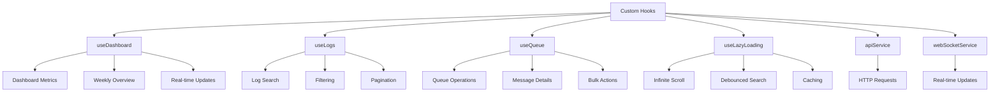
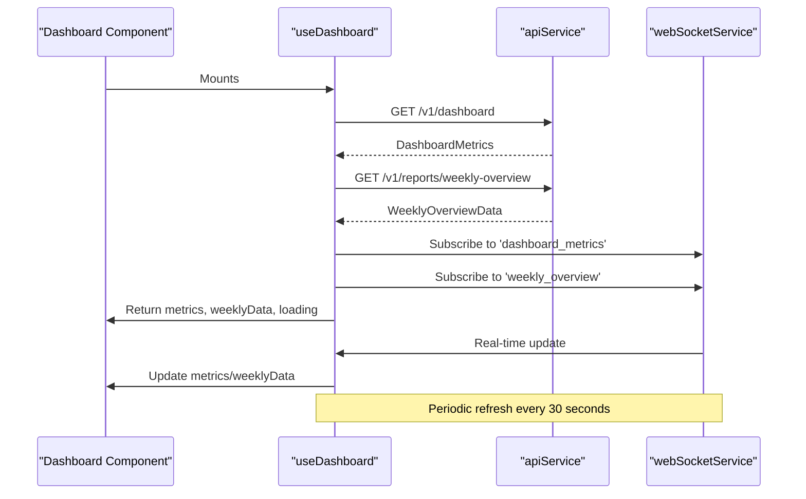
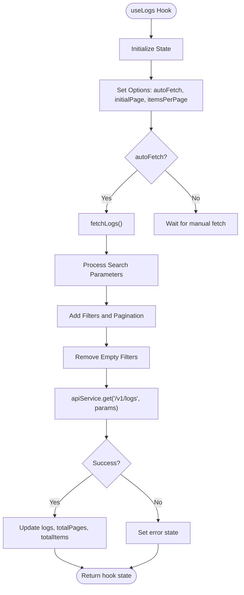
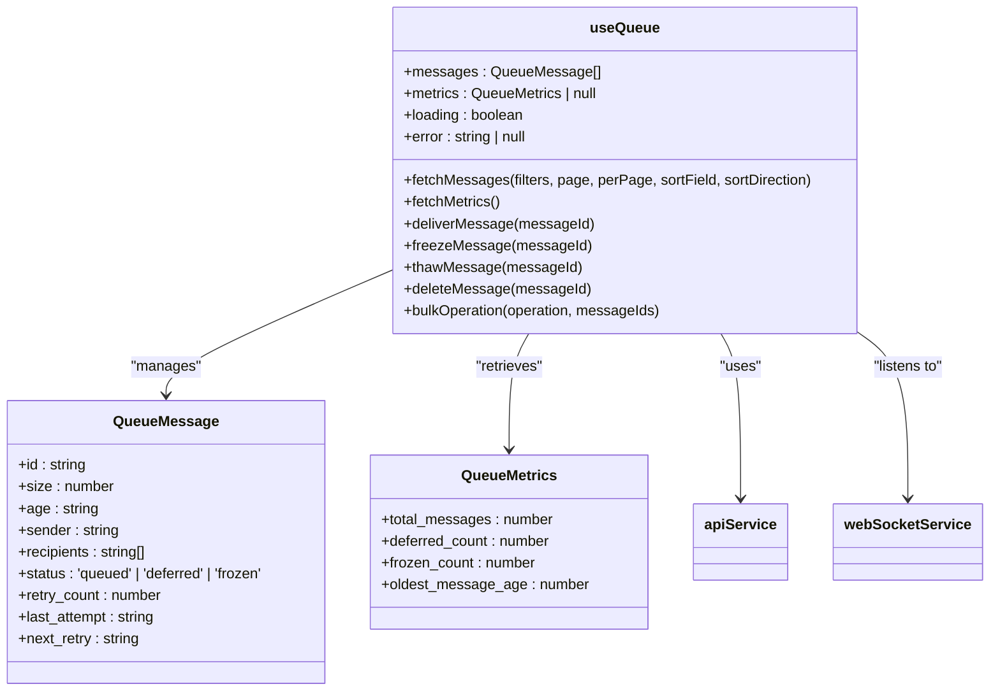
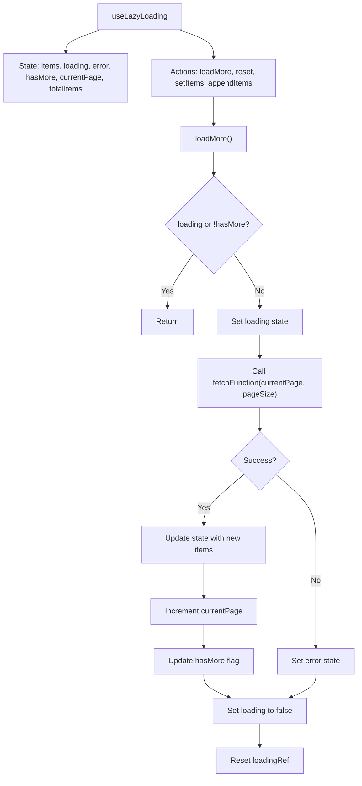
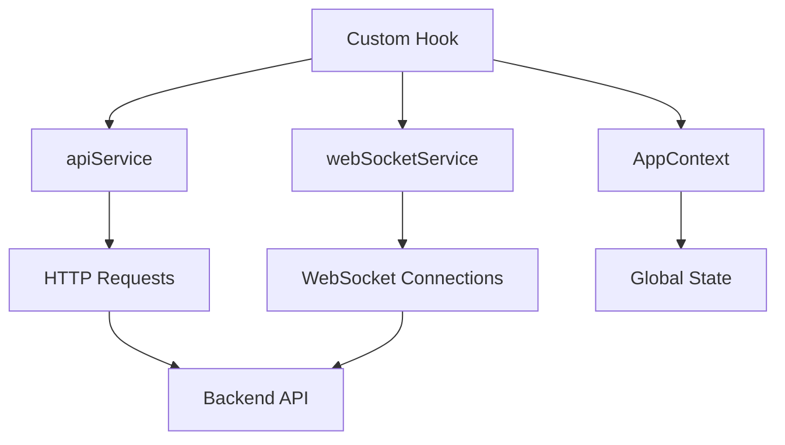
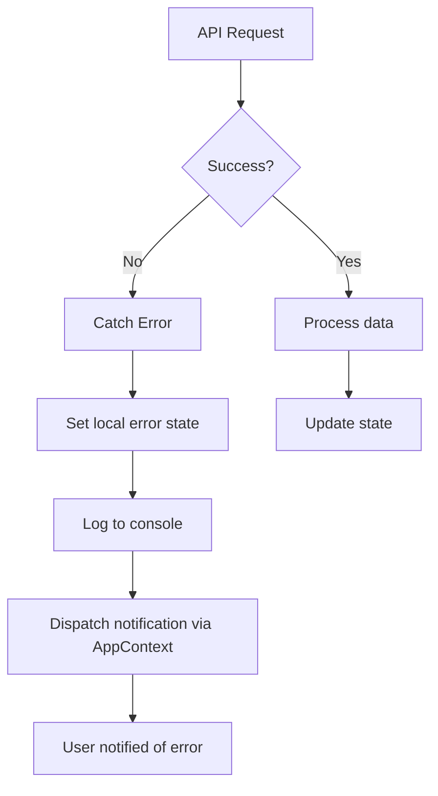

# Custom Hooks


## Table of Contents
1. [Introduction](#introduction)
2. [Core Custom Hooks Overview](#core-custom-hooks-overview)
3. [useDashboard Hook](#usedashboard-hook)
4. [useLogs Hook](#uselogs-hook)
5. [useQueue Hook](#usequeue-hook)
6. [useLazyLoading Hook](#uselazyloading-hook)
7. [Hook Composition and Usage Patterns](#hook-composition-and-usage-patterns)
8. [Error Handling and Recovery](#error-handling-and-recovery)
9. [Performance Optimization Strategies](#performance-optimization-strategies)
10. [TypeScript Typing Strategy](#typescript-typing-strategy)
11. [Best Practices and Recommendations](#best-practices-and-recommendations)

## Introduction

This document provides a comprehensive analysis of the custom React hooks implemented in the Exim Pilot application. These hooks encapsulate business logic, data fetching patterns, and state management strategies to provide reusable, testable, and maintainable components across the application. The hooks abstract API service calls, manage local state, and handle side effects using React's useEffect and useCallback hooks.

The custom hooks system enables separation of concerns by isolating data fetching, state management, and business logic from UI components. This approach improves code reusability, simplifies testing, and enhances developer productivity by providing consistent interfaces for common operations.

**Section sources**
- [useDashboard.ts](file://web/src/hooks/useDashboard.ts#L1-L80)
- [useLogs.ts](file://web/src/hooks/useLogs.ts#L1-L111)
- [useQueue.ts](file://web/src/hooks/useQueue.ts#L1-L181)
- [useLazyLoading.ts](file://web/src/hooks/useLazyLoading.ts#L1-L369)

## Core Custom Hooks Overview

The application implements four primary custom hooks that address different functional domains:

- **useDashboard**: Manages retrieval and real-time updates of dashboard metrics and weekly overview data
- **useLogs**: Handles log search functionality and data streaming for log entries
- **useQueue**: Provides operations for queue management including message details and bulk actions
- **useLazyLoading**: Implements performance optimization through lazy loading and infinite scroll patterns

These hooks follow a consistent pattern of encapsulating API interactions, managing local state, handling errors, and providing clean interfaces to consuming components. They leverage TypeScript generics for type safety and reusability across different data types.





**Diagram sources**
- [useDashboard.ts](file://web/src/hooks/useDashboard.ts#L1-L80)
- [useLogs.ts](file://web/src/hooks/useLogs.ts#L1-L111)
- [useQueue.ts](file://web/src/hooks/useQueue.ts#L1-L181)
- [useLazyLoading.ts](file://web/src/hooks/useLazyLoading.ts#L1-L369)
- [api.ts](file://web/src/services/api.ts#L1-L119)
- [websocket.ts](file://web/src/services/websocket.ts#L1-L165)

## useDashboard Hook

The useDashboard hook manages the retrieval and real-time updating of dashboard metrics and weekly overview data. It combines initial data fetching with WebSocket-based real-time updates and periodic refresh as a fallback mechanism.

### Functionality and Implementation

The hook initializes with loading state and null data values, then performs an initial fetch of dashboard metrics and weekly overview data from the API endpoints `/v1/dashboard` and `/v1/reports/weekly-overview` respectively. It uses the apiService to make GET requests and processes the responses according to the APIResponse interface.





**Diagram sources**
- [useDashboard.ts](file://web/src/hooks/useDashboard.ts#L1-L80)
- [api.ts](file://web/src/services/api.ts#L1-L119)
- [websocket.ts](file://web/src/services/websocket.ts#L1-L165)

### State Management

The hook manages several state variables:
- **metrics**: DashboardMetrics | null - Current dashboard metrics
- **weeklyData**: WeeklyOverviewData | null - Weekly overview chart data
- **loading**: boolean - Loading state indicator
- **error**: string | null - Error message if data fetch fails

### Data Fetching and Real-time Updates

The hook implements a comprehensive data fetching strategy that includes:
1. Initial data fetch on component mount
2. WebSocket listeners for real-time updates on 'dashboard_metrics' and 'weekly_overview' events
3. Periodic refresh every 30 seconds as a fallback mechanism

The useEffect hook sets up these mechanisms and properly cleans up event listeners and intervals when the component unmounts.

### Error Handling

Error handling is implemented through try-catch blocks around API calls. When an error occurs, it sets the error state and dispatches a notification through the AppContext actions. This ensures users are informed of data retrieval issues.

**Section sources**
- [useDashboard.ts](file://web/src/hooks/useDashboard.ts#L1-L80)
- [dashboard.ts](file://web/src/types/dashboard.ts#L1-L48)
- [api.ts](file://web/src/services/api.ts#L1-L119)
- [websocket.ts](file://web/src/services/websocket.ts#L1-L165)

## useLogs Hook

The useLogs hook provides functionality for searching, filtering, and paginating log entries. It supports both automatic and manual data fetching with configurable options.

### Functionality and Implementation

The hook manages log data retrieval with support for pagination, filtering, and sorting. It exposes a comprehensive API for interacting with log data, including methods to fetch logs, change pages, update filters, and refresh data.





**Diagram sources**
- [useLogs.ts](file://web/src/hooks/useLogs.ts#L1-L111)
- [logs.ts](file://web/src/types/logs.ts#L1-L34)

### Configuration Options

The hook accepts configuration options through the UseLogsOptions interface:
- **autoFetch**: boolean (default: true) - Whether to automatically fetch data on mount
- **initialPage**: number (default: 1) - Starting page number
- **itemsPerPage**: number (default: 50) - Number of items per page

### State Management

The hook maintains comprehensive state for log management:
- **logs**: LogEntry[] - Current page of log entries
- **loading**: boolean - Loading state indicator
- **error**: string | null - Error message if fetch fails
- **currentPage**: number - Current page number
- **totalPages**: number - Total number of pages
- **totalItems**: number - Total number of log entries
- **filters**: LogSearchFilters - Current search filters

### Search and Filtering

The hook implements robust search and filtering capabilities through the fetchLogs function, which accepts search parameters including:
- log_type, event, message_id, sender, recipient, keyword
- Date range filtering with start_date and end_date
- Pagination parameters (page, per_page)

Empty filters are automatically removed before making the API request to ensure clean URLs and efficient server processing.

**Section sources**
- [useLogs.ts](file://web/src/hooks/useLogs.ts#L1-L111)
- [logs.ts](file://web/src/types/logs.ts#L1-L34)
- [api.ts](file://web/src/services/api.ts#L1-L119)

## useQueue Hook

The useQueue hook manages queue operations, message details, and bulk actions for the message queue system. It provides comprehensive functionality for interacting with queued messages.

### Functionality and Implementation

The hook handles both data retrieval and operational actions on queue messages. It supports fetching messages with filtering and sorting, retrieving queue metrics, and performing various operations on messages.





**Diagram sources**
- [useQueue.ts](file://web/src/hooks/useQueue.ts#L1-L181)
- [queue.ts](file://web/src/types/queue.ts#L1-L97)
- [api.ts](file://web/src/services/api.ts#L1-L119)
- [websocket.ts](file://web/src/services/websocket.ts#L1-L165)

### State Management

The hook maintains state for:
- **messages**: QueueMessage[] - Current list of queue messages
- **metrics**: QueueMetrics | null - Queue metrics and statistics
- **loading**: boolean - Loading state indicator
- **error**: string | null - Error message if operations fail

### Data Retrieval

The hook provides two main data retrieval functions:
- **fetchMessages**: Retrieves queue messages with optional filtering, pagination, and sorting
- **fetchMetrics**: Retrieves queue metrics from `/v1/queue/metrics`

Both functions update the local state with the retrieved data.

### Queue Operations

The hook implements several operational functions for managing queue messages:
- **deliverMessage**: Attempts immediate delivery of a specific message
- **freezeMessage**: Freezes a message to prevent delivery attempts
- **thawMessage**: Thaws a frozen message to resume delivery attempts
- **deleteMessage**: Removes a message from the queue
- **bulkOperation**: Performs operations on multiple messages simultaneously

After successful operations, the hook automatically refreshes the message list to reflect changes.

### Real-time Updates

The hook supports real-time updates through WebSocket integration. When autoRefresh is enabled, it:
1. Listens for 'queue_update' events via WebSocket
2. Sets up a periodic refresh interval (default: 30 seconds)
3. Refreshes both messages and metrics on updates

**Section sources**
- [useQueue.ts](file://web/src/hooks/useQueue.ts#L1-L181)
- [queue.ts](file://web/src/types/queue.ts#L1-L97)
- [api.ts](file://web/src/services/api.ts#L1-L119)
- [websocket.ts](file://web/src/services/websocket.ts#L1-L165)

## useLazyLoading Hook

The useLazyLoading hook provides performance optimization through lazy loading and infinite scroll patterns. It includes multiple utility hooks for different optimization scenarios.

### Core Functionality

The primary useLazyLoading function implements infinite scroll functionality by loading data in chunks as needed. It manages the state for items, loading, errors, and pagination.





**Diagram sources**
- [useLazyLoading.ts](file://web/src/hooks/useLazyLoading.ts#L1-L114)

### Multiple Hook Variants

The file exports several related hooks for different optimization scenarios:

#### useIntersectionObserver
A utility hook that triggers callbacks when a target element intersects with the viewport, enabling true infinite scroll based on user scrolling behavior.

#### useDebouncedLazySearch
Implements debounced search with lazy loading, preventing excessive API calls during typing by waiting for a specified delay before executing searches.

#### useOptimizedDataFetching
Provides caching functionality with configurable cache time, stale time, and window focus refetching to minimize redundant API calls.

### Configuration and Flexibility

The hooks are designed with flexibility in mind:
- **Generic typing**: Supports any data type through TypeScript generics
- **Configurable parameters**: Options for page size, thresholds, debounce times, and cache durations
- **Composable**: Can be combined with other hooks and patterns

### Performance Benefits

These hooks address common performance issues:
- Reduces initial load time by loading data incrementally
- Minimizes network requests through debouncing and caching
- Improves user experience by loading data as needed rather than upfront
- Prevents memory issues by limiting the amount of data held in state

**Section sources**
- [useLazyLoading.ts](file://web/src/hooks/useLazyLoading.ts#L1-L369)

## Hook Composition and Usage Patterns

The custom hooks follow consistent patterns for composition and usage across the application, promoting reusability and maintainability.

### Common Implementation Patterns

All hooks follow a similar structure:
1. **State initialization** using useState hooks
2. **Callback functions** using useCallback for memoization
3. **Side effects** using useEffect for data fetching and cleanup
4. **Error handling** with try-catch blocks and error state management
5. **Return value** as an object containing state and actions

### Hook Dependencies

The hooks rely on shared services:
- **apiService**: For HTTP API interactions
- **webSocketService**: For real-time updates
- **AppContext**: For global state and notifications





**Diagram sources**
- [api.ts](file://web/src/services/api.ts#L1-L119)
- [websocket.ts](file://web/src/services/websocket.ts#L1-L165)
- [useDashboard.ts](file://web/src/hooks/useDashboard.ts#L1-L80)

### Usage Examples

While specific component usage couldn't be retrieved, typical usage patterns would include:


```typescript
// In a component
const DashboardComponent = () => {
  const { metrics, weeklyData, loading, error, refreshData } = useDashboard();
  
  if (loading) return <LoadingSpinner />;
  if (error) return <ErrorMessage message={error} />;
  
  return (
    <div>
      <MetricsCard title="Delivery Rate" value={metrics?.delivery.success_rate} />
      <WeeklyChart data={weeklyData} />
      <button onClick={refreshData}>Refresh</button>
    </div>
  );
};
```


**Section sources**
- [useDashboard.ts](file://web/src/hooks/useDashboard.ts#L1-L80)
- [useLogs.ts](file://web/src/hooks/useLogs.ts#L1-L111)
- [useQueue.ts](file://web/src/hooks/useQueue.ts#L1-L181)

## Error Handling and Recovery

The hooks implement comprehensive error handling strategies to ensure robust application behavior.

### Centralized Error Management

Each hook handles errors locally while also integrating with global error handling through AppContext notifications.





**Diagram sources**
- [useDashboard.ts](file://web/src/hooks/useDashboard.ts#L1-L80)
- [useLogs.ts](file://web/src/hooks/useLogs.ts#L1-L111)
- [useQueue.ts](file://web/src/hooks/useQueue.ts#L1-L181)

### Specific Error Handling Patterns

#### useDashboard
- Sets error state and displays notification
- Continues periodic refresh attempts
- Allows manual refresh through refreshData function

#### useLogs
- Sets error state and clears log data
- Preserves current filters and pagination state
- Allows retry through refresh function

#### useQueue
- Sets error state and logs to console
- Throws error to calling component for specific operation errors
- Continues auto-refresh cycle

### Recovery Mechanisms

The hooks implement several recovery strategies:
- **Automatic retry**: Periodic refresh in useDashboard and useQueue
- **Manual refresh**: Exposed refresh functions
- **WebSocket fallback**: Real-time updates supplement periodic polling
- **Graceful degradation**: Application remains functional even when data fetch fails

**Section sources**
- [useDashboard.ts](file://web/src/hooks/useDashboard.ts#L1-L80)
- [useLogs.ts](file://web/src/hooks/useLogs.ts#L1-L111)
- [useQueue.ts](file://web/src/hooks/useQueue.ts#L1-L181)

## Performance Optimization Strategies

The hooks implement various performance optimizations to ensure efficient application behavior.

### Avoiding Unnecessary Re-renders

The hooks use several techniques to prevent unnecessary re-renders:
- **useCallback**: Memoizes functions to prevent recreation on each render
- **Dependency arrays**: Carefully specified dependencies in useEffect and useCallback
- **State batching**: Multiple state updates are batched when possible

### Efficient Data Fetching

The hooks optimize data fetching through:
- **Conditional fetching**: Only fetch when necessary (autoFetch option)
- **Parameter optimization**: Removing empty filters before requests
- **Caching**: useOptimizedDataFetching provides caching capabilities
- **Debouncing**: useDebouncedLazySearch prevents excessive requests

### Memory Management

The hooks manage memory efficiently by:
- **Cleanup effects**: Properly cleaning up intervals and event listeners
- **State minimization**: Only storing necessary data in state
- **Reference usage**: Using useRef for values that don't trigger re-renders

### Real-time vs Polling Balance

The hooks strike a balance between real-time updates and polling:
- **Primary**: WebSocket real-time updates
- **Fallback**: Periodic polling (30 seconds)
- **Immediate**: Manual refresh options

This ensures users receive timely updates while maintaining functionality if WebSocket connections fail.

**Section sources**
- [useDashboard.ts](file://web/src/hooks/useDashboard.ts#L1-L80)
- [useLogs.ts](file://web/src/hooks/useLogs.ts#L1-L111)
- [useQueue.ts](file://web/src/hooks/useQueue.ts#L1-L181)
- [useLazyLoading.ts](file://web/src/hooks/useLazyLoading.ts#L1-L369)

## TypeScript Typing Strategy

The hooks leverage TypeScript generics and interfaces to provide type safety and reusability.

### Generic Type Parameters

The useLazyLoading hook demonstrates effective use of generics:


```typescript
export function useLazyLoading<T>(
  fetchFunction: (page: number, pageSize: number) => Promise<{
    data: T[];
    total: number;
    hasMore: boolean;
  }>,
  config: LazyLoadingConfig
): LazyLoadingReturn<T>
```


This allows the hook to work with any data type while maintaining type safety.

### Interface-Driven Design

The application uses a comprehensive interface system:
- **APIResponse**: Standardized response structure
- **Domain-specific interfaces**: DashboardMetrics, LogEntry, QueueMessage
- **Configuration interfaces**: UseLogsOptions, LazyLoadingConfig

### Type Safety Benefits

The typing strategy provides several benefits:
- **Compile-time error detection**
- **Autocompletion in IDEs**
- **Clear API contracts**
- **Refactoring safety**
- **Documentation through types**

**Section sources**
- [useLazyLoading.ts](file://web/src/hooks/useLazyLoading.ts#L1-L369)
- [api.ts](file://web/src/types/api.ts#L1-L19)
- [dashboard.ts](file://web/src/types/dashboard.ts#L1-L48)
- [logs.ts](file://web/src/types/logs.ts#L1-L34)
- [queue.ts](file://web/src/types/queue.ts#L1-L97)

## Best Practices and Recommendations

Based on the analysis of the custom hooks implementation, several best practices and recommendations emerge.

### Hook Design Principles

1. **Single Responsibility**: Each hook should have a clear, focused purpose
2. **Reusability**: Design hooks to be usable in multiple contexts
3. **Composability**: Create hooks that can be easily combined
4. **Type Safety**: Leverage TypeScript for robust type checking

### Performance Considerations

1. **Memoize functions**: Use useCallback with proper dependency arrays
2. **Clean up effects**: Always return cleanup functions from useEffect
3. **Optimize re-renders**: Minimize state updates and use memoization
4. **Balance real-time and polling**: Use WebSockets as primary, polling as fallback

### Error Handling

1. **Local error state**: Each hook should manage its own error state
2. **Global notifications**: Integrate with global notification systems
3. **Graceful degradation**: Ensure functionality remains when errors occur
4. **Informative messages**: Provide clear error messages to users

### Testing Strategies

The current implementation appears highly testable due to:
- **Pure functions**: Most logic is in isolated functions
- **Clear interfaces**: Well-defined inputs and outputs
- **Dependency injection**: Services are imported, making mocking easier

Recommend adding unit tests for:
- Data fetching success and error cases
- State transitions
- Callback function behavior
- Effect cleanup

**Section sources**
- [useDashboard.ts](file://web/src/hooks/useDashboard.ts#L1-L80)
- [useLogs.ts](file://web/src/hooks/useLogs.ts#L1-L111)
- [useQueue.ts](file://web/src/hooks/useQueue.ts#L1-L181)
- [useLazyLoading.ts](file://web/src/hooks/useLazyLoading.ts#L1-L369)

**Referenced Files in This Document**   
- [useDashboard.ts](file://web/src/hooks/useDashboard.ts)
- [useLogs.ts](file://web/src/hooks/useLogs.ts)
- [useQueue.ts](file://web/src/hooks/useQueue.ts)
- [useLazyLoading.ts](file://web/src/hooks/useLazyLoading.ts)
- [api.ts](file://web/src/services/api.ts)
- [websocket.ts](file://web/src/services/websocket.ts)
- [dashboard.ts](file://web/src/types/dashboard.ts)
- [logs.ts](file://web/src/types/logs.ts)
- [queue.ts](file://web/src/types/queue.ts)
- [api.ts](file://web/src/types/api.ts)