```mermaid
classDiagram
class Period {
+start : string
+end : string
}
class FailureReason {
+reason : string
+count : number
}
class DeliverabilityReport {
+period : Period
+total_messages : number
+delivered_count : number
+deferred_count : number
+bounced_count : number
+rejected_count : number
+delivery_rate : number
+deferral_rate : number
+bounce_rate : number
+rejection_rate : number
+event_counts : Record~string, number~
+log_type_counts : Record~string, number~
+top_failure_reasons : FailureReason[]
}
class TimeSeriesPoint {
+timestamp : string
+count : number
}
class VolumeReport {
+period : Period
+group_by : string
+total_volume : number
+average_volume : number
+peak_volume : number
+time_series : TimeSeriesPoint[]
}
class FailureCategory {
+category : string
+count : number
+percentage : number
+description : string
}
class ErrorCodeStat {
+code : string
+description : string
+count : number
}
class FailureReport {
+period : Period
+total_failures : number
+failure_categories : FailureCategory[]
+top_error_codes : ErrorCodeStat[]
}
class SenderStat {
+sender : string
+message_count : number
+volume_bytes : number
+delivery_rate : number
}
class TopSendersReport {
+period : Period
+top_senders : SenderStat[]
}
class RecipientStat {
+recipient : string
+message_count : number
+volume_bytes : number
+delivery_rate : number
}
class TopRecipientsReport {
+period : Period
+top_recipients : RecipientStat[]
}
class DomainStat {
+domain : string
+message_count : number
+delivery_rate : number
+bounce_rate : number
+defer_rate : number
}
class DomainAnalysis {
+period : Period
+analysis_type : string
+sender_domains? : DomainStat[]
+recipient_domains? : DomainStat[]
}
class TimeRangeOption {
+label : string
+value : string
+days : number
}
```

# Type Definitions


## Table of Contents
1. [Introduction](#introduction)
2. [Core Type Definitions](#core-type-definitions)
3. [API Response and Error Structures](#api-response-and-error-structures)
4. [Authentication Types](#authentication-types)
5. [Dashboard Data Models](#dashboard-data-models)
6. [Log Entry and Search Types](#log-entry-and-search-types)
7. [Queue Message and Operation Types](#queue-message-and-operation-types)
8. [Reporting and Analytics Types](#reporting-and-analytics-types)
9. [Backend-Frontend Type Mapping](#backend-frontend-type-mapping)
10. [Type Usage in Hooks and Services](#type-usage-in-hooks-and-services)
11. [Type Consistency Strategy](#type-consistency-strategy)
12. [Extending Types for New Features](#extending-types-for-new-features)

## Introduction
This document provides a comprehensive overview of the TypeScript type definitions used in the frontend application of the Exim Pilot system. These types ensure type safety across components, services, and hooks by defining clear interfaces for API responses, user data, dashboard metrics, log entries, queue messages, and reporting structures. The types are organized by domain in the `types` directory and are used throughout the application to validate props, API responses, and state. This documentation maps the frontend type definitions to their corresponding backend data models and explains how they are used in various parts of the application.

## Core Type Definitions

The type system is organized into domain-specific files within the `web/src/types` directory, each corresponding to a major feature area of the application. These types provide compile-time safety and improve code maintainability by ensuring consistent data structures across the frontend.

**Section sources**
- [api.ts](file://web/src/types/api.ts)
- [auth.ts](file://web/src/types/auth.ts)
- [dashboard.ts](file://web/src/types/dashboard.ts)
- [logs.ts](file://web/src/types/logs.ts)
- [queue.ts](file://web/src/types/queue.ts)
- [reports.ts](file://web/src/types/reports.ts)

## API Response and Error Structures

The API response structure is standardized across all endpoints to ensure consistent handling of success and error states. The `APIResponse<T>` interface provides a generic wrapper for all API responses, while `APIError` defines the structure of error responses.


```typescript
export interface APIResponse<T = any> {
  success: boolean;
  data?: T;
  error?: string;
  meta?: {
    page?: number;
    per_page?: number;
    total?: number;
    total_pages?: number;
  };
}

export interface APIError {
  code: string;
  message: string;
  details?: string;
}
```


This structure allows components to handle responses uniformly, checking the `success` flag before accessing the `data` property. The optional `meta` field provides pagination information for list endpoints.

**Section sources**
- [api.ts](file://web/src/types/api.ts#L1-L18)

## Authentication Types

Authentication-related types define the structure of user data, login requests, and the authentication context used throughout the application.


```typescript
export interface User {
  id: number;
  username: string;
  email?: string;
  full_name?: string;
  is_active: boolean;
  last_login_at?: string;
  created_at: string;
  updated_at: string;
}

export interface LoginRequest {
  username: string;
  password: string;
}

export interface LoginResponse {
  user: User;
  expires_at: string;
}

export interface AuthContextType {
  user: User | null;
  isAuthenticated: boolean;
  isLoading: boolean;
  login: (username: string, password: string) => Promise<void>;
  logout: () => Promise<void>;
  checkAuth: () => Promise<void>;
}
```


The `AuthContextType` interface defines the shape of the authentication context, which is used by the `AuthContext.Provider` to make authentication state and functions available to all components.


**Diagram sources**
- [auth.ts](file://web/src/types/auth.ts#L1-L28)

**Section sources**
- [auth.ts](file://web/src/types/auth.ts#L1-L28)
- [AuthContext.tsx](file://web/src/context/AuthContext.tsx#L41-L81)

## Dashboard Data Models

Dashboard types define the structure of metrics and visualization data used in the dashboard components.


```typescript
export interface DashboardMetrics {
  queue: QueueMetrics;
  delivery: DeliveryMetrics;
  system: SystemMetrics;
}

export interface QueueMetrics {
  total: number;
  deferred: number;
  frozen: number;
  oldest_message_age: number;
  recent_growth: number;
}

export interface DeliveryMetrics {
  delivered_today: number;
  failed_today: number;
  pending_today: number;
  success_rate: number;
}

export interface SystemMetrics {
  uptime: number;
  log_entries_today: number;
  last_updated: string;
}

export interface WeeklyOverviewData {
  dates: string[];
  delivered: number[];
  failed: number[];
  pending: number[];
  deferred: number[];
}
```


These types are used by the `useDashboard` hook to manage dashboard state and by dashboard components to render metrics and charts.


**Diagram sources**
- [dashboard.ts](file://web/src/types/dashboard.ts#L1-L47)

**Section sources**
- [dashboard.ts](file://web/src/types/dashboard.ts#L1-L47)
- [useDashboard.ts](file://web/src/hooks/useDashboard.ts#L1-L79)

## Log Entry and Search Types

Log-related types define the structure of log entries and search filters used in the logs interface.


```typescript
export interface LogEntry {
  id: number;
  timestamp: string;
  message_id?: string;
  log_type: 'main' | 'reject' | 'panic';
  event: string;
  host?: string;
  sender?: string;
  recipients?: string[];
  size?: number;
  status?: string;
  error_code?: string;
  error_text?: string;
  raw_line: string;
}

export interface LogSearchFilters {
  log_type?: string;
  event?: string;
  message_id?: string;
  sender?: string;
  recipient?: string;
  keyword?: string;
  start_date?: string;
  end_date?: string;
}

export interface RealTimeLogMessage {
  type: 'log_entry';
  data: LogEntry;
}
```


The `LogEntry` interface maps directly to the backend `LogEntry` struct, with appropriate type conversions (e.g., `time.Time` to `string`).


**Diagram sources**
- [logs.ts](file://web/src/types/logs.ts#L1-L33)
- [models.go](file://internal/database/models.go#L70-L86)

**Section sources**
- [logs.ts](file://web/src/types/logs.ts#L1-L33)
- [models.go](file://internal/database/models.go#L70-L86)
- [useLogs.ts](file://web/src/hooks/useLogs.ts#L1-L110)

## Queue Message and Operation Types

Queue types define the structure of messages in the queue, message details, and operations that can be performed on messages.


```typescript
export interface QueueMessage {
  id: string;
  size: number;
  age: string;
  sender: string;
  recipients: string[];
  status: 'queued' | 'deferred' | 'frozen';
  retry_count: number;
  last_attempt: string;
  next_retry: string;
}

export interface MessageDetails {
  id: string;
  envelope: {
    sender: string;
    recipients: string[];
    received_at: string;
    size: number;
  };
  headers: Record<string, string>;
  smtp_logs: SMTPLogEntry[];
  content_preview?: string;
  status: 'queued' | 'deferred' | 'frozen';
  retry_count: number;
  last_attempt?: string;
  next_retry?: string;
  delivery_attempts: DeliveryAttempt[];
}

export interface SMTPLogEntry {
  timestamp: string;
  event: string;
  host?: string;
  ip_address?: string;
  message: string;
}

export interface DeliveryAttempt {
  id: number;
  timestamp: string;
  recipient: string;
  host?: string;
  ip_address?: string;
  status: 'success' | 'defer' | 'bounce';
  smtp_code?: string;
  error_message?: string;
}

export interface QueueSearchFilters {
  sender?: string;
  recipient?: string;
  message_id?: string;
  subject?: string;
  status?: string;
  age_min?: number;
  age_max?: number;
  retry_count_min?: number;
  retry_count_max?: number;
}

export type QueueOperation = 'deliver' | 'freeze' | 'thaw' | 'delete';

export interface BulkOperationResult {
  operation: QueueOperation;
  total_requested: number;
  successful: number;
  failed: number;
  errors?: Array<{
    message_id: string;
    error: string;
  }>;
}

export interface BulkOperationProgress {
  operation: QueueOperation;
  total: number;
  completed: number;
  failed: number;
  in_progress: boolean;
}
```


```mermaid
classDiagram
class QueueMessage {
+id : string
+size : number
+age : string
+sender : string
+recipients : string[]
+status : 'queued' | 'deferred' | 'frozen'
+retry_count : number
+last_attempt : string
+next_retry : string
}
class MessageDetails {
+id : string
+envelope : Envelope
+headers : Record~string, string~
+smtp_logs : SMTPLogEntry[]
+content_preview? : string
+status : 'queued' | 'deferred' | 'frozen'
+retry_count : number
+last_attempt? : string
+next_retry? : string
+delivery_attempts : DeliveryAttempt[]
}
class Envelope {
+sender : string
+recipients : string[]
+received_at : string
+size : number
}
class SMTPLogEntry {
+timestamp : string
+event : string
+host? : string
+ip_address? : string
+message : string
}
class DeliveryAttempt {
+id : number
+timestamp : string
+recipient : string
+host? : string
+ip_address? : string
+status : 'success' | 'defer' | 'bounce'
+smtp_code? : string
+error_message? : string
}
class QueueSearchFilters {
+sender? : string
+recipient? : string
+message_id? : string
+subject? : string
+status? : string
+age_min? : number
+age_max? : number
+retry_count_min? : number
+retry_count_max? : number
}
class BulkOperationResult {
+operation : QueueOperation
+total_requested : number
+successful : number
+failed : number
+errors? : {message_id : string, error : string}[]
}
class BulkOperationProgress {
+operation : QueueOperation
+total : number
+completed : number
+failed : number
+in_progress : boolean
}
```


**Diagram sources**
- [queue.ts](file://web/src/types/queue.ts#L1-L96)
- [models.go](file://internal/database/models.go#L48-L59)

**Section sources**
- [queue.ts](file://web/src/types/queue.ts#L1-L96)
- [models.go](file://internal/database/models.go#L48-L59)
- [useQueue.ts](file://web/src/hooks/useQueue.ts#L1-L180)

## Reporting and Analytics Types

Reporting types define the structure of various reports generated by the system, including deliverability, volume, failure analysis, and top senders/recipients.


```typescript
export interface Period {
  start: string;
  end: string;
}

export interface FailureReason {
  reason: string;
  count: number;
}

export interface DeliverabilityReport {
  period: Period;
  total_messages: number;
  delivered_count: number;
  deferred_count: number;
  bounced_count: number;
  rejected_count: number;
  delivery_rate: number;
  deferral_rate: number;
  bounce_rate: number;
  rejection_rate: number;
  event_counts: Record<string, number>;
  log_type_counts: Record<string, number>;
  top_failure_reasons: FailureReason[];
}

export interface TimeSeriesPoint {
  timestamp: string;
  count: number;
}

export interface VolumeReport {
  period: Period;
  group_by: string;
  total_volume: number;
  average_volume: number;
  peak_volume: number;
  time_series: TimeSeriesPoint[];
}

export interface FailureCategory {
  category: string;
  count: number;
  percentage: number;
  description: string;
}

export interface ErrorCodeStat {
  code: string;
  description: string;
  count: number;
}

export interface FailureReport {
  period: Period;
  total_failures: number;
  failure_categories: FailureCategory[];
  top_error_codes: ErrorCodeStat[];
}

export interface SenderStat {
  sender: string;
  message_count: number;
  volume_bytes: number;
  delivery_rate: number;
}

export interface TopSendersReport {
  period: Period;
  top_senders: SenderStat[];
}

export interface RecipientStat {
  recipient: string;
  message_count: number;
  volume_bytes: number;
  delivery_rate: number;
}

export interface TopRecipientsReport {
  period: Period;
  top_recipients: RecipientStat[];
}

export interface DomainStat {
  domain: string;
  message_count: number;
  delivery_rate: number;
  bounce_rate: number;
  defer_rate: number;
}

export interface DomainAnalysis {
  period: Period;
  analysis_type: string;
  sender_domains?: DomainStat[];
  recipient_domains?: DomainStat[];
}

export interface TimeRangeOption {
  label: string;
  value: string;
  days: number;
}

export const TIME_RANGE_OPTIONS: TimeRangeOption[] = [
  { label: 'Last 24 hours', value: '1d', days: 1 },
  { label: 'Last 3 days', value: '3d', days: 3 },
  { label: 'Last 7 days', value: '7d', days: 7 },
  { label: 'Last 30 days', value: '30d', days: 30 },
  { label: 'Last 90 days', value: '90d', days: 90 },
  { label: 'Custom', value: 'custom', days: 0 },
];
```





**Diagram sources**
- [reports.ts](file://web/src/types/reports.ts#L1-L115)

**Section sources**
- [reports.ts](file://web/src/types/reports.ts#L1-L115)

## Backend-Frontend Type Mapping

The frontend type definitions are designed to mirror the backend data models, with appropriate type conversions for JSON serialization and deserialization.

The `MessageWithRecipients` struct in the backend:


```go
type MessageWithRecipients struct {
	Message    Message     `json:"message"`
	Recipients []Recipient `json:"recipients"`
}
```


While not directly defined in the frontend types, this structure is used in API responses and is implicitly typed as `{ message: QueueMessage, recipients: string[] }` in the frontend.

The `LogEntry` type is consistent between frontend and backend, with the backend using `time.Time` and the frontend using `string` for timestamps:


```go
type LogEntry struct {
	ID           int64     `json:"id" db:"id"`
	Timestamp    time.Time `json:"timestamp" db:"timestamp"`
	MessageID    *string   `json:"message_id" db:"message_id"`
	LogType      string    `json:"log_type" db:"log_type"`
	Event        string    `json:"event" db:"event"`
	Host         *string   `json:"host" db:"host"`
	Sender       *string   `json:"sender" db:"sender"`
	Recipients   []string  `json:"recipients" db:"-"`
	RecipientsDB *string   `json:"-" db:"recipients"`
	Size         *int64    `json:"size" db:"size"`
	Status       *string   `json:"status" db:"status"`
	ErrorCode    *string   `json:"error_code" db:"error_code"`
	ErrorText    *string   `json:"error_text" db:"error_text"`
	RawLine      string    `json:"raw_line" db:"raw_line"`
	CreatedAt    time.Time `json:"created_at" db:"created_at"`
}
```


The `DeliveryAttempt` type is also consistent between frontend and backend:


```go
type DeliveryAttempt struct {
	ID           int64     `json:"id" db:"id"`
	MessageID    string    `json:"message_id" db:"message_id"`
	Recipient    string    `json:"recipient" db:"recipient"`
	Timestamp    time.Time `json:"timestamp" db:"timestamp"`
	Host         *string   `json:"host" db:"host"`
	IPAddress    *string   `json:"ip_address" db:"ip_address"`
	Status       string    `json:"status" db:"status"`
	SMTPCode     *string   `json:"smtp_code" db:"smtp_code"`
	ErrorMessage *string   `json:"error_message" db:"error_message"`
	CreatedAt    time.Time `json:"created_at" db:"created_at"`
}
```


**Diagram sources**
- [models.go](file://internal/database/models.go#L156-L159)
- [models.go](file://internal/database/models.go#L70-L86)
- [models.go](file://internal/database/models.go#L48-L59)

**Section sources**
- [models.go](file://internal/database/models.go#L156-L159)
- [models.go](file://internal/database/models.go#L70-L86)
- [models.go](file://internal/database/models.go#L48-L59)

## Type Usage in Hooks and Services

Type definitions are extensively used in custom hooks and services to ensure type safety in state management and API interactions.

The `useDashboard` hook uses `DashboardMetrics` and `WeeklyOverviewData` types to define its state:


```typescript
export function useDashboard() {
  const [metrics, setMetrics] = useState<DashboardMetrics | null>(null);
  const [weeklyData, setWeeklyData] = useState<WeeklyOverviewData | null>(null);
  // ...
}
```


The `useQueue` hook uses `QueueMessage`, `QueueSearchFilters`, and `QueueMetrics` types:


```typescript
export function useQueue(options: UseQueueOptions = {}) {
  const [messages, setMessages] = useState<QueueMessage[]>([]);
  const [metrics, setMetrics] = useState<QueueMetrics | null>(null);
  // ...
}
```


The `useLogs` hook uses `LogEntry` and `LogSearchFilters` types:


```typescript
export function useLogs(options: UseLogsOptions = {}): UseLogsReturn {
  const [logs, setLogs] = useState<LogEntry[]>([]);
  const [filters, setFilters] = useState<LogSearchFilters>({});
  // ...
}
```


API service methods use generic types to ensure response type safety:


```typescript
async get<T>(endpoint: string, params?: Record<string, any>): Promise<APIResponse<T>> {
  // ...
}

const metricsResponse = await apiService.get<DashboardMetrics>('/v1/dashboard');
```


**Diagram sources**
- [useDashboard.ts](file://web/src/hooks/useDashboard.ts#L1-L79)
- [useQueue.ts](file://web/src/hooks/useQueue.ts#L1-L180)
- [useLogs.ts](file://web/src/hooks/useLogs.ts#L1-L110)
- [api.ts](file://web/src/services/api.ts#L86-L118)

**Section sources**
- [useDashboard.ts](file://web/src/hooks/useDashboard.ts#L1-L79)
- [useQueue.ts](file://web/src/hooks/useQueue.ts#L1-L180)
- [useLogs.ts](file://web/src/hooks/useLogs.ts#L1-L110)
- [api.ts](file://web/src/services/api.ts#L86-L118)

## Type Consistency Strategy

The application maintains type consistency between frontend and backend through several strategies:

1. **Mirrored Data Structures**: Frontend types closely mirror backend structs, with appropriate type conversions for JSON serialization.
2. **Generic API Response Wrapper**: The `APIResponse<T>` interface provides a consistent wrapper for all API responses.
3. **Centralized Type Definitions**: All type definitions are centralized in the `types` directory, organized by domain.
4. **Type-Driven Development**: Components and hooks are developed with types first, ensuring type safety from the start.
5. **Versioning Considerations**: Type definitions include optional properties to accommodate API versioning and backward compatibility.

When backend models change, the corresponding frontend types must be updated to maintain consistency. Optional properties are used for fields that may not be present in all API versions.

**Section sources**
- [api.ts](file://web/src/types/api.ts)
- [models.go](file://internal/database/models.go)

## Extending Types for New Features

When extending types for new features, follow these guidelines:

1. **Add Optional Properties**: For backward compatibility, add new properties as optional.
2. **Create New Interfaces**: For complex new features, create new interfaces rather than modifying existing ones.
3. **Use Union Types**: For polymorphic data, use union types to represent different possible structures.
4. **Document Breaking Changes**: Clearly document any breaking changes to type definitions.
5. **Update Corresponding Backend Types**: Ensure backend structs are updated to match new frontend requirements.

For example, to add a new `priority` field to `QueueMessage`:


```typescript
export interface QueueMessage {
  // existing fields...
  priority?: 'low' | 'medium' | 'high' | 'critical';
}
```


This approach maintains backward compatibility while allowing new features to use the additional field.

**Section sources**
- [queue.ts](file://web/src/types/queue.ts)
- [models.go](file://internal/database/models.go)

**Referenced Files in This Document**   
- [api.ts](file://web/src/types/api.ts)
- [auth.ts](file://web/src/types/auth.ts)
- [dashboard.ts](file://web/src/types/dashboard.ts)
- [logs.ts](file://web/src/types/logs.ts)
- [queue.ts](file://web/src/types/queue.ts)
- [reports.ts](file://web/src/types/reports.ts)
- [models.go](file://internal/database/models.go)
- [useDashboard.ts](file://web/src/hooks/useDashboard.ts)
- [useQueue.ts](file://web/src/hooks/useQueue.ts)
- [useLogs.ts](file://web/src/hooks/useLogs.ts)
- [api.ts](file://web/src/services/api.ts)
- [AuthContext.tsx](file://web/src/context/AuthContext.tsx)