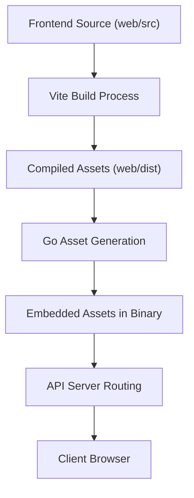
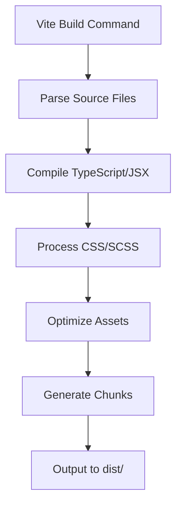
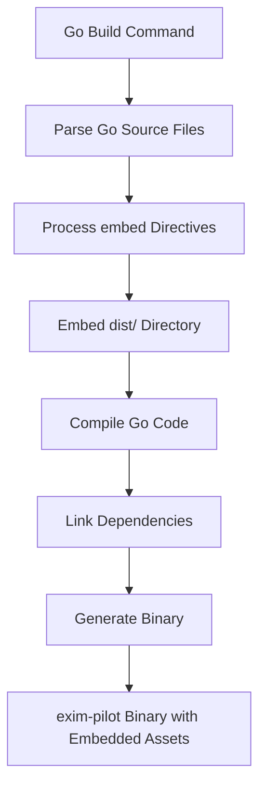
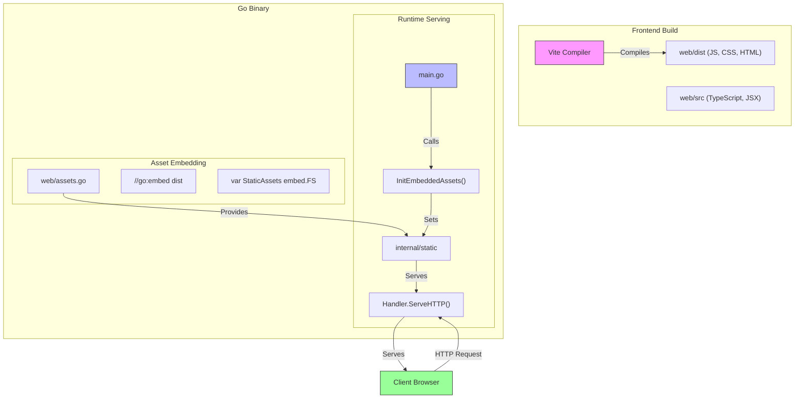
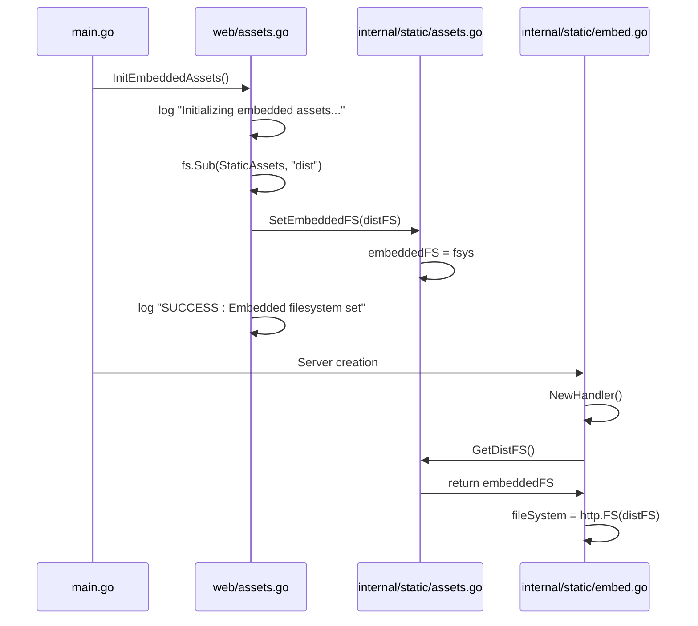
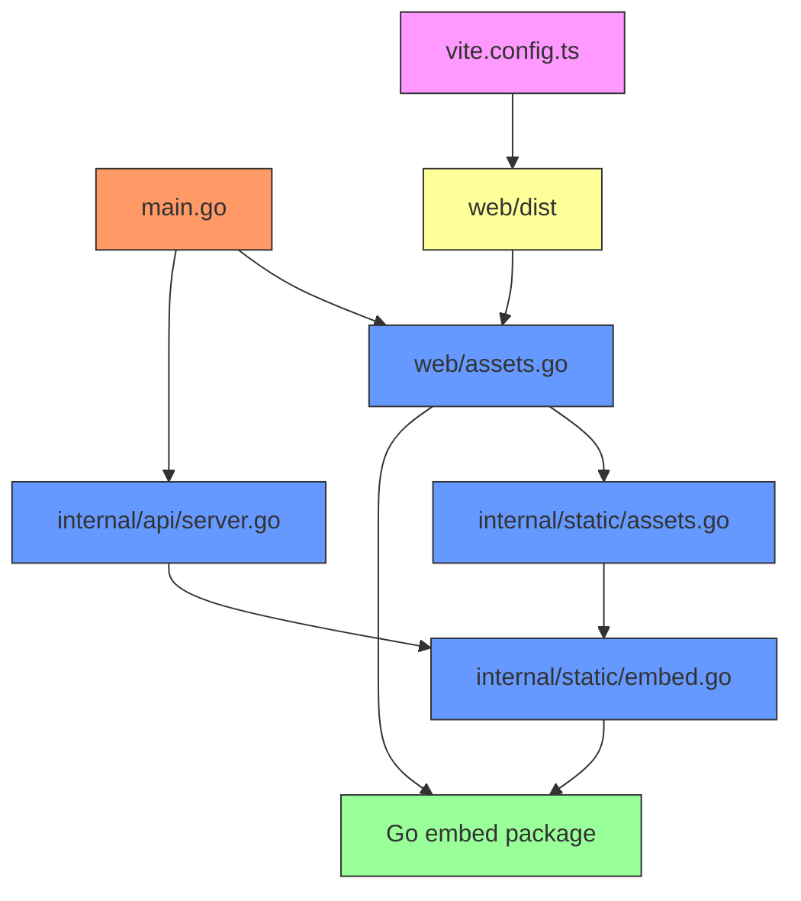

# Asset Embedding


## Table of Contents
1. [Introduction](#introduction)
2. [Project Structure and Asset Flow](#project-structure-and-asset-flow)
3. [Core Components of Asset Embedding](#core-components-of-asset-embedding)
4. [Development vs Production Asset Handling](#development-vs-production-asset-handling)
5. [Build Process Flow](#build-process-flow)
6. [Architecture Overview](#architecture-overview)
7. [Detailed Component Analysis](#detailed-component-analysis)
8. [Dependency Analysis](#dependency-analysis)
9. [Troubleshooting Guide](#troubleshooting-guide)

## Introduction
The Exim-Pilot application integrates a modern frontend built with React and Vite into a Go backend using Go's `embed` package. This document details the mechanism by which static assets (JavaScript, CSS, images) are compiled, embedded, and served within the Go binary. The system supports two modes: development (with hot-reload) and production (with embedded assets). The architecture enables a single binary deployment while maintaining developer productivity during frontend development.

**Section sources**
- [main.go](file://cmd/exim-pilot/main.go#L1-L233)
- [vite.config.ts](file://web/vite.config.ts#L1-L62)

## Project Structure and Asset Flow
The project follows a layered architecture with a clear separation between frontend and backend components. The frontend resides in the `web/` directory and is built using Vite, while the backend is structured in the `internal/` directory with modular packages for API, database, and static file handling.

Static assets are generated during the build process from the `web/src` directory, compiled into the `web/dist` directory by Vite, and then embedded into the Go binary via the `//go:embed` directive. At runtime, these assets are served through the API server's routing system.





**Diagram sources**
- [vite.config.ts](file://web/vite.config.ts#L1-L62)
- [server.go](file://internal/api/server.go#L222-L274)

**Section sources**
- [vite.config.ts](file://web/vite.config.ts#L1-L62)
- [server.go](file://internal/api/server.go#L222-L274)

## Core Components of Asset Embedding
The asset embedding system consists of several key components that work together to serve static content in both development and production environments.

### Asset Initialization
The `web.InitEmbeddedAssets()` function is called at application startup in `main.go`. This function conditionally initializes embedded assets based on the build tag.

In production builds (with the `embed` tag), it initializes the embedded filesystem from the `dist` directory. In development builds (without the `embed` tag), it's a no-op that logs a message indicating development mode.


```go
// In production: initializes embedded assets
func InitEmbeddedAssets() {
	log.Printf("Initializing embedded assets...")
	distFS, err := fs.Sub(StaticAssets, "dist")
	if err != nil {
		log.Printf("ERROR: Failed to initialize embedded assets: %v", err)
		return
	}
	static.SetEmbeddedFS(distFS)
}
```


```go
// In development: noop
func InitEmbeddedAssets() {
	log.Printf("Development build: Skipping embedded assets initialization")
}
```


**Section sources**
- [assets.go](file://web/assets.go#L1-L34)
- [assets_dev.go](file://web/assets_dev.go#L1-L14)

## Development vs Production Asset Handling
The system uses Go build tags to differentiate between development and production asset handling, enabling optimal behavior for each environment.

### Development Mode
When the `!embed` build tag is present, the system uses filesystem-based serving from the `dist` directory. This allows for hot-reload during development when using `npm run dev`.

The `internal/static/dev.go` file contains the `Handler` implementation that serves files directly from the filesystem. It includes fallback logic for SPA routing, serving `index.html` for non-API routes when the requested file is not found.

Key features of development mode:
- Serves files from `dist/` directory
- Creates placeholder `index.html` if directory doesn't exist
- Supports SPA routing fallback
- Sets appropriate content types and cache headers
- Enables hot-reload when used with Vite dev server

### Production Mode
When the `embed` build tag is present, the system uses embedded assets compiled into the binary. The `internal/static/embed.go` file contains the handler that serves files from the embedded filesystem.

Key features of production mode:
- Serves files from embedded `embed.FS`
- Uses `http.FS()` adapter for compatibility
- Implements SPA routing fallback to `index.html`
- Sets appropriate content types and cache headers
- Provides error logging for debugging

The conditional compilation is achieved through build tags:

```go
//go:build embed
// +build embed
```


and


```go
//go:build !embed
// +build !embed
```


**Section sources**
- [dev.go](file://internal/static/dev.go#L1-L148)
- [embed.go](file://internal/static/embed.go#L1-L146)
- [assets.go](file://web/assets.go#L1-L34)
- [assets_dev.go](file://web/assets_dev.go#L1-L14)

## Build Process Flow
The asset embedding process follows a three-stage flow: Vite compilation, asset generation, and Go binary compilation.

### Stage 1: Vite Compilation
The frontend is compiled using Vite with the following configuration:
- Output directory: `dist`
- Assets directory: `assets`
- Minification: Enabled with Terser
- Source maps: Disabled
- Chunk splitting: Optimized with manual chunks for vendor libraries
- Asset inlining: Small assets (<4KB) are inlined as base64





**Diagram sources**
- [vite.config.ts](file://web/vite.config.ts#L1-L62)

### Stage 2: Asset Generation
After Vite compiles the assets to the `dist/` directory, the Go build process embeds these files into the binary using the `//go:embed` directive in `web/assets.go`.

The `StaticAssets` variable is declared with:

```go
//go:embed dist
var StaticAssets embed.FS
```


This directive tells the Go compiler to include all files in the `dist` directory in the binary's filesystem.

### Stage 3: Go Binary Compilation
The final binary compilation links all components together:





The build process is typically orchestrated through make commands that:
1. Run `npm run build` in the `web/` directory
2. Compile the Go binary with the `embed` tag
3. Package the final executable

**Section sources**
- [vite.config.ts](file://web/vite.config.ts#L1-L62)
- [assets.go](file://web/assets.go#L1-L34)
- [main.go](file://cmd/exim-pilot/main.go#L1-L233)

## Architecture Overview
The asset embedding architecture integrates frontend and backend components through a clean interface that abstracts the underlying storage mechanism.





**Diagram sources**
- [vite.config.ts](file://web/vite.config.ts#L1-L62)
- [assets.go](file://web/assets.go#L1-L34)
- [embed.go](file://internal/static/embed.go#L1-L146)
- [main.go](file://cmd/exim-pilot/main.go#L1-L233)

## Detailed Component Analysis

### Asset Initialization Flow
The asset initialization process begins when the application starts and follows this sequence:





This sequence ensures that the embedded filesystem is properly initialized before the server starts handling requests.

**Diagram sources**
- [main.go](file://cmd/exim-pilot/main.go#L45-L48)
- [assets.go](file://web/assets.go#L1-L34)
- [assets.go](file://internal/static/assets.go#L1-L21)
- [embed.go](file://internal/static/embed.go#L1-L146)

### Static File Serving Mechanism
The static file serving mechanism uses a unified interface for both development and production modes, with different implementations based on build tags.


```mermaid
classDiagram
class StaticHandler {
<<interface>>
+ServeHTTP(w ResponseWriter, r *Request)
}
class EmbedHandler {
-fileSystem FileSystem
+ServeHTTP(w ResponseWriter, r *Request)
+setContentType(w ResponseWriter, path string)
+setCacheHeaders(w ResponseWriter, ext string)
}
class DevHandler {
-root string
+ServeHTTP(w ResponseWriter, r *Request)
+setContentType(w ResponseWriter, path string)
+setCacheHeaders(w ResponseWriter, ext string)
}
StaticHandler <|-- EmbedHandler
StaticHandler <|-- DevHandler
class Server {
-router *mux.Router
+setupStaticRoutes()
}
Server --> StaticHandler : uses
EmbedHandler --> "http.FS" : adapts
DevHandler --> "os.File" : reads from
```


Both handler implementations provide the same interface (`ServeHTTP`) but use different underlying storage mechanisms. The API server routes all non-API requests to the static handler, making the implementation transparent to the routing logic.

**Diagram sources**
- [embed.go](file://internal/static/embed.go#L1-L146)
- [dev.go](file://internal/static/dev.go#L1-L148)
- [server.go](file://internal/api/server.go#L222-L274)

**Section sources**
- [embed.go](file://internal/static/embed.go#L1-L146)
- [dev.go](file://internal/static/dev.go#L1-L148)
- [server.go](file://internal/api/server.go#L222-L274)

## Dependency Analysis
The asset embedding system has a clear dependency hierarchy that ensures proper initialization and operation.





The dependency flow shows that:
- `main.go` depends on `web/assets.go` for asset initialization
- `web/assets.go` depends on `internal/static/assets.go` for the embedded filesystem interface
- Both the API server and asset initialization depend on the static package handlers
- The Vite configuration produces the assets that are embedded by `web/assets.go`

This architecture ensures that the frontend assets are treated as first-class citizens in the Go application, with proper dependency management and initialization order.

**Diagram sources**
- [main.go](file://cmd/exim-pilot/main.go#L1-L233)
- [assets.go](file://web/assets.go#L1-L34)
- [assets.go](file://internal/static/assets.go#L1-L21)
- [embed.go](file://internal/static/embed.go#L1-L146)
- [server.go](file://internal/api/server.go#L1-L275)
- [vite.config.ts](file://web/vite.config.ts#L1-L62)

## Troubleshooting Guide
Common issues with the asset embedding system and their solutions:

### Cache Invalidation Issues
**Problem**: Changes to frontend code are not reflected in the application.
**Causes**:
- Browser caching static assets
- Build artifacts not being updated
- Incorrect chunk hashing

**Solutions**:
1. Clear browser cache or do a hard refresh (Ctrl+F5)
2. Ensure the build process is actually running:
   
```bash
   cd web && npm run build
   ```

3. Verify that the `dist/` directory contains updated files with new hashes
4. Check that the Go binary is being recompiled after asset changes

**Section sources**
- [vite.config.ts](file://web/vite.config.ts#L1-L62)
- [embed.go](file://internal/static/embed.go#L1-L146)

### Path Resolution Errors
**Problem**: 404 errors when accessing static assets.
**Causes**:
- Incorrect `dist/` directory structure
- Missing `index.html` file
- Path prefix issues in routing

**Solutions**:
1. Verify the `dist/` directory exists and contains the expected files:
   
```bash
   ls web/dist/
   ```

2. Check that `index.html` is present in the `dist/` directory
3. Ensure the Vite build completed successfully without errors
4. Verify the `//go:embed dist` directive points to the correct directory

**Section sources**
- [dev.go](file://internal/static/dev.go#L1-L148)
- [embed.go](file://internal/static/embed.go#L1-L146)
- [vite.config.ts](file://web/vite.config.ts#L1-L62)

### Build Tag Issues
**Problem**: Development mode behavior in production build or vice versa.
**Causes**:
- Incorrect build tags
- Missing `embed` tag in production build
- Conflicting build constraints

**Solutions**:
1. Ensure production builds include the `embed` tag:
   
```bash
   go build -tags embed ./cmd/exim-pilot
   ```

2. Verify development builds exclude the `embed` tag:
   
```bash
   go build ./cmd/exim-pilot
   ```

3. Check that both `//go:build embed` and `// +build embed` lines are present and consistent

**Section sources**
- [assets.go](file://web/assets.go#L1-L34)
- [assets_dev.go](file://web/assets_dev.go#L1-L14)
- [embed.go](file://internal/static/embed.go#L1-L146)
- [dev.go](file://internal/static/dev.go#L1-L148)

### Asset Loading Failures
**Problem**: Blank page or console errors about missing assets.
**Causes**:
- Embedded filesystem not initialized
- Incorrect asset paths
- Server routing conflicts

**Solutions**:
1. Check server logs for initialization messages:
   
```
   "Initializing embedded assets..."
   "SUCCESS: Embedded assets initialized"
   ```

2. Verify that `InitEmbeddedAssets()` is called in `main.go`
3. Ensure the static routes are set up as the last route in the router
4. Check that the `dist/` directory structure matches the expected paths

**Section sources**
- [main.go](file://cmd/exim-pilot/main.go#L45-L48)
- [assets.go](file://web/assets.go#L1-L34)
- [server.go](file://internal/api/server.go#L222-L274)

**Referenced Files in This Document**   
- [main.go](file://cmd/exim-pilot/main.go)
- [assets.go](file://web/assets.go)
- [assets_dev.go](file://web/assets_dev.go)
- [embed.go](file://internal/static/embed.go)
- [dev.go](file://internal/static/dev.go)
- [assets.go](file://internal/static/assets.go)
- [server.go](file://internal/api/server.go)
- [vite.config.ts](file://web/vite.config.ts)