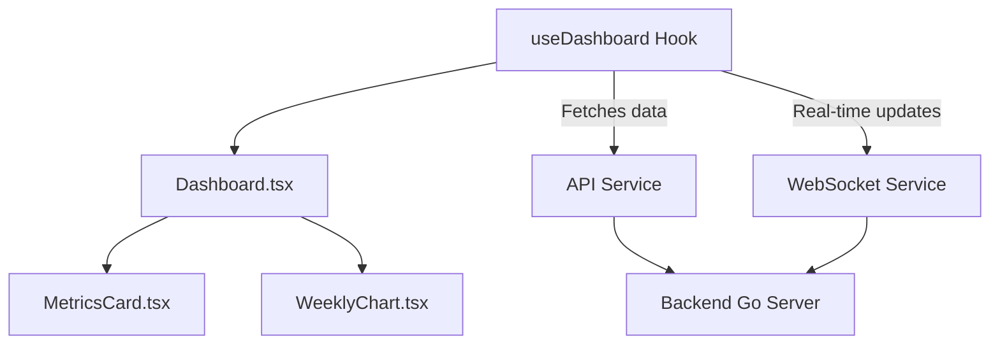
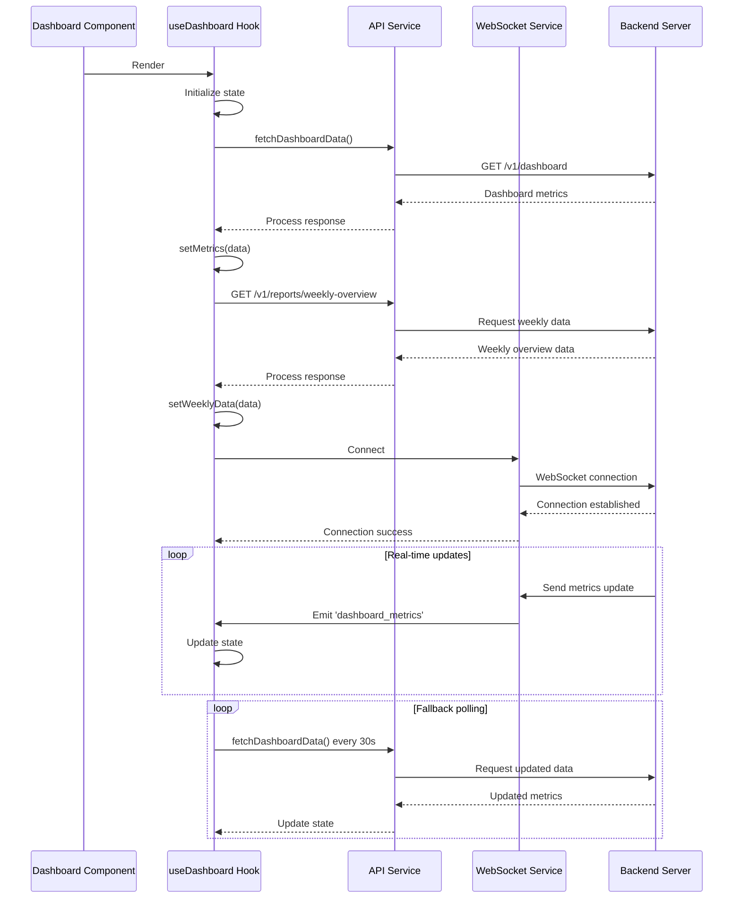
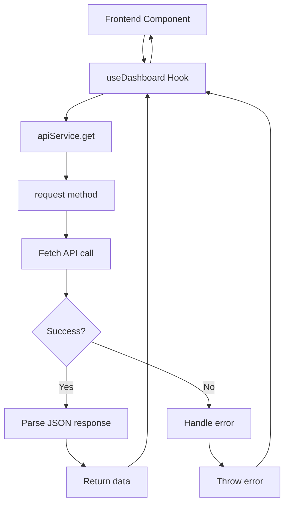
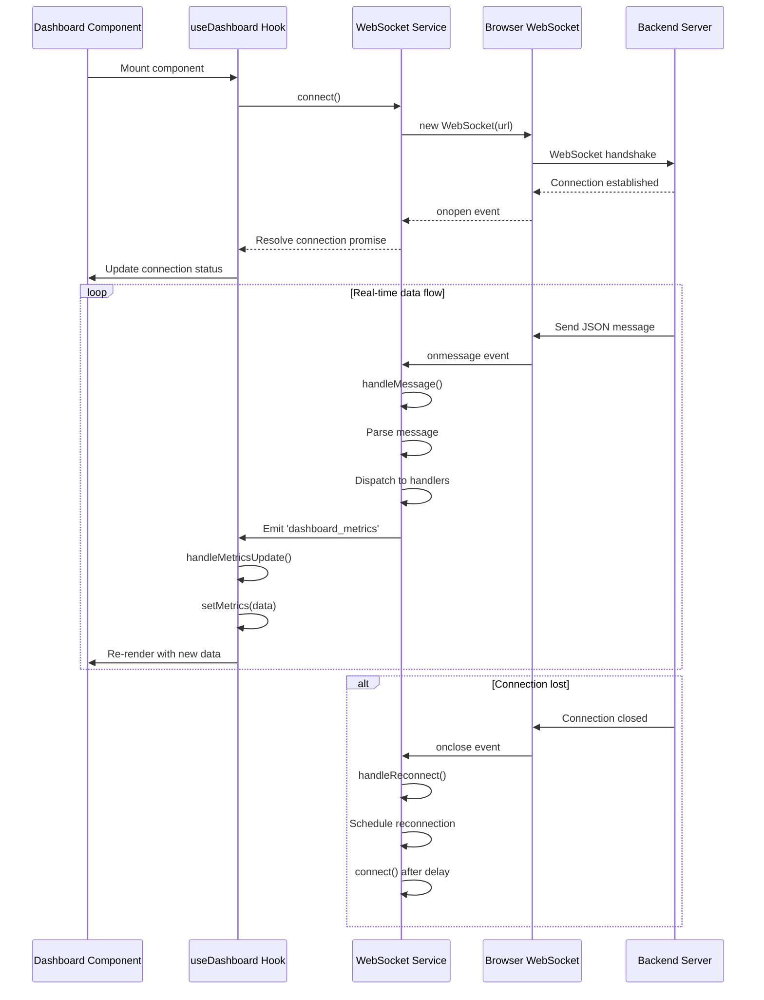

# Dashboard Feature Components


## Table of Contents
1. [Introduction](#introduction)
2. [Core Components Overview](#core-components-overview)
3. [Dashboard.tsx: Main Container Component](#dashboardtsx-main-container-component)
4. [MetricsCard.tsx: Key Performance Indicator Display](#metricscardtsx-key-performance-indicator-display)
5. [WeeklyChart.tsx: Time-Series Data Visualization](#weeklycharttsx-time-series-data-visualization)
6. [useDashboard Hook: Data Orchestration](#usedashboard-hook-data-orchestration)
7. [Data Flow from Backend to UI](#data-flow-from-backend-to-ui)
8. [Real-Time Updates with WebSocket](#real-time-updates-with-websocket)
9. [Responsive Design and Accessibility](#responsive-design-and-accessibility)
10. [Export Mechanisms in index.ts](#export-mechanisms-in-indexts)

## Introduction
The Dashboard feature in Exim-Pilot provides a comprehensive overview of mail server performance and system health. This document details the implementation of the dashboard components, focusing on how they work together to deliver real-time metrics and visualizations. The system integrates frontend React components with backend Go services through REST APIs and WebSocket connections, creating a responsive and informative user interface for monitoring email delivery systems.

## Core Components Overview
The Dashboard feature consists of three primary components:
- **Dashboard.tsx**: Main container orchestrating layout and data flow
- **MetricsCard.tsx**: Reusable component for displaying key performance indicators (KPIs)
- **WeeklyChart.tsx**: Component for visualizing time-series email delivery data

These components are coordinated by the **useDashboard** custom hook, which manages data fetching from backend APIs and real-time updates via WebSocket. The components are exported through **index.ts** for modular imports across the application.





**Diagram sources**
- [Dashboard.tsx](file://web/src/components/Dashboard/Dashboard.tsx)
- [useDashboard.ts](file://web/src/hooks/useDashboard.ts)
- [api.ts](file://web/src/services/api.ts)
- [websocket.ts](file://web/src/services/websocket.ts)

## Dashboard.tsx: Main Container Component

The Dashboard component serves as the central orchestrator for the dashboard interface, managing layout, data integration, and user experience elements. It imports and coordinates all dashboard-specific components while handling connection status and error states.

Key responsibilities include:
- Initializing WebSocket connection for real-time updates
- Managing loading and error states
- Structuring the UI layout with responsive grid system
- Integrating help tooltips and user guidance


```tsx
export default function Dashboard() {
  const { state, actions } = useApp();
  const { metrics, weeklyData, loading, error, refreshData } = useDashboard();

  useEffect(() => {
    if (!webSocketService.isConnected()) {
      webSocketService.connect()
        .then(() => actions.setConnectionStatus('connected'))
        .catch((error) => {
          console.error('Failed to connect to WebSocket:', error);
          actions.setConnectionStatus('disconnected');
          actions.addNotification({
            type: 'warning',
            message: 'Real-time updates unavailable. Data will refresh periodically.'
          });
        });
    }
  }, [actions]);

  if (loading && !metrics) {
    return <LoadingSpinner size="lg" className="py-12" />;
  }

  if (error && !metrics) {
    return (
      <div className="space-y-6">
        <div className="bg-red-50 border border-red-200 rounded-lg p-6">
          <h3 className="text-lg font-semibold text-red-800 mb-2">
            Failed to Load Dashboard
          </h3>
          <p className="text-red-700 mb-4">{error}</p>
          <button
            onClick={refreshData}
            className="bg-red-600 text-white px-4 py-2 rounded-md hover:bg-red-700 transition-colors"
          >
            Retry
          </button>
        </div>
      </div>
    );
  }

  return (
    <div className="space-y-6">
      {/* Welcome Section */}
      <div className="bg-white rounded-lg shadow-md p-6">
        <div className="flex items-center justify-between mb-4">
          <div>
            <div className="flex items-center gap-2">
              <h2 className="text-2xl font-semibold text-gray-800">
                Welcome to Exim-Pilot
              </h2>
              <HelpTooltip 
                content={getHelpContent('dashboard', 'overview')}
                position="right"
              />
            </div>
            <p className="text-gray-600 mt-1">
              Your comprehensive web-based management interface for Exim mail servers.
            </p>
          </div>
          <div className="flex items-center space-x-2">
            <div className={`w-3 h-3 rounded-full ${
              state.connectionStatus === 'connected' ? 'bg-green-500' : 
              state.connectionStatus === 'connecting' ? 'bg-yellow-500' : 'bg-red-500'
            }`}></div>
            <span className="text-sm text-gray-600">
              {state.connectionStatus === 'connected' ? 'Live' : 
               state.connectionStatus === 'connecting' ? 'Connecting' : 'Offline'}
            </span>
          </div>
        </div>
        
        <div className="grid grid-cols-1 md:grid-cols-3 gap-4">
          <div className="bg-blue-50 p-4 rounded-lg">
            <h3 className="font-semibold text-blue-900">Queue Management</h3>
            <p className="text-blue-700 text-sm">Monitor and manage mail queue</p>
          </div>
          <div className="bg-green-50 p-4 rounded-lg">
            <h3 className="font-semibold text-green-900">Log Monitoring</h3>
            <p className="text-green-700 text-sm">Real-time log analysis</p>
          </div>
          <div className="bg-purple-50 p-4 rounded-lg">
            <h3 className="font-semibold text-purple-900">Reports</h3>
            <p className="text-purple-700 text-sm">Deliverability analytics</p>
          </div>
        </div>
      </div>

      {/* Key Metrics */}
      <div className="grid grid-cols-1 md:grid-cols-2 lg:grid-cols-4 gap-6">
        <MetricsCard
          title="Queue Messages"
          value={metrics?.queue?.total ?? 0}
          subtitle="Total messages in queue"
          color="blue"
          trend={metrics?.queue?.recent_growth ? {
            value: metrics?.queue?.recent_growth,
            direction: metrics?.queue?.recent_growth > 0 ? 'up' : 
                     metrics?.queue?.recent_growth < 0 ? 'down' : 'stable'
          } : undefined}
          loading={loading}
          helpContent={getHelpContent('dashboard', 'queueMessages')}
        />
        
        <MetricsCard
          title="Delivered Today"
          value={metrics?.delivery?.delivered_today ?? 0}
          subtitle={`${(metrics?.delivery?.success_rate ?? 0).toFixed(1)}% success rate`}
          color="green"
          loading={loading}
          helpContent={getHelpContent('dashboard', 'deliveredToday')}
        />
        
        <MetricsCard
          title="Deferred"
          value={metrics?.queue?.deferred ?? 0}
          subtitle="Temporary delivery failures"
          color="yellow"
          loading={loading}
          helpContent={getHelpContent('dashboard', 'deferred')}
        />
        
        <MetricsCard
          title="Frozen"
          value={metrics?.queue?.frozen ?? 0}
          subtitle={metrics?.queue?.oldest_message_age ? 
            `Oldest: ${formatAge(metrics.queue?.oldest_message_age)}` : 
            'No frozen messages'
          }
          color="red"
          loading={loading}
          helpContent={getHelpContent('dashboard', 'frozen')}
        />
      </div>

      {/* Additional Metrics Row */}
      <div className="grid grid-cols-1 md:grid-cols-3 gap-6">
        <MetricsCard
          title="Failed Today"
          value={metrics?.delivery?.failed_today ?? 0}
          subtitle="Permanent delivery failures"
          color="red"
          loading={loading}
          helpContent={getHelpContent('dashboard', 'failedToday')}
        />
        
        <MetricsCard
          title="Pending Today"
          value={metrics?.delivery?.pending_today ?? 0}
          subtitle="Awaiting delivery"
          color="yellow"
          loading={loading}
          helpContent={getHelpContent('dashboard', 'pendingToday')}
        />
        
        <MetricsCard
          title="Log Entries"
          value={metrics?.system?.log_entries_today ?? 0}
          subtitle="Processed today"
          color="gray"
          loading={loading}
          helpContent={getHelpContent('dashboard', 'logEntries')}
        />
      </div>

      {/* Weekly Overview Chart */}
      <WeeklyChart data={weeklyData} loading={loading} />

      {/* Help Section */}
      <div className="space-y-4">
        <HelpSection title="Dashboard Help" className="bg-blue-50 border-blue-200">
          <div className="space-y-4">
            <div>
              <h4 className="font-semibold text-gray-800 mb-2">Understanding the Metrics</h4>
              <ul className="space-y-2 text-sm text-gray-700">
                <li><strong>Queue Messages:</strong> Total messages waiting for delivery</li>
                <li><strong>Delivered Today:</strong> Successfully delivered messages with success rate</li>
                <li><strong>Deferred:</strong> Messages with temporary delivery failures</li>
                <li><strong>Frozen:</strong> Messages paused and requiring manual intervention</li>
              </ul>
            </div>
          </div>
        </HelpSection>
      </div>
    </div>
  );
}
```


**Section sources**
- [Dashboard.tsx](file://web/src/components/Dashboard/Dashboard.tsx#L0-L231)

## MetricsCard.tsx: Key Performance Indicator Display

The MetricsCard component is a reusable UI element designed to display key performance indicators with consistent styling and interactive features. It supports various color schemes, trend indicators, and loading states.

Key features:
- Configurable color themes for different metric types
- Trend indicators with directional arrows and color coding
- Loading state with skeleton screen animation
- Integrated help tooltips for user guidance
- Responsive design with Tailwind CSS


```tsx
export function MetricsCard({ 
  title, 
  value, 
  subtitle, 
  color = 'blue', 
  trend, 
  loading = false,
  helpContent
}: MetricsCardProps) {
  const colors = colorClasses[color];

  if (loading) {
    return (
      <div className={`${colors.bg} p-6 rounded-lg border border-gray-200`}>
        <div className="animate-pulse">
          <div className="h-4 bg-gray-300 rounded w-3/4 mb-3"></div>
          <div className="h-8 bg-gray-300 rounded w-1/2 mb-2"></div>
          <div className="h-3 bg-gray-300 rounded w-2/3"></div>
        </div>
      </div>
    );
  }

  return (
    <div className={`${colors.bg} p-6 rounded-lg border border-gray-200 transition-all duration-200 hover:shadow-md`}>
      <div className="flex items-start justify-between">
        <div className="flex-1">
          <div className="flex items-center gap-2">
            <h3 className={`font-semibold ${colors.text} text-sm uppercase tracking-wide`}>
              {title}
            </h3>
            {helpContent && (
              <HelpTooltip content={helpContent} position="top" />
            )}
          </div>
          <div className={`text-3xl font-bold ${colors.value} mt-2 mb-1`}>
            {typeof value === 'number' ? value.toLocaleString() : value}
          </div>
          {subtitle && (
            <p className={`text-sm ${colors.subtitle}`}>
              {subtitle}
            </p>
          )}
        </div>
        
        {trend && (
          <div className={`flex items-center text-sm font-medium ${trendColors[trend.direction]}`}>
            <span className="mr-1">{trendIcons[trend.direction]}</span>
            <span>{Math.abs(trend.value)}%</span>
          </div>
        )}
      </div>
    </div>
  );
}
```


```mermaid
classDiagram
class MetricsCard {
+title : string
+value : string | number
+subtitle? : string
+color? : 'blue' | 'green' | 'yellow' | 'red' | 'purple' | 'gray'
+trend? : { value : number, direction : 'up' | 'down' | 'stable' }
+loading? : boolean
+helpContent? : string
+render() : JSX.Element
}
class MetricsCardProps {
+title : string
+value : string | number
+subtitle? : string
+color? : 'blue' | 'green' | 'yellow' | 'red' | 'purple' | 'gray'
+trend? : { value : number, direction : 'up' | 'down' | 'stable' }
+loading? : boolean
+helpContent? : string
}
MetricsCard --> MetricsCardProps : "implements"
MetricsCard --> HelpTooltip : "uses"
```


**Diagram sources**
- [MetricsCard.tsx](file://web/src/components/Dashboard/MetricsCard.tsx#L0-L109)
- [dashboard.ts](file://web/src/types/dashboard.ts#L40-L47)

**Section sources**
- [MetricsCard.tsx](file://web/src/components/Dashboard/MetricsCard.tsx#L0-L109)

## WeeklyChart.tsx: Time-Series Data Visualization

The WeeklyChart component renders time-series data using ECharts, providing an interactive visualization of email delivery metrics over a seven-day period. It handles both data presentation and user interaction features.

Key implementation details:
- Uses echarts-for-react wrapper for React integration
- Implements responsive chart sizing and formatting
- Provides detailed tooltips with percentage breakdowns
- Supports data zooming and export functionality
- Handles loading states with skeleton screens


```tsx
export function WeeklyChart({ data, loading = false }: WeeklyChartProps) {
  if (loading || !data) {
    return (
      <div className="bg-white rounded-lg shadow-md p-6">
        <h3 className="text-lg font-semibold text-gray-800 mb-4">Weekly Email Overview</h3>
        <div className="h-96 flex items-center justify-center">
          <div className="animate-pulse">
            <div className="h-4 bg-gray-300 rounded w-48 mb-4"></div>
            <div className="space-y-3">
              <div className="h-3 bg-gray-300 rounded w-full"></div>
              <div className="h-3 bg-gray-300 rounded w-5/6"></div>
              <div className="h-3 bg-gray-300 rounded w-4/6"></div>
              <div className="h-3 bg-gray-300 rounded w-3/6"></div>
            </div>
          </div>
        </div>
      </div>
    );
  }

  const option: EChartsOption = {
    title: {
      text: 'Weekly Email Overview',
      left: 'center',
      textStyle: {
        fontSize: 18,
        fontWeight: 'bold',
        color: '#374151'
      }
    },
    tooltip: {
      trigger: 'axis',
      axisPointer: {
        type: 'shadow'
      },
      backgroundColor: 'rgba(255, 255, 255, 0.95)',
      borderColor: '#E5E7EB',
      borderWidth: 1,
      textStyle: {
        color: '#374151'
      },
      formatter: function (params: any) {
        const total = params.reduce((sum: number, param: any) => sum + param.value, 0);
        let result = `<div style="font-weight: bold; margin-bottom: 8px; border-bottom: 1px solid #E5E7EB; padding-bottom: 4px;">${params[0].axisValue}</div>`;
        
        params.forEach((param: any) => {
          const color = param.color;
          const name = param.seriesName;
          const value = param.value.toLocaleString();
          const percentage = total > 0 ? ((param.value / total) * 100).toFixed(1) : '0.0';
          result += `<div style="display: flex; align-items: center; margin: 4px 0;">
            <span style="display:inline-block;margin-right:8px;border-radius:50%;width:10px;height:10px;background-color:${color}"></span>
            <span style="color: #374151;">${name}: <strong>${value}</strong> (${percentage}%)</span>
          </div>`;
        });
        
        result += `<div style="margin-top: 8px; padding-top: 4px; border-top: 1px solid #E5E7EB; font-weight: bold;">Total: ${total.toLocaleString()}</div>`;
        return result;
      }
    },
    legend: {
      data: ['Delivered', 'Failed', 'Pending', 'Deferred'],
      bottom: 10,
      textStyle: {
        color: '#6B7280'
      }
    },
    grid: {
      left: '3%',
      right: '4%',
      bottom: '15%',
      top: '15%',
      containLabel: true
    },
    xAxis: {
      type: 'category',
      data: data.dates,
      axisLabel: {
        color: '#6B7280',
        fontSize: 12
      },
      axisLine: {
        lineStyle: {
          color: '#E5E7EB'
        }
      }
    },
    yAxis: {
      type: 'value',
      axisLabel: {
        color: '#6B7280',
        fontSize: 12,
        formatter: function (value: number) {
          if (value >= 1000000) {
            return (value / 1000000).toFixed(1) + 'M';
          } else if (value >= 1000) {
            return (value / 1000).toFixed(1) + 'K';
          }
          return value.toString();
        }
      },
      axisLine: {
        lineStyle: {
          color: '#E5E7EB'
        }
      },
      splitLine: {
        lineStyle: {
          color: '#F3F4F6'
        }
      }
    },
    series: [
      {
        name: 'Delivered',
        type: 'bar',
        data: data.delivered,
        color: '#10B981',
        emphasis: {
          focus: 'series'
        },
        animationDelay: function (idx: number) {
          return idx * 100;
        }
      },
      {
        name: 'Failed',
        type: 'bar',
        data: data.failed,
        color: '#EF4444',
        emphasis: {
          focus: 'series'
        },
        animationDelay: function (idx: number) {
          return idx * 100 + 100;
        }
      },
      {
        name: 'Pending',
        type: 'bar',
        data: data.pending,
        color: '#F59E0B',
        emphasis: {
          focus: 'series'
        },
        animationDelay: function (idx: number) {
          return idx * 100 + 200;
        }
      },
      {
        name: 'Deferred',
        type: 'bar',
        data: data.deferred,
        color: '#6B7280',
        emphasis: {
          focus: 'series'
        },
        animationDelay: function (idx: number) {
          return idx * 100 + 300;
        }
      }
    ],
    toolbox: {
      show: true,
      feature: {
        dataZoom: {
          yAxisIndex: 'none'
        },
        restore: {},
        saveAsImage: {
          name: 'weekly-email-overview'
        }
      },
      right: 20,
      top: 20
    },
    dataZoom: [
      {
        type: 'inside',
        start: 0,
        end: 100
      },
      {
        start: 0,
        end: 100,
        height: 30,
        bottom: 50
      }
    ]
  };

  return (
    <div className="bg-white rounded-lg shadow-md p-6">
      <ReactECharts
        option={option}
        style={{ height: '400px', width: '100%' }}
        opts={{ renderer: 'canvas' }}
      />
      {helpContent && (
        <HelpTooltip 
          content={getHelpContent('dashboard', 'weeklyChart')}
          position="top"
          className="mt-2"
        />
      )}
    </div>
  );
}
```


**Section sources**
- [WeeklyChart.tsx](file://web/src/components/Dashboard/WeeklyChart.tsx#L0-L282)

## useDashboard Hook: Data Orchestration

The useDashboard custom hook manages all data operations for the dashboard, serving as the central point for data fetching, state management, and real-time updates. It abstracts complex data operations from the UI components.

Key responsibilities:
- Fetching initial dashboard data from REST API
- Managing loading and error states
- Establishing WebSocket connections for real-time updates
- Implementing fallback polling mechanism
- Providing refresh functionality


```tsx
export function useDashboard() {
  const [metrics, setMetrics] = useState<DashboardMetrics | null>(null);
  const [weeklyData, setWeeklyData] = useState<WeeklyOverviewData | null>(null);
  const [loading, setLoading] = useState(true);
  const [error, setError] = useState<string | null>(null);
  const { actions } = useApp();

  const fetchDashboardData = useCallback(async () => {
    try {
      setLoading(true);
      setError(null);

      // Fetch dashboard metrics
      const metricsResponse = await apiService.get<DashboardMetrics>('/v1/dashboard');
      if (metricsResponse.success && metricsResponse.data) {
        setMetrics(metricsResponse.data);
      }

      // Fetch weekly overview data
      const weeklyResponse = await apiService.get<WeeklyOverviewData>('/v1/reports/weekly-overview');
      if (weeklyResponse.success && weeklyResponse.data) {
        setWeeklyData(weeklyResponse.data);
      }

    } catch (err) {
      const errorMessage = err instanceof Error ? err.message : 'Failed to fetch dashboard data';
      setError(errorMessage);
      actions.addNotification({
        type: 'error',
        message: errorMessage
      });
    } finally {
      setLoading(false);
    }
  }, [actions]);

  const handleMetricsUpdate = useCallback((data: DashboardMetrics) => {
    setMetrics(data);
  }, []);

  const handleWeeklyDataUpdate = useCallback((data: WeeklyOverviewData) => {
    setWeeklyData(data);
  }, []);

  useEffect(() => {
    // Initial data fetch
    fetchDashboardData();

    // Set up WebSocket listeners for real-time updates
    webSocketService.on('dashboard_metrics', handleMetricsUpdate);
    webSocketService.on('weekly_overview', handleWeeklyDataUpdate);

    // Set up periodic refresh as fallback
    const refreshInterval = setInterval(fetchDashboardData, 30000); // 30 seconds

    return () => {
      webSocketService.off('dashboard_metrics', handleMetricsUpdate);
      webSocketService.off('weekly_overview', handleWeeklyDataUpdate);
      clearInterval(refreshInterval);
    };
  }, [fetchDashboardData, handleMetricsUpdate, handleWeeklyDataUpdate]);

  const refreshData = useCallback(() => {
    fetchDashboardData();
  }, [fetchDashboardData]);

  return {
    metrics,
    weeklyData,
    loading,
    error,
    refreshData
  };
}
```





**Diagram sources**
- [useDashboard.ts](file://web/src/hooks/useDashboard.ts#L0-L80)
- [api.ts](file://web/src/services/api.ts#L0-L119)
- [websocket.ts](file://web/src/services/websocket.ts#L0-L165)

**Section sources**
- [useDashboard.ts](file://web/src/hooks/useDashboard.ts#L0-L80)

## Data Flow from Backend to UI

The data flow from backend to UI follows a structured pattern that ensures reliable data delivery and responsive user experience. The process involves multiple layers of abstraction and error handling.

### Backend Implementation
The dashboard data originates from the Go backend in `log_handlers.go`, which handles the `/v1/dashboard` endpoint:


```go
// handleDashboard handles GET /api/v1/dashboard - Dashboard metrics
func (h *LogHandlers) handleDashboard(w http.ResponseWriter, r *http.Request) {
    ctx := r.Context()
    
    // Get time range for dashboard metrics (default to last 24 hours)
    hours := 24
    if h, err := strconv.Atoi(r.URL.Query().Get("hours")); err == nil && h > 0 {
        hours = h
    }
    
    // Fetch log statistics for the time period
    logStats, err := h.LogProcessor.GetLogStatistics(ctx, hours)
    if err != nil {
        WriteErrorResponse(w, fmt.Sprintf("Failed to get log statistics: %v", err), http.StatusInternalServerError)
        return
    }
    
    // Get current queue status
    queueStatus, err := h.QueueService.GetStatus(ctx)
    if err != nil {
        WriteErrorResponse(w, fmt.Sprintf("Failed to get queue status: %v", err), http.StatusInternalServerError)
        return
    }
    
    // Get system status
    systemStatus, err := h.SystemService.GetStatus(ctx)
    if err != nil {
        WriteErrorResponse(w, fmt.Sprintf("Failed to get system status: %v", err), http.StatusInternalServerError)
        return
    }
    
    // Create dashboard response
    dashboard := map[string]interface{}{
        "log_statistics": logStats,
        "queue_status":   queueStatus,
        "system_status":  systemStatus,
        "timestamp":      time.Now().UTC().Format(time.RFC3339),
    }
    
    WriteSuccessResponse(w, dashboard)
}
```


### API Service Layer
The frontend API service abstracts HTTP operations with error handling and response processing:





**Diagram sources**
- [api.ts](file://web/src/services/api.ts#L0-L119)
- [useDashboard.ts](file://web/src/hooks/useDashboard.ts#L0-L80)

**Section sources**
- [log_handlers.go](file://internal/api/log_handlers.go#L179-L232)
- [api.ts](file://web/src/services/api.ts#L0-L119)

## Real-Time Updates with WebSocket

The dashboard implements real-time updates through a WebSocket connection, providing immediate feedback on system changes without requiring page refreshes.

### WebSocket Service Implementation
The WebSocket service manages the connection lifecycle, message handling, and reconnection logic:





**Diagram sources**
- [websocket.ts](file://web/src/services/websocket.ts#L0-L165)
- [useDashboard.ts](file://web/src/hooks/useDashboard.ts#L0-L80)

**Section sources**
- [websocket.ts](file://web/src/services/websocket.ts#L0-L165)

## Responsive Design and Accessibility

The dashboard components implement responsive design principles and accessibility features to ensure usability across devices and for all users.

### Responsive Layout
The dashboard uses a mobile-first approach with Tailwind CSS grid system:

- **Mobile**: Single column layout
- **Tablet**: Two-column layout for metrics
- **Desktop**: Four-column layout for primary metrics, three-column for secondary

### Accessibility Features
- **Semantic HTML**: Proper heading hierarchy and ARIA labels
- **Keyboard Navigation**: All interactive elements accessible via keyboard
- **Color Contrast**: Sufficient contrast ratios for text and background colors
- **Screen Reader Support**: Descriptive labels and ARIA attributes
- **Focus Management**: Visible focus indicators for interactive elements

### Implementation Examples

```tsx
// Responsive grid classes
<div className="grid grid-cols-1 md:grid-cols-2 lg:grid-cols-4 gap-6">
  {/* Metrics cards */}
</div>

// Accessible button with proper labeling
<button
  onClick={refreshData}
  className="bg-red-600 text-white px-4 py-2 rounded-md hover:bg-red-700 transition-colors"
  aria-label="Retry loading dashboard data"
>
  Retry
</button>
```


**Section sources**
- [Dashboard.tsx](file://web/src/components/Dashboard/Dashboard.tsx)
- [MetricsCard.tsx](file://web/src/components/Dashboard/MetricsCard.tsx)
- [WeeklyChart.tsx](file://web/src/components/Dashboard/WeeklyChart.tsx)

## Export Mechanisms in index.ts

The index.ts file in the Dashboard components directory provides a clean import interface for other parts of the application, following the barrel file pattern.


```ts
export { default as Dashboard } from './Dashboard';
export { MetricsCard } from './MetricsCard';
export { WeeklyChart } from './WeeklyChart';
```


This export mechanism enables:
- **Clean imports**: Consumers can import components from a single entry point
- **API stability**: Internal file structure changes don't affect consumers
- **Tree-shaking**: Unused components are excluded from final bundle
- **Consistent naming**: Standardized component names across the application

Example usage:

```tsx
import { Dashboard, MetricsCard, WeeklyChart } from '@/components/Dashboard';
```


**Section sources**
- [index.ts](file://web/src/components/Dashboard/index.ts#L0-L3)

**Referenced Files in This Document**   
- [Dashboard.tsx](file://web/src/components/Dashboard/Dashboard.tsx)
- [MetricsCard.tsx](file://web/src/components/Dashboard/MetricsCard.tsx)
- [WeeklyChart.tsx](file://web/src/components/Dashboard/WeeklyChart.tsx)
- [index.ts](file://web/src/components/Dashboard/index.ts)
- [useDashboard.ts](file://web/src/hooks/useDashboard.ts)
- [api.ts](file://web/src/services/api.ts)
- [websocket.ts](file://web/src/services/websocket.ts)
- [dashboard.ts](file://web/src/types/dashboard.ts)
- [log_handlers.go](file://internal/api/log_handlers.go)
- [server.go](file://internal/api/server.go)