# Queue Management Components

## Table of Contents
1. [Introduction](#introduction)
2. [Component Composition and Architecture](#component-composition-and-architecture)
3. [Core Components Analysis](#core-components-analysis)
4. [State Management and API Integration](#state-management-and-api-integration)
5. [Queue Operations and Event Handling](#queue-operations-and-event-handling)
6. [Performance Optimization](#performance-optimization)
7. [Error Handling and Validation](#error-handling-and-validation)
8. [Conclusion](#conclusion)

## Introduction
The Queue Management system provides a comprehensive interface for monitoring and managing email messages in the Exim mail queue. This document details the implementation of the frontend components and their integration with backend services, focusing on the component architecture, state management, API interactions, and performance optimizations. The system enables administrators to view, search, filter, and perform operations on queued messages, with support for both individual and bulk actions.

## Component Composition and Architecture

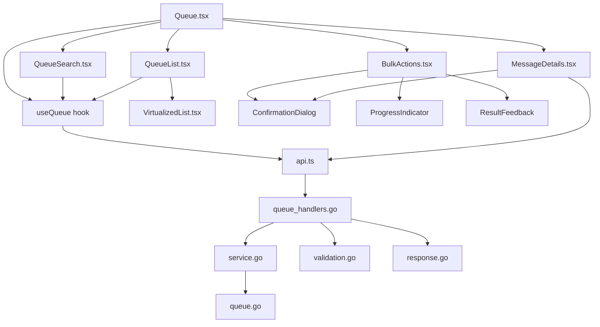

**Diagram sources**
- [Queue.tsx](file://web/src/components/Queue/Queue.tsx)
- [QueueSearch.tsx](file://web/src/components/Queue/QueueSearch.tsx)
- [BulkActions.tsx](file://web/src/components/Queue/BulkActions.tsx)
- [QueueList.tsx](file://web/src/components/Queue/QueueList.tsx)
- [MessageDetails.tsx](file://web/src/components/Queue/MessageDetails.tsx)
- [useQueue.ts](file://web/src/hooks/useQueue.ts)
- [api.ts](file://web/src/services/api.ts)
- [queue_handlers.go](file://internal/api/queue_handlers.go)
- [service.go](file://internal/queue/service.go)
- [queue.go](file://internal/queue/queue.go)
- [validation.go](file://internal/validation/service.go)
- [response.go](file://internal/api/response.go)

**Section sources**
- [Queue.tsx](file://web/src/components/Queue/Queue.tsx)
- [queue_handlers.go](file://internal/api/queue_handlers.go)

## Core Components Analysis

### Queue.tsx: Primary Interface

The Queue component serves as the main container for all queue management functionality, orchestrating the interaction between various subcomponents. It manages the overall state and coordinates data flow between search, list, bulk actions, and message details components.

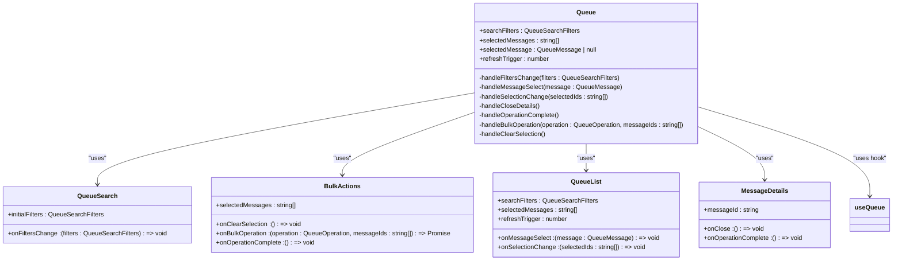

**Diagram sources**
- [Queue.tsx](file://web/src/components/Queue/Queue.tsx)

**Section sources**
- [Queue.tsx](file://web/src/components/Queue/Queue.tsx)

### QueueList.tsx: Message Display Component

The QueueList component renders the list of messages in the queue, providing sorting, pagination, and selection capabilities. It supports both standard and virtualized rendering modes for optimal performance.

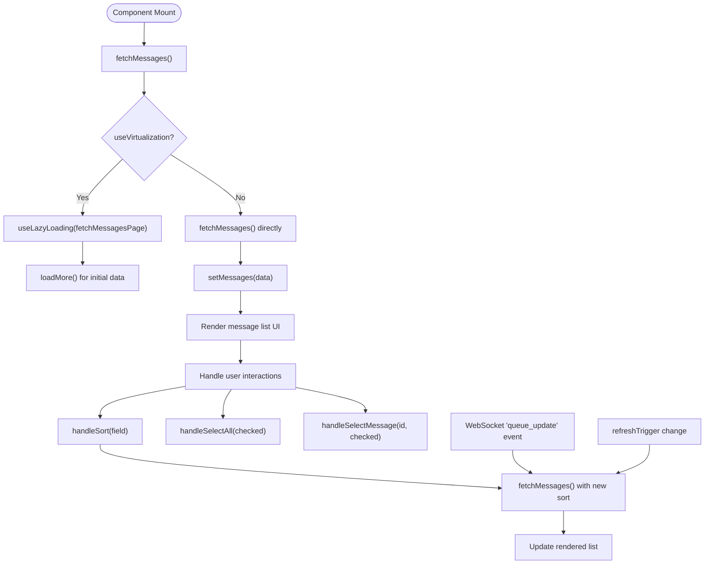

**Diagram sources**
- [QueueList.tsx](file://web/src/components/Queue/QueueList.tsx)

**Section sources**
- [QueueList.tsx](file://web/src/components/Queue/QueueList.tsx)

### QueueSearch.tsx: Filtering Interface

The QueueSearch component provides a user interface for filtering queue messages based on various criteria, with support for both basic and advanced search options.

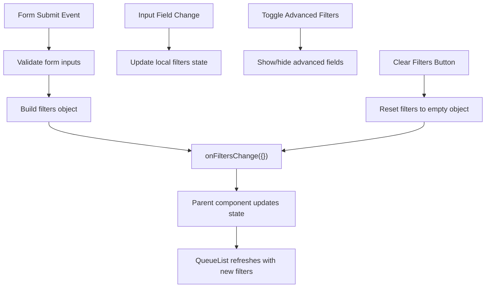

**Diagram sources**
- [QueueSearch.tsx](file://web/src/components/Queue/QueueSearch.tsx)

**Section sources**
- [QueueSearch.tsx](file://web/src/components/Queue/QueueSearch.tsx)

### BulkActions.tsx: Batch Processing Component

The BulkActions component enables users to perform operations on multiple selected messages simultaneously, with confirmation dialogs and progress feedback.

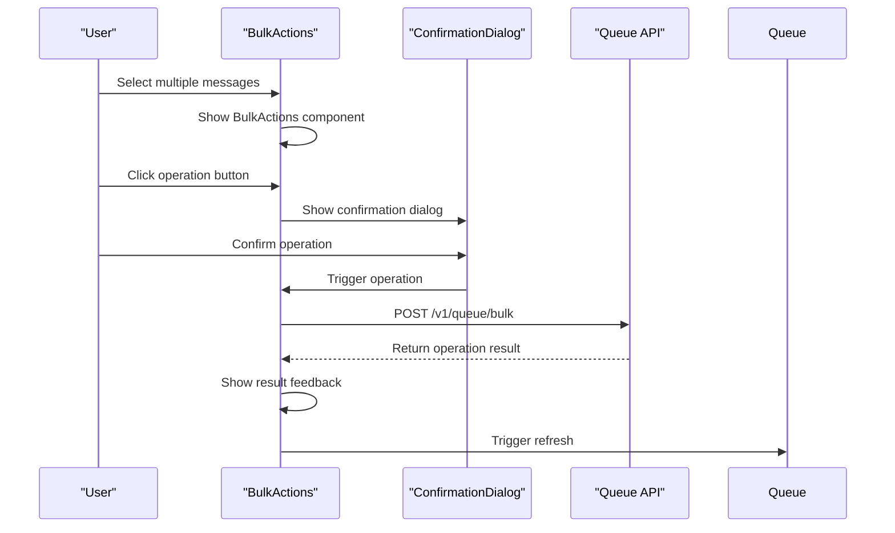

**Diagram sources**
- [BulkActions.tsx](file://web/src/components/Queue/BulkActions.tsx)

**Section sources**
- [BulkActions.tsx](file://web/src/components/Queue/BulkActions.tsx)

### MessageDetails.tsx: Individual Message Inspection

The MessageDetails component provides a detailed view of a single message's properties and allows for individual operations on that message.

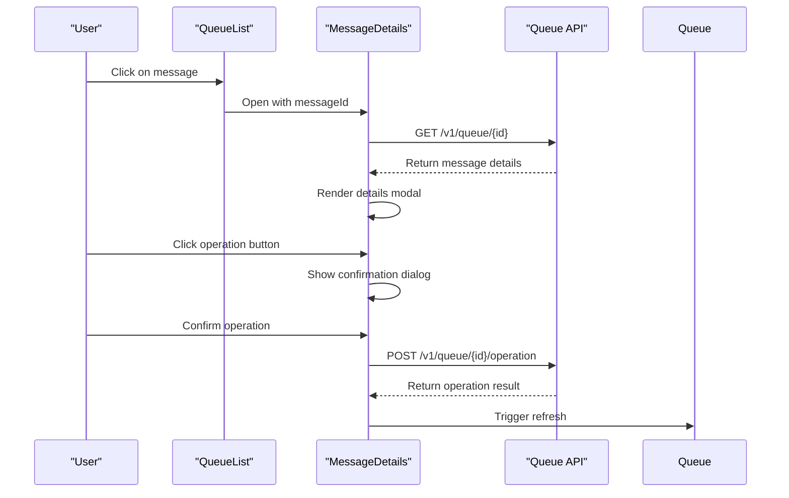

**Diagram sources**
- [MessageDetails.tsx](file://web/src/components/Queue/MessageDetails.tsx)

**Section sources**
- [MessageDetails.tsx](file://web/src/components/Queue/MessageDetails.tsx)

## State Management and API Integration

### useQueue Hook Implementation

The useQueue custom hook provides centralized state management and API interaction for queue-related functionality, abstracting the complexity of API calls and state updates.

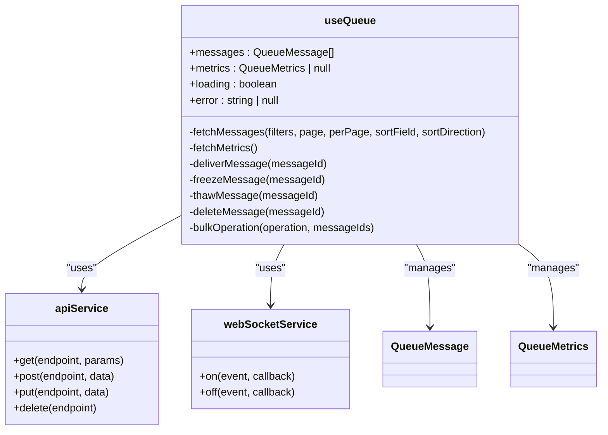

**Section sources**
- [useQueue.ts](file://web/src/hooks/useQueue.ts)

### API Service Layer

The API service layer handles HTTP communication with the backend, providing a consistent interface for all API operations with error handling and response parsing.

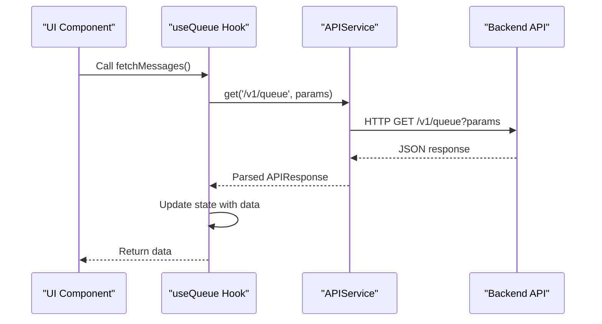

**Diagram sources**
- [api.ts](file://web/src/services/api.ts)
- [useQueue.ts](file://web/src/hooks/useQueue.ts)

**Section sources**
- [api.ts](file://web/src/services/api.ts)
- [useQueue.ts](file://web/src/hooks/useQueue.ts)

## Queue Operations and Event Handling

### Backend API Endpoints

The backend provides a comprehensive set of REST endpoints for queue management operations, each with proper validation and error handling.

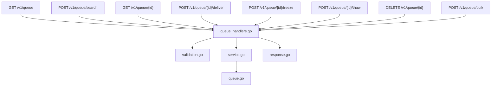

**Diagram sources**
- [queue_handlers.go](file://internal/api/queue_handlers.go)
- [service.go](file://internal/queue/service.go)
- [queue.go](file://internal/queue/queue.go)
- [validation.go](file://internal/validation/service.go)
- [response.go](file://internal/api/response.go)

**Section sources**
- [queue_handlers.go](file://internal/api/queue_handlers.go)

### Operation Flow for Individual Messages

The process for performing operations on individual messages follows a consistent pattern across all operation types.

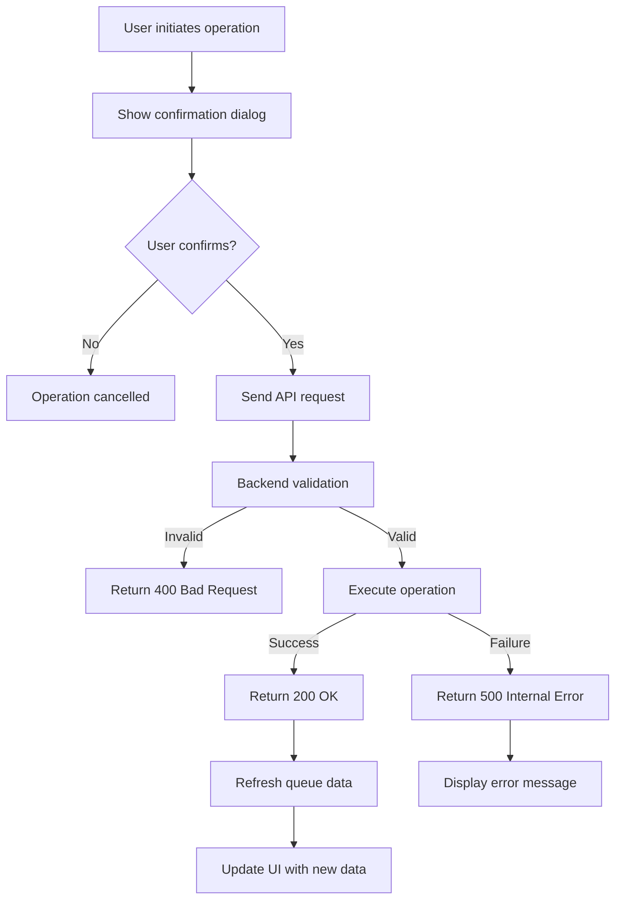

**Section sources**
- [queue_handlers.go](file://internal/api/queue_handlers.go)
- [MessageDetails.tsx](file://web/src/components/Queue/MessageDetails.tsx)

### Bulk Operations Implementation

Bulk operations allow users to perform actions on multiple messages simultaneously, with progress tracking and result reporting.

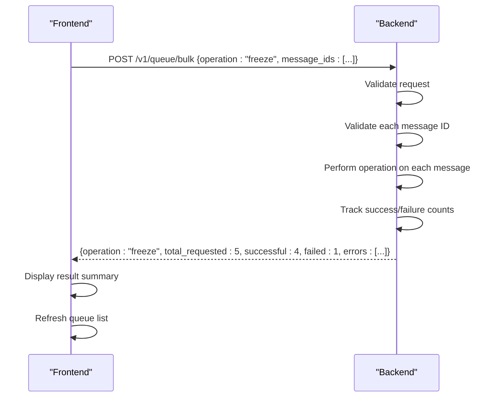

**Diagram sources**
- [queue_handlers.go](file://internal/api/queue_handlers.go)
- [BulkActions.tsx](file://web/src/components/Queue/BulkActions.tsx)

**Section sources**
- [queue_handlers.go](file://internal/api/queue_handlers.go)
- [BulkActions.tsx](file://web/src/components/Queue/BulkActions.tsx)

## Performance Optimization

### Virtualization Implementation

For large queues, the system implements virtualization to maintain smooth performance by only rendering visible items.

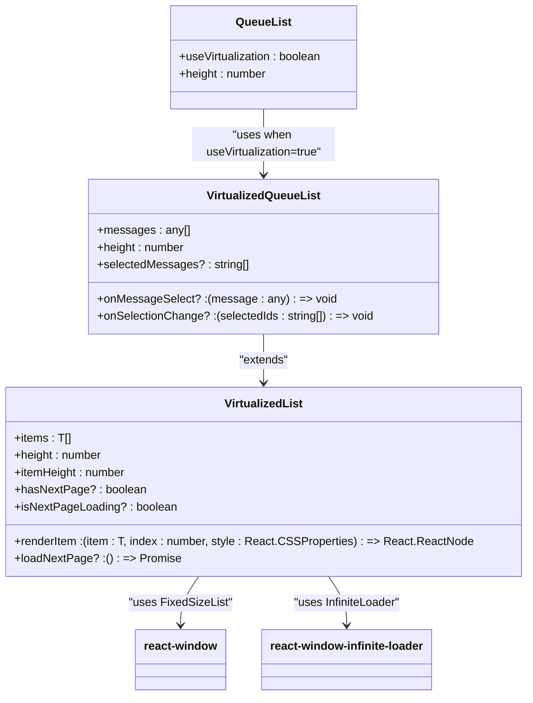

**Diagram sources**
- [VirtualizedList.tsx](file://web/src/components/Common/VirtualizedList.tsx)
- [QueueList.tsx](file://web/src/components/Queue/QueueList.tsx)

**Section sources**
- [VirtualizedList.tsx](file://web/src/components/Common/VirtualizedList.tsx)
- [QueueList.tsx](file://web/src/components/Queue/QueueList.tsx)

### Data Fetching Strategies

The system employs multiple data fetching strategies to optimize performance based on the use case and data size.

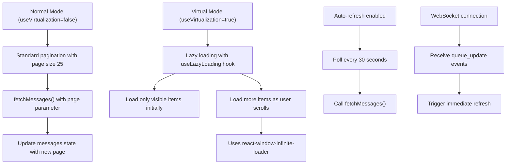

**Section sources**
- [QueueList.tsx](file://web/src/components/Queue/QueueList.tsx)
- [useQueue.ts](file://web/src/hooks/useQueue.ts)
- [VirtualizedList.tsx](file://web/src/components/Common/VirtualizedList.tsx)

## Error Handling and Validation

### Frontend Error Handling

The frontend implements comprehensive error handling at multiple levels to provide meaningful feedback to users.

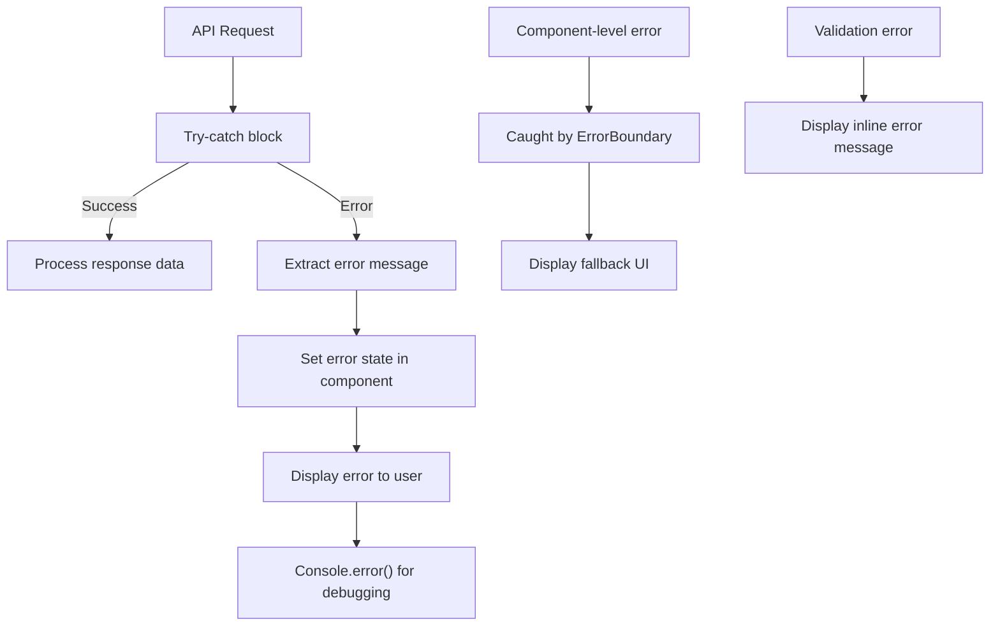

**Section sources**
- [QueueList.tsx](file://web/src/components/Queue/QueueList.tsx)
- [MessageDetails.tsx](file://web/src/components/Queue/MessageDetails.tsx)
- [BulkActions.tsx](file://web/src/components/Queue/BulkActions.tsx)

### Backend Validation Process

The backend implements a robust validation process to ensure data integrity and security before processing queue operations.

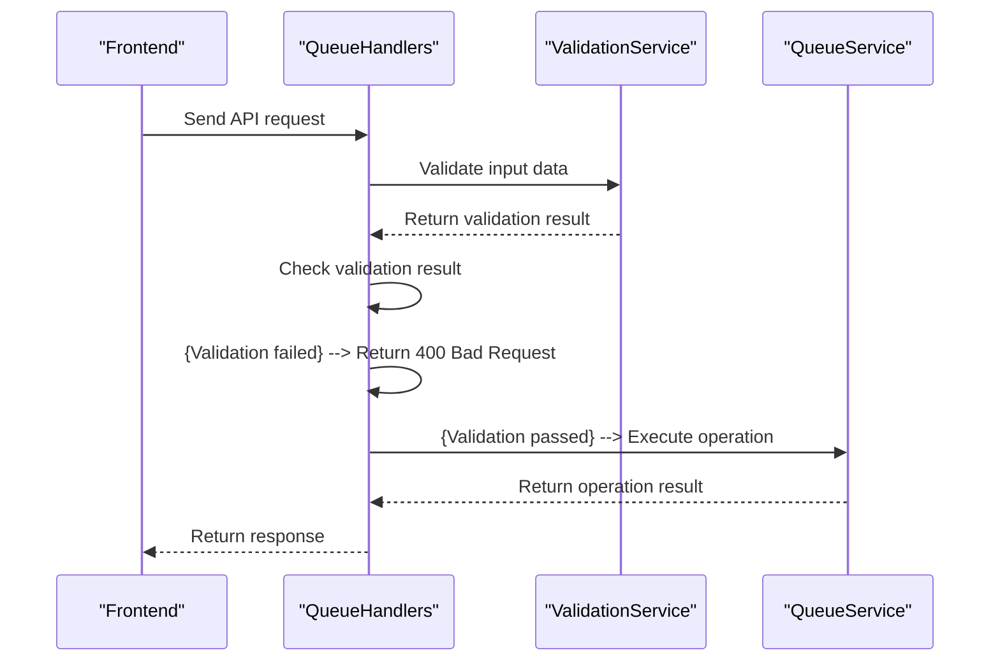

**Diagram sources**
- [queue_handlers.go](file://internal/api/queue_handlers.go)
- [validation.go](file://internal/validation/service.go)

**Section sources**
- [queue_handlers.go](file://internal/api/queue_handlers.go)
- [validation.go](file://internal/validation/service.go)

## Conclusion
The Queue Management system provides a comprehensive and performant interface for managing email messages in the Exim mail queue. The component architecture follows a clear hierarchy with Queue.tsx serving as the primary container that orchestrates interactions between specialized subcomponents. State management is centralized through the useQueue custom hook, which provides a clean API for data fetching and operations while handling the complexity of API interactions and state updates.

The system implements robust error handling at both frontend and backend levels, with comprehensive validation to ensure data integrity. Performance optimizations such as virtualization and lazy loading ensure smooth operation even with large queues. The backend API provides a consistent REST interface with proper error responses and validation, while the frontend components provide an intuitive user experience with confirmation dialogs, progress indicators, and result feedback.

Key strengths of the implementation include:
- Clear separation of concerns between components
- Centralized state management with the useQueue hook
- Comprehensive validation at both frontend and backend
- Performance optimizations for large datasets
- Consistent user experience across individual and bulk operations
- Real-time updates through WebSocket integration

This architecture provides a solid foundation for queue management that is both user-friendly and technically robust, capable of handling the demands of email server administration.

**Referenced Files in This Document**   
- [Queue.tsx](file://web/src/components/Queue/Queue.tsx)
- [QueueList.tsx](file://web/src/components/Queue/QueueList.tsx)
- [QueueSearch.tsx](file://web/src/components/Queue/QueueSearch.tsx)
- [BulkActions.tsx](file://web/src/components/Queue/BulkActions.tsx)
- [MessageDetails.tsx](file://web/src/components/Queue/MessageDetails.tsx)
- [useQueue.ts](file://web/src/hooks/useQueue.ts)
- [queue.ts](file://web/src/types/queue.ts)
- [queue_handlers.go](file://internal/api/queue_handlers.go)
- [service.go](file://internal/queue/service.go)
- [queue.go](file://internal/queue/queue.go)
- [api.ts](file://web/src/services/api.ts)
- [response.go](file://internal/api/response.go)
- [validation.go](file://internal/validation/service.go)
- [VirtualizedList.tsx](file://web/src/components/Common/VirtualizedList.tsx)