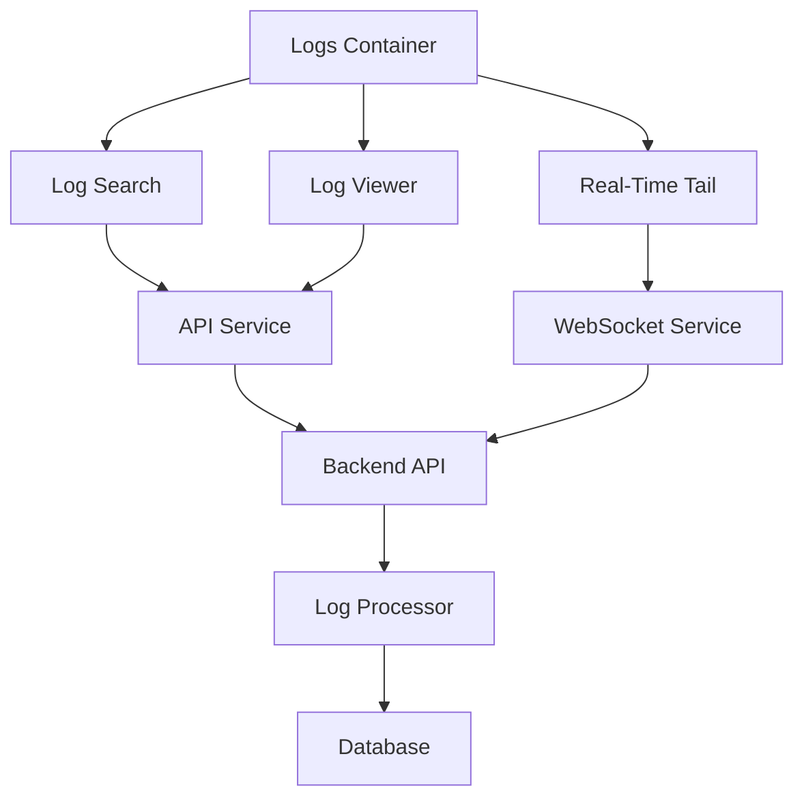
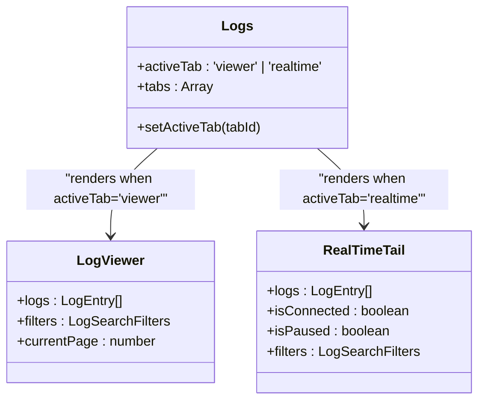
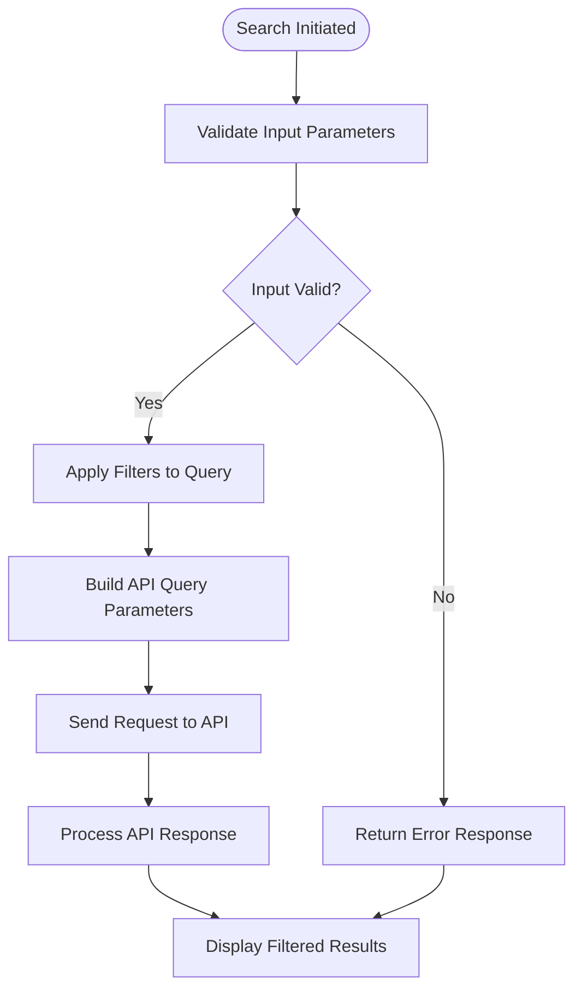
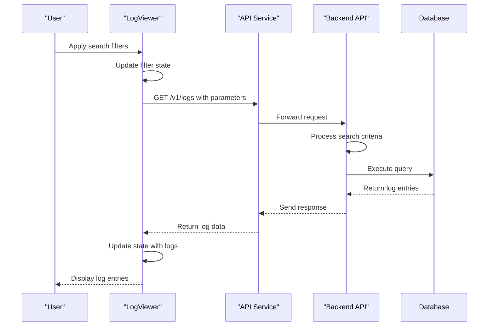
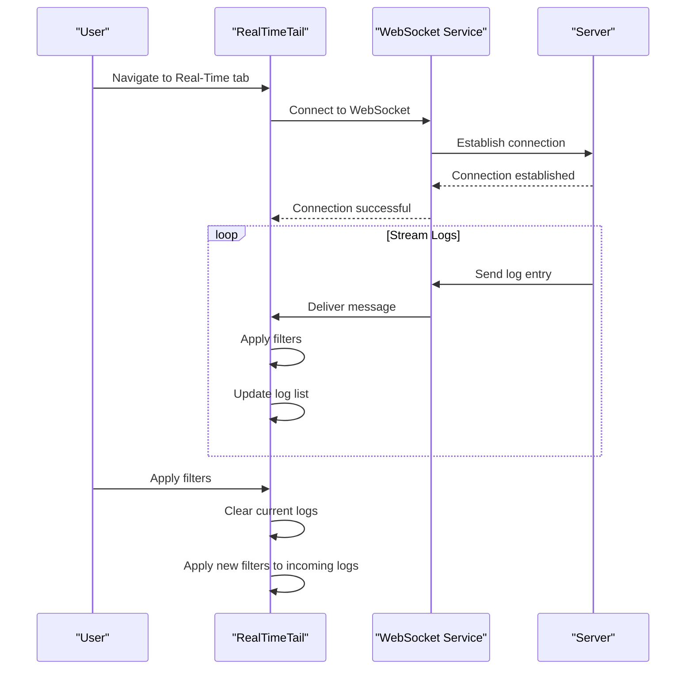
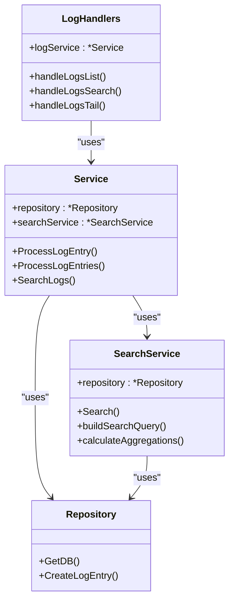
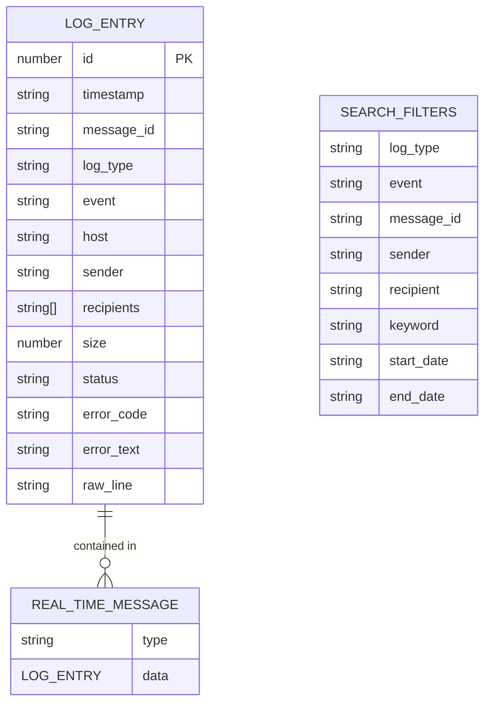

# Logs Feature Components

## Table of Contents
1. [Introduction](#introduction)
2. [Core Components Overview](#core-components-overview)
3. [Logs Container Architecture](#logs-container-architecture)
4. [Log Search Implementation](#log-search-implementation)
5. [Log Viewer Component](#log-viewer-component)
6. [Real-Time Log Streaming](#real-time-log-streaming)
7. [Backend Log Processing](#backend-log-processing)
8. [Data Structures and Types](#data-structures-and-types)
9. [Performance and UX Considerations](#performance-and-ux-considerations)
10. [Error Handling and Recovery](#error-handling-and-recovery)

## Introduction
The Logs feature in the Exim Pilot application provides comprehensive monitoring and analysis capabilities for Exim mail server logs. This documentation details the architecture and implementation of the logs components, covering both frontend and backend systems. The feature supports two primary modes: historical log viewing with advanced search capabilities and real-time log monitoring through WebSocket streaming. The system is designed to handle large datasets efficiently while providing an intuitive user interface for log analysis, filtering, and export.

## Core Components Overview
The Logs feature consists of several interconnected components that work together to provide a complete log monitoring solution. The architecture follows a modular design with clear separation of concerns between the container component, search functionality, log display, and real-time streaming. The frontend components are built using React with TypeScript, while the backend processing is implemented in Go. The system integrates with a WebSocket service for real-time updates and an API service for historical data retrieval.

**Diagram sources**
- [Logs.tsx](file://web/src/components/Logs/Logs.tsx)
- [websocket.ts](file://web/src/services/websocket.ts)
- [api.ts](file://web/src/services/api.ts)

## Logs Container Architecture
The Logs component serves as the main container that orchestrates the log monitoring functionality. It implements a tab-based interface that allows users to switch between historical log viewing and real-time monitoring modes. The container manages the active state and renders the appropriate child component based on user selection.

**Diagram sources**
- [Logs.tsx](file://web/src/components/Logs/Logs.tsx#L1-L57)

**Section sources**
- [Logs.tsx](file://web/src/components/Logs/Logs.tsx#L1-L57)

The container maintains the active tab state using React's useState hook and provides a clean navigation interface. When the user selects a tab, the container renders the corresponding component (LogViewer for historical logs or RealTimeTail for live streaming). The component structure follows the single responsibility principle, with the container focusing on state management and layout while delegating specific functionality to specialized child components.

## Log Search Implementation
The LogSearch component provides a comprehensive interface for constructing queries and filtering log entries. It supports both basic and advanced search options, allowing users to filter logs by various criteria including keyword, log type, message ID, sender, recipient, event type, and timestamp range.

**Diagram sources**
- [LogSearch.tsx](file://web/src/components/Logs/LogSearch.tsx#L1-L199)

**Section sources**
- [LogSearch.tsx](file://web/src/components/Logs/LogSearch.tsx#L1-L199)
- [logs.ts](file://web/src/types/logs.ts#L18-L27)

The search functionality is implemented as a controlled form component that manages filter state internally. When the user submits a search, the component calls the onSearch callback with the current filter values. The component supports clearing all filters and provides visual feedback for active filters. The search interface is designed to be user-friendly, with collapsible advanced filters that can be expanded for more detailed querying.

## Log Viewer Component
The LogViewer component is responsible for displaying historical log entries in a tabular format with pagination support. It integrates with the API service to fetch log data based on search filters and provides features for selecting, exporting, and navigating through log entries.

**Diagram sources**
- [LogViewer.tsx](file://web/src/components/Logs/LogViewer.tsx#L1-L338)
- [api.ts](file://web/src/services/api.ts#L1-L119)
- [log_handlers.go](file://internal/api/log_handlers.go#L1-L199)

**Section sources**
- [LogViewer.tsx](file://web/src/components/Logs/LogViewer.tsx#L1-L338)
- [api.ts](file://web/src/services/api.ts#L1-L119)

The component implements several key features:
- **Pagination**: Supports navigating through large datasets with page controls
- **Filtering**: Integrates with LogSearch to apply filters to the displayed logs
- **Selection**: Allows users to select individual or multiple log entries
- **Export**: Provides CSV export functionality for selected logs
- **Error handling**: Displays user-friendly error messages and retry options

The log entries are displayed in a responsive table format with proper formatting for timestamps and color-coded indicators for log types and events. The component handles loading states and errors gracefully, providing feedback to the user during data retrieval.

## Real-Time Log Streaming
The RealTimeTail component enables live monitoring of log entries through WebSocket connections. It establishes a persistent connection to the server and receives new log entries as they are generated, providing real-time visibility into system activity.

**Diagram sources**
- [RealTimeTail.tsx](file://web/src/components/Logs/RealTimeTail.tsx#L1-L387)
- [websocket.ts](file://web/src/services/websocket.ts#L1-L165)

**Section sources**
- [RealTimeTail.tsx](file://web/src/components/Logs/RealTimeTail.tsx#L1-L387)
- [websocket.ts](file://web/src/services/websocket.ts#L1-L165)

Key features of the real-time streaming implementation include:
- **WebSocket connection**: Establishes a persistent connection for real-time updates
- **Filtering**: Applies filters to incoming log entries before display
- **Auto-scroll**: Automatically scrolls to show the most recent logs
- **Pause/resume**: Allows users to pause the stream to examine logs
- **Memory management**: Limits the number of stored logs to prevent memory issues
- **Reconnection**: Automatically attempts to reconnect if the connection is lost

The component uses the webSocketService to manage the WebSocket connection and subscribes to the '/logs/tail' endpoint to receive log entries. Incoming messages are parsed and filtered based on the current filter settings before being added to the log list.

## Backend Log Processing
The backend log processing system is responsible for storing, searching, and serving log data to the frontend components. The Go-based implementation provides robust search capabilities and efficient data retrieval for both historical and real-time log monitoring.

**Diagram sources**
- [log_handlers.go](file://internal/api/log_handlers.go#L1-L199)
- [service.go](file://internal/logprocessor/service.go#L1-L200)
- [search.go](file://internal/logprocessor/search.go#L1-L199)

**Section sources**
- [log_handlers.go](file://internal/api/log_handlers.go#L1-L199)
- [service.go](file://internal/logprocessor/service.go#L1-L200)
- [search.go](file://internal/logprocessor/search.go#L1-L199)

The backend architecture includes:
- **LogHandlers**: API endpoints that handle HTTP requests from the frontend
- **Service**: Core service that coordinates log processing and search operations
- **SearchService**: Specialized service for executing complex search queries
- **Repository**: Data access layer that interacts with the database

The search functionality supports various filtering options including time ranges, message IDs, senders, recipients, log types, events, and keywords. The system returns paginated results with metadata including total count and search time.

## Data Structures and Types
The logs feature uses well-defined data structures to represent log entries, search filters, and real-time messages. These types ensure consistency across the frontend and backend systems and provide type safety for TypeScript components.

**Diagram sources**
- [logs.ts](file://web/src/types/logs.ts#L1-L33)
- [models.go](file://internal/database/models.go#L70-L86)

**Section sources**
- [logs.ts](file://web/src/types/logs.ts#L1-L33)
- [models.go](file://internal/database/models.go#L70-L86)

The key data structures include:
- **LogEntry**: Represents a single log entry with properties for ID, timestamp, message ID, log type, event, host, sender, recipients, size, status, error code, error text, and raw line content
- **LogSearchFilters**: Defines the filtering criteria that can be applied to log searches, including log type, event, message ID, sender, recipient, keyword, and date range
- **RealTimeLogMessage**: Represents a message sent over WebSocket for real-time log streaming, containing a type field and log entry data

The frontend LogEntry interface is aligned with the backend database model, with appropriate type conversions for fields like timestamps (stored as string in frontend, time.Time in backend) and optional fields.

## Performance and UX Considerations
The logs feature incorporates several performance optimizations and UX enhancements to ensure a smooth user experience, especially when dealing with large datasets.

**Performance optimizations:**
- **Virtualized rendering**: The LogViewer component could benefit from virtualized list rendering to improve performance with large numbers of log entries
- **Pagination**: Historical logs are paginated with 50 items per page to prevent overwhelming the UI
- **Memory management**: Real-time logs are limited to 1000 entries to prevent memory issues
- **Efficient filtering**: Filters are applied client-side for real-time logs and server-side for historical logs to optimize performance
- **Debounced searches**: Search requests could be debounced to prevent excessive API calls during typing

**UX considerations:**
- **Tabbed interface**: Clear separation between historical and real-time log viewing modes
- **Responsive design**: Components adapt to different screen sizes
- **Visual feedback**: Loading spinners, error messages, and success indicators
- **Color coding**: Log types and events are displayed with distinct colors for quick identification
- **Export functionality**: CSV export allows users to analyze logs in external tools
- **Clear filters**: Easy way to reset all search criteria
- **Auto-scroll**: Real-time logs automatically scroll to show the latest entries

The system balances the need for comprehensive functionality with performance requirements, ensuring that users can effectively monitor and analyze log data without experiencing performance degradation.

## Error Handling and Recovery
The logs feature implements robust error handling and recovery mechanisms to ensure reliability and provide a good user experience even when issues occur.

**Frontend error handling:**
- **API errors**: The LogViewer component displays user-friendly error messages when API requests fail and provides a retry button
- **WebSocket errors**: The RealTimeTail component automatically attempts to reconnect when the WebSocket connection is lost
- **Form validation**: Input fields are validated, and empty filters are properly handled
- **Graceful degradation**: Components continue to function even if certain features fail

**Backend error handling:**
- **Connection recovery**: The WebSocket service implements automatic reconnection with exponential backoff
- **Error logging**: Both frontend and backend log errors for debugging purposes
- **Input validation**: Search criteria are validated before processing
- **Resource cleanup**: WebSocket subscriptions are properly cleaned up when components are unmounted

The error recovery strategy focuses on maintaining functionality and providing clear feedback to users when issues occur. For example, if the WebSocket connection drops, the system automatically attempts to reconnect while informing the user of the connection status. Similarly, if an API request fails, users can retry the operation with a single click.

**Referenced Files in This Document**   
- [Logs.tsx](file://web/src/components/Logs/Logs.tsx)
- [LogSearch.tsx](file://web/src/components/Logs/LogSearch.tsx)
- [LogViewer.tsx](file://web/src/components/Logs/LogViewer.tsx)
- [RealTimeTail.tsx](file://web/src/components/Logs/RealTimeTail.tsx)
- [websocket.ts](file://web/src/services/websocket.ts)
- [api.ts](file://web/src/services/api.ts)
- [logs.ts](file://web/src/types/logs.ts)
- [log_handlers.go](file://internal/api/log_handlers.go)
- [search.go](file://internal/logprocessor/search.go)
- [service.go](file://internal/logprocessor/service.go)
- [models.go](file://internal/database/models.go)