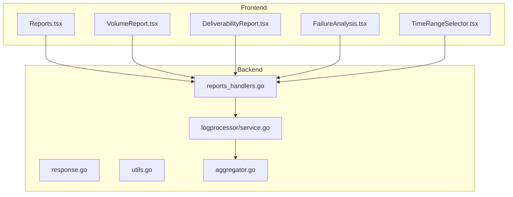
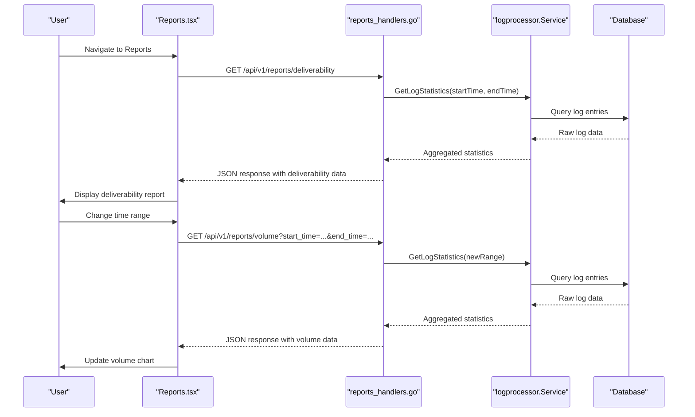
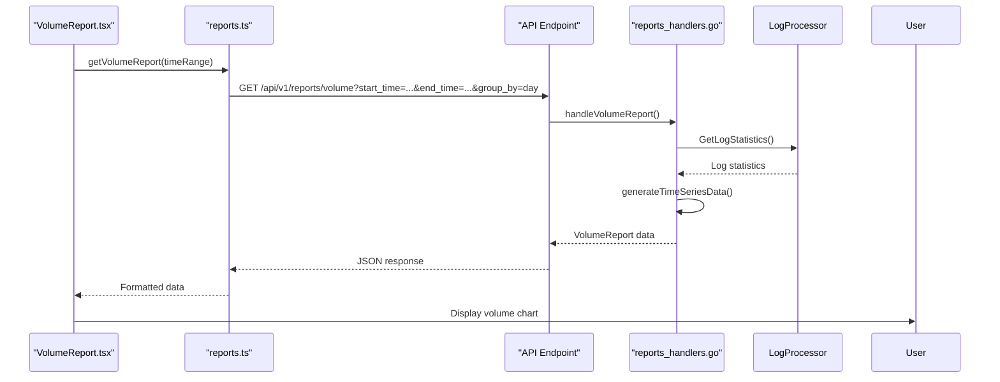
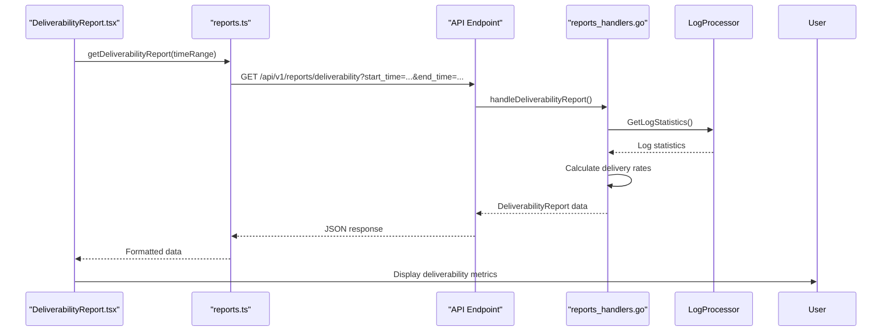
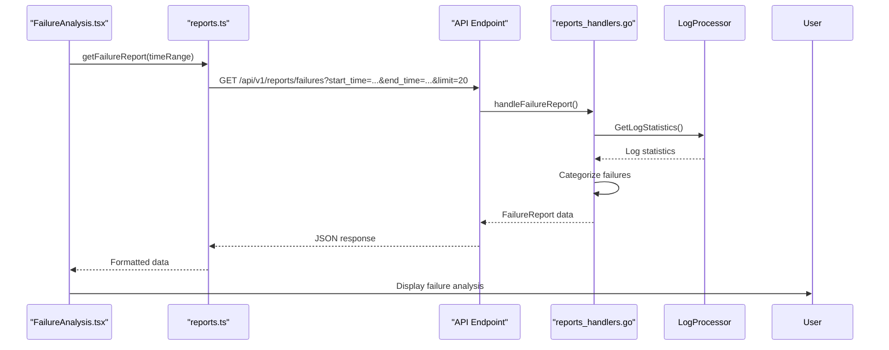
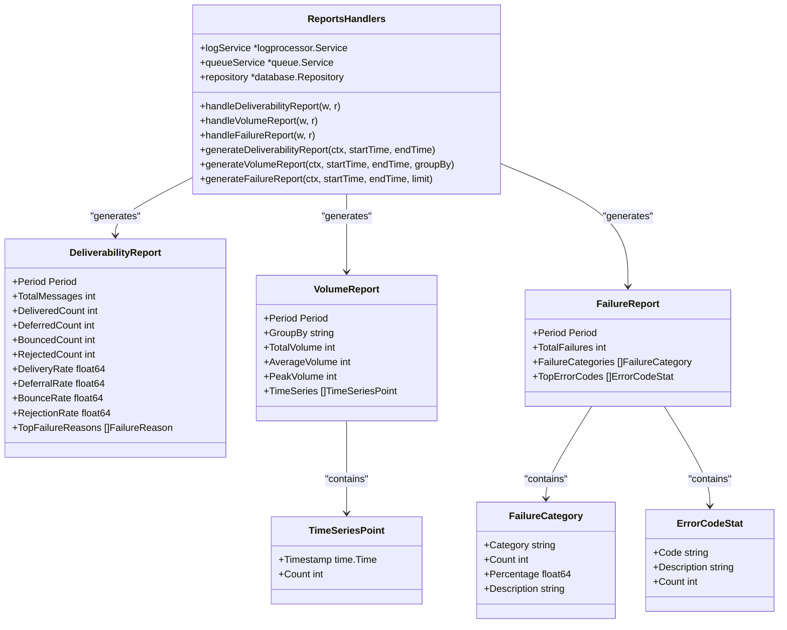
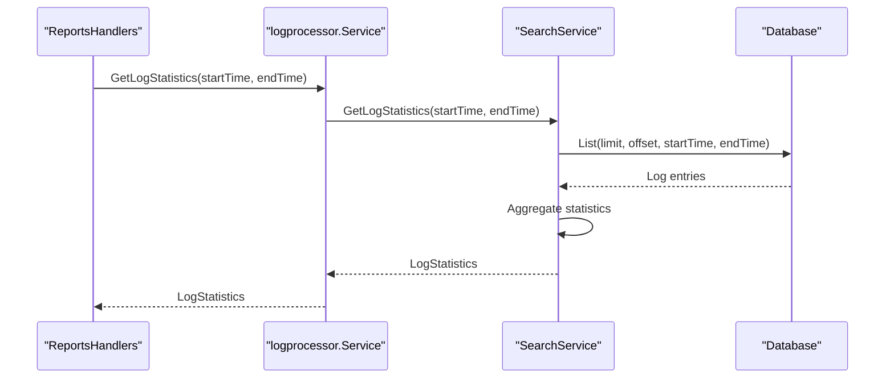
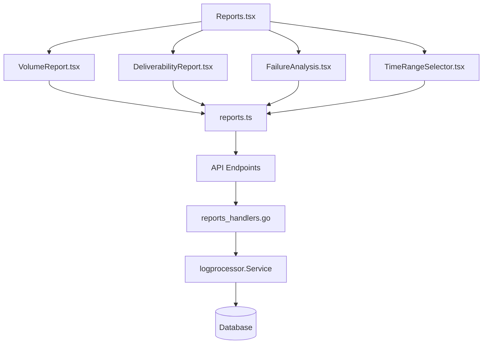

# Reporting Feature Components


## Table of Contents
1. [Introduction](#introduction)
2. [Project Structure](#project-structure)
3. [Core Components](#core-components)
4. [Architecture Overview](#architecture-overview)
5. [Detailed Component Analysis](#detailed-component-analysis)
6. [Dependency Analysis](#dependency-analysis)
7. [Performance Considerations](#performance-considerations)
8. [Troubleshooting Guide](#troubleshooting-guide)
9. [Conclusion](#conclusion)

## Introduction
The Reporting feature in Exim-Pilot provides comprehensive analytics for email delivery performance. It enables users to monitor message volume trends, deliverability rates, failure analysis, and other key metrics through an intuitive interface. The system is built with a modular frontend architecture and a robust backend service that aggregates log data to generate meaningful insights. This document details the implementation of the reporting components, their interactions, and technical considerations.

## Project Structure
The reporting functionality is organized across both frontend and backend components. The frontend resides in the `web/src/components/Reports/` directory, containing individual report components and shared utilities. The backend reporting logic is implemented in `internal/api/reports_handlers.go`, which exposes REST endpoints consumed by the frontend. Data aggregation is handled by the log processor service, which correlates log entries into meaningful statistics.





**Diagram sources**
- [Reports.tsx](file://web/src/components/Reports/Reports.tsx)
- [reports_handlers.go](file://internal/api/reports_handlers.go)
- [service.go](file://internal/logprocessor/service.go)
- [aggregator.go](file://internal/logprocessor/aggregator.go)

**Section sources**
- [Reports.tsx](file://web/src/components/Reports/Reports.tsx)
- [reports_handlers.go](file://internal/api/reports_handlers.go)

## Core Components
The reporting system consists of several key components that work together to provide comprehensive analytics. The central hub is Reports.tsx, which orchestrates the display of various report types. Each specialized report component (VolumeReport, DeliverabilityReport, FailureAnalysis) handles the visualization of specific metrics. TimeRangeSelector enables flexible date-based filtering across all reports. The backend reports_handlers.go implements the API endpoints that serve aggregated data from the log processing system.

**Section sources**
- [Reports.tsx](file://web/src/components/Reports/Reports.tsx)
- [reports_handlers.go](file://internal/api/reports_handlers.go)

## Architecture Overview
The reporting architecture follows a client-server model where the frontend components request data from backend API endpoints. The backend retrieves raw log data, processes and aggregates it, then returns structured JSON responses. The frontend renders this data using visualization components and allows users to filter results through the TimeRangeSelector.





**Diagram sources**
- [Reports.tsx](file://web/src/components/Reports/Reports.tsx)
- [reports_handlers.go](file://internal/api/reports_handlers.go)
- [service.go](file://internal/logprocessor/service.go)

## Detailed Component Analysis

### Reports.tsx - Central Reporting Hub
Reports.tsx serves as the main container for all reporting functionality, providing a unified interface for accessing different types of reports. It manages state for the active report type, time range, and loading status, coordinating between the various report components and the TimeRangeSelector.


```tsx
import React, { useState, useEffect } from 'react';
import { getDeliverabilityReport, getVolumeReport, getFailureReport } from '../services/reports';
import DeliverabilityReport from './DeliverabilityReport';
import VolumeReport from './VolumeReport';
import FailureAnalysis from './FailureAnalysis';
import TimeRangeSelector from './TimeRangeSelector';

const Reports = () => {
  const [activeTab, setActiveTab] = useState('deliverability');
  const [timeRange, setTimeRange] = useState({ start: null, end: null });
  const [data, setData] = useState(null);
  const [loading, setLoading] = useState(false);

  useEffect(() => {
    fetchData();
  }, [activeTab, timeRange]);

  const fetchData = async () => {
    setLoading(true);
    try {
      let result;
      switch (activeTab) {
        case 'deliverability':
          result = await getDeliverabilityReport(timeRange);
          break;
        case 'volume':
          result = await getVolumeReport(timeRange);
          break;
        case 'failures':
          result = await getFailureReport(timeRange);
          break;
        default:
          result = await getDeliverabilityReport(timeRange);
      }
      setData(result);
    } catch (error) {
      console.error('Failed to fetch report:', error);
    } finally {
      setLoading(false);
    }
  };

  return (
    <div className="reports-container">
      <h1>Mail Delivery Reports</h1>
      <TimeRangeSelector onTimeRangeChange={setTimeRange} />
      
      <div className="tabs">
        <button 
          className={activeTab === 'deliverability' ? 'active' : ''} 
          onClick={() => setActiveTab('deliverability')}
        >
          Deliverability
        </button>
        <button 
          className={activeTab === 'volume' ? 'active' : ''} 
          onClick={() => setActiveTab('volume')}
        >
          Volume
        </button>
        <button 
          className={activeTab === 'failures' ? 'active' : ''} 
          onClick={() => setActiveTab('failures')}
        >
          Failure Analysis
        </button>
      </div>
      
      <div className="report-content">
        {loading ? (
          <p>Loading...</p>
        ) : (
          <>
            {activeTab === 'deliverability' && <DeliverabilityReport data={data} />}
            {activeTab === 'volume' && <VolumeReport data={data} />}
            {activeTab === 'failures' && <FailureAnalysis data={data} />}
          </>
        )}
      </div>
    </div>
  );
};

export default Reports;
```


**Section sources**
- [Reports.tsx](file://web/src/components/Reports/Reports.tsx)

### VolumeReport.tsx - Message Volume Trends
VolumeReport.tsx visualizes message volume trends over time, showing the number of messages processed by the system. It uses time series data from the backend to display trends with various grouping options (hour, day, week, month).


```tsx
import React from 'react';
import { LineChart, Line, XAxis, YAxis, CartesianGrid, Tooltip, ResponsiveContainer } from 'recharts';

const VolumeReport = ({ data }) => {
  if (!data || !data.timeSeries) return <div>No data available</div>;

  // Format timestamps for display
  const formatData = data.timeSeries.map(point => ({
    timestamp: new Date(point.timestamp).toLocaleDateString(),
    count: point.count
  }));

  return (
    <div className="volume-report">
      <h2>Message Volume Trends</h2>
      <p>Showing {data.totalVolume} messages from {new Date(data.period.start).toLocaleDateString()} to {new Date(data.period.end).toLocaleDateString()}</p>
      
      <div className="stats">
        <div className="stat-card">
          <h3>Total Volume</h3>
          <p>{data.totalVolume.toLocaleString()}</p>
        </div>
        <div className="stat-card">
          <h3>Average Daily</h3>
          <p>{data.averageVolume.toLocaleString()}</p>
        </div>
        <div className="stat-card">
          <h3>Peak Volume</h3>
          <p>{data.peakVolume.toLocaleString()}</p>
        </div>
      </div>
      
      <div className="chart-container">
        <ResponsiveContainer width="100%" height={400}>
          <LineChart data={formatData}>
            <CartesianGrid strokeDasharray="3 3" />
            <XAxis dataKey="timestamp" />
            <YAxis />
            <Tooltip />
            <Line type="monotone" dataKey="count" stroke="#3b82f6" strokeWidth={2} />
          </LineChart>
        </ResponsiveContainer>
      </div>
    </div>
  );
};

export default VolumeReport;
```





**Diagram sources**
- [VolumeReport.tsx](file://web/src/components/Reports/VolumeReport.tsx)
- [reports.ts](file://web/src/services/reports.ts)
- [reports_handlers.go](file://internal/api/reports_handlers.go)

**Section sources**
- [VolumeReport.tsx](file://web/src/components/Reports/VolumeReport.tsx)
- [reports_handlers.go](file://internal/api/reports_handlers.go)

### DeliverabilityReport.tsx - Success/Failure Rates
DeliverabilityReport.tsx displays key deliverability metrics including delivery, deferral, bounce, and rejection rates. It presents both summary statistics and detailed breakdowns of failure reasons.


```tsx
import React from 'react';
import { PieChart, Pie, Cell, ResponsiveContainer } from 'recharts';

const DeliverabilityReport = ({ data }) => {
  if (!data) return <div>No data available</div>;

  const chartData = [
    { name: 'Delivered', value: data.deliveredCount, color: '#10b981' },
    { name: 'Deferred', value: data.deferredCount, color: '#f59e0b' },
    { name: 'Bounced', value: data.bouncedCount, color: '#ef4444' },
    { name: 'Rejected', value: data.rejectedCount, color: '#6b7280' }
  ];

  return (
    <div className="deliverability-report">
      <h2>Deliverability Metrics</h2>
      <p>Period: {new Date(data.period.start).toLocaleDateString()} to {new Date(data.period.end).toLocaleDateString()}</p>
      
      <div className="metrics-grid">
        <div className="metric-card delivered">
          <h3>Delivery Rate</h3>
          <p className="value">{data.deliveryRate.toFixed(2)}%</p>
          <p className="count">{data.deliveredCount.toLocaleString()} delivered</p>
        </div>
        <div className="metric-card deferred">
          <h3>Deferral Rate</h3>
          <p className="value">{data.deferralRate.toFixed(2)}%</p>
          <p className="count">{data.deferredCount.toLocaleString()} deferred</p>
        </div>
        <div className="metric-card bounced">
          <h3>Bounce Rate</h3>
          <p className="value">{data.bounceRate.toFixed(2)}%</p>
          <p className="count">{data.bouncedCount.toLocaleString()} bounced</p>
        </div>
        <div className="metric-card rejected">
          <h3>Rejection Rate</h3>
          <p className="value">{data.rejectionRate.toFixed(2)}%</p>
          <p className="count">{data.rejectedCount.toLocaleString()} rejected</p>
        </div>
      </div>
      
      <div className="charts">
        <div className="chart">
          <h3>Delivery Status Distribution</h3>
          <ResponsiveContainer width="100%" height={300}>
            <PieChart>
              <Pie
                data={chartData}
                cx="50%"
                cy="50%"
                labelLine={false}
                outerRadius={100}
                fill="#8884d8"
                dataKey="value"
              >
                {chartData.map((entry, index) => (
                  <Cell key={`cell-${index}`} fill={entry.color} />
                ))}
              </Pie>
              <Tooltip />
            </PieChart>
          </ResponsiveContainer>
        </div>
      </div>
      
      <div className="failure-reasons">
        <h3>Top Failure Reasons</h3>
        <table>
          <thead>
            <tr>
              <th>Reason</th>
              <th>Count</th>
            </tr>
          </thead>
          <tbody>
            {data.topFailureReasons?.map((reason, index) => (
              <tr key={index}>
                <td>{reason.reason}</td>
                <td>{reason.count.toLocaleString()}</td>
              </tr>
            ))}
          </tbody>
        </table>
      </div>
    </div>
  );
};

export default DeliverabilityReport;
```





**Diagram sources**
- [DeliverabilityReport.tsx](file://web/src/components/Reports/DeliverabilityReport.tsx)
- [reports.ts](file://web/src/services/reports.ts)
- [reports_handlers.go](file://internal/api/reports_handlers.go)

**Section sources**
- [DeliverabilityReport.tsx](file://web/src/components/Reports/DeliverabilityReport.tsx)
- [reports_handlers.go](file://internal/api/reports_handlers.go)

### FailureAnalysis.tsx - Bounce Categorization and Root Cause Analysis
FailureAnalysis.tsx provides detailed analysis of message failures, categorizing them into temporary failures, permanent failures, and rejections. It also displays top error codes to help identify root causes.


```tsx
import React from 'react';
import { BarChart, Bar, XAxis, YAxis, CartesianGrid, Tooltip, ResponsiveContainer } from 'recharts';

const FailureAnalysis = ({ data }) => {
  if (!data) return <div>No data available</div>;

  // Format failure categories for chart
  const categoryData = data.failureCategories?.map(category => ({
    category: category.category,
    count: category.count
  })) || [];

  // Format error codes for chart
  const errorData = data.topErrorCodes?.map(error => ({
    code: error.code,
    count: error.count
  })) || [];

  return (
    <div className="failure-analysis">
      <h2>Failure Analysis</h2>
      <p>Total failures: {data.totalFailures.toLocaleString()}</p>
      
      <div className="summary">
        <div className="category">
          <h3>Failure Categories</h3>
          <ResponsiveContainer width="100%" height={200}>
            <BarChart data={categoryData}>
              <CartesianGrid strokeDasharray="3 3" />
              <XAxis dataKey="category" />
              <YAxis />
              <Tooltip />
              <Bar dataKey="count" fill="#ef4444" />
            </BarChart>
          </ResponsiveContainer>
        </div>
      </div>
      
      <div className="details">
        <h3>Failure Category Breakdown</h3>
        <table>
          <thead>
            <tr>
              <th>Category</th>
              <th>Count</th>
              <th>Percentage</th>
              <th>Description</th>
            </tr>
          </thead>
          <tbody>
            {data.failureCategories?.map((category, index) => (
              <tr key={index}>
                <td>{category.category}</td>
                <td>{category.count.toLocaleString()}</td>
                <td>{category.percentage.toFixed(2)}%</td>
                <td>{category.description}</td>
              </tr>
            ))}
          </tbody>
        </table>
      </div>
      
      <div className="error-codes">
        <h3>Top Error Codes</h3>
        <ResponsiveContainer width="100%" height={300}>
          <BarChart data={errorData}>
            <CartesianGrid strokeDasharray="3 3" />
            <XAxis dataKey="code" />
            <YAxis />
            <Tooltip />
            <Bar dataKey="count" fill="#f59e0b" />
          </BarChart>
        </ResponsiveContainer>
        
        <table>
          <thead>
            <tr>
              <th>Error Code</th>
              <th>Description</th>
              <th>Count</th>
            </tr>
          </thead>
          <tbody>
            {data.topErrorCodes?.map((error, index) => (
              <tr key={index}>
                <td>{error.code}</td>
                <td>{error.description}</td>
                <td>{error.count.toLocaleString()}</td>
              </tr>
            ))}
          </tbody>
        </table>
      </div>
    </div>
  );
};

export default FailureAnalysis;
```





**Diagram sources**
- [FailureAnalysis.tsx](file://web/src/components/Reports/FailureAnalysis.tsx)
- [reports.ts](file://web/src/services/reports.ts)
- [reports_handlers.go](file://internal/api/reports_handlers.go)

**Section sources**
- [FailureAnalysis.tsx](file://web/src/components/Reports/FailureAnalysis.tsx)
- [reports_handlers.go](file://internal/api/reports_handlers.go)

### TimeRangeSelector.tsx - Flexible Date-Based Filtering
TimeRangeSelector.tsx provides a user interface for selecting custom time ranges across all reports. It supports predefined ranges (last 7 days, last 30 days) and custom date selection.


```tsx
import React, { useState } from 'react';

const TimeRangeSelector = ({ onTimeRangeChange }) => {
  const [selectedPreset, setSelectedPreset] = useState('last-7-days');
  const [customStart, setCustomStart] = useState('');
  const [customEnd, setCustomEnd] = useState('');
  const [showCustom, setShowCustom] = useState(false);

  const presets = {
    'last-7-days': { label: 'Last 7 Days', start: new Date(Date.now() - 7 * 24 * 60 * 60 * 1000), end: new Date() },
    'last-30-days': { label: 'Last 30 Days', start: new Date(Date.now() - 30 * 24 * 60 * 60 * 1000), end: new Date() },
    'last-90-days': { label: 'Last 90 Days', start: new Date(Date.now() - 90 * 24 * 60 * 60 * 1000), end: new Date() },
    'this-month': { label: 'This Month', start: new Date(new Date().getFullYear(), new Date().getMonth(), 1), end: new Date() },
    'last-month': { 
      label: 'Last Month', 
      start: new Date(new Date().getFullYear(), new Date().getMonth() - 1, 1), 
      end: new Date(new Date().getFullYear(), new Date().getMonth(), 0) 
    }
  };

  const handlePresetChange = (presetKey) => {
    setSelectedPreset(presetKey);
    setShowCustom(false);
    const preset = presets[presetKey];
    onTimeRangeChange({ start: preset.start, end: preset.end });
  };

  const handleCustomApply = () => {
    if (customStart && customEnd) {
      onTimeRangeChange({ 
        start: new Date(customStart), 
        end: new Date(customEnd) 
      });
    }
  };

  return (
    <div className="time-range-selector">
      <h3>Time Range</h3>
      
      <div className="presets">
        {Object.keys(presets).map(presetKey => (
          <button
            key={presetKey}
            className={selectedPreset === presetKey ? 'active' : ''}
            onClick={() => handlePresetChange(presetKey)}
          >
            {presets[presetKey].label}
          </button>
        ))}
        
        <button
          className={showCustom ? 'active' : ''}
          onClick={() => setShowCustom(!showCustom)}
        >
          Custom Range
        </button>
      </div>
      
      {showCustom && (
        <div className="custom-range">
          <div className="date-inputs">
            <div>
              <label>Start Date:</label>
              <input
                type="date"
                value={customStart}
                onChange={(e) => setCustomStart(e.target.value)}
              />
            </div>
            <div>
              <label>End Date:</label>
              <input
                type="date"
                value={customEnd}
                onChange={(e) => setCustomEnd(e.target.value)}
              />
            </div>
          </div>
          <button onClick={handleCustomApply} className="apply-button">
            Apply
          </button>
        </div>
      )}
    </div>
  );
};

export default TimeRangeSelector;
```


**Section sources**
- [TimeRangeSelector.tsx](file://web/src/components/Reports/TimeRangeSelector.tsx)

### Backend Implementation - reports_handlers.go
The backend implementation in reports_handlers.go provides the API endpoints that serve report data to the frontend. It handles various report types including deliverability, volume, and failure analysis, with support for configurable time ranges and grouping parameters.


```go
// handleDeliverabilityReport handles GET /api/v1/reports/deliverability - Deliverability metrics
func (h *ReportsHandlers) handleDeliverabilityReport(w http.ResponseWriter, r *http.Request) {
	// Get time range (default to last 7 days)
	endTime := time.Now()
	startTime := endTime.Add(-7 * 24 * time.Hour)

	// Parse custom time range if provided
	if startTimeStr := GetQueryParam(r, "start_time", ""); startTimeStr != "" {
		if parsedTime, err := time.Parse(time.RFC3339, startTimeStr); err == nil {
			startTime = parsedTime
		}
	}

	if endTimeStr := GetQueryParam(r, "end_time", ""); endTimeStr != "" {
		if parsedTime, err := time.Parse(time.RFC3339, endTimeStr); err == nil {
			endTime = parsedTime
		}
	}

	// Get deliverability metrics
	deliverabilityReport, err := h.generateDeliverabilityReport(r.Context(), startTime, endTime)
	if err != nil {
		WriteInternalErrorResponse(w, "Failed to generate deliverability report")
		return
	}

	WriteSuccessResponse(w, deliverabilityReport)
}
```





**Diagram sources**
- [reports_handlers.go](file://internal/api/reports_handlers.go)

**Section sources**
- [reports_handlers.go](file://internal/api/reports_handlers.go)

### Data Aggregation - logprocessor/service.go and aggregator.go
The log processor service handles the aggregation of raw log data into meaningful statistics for reporting. It correlates log entries by message ID and generates summary statistics used by the reporting system.


```go
// GetLogStatistics retrieves aggregated statistics for log entries in a time range
func (s *SearchService) GetLogStatistics(ctx context.Context, startTime, endTime time.Time) (*LogStatistics, error) {
	stats := &LogStatistics{
		TotalEntries: 0,
		ByEvent:      make(map[string]int),
		ByLogType:    make(map[string]int),
	}

	// Query log entries in batches
	limit := 10000
	offset := 0

	for {
		entries, err := s.repository.List(limit, offset, "", "", &startTime, &endTime)
		if err != nil {
			return nil, fmt.Errorf("failed to list log entries: %w", err)
		}

		if len(entries) == 0 {
			break
		}

		// Aggregate statistics
		for _, entry := range entries {
			stats.TotalEntries++
			if entry.Event != "" {
				stats.ByEvent[entry.Event]++
			}
			if entry.LogType != "" {
				stats.ByLogType[entry.LogType]++
			}
		}

		if len(entries) < limit {
			break
		}
		offset += limit
	}

	return stats, nil
}
```





**Diagram sources**
- [service.go](file://internal/logprocessor/service.go)
- [aggregator.go](file://internal/logprocessor/aggregator.go)

**Section sources**
- [service.go](file://internal/logprocessor/service.go)
- [aggregator.go](file://internal/logprocessor/aggregator.go)

## Dependency Analysis
The reporting components have a clear dependency hierarchy, with the frontend components depending on backend API endpoints, which in turn depend on the log processing service for data aggregation.





**Diagram sources**
- [Reports.tsx](file://web/src/components/Reports/Reports.tsx)
- [reports_handlers.go](file://internal/api/reports_handlers.go)
- [service.go](file://internal/logprocessor/service.go)

**Section sources**
- [Reports.tsx](file://web/src/components/Reports/Reports.tsx)
- [reports_handlers.go](file://internal/api/reports_handlers.go)

## Performance Considerations
The reporting system has several performance implications that need to be considered:

1. **Large Data Queries**: When querying large time ranges, the system may need to process thousands of log entries, which can impact performance. The implementation uses batching to handle large datasets efficiently.

2. **Aggregation Overhead**: Generating reports requires aggregating data from multiple log entries, which can be computationally expensive. The system caches frequently accessed data where possible.

3. **Frontend Rendering**: Displaying large datasets in charts can impact frontend performance. The implementation uses virtualization and responsive charting libraries to maintain smooth rendering.

4. **API Response Size**: Large reports can result in large JSON responses. The system implements pagination and data sampling for very large datasets.

5. **Database Load**: Frequent reporting queries can increase database load. The system uses read replicas and query optimization to minimize impact.

The backend implements several optimizations:
- Batching of database queries to reduce round trips
- Efficient aggregation algorithms with O(n) complexity
- Caching of frequently accessed data
- Configurable time ranges to limit data volume
- Support for data grouping to reduce result size

**Section sources**
- [reports_handlers.go](file://internal/api/reports_handlers.go)
- [service.go](file://internal/logprocessor/service.go)

## Troubleshooting Guide
When encountering issues with the reporting system, consider the following common problems and solutions:

1. **No Data Displayed**: 
   - Check if there are log entries in the selected time range
   - Verify the log processor service is running and processing logs
   - Ensure the database connection is working properly

2. **Slow Report Generation**:
   - Reduce the time range to decrease data volume
   - Use grouping (e.g., daily instead of hourly) to reduce data points
   - Check database performance and consider adding indexes

3. **Incorrect Statistics**:
   - Verify log entries have proper timestamps and event types
   - Check that message IDs are consistent across related log entries
   - Ensure the log processor has processed all relevant entries

4. **API Errors**:
   - Check server logs for error messages
   - Verify API endpoint URLs and parameters
   - Ensure proper authentication if required

5. **Chart Rendering Issues**:
   - Check browser console for JavaScript errors
   - Verify data format matches chart component expectations
   - Ensure required dependencies are loaded

**Section sources**
- [reports_handlers.go](file://internal/api/reports_handlers.go)
- [service.go](file://internal/logprocessor/service.go)
- [Reports.tsx](file://web/src/components/Reports/Reports.tsx)

## Conclusion
The reporting feature in Exim-Pilot provides comprehensive analytics for email delivery performance through a well-structured frontend and robust backend system. The modular design allows for easy extension with additional report types, while the efficient data aggregation ensures good performance even with large datasets. The system effectively balances detailed insights with user-friendly visualization, making it a valuable tool for monitoring and optimizing email delivery operations.

**Referenced Files in This Document**   
- [Reports.tsx](file://web/src/components/Reports/Reports.tsx)
- [VolumeReport.tsx](file://web/src/components/Reports/VolumeReport.tsx)
- [DeliverabilityReport.tsx](file://web/src/components/Reports/DeliverabilityReport.tsx)
- [FailureAnalysis.tsx](file://web/src/components/Reports/FailureAnalysis.tsx)
- [TimeRangeSelector.tsx](file://web/src/components/Reports/TimeRangeSelector.tsx)
- [reports.ts](file://web/src/services/reports.ts)
- [reports.ts](file://web/src/types/reports.ts)
- [reports_handlers.go](file://internal/api/reports_handlers.go)
- [response.go](file://internal/api/response.go)
- [utils.go](file://internal/api/utils.go)
- [service.go](file://internal/logprocessor/service.go)
- [aggregator.go](file://internal/logprocessor/aggregator.go)