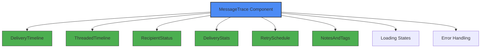
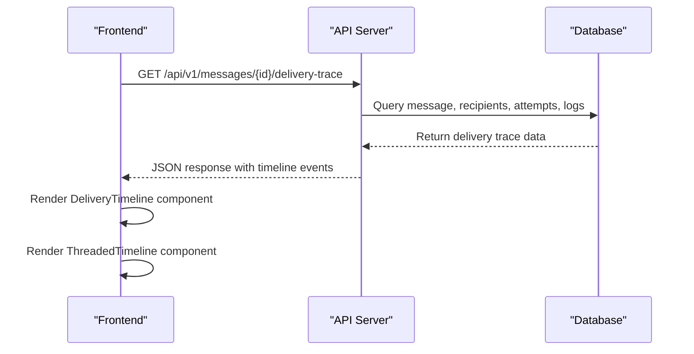
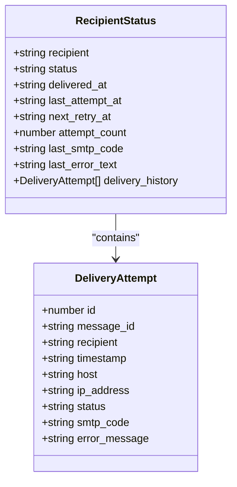
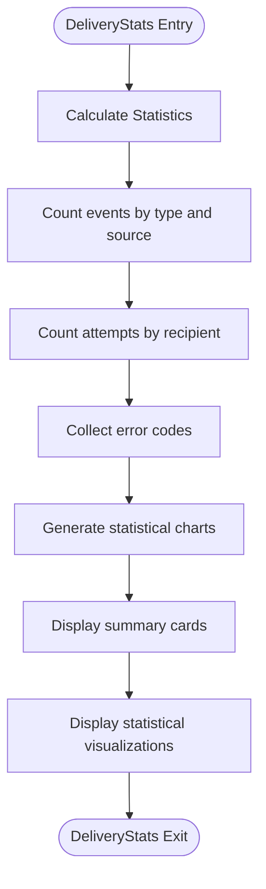
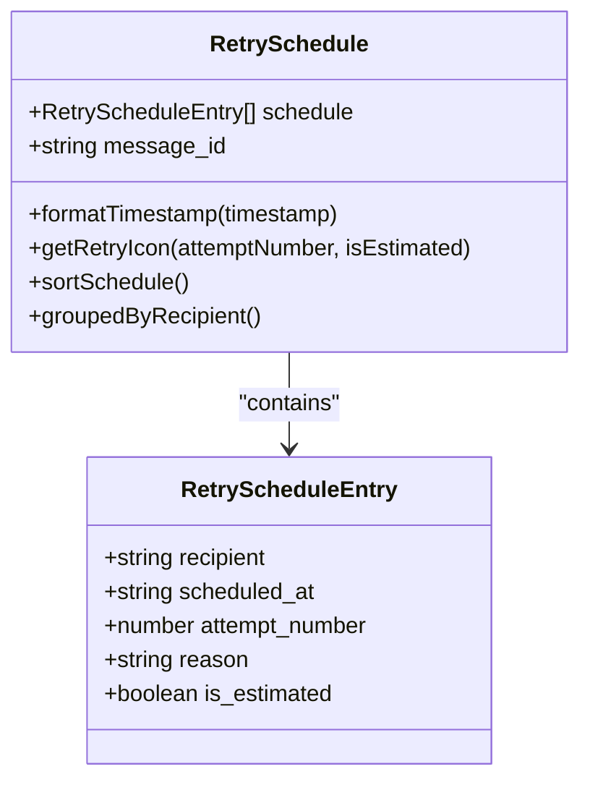
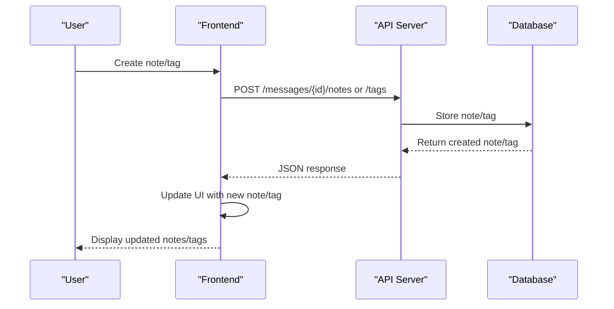

# Message Tracing Components

## Table of Contents
1. [Introduction](#introduction)
2. [Core Components Overview](#core-components-overview)
3. [MessageTrace Component Architecture](#messagetrace-component-architecture)
4. [Delivery Timeline Visualization](#delivery-timeline-visualization)
5. [Recipient Status Management](#recipient-status-management)
6. [Delivery Statistics and Analytics](#delivery-statistics-and-analytics)
7. [Retry Schedule Display](#retry-schedule-display)
8. [Administrative Notes and Tags](#administrative-notes-and-tags)
9. [Data Fetching and Backend Integration](#data-fetching-and-backend-integration)
10. [State Management and Loading States](#state-management-and-loading-states)

## Introduction
The Message Tracing system provides comprehensive visibility into the delivery journey of email messages through the Exim mail server. This documentation details the frontend components that visualize message delivery data, including chronological timelines, recipient-specific status information, statistical summaries, retry schedules, and administrative annotations. The system integrates with backend APIs to retrieve and display detailed delivery histories, enabling administrators to diagnose delivery issues and monitor message flow.

## Core Components Overview
The message tracing functionality is implemented through a suite of React components that work together to provide a comprehensive view of message delivery. These components are organized within the MessageTrace directory and include:

- **MessageTrace.tsx**: The main container component that orchestrates the display of all tracing information
- **DeliveryTimeline.tsx**: Displays chronological delivery events in a linear timeline format
- **ThreadedTimeline.tsx**: Presents delivery events grouped by conversation threads
- **RecipientStatus.tsx**: Shows per-recipient delivery outcomes with detailed history
- **DeliveryStats.tsx**: Provides summary metrics and statistical visualizations
- **RetrySchedule.tsx**: Displays upcoming delivery attempts for deferred messages
- **NotesAndTags.tsx**: Enables administrative annotations and tagging of messages

These components work together to provide both high-level overviews and detailed inspection capabilities for message delivery analysis.

**Section sources**
- [MessageTrace.tsx](file://web/src/components/MessageTrace/MessageTrace.tsx)
- [DeliveryTimeline.tsx](file://web/src/components/MessageTrace/DeliveryTimeline.tsx)
- [ThreadedTimeline.tsx](file://web/src/components/MessageTrace/ThreadedTimeline.tsx)
- [RecipientStatus.tsx](file://web/src/components/MessageTrace/RecipientStatus.tsx)
- [DeliveryStats.tsx](file://web/src/components/MessageTrace/DeliveryStats.tsx)
- [RetrySchedule.tsx](file://web/src/components/MessageTrace/RetrySchedule.tsx)
- [NotesAndTags.tsx](file://web/src/components/MessageTrace/NotesAndTags.tsx)

## MessageTrace Component Architecture
The MessageTrace component serves as the primary interface for viewing message delivery information. It acts as a container that coordinates the display of multiple visualization components, each providing a different perspective on the message's delivery journey.

**Diagram sources**
- [MessageTrace.tsx](file://web/src/components/MessageTrace/MessageTrace.tsx)

**Section sources**
- [MessageTrace.tsx](file://web/src/components/MessageTrace/MessageTrace.tsx)

## Delivery Timeline Visualization
The delivery timeline components provide chronological views of message delivery events, allowing users to track the sequence of delivery attempts and system events.

### DeliveryTimeline Component
The DeliveryTimeline component displays delivery events in a linear, chronological format. Each event is represented as a timeline entry with visual indicators for the event type, timestamp, and relevant details such as host information, SMTP codes, and error messages.

### ThreadedTimeline Component
The ThreadedTimeline component organizes delivery events by conversation threads, grouping related events together to provide context for the delivery process. This view is particularly useful for understanding the sequence of attempts for specific recipients or hosts.

**Diagram sources**
- [message_trace_handlers.go](file://internal/api/message_trace_handlers.go)
- [repository.go](file://internal/database/repository.go)

**Section sources**
- [DeliveryTimeline.tsx](file://web/src/components/MessageTrace/DeliveryTimeline.tsx)
- [ThreadedTimeline.tsx](file://web/src/components/MessageTrace/ThreadedTimeline.tsx)

## Recipient Status Management
The RecipientStatus component provides detailed information about the delivery status for each recipient of a message, including delivery history and attempt details.

### Implementation Details
The component displays a list of recipients with their current status (delivered, deferred, bounced, or pending). Each recipient entry can be expanded to reveal the complete delivery history, showing all attempts with timestamps, host information, SMTP codes, and error messages.

**Diagram sources**
- [RecipientStatus.tsx](file://web/src/components/MessageTrace/RecipientStatus.tsx)

**Section sources**
- [RecipientStatus.tsx](file://web/src/components/MessageTrace/RecipientStatus.tsx)

## Delivery Statistics and Analytics
The DeliveryStats component provides summary metrics and statistical visualizations for message delivery performance.

### Key Metrics
The component displays several key metrics through summary cards and charts:

- **Total Events**: The total number of delivery events in the timeline
- **Success Rate**: Percentage of recipients successfully delivered
- **Average Attempts**: Mean number of delivery attempts per recipient
- **Average Delivery Time**: Average time from message arrival to successful delivery

### Statistical Visualizations
The component includes several charts that visualize delivery data:

- **Delivery Status Distribution**: Pie chart showing the distribution of recipient statuses
- **Event Types Distribution**: Bar chart showing the frequency of different event types
- **Delivery Attempts per Recipient**: Bar chart showing the number of attempts for each recipient

**Diagram sources**
- [DeliveryStats.tsx](file://web/src/components/MessageTrace/DeliveryStats.tsx)

**Section sources**
- [DeliveryStats.tsx](file://web/src/components/MessageTrace/DeliveryStats.tsx)

## Retry Schedule Display
The RetrySchedule component displays upcoming delivery attempts for messages that have been deferred.

### Implementation Details
The component shows both a timeline view and a recipient-grouped view of scheduled retries. Each retry entry includes:

- Attempt number
- Scheduled time with relative timing (e.g., "in 2 hours")
- Reason for retry
- Status indicators for estimated vs. confirmed retries

The component uses visual indicators to highlight overdue retries (in red) and imminent retries (in yellow).

**Diagram sources**
- [RetrySchedule.tsx](file://web/src/components/MessageTrace/RetrySchedule.tsx)

**Section sources**
- [RetrySchedule.tsx](file://web/src/components/MessageTrace/RetrySchedule.tsx)

## Administrative Notes and Tags
The NotesAndTags component enables administrative annotations and tagging of messages for organizational and diagnostic purposes.

### Features
The component provides two main features:

1. **Notes**: Text annotations that can be public or private, with creation and modification timestamps
2. **Tags**: Categorical labels with customizable colors for quick message classification

### Implementation Details
The component includes form interfaces for creating and editing notes and tags, as well as displays for existing entries. It also shows popular tags from other messages to encourage consistent tagging.

**Diagram sources**
- [NotesAndTags.tsx](file://web/src/components/MessageTrace/NotesAndTags.tsx)
- [message_trace_handlers.go](file://internal/api/message_trace_handlers.go)

**Section sources**
- [NotesAndTags.tsx](file://web/src/components/MessageTrace/NotesAndTags.tsx)

## Data Fetching and Backend Integration
The message tracing components integrate with backend APIs to retrieve delivery data, with a well-defined data flow from database to frontend.

### API Endpoints
The frontend components consume several API endpoints:

- **GET /api/v1/messages/{id}/delivery-trace**: Retrieves comprehensive delivery trace data
- **GET /api/v1/messages/{id}/threaded-timeline**: Retrieves threaded timeline view
- **GET /api/v1/messages/{id}/notes**: Retrieves message notes
- **GET /api/v1/messages/{id}/tags**: Retrieves message tags

### Backend Implementation
The backend implementation in message_trace_handlers.go orchestrates the retrieval of data from multiple sources:

```mermaid
flowchart TD
API[API Handler] --> MessageRepo["MessageRepository.GetByID()"]
API --> RecipientRepo["RecipientRepository.GetByMessageID()"]
API --> AttemptRepo["DeliveryAttemptRepository.GetByMessageID()"]
API --> LogRepo["LogEntryRepository.GetByMessageID()"]
API --> AuditRepo["AuditLogRepository.GetByMessageID()"]
MessageRepo --> MessageData[(Message Data)]
RecipientRepo --> RecipientData[(Recipient Data)]
AttemptRepo --> AttemptData[(Delivery Attempts)]
LogRepo --> LogData[(Log Entries)]
AuditRepo --> AuditData[(Audit Entries)]
API --> BuildStatus["buildRecipientDeliveryStatuses()"]
API --> BuildTimeline["buildDeliveryTimeline()"]
API --> BuildSchedule["buildRetrySchedule()"]
API --> CalculateSummary["calculateDeliveryTraceSummary()"]
BuildStatus --> StatusResult[(Recipient Statuses)]
BuildTimeline --> TimelineResult[(Delivery Timeline)]
BuildSchedule --> ScheduleResult[(Retry Schedule)]
CalculateSummary --> SummaryResult[(Delivery Summary)]
API --> Combine["Combine results into trace object"]
Combine --> Response["Return JSON response"]
```

**Diagram sources**
- [message_trace_handlers.go](file://internal/api/message_trace_handlers.go)
- [repository.go](file://internal/database/repository.go)

**Section sources**
- [message_trace_handlers.go](file://internal/api/message_trace_handlers.go)
- [repository.go](file://internal/database/repository.go)

## State Management and Loading States
The message tracing components implement comprehensive state management to handle data loading, errors, and user interactions.

### Loading States
Components display appropriate loading indicators when fetching data:

- **Skeleton loaders** for content areas
- **Spinner animations** for initial data retrieval
- **Empty states** when no data is available

### Error Handling
The components include robust error handling for various scenarios:

- **Network errors**: Displayed with dismissible banners
- **Empty results**: Shown with descriptive messages and appropriate icons
- **Form validation**: Real-time feedback for user inputs

The NotesAndTags component, for example, implements a loading state with a spinner animation and error states with dismissible banners, ensuring a smooth user experience during data operations.

**Section sources**
- [NotesAndTags.tsx](file://web/src/components/MessageTrace/NotesAndTags.tsx)
- [DeliveryStats.tsx](file://web/src/components/MessageTrace/DeliveryStats.tsx)
- [RetrySchedule.tsx](file://web/src/components/MessageTrace/RetrySchedule.tsx)

**Referenced Files in This Document**   
- [MessageTrace.tsx](file://web/src/components/MessageTrace/MessageTrace.tsx)
- [DeliveryTimeline.tsx](file://web/src/components/MessageTrace/DeliveryTimeline.tsx)
- [ThreadedTimeline.tsx](file://web/src/components/MessageTrace/ThreadedTimeline.tsx)
- [RecipientStatus.tsx](file://web/src/components/MessageTrace/RecipientStatus.tsx)
- [DeliveryStats.tsx](file://web/src/components/MessageTrace/DeliveryStats.tsx)
- [RetrySchedule.tsx](file://web/src/components/MessageTrace/RetrySchedule.tsx)
- [NotesAndTags.tsx](file://web/src/components/MessageTrace/NotesAndTags.tsx)
- [message_trace_handlers.go](file://internal/api/message_trace_handlers.go)
- [repository.go](file://internal/database/repository.go)