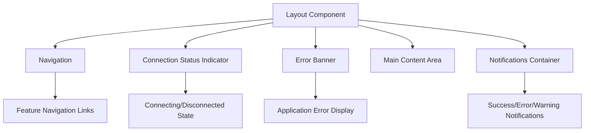
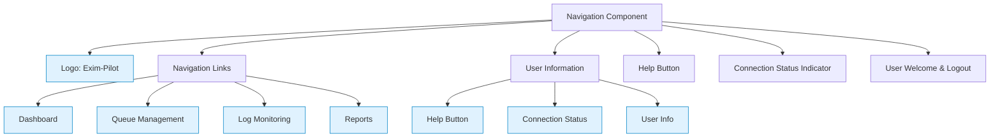
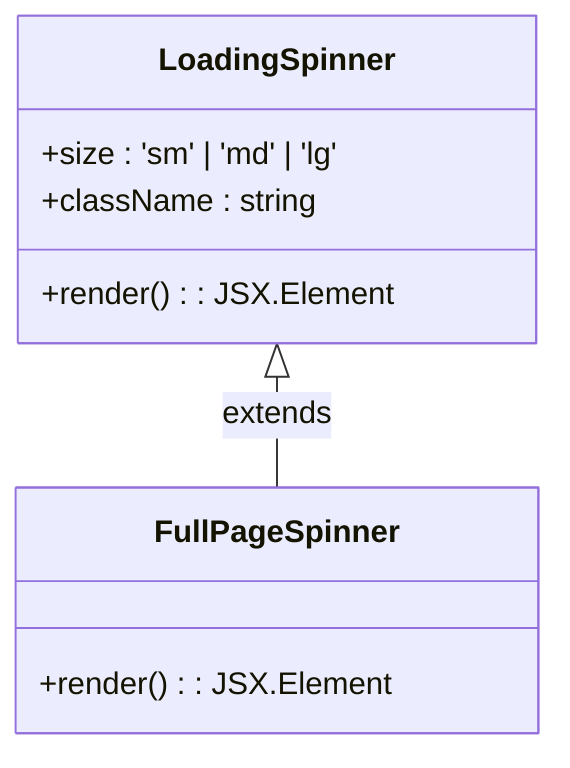
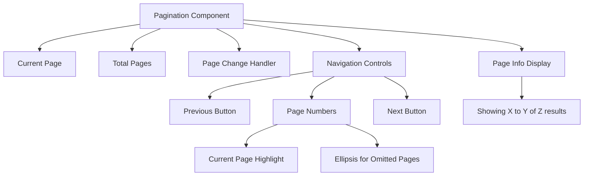
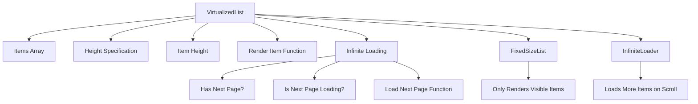
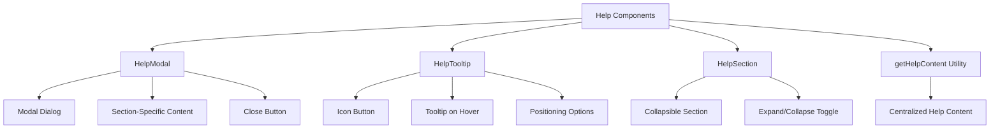
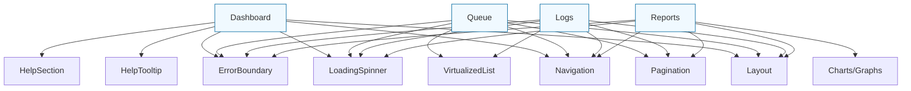

# Shared UI Components


## Table of Contents
1. [Introduction](#introduction)
2. [Layout Component](#layout-component)
3. [Navigation Component](#navigation-component)
4. [LoadingSpinner Component](#loadingspinner-component)
5. [Pagination Component](#pagination-component)
6. [VirtualizedList Component](#virtualizedlist-component)
7. [ErrorBoundary Component](#errorboundary-component)
8. [HelpModal and HelpTooltip Components](#helpmodal-and-helptooltip-components)
9. [Component Reuse Across Features](#component-reuse-across-features)
10. [Theming and Accessibility](#theming-and-accessibility)

## Introduction
The Common module in the Exim-Pilot application provides a collection of reusable UI components that ensure consistency, maintainability, and efficiency across the entire application. These components are designed to handle common UI patterns and functionality, from page structure and navigation to loading states and error handling. This document details the implementation and usage of these shared components, demonstrating how they contribute to a cohesive user experience while promoting code reuse and accessibility.

## Layout Component

The Layout component provides a consistent structural foundation for all pages in the application. It establishes the overall page structure, including navigation, status indicators, main content area, and notifications.





**Diagram sources**
- [Layout.tsx](file://web/src/components/Common/Layout.tsx#L1-L58)

**Section sources**
- [Layout.tsx](file://web/src/components/Common/Layout.tsx#L1-L58)

The Layout component wraps all page content and provides several key features:
- **Navigation**: Includes the Navigation component for feature switching
- **Connection Status**: Displays real-time connection status to the server (connected, connecting, disconnected)
- **Error Handling**: Shows application-level errors from the global state
- **Notifications**: Renders user notifications in a fixed position overlay
- **Responsive Design**: Uses Tailwind CSS for responsive layout with proper spacing and container constraints

The component consumes the AppContext to access global state such as connection status, errors, and notifications, making these available throughout the application without prop drilling.

## Navigation Component

The Navigation component enables seamless feature switching across the application with a responsive design that works on both desktop and mobile devices.





**Diagram sources**
- [Navigation.tsx](file://web/src/components/Common/Navigation.tsx#L1-L133)

**Section sources**
- [Navigation.tsx](file://web/src/components/Common/Navigation.tsx#L1-L133)

Key features of the Navigation component include:
- **Feature Navigation**: Provides links to core application features (Dashboard, Queue, Logs, Reports)
- **Responsive Design**: Shows horizontal navigation on desktop and vertical menu on mobile
- **Active State Highlighting**: Visually indicates the current page with blue background
- **User Management**: Displays current user and provides logout functionality
- **Contextual Help**: Includes a help button that adapts to the current section
- **Connection Status**: Shows real-time connection status with color-coded indicator

The component uses React Router for navigation and consumes both AppContext and AuthContext to access application state and user authentication information.

## LoadingSpinner Component

The LoadingSpinner component provides visual feedback during asynchronous operations, with support for different sizes and a full-page variant.





**Diagram sources**
- [LoadingSpinner.tsx](file://web/src/components/Common/LoadingSpinner.tsx#L1-L33)

**Section sources**
- [LoadingSpinner.tsx](file://web/src/components/Common/LoadingSpinner.tsx#L1-L33)

The LoadingSpinner implementation includes:
- **Configurable Sizes**: Supports small (4x4), medium (8x8), and large (12x12) spinner sizes
- **Custom Styling**: Accepts className prop for additional styling
- **Animated Design**: Uses CSS animation for smooth spinning effect with blue accent color
- **Full-Page Variant**: FullPageSpinner provides a complete screen overlay with loading message

The spinner uses a border-based design with a contrasting border-top color to create the spinning effect, leveraging CSS's animate-spin utility from Tailwind CSS.

## Pagination Component

The Pagination component enables efficient navigation through large datasets with a user-friendly interface that includes page indicators and navigation controls.





**Diagram sources**
- [Pagination.tsx](file://web/src/components/Common/Pagination.tsx#L1-L151)

**Section sources**
- [Pagination.tsx](file://web/src/components/Common/Pagination.tsx#L1-L151)

Key features of the Pagination component:
- **Smart Page Display**: Shows current page with neighbors and uses ellipsis for omitted pages
- **Navigation Controls**: Previous and next buttons with appropriate disabled states
- **Page Information**: Displays current range and total items when enabled
- **Accessibility**: Includes screen reader text for navigation buttons
- **Responsive Design**: Adapts layout for different screen sizes

The component calculates which page numbers to display based on the current page and total pages, ensuring a clean interface even with large numbers of pages.

## VirtualizedList Component

The VirtualizedList component efficiently renders large lists of items by only rendering visible elements, significantly improving performance for datasets like message queues and logs.





**Diagram sources**
- [VirtualizedList.tsx](file://web/src/components/Common/VirtualizedList.tsx#L1-L199)

**Section sources**
- [VirtualizedList.tsx](file://web/src/components/Common/VirtualizedList.tsx#L1-L199)

The VirtualizedList implementation leverages react-window and react-window-infinite-loader to:
- **Optimize Performance**: Only renders items currently visible in the viewport
- **Support Infinite Scrolling**: Integrates with InfiniteLoader for seamless pagination
- **Handle Loading States**: Displays loading indicators for unloaded items
- **Provide Flexibility**: Accepts custom render functions for different item types
- **Optimize Re-renders**: Uses useMemo and useCallback to prevent unnecessary re-renders

The component also includes a specialized VirtualizedQueueList variant that formats queue-specific data like message size and status.

## ErrorBoundary Component

The ErrorBoundary component provides graceful error handling by catching JavaScript errors in child components and displaying a user-friendly fallback interface.


```mermaid
flowchart TD
A[ErrorBoundary] --> B[Try Render Children]
B --> C{Error Thrown?}
C --> |No| D[Display Children]
C --> |Yes| E[Display Fallback UI]
E --> F[Error Message]
E --> G[Refresh Button]
E --> H[Error Details (Optional)]
A --> I[getDerivedStateFromError]
A --> J[componentDidCatch]
I --> K[Update State with Error]
J --> L[Log Error to Console]
```


**Diagram sources**
- [ErrorBoundary.tsx](file://web/src/components/Common/ErrorBoundary.tsx#L1-L83)

**Section sources**
- [ErrorBoundary.tsx](file://web/src/components/Common/ErrorBoundary.tsx#L1-L83)

Key features of the ErrorBoundary:
- **Error Catching**: Uses React's error boundary lifecycle methods to catch errors
- **Fallback UI**: Displays a clean error screen with refresh option
- **Error Details**: Optionally shows error message in a collapsible section
- **Custom Fallback**: Accepts a custom fallback component via props
- **Error Logging**: Logs caught errors to the console for debugging

The component follows React's error boundary pattern, using static getDerivedStateFromError to update state when an error occurs and componentDidCatch for side effects like error logging.

## HelpModal and HelpTooltip Components

The HelpModal and HelpTooltip components provide contextual user assistance throughout the application, with content driven by the help system.





**Diagram sources**
- [HelpModal.tsx](file://web/src/components/Common/HelpModal.tsx#L1-L199)
- [HelpTooltip.tsx](file://web/src/components/Common/HelpTooltip.tsx#L1-L160)

**Section sources**
- [HelpModal.tsx](file://web/src/components/Common/HelpModal.tsx#L1-L199)
- [HelpTooltip.tsx](file://web/src/components/Common/HelpTooltip.tsx#L1-L160)

The help system includes:
- **HelpModal**: Full modal dialog with structured help content specific to the current section
- **HelpTooltip**: Small tooltip that appears on hover/focus with brief contextual help
- **HelpSection**: Collapsible section component for organizing help content
- **Dynamic Content**: Uses getHelpContent to retrieve section-specific help text
- **Multiple Positions**: Tooltips can be positioned top, bottom, left, or right

The HelpModal adapts its content based on the current application section (dashboard, queue, logs, reports), providing relevant guidance for each feature.

## Component Reuse Across Features

Shared UI components are extensively reused across the application's main features, ensuring consistency and reducing code duplication.





**Diagram sources**
- [Dashboard.tsx](file://web/src/components/Dashboard/Dashboard.tsx#L1-L199)
- [Queue.tsx](file://web/src/components/Queue/Queue.tsx#L1-L200)
- [Logs.tsx](file://web/src/components/Logs/Logs.tsx#L1-L200)
- [Reports.tsx](file://web/src/components/Reports/Reports.tsx#L1-L200)

**Section sources**
- [Dashboard.tsx](file://web/src/components/Dashboard/Dashboard.tsx#L1-L199)
- [Queue.tsx](file://web/src/components/Queue/Queue.tsx#L1-L200)
- [Logs.tsx](file://web/src/components/Logs/Logs.tsx#L1-L200)
- [Reports.tsx](file://web/src/components/Reports/Reports.tsx#L1-L200)

Examples of component reuse:
- **Dashboard**: Uses Layout, Navigation, LoadingSpinner, ErrorBoundary, HelpTooltip, and HelpSection components
- **Queue**: Implements Layout, Navigation, VirtualizedList for message display, Pagination, LoadingSpinner, and ErrorBoundary
- **Logs**: Leverages Layout, Navigation, VirtualizedList for log entries, Pagination, and ErrorBoundary
- **Reports**: Incorporates Layout, Navigation, Pagination, LoadingSpinner, and ErrorBoundary

Each feature consistently uses the shared components, creating a unified user experience while allowing for feature-specific customization through props and composition.

## Theming and Accessibility

The shared UI components implement consistent theming through Tailwind CSS and follow accessibility best practices to ensure usability for all users.

**Theming Implementation:**
- **Tailwind CSS**: All components use Tailwind's utility classes for styling
- **Consistent Color Palette**: Blue for primary actions, gray for neutral elements, and semantic colors (green for success, red for error, yellow for warning)
- **Responsive Design**: Components adapt to different screen sizes using Tailwind's responsive prefixes
- **Consistent Spacing**: Standardized padding and margin using Tailwind's spacing scale

**Accessibility Features:**
- **Keyboard Navigation**: All interactive elements are keyboard accessible
- **Screen Reader Support**: ARIA labels, roles, and attributes are used appropriately
- **Focus Management**: Visible focus states for interactive elements
- **Color Contrast**: Sufficient contrast ratios for text and interactive elements
- **Semantic HTML**: Proper use of HTML elements for their intended purpose
- **Error Identification**: Clear error messages and instructions for correction

The components follow a consistent design system that ensures visual harmony across the application while maintaining high usability standards for all users, including those with disabilities.

**Referenced Files in This Document**   
- [Layout.tsx](file://web/src/components/Common/Layout.tsx)
- [Navigation.tsx](file://web/src/components/Common/Navigation.tsx)
- [LoadingSpinner.tsx](file://web/src/components/Common/LoadingSpinner.tsx)
- [Pagination.tsx](file://web/src/components/Common/Pagination.tsx)
- [VirtualizedList.tsx](file://web/src/components/Common/VirtualizedList.tsx)
- [ErrorBoundary.tsx](file://web/src/components/Common/ErrorBoundary.tsx)
- [HelpModal.tsx](file://web/src/components/Common/HelpModal.tsx)
- [HelpTooltip.tsx](file://web/src/components/Common/HelpTooltip.tsx)
- [Dashboard.tsx](file://web/src/components/Dashboard/Dashboard.tsx)
- [Queue.tsx](file://web/src/components/Queue/Queue.tsx)
- [Logs.tsx](file://web/src/components/Logs/Logs.tsx)
- [Reports.tsx](file://web/src/components/Reports/Reports.tsx)