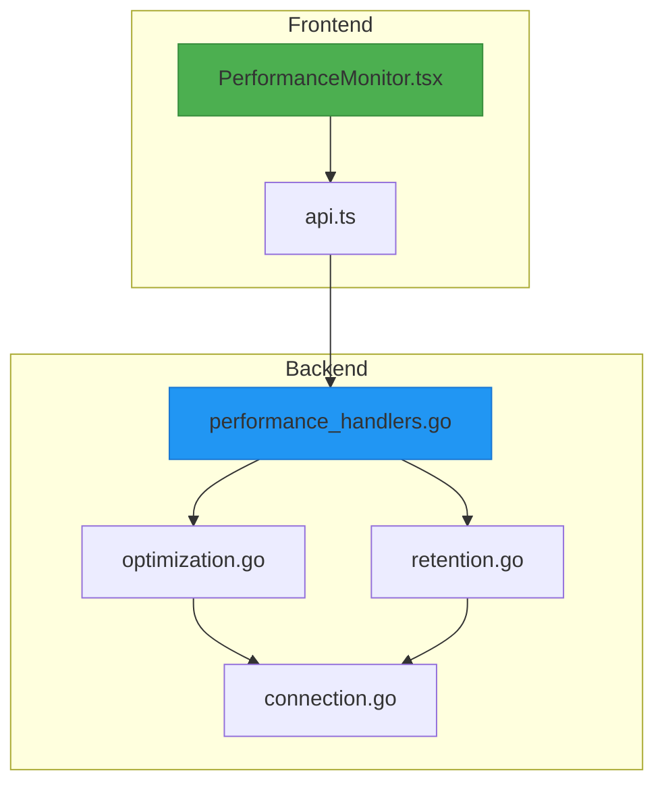
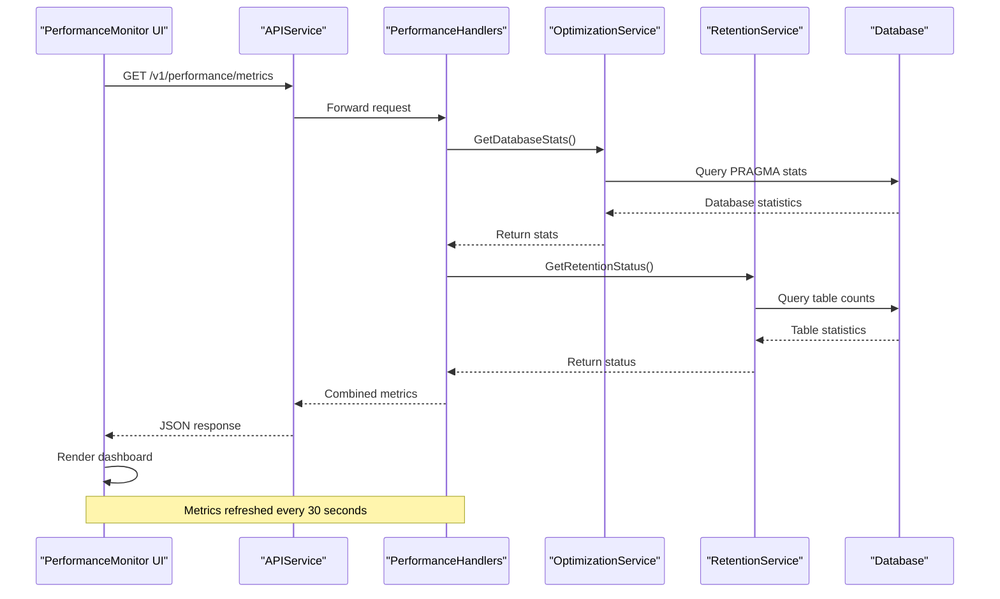
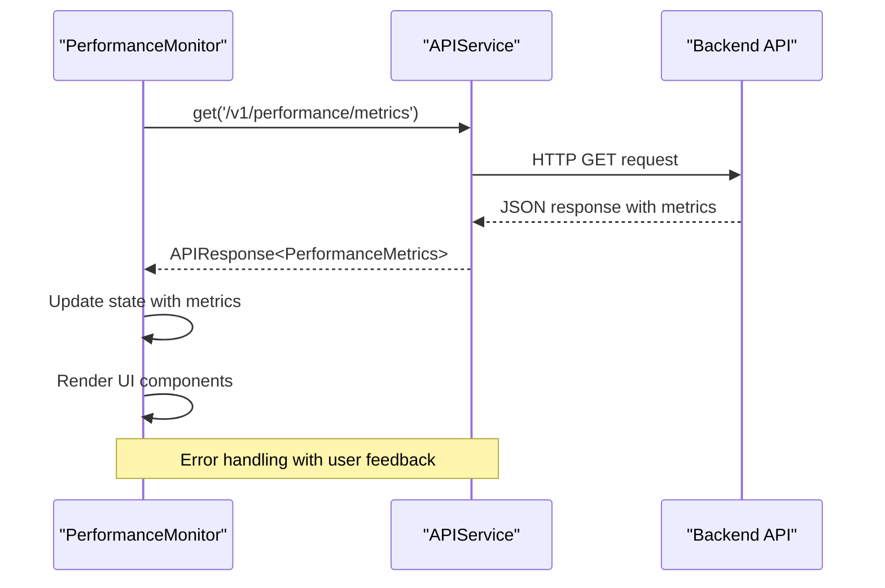
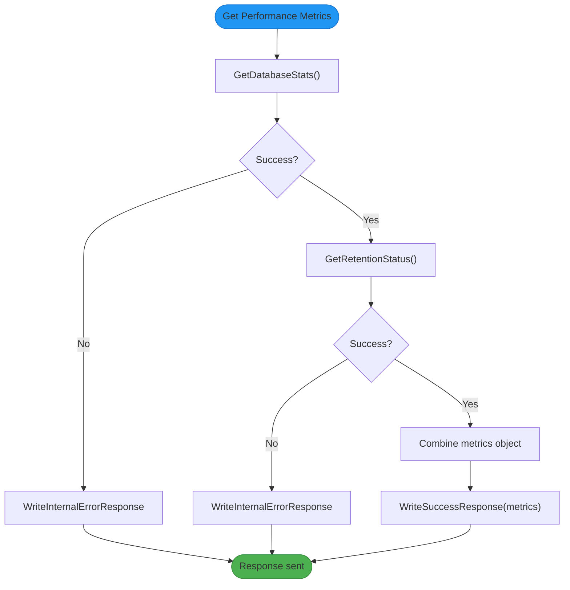
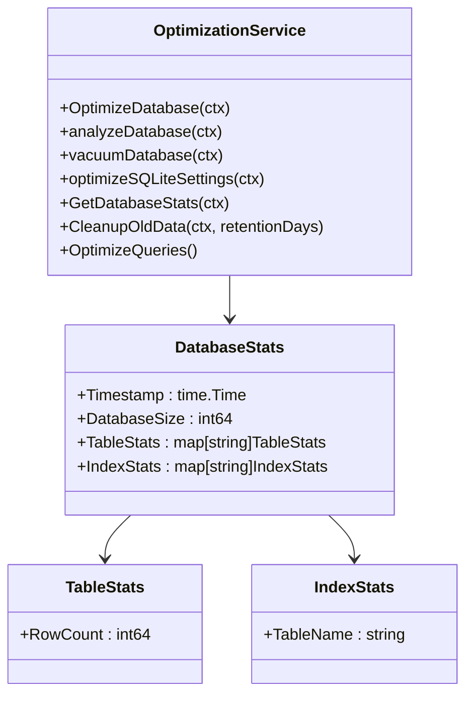
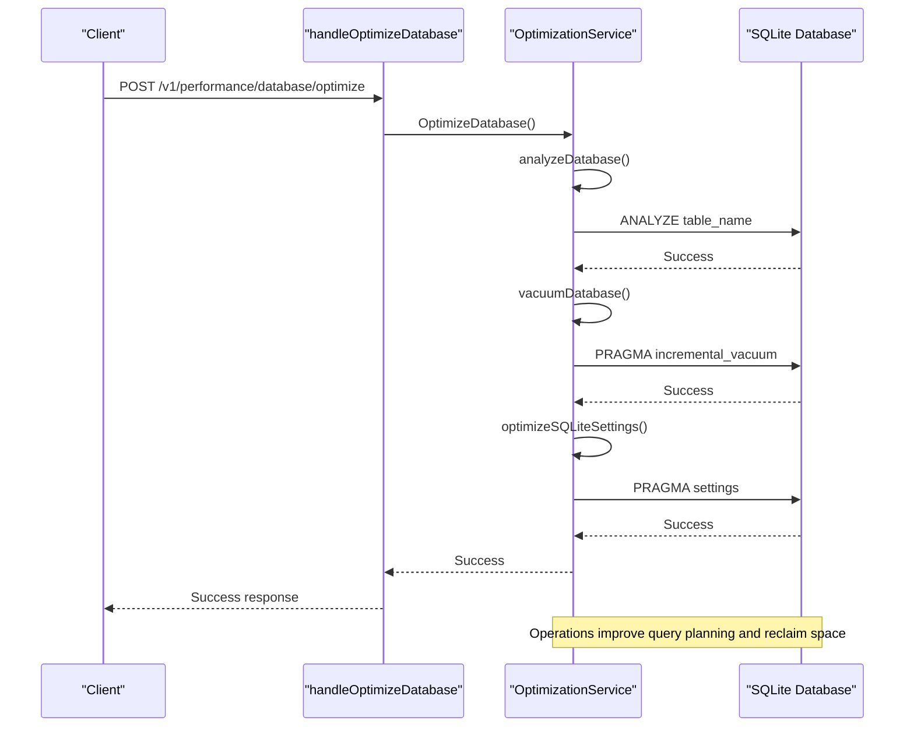
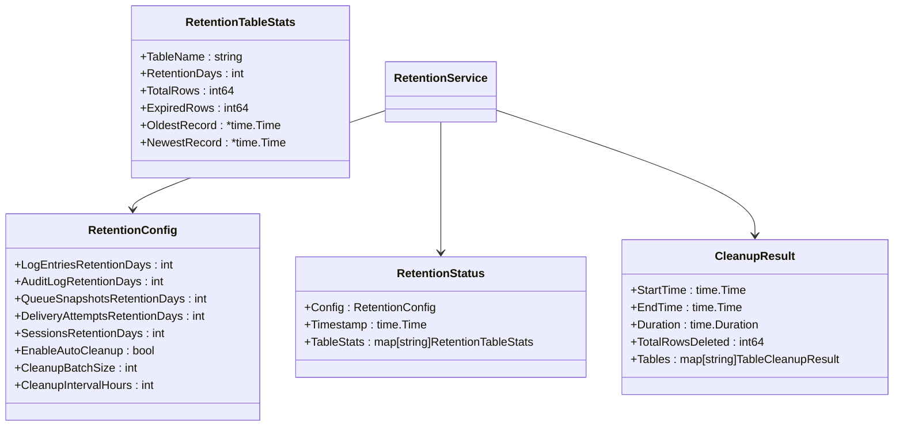
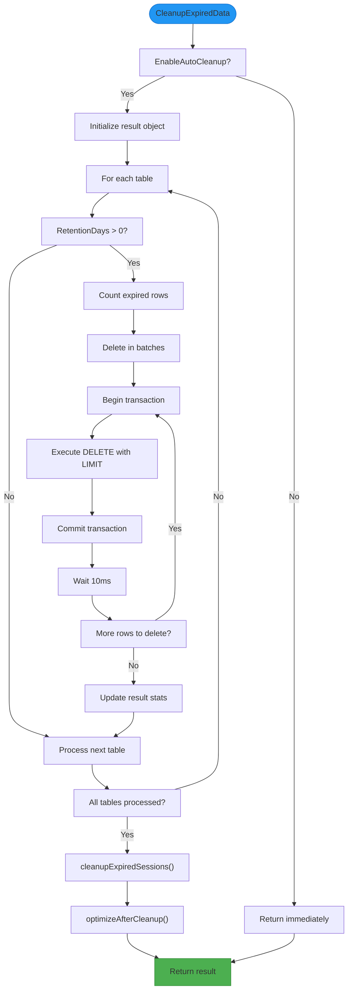
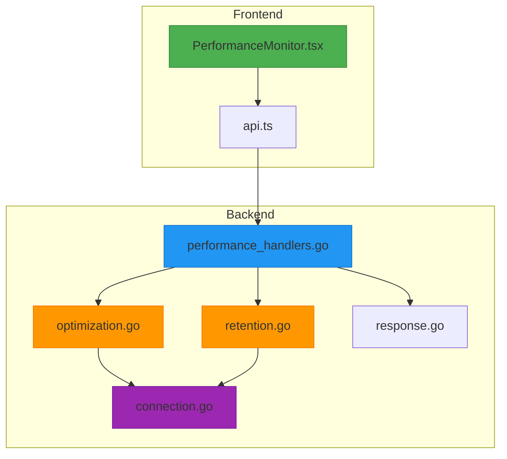

# Performance Monitoring Component


## Table of Contents
1. [Introduction](#introduction)
2. [Project Structure](#project-structure)
3. [Core Components](#core-components)
4. [Architecture Overview](#architecture-overview)
5. [Detailed Component Analysis](#detailed-component-analysis)
6. [Dependency Analysis](#dependency-analysis)
7. [Performance Considerations](#performance-considerations)
8. [Troubleshooting Guide](#troubleshooting-guide)
9. [Conclusion](#conclusion)

## Introduction
The PerformanceMonitor component is a critical administrative interface for monitoring and optimizing system performance in the Exim-Pilot email processing system. This component provides real-time visualization of database performance metrics, data retention status, and optimization tools that enable administrators to identify bottlenecks and maintain optimal system configuration. The component integrates with backend API endpoints to collect performance data and execute optimization operations, presenting this information through an intuitive dashboard interface.

## Project Structure
The PerformanceMonitor component is organized within the project's frontend and backend architecture, with clear separation between UI presentation, API communication, and backend processing logic. The component is located in the web frontend under the Performance module, while its corresponding backend handlers are implemented in the internal API package.





**Diagram sources**
- [PerformanceMonitor.tsx](file://web/src/components/Performance/PerformanceMonitor.tsx)
- [performance_handlers.go](file://internal/api/performance_handlers.go)
- [optimization.go](file://internal/database/optimization.go)
- [retention.go](file://internal/database/retention.go)
- [connection.go](file://internal/database/connection.go)

**Section sources**
- [PerformanceMonitor.tsx](file://web/src/components/Performance/PerformanceMonitor.tsx)
- [performance_handlers.go](file://internal/api/performance_handlers.go)

## Core Components
The PerformanceMonitor component consists of several core elements that work together to provide comprehensive performance monitoring capabilities. The frontend component handles UI rendering and user interactions, while backend services collect metrics and perform optimization operations. The component displays database statistics including size, table counts, and row counts, as well as data retention status showing expired records and cleanup opportunities.

**Section sources**
- [PerformanceMonitor.tsx](file://web/src/components/Performance/PerformanceMonitor.tsx)
- [optimization.go](file://internal/database/optimization.go)
- [retention.go](file://internal/database/retention.go)

## Architecture Overview
The PerformanceMonitor follows a client-server architecture with a React-based frontend communicating with Go-based backend services through RESTful API endpoints. The component implements a periodic polling mechanism to refresh performance metrics, while also providing interactive controls for database optimization and data cleanup operations.





**Diagram sources**
- [PerformanceMonitor.tsx](file://web/src/components/Performance/PerformanceMonitor.tsx#L43-L85)
- [performance_handlers.go](file://internal/api/performance_handlers.go#L74-L94)
- [optimization.go](file://internal/database/optimization.go#L185-L228)
- [retention.go](file://internal/database/retention.go#L258-L313)

## Detailed Component Analysis

### PerformanceMonitor Component Analysis
The PerformanceMonitor component is a React functional component that manages state for performance metrics, loading status, and error conditions. It uses the useEffect hook to initiate data fetching on component mount and establish a polling interval for regular updates.

#### Component Structure and State Management

```mermaid
classDiagram
class PerformanceMonitor {
+metrics : PerformanceMetrics | null
+loading : boolean
+error : string | null
+optimizing : boolean
+cleaning : boolean
+fetchMetrics() : Promise~void~
+optimizeDatabase() : Promise~void~
+cleanupExpiredData() : Promise~void~
+formatBytes(bytes : number) : string
+formatNumber(num : number) : string
}
class PerformanceMetrics {
+database : DatabaseStats
+retention : RetentionStatus
+system : { timestamp : string }
}
class DatabaseStats {
+timestamp : string
+database_size : number
+table_stats : Record<string, { row_count : number }>
+index_stats : Record<string, { table_name : string }>
}
class RetentionStatus {
+config : RetentionConfig
+table_stats : Record<string, RetentionTableStats>
}
PerformanceMonitor --> PerformanceMetrics
PerformanceMetrics --> DatabaseStats
PerformanceMetrics --> RetentionStatus
```


**Diagram sources**
- [PerformanceMonitor.tsx](file://web/src/components/Performance/PerformanceMonitor.tsx#L11-L41)

**Section sources**
- [PerformanceMonitor.tsx](file://web/src/components/Performance/PerformanceMonitor.tsx#L1-L356)

#### Data Collection and API Integration
The component integrates with the backend API through the APIService class, which provides a standardized interface for HTTP requests. The fetchMetrics function retrieves performance data from the /v1/performance/metrics endpoint, handling success and error responses appropriately.





**Diagram sources**
- [PerformanceMonitor.tsx](file://web/src/components/Performance/PerformanceMonitor.tsx#L43-L65)
- [api.ts](file://web/src/services/api.ts#L20-L45)

### Backend Performance Handlers Analysis
The backend implementation of performance monitoring is handled by the PerformanceHandlers struct, which exposes multiple endpoints for retrieving metrics and performing optimization operations.

#### API Endpoint Structure

```mermaid
graph TD
A[Performance API Endpoints] --> B[/v1/performance/metrics]
A --> C[/v1/performance/database/stats]
A --> D[/v1/performance/database/optimize]
A --> E[/v1/performance/retention/status]
A --> F[/v1/performance/retention/cleanup]
A --> G[/v1/performance/config]
B --> H[Combined metrics]
C --> I[Database statistics]
D --> J[Database optimization]
E --> K[Retention status]
F --> L[Data cleanup]
G --> M[Configuration]
style B fill:#4CAF50,stroke:#388E3C
style D fill:#FF9800,stroke:#F57C00
style F fill:#FF9800,stroke:#F57C00
```


**Diagram sources**
- [performance_handlers.go](file://internal/api/performance_handlers.go#L74-L273)

**Section sources**
- [performance_handlers.go](file://internal/api/performance_handlers.go#L1-L273)

#### Performance Metrics Collection Flow
The handlePerformanceMetrics handler combines data from multiple services to provide a comprehensive performance overview. It first retrieves database statistics, then fetches retention status, and finally combines these into a single response object.





**Diagram sources**
- [performance_handlers.go](file://internal/api/performance_handlers.go#L74-L94)
- [optimization.go](file://internal/database/optimization.go#L185-L228)
- [retention.go](file://internal/database/retention.go#L258-L313)

### Database Optimization Service Analysis
The OptimizationService handles database performance improvements through various SQLite optimization techniques.

#### Database Optimization Operations




**Diagram sources**
- [optimization.go](file://internal/database/optimization.go#L15-L278)

**Section sources**
- [optimization.go](file://internal/database/optimization.go#L1-L278)

#### Database Optimization Sequence
The OptimizeDatabase method performs a series of operations to improve database performance, including analyzing tables, vacuuming the database, and optimizing SQLite settings.





**Diagram sources**
- [performance_handlers.go](file://internal/api/performance_handlers.go#L34-L44)
- [optimization.go](file://internal/database/optimization.go#L35-L85)

### Data Retention Service Analysis
The RetentionService manages data retention policies and cleanup operations to ensure data is properly maintained according to configured retention periods.

#### Retention Configuration Structure




**Diagram sources**
- [retention.go](file://internal/database/retention.go#L15-L45)

**Section sources**
- [retention.go](file://internal/database/retention.go#L1-L359)

#### Data Cleanup Process Flow
The cleanup process removes expired data in batches to avoid long-running transactions and database locks, while providing detailed results of the cleanup operation.





**Diagram sources**
- [retention.go](file://internal/database/retention.go#L85-L257)

## Dependency Analysis
The PerformanceMonitor component has a well-defined dependency chain that connects the frontend UI to the database layer through multiple service layers.





**Diagram sources**
- [PerformanceMonitor.tsx](file://web/src/components/Performance/PerformanceMonitor.tsx)
- [api.ts](file://web/src/services/api.ts)
- [performance_handlers.go](file://internal/api/performance_handlers.go)
- [optimization.go](file://internal/database/optimization.go)
- [retention.go](file://internal/database/retention.go)
- [connection.go](file://internal/database/connection.go)
- [response.go](file://internal/api/response.go)

**Section sources**
- [PerformanceMonitor.tsx](file://web/src/components/Performance/PerformanceMonitor.tsx)
- [api.ts](file://web/src/services/api.ts)
- [performance_handlers.go](file://internal/api/performance_handlers.go)

## Performance Considerations
The PerformanceMonitor component implements several performance optimizations to ensure efficient operation:

1. **Polling Interval**: The component refreshes metrics every 30 seconds (30000ms) to balance real-time monitoring with server load.
2. **Batch Processing**: Data cleanup operations use batch deletion with a configurable batch size (default 1000 rows) to prevent long-running transactions.
3. **Incremental Vacuum**: The database optimization uses PRAGMA incremental_vacuum instead of full VACUUM to minimize database locking.
4. **Efficient Queries**: The service uses direct COUNT(*) queries and PRAGMA commands that are optimized for SQLite performance.
5. **Error Resilience**: The component gracefully handles API errors and provides retry functionality for failed requests.

The backend services are designed to be non-blocking, with optimization and cleanup operations running in the background without affecting other system operations. The auto-cleanup scheduler runs at configurable intervals (default 24 hours) to maintain data hygiene without impacting peak usage periods.

## Troubleshooting Guide
When issues occur with the PerformanceMonitor component, administrators should follow these troubleshooting steps:

**Section sources**
- [PerformanceMonitor.tsx](file://web/src/components/Performance/PerformanceMonitor.tsx#L66-L85)
- [response.go](file://internal/api/response.go#L50-L90)

### Common Issues and Solutions
1. **Failed to fetch performance metrics**
   - Check backend service availability
   - Verify database connection
   - Review server logs for error details
   - Click "Try again" button to retry the request

2. **Database optimization fails**
   - Check if the database file is writable
   - Verify sufficient disk space
   - Review server logs for specific error messages
   - Ensure no other processes are locking the database

3. **Data cleanup not removing expected rows**
   - Verify retention policy configuration
   - Check if auto-cleanup is enabled
   - Validate timestamp columns in affected tables
   - Review cutoff dates and retention periods

4. **Performance degradation after optimization**
   - Check if ANALYZE command completed successfully
   - Verify PRAGMA settings were applied
   - Monitor database file size and fragmentation
   - Consider adjusting optimization frequency

### Error Response Structure
The API returns standardized error responses that include:
- **success**: false
- **error**: Descriptive error message
- Appropriate HTTP status code (400, 401, 403, 404, 500)

Frontend error handling displays user-friendly messages and provides retry options, while logging detailed errors to the browser console for debugging.

## Conclusion
The PerformanceMonitor component provides a comprehensive solution for monitoring and optimizing system performance in the Exim-Pilot application. By integrating frontend visualization with backend performance services, it enables administrators to maintain optimal system configuration and identify potential bottlenecks. The component's architecture follows clean separation of concerns, with well-defined interfaces between UI, API, and database layers. Key features include real-time metrics display, database optimization tools, and automated data retention management. The implementation demonstrates best practices in error handling, performance optimization, and user experience design, making it an essential tool for system administration and maintenance.

**Referenced Files in This Document**   
- [PerformanceMonitor.tsx](file://web/src/components/Performance/PerformanceMonitor.tsx)
- [performance_handlers.go](file://internal/api/performance_handlers.go)
- [optimization.go](file://internal/database/optimization.go)
- [retention.go](file://internal/database/retention.go)
- [connection.go](file://internal/database/connection.go)
- [api.ts](file://web/src/services/api.ts)
- [response.go](file://internal/api/response.go)