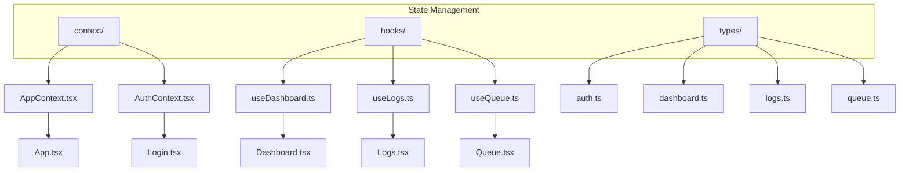
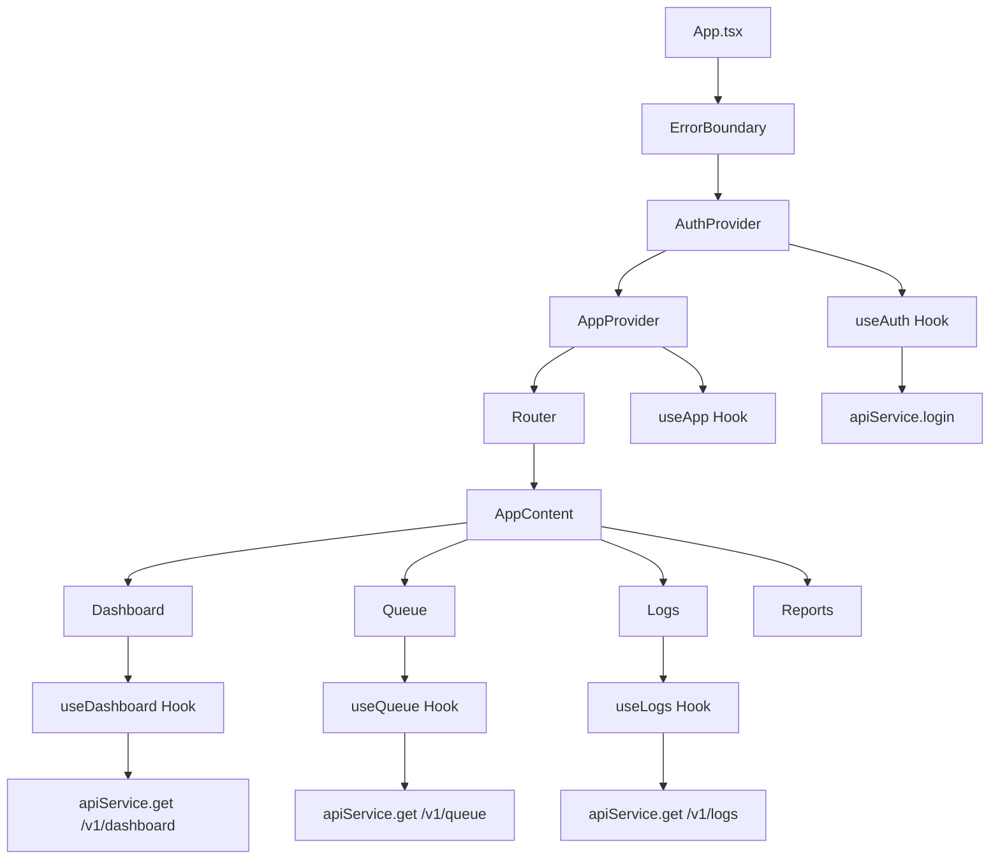
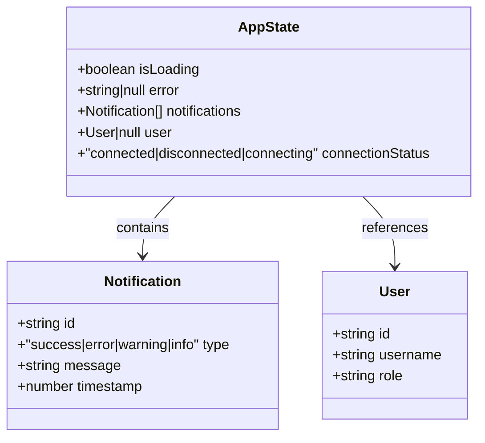
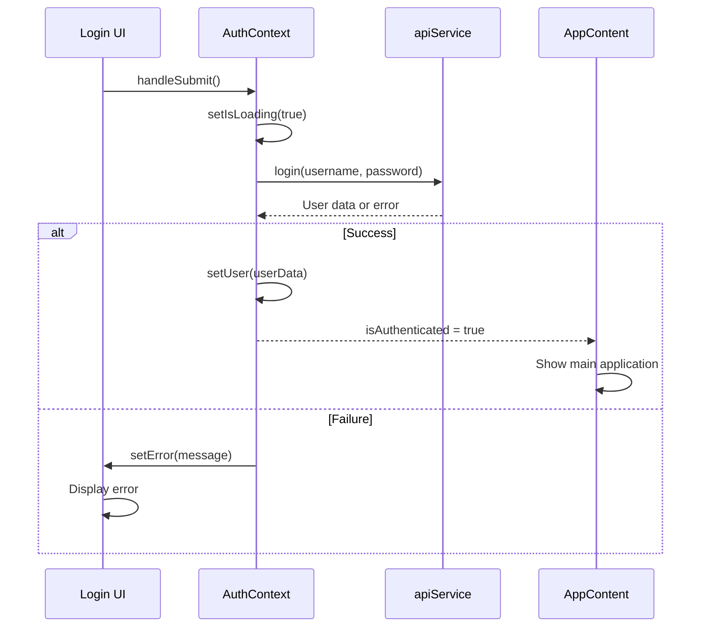
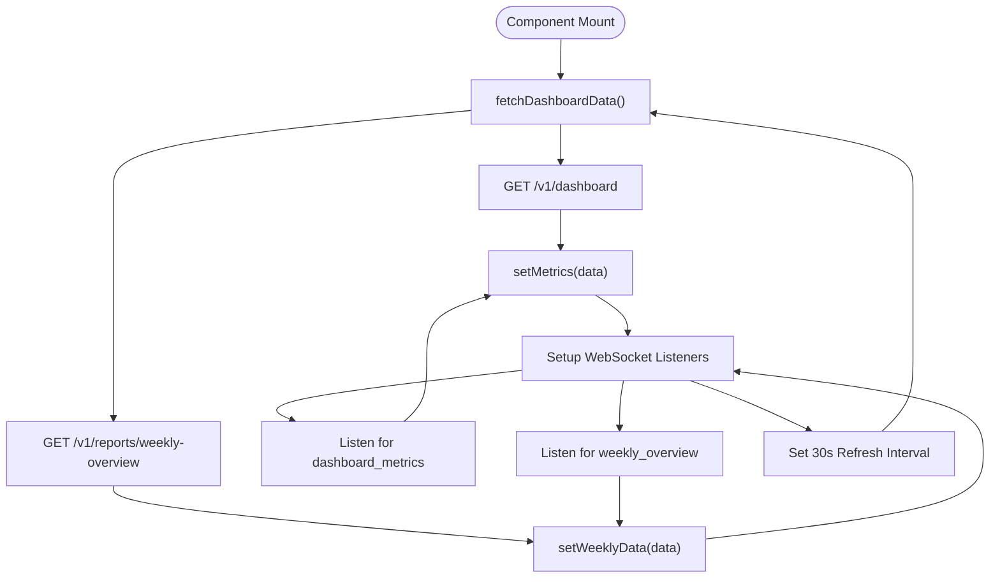
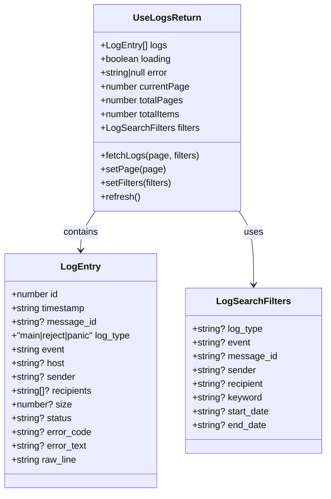
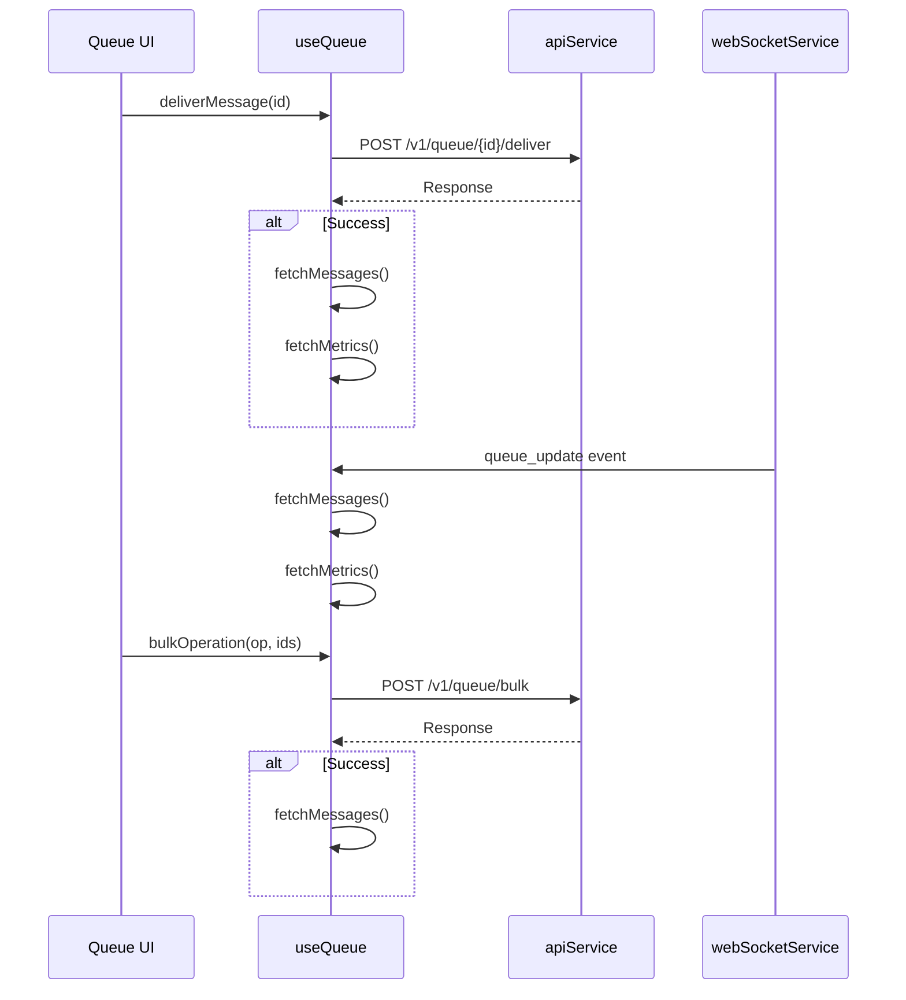
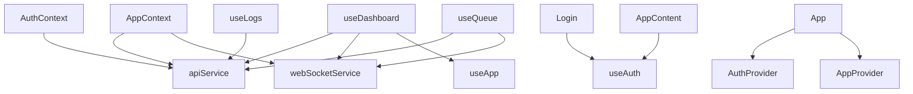

# State Management and Context API


## Table of Contents
1. [Introduction](#introduction)
2. [Project Structure](#project-structure)
3. [Core Components](#core-components)
4. [Architecture Overview](#architecture-overview)
5. [Detailed Component Analysis](#detailed-component-analysis)
6. [Dependency Analysis](#dependency-analysis)
7. [Performance Considerations](#performance-considerations)
8. [Troubleshooting Guide](#troubleshooting-guide)
9. [Conclusion](#conclusion)

## Introduction
This document provides a comprehensive analysis of the frontend state management system in the Exim Pilot application. It details the implementation of React Context API for global state distribution, the design of custom hooks for data fetching and local state management, and the flow of authentication state across components. The documentation is structured to be accessible to both technical and non-technical users, with clear explanations, code examples, and visual diagrams.

## Project Structure
The frontend state management system is organized into three main directories: `context`, `hooks`, and `types`. The `context` directory contains global state providers, `hooks` encapsulates data logic, and `types` defines shared interfaces.





**Diagram sources**
- [AppContext.tsx](file://web/src/context/AppContext.tsx)
- [AuthContext.tsx](file://web/src/context/AuthContext.tsx)
- [useDashboard.ts](file://web/src/hooks/useDashboard.ts)
- [useLogs.ts](file://web/src/hooks/useLogs.ts)
- [useQueue.ts](file://web/src/hooks/useQueue.ts)

**Section sources**
- [AppContext.tsx](file://web/src/context/AppContext.tsx)
- [AuthContext.tsx](file://web/src/context/AuthContext.tsx)

## Core Components
The core state management components include two context providers (`AppContext` and `AuthContext`) and three custom hooks (`useDashboard`, `useLogs`, `useQueue`). These components work together to manage global application state, authentication, and feature-specific data operations.

**Section sources**
- [AppContext.tsx](file://web/src/context/AppContext.tsx#L1-L146)
- [AuthContext.tsx](file://web/src/context/AuthContext.tsx#L1-L81)

## Architecture Overview
The state management architecture follows a layered approach where context providers wrap the application to make state available globally, while custom hooks encapsulate data fetching and business logic for specific features.





**Diagram sources**
- [App.tsx](file://web/src/App.tsx#L1-L76)
- [AuthContext.tsx](file://web/src/context/AuthContext.tsx#L1-L81)
- [AppContext.tsx](file://web/src/context/AppContext.tsx#L1-L146)

## Detailed Component Analysis

### AppContext Analysis
AppContext manages global application state including loading status, error messages, notifications, user information, and connection status. It uses the `useReducer` hook for predictable state transitions.

#### State Structure




**Diagram sources**
- [AppContext.tsx](file://web/src/context/AppContext.tsx#L6-L25)

#### Action Types
The context supports several action types for state updates:
- `SET_LOADING`: Controls global loading state
- `SET_ERROR`: Displays error messages
- `ADD_NOTIFICATION`: Adds toast notifications
- `REMOVE_NOTIFICATION`: Removes notifications
- `SET_USER`: Updates user information
- `SET_CONNECTION_STATUS`: Tracks WebSocket connectivity

**Section sources**
- [AppContext.tsx](file://web/src/context/AppContext.tsx#L27-L103)

### AuthContext Analysis
AuthContext handles user authentication state, session persistence, and login/logout functionality. It uses `useState` for simple state management and integrates with the API service for authentication operations.

#### Authentication Flow




**Diagram sources**
- [AuthContext.tsx](file://web/src/context/AuthContext.tsx#L1-L81)
- [Login.tsx](file://web/src/components/Auth/Login.tsx#L1-L92)

#### Context Interface
The `AuthContextType` interface defines the contract for authentication functionality:

```typescript
interface AuthContextType {
  user: User | null;
  isAuthenticated: boolean;
  isLoading: boolean;
  login: (username: string, password: string) => Promise<void>;
  logout: () => Promise<void>;
  checkAuth: () => Promise<void>;
}
```


**Section sources**
- [AuthContext.tsx](file://web/src/context/AuthContext.tsx#L70-L81)
- [auth.ts](file://web/src/types/auth.ts#L20-L28)

### Custom Hooks Analysis

#### useDashboard Hook
The `useDashboard` hook manages dashboard data fetching and real-time updates through both API calls and WebSocket connections.





**Diagram sources**
- [useDashboard.ts](file://web/src/hooks/useDashboard.ts#L1-L79)

**Section sources**
- [useDashboard.ts](file://web/src/hooks/useDashboard.ts#L1-L79)

#### useLogs Hook
The `useLogs` hook provides comprehensive log management with search, pagination, and filtering capabilities.





**Diagram sources**
- [useLogs.ts](file://web/src/hooks/useLogs.ts#L1-L110)
- [logs.ts](file://web/src/types/logs.ts#L1-L33)

**Section sources**
- [useLogs.ts](file://web/src/hooks/useLogs.ts#L1-L110)

#### useQueue Hook
The `useQueue` hook manages queue operations including message retrieval, delivery actions, and bulk operations.





**Diagram sources**
- [useQueue.ts](file://web/src/hooks/useQueue.ts#L1-L180)

**Section sources**
- [useQueue.ts](file://web/src/hooks/useQueue.ts#L1-L180)

## Dependency Analysis
The state management system has a clear dependency hierarchy where higher-level components depend on lower-level services and types.





**Diagram sources**
- [AppContext.tsx](file://web/src/context/AppContext.tsx)
- [AuthContext.tsx](file://web/src/context/AuthContext.tsx)
- [useDashboard.ts](file://web/src/hooks/useDashboard.ts)
- [useLogs.ts](file://web/src/hooks/useLogs.ts)
- [useQueue.ts](file://web/src/hooks/useQueue.ts)
- [App.tsx](file://web/src/App.tsx)

**Section sources**
- [AppContext.tsx](file://web/src/context/AppContext.tsx#L1-L146)
- [AuthContext.tsx](file://web/src/context/AuthContext.tsx#L1-L81)

## Performance Considerations
The state management implementation includes several performance optimizations:

1. **Memoization**: Custom hooks use `useCallback` to prevent unnecessary re-creations of functions
2. **Selective Re-renders**: Context consumers only re-render when relevant state changes
3. **Efficient Updates**: State updates are batched and use immutable patterns
4. **Cleanup**: Event listeners and intervals are properly cleaned up in `useEffect` cleanup functions
5. **Conditional Fetching**: Data fetching is controlled through options like `autoFetch` and `autoRefresh`

To avoid unnecessary re-renders, components should:
- Use memoized selectors when only part of the context state is needed
- Wrap context consumers in `React.memo` when appropriate
- Avoid spreading context values directly into components

**Section sources**
- [useDashboard.ts](file://web/src/hooks/useDashboard.ts#L20-L24)
- [useLogs.ts](file://web/src/hooks/useLogs.ts#L45-L48)
- [useQueue.ts](file://web/src/hooks/useQueue.ts#L25-L28)

## Troubleshooting Guide
Common issues and their solutions:

**Authentication State Not Persisting**
- Ensure `checkAuth()` is called on application mount
- Verify API endpoint `/v1/auth/me` returns correct user data
- Check browser storage for session tokens

**Context Not Available Error**
- Verify component is wrapped within the appropriate provider
- Check for typos in context names
- Ensure `useContext` is not called outside of provider scope

**Unnecessary Re-renders**
- Use `React.memo` for components that receive context values
- Extract context consumers into separate components
- Use granular state management when possible

**WebSocket Connection Issues**
- Verify authentication occurs before WebSocket connection
- Check network connectivity and firewall settings
- Ensure WebSocket URL is correctly configured

**Section sources**
- [AuthContext.tsx](file://web/src/context/AuthContext.tsx#L30-L38)
- [App.tsx](file://web/src/App.tsx#L15-L25)
- [useDashboard.ts](file://web/src/hooks/useDashboard.ts#L50-L55)

## Conclusion
The state management system in Exim Pilot effectively uses React Context API and custom hooks to provide a scalable solution for global state management. The architecture separates concerns between global application state (AppContext), authentication state (AuthContext), and feature-specific data operations (custom hooks). This approach enables maintainable code, efficient data fetching, and responsive user interfaces. The implementation follows React best practices for performance and includes proper error handling and cleanup mechanisms.

**Referenced Files in This Document**   
- [AppContext.tsx](file://web/src/context/AppContext.tsx)
- [AuthContext.tsx](file://web/src/context/AuthContext.tsx)
- [useDashboard.ts](file://web/src/hooks/useDashboard.ts)
- [useLogs.ts](file://web/src/hooks/useLogs.ts)
- [useQueue.ts](file://web/src/hooks/useQueue.ts)
- [App.tsx](file://web/src/App.tsx)
- [Login.tsx](file://web/src/components/Auth/Login.tsx)
- [auth.ts](file://web/src/types/auth.ts)
- [dashboard.ts](file://web/src/types/dashboard.ts)
- [logs.ts](file://web/src/types/logs.ts)
- [queue.ts](file://web/src/types/queue.ts)