# Service Layer and API Integration

## Table of Contents
1. [Introduction](#introduction)
2. [Project Structure](#project-structure)
3. [Core Components](#core-components)
4. [Architecture Overview](#architecture-overview)
5. [Detailed Component Analysis](#detailed-component-analysis)
6. [Dependency Analysis](#dependency-analysis)
7. [Performance Considerations](#performance-considerations)
8. [Troubleshooting Guide](#troubleshooting-guide)
9. [Conclusion](#conclusion)

## Introduction
The exim-pilot frontend service layer provides a robust interface between the React-based UI and the Go backend API. This document details the implementation of REST API communication, WebSocket integration for real-time updates, type safety through TypeScript, and comprehensive error handling strategies. The architecture emphasizes maintainability, scalability, and user experience through well-structured services and reusable components.

## Project Structure
The frontend service layer is organized within the `web/src/services` directory, containing dedicated modules for API communication and WebSocket functionality. The structure follows a clean separation of concerns, with services handling data operations, types ensuring type safety, and components consuming these services.

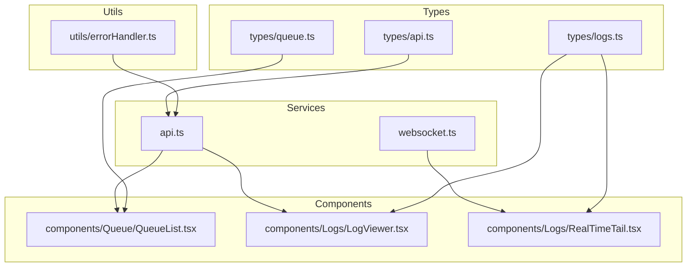

**Diagram sources**
- [api.ts](file://web/src/services/api.ts)
- [websocket.ts](file://web/src/services/websocket.ts)
- [QueueList.tsx](file://web/src/components/Queue/QueueList.tsx)
- [LogViewer.tsx](file://web/src/components/Logs/LogViewer.tsx)
- [RealTimeTail.tsx](file://web/src/components/Logs/RealTimeTail.tsx)

**Section sources**
- [api.ts](file://web/src/services/api.ts)
- [websocket.ts](file://web/src/services/websocket.ts)

## Core Components
The service layer consists of two primary components: `APIService` for REST API communication and `WebSocketService` for real-time data streaming. These services are implemented as singleton instances (`apiService` and `webSocketService`) to ensure consistent configuration and state management across the application.

**Section sources**
- [api.ts](file://web/src/services/api.ts#L1-L118)
- [websocket.ts](file://web/src/services/websocket.ts#L1-L164)

## Architecture Overview
The architecture follows a layered pattern with clear separation between service logic, data types, and UI components. The APIService handles all HTTP requests to the Go backend, while WebSocketService manages real-time updates for log tailing and queue monitoring. Type safety is enforced through TypeScript interfaces, and error handling is centralized in the errorHandler module.

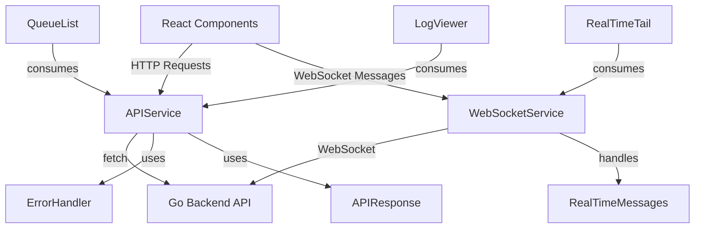

**Diagram sources**
- [api.ts](file://web/src/services/api.ts#L1-L118)
- [websocket.ts](file://web/src/services/websocket.ts#L1-L164)
- [QueueList.tsx](file://web/src/components/Queue/QueueList.tsx#L1-L504)
- [LogViewer.tsx](file://web/src/components/Logs/LogViewer.tsx#L1-L338)
- [RealTimeTail.tsx](file://web/src/components/Logs/RealTimeTail.tsx#L1-L387)

## Detailed Component Analysis

### APIService Analysis
The APIService class provides a wrapper around the Fetch API for communicating with the Go backend. It handles request configuration, response parsing, and error handling in a consistent manner.

#### Request Configuration and Interceptors
The service implements automatic request configuration through its private `request` method, which sets default headers and credentials. The `credentials: 'include'` setting ensures that session cookies are sent with every request, enabling stateful authentication.

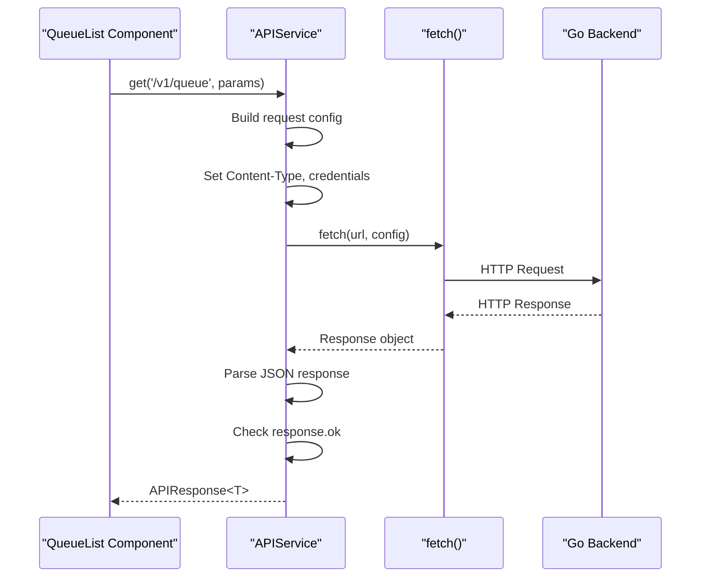

**Diagram sources**
- [api.ts](file://web/src/services/api.ts#L20-L80)

**Section sources**
- [api.ts](file://web/src/services/api.ts#L1-L118)

#### Authentication Token Management
Authentication is handled through session cookies rather than bearer tokens. The service automatically includes cookies in requests via `credentials: 'include'`. The login method specifically includes credentials to establish the session.

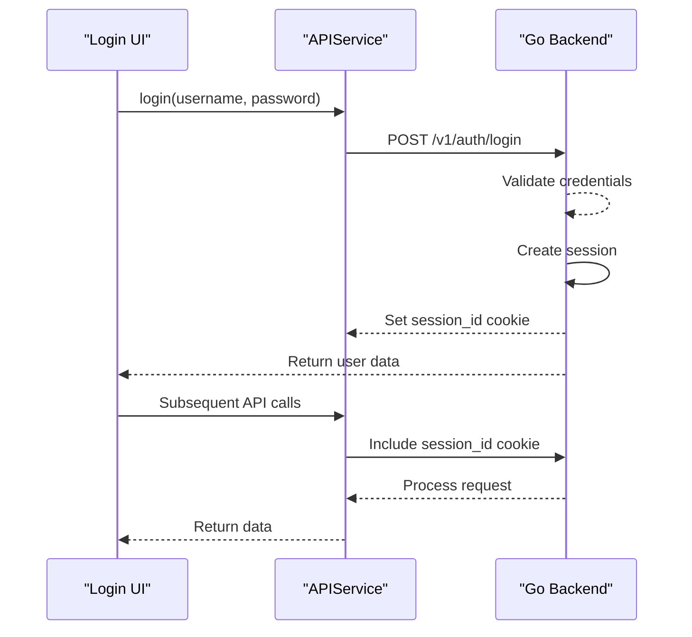

**Diagram sources**
- [api.ts](file://web/src/services/api.ts#L86-L118)
- [auth_handlers.go](file://internal/api/auth_handlers.go#L48-L100)

**Section sources**
- [api.ts](file://web/src/services/api.ts#L86-L118)
- [auth_handlers.go](file://internal/api/auth_handlers.go#L48-L100)

### WebSocketService Analysis
The WebSocketService provides real-time communication for log tailing and queue updates, implementing connection management, reconnection logic, and message handling.

#### Connection and Reconnection Logic
The service implements robust connection management with automatic reconnection attempts and exponential backoff.

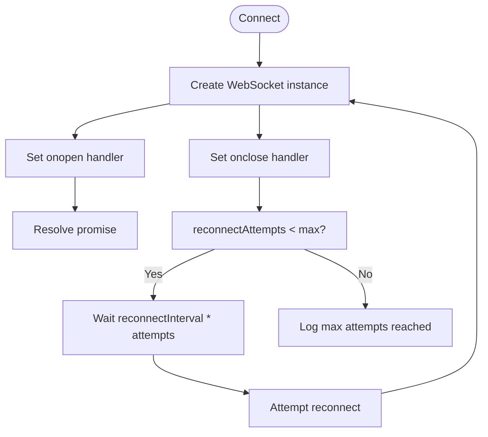

**Diagram sources**
- [websocket.ts](file://web/src/services/websocket.ts#L30-L75)

**Section sources**
- [websocket.ts](file://web/src/services/websocket.ts#L1-L164)

#### Real-Time Log Tailing Implementation
The RealTimeTail component uses WebSocket subscriptions to receive live log entries, implementing client-side filtering and performance optimizations.

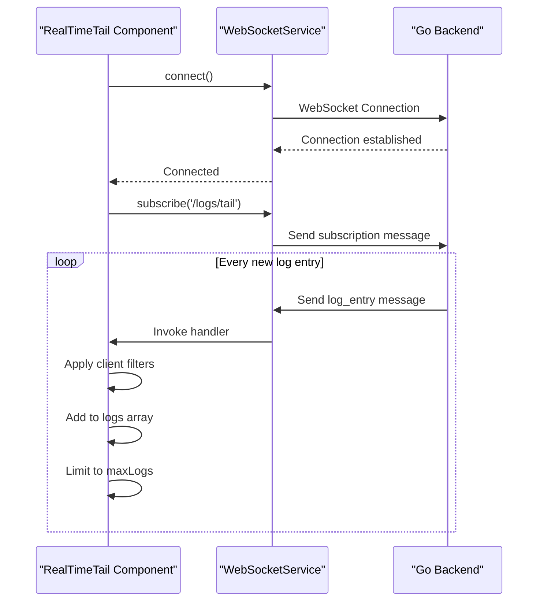

**Diagram sources**
- [websocket.ts](file://web/src/services/websocket.ts#L1-L164)
- [RealTimeTail.tsx](file://web/src/components/Logs/RealTimeTail.tsx#L1-L387)

**Section sources**
- [websocket.ts](file://web/src/services/websocket.ts#L1-L164)
- [RealTimeTail.tsx](file://web/src/components/Logs/RealTimeTail.tsx#L1-L387)

### Type Safety Analysis
TypeScript interfaces ensure type safety throughout the service layer, providing compile-time validation of API responses and data structures.

#### API Response Structure
The APIResponse interface standardizes the format of all API responses, ensuring consistent error handling and data access.

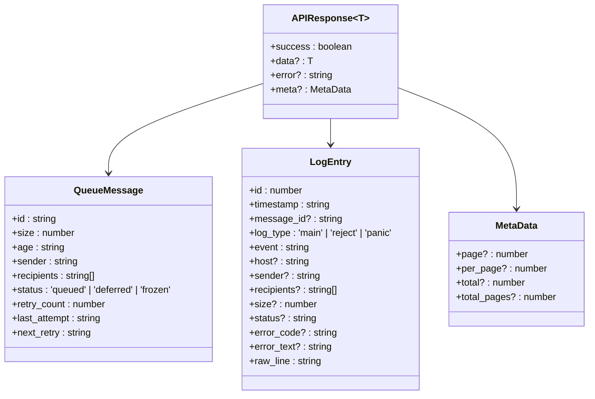

**Diagram sources**
- [api.ts](file://web/src/types/api.ts#L1-L18)
- [queue.ts](file://web/src/types/queue.ts#L1-L97)
- [logs.ts](file://web/src/types/logs.ts#L1-L33)

**Section sources**
- [api.ts](file://web/src/types/api.ts#L1-L18)
- [queue.ts](file://web/src/types/queue.ts#L1-L97)
- [logs.ts](file://web/src/types/logs.ts#L1-L33)

### Error Handling Analysis
The error handling system provides a consistent approach to managing API errors, network issues, and authentication problems.

#### Error Handling Flow
The errorHandler module transforms various error types into a standardized AppError format for consistent handling.

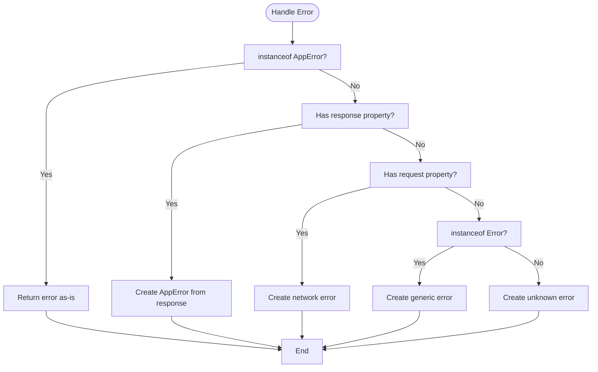

**Diagram sources**
- [errorHandler.ts](file://web/src/utils/errorHandler.ts#L1-L83)

**Section sources**
- [errorHandler.ts](file://web/src/utils/errorHandler.ts#L1-L83)

### Component Integration Examples

#### QueueList API Integration
The QueueList component demonstrates pagination, sorting, and real-time updates through API service integration.

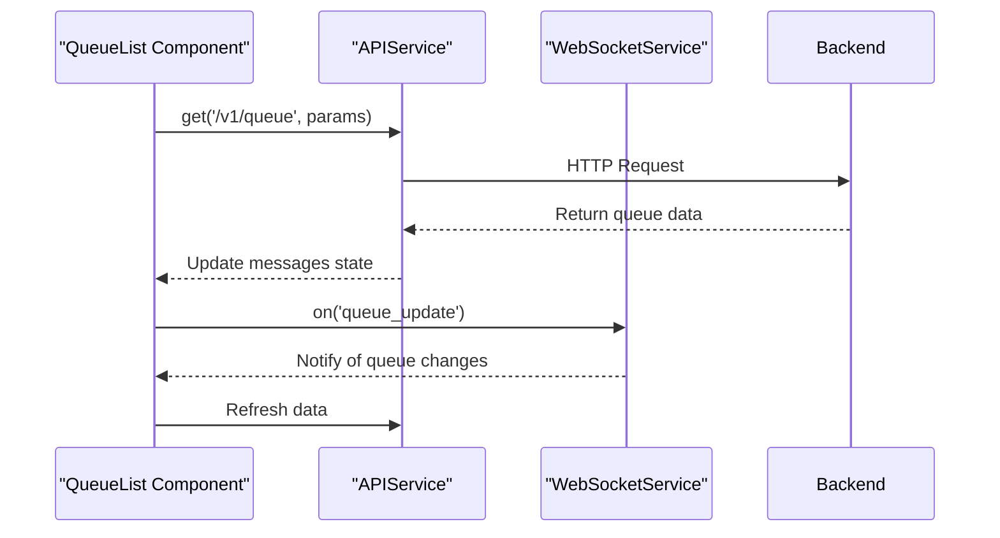

**Diagram sources**
- [QueueList.tsx](file://web/src/components/Queue/QueueList.tsx#L1-L504)
- [api.ts](file://web/src/services/api.ts#L1-L118)
- [websocket.ts](file://web/src/services/websocket.ts#L1-L164)

**Section sources**
- [QueueList.tsx](file://web/src/components/Queue/QueueList.tsx#L1-L504)

#### LogViewer API Integration
The LogViewer component implements search, filtering, and export functionality using the APIService.

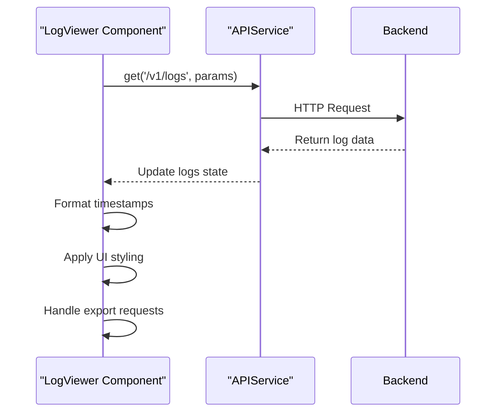

**Diagram sources**
- [LogViewer.tsx](file://web/src/components/Logs/LogViewer.tsx#L1-L338)
- [api.ts](file://web/src/services/api.ts#L1-L118)

**Section sources**
- [LogViewer.tsx](file://web/src/components/Logs/LogViewer.tsx#L1-L338)

## Dependency Analysis
The service layer dependencies form a clean hierarchy with minimal circular references. Services depend on types and utilities, while components depend on services.

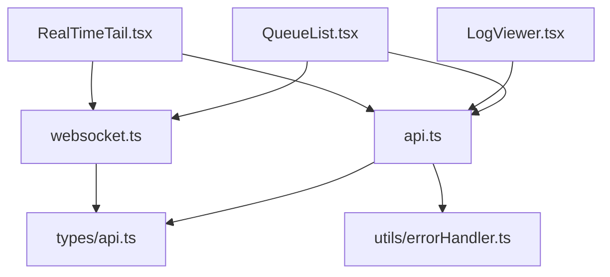

**Diagram sources**
- [api.ts](file://web/src/services/api.ts)
- [websocket.ts](file://web/src/services/websocket.ts)
- [QueueList.tsx](file://web/src/components/Queue/QueueList.tsx)
- [LogViewer.tsx](file://web/src/components/Logs/LogViewer.tsx)
- [RealTimeTail.tsx](file://web/src/components/Logs/RealTimeTail.tsx)

**Section sources**
- [api.ts](file://web/src/services/api.ts)
- [websocket.ts](file://web/src/services/websocket.ts)

## Performance Considerations
The service layer implements several performance optimizations:

1. **Lazy Loading**: The QueueList component uses lazy loading for virtualized lists to improve rendering performance with large datasets.
2. **Client-Side Filtering**: RealTimeTail applies filters on the client side to reduce processing overhead.
3. **Connection Reuse**: WebSocket connections are maintained and reused rather than recreated.
4. **Memory Management**: RealTimeTail limits the number of stored log entries to prevent memory issues.
5. **Efficient Rendering**: Components use React's useCallback and useMemo hooks to prevent unnecessary re-renders.

## Troubleshooting Guide
Common issues and their solutions:

**Section sources**
- [api.ts](file://web/src/services/api.ts#L1-L118)
- [websocket.ts](file://web/src/services/websocket.ts#L1-L164)
- [errorHandler.ts](file://web/src/utils/errorHandler.ts#L1-L83)

### API Request Failures
- **Network Error**: Check internet connection and server availability
- **401 Unauthorized**: User session has expired; prompt for re-login
- **500 Server Error**: Check backend logs for specific error details
- **CORS Issues**: Ensure backend is configured to accept requests from the frontend origin

### WebSocket Connection Issues
- **Connection Failed**: Verify server WebSocket endpoint is accessible
- **Frequent Reconnections**: Check network stability and server load
- **No Real-Time Updates**: Verify subscription messages are being sent and received

### Authentication Problems
- **Login Fails**: Verify username/password and account status
- **Session Expiration**: Implement session refresh mechanism
- **Cookie Issues**: Ensure browser allows third-party cookies if applicable

## Conclusion
The service layer of exim-pilot provides a robust foundation for frontend-backend communication, featuring a well-structured API service, real-time WebSocket integration, comprehensive type safety, and consistent error handling. The implementation follows best practices for maintainability and scalability, with clear separation of concerns and reusable components. Future enhancements could include request caching, more sophisticated retry logic, and enhanced offline capabilities.

**Referenced Files in This Document**   
- [api.ts](file://web/src/services/api.ts)
- [websocket.ts](file://web/src/services/websocket.ts)
- [api.ts](file://web/src/types/api.ts)
- [errorHandler.ts](file://web/src/utils/errorHandler.ts)
- [QueueList.tsx](file://web/src/components/Queue/QueueList.tsx)
- [LogViewer.tsx](file://web/src/components/Logs/LogViewer.tsx)
- [RealTimeTail.tsx](file://web/src/components/Logs/RealTimeTail.tsx)
- [logs.ts](file://web/src/types/logs.ts)
- [queue.ts](file://web/src/types/queue.ts)
- [auth_handlers.go](file://internal/api/auth_handlers.go)