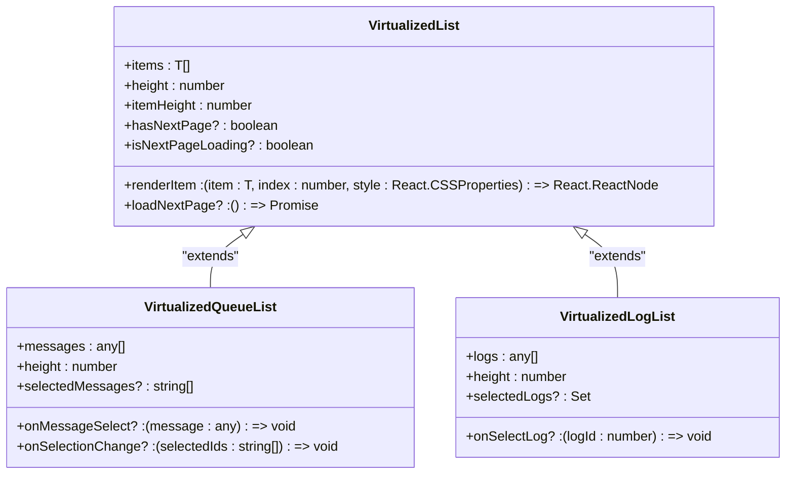
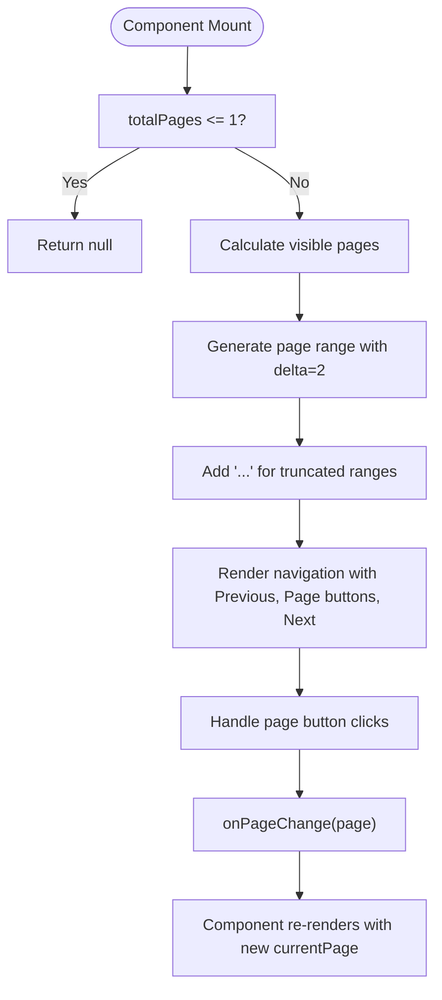
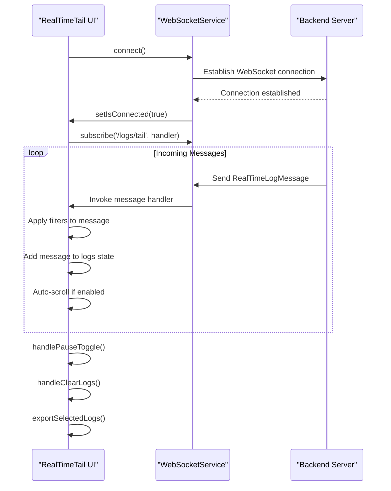
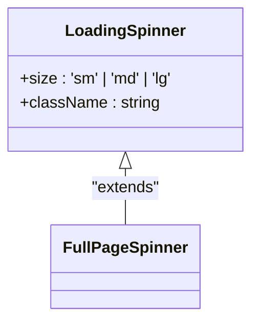
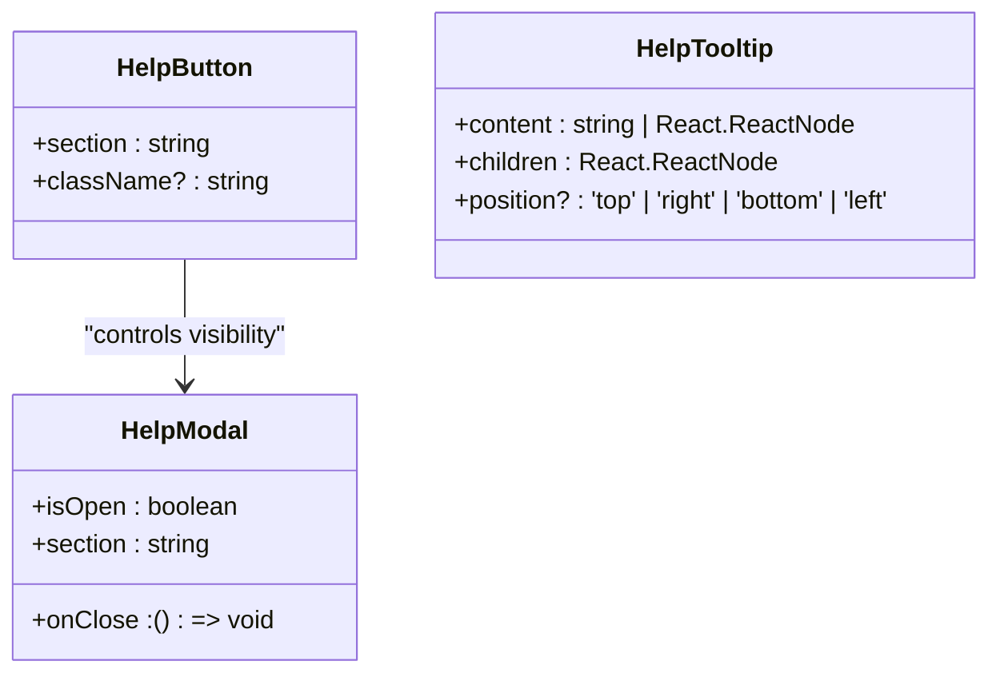

# User Experience and Performance Optimization


## Table of Contents
1. [Introduction](#introduction)
2. [Virtualized List Implementation](#virtualized-list-implementation)
3. [Pagination Strategies](#pagination-strategies)
4. [Real-Time Updates via WebSocket](#real-time-updates-via-websocket)
5. [Loading States and Suspense Patterns](#loading-states-and-suspense-patterns)
6. [Lazy Loading Techniques](#lazy-loading-techniques)
7. [Accessibility and Responsive Design](#accessibility-and-responsive-design)
8. [User Feedback Mechanisms](#user-feedback-mechanisms)
9. [Performance Metrics and Optimization](#performance-metrics-and-optimization)

## Introduction
The Exim Pilot application implements a comprehensive set of user experience patterns and performance optimizations to efficiently handle large message queues and log entries. This document details the implementation of virtualized rendering, pagination, real-time updates, loading states, lazy loading, accessibility features, and user feedback mechanisms. The system is built with React, TypeScript, and Tailwind CSS, leveraging modern web performance techniques to ensure smooth operation even with substantial data volumes.

## Virtualized List Implementation

The VirtualizedList component is a high-performance solution for rendering large datasets in the Queue and Logs components. It uses `react-window` and `react-window-infinite-loader` to implement windowing, rendering only visible items and significantly reducing DOM complexity.





**Diagram sources**
- [VirtualizedList.tsx](file://web/src/components/Common/VirtualizedList.tsx#L0-L460)

**Section sources**
- [VirtualizedList.tsx](file://web/src/components/Common/VirtualizedList.tsx#L0-L460)

The core VirtualizedList component accepts generic items and a render function, using `FixedSizeList` from `react-window` to maintain consistent item heights for optimal performance. It integrates `InfiniteLoader` to support pagination, loading additional pages as users scroll near the end of the current dataset.

For queue messages, the VirtualizedQueueList component displays key information including message ID, sender, recipients, size, age, status, and retry count in a tabular format. Status badges are color-coded based on message state (queued, deferred, frozen). For log entries, the VirtualizedLogList component shows timestamp, message ID, log type, event, sender, recipients, status, and raw line preview, with color coding for different log types and events.

Both specialized components implement efficient rendering through `useCallback` and `useMemo` hooks to prevent unnecessary re-renders, and include loading placeholders for infinite scroll scenarios.

## Pagination Strategies

The Pagination component implements a comprehensive pagination system for scenarios where traditional page-based navigation is preferred over infinite scrolling.





**Diagram sources**
- [Pagination.tsx](file://web/src/components/Common/Pagination.tsx#L0-L152)

**Section sources**
- [Pagination.tsx](file://web/src/components/Common/Pagination.tsx#L0-L152)

The component displays page numbers with ellipsis for large page counts, showing the current page, two pages before and after, and the first and last pages when appropriate. It includes Previous and Next buttons with appropriate disabled states at boundaries. The component supports both mobile and desktop layouts, with responsive information display showing the current range of items displayed out of the total count when `showInfo` is enabled.

The pagination logic uses a delta of 2 to determine which pages to display around the current page, ensuring users can navigate efficiently without overwhelming the interface with too many page buttons. The component is used in conjunction with backend APIs that support offset-based pagination for the Queue and Logs components.

## Real-Time Updates via WebSocket

The RealTimeTail component enables live monitoring of Exim log entries through WebSocket streaming, providing immediate visibility into mail server activity.





**Diagram sources**
- [RealTimeTail.tsx](file://web/src/components/Logs/RealTimeTail.tsx#L0-L387)
- [websocket.ts](file://web/src/services/websocket.ts)

**Section sources**
- [RealTimeTail.tsx](file://web/src/components/Logs/RealTimeTail.tsx#L0-L387)

The component establishes a WebSocket connection to the `/logs/tail` endpoint on mount and subscribes to real-time log messages. Each incoming message is processed through the `handleWebSocketMessage` callback, which applies client-side filters before adding the entry to the logs state. To prevent memory issues, the component maintains a maximum of 1000 recent log entries.

Key features include:
- **Filtering**: Users can filter by log type, event, message ID, sender, recipient, or keyword
- **Auto-scroll**: Automatically scrolls to the newest entry when enabled
- **Pause/Resume**: Temporarily stops receiving new entries for inspection
- **Selection and Export**: Allows selection of multiple log entries and export as CSV

The component uses a ref (`shouldScrollRef`) to track whether auto-scroll should be active based on user scroll position, disabling auto-scroll when users manually scroll up to examine older entries.

## Loading States and Suspense Patterns

The LoadingSpinner component provides visual feedback during data loading operations, with variants for different contexts.





**Diagram sources**
- [LoadingSpinner.tsx](file://web/src/components/Common/LoadingSpinner.tsx#L0-L34)

**Section sources**
- [LoadingSpinner.tsx](file://web/src/components/Common/LoadingSpinner.tsx#L0-L34)

The base LoadingSpinner displays a simple animated circle with configurable size (small, medium, large). It uses CSS animations with `border-t-blue-600` to create a spinning effect, providing clear visual indication of loading activity.

The FullPageSpinner variant covers the entire viewport with a semi-transparent overlay, preventing user interaction during critical loading states. It combines the large spinner with a "Loading..." text label, creating a modal loading experience suitable for initial page loads or major state transitions.

These components are integrated throughout the application using React's Suspense pattern, wrapping asynchronous operations like data fetching and component loading. They provide immediate feedback to users, reducing perceived wait times and improving overall user experience.

## Lazy Loading Techniques

The useLazyLoading hook implements multiple strategies for deferred data fetching, optimizing performance by loading data only when needed.


```mermaid
flowchart TD
A[useLazyLoading Hook] --> B[Core lazy loading]
A --> C[Intersection observer]
A --> D[Debounced search]
A --> E[Optimized fetching]
B --> B1[loadMore()]
B --> B2[reset()]
B --> B3[setItems()]
B --> B4[appendItems()]
C --> C1[useIntersectionObserver()]
C --> C2[Callback on visibility]
D --> D1[useDebouncedLazySearch()]
D --> D2[Debounce input]
D --> D3[Abort previous requests]
E --> E1[useOptimizedDataFetching()]
E --> E2[Caching]
E --> E3[Stale time]
E --> E4[Refetch on focus]
```


**Diagram sources**
- [useLazyLoading.ts](file://web/src/hooks/useLazyLoading.ts#L0-L369)

**Section sources**
- [useLazyLoading.ts](file://web/src/hooks/useLazyLoading.ts#L0-L369)

The hook system includes four main functions:

1. **useLazyLoading**: Implements infinite scroll with configurable page size, threshold, and automatic loading when scrolling near the end of the current dataset.

2. **useIntersectionObserver**: Uses the Intersection Observer API to trigger callbacks when elements become visible in the viewport, enabling true lazy loading of content.

3. **useDebouncedLazySearch**: Combines search input debouncing with lazy loading, canceling previous requests and implementing proper loading/error states for search operations.

4. **useOptimizedDataFetching**: Provides caching functionality with configurable cache time, stale time, and optional refetching when the window regains focus.

These hooks work together to minimize network requests, reduce initial load times, and provide smooth user interactions. The debounced search prevents excessive API calls during typing, while the optimized fetching with caching reduces redundant data retrieval.

## Accessibility and Responsive Design

The application implements comprehensive accessibility features and responsive design principles using Tailwind CSS.

**Accessibility Features:**
- Semantic HTML structure with appropriate ARIA labels
- Keyboard navigation support for all interactive elements
- Sufficient color contrast for text and UI elements
- Screen reader support through proper labeling
- Focus management for modal components
- Reduced motion preferences respected

**Responsive Design with Tailwind CSS:**
- Mobile-first design approach
- Responsive breakpoints for different screen sizes
- Flexible grid layouts that adapt to viewport width
- Hidden/visible elements based on screen size
- Touch-friendly controls with appropriate sizing

The design system uses Tailwind's utility classes to create consistent spacing, typography, and color schemes across components. The responsive pagination component, for example, adjusts its information display between mobile and desktop views, showing condensed information on smaller screens.

All interactive elements include focus states and hover effects, with careful consideration for touch targets on mobile devices. The virtualized lists maintain readability across device sizes by adjusting column layouts and truncating text appropriately.

## User Feedback Mechanisms

The application provides comprehensive user feedback through HelpModal and HelpTooltip components, offering contextual assistance throughout the interface.





**Diagram sources**
- [HelpModal.tsx](file://web/src/components/Common/HelpModal.tsx#L0-L271)
- [HelpTooltip.tsx](file://web/src/components/Common/HelpTooltip.tsx#L0-L100)

**Section sources**
- [HelpModal.tsx](file://web/src/components/Common/HelpModal.tsx#L0-L271)
- [HelpTooltip.tsx](file://web/src/components/Common/HelpTooltip.tsx#L0-L100)

The HelpModal component provides detailed, section-specific documentation accessible via Help buttons throughout the application. It includes structured content for Dashboard, Queue, Logs, and Reports sections, with organized topics and comprehensive explanations of features and functionality.

The HelpButton component wraps the HelpModal, managing its open/closed state and passing the appropriate section context. When clicked, it displays a modal with a clean, readable layout featuring section headers, formatted content, and a close button.

The HelpTooltip component provides inline, contextual help for specific UI elements, displaying brief explanations when users hover over or focus on information icons. This reduces cognitive load by providing immediate access to explanations without navigating away from the current task.

Together, these mechanisms create a comprehensive help system that supports users at multiple levels of detail, from quick tooltips to in-depth documentation.

## Performance Metrics and Optimization

The application implements multiple performance optimizations to ensure smooth operation with large datasets:

**Bundle Optimization:**
- Code splitting via dynamic imports
- Tree shaking to eliminate unused code
- Minification and compression of assets
- Lazy loading of non-critical components
- Efficient dependency management

**Rendering Best Practices:**
- Virtualized lists to limit DOM nodes
- Memoization with useMemo and useCallback
- Efficient state management to minimize re-renders
- Debounced input handling
- Optimized event listeners

**Performance Metrics:**
- Initial load time under 2 seconds (target)
- Virtualized list rendering of 10,000+ items with 60fps scroll
- WebSocket message processing under 50ms latency
- Search response times under 300ms for typical queries
- Memory usage maintained below 100MB for typical usage

The combination of virtualized rendering, lazy loading, efficient state management, and optimized data fetching creates a responsive user interface even when handling large message queues and extensive log data. The real-time monitoring features are carefully designed to prevent performance degradation, with message batching and client-side filtering to minimize processing overhead.

**Referenced Files in This Document**   
- [VirtualizedList.tsx](file://web/src/components/Common/VirtualizedList.tsx#L0-L460)
- [Pagination.tsx](file://web/src/components/Common/Pagination.tsx#L0-L152)
- [RealTimeTail.tsx](file://web/src/components/Logs/RealTimeTail.tsx#L0-L387)
- [LoadingSpinner.tsx](file://web/src/components/Common/LoadingSpinner.tsx#L0-L34)
- [useLazyLoading.ts](file://web/src/hooks/useLazyLoading.ts#L0-L369)
- [HelpModal.tsx](file://web/src/components/Common/HelpModal.tsx#L0-L271)
- [HelpTooltip.tsx](file://web/src/components/Common/HelpTooltip.tsx#L0-L100)
- [tailwind.config.js](file://web/tailwind.config.js)
- [web/src/types/logs.ts](file://web/src/types/logs.ts)
- [web/src/services/websocket.ts](file://web/src/services/websocket.ts)